<!-- Design Documents often contain forward-looking statements -->
<!-- vale gitlab.FutureTense = NO -->

## 背景

Artifact Registry は次の点を考慮したデータベース構成を必要とします。

- **異なるアクセスパターン**: アーティファクト管理クライアントは独自のプロトコルを使用し、それらはフォーマット間で大きく異なります。
- **スケーラビリティ**: アーティファクトストレージはすぐに数百万行に達する可能性があります。
- **パフォーマンス**: 上記の 2 点を踏まえても、操作の大部分を占める読み取りクエリで高速な実行時間を維持したいです。
- **過去の落とし穴**: 現在のコンテナレジストリとパッケージレジストリのデータ構成にはほころびが見え始めており（[例](https://gitlab.com/groups/gitlab-org/-/work_items/16000)、[例](https://gitlab.com/groups/gitlab-org/-/epics/9415)）、ここではそれを回避します。

決定に踏み込む前に、以下のスキーマに関するいくつかの注意点を述べます。これらは主に、提示するテーブルの量を踏まえた可読性向上のためです。

- 本ドキュメントは機能のコアテーブルを記述します。サブ機能には追加のテーブルが必要ですが、ここでは記述しません。例えば、Blob ストレージのクリーンアップに必要な補助テーブルの背景については [Cleanup tasks](#cleanup-tasks) を参照してください。
- 可読性のためにテーブル名を短縮しています。これらはここに示されていない共通の接頭辞を共有します（例: `artifacts_registry_container_repositories`）。
- Artifact Registry は namespace にスコープされます。理由は [ADR-001](001_organizations_as_anchor_point.md) を参照してください。
- プライマリキーやタイムスタンプといういくつかの共通カラムは、明確化のため省略されています。
- すべてのテーブルに `namespace_id` カラムが含まれます。[Cells シャーディングキー要件](https://docs.gitlab.com/ee/development/database/multiple_databases/#guidelines-on-choosing-a-sharding-key) はサテライトサービスデータベースには適用されません。行は namespace のアンカータプル（`platform`、`entity_type`、`entity_id`）を介して間接的に Organization に按分されます。このカラムは以下のすべてのテーブル定義で明示的に示されています。
- すべての `jsonb` カラムは、無制限のペイロードを防ぎ期待される構造を強制するため、永続化前に厳格な JSON スキーマに対して検証する必要があります。これは本ドキュメント内のすべての `jsonb` カラム（例: `rule_configuration` および `package_json`）に適用されます。
- テーブルが複数の暗号化された認証情報カラム（例: リモートリポジトリテーブルの `encrypted_username` と `encrypted_password`）を持つ場合、CHECK 制約により、すべての認証情報カラムが設定されているか、すべて設定されていないかのどちらかを強制する必要があります — 部分的な認証情報（例: パスワードなしのユーザー名）は受け入れません。
- リモートリポジトリテーブルの暗号化された認証情報カラム（`encrypted_username`、`encrypted_password`、`encrypted_auth_token`）は、暗号化前に Go の検証層で平文入力を 2048 文字に制限します。この上限は平文に対するもので、平文はアプリケーション層にのみ存在します。データベースは `bytea` の暗号文しか見えないため、DB 側の CHECK（例: `octet_length(...) <= N`）は、暗号化スキームの固定オーバーヘッド（IV、認証タグ、key-id ヘッダ）を介してしか平文を間接的に制限できず、上限の近似にしかならず、必須の Go チェックと冗長になります。CHECK を省略することで、スキームを暗号フレーミングから切り離すことにもつながり、暗号、key-id レイアウト、エンベロープ構造の変更でスキーママイグレーションが不要になります。
- すべての `id` カラムは Artifact Registry インスタンスのスコープ内で一意でなければなりません。`namespaces.id` は UUIDv7（[RFC 9562](https://datatracker.ietf.org/doc/rfc9562/)）を使用してすべての Artifact Registry デプロイメントを横断するグローバルな一意性を保証します — 完全な根拠（PostgreSQL バージョン横断で利用可能な生成パスを含む）は [Namespace ID type](#namespace-id-type) を参照してください。その他のすべての `id` カラムは `bigint DEFAULT nextval('<table>_id_seq')` で、論理レプリケーション互換性を保ちます（[出典](https://gitlab.com/gitlab-com/gl-infra/data-access/dbo/dbo-issue-tracker/-/work_items/691#note_3309931104)）。それらの一意性は単一の Artifact Registry データベース内でローカルに強制されますが、常に namespace 配下にスコープされるため十分です。

## 決定

データには 6 つの領域があります。

- [Namespace テーブル](#namespaces). Artifact Registry を外部識別子から切り離すため、不変なスラグと仮想アンカータプルを持つ内部 namespace エンティティを導入します。完全な根拠については [ADR-022](022_namespace_decoupling.md) を参照してください。
- [Repository collections テーブル](#repository-collections). Namespace 内のリポジトリの論理的グルーピング。スキーマには初日から存在しますが、ユーザーにはまだ表面化されません — すべての namespace は「default」Repository collection を取得し、すべてのリポジトリが自動的にそれに割り当てられます。
- Namespace レベルのテーブル。これらは namespace に直接スコープされた [ライフサイクルポリシーの設定とルール](#lifecycle-policies) と [namespace レベルのストレージ統計](#storage-usage-calculation) を扱います。
- [Repositories 親テーブル](#repositories). すべてのフォーマットにわたるすべてのリポジトリ（ローカル、仮想、リモート）の統一レジストリ。ランディングページのハイブリッドリストとフォーマット横断クエリを支えます。
- アーティファクトフォーマットレベルのテーブル。各フォーマット用の専用テーブルがあります: ローカルリポジトリ（[Container](#container-repositories)、[Maven](#maven-repositories)、[NPM](#npm-repositories)）、リモートリポジトリ（[Container](#container-remote-repositories)、[Maven](#maven-remote-repositories)、[NPM](#npm-remote-repositories)）、仮想リポジトリ（[Container](#virtual-container-repositories)、[Maven](#maven-virtual-repositories)、[NPM](#npm-virtual-repositories)）。各々は `repository_id` を介して親 `repositories` テーブルを参照します。
- [Blob ストレージレベルテーブル](#blob-storage). 実際のストレージメタデータと[進行中のアップロードセッション追跡](#upload-sessions)を扱います。

### Namespaces

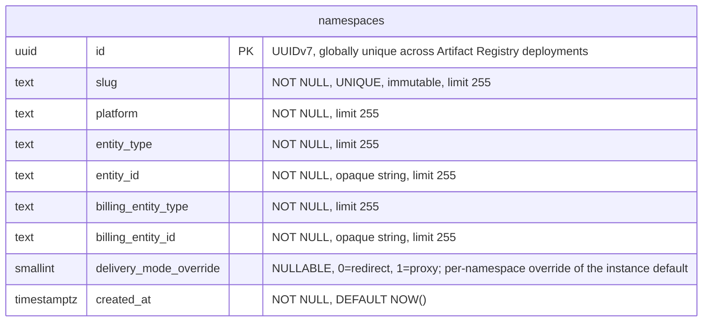

- **namespaces**: 他のすべてのテーブルが `namespace_id` を介して参照するルートエンティティ。各 namespace は、URL とクライアント設定で使用される不変でグローバルに一意な `slug` を持ちます（スラグ設計とグローバル一意性の強制については [ADR-022](022_namespace_decoupling.md) を参照）。`(platform, entity_type, entity_id)` タプルは、namespace を外部エンティティ（デフォルトでは Organizations）にリンクし、そのセマンティクスを解釈しません。`entity_id` は、基礎となる値が数値であっても、anchor タイプ間でスキーマを統一するため `TEXT` として保存されます。Organizations v1 では、すべての行が `('gitlab', 'organization', '<rails_org_id>')` を持ちます。`billing_entity_type` と `billing_entity_id` は使用状況イベントの課金アンカーを識別します。外部から提供されるカラム（`platform`、`entity_type`、`entity_id`、`billing_entity_type`、`billing_entity_id`）はいずれもスキーマレベルのデフォルトを持ちません。根拠については [ADR-022](022_namespace_decoupling.md) を参照してください。`delivery_mode_override` カラムは [ADR-005](005_artifact_delivery_mode.md) で定義された namespace 単位のアーティファクト配信の上書きを保持します: `NULL` はインスタンスのデフォルト（`StorageConfig.delivery_mode`）を継承し、`0`（`redirect`）はこの namespace でリダイレクトを強制し、`1`（`proxy`）はプロキシを強制します。ダウンロードリクエストの実効配信パターンは `namespace.delivery_mode_override ?? instance.delivery_mode` です。このカラムは、リクエストハンドラが認可とルーティングのために実行する既存の namespace ルックアップの一部として読み取られるため、別個のクエリやインデックスは不要です。カラム型は `SMALLINT` で、整数からラベルへのマッピングは Go アプリケーションで定義されており（`0 = redirect`、`1 = proxy`）、enum スタイルのカラムに関する [Artifact Registry のデータベース規約](https://gitlab.com/gitlab-org/ops/artifact-registry/-/blob/main/docs/dev/database.md#enums)に従っています（PostgreSQL の `ENUM` 型は安全に変更するのが難しいため避けています）。アーティファクト配信の選択を保存する将来のカラム（例えば、S17 が導入することがあればリポジトリ単位の上書きなど）は、同じ整数マッピングを再利用します。

#### スラグの不変性

PostgreSQL にはネイティブの不変カラムサポートがありません。スラグの不変性（[ADR-022](022_namespace_decoupling.md)）は、値が変更されると例外を発生させる `BEFORE UPDATE OF slug` トリガーによってデータベースレベルで強制されます。これは、アプリケーション層をバイパスするあらゆるコードパス（直接データベースアクセス、管理ツール、マイグレーション）を捕捉します。トリガーは、スラグ変更を要する緊急操作のために無効化できます（例: `ALTER TABLE namespaces DISABLE TRIGGER trg_namespaces_immutable_slug`）。

#### インデックス

- **`namespaces`**: `(slug)` のユニークインデックス — スラグで namespace を検索。`(platform, entity_type, entity_id)` のユニーク制約 — 重複アンカーを防ぐ。`delivery_mode_override` にはインデックスなし: このカラムは `id` をキーとする既存の namespace ルックアップの一部としてのみ読み取られます（ハンドラは認可とルーティングのためにすでに namespace 行を結合しています）。

### Repository collections

Repository collection は、namespace 内のリポジトリの論理的なグルーピングで、チーム、セキュリティドメイン、または製品ラインごとにアーティファクトを整理します。MVP では UI と API で Repository collection を表面化することはスコープ外です — エンティティは前方互換性のためだけに初日から存在します。MVP 中、各 namespace は作成時に単一の「default」Repository collection を取得し、すべてのリポジトリがそれに割り当てられます。MVP 後に Repository collection 概念が表面化されると、ユーザーは追加の Repository collection を作成し、リポジトリを再割り当てできます。

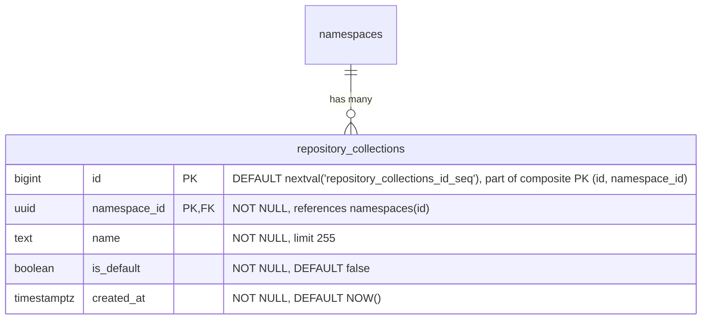

- **repository_collections**: Namespace 内のリポジトリの論理的グルーピング。`name` は namespace 内で一意な、人間可読のラベル。`is_default` は、各 namespace と一緒に自動作成され MVP 中にすべてのリポジトリが割り当てられる Repository collection をマークします。`HASH(namespace_id)` で 64 パーティションにパーティショニング。

各 namespace 作成時には、デフォルトの Repository collection 行をアトミックに挿入する必要があります。

```sql
INSERT INTO repository_collections (namespace_id, name, is_default)
VALUES (<new_namespace_id>, 'default', true)
ON CONFLICT (namespace_id, name) DO NOTHING;
```

#### インデックス

- **`repository_collections`**: `(id, namespace_id)` のプライマリキー — `HASH(namespace_id)` パーティショニングに必要な複合 PK で、`repositories` からの複合外部キーのターゲットとしても機能。`(namespace_id, name)` のユニークインデックス — namespace 内で名前により Repository collection を検索。`(namespace_id) WHERE is_default IS TRUE` の部分ユニークインデックス — namespace あたり最大 1 つのデフォルト Repository collection を強制。

#### クエリ例

- namespace のデフォルト Repository collection を取得:

  ```sql
  SELECT *
  FROM repository_collections
  WHERE namespace_id = '018f4d6f-0e10-7e3a-9bfd-23a4c5d6e7f8' AND is_default = true;
  ```

- namespace のすべての Repository collection をリスト:

  ```sql
  SELECT id, name, is_default, created_at
  FROM repository_collections
  WHERE namespace_id = '018f4d6f-0e10-7e3a-9bfd-23a4c5d6e7f8'
  ORDER BY created_at;
  ```

- 新しい（デフォルトでない）Repository collection を作成:

  ```sql
  INSERT INTO repository_collections (namespace_id, name)
  VALUES ('018f4d6f-0e10-7e3a-9bfd-23a4c5d6e7f8', 'team-backend');
  ```

### Repositories

`repositories` テーブルは、フォーマットや種別にかかわらずシステム内のすべてのリポジトリを登録する統一された親テーブルです。これはランディングページのハイブリッドリスト（すべてのフォーマットにわたる Local、Virtual、Remote リポジトリを表示する単一のソート可能、フィルタリング可能、ページング可能なビュー）を支えます。各フォーマット固有のリポジトリテーブル（local、virtual、remote）は、`repository_id` を介してここの単一行を参照します。

このモデル（Local、Remote、Virtual を参照によって構成されるピアレベルのスタンドアローンタイプとする）は、JFrog Artifactory、Sonatype Nexus、Google Cloud AR がすべて使用しているものです。

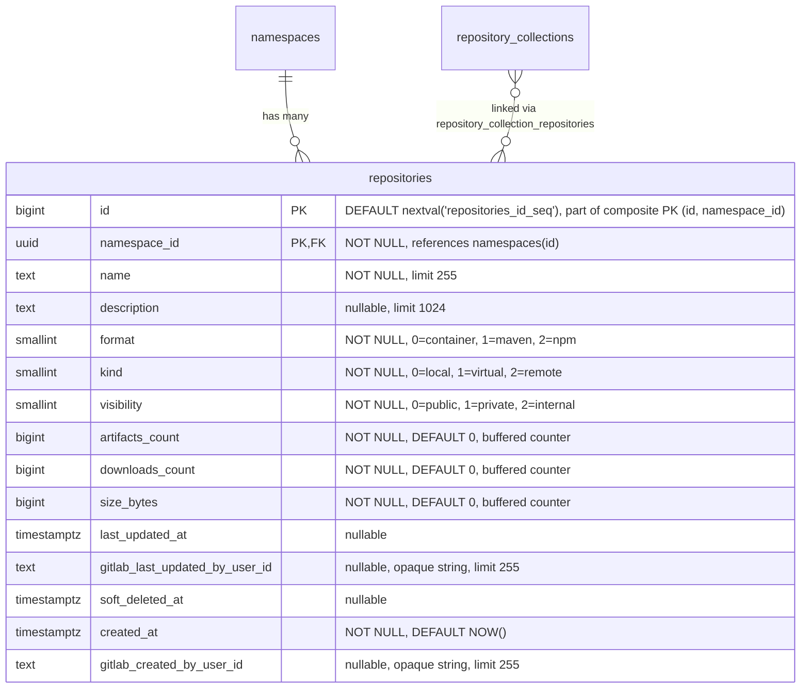

- **repositories**: すべてのリポジトリの親エンティティ。`format` はアーティファクトフォーマット（container、Maven、npm）を識別。`kind` はリポジトリタイプ（local、virtual、remote）を識別。リポジトリは [`repository_collection_repositories`](#repository-collection-repositories) 結合テーブルを介して Repository collection にリンクされ、リポジトリが namespace 内の 1 つ以上の Repository collection に所属できるようにします。MVP 中は、すべてのリポジトリが namespace のデフォルト Repository collection にリンクされます。`name` は namespace 内で一意でなければならず、すべての競合と一致します。カウンターカラム（`artifacts_count`、`downloads_count`、`size_bytes`）は、ホット行の競合を回避するため [バッファ／非同期書き込み](#buffered-and-asynchronous-writes) で維持されます。`last_updated_at` はコンテンツ変更（アーティファクトの公開／変更／削除、キャッシュイベント）を追跡し、ダウンロードは追跡しません。`gitlab_created_by_user_id` と `gitlab_last_updated_by_user_id` は、リポジトリを作成・最終変更した GitLab ユーザーを記録します。両方とも外部キーを持たず、アプリケーション側の検証もない nullable な不透明参照です。ユーザーレコードはモノリスに存在するため、ユーザーハンドルとアバターのレンダリングはコンシューマーの責任で、AR スキーマは ID のみを保存します。`namespaces.entity_id` と同じ理由で `TEXT` として保存されます: アップストリームのユーザー ID 形式が将来変更されても（例えば UUID に）スキーマ移行は不要です。`description` は、UI が仮想だけでなくすべてのリポジトリタイプの説明を表示するため、親にあります。`soft_deleted_at` タイムスタンプは、リポジトリがソフト削除された時を記録し、必要に応じて復元を可能にします。ソフト削除は、すべてのリポジトリタイプ（local、virtual、remote）がフォーマット固有の処理なしに同じ削除セマンティクスを共有できるよう、親テーブルにあります。`HASH(namespace_id)` で 64 パーティションにパーティショニング。

#### インデックス

- **`repositories`**: `(namespace_id, name)` のユニークインデックス — アクティブおよびソフト削除済みの両方のリポジトリにわたって名前の一意性を強制し、名前の競合によって復元が失敗することがないようにする。名前の再利用にはまずハード削除が必要。`(namespace_id, name) WHERE soft_deleted_at IS NULL` のインデックス — アクティブリポジトリの検索と名前順リスト向けに最適化されたスキャンパス。`(namespace_id, format) WHERE soft_deleted_at IS NULL` のインデックス — フォーマットでアクティブリポジトリをフィルタ。`(namespace_id, kind) WHERE soft_deleted_at IS NULL` のインデックス — 種別でアクティブリポジトリをフィルタ。`(namespace_id, visibility) WHERE soft_deleted_at IS NULL` のインデックス — 可視性レベルでリポジトリをフィルタ（可視性監査クエリ「この namespace で今 public なリポジトリはどれか？」を支える）。ランディングページのソート可能カラムごとに 1 つのインデックス、すべて `WHERE soft_deleted_at IS NULL` 付き: `(namespace_id, artifacts_count DESC)`、`(namespace_id, downloads_count DESC)`、`(namespace_id, size_bytes DESC)`、`(namespace_id, last_updated_at DESC NULLS LAST)`。

MVP 中、すべてのリポジトリは単一のデフォルト Repository collection にリンクされるため、`(namespace_id, ...)` のソートインデックスは namespace 全体および Repository collection フィルタリングされたクエリの両方に対応します。MVP 後、namespace が複数の Repository collection を持つようになると、Repository collection フィルタリングされたクエリは `repository_collection_repositories` を介して結合します。Repository collection が表面化されたときに追加のサポートインデックスが評価されます。

#### クエリ例

- 最終更新順で namespace のすべてのリポジトリ（すべての Repository collection）をリスト:

  ```sql
  SELECT id, name, description, format, kind, artifacts_count,
         downloads_count, size_bytes, last_updated_at
  FROM repositories
  WHERE namespace_id = '018f4d6f-0e10-7e3a-9bfd-23a4c5d6e7f8' AND soft_deleted_at IS NULL
  ORDER BY last_updated_at DESC NULLS LAST
  LIMIT 20;
  ```

- 最終更新順で、Repository collection でフィルタリングされた namespace のリポジトリをリスト:

  ```sql
  SELECT r.id, r.name, r.description, r.format, r.kind, r.artifacts_count,
         r.downloads_count, r.size_bytes, r.last_updated_at
  FROM repositories r
  JOIN repository_collection_repositories rcr
    ON rcr.namespace_id = r.namespace_id AND rcr.repository_id = r.id
  WHERE r.namespace_id = '018f4d6f-0e10-7e3a-9bfd-23a4c5d6e7f8' AND rcr.repository_collection_id = 456 AND r.soft_deleted_at IS NULL
  ORDER BY r.last_updated_at DESC NULLS LAST
  LIMIT 20;
  ```

- Repository collection とフォーマットでフィルタリングされたリポジトリをリスト:

  ```sql
  SELECT r.id, r.name, r.description, r.format, r.kind, r.artifacts_count,
         r.downloads_count, r.size_bytes, r.last_updated_at
  FROM repositories r
  JOIN repository_collection_repositories rcr
    ON rcr.namespace_id = r.namespace_id AND rcr.repository_id = r.id
  WHERE r.namespace_id = '018f4d6f-0e10-7e3a-9bfd-23a4c5d6e7f8' AND rcr.repository_collection_id = 456 AND r.format = 0
    AND r.soft_deleted_at IS NULL
  ORDER BY r.name
  LIMIT 20;
  ```

- 名前で単一リポジトリを検索:

  ```sql
  SELECT *
  FROM repositories
  WHERE namespace_id = '018f4d6f-0e10-7e3a-9bfd-23a4c5d6e7f8' AND name = 'my-repo' AND soft_deleted_at IS NULL;
  ```

- 可視性監査: namespace 内のすべての public リポジトリをリスト（`(namespace_id, visibility) WHERE soft_deleted_at IS NULL` の部分インデックスを使用）:

  ```sql
  SELECT id, name, format, kind
  FROM repositories
  WHERE namespace_id = '018f4d6f-0e10-7e3a-9bfd-23a4c5d6e7f8' AND visibility = 0 AND soft_deleted_at IS NULL
  ORDER BY name;
  ```

### Repository collection repositories {#repository-collection-repositories}

`repository_collection_repositories` 結合テーブルは、リポジトリを所属する Repository collection にマッピングします。リポジトリは namespace 内の 1 つ以上の Repository collection のメンバーになることができ、複数のチームの Repository collection を通じて共通のユーティリティリポジトリを表面化するなどの共有アクセスシナリオを可能にします。

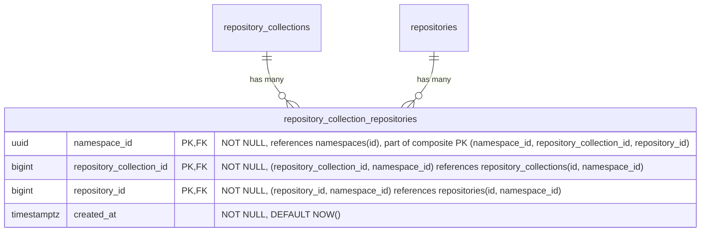

- **repository_collection_repositories**: リポジトリを Repository collection にリンクします。MVP 中、各リポジトリはちょうど 1 つの Repository collection（namespace のデフォルト）にリンクされますが、スキーマは複数のリンクを許可しているため、MVP 後にリポジトリを Repository collection 間で共有できます。アプリケーションは、すべてのリポジトリが少なくとも 1 つの Repository collection リンクを持つという不変条件を強制します — Postgres はこれを宣言的に表現できません。複合 FK は、Repository collection とリポジトリが同じ namespace 内でのみリンクできることを確保します。`HASH(namespace_id)` で 64 パーティションにパーティショニング。

#### インデックス

- **`repository_collection_repositories`**: `(namespace_id, repository_collection_id, repository_id)` のプライマリキー — リンクの一意性を強制し、Repository collection 別の検索に対応。`(namespace_id, repository_id)` のインデックス — 指定されたリポジトリが所属するすべての Repository collection を検索。

#### クエリ例

- リポジトリが所属するすべての Repository collection をリスト:

  ```sql
  SELECT repository_collection_id
  FROM repository_collection_repositories
  WHERE namespace_id = '018f4d6f-0e10-7e3a-9bfd-23a4c5d6e7f8' AND repository_id = 789;
  ```

- リポジトリを Repository collection にリンク:

  ```sql
  INSERT INTO repository_collection_repositories (namespace_id, repository_collection_id, repository_id)
  VALUES ('018f4d6f-0e10-7e3a-9bfd-23a4c5d6e7f8', 456, 789)
  ON CONFLICT (namespace_id, repository_collection_id, repository_id) DO NOTHING;
  ```

### ライフサイクルポリシー {#lifecycle-policies}

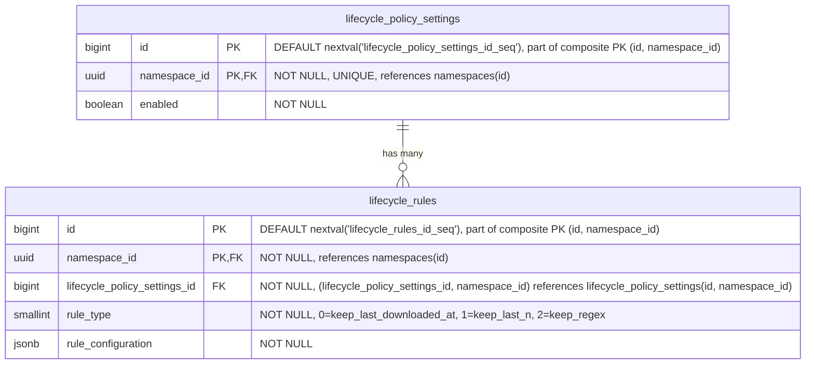

- **lifecycle_policy_settings**: Namespace レベルでライフサイクル管理構成を定義し、すべてのリポジトリのデフォルトポリシーとして機能。有効化されると、関連するライフサイクルルールが namespace 全体に適用されます。これらのポリシーはリポジトリレベルポリシーで [オーバーライド](#repository-level-overrides) できます。`HASH(namespace_id)` で 64 パーティションにパーティショニング。
- **lifecycle_rules**: Namespace レベルで特定のアーティファクトライフサイクル動作を管理する個別の保持・クリーンアップルールを指定。これらのルールは、リポジトリレベルで [オーバーライド](#repository-level-overrides) されない限り、すべてのリポジトリに適用されます。ルール評価中のパフォーマンス劣化を防ぐため、ポリシーレコードあたりのライフサイクルルール数は制限されます。例えば、ユーザーは特定のアーティファクトをどれくらいの期間保持するか（例: Maven snapshot ファイルは 1 ヶ月だけ保持）を指定するために使用します。`HASH(namespace_id)` で 64 パーティションにパーティショニング。

#### インデックス

- **`lifecycle_policy_settings`**: `(namespace_id)` のユニークインデックス — namespace あたり 1 つのポリシー設定レコード。
- **`lifecycle_rules`**: `(namespace_id, lifecycle_policy_settings_id)` のインデックス — 指定されたポリシーのすべてのルールを取得。

リポジトリレベルのオーバーライドテーブルは同じパターンに従います: 設定テーブル用に `(namespace_id, repository_id)` のユニークインデックスと、ルールテーブル用に `(namespace_id, <format>_repository_lifecycle_policy_settings_id)` のインデックス。

#### クエリ例

- 指定された namespace のポリシーを取得

  ```sql
  SELECT lp.*
  FROM lifecycle_policy_settings lp
  WHERE lp.namespace_id = '018f4d6f-0e10-7e3a-9bfd-23a4c5d6e7f8';
  ```

- 指定されたアーティファクトリポジトリのポリシーを取得

  ```sql
  SELECT *
  FROM container_repository_lifecycle_policy_settings
  WHERE container_repository_lifecycle_policy_settings.namespace_id = '018f4d6f-0e10-7e3a-9bfd-23a4c5d6e7f8'
    AND container_repository_lifecycle_policy_settings.repository_id = 123;
  ```

- 新しいライフサイクルルールを作成

  ```sql
  INSERT INTO lifecycle_rules (namespace_id, lifecycle_policy_settings_id, rule_type, rule_configuration)
  VALUES ('018f4d6f-0e10-7e3a-9bfd-23a4c5d6e7f8', 123, 1, '{"count": 10}'::jsonb);
  ```

- ライフサイクルルールを更新

  ```sql
  UPDATE lifecycle_rules
  SET rule_configuration = '{"count": 20}'::jsonb
  WHERE namespace_id = '018f4d6f-0e10-7e3a-9bfd-23a4c5d6e7f8'
    AND id = 123;
  ```

- ライフサイクルルールを破棄

  ```sql
  DELETE FROM lifecycle_rules
  WHERE namespace_id = '018f4d6f-0e10-7e3a-9bfd-23a4c5d6e7f8'
    AND id = 123;
  ```

#### リポジトリレベルオーバーライド {#repository-level-overrides}

各リポジトリタイプ（[container](#container-repositories)、[maven](#maven-repositories)、[npm](#npm-repositories)）は、namespace レベルの値にオーバーライドを提供する同様の名前のテーブルを持ちます。これにより優先システムが作成されます: namespace（最低）→ Repository（最高）。オーバーライドは `repository_id` を介して親 `repositories` テーブルを参照します。

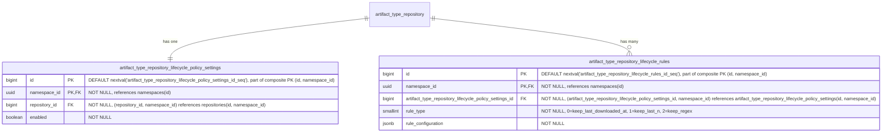

（各アーティファクトフォーマットにオーバーライドテーブルがあるため、`artifact_type` は `container`、`maven`、`npm` に置き換える必要があります。これらのオーバーライドはローカル、仮想、リモートリポジトリにも同じく適用されます — `repository_id` FK は親 `repositories` テーブルを参照し、フォーマット固有のテーブルはリポジトリの `format` カラムによって決定されます。）

これらのテーブルは、いわば [カスケード設定](https://docs.gitlab.com/development/cascading_settings/) として機能します。それらの説明は [namespace レベル](#lifecycle-policies) で同様に名付けられたテーブルとまったく同じで、パーティショニングも含みます: すべてのオーバーライドテーブルは `HASH(namespace_id)` で 64 パーティションにパーティショニングされます。現在の 2 ティア優先システム（namespace → repository）は、MVP 後に Repository collection が表面化されると 3 ティア（namespace → repository_collection → repository）に拡張可能です。これには同じパターンに従って Repository collection レベルのオーバーライドテーブルを追加する必要があり、既存の namespace レベルやリポジトリレベルのテーブルへの変更は不要です。

### Container Repositories {#container-repositories}

ここでの課題は、[OCI Distribution Spec v1.1](https://github.com/opencontainers/distribution-spec/blob/main/spec.md) に準拠することです。

<!--TODO This link will not live for long since it's an artifact output-->
このアプローチは、[GitLab Container Registry スキーマ](https://gitlab.com/gitlab-org/container-registry/-/jobs/12449560500/artifacts/file/db-DAG.png) に大きく着想を得ています。


- **container_repositories**: 複数のイメージのコンテナ。各リポジトリは独立したバージョニングを持つ複数のイメージをホストできます。名前、可視性、フォーマット横断クエリのため `repository_id` を介して親 `repositories` テーブルを参照します。`HASH(namespace_id)` で 64 パーティションにパーティショニング。
- **container_images**: リポジトリ内の名前付きコンテナイメージ（例: `myapp`、`backend`）を表します。`last_downloaded_at` はイメージが最後にプルされた時を記録し、[バッファ／非同期書き込み](#buffered-and-asynchronous-writes) で維持されます。`keep_last_downloaded_at` ライフサイクルルールでダウンロードベースの保持を評価するために使用されます（[ADR-010](010_data_retention.md)）。`soft_deleted_at` タイムスタンプは、イメージがソフト削除された時を記録し、必要に応じて復元を可能にします。`HASH(namespace_id)` で 64 パーティションにパーティショニング。
- **container_blobs**: コンテナイメージを構成する個々のコンテンツアドレス可能なレイヤーと構成オブジェクトを格納します。マニフェストとそれを構成するレイヤー（blob）の関係は暗黙的であり、ランタイムでマニフェストコンテンツをパースして決定されるため、データベース外部キーとしてモデル化されません。`soft_deleted_at` タイムスタンプは、blob がソフト削除された時を記録し、必要に応じて復元を可能にします。`HASH(namespace_id)` で 64 パーティションにパーティショニング。
- **container_manifests**: 特定のイメージバージョンの構成とレイヤーを記述するイメージマニフェストを表します。`size` カラムは、このマニフェストをルートとするマニフェストツリーの合計バイトサイズを保持します: このマニフェスト自体のペイロードと、ここから推移的に到達可能なすべての blob（マニフェストリストや OCI インデックスの子マニフェストを含む）。`gitlab_user_id` は、このマニフェストをプッシュした GitLab ユーザーを記録します。外部キーを持たない nullable な不透明テキスト参照で、[repositories](#repositories) の同等カラムと同じ根拠です — ユーザーレコードはモノリスに存在し、ユーザーハンドルとアバターのレンダリングはコンシューマーの責任で、AR スキーマは ID のみを保存し、`TEXT` はアップストリームのユーザー ID 形式の将来の変更からスキーマを隔離します。`gitlab_project_id` と `gitlab_git_commit_sha` は、その帰属を公開コンテキストの残りで拡張します: `gitlab_project_id` はプッシュ元の GitLab プロジェクト（例: `CI_PROJECT_ID`）で、`gitlab_user_id` と同じモノリス参照の理由から nullable な不透明テキストとして保存されます。`gitlab_git_commit_sha` は公開時の Git コミット（例: `CI_COMMIT_SHA`）で、ハッシュカラムのスキーマ規約に従い nullable な `bytea` として保存されます — 可変長で、SHA-1（20 バイト）と SHA-256（32 バイト）の両方に収まります。これはモノリス参照ではなく公開時の事実なので、外部キーは不要です。CI コンテキストなしでプッシュが届いた場合（例: 開発者のワークステーションからの手動プッシュ）は両方とも NULL になります。`soft_deleted_at` タイムスタンプは、マニフェストがソフト削除された時を記録し、必要に応じて復元を可能にします。`created_at` は、マニフェストが最初にプッシュされた時を記録します。namespace ごとの時系列順インデックスと組み合わせることで、公開履歴クエリと時間範囲のアーティファクト来歴クエリ（例: 「この namespace に午前 2 時から午前 8 時の間に何がプッシュされたか?」）を支えます。公開イベント自体は削除によって消去されないため、ソフト削除された行も公開履歴に引き続き表示されます。`HASH(namespace_id)` で 64 パーティションにパーティショニング。
- **container_manifest_relationships**: 親マニフェストが複数の他のマニフェストを参照できる Docker マニフェストリストと OCI インデックス（マルチアーキテクチャイメージなど）を扱います。`HASH(namespace_id)` で 64 パーティションにパーティショニング。
- **container_tags**: 特定のマニフェストを指す人間可読の名前（例: `latest`、`v1.2.3`）を提供します。`HASH(namespace_id)` で 64 パーティションにパーティショニング。
- **blob_storage_attachments**: 詳細は [Blob storage](#blob-storage) セクションを参照してください。

`container_blobs` テーブルは、他のコンテナレジストリアーキテクチャが行うようにコンテナレジストリの物理 blob を直接保存しません。違いは、blob ストレージが [blob storage](#blob-storage) テーブルで処理されること（重複排除とガベージコレクションを含む）です。したがって、`container_*` レベルでは、単純に `blob_storage_attachments` レコードへの参照を保存するだけで済みます。

#### インデックス

- **`container_repositories`**: `(namespace_id, repository_id)` のユニークインデックス — 親リポジトリ参照で container リポジトリを検索。
- **`container_images`**: `(namespace_id, container_repository_id, name) WHERE soft_deleted_at IS NULL` のユニークインデックス — イメージ名はリポジトリ内で一意なイメージを識別。重複があると OCI 名ベースの検索が壊れます。部分条件はソフト削除後に同じ名前でイメージを再作成できるようにします。`(namespace_id, container_repository_id, last_downloaded_at NULLS FIRST) WHERE soft_deleted_at IS NULL` のインデックス — `keep_last_downloaded_at` ライフサイクルルール評価をサポート。リポジトリ内のすべてのイメージをスキャンして 1 行ずつフィルタリングするのではなく、有界な範囲スキャンで期限切れのイメージのみを返します。`NULLS FIRST` は、ダウンロードされていないイメージを最も古い行とグループ化し、両方が同じ範囲スキャンで返されるようにします。
- **`container_blobs`**: `(namespace_id, container_image_id, digest) WHERE soft_deleted_at IS NULL` のユニークインデックス — blob ダイジェストはコンテンツアドレス指定。同じイメージ内の同じダイジェストは定義上同じ blob です。部分条件はソフト削除後に同じダイジェストを再プッシュできるようにします。`(namespace_id, blob_storage_attachment_id)` のインデックス — ストレージアタッチメントで blob を検索。
- **`container_manifests`**: `(namespace_id, container_image_id, digest) WHERE soft_deleted_at IS NULL` のユニークインデックス — マニフェストダイジェストはコンテンツアドレス指定。同じイメージ内の同じダイジェストは定義上同じマニフェストです。部分条件はソフト削除後に同じダイジェストを再プッシュできるようにします。`(namespace_id, blob_storage_attachment_id)` のインデックス — ストレージアタッチメントでマニフェストを検索。`(namespace_id, created_at DESC)` のインデックス — namespace 全体の時系列スキャンで、公開履歴のページネーションと時間範囲のアーティファクト来歴クエリを支えます。後にソフト削除された公開イベントも監査証跡に表示され続けるよう、無条件です（`soft_deleted_at` 述語なし）。
- **`container_manifest_relationships`**: `(namespace_id, parent_container_manifest_id, child_container_manifest_id)` のユニークインデックス — 重複する親子関係を防ぎ、指定された親マニフェストのすべての子を見つける。`(namespace_id, child_container_manifest_id)` のインデックス — 指定された子マニフェストのすべての親を見つける。`(namespace_id, container_image_id)` のインデックス — 指定されたイメージのすべてのマニフェスト関係を見つける。
- **`container_tags`**: `(namespace_id, container_image_id, name)` のユニークインデックス — イメージ内で名前によりタグを検索。`(namespace_id, container_manifest_id)` のインデックス — 指定されたマニフェストを指すすべてのタグを見つける。

#### クエリ例

- 名前でイメージを取得

  ```sql
  SELECT *
  FROM container_images
  WHERE namespace_id = '018f4d6f-0e10-7e3a-9bfd-23a4c5d6e7f8' AND container_repository_id = 123 AND name = 'myapp/backend'
    AND soft_deleted_at IS NULL;
  ```

- リポジトリ ID のダイジェストで blob を取得

  ```sql
  SELECT cb.*
  FROM container_blobs cb
  JOIN container_images ci
    ON cb.container_image_id = ci.id AND cb.namespace_id = ci.namespace_id
  WHERE ci.namespace_id = '018f4d6f-0e10-7e3a-9bfd-23a4c5d6e7f8' AND ci.container_repository_id = 123
    AND cb.digest = 'sha256:abcd1234...'::bytea
    AND ci.soft_deleted_at IS NULL AND cb.soft_deleted_at IS NULL;
  ```

- リポジトリ ID のダイジェストでマニフェストを取得

  ```sql
  SELECT cm.*
  FROM container_manifests cm
  JOIN container_images ci
    ON cm.container_image_id = ci.id AND cm.namespace_id = ci.namespace_id
  WHERE ci.namespace_id = '018f4d6f-0e10-7e3a-9bfd-23a4c5d6e7f8' AND ci.container_repository_id = 123
    AND cm.digest = 'sha256:efgh5678...'::bytea
    AND ci.soft_deleted_at IS NULL AND cm.soft_deleted_at IS NULL;
  ```

### Container Remote Repositories {#container-remote-repositories}

リモートリポジトリは、プロキシおよびキャッシュ可能な外部コンテナレジストリを表します。それらは独自のライフサイクルを持つスタンドアロンエンティティで、複数の仮想リポジトリ間で共有可能です。親 `repositories` テーブルを介して仮想リポジトリのアップストリームによって参照されます。


- **container_remote_repositories**: 外部コンテナレジストリを表します。URL、オプションの認証 URL（`auth_url`）、認証情報、キャッシュ TTL（`cache_validity_hours`）を含みます。ヘルスチェックステータスはモニタリングのために追跡されます。`repository_id` を介して親 `repositories` テーブルを参照します。リモートリポジトリはスタンドアロンであるため、同じリモートを使う 2 つの仮想リポジトリは 1 つのキャッシュを共有します。`HASH(namespace_id)` で 64 パーティションにパーティショニング。
- **container_remote_images**: リモートリポジトリ内のキャッシュされたコンテナイメージ。`container_images` をミラーリングします。`last_downloaded_at` はキャッシュされたイメージが最後にプルされた時を記録します。ホット行の競合を回避するため、バッファ／非同期書き込み（`repositories.downloads_count` と同じパターン）で維持されます。`keep_last_downloaded_at` ライフサイクルルールとキャッシュ保持評価で使用されます（[ADR-010](010_data_retention.md)）。`HASH(namespace_id)` で 64 パーティションにパーティショニング。
- **container_remote_blobs**: キャッシュされたレイヤーまたは構成 blob。`HASH(namespace_id)` で 64 パーティションにパーティショニング。
- **container_remote_manifests**: キャッシュされたイメージマニフェスト。`size` カラムは、このキャッシュが知っているサブツリーのバイトフットプリントを保持します: キャッシュ時のマニフェスト自体のペイロードに加えて、子が到着するたびに各子の `size` を加算します。イメージマニフェストの場合、値はキャッシュ時に完全になります。マニフェストリストと OCI インデックスの場合、子が取得されるにつれて完全なツリーのフットプリントに段階的に収束し、一部の子が決してプルされない場合は部分的なままになる可能性があります。この段階的なセマンティクスは遅延リモートキャッシングを反映しています — `size` を完全に保つためだけに積極的に子を取得することは遅延設計を損ないます。`created_at` は、マニフェストが最初にキャッシュされた時を記録し、ローカルの同等物（[`container_manifests`](#container-repositories)）と同じ公開履歴および時間範囲の来歴スキャンを支えます。`HASH(namespace_id)` で 64 パーティションにパーティショニング。
- **container_remote_manifest_relationships**: キャッシュされたマルチアーキテクチャマニフェストリストの関係。ローカルと同じ構造。`HASH(namespace_id)` で 64 パーティションにパーティショニング。
- **container_remote_tags**: キャッシュされたタグからマニフェストへのマッピング。タグは可変ポインタです — キャッシュ再検証時に、タグは新しいマニフェストに再ポイントされる可能性があります。`upstream_checked_at` はタグがアップストリームレジストリに対して最後に検証された時を記録します。`cache_validity_hours` と比較して再検証が必要かどうかを判断します。`upstream_etag` はアップストリームから返された ETag を保存し、条件付きリクエスト（`If-None-Match`）を可能にすることで、タグが同じマニフェストを指している場合に完全なマニフェスト解決を回避します。マニフェストと blob は暗号ハッシュによってコンテンツアドレス指定されるため、鮮度追跡は不要です — 保存されているバイトがダイジェストと一致すれば、コンテンツは正しいことが保証されます。`HASH(namespace_id)` で 64 パーティションにパーティショニング。
- **blob_storage_attachments**: 詳細は [Blob storage](#blob-storage) セクションを参照してください。

#### インデックス

- **`container_remote_repositories`**: `(namespace_id, repository_id)` のユニークインデックス — 親参照でリモートリポジトリを検索。
- **`container_remote_images`**: `(namespace_id, container_remote_repository_id, name) WHERE soft_deleted_at IS NULL` のユニークインデックス — 名前でキャッシュされたイメージを検索。部分条件はソフト削除後に同じ名前でイメージを再作成できるようにします。
- **`container_remote_blobs`**: `(namespace_id, container_remote_image_id, digest) WHERE soft_deleted_at IS NULL` のユニークインデックス — イメージ内でダイジェストによりキャッシュされた blob を検索。部分条件はソフト削除後に同じダイジェストを再キャッシュできるようにします。`(namespace_id, blob_storage_attachment_id)` のインデックス — ストレージアタッチメントで blob を検索。
- **`container_remote_manifests`**: `(namespace_id, container_remote_image_id, digest) WHERE soft_deleted_at IS NULL` のユニークインデックス — イメージ内でダイジェストによりキャッシュされたマニフェストを検索。部分条件はソフト削除後に同じダイジェストを再キャッシュできるようにします。`(namespace_id, blob_storage_attachment_id)` のインデックス — ストレージアタッチメントでマニフェストを検索。`(namespace_id, created_at DESC)` のインデックス — namespace 全体の時系列スキャンで、ローカルの [`container_manifests`](#container-repositories) インデックスをミラーリングして、キャッシュ側の公開履歴と来歴をカバーします。ローカルインデックスと同じ監査証跡の理由から無条件です（`soft_deleted_at` 述語なし）。
- **`container_remote_manifest_relationships`**: `(namespace_id, parent_container_remote_manifest_id, child_container_remote_manifest_id)` のユニークインデックス — 重複する親子関係を防ぐ。`(namespace_id, child_container_remote_manifest_id)` のインデックス — 指定された子マニフェストのすべての親を見つける。`(namespace_id, container_remote_image_id)` のインデックス — 指定されたイメージのすべてのマニフェスト関係を見つける。
- **`container_remote_tags`**: `(namespace_id, container_remote_image_id, name)` のユニークインデックス — イメージ内で名前によりタグを検索。`(namespace_id, container_remote_manifest_id)` のインデックス — 指定されたマニフェストを指すすべてのタグを見つける。

#### クエリ例

- リモートリポジトリを作成

  ```sql
  -- namespace のデフォルト Repository collection を解決
  SELECT id FROM repository_collections WHERE namespace_id = '018f4d6f-0e10-7e3a-9bfd-23a4c5d6e7f8' AND is_default = true;
  -- 親リポジトリを作成
  INSERT INTO repositories (namespace_id, name, format, kind, visibility)
  VALUES ('018f4d6f-0e10-7e3a-9bfd-23a4c5d6e7f8', 'docker-hub', 0, 2, 1)
  RETURNING id;
  -- リポジトリを Repository collection にリンク
  INSERT INTO repository_collection_repositories (namespace_id, repository_collection_id, repository_id)
  VALUES ('018f4d6f-0e10-7e3a-9bfd-23a4c5d6e7f8', <repository_collection_id>, <returned_id>);
  -- 次にフォーマット固有のレコードを作成
  INSERT INTO container_remote_repositories (namespace_id, repository_id, url, encrypted_username, encrypted_password)
  VALUES ('018f4d6f-0e10-7e3a-9bfd-23a4c5d6e7f8', <returned_id>, 'https://registry.hub.docker.com', $1, $2);
  ```

- キャッシュされたマニフェストが新鮮かどうかを確認

  ```sql
  SELECT crm.digest
  FROM container_remote_manifests crm
  JOIN container_remote_tags crt
    ON crt.container_remote_manifest_id = crm.id AND crt.namespace_id = crm.namespace_id
  JOIN container_remote_images cri
    ON crt.container_remote_image_id = cri.id AND crt.namespace_id = cri.namespace_id
  WHERE cri.namespace_id = '018f4d6f-0e10-7e3a-9bfd-23a4c5d6e7f8'
    AND cri.container_remote_repository_id = 789
    AND cri.name = 'library/nginx'
    AND crt.name = 'latest'
    AND cri.soft_deleted_at IS NULL AND crm.soft_deleted_at IS NULL;
  ```

- ダイジェストでキャッシュされた blob をプル（blob ストレージへの読み取りパスショートカット）

  ```sql
  SELECT bsb.object_storage_key, bsb.size
  FROM container_remote_blobs crb
  JOIN blob_storage_blobs bsb
    ON bsb.namespace_id = crb.namespace_id AND bsb.sha256 = crb.blob_sha256
  WHERE crb.namespace_id = '018f4d6f-0e10-7e3a-9bfd-23a4c5d6e7f8'
    AND crb.container_remote_image_id = 456
    AND crb.digest = 'sha256:abcd1234...'::bytea
    AND crb.soft_deleted_at IS NULL;
  ```

### Virtual Container Repositories {#virtual-container-repositories}

```mermaid
erDiagram
    repositories ||--|| container_virtual_repositories : "has one"
    container_virtual_repositories ||--o{ container_virtual_repository_upstreams : "has many"
    container_virtual_repository_upstreams ||--|| repositories : "references upstream"
    container_virtual_repository_upstreams ||--o{ container_virtual_upstream_rules : "has many"

    container_virtual_repositories {
        bigint id PK "DEFAULT nextval('container_virtual_repositories_id_seq'), part of composite PK (id, namespace_id)"
        uuid namespace_id PK,FK "NOT NULL, references namespaces(id)"
        bigint repository_id FK "NOT NULL, UNIQUE (namespace_id, repository_id), (repository_id, namespace_id) references repositories(id, namespace_id)"
    }

    container_virtual_repository_upstreams {
        bigint id PK "DEFAULT nextval('container_virtual_repository_upstreams_id_seq'), part of composite PK (id, namespace_id)"
        uuid namespace_id PK,FK "NOT NULL, references namespaces(id)"
        bigint container_virtual_repository_id FK "NOT NULL, (container_virtual_repository_id, namespace_id) references container_virtual_repositories(id, namespace_id)"
        bigint upstream_repository_id FK "NOT NULL, (upstream_repository_id, namespace_id) references repositories(id, namespace_id)"
        int position "NOT NULL"
    }

    container_virtual_upstream_rules {
        bigint id PK "DEFAULT nextval('container_virtual_upstream_rules_id_seq'), part of composite PK (id, namespace_id)"
        uuid namespace_id PK,FK "NOT NULL, references namespaces(id)"
        bigint container_virtual_repository_upstream_id FK "NOT NULL, (container_virtual_repository_upstream_id, namespace_id) references container_virtual_repository_upstreams(id, namespace_id)"
        smallint rule_type "NOT NULL, 0=allow, 1=deny"
        text pattern "NOT NULL, limit 255"
        smallint target_field "NOT NULL, 0=image, 1=tag"
    }
```

- **container_virtual_repositories**: コンテナイメージの仮想リポジトリ。名前、可視性、フォーマット横断クエリのため `repository_id` を介して親 `repositories` テーブルを参照します。`HASH(namespace_id)` で 64 パーティションにパーティショニング。
- **container_virtual_repository_upstreams**: 仮想リポジトリとそのアップストリームを結合するテーブル。各仮想リポジトリは順序付きのアップストリームリストを持ちます。各エントリは `upstream_repository_id` を介してアップストリームリポジトリを参照し、`repositories(namespace_id, id)` を指します。複合 FK `(namespace_id, upstream_repository_id)` は、アップストリームが同じ namespace 内にあることを強制します — レジストリが namespace にスコープされていることと一貫しています（[ADR-001](001_organizations_as_anchor_point.md)）。`HASH(namespace_id)` で 64 パーティションにパーティショニング。
- **container_virtual_upstream_rules**: アップストリームの allow/deny フィルタルールを定義します。各ルールは、このアップストリームを介して解決されるときに含めるか除外するアーティファクトを制御するためのワイルドカードパターンとターゲットフィールドを指定します。MVP ではパターンはワイルドカードのみで、正規表現サポートは顧客のフィードバックが正当化するまで延期されます（[議論](https://gitlab.com/gitlab-org/gitlab/-/work_items/597754#note_3291871207)）。ルールはアップストリーム参照ごと（リモートリポジトリごとではない）に保持され、JFrog モデル（include/exclude パターンが仮想-アップストリーム関連付けごとに設定される）と一致します。`HASH(namespace_id)` で 64 パーティションにパーティショニング。

#### インデックス

- **`container_virtual_repositories`**: `(namespace_id, repository_id)` のユニークインデックス — 親参照で仮想リポジトリを検索。
- **`container_virtual_repository_upstreams`**: `(namespace_id, container_virtual_repository_id, position) DEFERRABLE INITIALLY DEFERRED` のユニークインデックス — 仮想リポジトリの順序付きアップストリームを取得。トランザクション内で並べ替えできるよう DEFERRABLE。`(namespace_id, container_virtual_repository_id, upstream_repository_id)` のユニークインデックス — 同じアップストリームが仮想リポジトリに 2 回追加されることを防ぐ。
- **`container_virtual_upstream_rules`**: `(namespace_id, container_virtual_repository_upstream_id)` のインデックス — 指定されたアップストリームのすべてのルールを取得。

#### クエリ例

- 仮想リポジトリを作成

  ```sql
  -- まず親リポジトリを作成
  INSERT INTO repositories (namespace_id, name, format, kind, visibility)
  VALUES ('018f4d6f-0e10-7e3a-9bfd-23a4c5d6e7f8', 'my-virtual-repo', 0, 1, 1)
  RETURNING id;
  -- リポジトリを Repository collection にリンク
  INSERT INTO repository_collection_repositories (namespace_id, repository_collection_id, repository_id)
  VALUES ('018f4d6f-0e10-7e3a-9bfd-23a4c5d6e7f8', 456, <returned_id>);
  -- 次にフォーマット固有のレコードを作成
  INSERT INTO container_virtual_repositories (namespace_id, repository_id)
  VALUES ('018f4d6f-0e10-7e3a-9bfd-23a4c5d6e7f8', <returned_id>);
  ```

- 仮想リポジトリをアップストリームに関連付け

  ```sql
  INSERT INTO container_virtual_repository_upstreams (namespace_id, container_virtual_repository_id, upstream_repository_id, position)
  VALUES ('018f4d6f-0e10-7e3a-9bfd-23a4c5d6e7f8', 123, 789, 1);
  ```

### Maven Repositories {#maven-repositories}

Maven パッケージはファイルのコレクション（`.jar`、`.pom`、`maven-metadata.xml`）を表します。したがって、単一の Maven パッケージのダウンロードは、4 〜 15 個の API リクエストに相当する可能性があります。

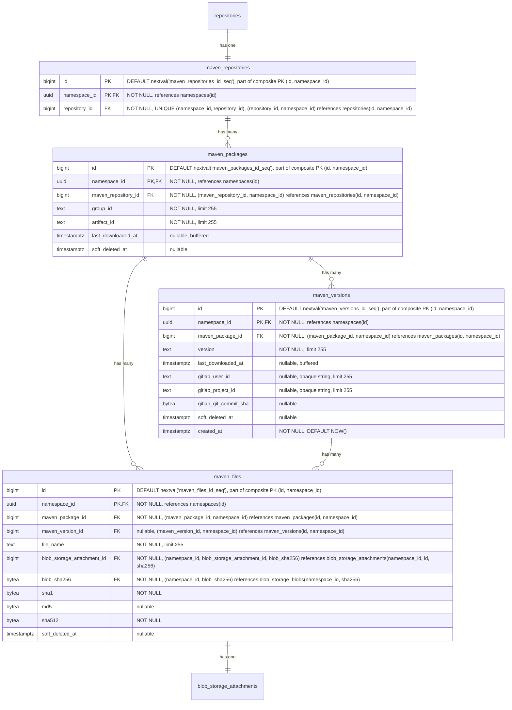

- **maven_repositories**: 複数のパッケージのコンテナ。各リポジトリは group ID と artifact ID で識別される複数のパッケージをホストできます。名前、可視性、フォーマット横断クエリのため `repository_id` を介して親 `repositories` テーブルを参照します。`HASH(namespace_id)` で 64 パーティションにパーティショニング。
- **maven_packages**: [group ID と artifact ID](https://maven.apache.org/pom.html#Maven_Coordinates) で識別される Maven パッケージを表します（例: `com.example:myapp`）。`last_downloaded_at` はパッケージのいずれかのファイルが最後にダウンロードされた時を記録し、[バッファ／非同期書き込み](#buffered-and-asynchronous-writes) で維持されます。`NULL` はパッケージが一度もダウンロードされていないことを意味し、`keep_last_downloaded_at` ライフサイクルルール評価では最古のダウンロード時間として扱われます（つまり、ダウンロードベースの保持で削除対象となります）。`keep_last_downloaded_at` ライフサイクルルールでダウンロードベースの保持を評価するために使用されます（[ADR-010](010_data_retention.md)）。`HASH(namespace_id)` で 64 パーティションにパーティショニング。
- **maven_versions**: Maven パッケージの個々の [バージョン](https://maven.apache.org/pom.html#Maven_Coordinates) を格納します（例: `1.0.0`、`2.1.3-SNAPSHOT`）。`last_downloaded_at` はバージョンのいずれかのファイルが最後にダウンロードされた時を記録し、[バッファ／非同期書き込み](#buffered-and-asynchronous-writes) で維持されます。`keep_last_downloaded_at` ライフサイクルルールで使用されます。`gitlab_user_id`、`gitlab_project_id`、`gitlab_git_commit_sha` は、このバージョンを公開した GitLab ユーザーと公開の背後にある CI コンテキスト（プロジェクト、コミット）を記録します。[`container_manifests`](#container-repositories) の同等カラムと同じ形と根拠です。`created_at` は、バージョンが最初に公開された時を記録し、[`container_manifests`](#container-repositories) と同じ公開履歴および時間範囲の来歴スキャンを支えます。`HASH(namespace_id)` で 64 パーティションにパーティショニング。
- **maven_files**: Maven パッケージに関連付けられた個々のファイルを表します。ファイルは、`maven_version_id` が設定されたバージョン固有のもの（JAR、POM、ソース、Javadoc、チェックサム）か、`maven_version_id` が NULL のパッケージレベルのもの（`maven-metadata.xml` とそのチェックサムなど）のいずれかです。`maven_package_id` は常に設定され、パッケージからそのすべてのファイルへの直接パスを提供します。レジストリがパフォーマンスのボトルネックを改善するために使用する補助ファイルでもありえます。`sha1` と `md5` カラムは、整合性検証のために [Maven プロトコルが要求するチェックサム](https://maven.apache.org/resolver/about-checksums.html) を格納します。Maven クライアントはすべてのアーティファクトに `.sha1` と `.md5` のサイドカーファイルが存在することを期待します。これらのカラムが `blob_storage_blobs` ではなく `maven_files` にあるのは、それらが Maven プロトコル固有の関心事であり、普遍的な blob プロパティではないためです — 他のフォーマット（OCI コンテナ）は SHA256 のみを使用します。ここに保持することで、`blob_storage_blobs` をフォーマット固有のカラムやインデックスのないフォーマット非依存のテーブルとして保ちます。Maven プロトコルが要求するため `sha1` は `NOT NULL` です。Maven 3.9+ で [MD5 チェックサムは非推奨](https://maven.apache.org/resolver/about-checksums.html) になったため `md5` は nullable です。`sha512` は `NOT NULL` です。Maven プロトコルはレジストリが提供できなければならない `.sha512` サイドカーを公開しており、永続化前にバイトがハンドラを流れる際にアップロード中に値を常に計算できるためです。`HASH(namespace_id)` で 64 パーティションにパーティショニング。
- **blob_storage_attachments**: 詳細は [Blob storage](#blob-storage) セクションを参照してください。

パッケージ名（この場合 group ID と artifact ID）とバージョンは同じテーブルに保存しません。理由は、UI がパッケージ名でデータにアクセスするためです。パッケージ名がフォルダで、それを開くとバージョンごとにサブフォルダがあるツリー型 UI を想像してください。最初のリクエストではフォルダ（パッケージ名）をリスト化する必要があります。フォルダを開くと、すべてのサブフォルダ（パッケージバージョン）をリスト化するリクエストがトリガーされます。したがって、このアクセスパターンを容易にするため、2 つの専用テーブル（`maven_packages` と `maven_versions`）を持ちます。

#### インデックス

- **`maven_repositories`**: `(namespace_id, repository_id)` のユニークインデックス — 親リポジトリ参照で Maven リポジトリを検索。
- **`maven_packages`**: `(namespace_id, maven_repository_id, group_id, artifact_id) WHERE soft_deleted_at IS NULL` のユニークインデックス — リポジトリ内で Maven 座標によりパッケージを検索。部分条件はソフト削除後に同じ座標でパッケージを再作成できるようにします。`(namespace_id, maven_repository_id, last_downloaded_at NULLS FIRST) WHERE soft_deleted_at IS NULL` のインデックス — `keep_last_downloaded_at` ライフサイクルルール評価をサポート。リポジトリ内のすべてのパッケージをスキャンして 1 行ずつフィルタリングするのではなく、有界な範囲スキャンで期限切れのパッケージのみを返します。`NULLS FIRST` は、ダウンロードされていないパッケージを最も古い行とグループ化し、両方が同じ範囲スキャンで返されるようにします。
- **`maven_versions`**: `(namespace_id, maven_package_id, version) WHERE soft_deleted_at IS NULL` のユニークインデックス — パッケージ内で特定のバージョンを検索。部分条件はソフト削除後に同じ識別子でバージョンを再作成できるようにします。`(namespace_id, maven_package_id, last_downloaded_at NULLS FIRST) WHERE soft_deleted_at IS NULL` のインデックス — `maven_packages` と同じ範囲スキャン戦略を使用して、パッケージのバージョンにスコープされた `keep_last_downloaded_at` ライフサイクルルール評価をサポート。`(namespace_id, created_at DESC)` のインデックス — namespace 全体の時系列スキャンで、公開履歴のページネーションと時間範囲のアーティファクト来歴クエリを支えます。ソフト削除された公開イベントも監査証跡に表示され続けるよう、無条件です。
- **`maven_files`**: `(namespace_id, maven_version_id, file_name) WHERE soft_deleted_at IS NULL AND maven_version_id IS NOT NULL` のユニークインデックス — バージョン固有のファイル名はバージョン内で一意でなければなりません。部分条件はソフト削除済みの行とパッケージレベルのファイルを除外します。`(namespace_id, maven_package_id, file_name) WHERE soft_deleted_at IS NULL AND maven_version_id IS NULL` のユニークインデックス — パッケージレベルのファイル名（`maven-metadata.xml` など）はパッケージ内で一意でなければなりません。`(namespace_id, blob_storage_attachment_id)` のインデックス — ストレージアタッチメントでファイルを検索。

#### クエリ例

- 指定されたリポジトリ ID とパッケージ名のパッケージバージョンを取得。

  ```sql
  SELECT mv.*
  FROM maven_versions mv
  JOIN maven_packages mp
    ON mv.maven_package_id = mp.id AND mv.namespace_id = mp.namespace_id
  WHERE mp.namespace_id = '018f4d6f-0e10-7e3a-9bfd-23a4c5d6e7f8' AND mp.maven_repository_id = 123 AND mp.group_id = 'com.example' AND mp.artifact_id = 'myapp'
    AND mv.version = '1.0.0'
    AND mp.soft_deleted_at IS NULL AND mv.soft_deleted_at IS NULL;
  ```

- 指定されたバージョン ID とファイル名のファイルを取得。

  ```sql
  SELECT mf.*
  FROM maven_files mf
  WHERE mf.namespace_id = '018f4d6f-0e10-7e3a-9bfd-23a4c5d6e7f8' AND mf.maven_version_id = 456 AND mf.file_name = 'myapp-1.0.0.jar'
    AND mf.soft_deleted_at IS NULL;
  ```

- 指定されたパッケージのパッケージレベルファイル（例: `maven-metadata.xml`）を取得。

  ```sql
  SELECT mf.*
  FROM maven_files mf
  WHERE mf.namespace_id = '018f4d6f-0e10-7e3a-9bfd-23a4c5d6e7f8' AND mf.maven_package_id = 123 AND mf.maven_version_id IS NULL
    AND mf.soft_deleted_at IS NULL;
  ```

### Maven Remote Repositories {#maven-remote-repositories}

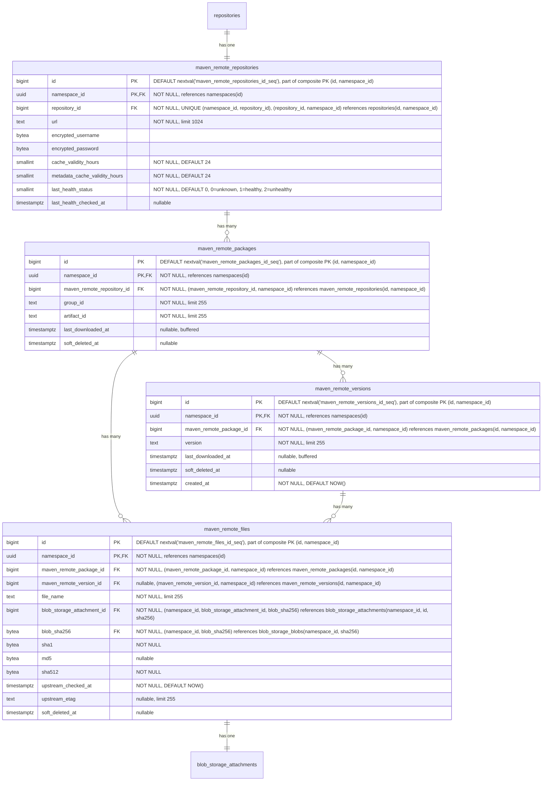

- **maven_remote_repositories**: 外部 Maven リポジトリを表します。URL、認証情報、アーティファクトキャッシュ TTL（`cache_validity_hours`）、`maven-metadata.xml` のようなメタデータレスポンス用の別の TTL（`metadata_cache_validity_hours`）を含みます。ヘルスチェックステータスはモニタリングのために追跡されます。`repository_id` を介して親 `repositories` テーブルを参照します。`HASH(namespace_id)` で 64 パーティションにパーティショニング。
- **maven_remote_packages**: group ID と artifact ID で識別されるキャッシュされた Maven パッケージ。`maven_packages` をミラーリングします。`last_downloaded_at` はパッケージのキャッシュされたファイルのいずれかが最後にダウンロードされた時を記録し、ホット行の競合を回避するためバッファ／非同期書き込みで維持されます。`keep_last_downloaded_at` ライフサイクルルールとキャッシュ保持評価で使用されます。`HASH(namespace_id)` で 64 パーティションにパーティショニング。
- **maven_remote_versions**: Maven パッケージのキャッシュされたバージョン。`maven_versions` をミラーリングします。`last_downloaded_at` はバージョンのキャッシュされたファイルのいずれかが最後にダウンロードされた時を記録し、ホット行の競合を回避するためバッファ／非同期書き込みで維持されます。`keep_last_downloaded_at` ライフサイクルルールとキャッシュ保持評価で使用されます。`created_at` は、バージョンが最初にキャッシュされた時を記録し、[`maven_versions`](#maven-repositories) をミラーリングしてキャッシュ側の公開履歴および来歴スキャンを支えます。`HASH(namespace_id)` で 64 パーティションにパーティショニング。
- **maven_remote_files**: キャッシュされたファイル（JAR、POM、チェックサム、`maven-metadata.xml`）。nullable な `maven_remote_version_id` はローカルと同じパターンを保持します: バージョン固有のファイルとパッケージレベルのファイル（`maven-metadata.xml` など）。コンテンツがローカルかキャッシュかに関係なく、Maven プロトコルはこれらのチェックサムの提供を要求するため、`sha1` と `md5` は保持されます。`sha512` はパリティのために追加され、ローカル `maven_files` カラム形状をミラーリングします。これにより、Maven Virtual 仕様（S14）が単一のクエリパスでどちらかのバックエンドから `.sha512` サイドカーを提供できるようになります。値は他のチェックサムと一緒にプロキシ書き込みステップ中にキャッシュされたバイトから計算されるため、初日から `NOT NULL` が実現可能です。`upstream_checked_at` はファイルがアップストリームリポジトリに対して最後に検証された時を記録します。アーティファクトファイルでは `cache_validity_hours` と、メタデータファイル（例: `maven-metadata.xml`）では `metadata_cache_validity_hours` と比較して、再検証が必要かどうかを判断します。`upstream_etag` はアップストリームから返された ETag を保存し、条件付きリクエスト（`If-None-Match`）を可能にすることで、変更されていないファイルの再ダウンロードを回避します。`HASH(namespace_id)` で 64 パーティションにパーティショニング。
- **blob_storage_attachments**: 詳細は [Blob storage](#blob-storage) セクションを参照してください。

#### インデックス

- **`maven_remote_repositories`**: `(namespace_id, repository_id)` のユニークインデックス — 親参照でリモートリポジトリを検索。
- **`maven_remote_packages`**: `(namespace_id, maven_remote_repository_id, group_id, artifact_id) WHERE soft_deleted_at IS NULL` のユニークインデックス — Maven 座標でキャッシュされたパッケージを検索。部分条件はソフト削除後に同じ座標でパッケージを再作成できるようにします。
- **`maven_remote_versions`**: `(namespace_id, maven_remote_package_id, version) WHERE soft_deleted_at IS NULL` のユニークインデックス — パッケージ内でキャッシュされたバージョンを検索。部分条件はソフト削除後に同じ識別子でバージョンを再作成できるようにします。`(namespace_id, created_at DESC)` のインデックス — namespace 全体の時系列スキャンで、ローカルの [`maven_versions`](#maven-repositories) インデックスをミラーリングして、キャッシュ側の公開履歴と来歴をカバーします。ローカルインデックスと同じ監査証跡の理由から無条件です（`soft_deleted_at` 述語なし）。
- **`maven_remote_files`**: `(namespace_id, maven_remote_version_id, file_name) WHERE soft_deleted_at IS NULL AND maven_remote_version_id IS NOT NULL` のユニークインデックス — バージョン固有のファイル名はバージョン内で一意でなければなりません。`(namespace_id, maven_remote_package_id, file_name) WHERE soft_deleted_at IS NULL AND maven_remote_version_id IS NULL` のユニークインデックス — パッケージレベルのファイル名はパッケージ内で一意でなければなりません。`(namespace_id, blob_storage_attachment_id)` のインデックス — ストレージアタッチメントでファイルを検索。

#### クエリ例

- リモートリポジトリを作成

  ```sql
  -- まず親リポジトリを作成
  INSERT INTO repositories (namespace_id, name, format, kind, visibility)
  VALUES ('018f4d6f-0e10-7e3a-9bfd-23a4c5d6e7f8', 'central', 1, 2, 0)
  RETURNING id;
  -- リポジトリを Repository collection にリンク
  INSERT INTO repository_collection_repositories (namespace_id, repository_collection_id, repository_id)
  VALUES ('018f4d6f-0e10-7e3a-9bfd-23a4c5d6e7f8', 456, <returned_id>);
  -- 次にフォーマット固有のレコードを作成
  INSERT INTO maven_remote_repositories (namespace_id, repository_id, url, encrypted_username, encrypted_password)
  VALUES ('018f4d6f-0e10-7e3a-9bfd-23a4c5d6e7f8', <returned_id>, 'https://repo.maven.apache.org/maven2', $1, $2);
  ```

- 座標でキャッシュされた Maven ファイルを検索

  ```sql
  SELECT mrf.*, bsb.object_storage_key
  FROM maven_remote_files mrf
  JOIN maven_remote_versions mrv
    ON mrf.maven_remote_version_id = mrv.id AND mrf.namespace_id = mrv.namespace_id
  JOIN maven_remote_packages mrp
    ON mrv.maven_remote_package_id = mrp.id AND mrv.namespace_id = mrp.namespace_id
  JOIN blob_storage_blobs bsb
    ON bsb.namespace_id = mrf.namespace_id AND bsb.sha256 = mrf.blob_sha256
  WHERE mrp.namespace_id = '018f4d6f-0e10-7e3a-9bfd-23a4c5d6e7f8'
    AND mrp.maven_remote_repository_id = 789
    AND mrp.group_id = 'com.example'
    AND mrp.artifact_id = 'myapp'
    AND mrv.version = '1.0.0'
    AND mrf.file_name = 'myapp-1.0.0.jar'
    AND mrp.soft_deleted_at IS NULL AND mrv.soft_deleted_at IS NULL AND mrf.soft_deleted_at IS NULL;
  ```

- パッケージのキャッシュされた `maven-metadata.xml` を検索

  ```sql
  SELECT mrf.*
  FROM maven_remote_files mrf
  JOIN maven_remote_packages mrp
    ON mrf.maven_remote_package_id = mrp.id AND mrf.namespace_id = mrp.namespace_id
  WHERE mrp.namespace_id = '018f4d6f-0e10-7e3a-9bfd-23a4c5d6e7f8'
    AND mrp.maven_remote_repository_id = 789
    AND mrp.group_id = 'com.example'
    AND mrp.artifact_id = 'myapp'
    AND mrf.maven_remote_version_id IS NULL
    AND mrf.file_name = 'maven-metadata.xml'
    AND mrp.soft_deleted_at IS NULL AND mrf.soft_deleted_at IS NULL;
  ```

### Maven Virtual Repositories {#maven-virtual-repositories}

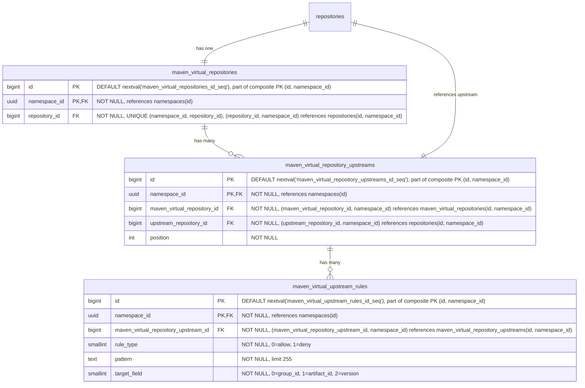

- **maven_virtual_repositories**: Maven パッケージの仮想リポジトリ。名前、可視性、フォーマット横断クエリのため `repository_id` を介して親 `repositories` テーブルを参照します。`HASH(namespace_id)` で 64 パーティションにパーティショニング。
- **maven_virtual_repository_upstreams**: 仮想リポジトリとそのアップストリームを結合するテーブル。各仮想リポジトリは順序付きのアップストリームリストを持ちます。各エントリは `upstream_repository_id` を介してアップストリームリポジトリを参照し、`repositories(namespace_id, id)` を指します。複合 FK `(namespace_id, upstream_repository_id)` は、アップストリームが同じ namespace 内にあることを強制します — レジストリが namespace にスコープされていることと一貫しています（[ADR-001](001_organizations_as_anchor_point.md)）。`HASH(namespace_id)` で 64 パーティションにパーティショニング。
- **maven_virtual_upstream_rules**: アップストリームの allow/deny フィルタルールを定義します。各ルールは、このアップストリームを介して解決されるときに含めるか除外するアーティファクトを制御するためのワイルドカードパターンとターゲットフィールドを指定します。MVP ではパターンはワイルドカードのみで、正規表現サポートは顧客のフィードバックが正当化するまで延期されます（[議論](https://gitlab.com/gitlab-org/gitlab/-/work_items/597754#note_3291871207)）。`HASH(namespace_id)` で 64 パーティションにパーティショニング。

#### インデックス

- **`maven_virtual_repositories`**: `(namespace_id, repository_id)` のユニークインデックス — 親参照で仮想リポジトリを検索。
- **`maven_virtual_repository_upstreams`**: `(namespace_id, maven_virtual_repository_id, position) DEFERRABLE INITIALLY DEFERRED` のユニークインデックス — 仮想リポジトリの順序付きアップストリームを取得。トランザクション内で並べ替えできるよう DEFERRABLE。`(namespace_id, maven_virtual_repository_id, upstream_repository_id)` のユニークインデックス — 同じアップストリームが仮想リポジトリに 2 回追加されることを防ぐ。
- **`maven_virtual_upstream_rules`**: `(namespace_id, maven_virtual_repository_upstream_id)` のインデックス — 指定されたアップストリームのすべてのルールを取得。

#### クエリ例

- 仮想リポジトリを作成

  ```sql
  -- まず親リポジトリを作成
  INSERT INTO repositories (namespace_id, name, format, kind, visibility)
  VALUES ('018f4d6f-0e10-7e3a-9bfd-23a4c5d6e7f8', 'my-virtual-repo', 1, 1, 1)
  RETURNING id;
  -- リポジトリを Repository collection にリンク
  INSERT INTO repository_collection_repositories (namespace_id, repository_collection_id, repository_id)
  VALUES ('018f4d6f-0e10-7e3a-9bfd-23a4c5d6e7f8', 456, <returned_id>);
  -- 次にフォーマット固有のレコードを作成
  INSERT INTO maven_virtual_repositories (namespace_id, repository_id)
  VALUES ('018f4d6f-0e10-7e3a-9bfd-23a4c5d6e7f8', <returned_id>);
  ```

- 仮想リポジトリをアップストリームに関連付け

  ```sql
  INSERT INTO maven_virtual_repository_upstreams (namespace_id, maven_virtual_repository_id, upstream_repository_id, position)
  VALUES ('018f4d6f-0e10-7e3a-9bfd-23a4c5d6e7f8', 123, 789, 1);
  ```

### NPM Repositories {#npm-repositories}

Node パッケージは基本的に `.tar.gz` ファイルで、各バージョンは単一のアーカイブです。ただし、node クライアントはより豊富な機能セットを持ち、例えば distribution tag を扱う必要があります。

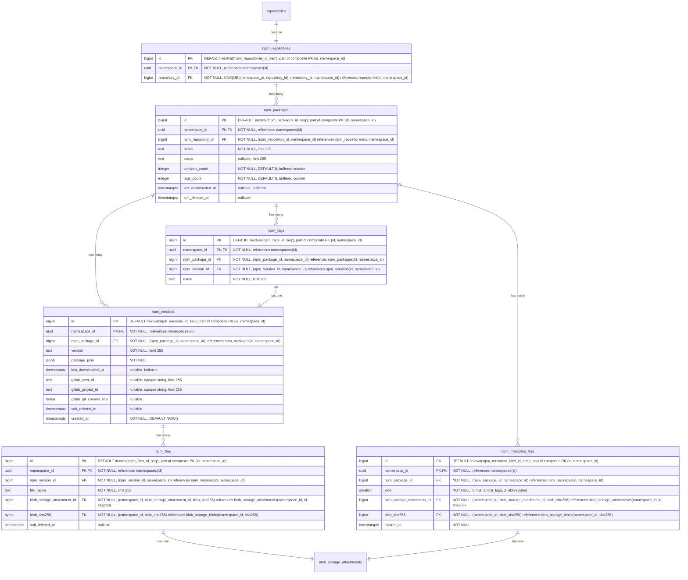

- **npm_repositories**: 複数のパッケージのコンテナ。各リポジトリはオプションのスコープを持つ複数のパッケージをホストできます。名前、可視性、フォーマット横断クエリのため `repository_id` を介して親 `repositories` テーブルを参照します。`HASH(namespace_id)` で 64 パーティションにパーティショニング。
- **npm_packages**: npm パッケージを表します。`name` カラムはスコープを含む完全なパッケージ名を保存します（例: `@myorg/mypackage` または `lodash`）。`versions_count` はソフト削除済みを含むパッケージの `npm_versions` 行数をカウントし、ガベージコレクションが行をハード削除したときにのみデクリメントされます。`tags_count` はその `npm_tags` 行数をカウントします（`npm_tags` にはソフト削除カラムがないため、この問題は発生しません）。どちらも [ADR-004](004_data_and_application_limits.md#entity-count-limits) のパッケージごとのエンティティ数制限（バージョン 25,000、タグ 1,000）を強制するバッファ付きカウンターであり、[バッファ／非同期書き込み](#buffered-and-asynchronous-writes) で維持されます。ソフト削除済みのバージョンを含めることは、`namespace_statistics.deduplicated_size_bytes` の扱いをミラーリングし、ゲーミングの抜け穴を塞ぎます: 上限からソフト削除済みの行を除外できる顧客は、ソフト削除済みの各行が依然としてストレージを占有し復元可能であるにもかかわらず、ソフト削除と再公開を繰り返すことで 25,000 バージョンの制限を無期限に下回り続けられてしまいます。どちらの上限も 32 ビットの上限を大きく下回るため `integer` 型です（`bigint` ではありません）。他の制限のないカウンター（`downloads_count`、`size_bytes`）は無制限に増加するため `bigint` が必要です。`last_downloaded_at` はパッケージのいずれかのファイルが最後にダウンロードされた時を記録し、[バッファ／非同期書き込み](#buffered-and-asynchronous-writes) で維持されます。`keep_last_downloaded_at` ライフサイクルルールで使用されます。`HASH(namespace_id)` で 64 パーティションにパーティショニング。
- **npm_versions**: 埋め込まれた package.json メタデータを持つ npm パッケージの個々のバージョンを格納します。`last_downloaded_at` はバージョンのいずれかのファイルが最後にダウンロードされた時を記録し、[バッファ／非同期書き込み](#buffered-and-asynchronous-writes) で維持されます。`keep_last_downloaded_at` ライフサイクルルールで使用されます。`gitlab_user_id`、`gitlab_project_id`、`gitlab_git_commit_sha` は、このバージョンを公開した GitLab ユーザーと公開の背後にある CI コンテキスト（プロジェクト、コミット）を記録します。[`container_manifests`](#container-repositories) の同等カラムと同じ形と根拠です。`created_at` は、バージョンが最初に公開された時を記録し、[`container_manifests`](#container-repositories) と同じ公開履歴および時間範囲の来歴スキャンを支えます。`HASH(namespace_id)` で 64 パーティションにパーティショニング。
- **npm_tags**: 特定のパッケージバージョンを指す [NPM distribution tag](https://docs.npmjs.com/cli/v11/commands/npm-dist-tag)（例: `latest`、`next`、`beta`）を提供します。`HASH(namespace_id)` で 64 パーティションにパーティショニング。
- **npm_files**: npm パッケージバージョンのファイルを表します。これらは主に tarball アーカイブです。レジストリがパフォーマンスのボトルネックを改善するために使用する補助ファイルでもありえます。`HASH(namespace_id)` で 64 パーティションにパーティショニング。
- **npm_metadata_files**: npm パッケージの事前計算されたメタデータファイルを、`kind` あたり 1 つずつ保存します。`kind` カラムはメタデータバリアントを区別します: `full`（0）はすべてのバージョンを含む完全な packument を含み、`dist_tags`（1）は distribution tag マッピングのみを含み、`abbreviated`（2）はリクエストに `Accept: application/vnd.npm.install-v1+json` が含まれる場合に提供されるインストール専用のプロジェクションです。適切なファイルがクライアントリクエストに基づいて npm メタデータエンドポイントで提供されます。メタデータはパッケージのすべてのバージョンにまたがるため、`npm_versions` ではなく `npm_packages` にリンクされます。メタデータファイルは、バージョンが公開または非公開になった後に非同期に生成されます。`expires_at` カラムはキャッシュの鮮度を駆動します: ライター（公開、非推奨化、非公開、dist-tag の変更）は、データ書き込みと同じトランザクション内で対象パッケージのすべての行に `expires_at = NOW()` を設定することでキャッシュを強制的に期限切れにします。リビルドジョブは、新たに生成された blob を持つ行を upsert する際に `expires_at = NOW() + npm.packument_cache_ttl` を設定します。リーダーは `expires_at > NOW()` でフィルタリングし、ミス時にはインラインビルドパスにフォールスルーするため、期限切れの行がクライアントに提供されることは決してありません。このカラムはハード削除の期限ではなく、キャッシュの鮮度シグナルです。強制的な期限切れは blob とアタッチメントをそのまま残すため、それらに対してすでに解決中のレスポンスは、リビルドジョブがアタッチメントを入れ替えるまで正常に完了します。`HASH(namespace_id)` で 64 パーティションにパーティショニング。
- **blob_storage_attachments**: 詳細は [Blob storage](#blob-storage) セクションを参照してください。

[Maven](#maven-repositories) と同様に、まったく同じ理由でパッケージ名とバージョンは 2 つの異なるテーブルに保存されます。

#### インデックス

- **`npm_repositories`**: `(namespace_id, repository_id)` のユニークインデックス — 親リポジトリ参照で NPM リポジトリを検索。
- **`npm_packages`**: `(namespace_id, npm_repository_id, name) WHERE soft_deleted_at IS NULL` のユニークインデックス — リポジトリ内で名前によりパッケージを検索。部分条件はソフト削除後に同じ名前でパッケージを再作成できるようにします。`(namespace_id, npm_repository_id, last_downloaded_at NULLS FIRST) WHERE soft_deleted_at IS NULL` のインデックス — `keep_last_downloaded_at` ライフサイクルルール評価をサポート。リポジトリ内のすべてのパッケージをスキャンして 1 行ずつフィルタリングするのではなく、有界な範囲スキャンで期限切れのパッケージのみを返します。`NULLS FIRST` は、ダウンロードされていないパッケージを最も古い行とグループ化し、両方が同じ範囲スキャンで返されるようにします。
- **`npm_versions`**: `(namespace_id, npm_package_id, version) WHERE soft_deleted_at IS NULL` のユニークインデックス — パッケージ内で特定のバージョンを検索。部分条件はソフト削除後に同じ識別子でバージョンを再作成できるようにします。`(namespace_id, npm_package_id, last_downloaded_at NULLS FIRST) WHERE soft_deleted_at IS NULL` のインデックス — `npm_packages` と同じ範囲スキャン戦略を使用して、パッケージのバージョンにスコープされた `keep_last_downloaded_at` ライフサイクルルール評価をサポート。`(namespace_id, created_at DESC)` のインデックス — namespace 全体の時系列スキャンで、公開履歴のページネーションと時間範囲のアーティファクト来歴クエリを支えます。ソフト削除された公開イベントも監査証跡に表示され続けるよう、無条件です。
- **`npm_tags`**: `(namespace_id, npm_package_id, name)` のユニークインデックス — パッケージ内で名前により distribution tag を検索。`(namespace_id, npm_version_id)` のインデックス — 指定されたバージョンを指すすべてのタグを見つける。
- **`npm_files`**: `(namespace_id, npm_version_id, file_name) WHERE soft_deleted_at IS NULL` のユニークインデックス — ファイル名はバージョン内で一意でなければなりません。部分条件はソフト削除後に同じ名前でファイルを再作成できるようにします。`(namespace_id, blob_storage_attachment_id)` のインデックス — ストレージアタッチメントでファイルを検索。
- **`npm_metadata_files`**: `(namespace_id, npm_package_id, kind)` のユニークインデックス — パッケージごとに kind ごとに 1 つのメタデータファイル。`(namespace_id, blob_storage_attachment_id)` のインデックス — ストレージアタッチメントでメタデータファイルを検索。

#### クエリ例

- 指定されたリポジトリ ID とパッケージ名のすべてのバージョンを取得

  ```sql
  SELECT nv.*
  FROM npm_versions nv
  JOIN npm_packages np
    ON nv.npm_package_id = np.id AND nv.namespace_id = np.namespace_id
  WHERE np.namespace_id = '018f4d6f-0e10-7e3a-9bfd-23a4c5d6e7f8' AND np.npm_repository_id = 123 AND np.name = '@myorg/mypackage'
    AND np.soft_deleted_at IS NULL AND nv.soft_deleted_at IS NULL;
  ```

- 公開パスの制限事前チェックのためにパッケージごとのエンティティ数カウンターを読み取る（補助的: `npm_versions` と `npm_tags` の部分ユニークインデックスがレースのない正式なガードです）:

  ```sql
  SELECT versions_count, tags_count
  FROM npm_packages
  WHERE namespace_id = '018f4d6f-0e10-7e3a-9bfd-23a4c5d6e7f8' AND id = 456 AND soft_deleted_at IS NULL;
  ```

- 指定されたバージョン ID とファイル名のファイルを取得

  ```sql
  SELECT nf.*
  FROM npm_files nf
  WHERE nf.namespace_id = '018f4d6f-0e10-7e3a-9bfd-23a4c5d6e7f8' AND nf.npm_version_id = 456 AND nf.file_name = 'mypackage-1.0.0.tgz'
    AND nf.soft_deleted_at IS NULL;
  ```

- パッケージの事前計算された完全メタデータファイルを取得（npm メタデータエンドポイントで提供）

  ```sql
  SELECT bsb.object_storage_key, bsb.size, bsb.content_type
  FROM npm_metadata_files nmf
  JOIN blob_storage_blobs bsb ON bsb.namespace_id = nmf.namespace_id AND bsb.sha256 = nmf.blob_sha256
  WHERE nmf.namespace_id = '018f4d6f-0e10-7e3a-9bfd-23a4c5d6e7f8' AND nmf.npm_package_id = 456 AND nmf.kind = 0
    AND nmf.expires_at > NOW();
  ```

  リードは `expires_at > NOW()` でフィルタリングします。ミス（行がない、またはライターが強制的に期限切れにしたか TTL が経過したために `expires_at <= NOW()`）はインラインビルドパスにフォールスルーします。以下のキャッシュリビルドジョブが新鮮な行を復元します。

- 書き込み時に packument キャッシュを強制的に期限切れにする

  公開、非推奨化、非公開、dist-tag の変更は、データ書き込みと同じトランザクション内で対象パッケージのすべての kind の `expires_at` を `NOW()` に切り替えることでキャッシュを無効化します。blob とアタッチメントはそのまま残されるため、すでに処理中のレスポンスは、リビルドジョブがアタッチメントを入れ替えるまで既存の blob に対して解決し続けます。

  ```sql
  UPDATE npm_metadata_files
  SET expires_at = NOW()
  WHERE namespace_id = '018f4d6f-0e10-7e3a-9bfd-23a4c5d6e7f8' AND npm_package_id = 456;
  ```

  初回公開ではまだ行が存在しないため、`UPDATE` は 0 行に影響します。リビルドジョブが初回実行時にキャッシュ行を挿入します。

- バージョンの公開または非公開後にメタデータファイルを upsert

  キャッシュリビルドジョブは、パッケージの kind ごとにこれを 1 回実行します。古いアタッチメントは、孤立アタッチメントが blob のガベージコレクションをブロックするのを防ぐため、同じトランザクション内で削除する必要があります（[Cleanup tasks](#cleanup-tasks) を参照）。

  ```sql
  -- 新しい blob とアタッチメント（id=789）は同じトランザクション内の早い段階で作成されます。
  -- 以下の interval は設定された `npm.packument_cache_ttl`（デフォルト 7 日）をミラーリングします。
  WITH old AS (
    SELECT blob_storage_attachment_id, blob_sha256
    FROM npm_metadata_files
    WHERE namespace_id = '018f4d6f-0e10-7e3a-9bfd-23a4c5d6e7f8' AND npm_package_id = 456 AND kind = 0
  ),
  upsert AS (
    INSERT INTO npm_metadata_files (namespace_id, npm_package_id, kind, blob_storage_attachment_id, blob_sha256, expires_at)
    VALUES ('018f4d6f-0e10-7e3a-9bfd-23a4c5d6e7f8', 456, 0, 789, 'abcd1234...'::bytea, NOW() + interval '7 days')
    ON CONFLICT (namespace_id, npm_package_id, kind)
    DO UPDATE SET blob_storage_attachment_id = EXCLUDED.blob_storage_attachment_id,
                  blob_sha256 = EXCLUDED.blob_sha256,
                  expires_at = EXCLUDED.expires_at
  )
  DELETE FROM blob_storage_attachments bsa
  USING old
  WHERE bsa.namespace_id = '018f4d6f-0e10-7e3a-9bfd-23a4c5d6e7f8'
    AND bsa.id = old.blob_storage_attachment_id
    AND bsa.sha256 = old.blob_sha256;
  ```

  最初の挿入では、`old` CTE は行を返さないため、アタッチメントは削除されません。
  競合（更新）時には、以前のアタッチメントが削除されます。同じ blob を参照する他のアタッチメントがなければ、古い blob はガベージコレクションされます（重複排除セーフ: 各クライアントは独自のアタッチメントを持つため、1 つを削除しても同じ blob を共有する他のクライアントには影響しません）。

### NPM Remote Repositories {#npm-remote-repositories}

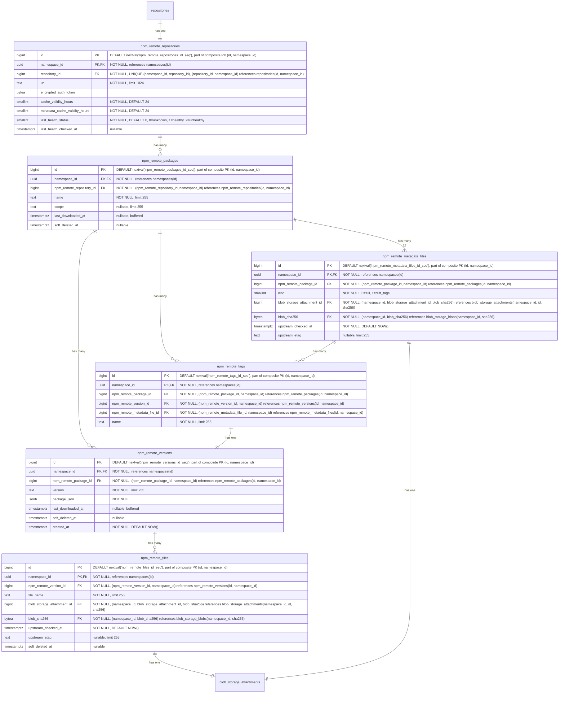

- **npm_remote_repositories**: 外部 npm レジストリを表します。URL、認証情報、アーティファクトキャッシュ TTL（`cache_validity_hours`）、パッケージメタデータレスポンス用の別の TTL（`metadata_cache_validity_hours`）を含みます。ヘルスチェックステータスはモニタリングのために追跡されます。`repository_id` を介して親 `repositories` テーブルを参照します。`HASH(namespace_id)` で 64 パーティションにパーティショニング。
- **npm_remote_packages**: キャッシュされた npm パッケージ。`last_downloaded_at` はパッケージのキャッシュされたファイルのいずれかが最後にダウンロードされた時を記録し、ホット行の競合を回避するためバッファ／非同期書き込みで維持されます。`keep_last_downloaded_at` ライフサイクルルールとキャッシュ保持評価で使用されます。
- **npm_remote_versions**: `package_json` メタデータを持つキャッシュされたバージョン。packument が取得されたときに設定されます（すべてのバージョンメタデータを含むため）。`last_downloaded_at` はバージョンのキャッシュされたファイルのいずれかが最後にダウンロードされた時を記録し、ホット行の競合を回避するためバッファ／非同期書き込みで維持されます。`keep_last_downloaded_at` ライフサイクルルールとキャッシュ保持評価で使用されます。`created_at` は、バージョンが最初にキャッシュされた時を記録し、[`npm_versions`](#npm-repositories) をミラーリングしてキャッシュ側の公開履歴および来歴スキャンを支えます。
- **npm_remote_tags**: キャッシュされた dist-tag からバージョンへのマッピング（例: `latest`、`next`）。packument から設定されます。
- **npm_remote_metadata_files**: アップストリームレジストリからキャッシュされた事前計算メタデータファイルを、パッケージごとに kind ごとに 1 つずつ保存します。`kind` はすべてのバージョンを含む完全な packument（`0`）と dist-tags のみのマッピング（`1`）を区別します。`upstream_checked_at` はメタデータがアップストリームレジストリに対して最後に検証された時を記録し、`metadata_cache_validity_hours` と比較して再検証が必要かどうかを判断します。`upstream_etag` はアップストリームから返された ETag を保存し、条件付きリクエスト（`If-None-Match`）を可能にすることで、変更されていないメタデータの再ダウンロードを回避します。
- **npm_remote_files**: キャッシュされた tarball。`upstream_checked_at` はファイルがアップストリームレジストリに対して最後に検証された時を記録し、`cache_validity_hours` と比較して再検証が必要かどうかを判断します。`upstream_etag` はアップストリームから返された ETag を保存し、条件付きリクエスト（`If-None-Match`）を可能にすることで、変更されていない tarball の再ダウンロードを回避します。
- **blob_storage_attachments**: 詳細は [Blob storage](#blob-storage) セクションを参照してください。

#### インデックス

- **`npm_remote_repositories`**: `(namespace_id, repository_id)` のユニークインデックス — 親参照でリモートリポジトリを検索。
- **`npm_remote_packages`**: `(namespace_id, npm_remote_repository_id, name) WHERE soft_deleted_at IS NULL` のユニークインデックス — 名前でキャッシュされたパッケージを検索。部分条件はソフト削除後に同じ名前でパッケージを再作成できるようにします。
- **`npm_remote_versions`**: `(namespace_id, npm_remote_package_id, version) WHERE soft_deleted_at IS NULL` のユニークインデックス — パッケージ内でキャッシュされたバージョンを検索。部分条件はソフト削除後に同じ識別子でバージョンを再作成できるようにします。`(namespace_id, created_at DESC)` のインデックス — namespace 全体の時系列スキャンで、ローカルの [`npm_versions`](#npm-repositories) インデックスをミラーリングして、キャッシュ側の公開履歴と来歴をカバーします。ローカルインデックスと同じ監査証跡の理由から無条件です（`soft_deleted_at` 述語なし）。
- **`npm_remote_tags`**: `(namespace_id, npm_remote_package_id, name)` のユニークインデックス — 名前で distribution tag を検索。`(namespace_id, npm_remote_version_id)` のインデックス — 指定されたバージョンを指すすべてのタグを見つける。
- **`npm_remote_metadata_files`**: `(namespace_id, npm_remote_package_id, kind)` のユニークインデックス — パッケージごとに kind ごとに 1 つのメタデータファイルを強制。`(namespace_id, blob_storage_attachment_id)` のインデックス — ストレージアタッチメントでメタデータファイルを検索。
- **`npm_remote_files`**: `(namespace_id, npm_remote_version_id, file_name) WHERE soft_deleted_at IS NULL` のユニークインデックス — ファイル名はバージョン内で一意でなければなりません。部分条件はソフト削除後に同じ名前でファイルを再作成できるようにします。`(namespace_id, blob_storage_attachment_id)` のインデックス — ストレージアタッチメントでファイルを検索。

#### クエリ例

- リモートリポジトリを作成

  ```sql
  -- まず親リポジトリを作成
  INSERT INTO repositories (namespace_id, name, format, kind, visibility)
  VALUES ('018f4d6f-0e10-7e3a-9bfd-23a4c5d6e7f8', 'npm-registry', 2, 2, 0)
  RETURNING id;
  -- リポジトリを Repository collection にリンク
  INSERT INTO repository_collection_repositories (namespace_id, repository_collection_id, repository_id)
  VALUES ('018f4d6f-0e10-7e3a-9bfd-23a4c5d6e7f8', 456, <returned_id>);
  -- 次にフォーマット固有のレコードを作成
  INSERT INTO npm_remote_repositories (namespace_id, repository_id, url, encrypted_auth_token)
  VALUES ('018f4d6f-0e10-7e3a-9bfd-23a4c5d6e7f8', <returned_id>, 'https://registry.npmjs.org', $1);
  ```

- パッケージのすべてのキャッシュされたバージョンを取得（packument レスポンスを提供）

  ```sql
  SELECT nrv.version, nrv.package_json
  FROM npm_remote_versions nrv
  JOIN npm_remote_packages nrp
    ON nrv.npm_remote_package_id = nrp.id AND nrv.namespace_id = nrp.namespace_id
  WHERE nrp.namespace_id = '018f4d6f-0e10-7e3a-9bfd-23a4c5d6e7f8'
    AND nrp.npm_remote_repository_id = 789
    AND nrp.name = '@myorg/mypackage'
    AND nrp.soft_deleted_at IS NULL AND nrv.soft_deleted_at IS NULL;
  ```

- キャッシュされた tarball をプル（読み取りパスショートカット）

  ```sql
  SELECT bsb.object_storage_key, bsb.size
  FROM npm_remote_files nrf
  JOIN blob_storage_blobs bsb
    ON bsb.namespace_id = nrf.namespace_id AND bsb.sha256 = nrf.blob_sha256
  WHERE nrf.namespace_id = '018f4d6f-0e10-7e3a-9bfd-23a4c5d6e7f8'
    AND nrf.npm_remote_version_id = 456
    AND nrf.file_name = 'mypackage-1.0.0.tgz'
    AND nrf.soft_deleted_at IS NULL;
  ```

### NPM Virtual Repositories {#npm-virtual-repositories}

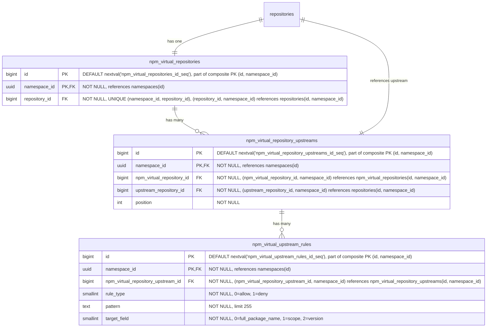

- **npm_virtual_repositories**: npm パッケージの仮想リポジトリ。名前、可視性、フォーマット横断クエリのため `repository_id` を介して親 `repositories` テーブルを参照します。`HASH(namespace_id)` で 64 パーティションにパーティショニング。
- **npm_virtual_repository_upstreams**: 仮想リポジトリとそのアップストリームを結合するテーブル。各仮想リポジトリは順序付きのアップストリームリストを持ちます。各エントリは `upstream_repository_id` を介してアップストリームリポジトリを参照し、`repositories(namespace_id, id)` を指します。複合 FK `(namespace_id, upstream_repository_id)` は、アップストリームが同じ namespace 内にあることを強制します — レジストリが namespace にスコープされていることと一貫しています（[ADR-001](001_organizations_as_anchor_point.md)）。`HASH(namespace_id)` で 64 パーティションにパーティショニング。
- **npm_virtual_upstream_rules**: アップストリームの allow/deny フィルタルールを定義します。各ルールは、このアップストリームを介して解決されるときに含めるか除外するアーティファクトを制御するためのワイルドカードパターンとターゲットフィールドを指定します。MVP ではパターンはワイルドカードのみで、正規表現サポートは顧客のフィードバックが正当化するまで延期されます（[議論](https://gitlab.com/gitlab-org/gitlab/-/work_items/597754#note_3291871207)）。`HASH(namespace_id)` で 64 パーティションにパーティショニング。

#### インデックス

- **`npm_virtual_repositories`**: `(namespace_id, repository_id)` のユニークインデックス — 親参照で仮想リポジトリを検索。
- **`npm_virtual_repository_upstreams`**: `(namespace_id, npm_virtual_repository_id, position) DEFERRABLE INITIALLY DEFERRED` のユニークインデックス — 仮想リポジトリの順序付きアップストリームを取得。トランザクション内で並べ替えできるよう DEFERRABLE。`(namespace_id, npm_virtual_repository_id, upstream_repository_id)` のユニークインデックス — 同じアップストリームが仮想リポジトリに 2 回追加されることを防ぐ。
- **`npm_virtual_upstream_rules`**: `(namespace_id, npm_virtual_repository_upstream_id)` のインデックス — 指定されたアップストリームのすべてのルールを取得。

#### クエリ例

- 仮想リポジトリを作成

  ```sql
  -- まず親リポジトリを作成
  INSERT INTO repositories (namespace_id, name, format, kind, visibility)
  VALUES ('018f4d6f-0e10-7e3a-9bfd-23a4c5d6e7f8', 'my-virtual-repo', 2, 1, 1)
  RETURNING id;
  -- リポジトリを Repository collection にリンク
  INSERT INTO repository_collection_repositories (namespace_id, repository_collection_id, repository_id)
  VALUES ('018f4d6f-0e10-7e3a-9bfd-23a4c5d6e7f8', 456, <returned_id>);
  -- 次にフォーマット固有のレコードを作成
  INSERT INTO npm_virtual_repositories (namespace_id, repository_id)
  VALUES ('018f4d6f-0e10-7e3a-9bfd-23a4c5d6e7f8', <returned_id>);
  ```

- 仮想リポジトリをアップストリームに関連付け

  ```sql
  INSERT INTO npm_virtual_repository_upstreams (namespace_id, npm_virtual_repository_id, upstream_repository_id, position)
  VALUES ('018f4d6f-0e10-7e3a-9bfd-23a4c5d6e7f8', 123, 789, 1);
  ```

### Blob ストレージ {#blob-storage}

Blob ストレージのデータ構成は、以下の前提のもとで行われています:

- blob への 1 対多の関連付けを扱う必要はありません。これは blob ストレージクライアント領域で処理されます。したがって、1 対 1 の関連付けのみが必要です。
- 適切な [クリーンアップ処理](#cleanup-tasks) のため、単一の blob を何人の blob ストレージクライアントが使用しているか（重複排除）を追跡する必要があります。
- さらに、単一の blob に対する各使用の異なる起源を追跡したい場合があります。

ここで提示するスキーマは、データのストレージ側のみを考慮しています。メトリクスや [クリーンアップ](#cleanup-tasks) のような追加の側面のために必要となる補助テーブルがあるかもしれませんが、これらの部分はまだ評価中であるため、ここでは記述しません。アップロードセッション追跡については [Upload sessions](#upload-sessions) で記述します。

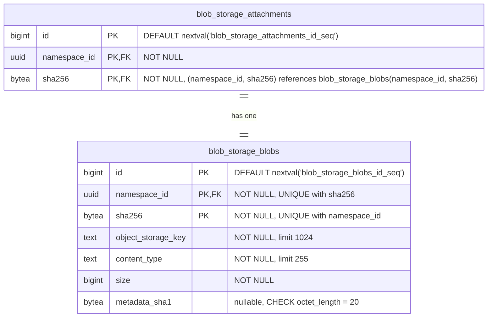

- **blob_storage_attachments**: 指定された blob の使用を追跡します。各クライアント（Container、NPM、Maven リポジトリテーブル）は、blob レコードを使用（作成または再利用）したいときに、ここにレコードを作成する必要があります。各使用は、ここに 1 つのレコードを _必ず_ 持つ必要があります。クライアントは、参照しているアーティファクトレコード（ファイル、blob、キャッシュエントリ）を削除するときに、アタッチメントレコードを削除する責任があります。両方の削除は、孤立アタッチメントが blob クリーンアップをブロックすることを防ぐため、同じトランザクション内で行われる必要があります。クライアントテーブルから `blob_storage_attachments` への外部キーは参照整合性を強制します（ダングリング参照を防ぐ）が、`ON DELETE CASCADE` は使用しません — クリーンアップはアプリケーション管理です。例えば、まったく同じファイルを持つ 2 つの Maven パッケージは、それぞれが異なるアタッチメントレコードを参照する必要があり、それらは同じ blob レコードを参照します。`namespace_id` カラムは Cells シャーディングに必要です。`sha256` カラムは、パーティションプルーニングされた結合（[パーティショニング戦略](#blob-storage-partitioning-strategy) を参照）を可能にするため、参照される `blob_storage_blobs` レコードから伝播されます。プライマリキーは従来の `(id)` ではなく `(id, namespace_id, sha256)` です: `sha256` はハッシュパーティショニングされたテーブルのすべてのユニーク制約の一部にパーティションキーを含めることを PostgreSQL が強制するため必要で、`namespace_id` はデプロイメント横断で PK をグローバルに一意に保つため必要です。ローカルな `bigint id` は単一の Artifact Registry データベース内でのみ一意（[Namespace ID type](#namespace-id-type) を参照）なため、デプロイメント横断 namespace 移行（[ADR-022](022_namespace_decoupling.md)）では、同じ `(id, sha256)` ペアがターゲットデータベースにすでに存在する可能性があります。UUIDv7 `namespace_id` を PK に追加することで、構造的にこの衝突を排除します。クライアントテーブルは `(namespace_id, blob_storage_attachment_id, blob_sha256)` を介してこの複合 PK を参照します。
- **blob_storage_blobs**: このテーブルは、オブジェクトストレージに存在するすべてのファイルコンテンツ（blob として）をリストします。オブジェクトストレージキーは完全に専用のカラムに保存され、blob が使用されるたびに計算されることはありません。`sha256` は基本的なコンテンツアドレス可能な識別子で、常に存在します（`NOT NULL`）。`namespace_id` カラムは重複排除を Organization にスコープします。フォーマット固有のチェックサム（例: Maven の SHA1 と MD5）は、このテーブルではなくフォーマット固有のファイルテーブルに保存され、このテーブルをフォーマット非依存に保ちます。`metadata_sha1` カラムは、そのフォーマット非依存ルールに対する意図的でスコープされた例外です: コミット時に blob にアタッチされる MVP のユーザーメタデータ許可リストの SHA-1 をミラーリングし、SHA-1 が提供されなかった場合は `NULL` です。これが（フォーマット固有のテーブルではなく）`blob_storage_blobs` にあるのは、ストレージ層の blob-info ルックアップが、プッシュとプルのホットパスで契約上 1 回の DB ラウンドトリップであるためです。DB ミラーなしでユーザーメタデータを表面化すると、ダイジェストごとのオブジェクトストレージ HEAD ファンアウトか部分的な API 表面化を強いることになります。同じ値はコミット時にバックエンドネイティブな `x-amz-meta-checksum-sha1` / `x-goog-meta-checksum-sha1` ヘッダーとしてストレージオブジェクトにアタッチされ、行は不変なので、DB とストレージオブジェクトのコピーがずれることはありません。将来の許可リスト追加は、改訂によってそれぞれの nullable カラムを追加します。完全な根拠については [Artifact Registry S06 ストレージ層仕様](https://gitlab.com/gitlab-org/ops/artifact-registry/-/blob/main/docs/specs/S06-storage-layer.md) を参照してください。プライマリキーは上記の `blob_storage_attachments` と同じ理由で `(id, namespace_id, sha256)` です: `sha256` は PostgreSQL のパーティションキー包含ルールを満たし、UUIDv7 `namespace_id` はデプロイメント横断で PK をグローバルに一意に保ち、サロゲート `bigint id` はスキーマ内の他のすべてのテーブルと一貫した行識別子の形を保ちます。Organization ごとの重複排除は別の `UNIQUE (namespace_id, sha256)` 制約によって強制され、これはコンテンツハッシュによる検索インデックスとしても機能し、このテーブルへのすべての外部キーのターゲットとなります。FK は PK を直接参照しません: `(namespace_id, sha256)` はすでに行を一意に識別し、UUIDv7 `namespace_id` を介してそれ自体でグローバルに一意であるため、呼び出し元はサロゲート `id` を持たずに自然キーを介して結合します。

Blob ストレージテーブルは、Artifact Registry の外でも再利用可能になるよう設計されています。これにより、他の機能が同じ重複排除とストレージインフラを活用できます。

すべてのハッシュカラム（`digest` と `sha256`、`sha1`、`md5`、`sha512` — Maven 固有）は `bytea` として保存されます。正確なエンコーディング戦略（[Container Registry](https://gitlab.com/gitlab-org/container-registry) のようなインラインアルゴリズム接頭辞、または別の `digest_algorithm` カラム）はまだ決定されていません。

### Upload sessions {#upload-sessions}

Upload session は、[ADR-008](008_content_addressable_storage.md#two-phase-upload-strategy) で記述された 2 フェーズアップロードライフサイクルを通る進行中の blob アップロードを追跡します。各セッションは、namespace のストレージパーティション内の `uploads/{upload_id}` にある一時ストレージオブジェクトにマッピングされます。セッションは、アップロード API（再開可能なアップロード、並行アップロード解決）をサポートし、オブジェクトストレージの列挙なしに [アップロードのパージ](#cleanup-tasks) を可能にするため、初期スキーマからデータベース追跡されます（[ADR-011](011_data_reconciliation.md)）。

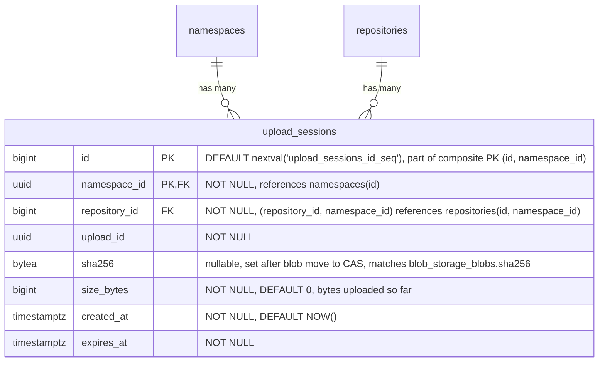

- **upload_sessions**: 進行中の各 blob アップロードを追跡します。テーブルは、[コンテナレジストリパターン](https://gitlab.com/gitlab-org/container-registry/-/blob/master/registry/storage/blobwriter.go) を模倣した、バイナリ存在モデルに従います: 行が存在する場合、アップロードは進行中またはクリーンアップが必要で、存在しない場合、アップロードは完了したかパージされました。完了時、アプリケーションは blob をコンテンツアドレス可能ストアに移動し、`blob_storage_blobs` と `blob_storage_attachments` レコードを作成するのと同じトランザクション内でセッション行を削除します。`upload_id`（UUID）は一時オブジェクトパス（`uploads/{upload_id}`）で使用されるストレージレベルの識別子です。`repository_id` はアップロードを開始したリポジトリを記録します。後続のリクエスト（PATCH チャンク、PUT コミット、DELETE キャンセル）では、サーバーは URL のリポジトリが session.repository_id と一致することを検証し、`upload_id` がリークした場合のクロスレポでの再利用を防ぎます。各リクエストの認可はリクエストミドルウェアによって URL のリポジトリに対して実行され、このカラムには依存しません。複合 FK `(namespace_id, repository_id)` は、アップロードがターゲットリポジトリと同じ namespace 内にあることを強制します。`sha256` はアップロード中は NULL で、blob が最終的なコンテンツアドレス可能パスに移動された後に設定されます。これは外部キーではなく単なる値で、blob を CAS に移動してからセッション行を削除する間にアプリケーションがクラッシュするリカバリケースを処理します — `sha256 IS NOT NULL` は blob がすでに移動されており、残りのステップがクリーンアップを完了して行を削除することであることを示します。`size_bytes` は一時ストレージに書き込まれたバイト数を追跡します。再開可能アップロードの場合、各チャンクが到着するたびに更新され、クライアントに再開位置を伝える `Range` レスポンスヘッダーを生成するために使用されます（[OCI Distribution Spec](https://github.com/opencontainers/distribution-spec/blob/main/spec.md)）。モノリシックアップロードの場合は、blob データが書き込まれた後に設定されます。`created_at` はアップロードが開始された時を記録します。アップロード期間メトリクス（期間と blob サイズの相関）と、アプリケーションの TTL 設定が下げられた場合の遡及的な有効期限切れ（`WHERE created_at < NOW() - :new_ttl`）を可能にし、既存のセッションは元の有効期限を保持するため `expires_at` だけではこれをサポートできません。`expires_at` はセッションの有効期限タイムスタンプで、アップロードタイプ（非再開可能の場合は短く、再開可能の場合は長い）に基づいて作成時に `NOW() + :configured_ttl` として計算されます。期限切れセッションはアップロードパージの候補です: パージャーは一時ストレージオブジェクトを削除し行を削除します（[ADR-008](008_content_addressable_storage.md#temporary-object-cleanup)）。再開可能アップロードのハッシュ状態は、コンテナレジストリパターンに従って、データベースではなくオブジェクトストレージ内のアップロードデータの隣（`uploads/{upload_id}/hashstates/{algorithm}/{offset}`）に保存されます（[ADR-008](008_content_addressable_storage.md#resumable-uploads-and-hash-state)）。スキーマ内の他のすべての `namespace_id`-スコープテーブルと一貫して `HASH(namespace_id)` で 64 パーティションにパーティショニング。セッションは短命ですが、アップロードパージャーは延期されているため（[ADR-011](011_data_reconciliation.md)）、パージャーが出荷されるまで期限切れ行が蓄積し、初日からのパーティショニングは後のマイグレーションを回避し、`repositories` とのパーティションワイズ結合の適格性を保ち、空のパーティションではコストはかかりません。プライマリキーは従来の `(id)` ではなく `(id, namespace_id)` です — PostgreSQL はハッシュパーティショニングされたテーブルのすべてのユニーク制約の一部にパーティションキーを含めることを要求し、この PK はすでに UUIDv7 `namespace_id` を含むため、それ以上の追加なしにデプロイメント横断でグローバルに一意です（同じ保証のためにパーティションキーの上に `namespace_id` を追加する必要があった `blob_storage_attachments` と `blob_storage_blobs` とは対照的に）。

#### インデックス

- **`upload_sessions`**: `(namespace_id, upload_id)` のユニークインデックス — namespace 内で upload UUID でセッションを検索。`expires_at` のインデックス — アップロードパージのために期限切れセッションを見つける。`(namespace_id, repository_id)` のインデックス — 認可チェックとリポジトリ削除時のクリーンアップに使用する、指定されたリポジトリのすべてのセッションを見つける。

#### クエリ例

- アップロードセッションを作成

  ```sql
  INSERT INTO upload_sessions (namespace_id, repository_id, upload_id, expires_at)
  VALUES ('018f4d6f-0e10-7e3a-9bfd-23a4c5d6e7f8', 456, 'a0eebc99-9c0b-4ef8-bb6d-6bb9bd380a11', NOW() + INTERVAL '1 hour')
  RETURNING id, upload_id;
  ```

- チャンクアップロード中にセッションを検索

  ```sql
  SELECT *
  FROM upload_sessions
  WHERE namespace_id = '018f4d6f-0e10-7e3a-9bfd-23a4c5d6e7f8' AND upload_id = 'a0eebc99-9c0b-4ef8-bb6d-6bb9bd380a11';
  ```

- blob 移動成功後に blob ダイジェストを記録

  ```sql
  UPDATE upload_sessions
  SET sha256 = 'abcd1234...'::bytea, size_bytes = 1048576
  WHERE namespace_id = '018f4d6f-0e10-7e3a-9bfd-23a4c5d6e7f8' AND upload_id = 'a0eebc99-9c0b-4ef8-bb6d-6bb9bd380a11';
  ```

- アップロードパージのために期限切れセッションを見つける

  ```sql
  SELECT id, namespace_id, upload_id
  FROM upload_sessions
  WHERE expires_at < NOW()
  ORDER BY expires_at
  LIMIT 100;
  ```

  このクエリはパーティションプルーニングされません — 述語に `namespace_id` が含まれないため、64 個のパーティションすべてをスキャンします。これはここでは許容されます: パージャーは有界なバックグラウンドジョブ（`LIMIT 100`、`expires_at` のインデックスでサポート）であり、ホットパスクエリではないため、ファンアウトはパフォーマンスクリティカルではありません。

- クリーンアップ後にセッションを削除

  ```sql
  DELETE FROM upload_sessions
  WHERE namespace_id = '018f4d6f-0e10-7e3a-9bfd-23a4c5d6e7f8' AND id = 789;
  ```

### パーティショニング不変条件 {#partitioning-invariant}

**`namespace_id` を含むすべてのテーブルはパーティショニングされます。** デフォルトのパーティションキーは `HASH(namespace_id)` で 64 パーティションです。文書化された理由がある場合、特定のテーブルは異なるキーを使うことがあります（`HASH(sha256)` の例外については [Blob ストレージのパーティショニング戦略](#blob-storage-partitioning-strategy) を参照）。`namespace_id` を含まないテーブルはパーティショニングされません。

このルールは、テーブルごとの判断ではなく、行のプロパティとして述べられます: `namespace_id` がスキーマの一部であれば、そのテーブルはパーティショニングされます。「このテーブルは小さい」「このテーブルは親と 1:1」「後でパーティショニングを追加できる」といった例外はありません。小さなテーブルも大きなテーブルと同じようにパーティショニングされます。均一性が肝心なのです。低ボリュームのテーブルをパーティショニングするコストは無視できます — ほぼ空の子が 64 個、測定可能なランタイムオーバーヘッドなし — 一方で、後からパーティショニングを _追加する_ コストは、本番データが配置された後のテーブル書き換え、プライマリキーの再形成、カスケードする外部キー変更が支配的になります。

#### 機械的な帰結

PostgreSQL は、パーティショニングされたテーブルのすべてのユニーク制約の一部にパーティションキーを含めることを要求します。これがスキーマ全体のプライマリキーと外部キーを形作ります:

- **プライマリキー。** すべてのパーティショニングされたテーブルのプライマリキーは `namespace_id` を吸収します: `(id)` は `(id, namespace_id)` になります。パーティショニングされたテーブルのユニークインデックスは、先頭カラムとして `namespace_id` を含みます。
- **パーティショニングされたテーブル間の外部キー。** `namespace_id` で複合になります。子は `(<parent>_id, namespace_id)` を介して親の `(id, namespace_id)` を参照します。このパターンは `repositories`、`workspaces`、フォーマット固有のリポジトリテーブル、ミッドティアテーブル、ファイルテーブル、リモートキャッシュテーブルで統一されています。
- **`namespaces` への外部キー。** 単一カラム。`namespace_id` は `namespaces(id)` を参照します。`namespaces` はプライマリキーが `(id)` のままである唯一のテーブルです — パーティショニングされておらず、自身の `namespace_id` を持ちません（それを _定義_ します）。そのため、子テーブルは複合 PK の小細工なしにそれを参照します。

複合外部キーの形は、namespace 境界をスキーマレベルでエンコードします: パーティショニングされたテーブルの行は、異なる namespace に属する別のパーティショニングされたテーブルの行を参照できません。外部キーがそれを禁じるためです。これは Cells シャーディングキー（`namespace_id`）がアプリケーションレベルで引く境界と同じもので、データベース自体で冗長化されています。

#### 例外

テーブルがパーティショニングされないのは、`namespace_id` を欠く場合のみです。今日の主な例は `namespaces` 自体です: `namespace_id` がわかる前に `slug` から解決されるルーティングルートで、それを定義するため `namespace_id` カラムを持ちません。`namespace_id` を持たない将来のテーブル — 例えば、インスタンス全体の設定、グローバルな cron 状態、デプロイメントスコープのライフサイクルメタデータ — は、このデフォルトを自動的に継承し、パーティショニングされません。

例外の述語は構造的です: 行に `namespace_id` が存在するか否か。これは行数、書き込み頻度、現在のアクセスパターンに依存せず、それらはすべてシステムの進化とともに変化しうるものです。

シングルテナントデプロイメント（Dedicated、Self-Managed、シングル Organization Cells）も例外ではありません: それらは 64 個すべてのパーティションを保持し、1 つが埋まり 63 個が空になります。空のパーティションはこの規模では無視できます（それぞれ数 KB のカタログとインデックスのオーバーヘッド）。パーティションプルーニングは影響を受けず、デプロイメント間のスキーマの均一性はシングルテナントのバリアントを切り出すよりも価値があります。「1 つのパーティションがすべてを保持する」という病的なケースは、完全なマルチテナント規模での `blob_storage_blobs` / `blob_storage_attachments` にのみ当てはまり、そのためこれら 2 つのテーブルは代わりに `HASH(sha256)` を使います — [Blob ストレージのパーティショニング戦略](#blob-storage-partitioning-strategy) を参照してください。

### Blob ストレージのパーティショニング戦略 {#blob-storage-partitioning-strategy}

[Consequences](#negative) で述べたように、`blob_storage_blobs` と `blob_storage_attachments` は、すべての Organization にわたるすべてのアーティファクトフォーマットを提供するため、非常に高い行数を蓄積します。意図的なパーティショニング戦略がないと、以下につながります:

- テーブルが数十億行に成長するにつれてインデックスの肥大化とクエリパフォーマンスの低下。
- すべてのアーティファクトタイプを同時にブロックするテーブル全体のロック（例: インデックス作成中またはスキーママイグレーション中）。
- 高い書き込みレートでの autovacuum 競合。

留意すべき重要な制約: PostgreSQL は、パーティショニングされたテーブルのすべてのユニーク制約の一部にパーティションキーを含めることを要求します。`blob_storage_blobs` の場合、重複排除制約は `UNIQUE (namespace_id, sha256)` です。パーティションキーがこれらのカラムのサブセットではない戦略は、その制約に追加のカラムを強制することになります — これはもはや、同じ Organization 内で同じ blob が異なるパーティション間で 2 回保存されることを防ぐことができず、重複排除モデル全体を損ないます。

以下が候補戦略です。

#### オプション A: `sha256` でハッシュパーティショニング

両方のテーブルを 64 パーティションで `PARTITION BY HASH (sha256)` を使用してパーティショニング。

`sha256` はコンテンツアドレス可能ダイジェストであるため、その値は本質的に均一に分散されます — 均等なデータ分散のために追加の労力は必要ありません。これはシングルテナント問題を解決します: シングルテナントデプロイメント（Dedicated、Self-Managed、シングル Organization Cells）は、`namespace_id` のみを使用すると、すべての行を単一のパーティションに集中させます。パーティションキーとして `sha256` を使うと、Organization の数に関係なく、行は 64 個すべてのパーティションに均等に広がります。

`[namespace_id, sha256]` の既存のユニーク制約はすでに `sha256` を含むため、このスキームと互換性があります — パーティションキーが制約の一部であるため、PostgreSQL はハッシュパーティション間で一意性を強制できます。

このアプローチでは、`blob_storage_blobs` への結合を単一のパーティションをターゲットにできるよう、`sha256` を `blob_storage_attachments` とフォーマット固有のテーブル（`*_files`、`container_blobs`、`container_manifests`、キャッシュエントリ）に伝播する必要があります。これは、blob 識別子（`namespace_id` + `sha256`）が `*_files` と `blob_storage_attachments` の両方の行に保存され、単純な `bigint` 外部キーよりも多くの物理ストレージを使用することを意味します（`sha256` は `bytea` として 32 バイト、`bigint` は 8 バイト）。ただし、トレードオフは正当化されます: 読み取りパス（アーティファクトプル） — システムで最もホットなクエリ — は、`*_files` から `blob_storage_blobs` に `(namespace_id, sha256)` を介して直接結合でき、`blob_storage_attachments` を完全にスキップし、1 つの結合を排除します。アタッチメントは、[クリーンアップ](#cleanup-tasks) 中に「この blob はまだ誰かに使われているか?」に答えるライフサイクルパスのために残ります。

5 つの重要なアクセスパターンは次のように動作します:

| # | 操作 | 頻度 | ヒットするパーティション |
|---|------|------|---------------------|
| AP1 | アーティファクトプル（`*_files` → `blob_storage_blobs` を `namespace_id` + `sha256` 経由） | 最高 | 1 |
| AP2 | 孤立チェック（`WHERE namespace_id = ? AND sha256 = ?`） | 高 | 1 |
| AP3 | 重複排除 upsert（`ON CONFLICT (namespace_id, sha256) DO NOTHING`） | 中〜高 | 1 |
| AP4 | アタッチメント CRUD（blob から伝播された `namespace_id` + `sha256`） | 中 | 1 |
| AP5 | Organization 別のストレージアカウンティング（`WHERE namespace_id = ?`、`sha256` なし） | 低 | 64 個すべて（緩和済み） |

**ポジティブ**:

- テナント集中に関係なく均一な分散: シングルテナントデプロイメントは 1 つに集中せず、64 個すべてのパーティションにデータを広げます。
- すべての高頻度アクセスパターン（プル、孤立チェック、重複排除 upsert、アタッチメント CRUD）はちょうど 1 つのパーティションにヒットします。
- ユニーク制約 `(namespace_id, sha256)` はパーティションキーを含みます — 重複排除 upsert は単一パーティションをターゲットにし、外部ロックなしに `ON CONFLICT DO NOTHING` で並行アップロードを解決します。
- 読み取りパス（アーティファクトプル）は `blob_storage_attachments` 結合を完全にスキップし、`(namespace_id, sha256)` を介して `*_files` から `blob_storage_blobs` に直接行きます。

**ネガティブ**:

- `sha256` をより多くのテーブルに伝播する必要があります: `blob_storage_attachments` とフォーマット固有のテーブル（`*_files`、`container_blobs`、`container_manifests`、キャッシュエントリ）は、`blob_storage_attachment_id` 外部キーに加えて `(namespace_id, sha256)` を運びます。これは行間で blob 識別子を重複させ、行ごとのストレージを増加させます。
- `namespace_id` のみで `sha256` なしのクエリはパーティションをプルーニングできず、64 個すべてをスキャンします。主なケースはストレージアカウンティング（Organization ごとの blob サイズの合計）です。これは、blob の挿入／削除時に遅延インクリメントで更新される専用のロールアップテーブル（GitLab で既に確立されたパターン、例: プロジェクト統計）によって緩和されます。ロールアップテーブルがなくても、64 パーティション間の並列集計は数秒で完了します。

#### オプション B: `namespace_id` でハッシュパーティショニング

両方のテーブルを固定数のパーティションで `PARTITION BY HASH (namespace_id)` を使用してパーティショニング。

すべての一般的なアクセスパターンは `WHERE` 句に `namespace_id` をすでに含むため、クエリプランナーはすべての操作で単一のパーティションをターゲットにできます。Cells シャーディングキー（`namespace_id`）はパーティションキーを兼ねており、これは広範なアーキテクチャと一貫しています。

`[namespace_id, sha256]` のユニーク制約はすでに `namespace_id` を含むため、このスキームと変更なしに互換性があります — PostgreSQL はすべてのハッシュパーティション間でグローバルに一意性を強制します。

**ポジティブ**:

- すべての Organization スコープのクエリは単一のパーティションにヒットします。クエリプランナーは他のすべてを自動的にプルーニングします。
- パーティションプルーニングはクリーンアップパスに直接適用されます: `blob_storage_attachments` の孤立チェック（`WHERE namespace_id = ? AND sha256 = ?`）は単一のパーティションをターゲットにすることが保証され、ルックアップコストをテーブル総量ではなくパーティションサイズに制限します。
- スキーマ変更とロックは単一のパーティションにスコープされ、他の Organization への影響を減らします。
- Cells シャーディングキーと整合します。一般的なアクセスパターンでクロスパーティション作業はありません。
- `[namespace_id, sha256]` の既存の制約は変更なしに正しく機能します。

**ネガティブ**:

- Organization のサイズが大きく異なる場合、非常に多くの blob 数を持つ Organization は、それらのハッシュパーティションを支配する可能性があります。シングルテナントデプロイメント（Dedicated、Self-Managed、シングル Organization Cells）では、すべての行が単一のパーティションに集中します — VACUUM は数時間かかり、インデックスは数百 GB に達します。
- `WHERE` 句から `namespace_id` を省略するクエリは、すべてのパーティションをスキャンします。

#### オプション C: `id`（プライマリキー）でレンジパーティショニング

両方のテーブルを自動増分するプライマリキーの範囲でパーティショニング。これは GitLab の既存の [テーブルパーティショニングフレームワーク](https://docs.gitlab.com/ee/development/database/table_partitioning.html) で使用されているアプローチで、既存のツールで十分にサポートされています。

**ポジティブ**:

- パーティションサイズは予測可能に成長します。データが蓄積するにつれて新しいパーティションを追加するのは簡単です。
- GitLab の既存のパーティション管理インフラストラクチャと互換性があります。

**ネガティブ**:

- 重複排除の一意性を破壊します: PostgreSQL は、パーティショニングされたテーブル上のすべてのユニーク制約の一部に `id` を含めることを要求します。`[namespace_id, sha256]` に `id` を追加すると、同じ Organization の同じ sha256 が複数のパーティションに出現する可能性があり、重複排除モデルが完全に破壊されます。
- クエリは Organization スコープですがパーティションは id 範囲ベースであるため、すべての Organization スコープのクエリは複数のパーティションにまたがります。
- ロックスコープの削減は Organization 境界と整合しません。

#### オプション D: `created_at` でレンジパーティショニング

両方のテーブルを時間範囲（例: 月次または四半期ウィンドウ）でパーティショニング。

**ポジティブ**:

- blob がクリーンアップされたら古いパーティションを簡単にアーカイブまたは削除できます。
- パーティションは既知の時間ウィンドウに対応し、明確な運用モデルです。

**ネガティブ**:

- ホットパーティション問題: すべての書き込みは最新のパーティションをターゲットにし、書き込み競合を集中させます。
- blob はすべてのアタッチメントを失ったときに期限切れになり、年齢ではありません。時間ベースのパーティショニングは実際の blob ライフサイクルと整合しません。
- オプション C と同じユニーク制約の問題: `created_at` をユニーク制約に追加する必要があり、クロスパーティション重複排除を破壊します。
- アクセスパターンは Organization スコープであり、時間スコープではないため、クエリはすべてのパーティションにまたがります。

#### オプション E: パーティショニングなし

Cells レベルのシャーディング（`namespace_id`）と標準のインデックスを主なスケーラビリティメカニズムとして使用します。メトリクスが必要であることを示すまでパーティショニングは延期されます。

**ポジティブ**:

- シンプルなスキーマと操作: パーティション管理オーバーヘッドなし。マイグレーションとスキーマ変更は簡単です。
- 初期スケールで十分: 単一の Cell 内で行数が管理可能なまま動作します。

**ネガティブ**:

- Cell 内での無制限の成長: テーブルが成長するにつれてテーブルレベルのロックがすべての Organization に同時に影響します。
- 十分に設計されたインデックスでも、非常に高い行数ではパフォーマンスの圧力に直面します。

#### 決定

**`sha256` でハッシュパーティショニング（オプション A）が選択されます**。これは `blob_storage_blobs` と `blob_storage_attachments` の両方に適用されます。

これは以下を実現する唯一のオプションです:

1. すべての高頻度アクセスパターン（アーティファクトプル、孤立チェック、重複排除 upsert、アタッチメント CRUD）を単一のパーティション内に保ちます。
2. テナント集中に関係なく行を均一に分散します — `namespace_id` ベースのパーティショニングがすべての行を 1 つのパーティションに集中させるシングルテナントデプロイメント（Dedicated、Self-Managed、シングル Organization Cells）にとって重要です。
3. `[namespace_id, sha256]` の既存のユニーク制約と変更なしに互換性があり、`ON CONFLICT (namespace_id, sha256) DO NOTHING` を介して競合のない重複排除 upsert を可能にします。

両方のテーブルで初期値として 64 パーティションが選択されます。これは、運用オーバーヘッドを管理可能に保ちながら、十分な分散とロック分離を提供します。

トレードオフは、`sha256` を `blob_storage_attachments` とフォーマット固有のテーブル（`*_files`、`container_blobs`、`container_manifests`、キャッシュエントリ）に伝播する必要があることです。これは行間で blob 識別子（`namespace_id` + `sha256`）を重複させ、`bigint` 外部キーのみよりも多くの物理ストレージを使用します。利点は、読み取りパス — システムで最もホットなクエリ — が `*_files` から `blob_storage_blobs` に `(namespace_id, sha256)` を介して直接結合し、`blob_storage_attachments` を完全にスキップし、1 つの結合を排除することです。アタッチメントは [クリーンアップライフサイクルパス](#cleanup-tasks) のためだけに残ります。

`namespace_id` のみで `sha256` なしのクエリ（Organization レベルのストレージアカウンティングなど）はパーティションをプルーニングできず、64 個すべてをスキャンします。これは、遅延インクリメントで更新される専用のロールアップテーブル（GitLab で既に確立されたパターン、例: プロジェクト統計）によって緩和されます。

### フォーマット固有テーブルのパーティショニング戦略

フォーマット固有のテーブル — ローカルコンテンツテーブルとそのリモート対応物 — は、[パーティショニング不変条件](#partitioning-invariant) で確立された `HASH(namespace_id)` のデフォルトに従います。各テーブルの項目がそれを明示的に記録します。ローカルとリモートは同じアクセス形状を共有するため、1 つの戦略を共有します: すべての主要アクセスパターンは `namespace_id` スコープです。テーブルごとの違い（キャッシュ TTL、アップストリームメタデータ）はパーティショニングと直交し、テーブルごとの説明に存在します。

このグループに固有の根拠:

- すべての主要アクセスパターンは `namespace_id` スコープ — リポジトリとアーティファクト座標による検索、パッケージまたはイメージのファイルのリスト化、アップストリームのキャッシュされたエントリのリスト化 — であるため、`HASH(namespace_id)` はすべての操作で単一パーティションプルーニングを与えます。読み取りパスショートカット（`*_files` → `blob_storage_blobs` を `(namespace_id, sha256)` 経由で、`blob_storage_attachments` をスキップ） — システムで最もホットなクエリ — はこのパーティショニングから直接恩恵を受けます。
- `blob_storage_blobs` を `HASH(sha256)` に駆動するシングルテナント集中の懸念は当てはまりません: 各フォーマット固有のテーブルは 1 つのフォーマット（リモートの場合は 1 つのアップストリーム）にスコープされるため、その namespace ごとのフットプリントは、`blob_storage_blobs` が保持するフォーマット横断の集計の構造的にごく一部です。
- `(namespace_id, blob_sha256)` を介した `blob_storage_blobs` への結合はクロスパーティションスキャンしません: プランナーはフォーマットテーブルパーティションを `namespace_id` を介して、blob パーティションを `sha256` を介して独立にプルーニングします。

### パーティション数の根拠

すべての `HASH(namespace_id)` テーブルは 64 パーティションを使用し、`blob_storage_blobs` と `blob_storage_attachments` に選択された 64 パーティション（`HASH(sha256)`）と一致します。この数は、既存の Container Registry および Package Registry データベースの本番データに基づいています。

パーティション数は最大の予想テーブル（`container_blobs`）によって駆動され、その本番アナログはすでに同等規模で 64 パーティションを使用しています。他のフォーマット固有のテーブルは大幅に小さいため、64 パーティションはそれらすべてに快適です。

この決定の主な要因:

- **歪み許容度**: `HASH(namespace_id)` は均一な分散を保証しません。Namespace サイズは大きく歪んでいます — 少数の大規模な namespace が不釣り合いに多くの行を保持します。パーティション数が少ないと、同じパーティションにハッシュされる大規模な namespace が不均衡を増幅します。64 パーティションでは、最悪のケースの歪みでもパーティションサイズは管理可能なままです。
- **アンダーパーティショニングは修正が高価**: パーティション数を後で変更するにはテーブル全体の再構築が必要です。小さなテーブルのオーバーパーティショニングは無視できるオーバーヘッドですが、大きなテーブルのアンダーパーティショニングは実際の運用リスクを生み出します。
- **パーティションワイズ結合**: PostgreSQL は、同じパーティショニングスキーマ（同じキー、同じメソッド、同じ数）を共有するテーブル間の JOIN を、一致するパーティションを直接結合することで最適化できます。すべての `HASH(namespace_id)` テーブルが 64 パーティションを使用するため、この最適化が利用可能です。実際には、クエリにはすでに `namespace_id = ?` が含まれているためプランナーは両側で 1 つのパーティションにプルーニングしますが、パーティションワイズ結合は無料の最適化として残ります。
- **運用の一貫性**: すべての `namespace_id` パーティショニングされたテーブルで単一のパーティション数を使用することで、指定された `namespace_id` のすべてのテーブルが同じパーティション番号にハッシュされ、メンテナンススクリプト、モニタリング、バルク操作が簡素化されます。

どのテーブルがパーティショニングされるかは、ここで列挙するのではなく、[パーティショニング不変条件](#partitioning-invariant) によって解決されます。

### バッファされた非同期書き込み {#buffered-and-asynchronous-writes}

いくつかのカラムは、すべてのダウンロードまたはアップロードリクエストで更新されます: `repositories` のカウンターカラム（`artifacts_count`、`downloads_count`、`size_bytes`）、エンティティ数制限チェックに使用される `npm_packages` のパッケージごとのカウンター（`versions_count`、`tags_count`）、そして `container_images`、`maven_packages`、`maven_versions`、`npm_packages`、`npm_versions` の `last_downloaded_at` タイムスタンプ。これらをリクエストパスで直接書き込むと、同じ行に対する並行リクエストがシリアライズされ（人気のあるパッケージでのホット行競合）、リクエストレイテンシがデータベース書き込みスループットに結合されます。

これを回避するため、これらのカラムはバッファ／非同期書き込みで維持されます: リクエストハンドラは更新を高速な中間ストア（例: Redis）に記録し、バックグラウンドプロセスがバッファされたエントリを定期的に行にマージし戻します。これは GitLab の `ProjectStatistics` と同じパターンを再利用します。

この方法で維持されるカラムは、スキーマ図で `buffered` としてフラグが立てられます。

#### マージセマンティクス

マージ戦略はカラムタイプに依存します:

- **カウンター**（`artifacts_count`、`downloads_count`、`size_bytes`、`versions_count`、`tags_count`）: バッファされたデルタを既存の値に合計します。すべてのインクリメントを保持する必要があります — インクリメントを失うと永続的にカウントが少なくなります。エンティティ数制限チェック（`versions_count`、`tags_count`）では、境界での小さな上限超過は許容されます: 制限はデータ整合性ルールではなく製品上の上限であり、ドリフトはバッファウィンドウによって有界で、次のフラッシュで再同期されます。重複するバージョン名は、カウンターに関係なく、`npm_versions` と `npm_tags` のユニークインデックスによって別途ブロックされます。
- **タイムスタンプ**（`last_downloaded_at`）: バッファされた値と既存の値の最大値を取ります（最新が勝つ）。最も最近のダウンロード時間のみが重要です。中間値は破棄できます。

両方の戦略は同じバッファリングインフラを共有し、書き込み前にバッファされたエントリがどのように削減されるかにのみ違いがあります。

#### トレードオフ

- **古さ**: バッファされたカラムは現実より最大 1 フラッシュインターバル遅れます。これは現在のコンシューマーには許容されます — ライフサイクルルール評価（`keep_last_downloaded_at`）はフラッシュインターバルよりはるかに長いスケジュールで実行され、ランディングページのカウンターは短い乖離を許容します。同期して自分の書き込みを観察する必要がある読み取りや、ダウンロードイベントの正確な順序を必要とする決定には _適していません_。
- **バッファ損失**: フラッシュ前にバッファが失われると、最近の更新がドロップされます。カウンターの場合、これは永続的なカウント不足です。タイムスタンプの場合、次のダウンロードが正しい（しかしわずかに遅延した）値を復元します。

### Namespace ID type {#namespace-id-type}

`namespaces.id` カラムの型は、スキーマ全体にカスケードします: すべてのパーティショニングされたテーブルが `namespace_id` をシャーディングキーとして運び、それらのテーブルのほぼすべての複合プライマリキー、外部キー、複合インデックスが、このカラムを先頭要素として含みます。後で型を変更するには、すべてのパーティショニングされたテーブルとすべての物理的な子リレーションにまたがるマルチフェーズマイグレーションが必要になります — スキーマが本番データを運び始めたら、実際には不可逆な決定です。

選択を駆動する 3 つのプロパティ:

1. **デプロイメントモデル横断のグローバル一意性**。Artifact Registry は、複数の独立したデプロイメントとして実行されるよう設計されています — GitLab.com、Dedicated、Self-Managed、Cell ごと、そして潜在的に GitLab Rails から独立したスタンドアロン製品として（[ADR-022](022_namespace_decoupling.md#consequences) を参照）。ローカルシーケンスから引かれた連続整数 ID はデプロイメント間で衝突し、namespace 行が Artifact Registry インスタンス間で移動する任意のシナリオ（MVP 後のマイグレーションツール、Cell 統合、デプロイメント横断参照）を排除します。
2. **運用上のデバッグ可能性**。`namespace_id = 42` はデプロイメント間で曖昧です: 同じ整数が異なる Cell またはインストールで無関係な namespace を参照する可能性があります。サポートチケット、インシデント runbook、デプロイメント横断ログ相関のすべてが、識別子が一目で一意である場合に恩恵を受けます。
3. **ID 生成のための調整依存性なし**。デプロイメント間で重複しない bigint 範囲を割り当てるには、中央権限（Topology サービスまたは同等のもの）が必要です。UUIDv7 は調整なしにデータベース上でローカルに生成されます。

#### オプション

##### オプション A: UUIDv7

`namespaces.id` は UUIDv7 値が設定された `uuid` です（[RFC 9562](https://datatracker.ietf.org/doc/rfc9562/)）。スキーマ全体のすべての `namespace_id` カラムは `uuid` です。生成はデータベース側（PG18 ネイティブ `uuidv7()`、または PG13–17 で [`pg_uuidv7`](https://pgxn.org/dist/pg_uuidv7/) 拡張機能）でも、RFC 9562 準拠ライブラリでアプリケーション側でも発生可能です。カラム型はすべてのケースで同じで、データを書き換えることなく後でパスを変更できます — 完全なマトリックスについては以下の Decision セクションを参照してください。

**ポジティブ**:

- すべての Artifact Registry デプロイメントにわたって構造的にグローバルに一意 — 調整なし、中央アロケータなし、範囲管理なし。何千ものデプロイメントが同時に生成しても、衝突は暗号学的に起こりにくいです。
- 時間順序: 新しい ID は各パーティション内の B-tree の右端に追加されます。[PG18 での credativ による 100 万行比較](https://www.credativ.de/en/blog/postgresql-en/a-deeper-look-at-old-uuidv4-vs-new-uuidv7-in-postgresql-18/) では、UUIDv7 プライマリキーインデックスは ~90% のリーフ密度（bigint シーケンスも達成するデフォルト `fillfactor`）と ~0% の断片化を達成しましたが、同じワークロードでの UUIDv4 は ~71% のリーフ密度と ~50% の断片化でした。
- WAL ボリュームは UUIDv4 よりはるかに bigint に近いです: UUIDv7 のシーケンシャル挿入ローカリティは、ランダム UUID が被るフルページ書き込み増幅を回避します。挿入スループットは、現実的なマルチカラムスキーマで bigint と数パーセント以内に一致します（[kkm-mako、PG18、100 万行 13 カラムの e コマーステーブル: bigint 76.5 秒 vs UUIDv7 77.0 秒](https://kkm-mako.com/en/blog/articles/uuid-v4-v7-bigint-primary-key-design/); [Ardent Performance、PG17-dev、20M 行テーブル 10 並行クライアント: bigint 3,480 tps vs UUIDv7 3,420 tps](https://ardentperf.com/2024/02/03/uuid-benchmark-war/)）。素の 2 カラムトイスキーマでは差はより顕著です — [kkm-mako の最小スキーマ](https://kkm-mako.com/en/blog/articles/uuid-v4-v7-bigint-primary-key-design/) は同じ行数で bigint 1.63 秒 vs UUIDv7 2.16 秒（~32% 遅い）を測定しました。これは、より広い ID カラムが行の大きな割合であるためです。絶対値はワークロードに依存します。
- 埋め込まれたミリ秒タイムスタンプは ID を BRIN フレンドリーにし、診断のために簡単に抽出可能にします。
- Artifact Registry が実行される可能性のあるすべての PostgreSQL バージョンで利用可能。PG18 は `uuidv7()` をネイティブに出荷（2025 年 9 月）。PG13–17 では [`pg_uuidv7` 拡張機能](https://pgxn.org/dist/pg_uuidv7/BENCHMARKS.html) が `uuid_generate_v7()` を提供し、公開されたベンチマークによるとネイティブと比較して <2% のオーバーヘッド。任意のバージョンが RFC 9562 準拠ライブラリでアプリケーション側生成をサポートします。
- 構造的にデプロイメント横断 namespace 移植性を可能にします。MVP 後のマイグレーションツール（[ADR-011](011_data_reconciliation.md)）、Cell 統合、[ADR-022](022_namespace_decoupling.md) からのスタンドアロン製品パスは、すべての関連する行で `namespace_id` を書き換えることなく、namespace 行を Artifact Registry インスタンス間で移動します。

**ネガティブ**:

- ストレージ: bigint の 8 バイトに対し 1 値あたり 16 バイト。`namespace_id` はパーティショニングされたテーブルのほぼすべての複合インデックスの先頭カラムであるため、ワイドニングはすべての物理的な子リレーションに複合的に影響します。[Jamauriceholt の PG 15.4 での 2,000 万行外部キーインデックスベンチマーク](https://medium.com/@jamauriceholt.com/uuid-v7-vs-bigserial-i-ran-the-benchmarks-so-you-dont-have-to-44d97be6268c) は、UUIDv7 で 847 MB vs BIGSERIAL で 423 MB（~2×）、10k 行バルク挿入で 1,847 バッファ書き込みページ vs 847（~2.2×）を測定しました。エントリごとのワイドニングはインデックスタプル ~20 のうち ~8 バイト（~40%）です。観測される合計インデックスサイズは、エントリごとの下限から、キーと固定オーバーヘッドの割合に応じて ~2× までの範囲です。Artifact Registry のマルチ TB メタデータ規模では、これは現実的だが有界なコストで、テーブル全体ではなく `namespace_id` が先頭のインデックスに集中します。
- キー幅に実質的に依存するクエリの読み取りレイテンシは、bigint と比較して計測可能なほど遅くなる可能性があります。[合成 500 万ユーザー / 2,000 万注文 / 5,000 万監査ログのスキーマ（Jamauriceholt）](https://medium.com/@jamauriceholt.com/uuid-v7-vs-bigserial-i-ran-the-benchmarks-so-you-dont-have-to-44d97be6268c) では、1 対多 JOIN は UUIDv7 で BIGSERIAL より ≈26× 遅く、単一行検索は ≈15× 遅く、レンジ／ページネーションは ≈16× 遅くなりました。これらの数値は最悪ケースの合成クエリを反映しており、このスキーマには外挿すべきではありません: すべてのホットパスは複合キーへの単一パーティション `namespace_id = ?` インデックスルックアップです。これらの条件下では、オーバーヘッドは上記のページごとのバイトコストに有界で、クエリ形状のコストに増幅しません。レビュアーがより強力な経験的下限を望む場合、PG18 で代表的な行幅のパーティションローカルインデックスルックアップベンチマークが、マージ前に依頼すべき適切なものです。
- 時間順序は `HASH(namespace_id)` テーブルでパーティションプルーニングを可能にしません — ハッシュ化は、タイムスタンプコンポーネントに関係なく値をパーティション間に散布します。パーティション内 B-tree ローカリティは保持されますが、これは bigint シーケンスもより低いストレージコストで提供します。UUIDv7 のパーティションプルーニングの利点は `RANGE(uuid)` スキームにのみ適用され、ここでは使用されません。
- クライアントライブラリ、管理ツール、API レスポンスは整数の代わりに 36 文字の文字列をレンダリングします。マイナーですが広範。`namespace_id` を運ぶ任意のエンドポイントの JSON レスポンスサイズが増加します。

##### オプション B: 調整された範囲割り当てを伴う Bigint

`namespaces.id` は `bigint DEFAULT nextval('namespaces_id_seq')` のままです。各 Artifact Registry デプロイメントには、Topology サービスによって重複しない bigint 範囲（例: デプロイメント X: 1 〜 10^12、デプロイメント Y: 10^12+1 〜 2×10^12）が割り当てられます。Topology サービスは、Artifact Registry がスラグクレームのためにすでに依存しています（[ADR-022](022_namespace_decoupling.md#cells-routing) を参照）。

**ポジティブ**:

- 現在のドラフトと比較してゼロストレージデルタ。インデックス、WAL、JOIN コストを推論する必要はありません。
- 既存の依存性を再利用: Topology サービスはスラグクレームのためにすでに必要です。
- ID 生成はシーケンスの `nextval` のままです — 簡単に高速で、拡張機能不要。
- GitLab Rails の Cell 横断調整 bigint シーケンスの確立されたパターンと一致します（[Cells 開発ガイドライン](https://docs.gitlab.com/development/cells/)）。

**ネガティブ**:

- デプロイメント横断 namespace 移植性は構造的にサポートされていません。namespace をデプロイメント X から Y に移動するには、Y の割り当てられた範囲にソース ID が含まれない場合、すべての行の `namespace_id` を書き換える必要があります。
- 範囲割り当ては、すべての新しい Artifact Registry デプロイメントのブートストラップステップと、範囲サイズおよび回収のためのガバナンスモデルを追加します。範囲を重複させる誤った割り当ては、早期に検出するのが難しいグローバル一意性違反です。
- デプロイメント横断移植性をサポートする後の決定は、この ADR が回避しようとしている完全な bigint から UUID への移行を必要とします。

##### オプション C: Snowflake パックされた bigint

64 ビットをアプリケーション側でビットパック: デプロイメント ID（14 ビット、16K デプロイメント）+ タイムスタンプ（41 ビット、エポックから 69 年）+ バックエンドごとのシーケンス（9 ビット、512 ID/ms/バックエンド）。小さなライブラリで Go サービスで生成。

**ポジティブ**:

- bigint と比較してゼロストレージデルタ。同じインデックス、WAL、JOIN プロファイル。
- 自己識別: デプロイメントの起源は任意の `namespace_id` から抽出可能です。
- UUIDv7 のように時間順序付けされ、同じパーティション内 B-tree ローカリティの利点を提供します。
- 拡張機能依存性なし。ID 生成は少数のビット操作です。

**ネガティブ**:

- PostgreSQL プリミティブの代わりに Go サービスで維持されるカスタムジェネレータ。すべての書き込み者は同じライブラリバージョンとクロックソースを使用する必要があります。
- クロックスキューに敏感: デプロイメントごとのカウンターはクロックの巻き戻しとバーストトラフィックを生き延びる必要があります。モノトニッククロックの規律と、ミリ秒内シーケンスカウンターの慎重な処理が必要です。
- 業界で広く使用されています（Twitter、Discord、Instagram 41+13+10 バリアント）が、PostgreSQL ネイティブパターンではありません — ツール、監査可能性、チーム間の親しみやすさは UUID よりも弱いです。
- ビットフィールド分割は 1 回限りの設計決定です。デプロイメントビットが少なすぎたり、タイムスタンプ範囲が狭すぎたりすると、後で変更するのが難しくなります。
- デプロイメント間移行を解決しません: デプロイメント X で生成された ID は X の 14 ビット接頭辞を永遠に運ぶため、namespace をデプロイメント Y に再配置するには、書き換えるか、その起源について嘘をつく ID のいずれかが依然として必要です。

#### 決定

**オプション A（UUIDv7）が選択されます**。`namespaces.id` と、結果としてスキーマ全体のすべての `namespace_id` カラムに適用されます。他のすべての `id` カラム（`repositories.id`、`container_images.id`、`maven_packages.id` など）は `bigint DEFAULT nextval('<table>_id_seq')` です: それらの一意性は単一の Artifact Registry データベース内でのみ保持される必要があり、そのストレージフットプリントは数十億行で重要で、デプロイメント横断識別子として現れることはありません — しかしデプロイメント横断 namespace 移行（[ADR-022](022_namespace_decoupling.md)）は依然として、ソースデプロイメントの `id` 値で行を再挿入する必要があり、明示的なシーケンスデフォルトでは簡単ですが、`GENERATED ALWAYS AS IDENTITY` ではすべての挿入で `OVERRIDING SYSTEM VALUE` が必要になります。

決定的な要因:

1. **namespace は移植性の単位です**。Artifact Registry の任意の識別子がデプロイメント間の移動を生き延びる必要があるなら、それは `namespace_id` です。namespace 配下のすべてはそれと共に移動し、namespace 上のすべては不変のスラグとアンカータプル（[ADR-022](022_namespace_decoupling.md)）で表現されます。
2. **コストは集中し有界です**。`namespace_id` を 8 バイトから 16 バイトに広げることは、多くのインデックスの先頭カラムにヒットしますが、合計ストレージを倍増しません — 大きなパーティショニングされたテーブルでは、行幅は他のカラム（リポジトリ／イメージ／マニフェスト ID、タイムスタンプ、カウンター、32 バイト `bytea` ダイジェスト）が支配しています。予備的なサイジングでは、ヒットは合計メタデータストレージの数十パーセントで、Artifact Registry のキャパシティエンベロープ内にあります。
3. **利点は構造的であり、段階的ではありません**。デプロイメント横断移動に触れるすべての MVP 後機能（[ADR-011](011_data_reconciliation.md) のマイグレーションツール、Cell 統合、[ADR-022](022_namespace_decoupling.md) ごとのスタンドアロン製品パッケージング）は、`namespace_id` が構造的にグローバルに一意であるときに著しくシンプルになり、アロケータの欠如は調整依存性を取り除きます。
4. **ストレージコストは、まだ空のスキーマで、挿入時に 1 回支払われます**。オプション B では、デプロイメントモデルが後でグローバル一意性を要求する場合、すべてのパーティショニングされたテーブル全体での不可逆な移行が必要になります。後の無制限のマイグレーションリスクを回避するため、今日の既知の有界なコストを受け入れます。
5. **UUIDv7 はホットパスパフォーマンスプロファイルを保持します**。単一パーティション `namespace_id = ?` ルックアップは単一パーティションのままです。bigint が提供するパーティション内 B-tree ローカリティは UUIDv7 の時間順序プレフィックスによっても提供されます。失われる唯一のプロパティ（UUID 範囲によるパーティションプルーニング、8 バイトインデックス先頭カラム）は、`HASH` パーティショニングに適用されないか、コストが有界です。

**実装ノート**:

- 3 つの実行可能な生成パスが存在します。選択はデプロイメント時に利用可能な PostgreSQL バージョンに依存し、カラム型とは独立です:
  - **PG18+ ネイティブ**: カラムデフォルト `DEFAULT uuidv7()`。拡張機能不要。
  - **[`pg_uuidv7`](https://pgxn.org/dist/pg_uuidv7/) 拡張機能を使用した PG13–17**: カラムデフォルト `DEFAULT uuid_generate_v7()`。ネイティブパスからの関数名の違いに注意してください。マイグレーションとスキーマダンプは、ターゲット環境に適した名前を参照する必要があります。
  - **アプリケーション側生成**: 任意の PostgreSQL バージョン、拡張機能不要。Go サービスが [RFC 9562](https://datatracker.ietf.org/doc/rfc9562/) 準拠ライブラリで値を生成し、`INSERT` で供給します。
- これらのパス間を後で切り替えることはメタデータのみ（`ALTER COLUMN SET DEFAULT`）で、すべてのジェネレータが RFC 9562 準拠の UUIDv7 値を発行する限り、データを書き換えません。これにより、初期パスはスキーマコミットメントではなくランタイム／運用上の選択になります。
- **未解決の質問（GA に近づくにつれて解決）**: どの初期パスを取るかは GA で `.com`、Dedicated、Self-Managed で利用可能な PostgreSQL バージョンに依存します。すべてのインストールタイプで PG18 を保証できない場合、アプリケーション側生成が最も安全な暫定選択です。すべての場所で PG18 がフロアになったら、カラムデフォルトをネイティブ `uuidv7()` に移動できます。
- この ADR のすべての mermaid 図は `namespaces.id` と `namespace_id` カラムを `uuid` として示します。フォーマット固有の `id` カラムは `bigint` のままです。
- UUIDv7 のモノトニシティは、同じミリ秒内の単一バックエンド（データベース側）またはプロセス（アプリケーション側）内で厳密で、バックエンドまたはプロセスをまたいではありません。これはインデックスローカリティとデバッグ可能性には十分です。ホットパスロジックは接続間の厳密なグローバル順序付けを仮定しません。
- スラグから `namespace_id` へのルックアップキャッシュ（[ADR-022](022_namespace_decoupling.md#request-flow) を参照）は影響を受けません: 不変のスラグでキーされます。
- パーティショニングされたテーブルで使用される複合プライマリキーパターン（例: `upload_sessions` の `(id, namespace_id)`、PostgreSQL のパーティショニングされたテーブル制約ルールで要求）はそのまま保持されます。PK の `namespace_id` コンポーネントは `uuid` になります。`id` コンポーネントは `bigint` のままです。

### Partition schema organization {#partition-schema-organization}

パーティショニングされたテーブルあたり 64 個の HASH パーティションと、ミッドティアテーブルが後でパーティショニングされるにつれて成長するパーティションセットがあると、子リレーションは論理的テーブルを大きく上回ります。これらの子がどこに住むか — 親と一緒に `public` か、専用名前空間か — は、スキーマの読みやすさ、ツール整合、私たちがパーティショニングされたテーブルを中心に構築するマイグレーションツールを形作ります。

#### オプション A: パーティション子用の専用スキーマ

親テーブルは `public` に住み、すべてのパーティション子は専用 `partitions` スキーマに住みます。パーティション DDL はすべての `CREATE TABLE ... PARTITION OF` でパーティションスキーマを明示的にターゲットにします — PostgreSQL はそうでなければ子を親のスキーマに配置します。

**ポジティブ**:

- カタログの読みやすさ: `\dt public.*`、`information_schema`、ER 図、IDE スキーマビューは、すべてのパーティション子の代わりに論理的テーブルのみを表示します。スキーマレビュー、オンボーディング、DB コンソール作業は、エンジニアが実際に推論する抽象化レベルで動作します。
- アプリケーション層は影響を受けません: アプリケーションは `public` の親テーブルを介してクエリし、`partitions` スキーマを参照することはありません。マイグレーションツールのみが、明示的な `partitions.<name>` 修飾で子パーティションをターゲットにします。
- パーティションライフサイクル操作のためのクリーンなスコープ: 権限、`pg_dump -n`、論理レプリケーションパブリケーション、モニタリングエクスポーターは、テーブル名パターンの代わりに単一の名前空間をターゲットにします。
- 誤ったパーティションレベルのクエリを抑制: 特定の子に到達するには `partitions.<name>` が必要で、パーティション抽象化をバイパスするのが難しくなります。

**ネガティブ**:

- Postgres のデフォルトは規約に逆らいます: `CREATE TABLE ... PARTITION OF parent` は、明示的にオーバーライドされない限り、子を親のスキーマに配置するため、強制は移行ツール、リンター、または CI に存在し、データベース自体には存在しません。
- パーティショニングヘルパーは子の作成をパーティションスキーマにルーティングする必要があり、サービスブートストラップはマイグレーションが実行される前にスキーマとその許可をプロビジョニングする必要があります（[ADR-006](006_technology_stack.md)）。
- ランタイムの利点はありません。プルーニング、ロック、VACUUM、クエリパフォーマンスは変わりません。ケースは完全に組織的なものです。

#### オプション B: すべてのテーブルを `public` に

親とその子パーティションはデフォルトスキーマに一緒に住みます — 追加の構成なしの PostgreSQL のすぐ使える動作。

**ポジティブ**:

- 最もシンプルなブートストラップ: 追加スキーマなし、許可分割なし、マイグレーションツールにパーティションルーティングヘルパーなし。ローカル dev、CI、マイグレーションはセットアップなしで動作します。
- Postgres のデフォルトとサードパーティツールの仮定（イントロスペクション、ORM、クエリアナライザ）に一致し、ツールごとの構成を回避します。

**ネガティブ**:

- カタログの混乱: すべてのパーティション子は論理的テーブルと名前空間を共有し、任意の `\dt`、`information_schema` クエリ、または ER 図をすぐに支配します。新しいテーブルがパーティショニングされるにつれて問題は複合化します。
- パーティションライフサイクルツールのためのスキーマレベルスコープなし: `pg_dump`、論理レプリケーション、モニタリングは、テーブル名パターン（`blob_storage_blobs_*`、`*_files_*` など）として表現する必要があります。
- パーティションレベルのクエリ（例: `SELECT FROM blob_storage_blobs_37`）は通常のテーブル参照と区別がつかず、パーティション抽象化をバイパスするのが容易になります。

#### 決定

**オプション A（専用 `partitions` スキーマ）が選択されます**。

決定的な要因は、アプリケーション向けテーブルとパーティショニング内部の区別です。論理的テーブルはアプリケーションが読み書きするサーフェスエリアです。パーティション子はパーティショニングメカニズムの内部であり、パーティションライフサイクルツールのみによって触れられるべきです。両方を単一のスキーマに保つとその境界がぼやけます — スキーマのイントロスペクション、許可、運用ツールはすべて、それらを区別するために名前でフィルタリングする必要があります。専用 `partitions` スキーマは、データベース自体でその区別を構造的にします: パーティションライフサイクル操作は 1 つの名前空間にスコープされ、`public` を読むものはアプリケーションが触れることを意図したサーフェスエリアのみを見ます。

読みやすさの議論は選択を強化します: パーティション子は最初のデプロイメントから論理的テーブルを大きく上回り、より多くのテーブルがパーティショニングされるにつれてギャップが広がるため、シングルスキーマレイアウトは最初のデプロイメントから扱いにくく、時間とともに悪化します。ブートストラップコスト（マイグレーションツールのパーティションルーティングヘルパー、起動時のスキーマ作成）は 1 回限りで、同じマイグレーション抽象化を採用するすべてのサテライトサービスにわたって償却されます（[ADR-006](006_technology_stack.md)）。

このパターンは規模で検証されています: GitLab Rails は、専用の [`gitlab_partitions_static` と `gitlab_partitions_dynamic`](https://gitlab.com/gitlab-org/gitlab/-/blob/master/lib/gitlab/database.rb) スキーマでパーティション子を編成しています。

パーティション子のみが専用スキーマに移動します。親テーブルと明示的なパーティショニングがないテーブルは `public` のままです。

### Cleanup tasks {#cleanup-tasks}

上記のアプローチを理解するためには、クリーンアップに関する blob ストレージ部分の課題を理解することが重要です。

一方では、親オブジェクトが破棄される一部として削除される 1 つまたは多数のアタッチメント（パッケージが破棄されたり、クリーンアップポリシーが実行されて数百のファイルが削除されたりする）があります。

他方では、blob テーブルからレコードを単純に削除することはできません。それらはオブジェクトストレージ上のファイルを参照しているためです。そのため、blob レコードを取得し、それを削除し、オブジェクトストレージ上のファイルも削除するクリーンアップタスクが必要です。これはデータベースでは実行できません。バックグラウンドプロセスとして実装されるコールバックが必要です。

blob を破棄するために処理する前に、バックエンドは、それがどの部分にも使用されていない（重複排除のため）ことを確認する必要があります。そこでアタッチメントテーブルが重要な役割を果たします: 指定された blob の使用を記録します。クリーンアップタスクは、単に `(namespace_id, sha256)` ペアがまだアタッチメントテーブルに存在するかどうかを尋ねるだけです（[孤立チェッククエリ](#blob-storage-query-examples) を参照）。それがいいえなら、blob は削除する準備ができています。

このアプローチは、各 blob ストレージクライアントで作業するエンジニアにとってクリーンアップ契約をシンプルに保ちます。アーティファクトレコードを削除する場合（単一ファイル、バルク破棄、またはクリーンアップポリシー実行）、アプリケーションは対応する `blob_storage_attachments` レコードも同じトランザクション内で削除する必要があります。これはクライアントレベルでの唯一のクリーンアップ責任です — オブジェクトストレージとのやり取りは不要です。その時点から、blob ストレージのバックグラウンドプロセスが引き継ぎます: 残っているアタッチメントを持たない `blob_storage_blobs` 行を識別し（孤立チェック）、データベースレコードとオブジェクトストレージファイルの両方を削除します。

アップロードセッションクリーンアップは同様のパターンに従います。`upload_sessions` テーブルはバイナリ存在モデルを使用します — 行が存在する場合、アップロードは進行中またはクリーンアップが必要です — そのため、期限切れセッション（`expires_at < NOW()`）はパージの候補です。パージャーは一時ストレージオブジェクトを削除し行を削除します。テーブルは候補を識別し、ストレージパス（namespace パーティション配下の `uploads/{upload_id}`）を導出するために必要なすべての情報を提供し、ストレージ内のオブジェクトを列挙する必要はありません。アップロードパージの出荷タイムラインについては [ADR-011](011_data_reconciliation.md) を参照してください。

このブループリントは、クリーンアッププロセスを可能にする高レベルのデータベースプリミティブ（アタッチメント追跡、blob ストレージ構成、アップロードセッション追跡）を確立しますが、特定の実装詳細（トリガー、バックグラウンドジョブロジック、パフォーマンス分析）は、後の詳細仕様作業に委ねられます。

### Storage usage calculation {#storage-usage-calculation}

Blob ストレージスキーマは、Organization レベルのストレージ使用量計算と帰属を正確かつ効率的にするよう設計されています:

- Blob とアタッチメントは Organization にスコープされ、重複排除は Organization **内** でのみ発生します（[ADR-002](002_storage_deduplication_scope.md) を参照）。
- `blob_storage_blobs` は **Organization ごとに保存された一意の blob あたり 1 行** を持ちます: オブジェクトストレージ内の各物理オブジェクトは Organization ごとに 1 回表現されます。
- 物理 blob と `blob_storage_blobs` レコードは、すべてのアタッチメントを失ったときに非同期にクリーンアップされます（[クリーンアッププロセス](#cleanup-tasks) を通じて）。そのため `blob_storage_blobs` はまだ使用中（または非同期削除待ち）の blob のみを参照します。結果として、ストレージ使用量クエリはアタッチメント数でフィルタリングする必要はありません。

したがって、指定された Organization のストレージ使用量を計算することは、`blob_storage_blobs` にリストされている blob のサイズを合計することの問題です。これはマニフェストごとの `container_manifests.size`（[Container Repositories](#container-repositories) を参照）とは異なります: 後者は「このマニフェストツリーはどれくらい大きいか」に答え、マニフェスト間で、またはマニフェストリストの子間で共有される blob を二重カウントする可能性があるため、Organization レベルの使用量の代替ではありません。

別の ADR が、ストレージ使用量計算と帰属についてより詳細に記述します。この ADR は、それらの計算を促進するデータベースプリミティブを定義します。

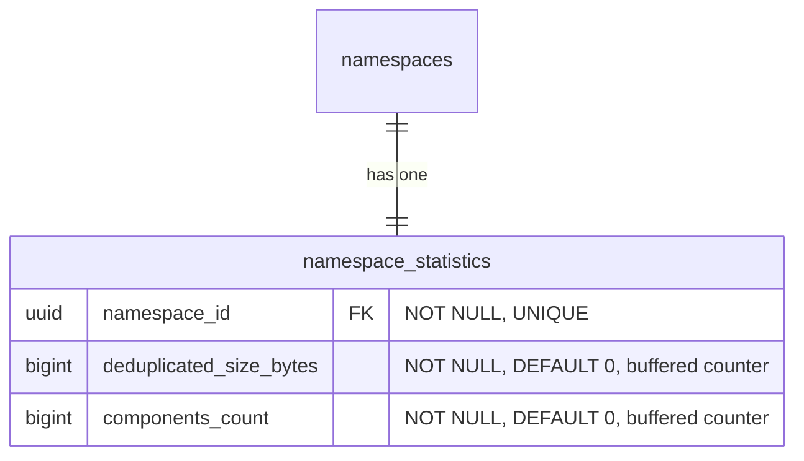

- **namespace_statistics**: バッファされたカウンター（非同期フラッシャー）で維持される、事前計算された namespace レベルのカウンターを保存します。これは表示パスと請求システムが読み取るテーブルで、ミリ秒以下のレスポンスを提供します（[ベンチマーク表](#namespace-level-storage-accounting-reconciliation) を参照）。[再調整メカニズム](#namespace-level-storage-accounting-reconciliation) は、ドリフトが疑われるときにこれらのカウンターを検証し修正するために存在します。
  - `deduplicated_size_bytes`: blob 重複排除が既に適用された namespace が使用する合計ストレージ（[ADR-002](002_storage_deduplication_scope.md) を参照）。カラムは前方互換性のためにこの名前（`size_bytes` ではなく）で命名されており、将来の生のまたは論理的なサイズメトリクスから区別します。
  - `components_count`: namespace のローカルおよびリモートリポジトリに保存されているアーティファクトバージョンの合計数:
    - Container: `container_manifests` + `container_remote_manifests`。
    - Maven: `maven_versions` + `maven_remote_versions`。
    - npm: `npm_versions` + `npm_remote_versions`。

    ソフト削除された行は、[ソフト削除ウィンドウ](010_data_retention.md#soft-delete) の有効期限が切れた後にガベージコレクションがハード削除するまで、カウントされ続けます。これは `deduplicated_size_bytes` と一致します。`deduplicated_size_bytes` はガベージコレクションが基盤の blob を回収するまでソフト削除されたアーティファクトのバイトを保持します。仮想リポジトリは独自のバージョンテーブルを持たないため、個別にカウントされません。仮想リポジトリは順序付けされたアップストリームのリストを通じてリクエストを解決し（[`container_virtual_repository_upstreams`](#virtual-container-repositories) とその Maven および npm の同等物を参照）、各アップストリーム自体がローカルまたはリモートリポジトリで、そのバージョンは上記のテーブルを介してすでに含まれています。仮想リポジトリをその上にカウントすると、そのアップストリームを二重カウントすることになります。これは、消費ベースの価格設定と計測のための namespace レベルのディメンションで、`deduplicated_size_bytes` を補完します。namespace 概要にストレージ使用量と並んで表示されます。

#### Namespace-level storage accounting reconciliation {#namespace-level-storage-accounting-reconciliation}

`namespace_statistics.deduplicated_size_bytes` カウンターとリポジトリレベルの `repositories.size_bytes` カウンターは、ミリ秒以下の読み取りで表示パスを提供します。ただし、2 つの再調整シナリオでは、キャッシュされたカウンターではなくソースデータから正確なストレージを計算する必要があります:

1. **オンデマンド検証**: 顧客が「私の請求は正確ですか?」と尋ね、ソースデータから正確な namespace ストレージを計算する必要があります。これは、64 個すべての `sha256` パーティションにわたって `SUM(size) FROM blob_storage_blobs WHERE namespace_id = ?` を意味します。
2. **ドリフト修正**: 失敗した GC 実行、部分的なフラッシュ、または他のイベントがキャッシュされたカウンターを非同期化し、それを修正するために正確な値を再計算する必要があります。

`blob_storage_blobs` は `HASH(sha256)` でパーティショニングされているため、`namespace_id` のみのクエリは 64 個すべてのパーティションにファンアウトします。CloudSQL PostgreSQL 18 インスタンスでの [ベンチマーク](https://gitlab.com/gitlab-com/content-sites/handbook/-/merge_requests/18456#note_3166018048)（[シードされた](https://gitlab.com/jdrpereira/artifact-registry-poc/-/tree/main/cmd/seed) データセット: 64 個の `sha256` パーティションにわたる ~160 万 blob、Zipf 分布の blob 所有権を持つ 50 万 namespace、最も blob の多い namespace で 35.3 万 blob）は、最も重い namespace でベースラインが 78 ms と ~3K+ バッファヒットを示します。2 つの追加可能な保険ポリシーがこれを改善できます:

**オプション A — `blob_storage_blobs` のカバリングインデックス**: 各パーティションで既存の `namespace_id` インデックスに `INCLUDE (size)` を追加します。これは 64 パーティションのファンアウトを、ヒープフェッチが最小限またはなしの 64 個のインデックスのみのスキャンに変えます。スペースオーバーヘッドは無視できる程度です（`size` カラムのみが既存のインデックスリーフページに追加されます）。

**オプション B — namespace パーティショニングされたシャドウテーブル**: `HASH(namespace_id)` で 64 パーティションでパーティショニングされた専用 `blob_storage_blobs_by_namespace` テーブルで、`blob_storage_blobs` の `AFTER INSERT`/`DELETE` トリガーで維持されます。これは再調整クエリを単一パーティションのインデックスのみのスキャンに縮小します。スペースオーバーヘッドは中程度です（blob データの最小限のサブセット — `namespace_id`、`sha256`、`size` — を 64 個の新しいパーティションとインデックスにわたって複製し、blob 数とともに線形に成長します）。トレードオフは、すべての blob `INSERT`/`DELETE` での書き込み増幅ですが、再調整負荷をメインの `blob_storage_blobs` テーブル（ホットパス）から遠ざけます。

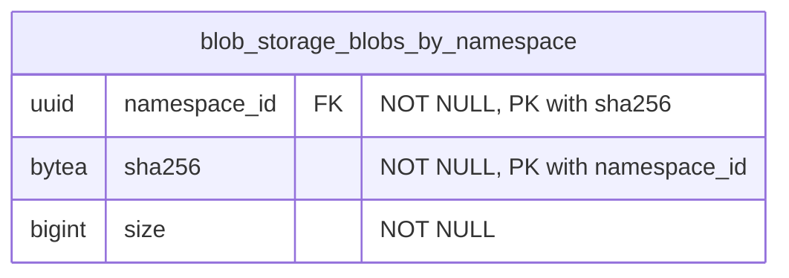

`blob_storage_blobs` のトリガーがこのテーブルを維持します: `AFTER INSERT` は `(namespace_id, sha256, size)` をシャドウテーブルにコピーし、`AFTER DELETE` は一致する行を削除します。`AFTER UPDATE` トリガーは必要ありません。`blob_storage_blobs` の行は不変であるためです — コンテンツアドレス可能ストレージは、コンテンツへの任意の変更が新しい `sha256`、つまり新しい行を生成することを意味します（[ADR-008](008_content_addressable_storage.md) を参照）。プライマリキー `(namespace_id, sha256)` はパーティションキー（`namespace_id`）を含む必要があり、`blob_storage_blobs` のユニークキーをミラーリングします。テーブルは他の `HASH(namespace_id)` テーブルと同じ 64 パーティション数を使用します。`(namespace_id) INCLUDE (size)` のカバリングインデックスがインデックスのみのスキャンを可能にします。

| アプローチ | タイミング | バッファ | スキャンされたパーティション | 書き込みオーバーヘッド |
|---|---|---|---|---|
| `namespace_statistics` カウンター（表示パス） | 0.013 ms | 1 | 0 | 非同期フラッシャー |
| シャドウテーブル + カバリングインデックス（オプション B） | 29 ms | 1,361 | 1 | トリガー |
| Blob のカバリングインデックス（オプション A） | 43 ms | 1,599 | 64 | なし |
| ベースライン（変更なし） | 78 ms | ~3K+ | 64 | なし |

両方のオプションは純粋に追加可能 — `blob_storage_blobs` 自体への変更なし — であり、独立して追加または削除できます。それらは相互に排他的ではありません。両方が初期スキーマに含まれます。本番メトリクスが必要ないことを確認したら、インデックスや補助テーブルを後で削除するよりも、より多くのカバレッジで開始する方が容易です。

#### Namespace-level component count reconciliation {#namespace-level-component-count-reconciliation}

`namespace_statistics.components_count` カウンターは表示パスと計測パイプラインを提供します。ストレージカウンターと同様に、ソースデータから正確な値を再計算する 2 つのシナリオがあります:

1. **オンデマンド検証**: 顧客（または請求）はコンポーネント数が正確かどうかを尋ね、ソース行から導出する必要があります。
2. **ドリフト修正**: 失敗したフラッシュ、部分的なバッファ損失、またはバックグラウンドジョブのバグがカウンターを非同期化し、それを再計算する必要があります。

再調整は、namespace の行にスコープされた 6 つの独立したカウントを合計します: 3 つのローカル（`container_manifests`、`maven_versions`、`npm_versions`）と 3 つのリモート（`container_remote_manifests`、`maven_remote_versions`、`npm_remote_versions`）。ソフト削除された行は、再計算された値が `components_count` が追跡するものと一致するように含まれます（挿入はインクリメント、ガベージコレクションのハード削除はデクリメント。ソフト削除と復元は何もしません）。

```sql
SELECT
  (SELECT COUNT(*) FROM container_manifests        WHERE namespace_id = $1)
+ (SELECT COUNT(*) FROM container_remote_manifests WHERE namespace_id = $1)
+ (SELECT COUNT(*) FROM maven_versions             WHERE namespace_id = $1)
+ (SELECT COUNT(*) FROM maven_remote_versions      WHERE namespace_id = $1)
+ (SELECT COUNT(*) FROM npm_versions               WHERE namespace_id = $1)
+ (SELECT COUNT(*) FROM npm_remote_versions        WHERE namespace_id = $1)
  AS components_count;
```

各サブクエリは単一のソーステーブルでの `namespace_id` によるカウントで、`soft_deleted_at` 述語はないため、テーブル内に残っている行（[ソフト削除ウィンドウ](010_data_retention.md#soft-delete) 内のライブとソフト削除済み）が `components_count` が追跡するものと一致します。4 つのパーティショニングされたソーステーブル（`container_manifests`、`container_remote_manifests`、`maven_remote_versions`、`npm_remote_versions`）は単一の `HASH(namespace_id)` パーティションにプルーニングします。2 つのパーティショニングされていないミッドティアテーブル（`maven_versions`、`npm_versions`）は namespace の行を求めてテーブル全体をスキャンします。既存の部分ユニークインデックス（`WHERE soft_deleted_at IS NULL`）はライブ行のみをカバーするため、カウントを直接満たすことはできません。namespace ごとのカーディナリティはデータモデルによって制限されており（ファイルや blob 参照ごとではなくバージョンごとに 1 行）、再調整は頻繁ではない（オンデマンドまたはドリフト修正であり、ホットパスではない）ため、制限されたスキャンは許容されます。追加の保険ポリシー（カバリングインデックスやシャドウテーブル）は導入しません。本番メトリクスがこれが遅すぎることを示す場合、各ソーステーブルの非部分 `(namespace_id)` インデックスがシャドウテーブルを検討する前の最も安価な次のステップです。

### インデックス

- **`blob_storage_blobs`**: `(namespace_id, sha256)` のユニークインデックス — Organization 内で sha256 による重複排除を強制し、blob の存在を確認。この制約はパーティションキー（`sha256`）を含むため、PostgreSQL はすべてのハッシュパーティション間で正しく強制します。`(namespace_id) INCLUDE (size)` のカバリングインデックス — ヒープフェッチなしで [namespace レベルのストレージアカウンティング再調整](#namespace-level-storage-accounting-reconciliation) のためのインデックスのみのスキャンを可能にします。
- **`blob_storage_attachments`**: `(namespace_id, sha256)` のインデックス — blob のコンテンツハッシュが与えられたときにアタッチメントの存在を確認（[クリーンアッププロセス](#cleanup-tasks) で孤立チェックに使用）。
- **`blob_storage_blobs_by_namespace`**: `(namespace_id, sha256)` のプライマリキー — `blob_storage_blobs` 行との 1:1 対応を強制。`(namespace_id) INCLUDE (size)` のカバリングインデックス — [namespace レベルのストレージアカウンティング再調整](#namespace-level-storage-accounting-reconciliation) のための単一パーティションインデックスのみのスキャンを可能にします。
- **`namespace_statistics`**: `(namespace_id)` のユニークインデックス — namespace あたり 1 つの統計レコード。

ハッシュパーティショニングされたテーブルでは、インデックスはパーティションごとにローカルです — インデックス操作は単一のパーティションにスコープされ、テーブル全体をロックしません。

### Blob ストレージのクエリ例 {#blob-storage-query-examples}

- アーティファクトのプル（読み取りパスショートカット: `*_files` → `blob_storage_blobs`、アタッチメントをスキップ — 1 パーティション）

  ```sql
  SELECT bsb.object_storage_key, bsb.size
  FROM maven_files mf
  JOIN blob_storage_blobs bsb ON bsb.namespace_id = mf.namespace_id AND bsb.sha256 = mf.blob_sha256
  WHERE mf.namespace_id = '018f4d6f-0e10-7e3a-9bfd-23a4c5d6e7f8' AND mf.maven_version_id = 456 AND mf.file_name = 'myapp-1.0.0.jar'
    AND mf.soft_deleted_at IS NULL;
  ```

- Blob アップロード時の重複排除 upsert（1 パーティション、競合なし）

  ```sql
  INSERT INTO blob_storage_blobs (namespace_id, sha256, size, content_type, object_storage_key)
  VALUES ('018f4d6f-0e10-7e3a-9bfd-23a4c5d6e7f8', 'abcd1234efgh5678...'::bytea, 1048576, 'application/octet-stream', 'key')
  ON CONFLICT (namespace_id, sha256) DO NOTHING
  RETURNING id, sha256;
  ```

- Organization 内で sha256 による blob の存在を確認（1 パーティション）

  ```sql
  SELECT 1 AS one
  FROM blob_storage_blobs
  WHERE namespace_id = '018f4d6f-0e10-7e3a-9bfd-23a4c5d6e7f8' AND sha256 = 'abcd1234efgh5678...'::bytea
  LIMIT 1;
  ```

- 孤立チェック: この blob はまだ任意のアタッチメントによって参照されているか? (1 パーティション)

  ```sql
  SELECT 1 AS one
  FROM blob_storage_attachments
  WHERE namespace_id = '018f4d6f-0e10-7e3a-9bfd-23a4c5d6e7f8' AND sha256 = 'abcd1234efgh5678...'::bytea
  LIMIT 1;
  ```

- Blob のカバリングインデックスによるストレージアカウンティング再調整（オプション A）: ソースデータから正確な namespace ストレージを計算（64 パーティション、インデックスのみのスキャン）

  ```sql
  SELECT SUM(size) AS total_size_bytes
  FROM blob_storage_blobs
  WHERE namespace_id = 123;
  ```

- シャドウテーブルによるストレージアカウンティング再調整（オプション B）: 正確な namespace ストレージを計算（1 パーティション、インデックスのみのスキャン）

  ```sql
  SELECT SUM(size) AS total_size_bytes
  FROM blob_storage_blobs_by_namespace
  WHERE namespace_id = 123;
  ```

- 表示パス: 事前計算された namespace カウンターを読み取り（単一行検索）

  ```sql
  SELECT deduplicated_size_bytes, components_count
  FROM namespace_statistics
  WHERE namespace_id = 123;
  ```

## 結果

### ポジティブ

1. **各アーティファクトフォーマットに合わせたデータ構成**: 各アーティファクトフォーマットに専用テーブルを使用することで、テーブル構成に最大の柔軟性を持たせることができます。フォーマットプロトコルが必要とする任意の数の追加カラムを持てます。すでに専用テーブルを使用しているため、追加の補助テーブルは必要ありません。

2. **各フォーマットデータテーブルは関連する使用パターンを持ちます**: 各フォーマット専用テーブルは、Rest および GraphQL API と関連アーティファクト管理クライアントから使用パターンを受け取ります。これにより、他のフォーマットの使用パターンから分離が提供されます。

3. **フォーマット関連データのパフォーマンス分離**: 特定のアーティファクトフォーマットテーブルのパフォーマンスボトルネックは、他のフォーマットに即時の影響を与えません。

4. **透過的なオブジェクトストレージクリーンアップ**: [オブジェクトストレージクリーンアップタスク](#cleanup-tasks) が [blob ストレージ](#blob-storage) ドメインに集中化されているため、親ドメイン（この場合、各フォーマット固有のドメイン）はこの部分を処理する必要はありません。さらに、このクリーンアップは削除操作がどのように行われたか（単一要素破棄、バルク破棄、選択された要素セットに対する破棄を実行するバックグラウンドクリーンアップポリシー）に影響されません。

5. **Blob ストレージ分離は再利用性を提供します**: Blob ストレージテーブルは、ここで説明する Artifact Registry 機能に縛られていません。そのため、この部分は他の領域でのファイルアップロードのニーズに再利用できます。

6. **効率的なストレージアカウンティング**: Organization スコープの重複排除と Organization ごとの重複排除された blob レコードは、ストレージ使用量クエリをシンプルで効率的にします。注意: `sha256` ベースのパーティショニングでは、Organization レベルの集計は 64 個すべてのパーティションをスキャンします。これは、遅延インクリメントで更新される専用のロールアップテーブルによって緩和されます（[パーティショニング戦略](#blob-storage-partitioning-strategy) を参照）。

7. **統一されたクロスフォーマットリスト化**: 親 `repositories` テーブルは、namespace 内のすべてのフォーマットおよび種別（ローカル、仮想、リモート）にわたるすべてのリポジトリをリストするための単一のソースを提供し、複数のテーブルにわたる `UNION ALL` なしでランディングページのハイブリッドリストをサポートします。

8. **スタンドアロンリモートリポジトリが共有を可能にします**: 独自のライフサイクルを持つスタンドアロンエンティティとしてのリモートリポジトリは、複数の仮想リポジトリ間で共有でき、構成とキャッシュエントリの重複を減らします。

### ネガティブ {#negative}

1. **クロスフォーマット詳細クエリには依然として結合が必要**: 親 `repositories` テーブルはランディングページのリスト化ユースケースを解決しますが、フォーマット固有の詳細（例: コンテナイメージ、Maven パッケージ）にアクセスするには、フォーマット固有のテーブルに結合する必要があります。

2. **Blob ストレージのための集中化されたテーブル**: これは 2 つの欠点をもたらします。第一に、これらのテーブルには非常に多くの行があります。この状況を扱うには慎重なテーブル設計が必要です。第二に、これらのテーブルの問題（テーブル全体のロックなど）は、すべてのアーティファクトタイプに潜在的に影響します。

3. **リポジトリごとのストレージ属性付けには結合が必要**: リポジトリレベルでの正確なストレージ使用量帰属は、フォーマット固有のテーブルから `blob_storage_attachments` を経由して `blob_storage_blobs` への結合を通じて導出されます。これは blob ストレージを汎用かつ重複排除されたまま保ちますが、非正規化されたリポジトリごとのカウンターと比較していくらかの複雑さを追加します。

4. **2 ステップのリポジトリ作成**: リポジトリを作成するには、親 `repositories` テーブルとフォーマット固有のテーブルの両方に挿入する必要があります。これは、単一テーブル挿入と比較してトランザクションの複雑さを追加します。

## 代替案

### 共通データの集中化

ここでの異なるアプローチは、アーティファクトフォーマット領域のすべての共通データを共通かつ集中化されたテーブルに保存することです。

これは、複数のソースを一緒に結合せずにそれらのクエリに答えられるため、混合アーティファクトフォーマットデータアクセスに非常に役立ちます。

このアプローチは [Package Registry 機能](https://docs.gitlab.com/user/packages/package_registry/) で既に使用されており、この記述時点で、これらの共通テーブルは予想どおり高い行数を持ちますが、特殊化されたインデックスも多数あります。これらの各インデックスは、アーティファクトフォーマットに固有のアクセスパターンをサポートします。インデックスの量が現在かなり多いため、新しいインデックスを追加する場合（例えば Package Registry 機能に新しいフォーマットサポートが追加される場合）、より精査され、押し戻されることさえあります。

さらに、各アーティファクトフォーマットには、保存する必要がある特定のデータ（例えば、正規化されたパッケージ名）があります。この特定のデータは、一部の行のみで使用されるカラムを作成することになるため、共通テーブルに保存できません。これは、いくつかの補助テーブルの作成につながります。これらの補助テーブルは、特定のアーティファクトタイプのアクセスパターンに必要な結合の量を増やします。

`repositories` 親テーブルの導入は、このアプローチの限定バージョンを採用しています: リスト化とフィルタリングに必要なクロスフォーマットメタデータ（名前、可視性、フォーマット、種別、カウンター）のみが集中化されます。フォーマット固有のデータは専用テーブルに残り、上記のインデックス増殖と補助テーブルの問題を回避します。

## 参考文献

- [ADR-001: Organizations as Anchor Point](001_organizations_as_anchor_point.md) - レジストリが Organization にアンカーする理由
- [ADR-002: Storage Deduplication Scope](002_storage_deduplication_scope.md) - 重複排除スコープに関する詳細な決定
<!-- - [ADR-010: Data Retention](010_data_retention.md) - ソフト削除と blob クリーンアップタイミングを含む保持ポリシー -->
- [Package Registry common tables decomposition](https://gitlab.com/groups/gitlab-org/-/work_items/16000) - 中央テーブルに共通のアーティファクト関連データを保存する際に直面する問題の詳細

