<!-- Design Documents often contain forward-looking statements -->
<!-- vale gitlab.FutureTense = NO -->

## Context

Artifact Registry は次の点を考慮したデータベース構成を必要とします。

- **異なるアクセスパターン**: アーティファクト管理クライアントは、フォーマットごとに大きく異なる独自のプロトコルを使用します。
- **スケーラビリティ**: アーティファクトのストレージは、すぐに数百万行に達する可能性があります。
- **パフォーマンス**: 前述の2点を踏まえても、操作の大半を占める読み取りクエリで高速な実行時間を維持したいと考えています。
- **過去の落とし穴**: 現在のコンテナレジストリおよびパッケージレジストリのデータ構成には、いくつかのほころびが見られます（[例](https://gitlab.com/groups/gitlab-org/-/work_items/16000)、[例](https://gitlab.com/groups/gitlab-org/-/epics/9415)）。ここではそれを回避します。

決定事項に入る前に、以降のスキーマに関するいくつかの注意点を挙げます。これらは主に、提示するテーブル数の多さを踏まえて可読性を高めるためのものです。

- このドキュメントでは、機能のコアとなるテーブルを説明します。サブ機能に必要となる追加のテーブルはここでは説明しません。例として、blob ストレージのクリーンアップに必要な補助テーブルの背景については [クリーンアップタスク](#cleanup-tasks) を参照してください。
- テーブル名は可読性のために短縮しています。実際には、ここに示されていない共通の接頭辞を共有します（例: `artifacts_registry_container_repositories`）。
- Artifact Registry は名前空間にスコープされます。根拠については [ADR-001](001_organizations_as_anchor_point.md) を参照してください。
- 主キーやタイムスタンプなど、いくつかの共通カラムは明確さのために省略しています。
- すべてのテーブルには `namespace_id` カラムが含まれます。[Cells のシャーディングキー要件](https://docs.gitlab.com/ee/development/database/multiple_databases/#guidelines-on-choosing-a-sharding-key) はサテライトサービスのデータベースには適用されません。行は、名前空間のアンカータプル（`platform`、`entity_type`、`entity_id`）を通じて間接的に組織に紐づけられます。このカラムは、以下のすべてのテーブル定義で明示的に示しています。
- すべての `jsonb` カラムは、無制限なペイロードを防ぎ期待される構造を強制するために、永続化の前に厳格な JSON スキーマに対して検証しなければなりません。これはこのドキュメント内のすべての `jsonb` カラム（例: `rule_configuration` および `package_json`）に適用されます。
- テーブルが複数の暗号化された認証情報カラムを持つ場合（例: リモートリポジトリテーブルの `encrypted_username` と `encrypted_password`）、CHECK 制約により、すべての認証情報カラムが設定されるか、いずれも設定されないかのいずれかを強制しなければなりません。部分的な認証情報（例: パスワードなしのユーザー名）は受け付けません。
- リモートリポジトリテーブルの暗号化された認証情報カラム（`encrypted_username`、`encrypted_password`、`encrypted_auth_token`）は、暗号化の前に Go の検証レイヤーで平文の入力を2048文字に制限します。この上限は平文に対するものであり、平文はアプリケーションレイヤーにのみ存在します。データベースが見るのは `bytea` の暗号文だけなので、DB 側の CHECK（例: `octet_length(...) <= N`）は暗号化方式の固定オーバーヘッド（IV、認証タグ、key-id ヘッダー）を介して間接的に平文を制限できるにすぎず、上限の近似となり、必須の Go チェックと冗長になります。CHECK を省略することで、スキーマが暗号フレーミングから切り離された状態も保てます。暗号、key-id レイアウト、エンベロープ構造の変更があってもスキーママイグレーションは不要です。
- すべての `id` カラムは、Artifact Registry インスタンスのスコープ内で一意でなければなりません。`namespaces.id` は UUIDv7（[RFC 9562](https://datatracker.ietf.org/doc/rfc9562/)）を使用し、あらゆる Artifact Registry デプロイメントにまたがるグローバルな一意性を保証します。詳しい根拠（PostgreSQL の各バージョンで利用可能な生成パスを含む）については [名前空間 ID の型](#namespace-id-type) を参照してください。その他のすべての `id` カラムは `bigint DEFAULT nextval('<table>_id_seq')` であり、論理レプリケーションの互換性が保たれます（[出典](https://gitlab.com/gitlab-com/gl-infra/data-access/dbo/dbo-issue-tracker/-/work_items/691#note_3309931104)）。これらの一意性は単一の Artifact Registry データベース内でローカルに強制されますが、それらは常に名前空間より下にスコープされるため、それで十分です。

## Decisions

データには6つの領域があります。

- [名前空間テーブル](#namespaces)。不変のスラッグと仮想アンカータプルを持つ内部の名前空間エンティティを導入することで、Artifact Registry を外部識別子から切り離します。完全な根拠については [ADR-022](022_namespace_decoupling.md) を参照してください。
- [リポジトリコレクションテーブル](#repository-collections)。名前空間内のリポジトリの論理的なグルーピングです。スキーマには初日から存在しますが、まだユーザーには公開されていません。すべての名前空間は「default」リポジトリコレクションを取得し、すべてのリポジトリが自動的にそこへ割り当てられます。
- 名前空間レベルのテーブル。これらは [ライフサイクルポリシーの設定とルール](#lifecycle-policies) と [名前空間レベルのストレージ統計](#storage-usage-calculation) を扱い、名前空間に直接スコープされます。
- [リポジトリ親テーブル](#repositories)。すべてのフォーマットにまたがるすべてのリポジトリ（ローカル、仮想、リモート）の統一されたレジストリで、ランディングページのハイブリッドリストとフォーマット横断クエリを支えます。
- アーティファクトフォーマットレベルのテーブル。ここには各フォーマット専用のテーブルがあります。ローカルリポジトリ（[Container](#container-repositories)、[Maven](#maven-repositories)、[NPM](#npm-repositories)）、リモートリポジトリ（[Container](#container-remote-repositories)、[Maven](#maven-remote-repositories)、[NPM](#npm-remote-repositories)）、仮想リポジトリ（[Container](#virtual-container-repositories)、[Maven](#maven-virtual-repositories)、[NPM](#npm-virtual-repositories)）。それぞれが `repository_id` を介して親の `repositories` テーブルを参照します。
- [blob ストレージレベルのテーブル](#blob-storage)。実際のストレージメタデータと [進行中のアップロードセッションの追跡](#upload-sessions) を扱います。

### Namespaces

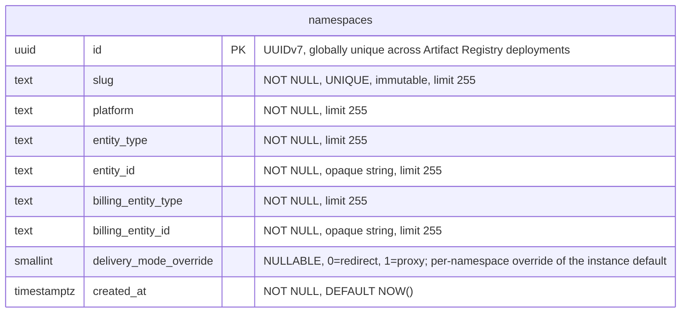

- **namespaces**: 他のすべてのテーブルが `namespace_id` を介して参照するルートエンティティです。各名前空間は、URL やクライアント設定で使用される、不変でグローバルに一意な `slug` を持ちます（スラッグの設計とグローバルな一意性の強制については [ADR-022](022_namespace_decoupling.md) を参照）。`(platform, entity_type, entity_id)` タプルは、そのセマンティクスを解釈することなく名前空間を外部エンティティ（デフォルトでは Organizations）にリンクします。`entity_id` は、基となる値が数値であっても `TEXT` として保存され、アンカータイプ間でスキーマを統一します。Organizations v1 では、すべての行が `('gitlab', 'organization', '<rails_org_id>')` を持ちます。`billing_entity_type` と `billing_entity_id` は、使用量イベントの請求アンカーを識別します。外部から提供されるカラム（`platform`、`entity_type`、`entity_id`、`billing_entity_type`、`billing_entity_id`）はいずれもスキーマレベルのデフォルトを持ちません。その根拠については [ADR-022](022_namespace_decoupling.md) を参照してください。`delivery_mode_override` カラムは、[ADR-005](005_artifact_delivery_mode.md) で定義された名前空間ごとのアーティファクト配信のオーバーライドを保持します。`NULL` はインスタンスのデフォルト（`StorageConfig.delivery_mode`）を継承し、`0`（`redirect`）はこの名前空間に対してリダイレクトを強制し、`1`（`proxy`）はプロキシを強制します。ダウンロードリクエストに対する実効的な配信パターンは `namespace.delivery_mode_override ?? instance.delivery_mode` です。このカラムは、リクエストハンドラーが認可とルーティングのために行う既存の名前空間ルックアップの一部として読み取られるため、別のクエリやインデックスは不要です。カラムの型は `SMALLINT` で、整数からラベルへのマッピングは Go アプリケーションで定義されます（`0 = redirect`、`1 = proxy`）。これは enum スタイルのカラムに関する [Artifact Registry のデータベース規約](https://gitlab.com/gitlab-org/ops/artifact-registry/-/blob/main/docs/dev/database.md#enums) に従っています（PostgreSQL の `ENUM` 型は安全に変更するのが難しいため避けています）。アーティファクト配信の選択を保存する将来のカラム（例: S17 がリポジトリごとのオーバーライドを導入する場合）は、同じ整数マッピングを再利用します。

#### Slug immutability

PostgreSQL にはネイティブな不変カラムのサポートはありません。スラッグの不変性（[ADR-022](022_namespace_decoupling.md)）は、値が変更されると例外を発生させる `BEFORE UPDATE OF slug` トリガーによってデータベースレベルで強制されます。これにより、アプリケーションレイヤーをバイパスするあらゆるコードパス（直接のデータベースアクセス、管理ツール、マイグレーション）を捕捉します。スラッグの変更を必要とする緊急操作のために、このトリガーは無効化できます（例: `ALTER TABLE namespaces DISABLE TRIGGER trg_namespaces_immutable_slug`）。

#### Indexes

- **`namespaces`**: `(slug)` に対する一意インデックス — スラッグで名前空間をルックアップします。`(platform, entity_type, entity_id)` に対する一意制約 — 重複するアンカーを防ぎます。`delivery_mode_override` にはインデックスを付けません。このカラムは `id` をキーとする既存の名前空間ルックアップの一部としてのみ読み取られます（ハンドラーは認可とルーティングのために既に名前空間の行を結合しています）。

### Repository collections

リポジトリコレクションは、名前空間内のリポジトリの論理的なグルーピングであり、チーム、セキュリティドメイン、または製品ラインごとにアーティファクトを整理します。リポジトリコレクションを UI と API に公開することは MVP の範囲外です。このエンティティは初日から純粋に前方互換性のために存在します。MVP の間、すべての名前空間は作成時に単一の「default」リポジトリコレクションを取得し、すべてのリポジトリがそこへ割り当てられます。リポジトリコレクションの概念が MVP 後に公開されると、ユーザーは追加のリポジトリコレクションを作成し、リポジトリをそれらへ再割り当てできるようになります。

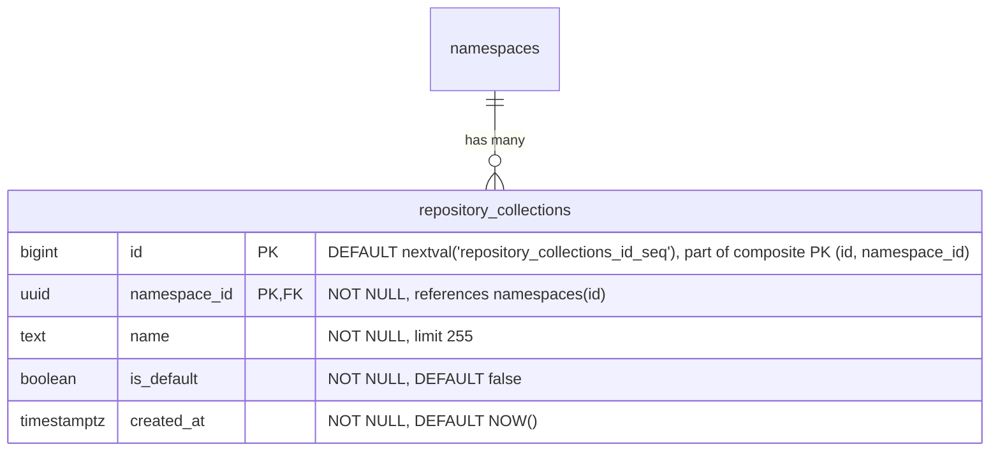

- **repository_collections**: 名前空間内のリポジトリの論理的なグルーピングです。`name` は名前空間内で一意な、人間が読めるラベルです。`is_default` は、すべての名前空間とともに自動的に作成され、MVP の間すべてのリポジトリが割り当てられるリポジトリコレクションを示します。`HASH(namespace_id)` で64パーティションにパーティショニングされます。

すべての名前空間作成時に、デフォルトのリポジトリコレクション行をアトミックに挿入しなければなりません。

```sql
INSERT INTO repository_collections (namespace_id, name, is_default)
VALUES (<new_namespace_id>, 'default', true)
ON CONFLICT (namespace_id, name) DO NOTHING;
```

#### Indexes

- **`repository_collections`**: `(id, namespace_id)` に対する主キー — `HASH(namespace_id)` パーティショニングに必要な複合 PK であり、`repositories` からの複合外部キーのターゲットとしても機能します。`(namespace_id, name)` に対する一意インデックス — 名前空間内で名前によりリポジトリコレクションをルックアップします。`(namespace_id) WHERE is_default IS TRUE` に対する部分一意インデックス — 名前空間ごとに最大1つのデフォルトリポジトリコレクションを強制します。

#### Query examples

- 名前空間のデフォルトリポジトリコレクションを取得する。

  ```sql
  SELECT *
  FROM repository_collections
  WHERE namespace_id = '018f4d6f-0e10-7e3a-9bfd-23a4c5d6e7f8' AND is_default = true;
  ```

- 名前空間のすべてのリポジトリコレクションを一覧表示する。

  ```sql
  SELECT id, name, is_default, created_at
  FROM repository_collections
  WHERE namespace_id = '018f4d6f-0e10-7e3a-9bfd-23a4c5d6e7f8'
  ORDER BY created_at;
  ```

- 新しい（デフォルトではない）リポジトリコレクションを作成する。

  ```sql
  INSERT INTO repository_collections (namespace_id, name)
  VALUES ('018f4d6f-0e10-7e3a-9bfd-23a4c5d6e7f8', 'team-backend');
  ```

### Repositories

`repositories` テーブルは、フォーマットや種類を問わずシステム内のすべてのリポジトリを登録する、統一された親テーブルです。これはランディングページのハイブリッドリスト（すべてのフォーマットにまたがる Local、Virtual、Remote リポジトリを表示する、単一のソート・フィルタ・ページネーション可能なビュー）を支えます。各フォーマット固有のリポジトリテーブル（ローカル、仮想、リモート）は、`repository_id` を介してここの単一の行を参照します。

このモデル（Local、Remote、Virtual を対等なスタンドアロンの型とし、参照によって構成する）は、JFrog Artifactory、Sonatype Nexus、Google Cloud AR がいずれも使用しているものです。

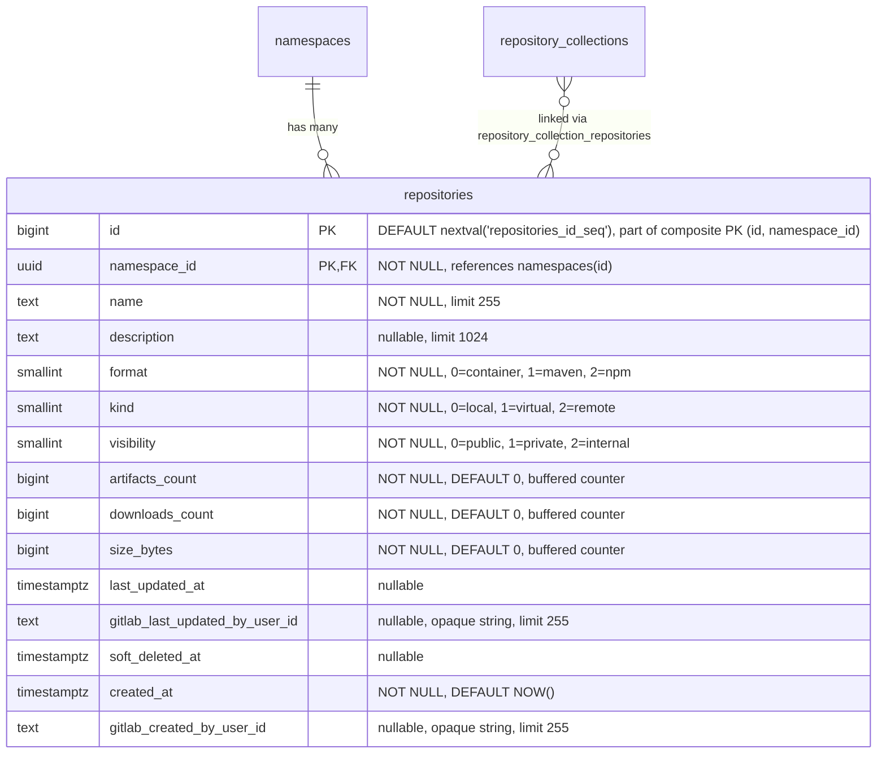

- **repositories**: すべてのリポジトリの親エンティティです。`format` はアーティファクトフォーマット（container、Maven、npm）を識別します。`kind` はリポジトリの種類（local、virtual、remote）を識別します。リポジトリは [`repository_collection_repositories`](#repository-collection-repositories) 結合テーブルを介してリポジトリコレクションにリンクされ、1つのリポジトリがその名前空間内の1つ以上のリポジトリコレクションに属することを可能にします。MVP の間、すべてのリポジトリは名前空間のデフォルトリポジトリコレクションにリンクされます。`name` は名前空間内で一意でなければならず、これはすべての競合製品と一致します。カウンターカラム（`artifacts_count`、`downloads_count`、`size_bytes`）は、ホット行の競合を避けるために [バッファ書き込み／非同期書き込み](#buffered-and-asynchronous-writes) を介して維持されます。`last_updated_at` はコンテンツの変更（アーティファクトの公開・変更・削除、キャッシュイベント）を追跡し、ダウンロードは追跡しません。`gitlab_created_by_user_id` と `gitlab_last_updated_by_user_id` は、どの GitLab ユーザーがリポジトリを作成し最後に変更したかを記録します。どちらも nullable な不透明参照で、外部キーもアプリケーション側の検証もありません。なぜなら、ユーザーレコードはモノリスに存在するからです。ユーザーハンドルとアバターのレンダリングはコンシューマーの責任であり、AR スキーマは ID だけを保存します。`namespaces.entity_id` と同じ理由で `TEXT` として保存されます。上流のユーザー ID 形式の将来的な変更（例: UUID への変更）があってもスキーママイグレーションは不要です。`description` が親にあるのは、UI が仮想リポジトリだけでなくすべてのリポジトリ種類で説明を表示するためです。`soft_deleted_at` タイムスタンプは、リポジトリがソフト削除された時刻を記録し、必要に応じて復元を可能にします。ソフト削除を親テーブルに置くことで、すべてのリポジトリ種類（local、virtual、remote）がフォーマット固有の処理なしで同じ削除セマンティクスを共有できます。`HASH(namespace_id)` で64パーティションにパーティショニングされます。

#### Indexes

- **`repositories`**: `(namespace_id, name)` に対する一意インデックス — アクティブとソフト削除済みの両方のリポジトリにまたがって名前の一意性を強制し、名前の競合によって復元が失敗しないようにします。名前の再利用には、まずハード削除が必要です。`(namespace_id, name) WHERE soft_deleted_at IS NULL` に対するインデックス — アクティブなリポジトリのルックアップと名前順のリスト表示のための最適化されたスキャンパスです。`(namespace_id, format) WHERE soft_deleted_at IS NULL` に対するインデックス — アクティブなリポジトリをフォーマットでフィルタします。`(namespace_id, kind) WHERE soft_deleted_at IS NULL` に対するインデックス — アクティブなリポジトリを種類でフィルタします。リポジトリを可視性レベルでフィルタするための `(namespace_id, visibility) WHERE soft_deleted_at IS NULL` に対するインデックス（可視性監査クエリ「この名前空間で現在 public なリポジトリはどれか」を支えます）。ランディングページのソート可能なカラムごとに1つのインデックスがあり、すべて `WHERE soft_deleted_at IS NULL` を伴います: `(namespace_id, artifacts_count DESC)`、`(namespace_id, downloads_count DESC)`、`(namespace_id, size_bytes DESC)`、`(namespace_id, last_updated_at DESC NULLS LAST)`。

MVP の間、すべてのリポジトリは単一のデフォルトリポジトリコレクションにリンクされるため、`(namespace_id, ...)` ソートインデックスは名前空間全体のクエリとコレクションフィルタクエリの両方を支えます。MVP 後、名前空間が複数のリポジトリコレクションを持つようになると、コレクションフィルタクエリは `repository_collection_repositories` を介して結合します。追加のサポートインデックスは、リポジトリコレクションが公開される時点で評価します。

#### Query examples

- 名前空間のすべてのリポジトリ（すべてのリポジトリコレクション）を、最終更新順に一覧表示する。

  ```sql
  SELECT id, name, description, format, kind, artifacts_count,
         downloads_count, size_bytes, last_updated_at
  FROM repositories
  WHERE namespace_id = '018f4d6f-0e10-7e3a-9bfd-23a4c5d6e7f8' AND soft_deleted_at IS NULL
  ORDER BY last_updated_at DESC NULLS LAST
  LIMIT 20;
  ```

- 名前空間のリポジトリをリポジトリコレクションでフィルタし、最終更新順に一覧表示する。

  ```sql
  SELECT r.id, r.name, r.description, r.format, r.kind, r.artifacts_count,
         r.downloads_count, r.size_bytes, r.last_updated_at
  FROM repositories r
  JOIN repository_collection_repositories rcr
    ON rcr.namespace_id = r.namespace_id AND rcr.repository_id = r.id
  WHERE r.namespace_id = '018f4d6f-0e10-7e3a-9bfd-23a4c5d6e7f8' AND rcr.repository_collection_id = 456 AND r.soft_deleted_at IS NULL
  ORDER BY r.last_updated_at DESC NULLS LAST
  LIMIT 20;
  ```

- リポジトリをリポジトリコレクションとフォーマットでフィルタして一覧表示する。

  ```sql
  SELECT r.id, r.name, r.description, r.format, r.kind, r.artifacts_count,
         r.downloads_count, r.size_bytes, r.last_updated_at
  FROM repositories r
  JOIN repository_collection_repositories rcr
    ON rcr.namespace_id = r.namespace_id AND rcr.repository_id = r.id
  WHERE r.namespace_id = '018f4d6f-0e10-7e3a-9bfd-23a4c5d6e7f8' AND rcr.repository_collection_id = 456 AND r.format = 0
    AND r.soft_deleted_at IS NULL
  ORDER BY r.name
  LIMIT 20;
  ```

- 名前で単一のリポジトリをルックアップする。

  ```sql
  SELECT *
  FROM repositories
  WHERE namespace_id = '018f4d6f-0e10-7e3a-9bfd-23a4c5d6e7f8' AND name = 'my-repo' AND soft_deleted_at IS NULL;
  ```

- 可視性監査: 名前空間内のすべての public リポジトリを一覧表示する（`(namespace_id, visibility) WHERE soft_deleted_at IS NULL` の部分インデックスを使用）。

  ```sql
  SELECT id, name, format, kind
  FROM repositories
  WHERE namespace_id = '018f4d6f-0e10-7e3a-9bfd-23a4c5d6e7f8' AND visibility = 0 AND soft_deleted_at IS NULL
  ORDER BY name;
  ```

### Repository collection repositories

`repository_collection_repositories` 結合テーブルは、リポジトリが属するリポジトリコレクションへリポジトリをマッピングします。1つのリポジトリは、その名前空間内の1つ以上のリポジトリコレクションのメンバーになることができ、複数のチームのリポジトリコレクションを通じて公開される共通のユーティリティリポジトリのような共有アクセスのシナリオを可能にします。

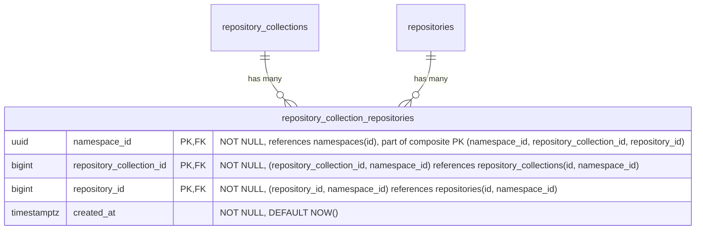

- **repository_collection_repositories**: リポジトリをリポジトリコレクションにリンクします。MVP の間、すべてのリポジトリは正確に1つのリポジトリコレクション（名前空間のデフォルト）にリンクされますが、スキーマは複数のリンクを許可しており、MVP 後にリポジトリをリポジトリコレクション間で共有できます。アプリケーションは、すべてのリポジトリが少なくとも1つのリポジトリコレクションリンクを持つという不変条件を強制します。Postgres はこれを宣言的に表現できません。複合 FK は、リポジトリコレクションとリポジトリが同じ名前空間内でのみリンクできることを保証します。`HASH(namespace_id)` で64パーティションにパーティショニングされます。

#### Indexes

- **`repository_collection_repositories`**: `(namespace_id, repository_collection_id, repository_id)` に対する主キー — リンクの一意性を強制し、リポジトリコレクションによるルックアップを支えます。`(namespace_id, repository_id)` に対するインデックス — 指定したリポジトリが属するすべてのリポジトリコレクションをルックアップします。

#### Query examples

- リポジトリが属するすべてのリポジトリコレクションを一覧表示する。

  ```sql
  SELECT repository_collection_id
  FROM repository_collection_repositories
  WHERE namespace_id = '018f4d6f-0e10-7e3a-9bfd-23a4c5d6e7f8' AND repository_id = 789;
  ```

- リポジトリをリポジトリコレクションにリンクする。

  ```sql
  INSERT INTO repository_collection_repositories (namespace_id, repository_collection_id, repository_id)
  VALUES ('018f4d6f-0e10-7e3a-9bfd-23a4c5d6e7f8', 456, 789)
  ON CONFLICT (namespace_id, repository_collection_id, repository_id) DO NOTHING;
  ```

### Lifecycle Policies

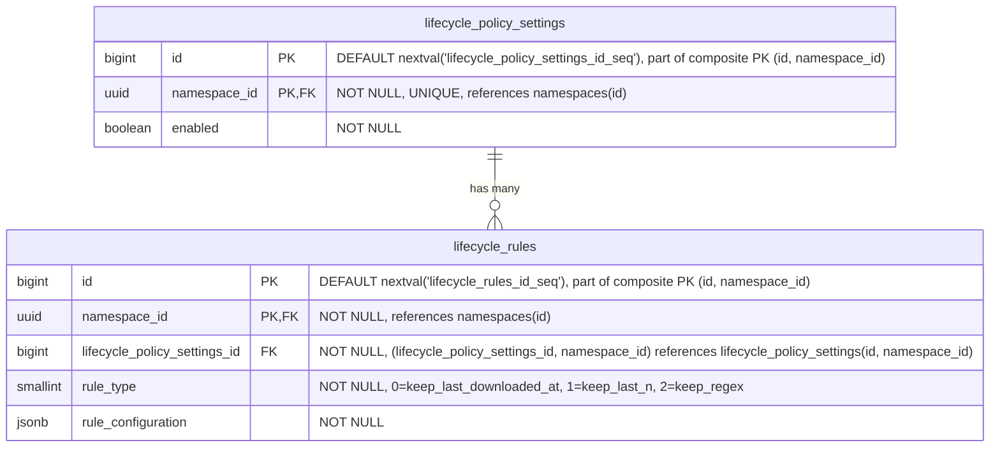

- **lifecycle_policy_settings**: 名前空間レベルでライフサイクル管理の構成を定義し、すべてのリポジトリのデフォルトポリシーとして機能します。有効な場合、関連するライフサイクルルールが名前空間全体に適用されます。これらのポリシーは、リポジトリレベルのポリシーによって [オーバーライド](#repository-level-overrides) できます。`HASH(namespace_id)` で64パーティションにパーティショニングされます。
- **lifecycle_rules**: 名前空間レベルで特定のアーティファクトのライフサイクル動作を制御する、個々の保持・クリーンアップルールを指定します。これらのルールは、リポジトリレベルで [オーバーライド](#repository-level-overrides) されない限り、すべてのリポジトリに適用されます。ポリシーレコードあたりのライフサイクルルール数は、ルール評価時のパフォーマンス低下を防ぐために制限されます。これは、例えば特定のアーティファクトをどのくらいの期間保持するか（例: Maven のスナップショットファイルは1か月だけ保持する）をユーザーが指定するために使用されます。`HASH(namespace_id)` で64パーティションにパーティショニングされます。

#### Indexes

- **`lifecycle_policy_settings`**: `(namespace_id)` に対する一意インデックス — 名前空間ごとに1つのポリシー設定レコードです。
- **`lifecycle_rules`**: `(namespace_id, lifecycle_policy_settings_id)` に対するインデックス — 指定したポリシーのすべてのルールを取得します。

リポジトリレベルのオーバーライドテーブルは同じパターンに従います。設定テーブルには `(namespace_id, repository_id)` に対する一意インデックス、ルールテーブルには `(namespace_id, <format>_repository_lifecycle_policy_settings_id)` に対するインデックスです。

#### Query examples

- 指定した名前空間のポリシーを取得する

  ```sql
  SELECT lp.*
  FROM lifecycle_policy_settings lp
  WHERE lp.namespace_id = '018f4d6f-0e10-7e3a-9bfd-23a4c5d6e7f8';
  ```

- 指定したアーティファクトリポジトリのポリシーを取得する

  ```sql
  SELECT *
  FROM container_repository_lifecycle_policy_settings
  WHERE container_repository_lifecycle_policy_settings.namespace_id = '018f4d6f-0e10-7e3a-9bfd-23a4c5d6e7f8'
    AND container_repository_lifecycle_policy_settings.repository_id = 123;
  ```

- 新しいライフサイクルルールを作成する

  ```sql
  INSERT INTO lifecycle_rules (namespace_id, lifecycle_policy_settings_id, rule_type, rule_configuration)
  VALUES ('018f4d6f-0e10-7e3a-9bfd-23a4c5d6e7f8', 123, 1, '{"count": 10}'::jsonb);
  ```

- ライフサイクルルールを更新する

  ```sql
  UPDATE lifecycle_rules
  SET rule_configuration = '{"count": 20}'::jsonb
  WHERE namespace_id = '018f4d6f-0e10-7e3a-9bfd-23a4c5d6e7f8'
    AND id = 123;
  ```

- ライフサイクルルールを破棄する

  ```sql
  DELETE FROM lifecycle_rules
  WHERE namespace_id = '018f4d6f-0e10-7e3a-9bfd-23a4c5d6e7f8'
    AND id = 123;
  ```

#### Repository level overrides

各リポジトリタイプ（[container](#container-repositories)、[maven](#maven-repositories)、[npm](#npm-repositories)）は、名前空間レベルの値に対するオーバーライドを提供する、同様の名前のテーブルを持ちます。これにより、名前空間（最低）-> リポジトリ（最高）という優先順位システムが作られます。オーバーライドは `repository_id` を介して親の `repositories` テーブルを参照します。


（各アーティファクトフォーマットにオーバーライドテーブルがあるため、`artifact_type` は `container`、`maven`、`npm` に置き換える必要があります。これらのオーバーライドは、ローカル、仮想、リモートのリポジトリに等しく適用されます。`repository_id` FK は親の `repositories` テーブルを参照し、フォーマット固有のテーブルはリポジトリの `format` カラムによって決まります。）

これらのテーブルは、ある意味で [カスケード設定](https://docs.gitlab.com/development/cascading_settings/) のように動作します。それらの説明は、パーティショニングを含めて [名前空間レベル](#lifecycle-policies) の同様の名前のテーブルとまったく同じです。すべてのオーバーライドテーブルは `HASH(namespace_id)` で64パーティションにパーティショニングされます。現在の2層の優先順位システム（名前空間 → リポジトリ）は、MVP 後にリポジトリコレクションが公開される際に3層（名前空間 → リポジトリコレクション → リポジトリ）に拡張できます。これには、同じパターンに従ったリポジトリコレクションレベルのオーバーライドテーブルの追加が必要で、既存の名前空間レベルやリポジトリレベルのテーブルへの変更は不要です。

### Container Repositories

この部分での課題は、[OCI Distribution Spec v1.1](https://github.com/opencontainers/distribution-spec/blob/main/spec.md) に準拠することです。

<!--TODO This link will not live for long since it's an artifact output-->
このアプローチは、[GitLab Container Registry のスキーマ](https://gitlab.com/gitlab-org/container-registry/-/jobs/12449560500/artifacts/file/db-DAG.png) から大きな影響を受けています。

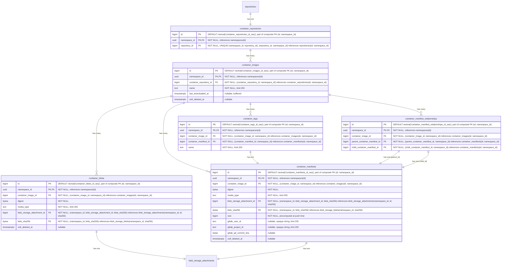

- **container_repositories**: 複数のイメージのコンテナです。各リポジトリは、独立したバージョニングを持つ複数のイメージをホストできます。名前、可視性、フォーマット横断クエリのために、`repository_id` を介して親の `repositories` テーブルを参照します。`HASH(namespace_id)` で64パーティションにパーティショニングされます。
- **container_images**: リポジトリ内の名前付きコンテナイメージ（例: `myapp`、`backend`）を表します。`last_downloaded_at` はイメージが最後にプルされた時刻を記録し、[バッファ書き込み／非同期書き込み](#buffered-and-asynchronous-writes) を介して維持されます。ダウンロードベースの保持を評価する `keep_last_downloaded_at` ライフサイクルルールで使用されます（[ADR-010](010_data_retention.md)）。`soft_deleted_at` タイムスタンプは、イメージがソフト削除された時刻を記録し、必要に応じて復元を可能にします。`HASH(namespace_id)` で64パーティションにパーティショニングされます。
- **container_blobs**: コンテナイメージを構成する、個々のコンテンツアドレス可能なレイヤーと設定オブジェクトを保存します。マニフェストとその構成レイヤー（blob）の関係は暗黙的であり（実行時にマニフェストの内容を解析して決定されます）、データベースの外部キーとしてモデル化されていません。`soft_deleted_at` タイムスタンプは、blob がソフト削除された時刻を記録し、必要に応じて復元を可能にします。`HASH(namespace_id)` で64パーティションにパーティショニングされます。
- **container_manifests**: 特定のイメージバージョンの設定とレイヤーを記述するイメージマニフェストを表します。`size` カラムは、ここをルートとするマニフェストツリーの合計バイトサイズを保持します。すなわち、このマニフェスト自身のペイロードに加え、マニフェストリストや OCI インデックスの子マニフェストを通じて推移的に到達可能なすべての blob です。`gitlab_user_id` は、どの GitLab ユーザーがこのマニフェストをプッシュしたかを記録します。外部キーのない nullable な不透明テキスト参照で、[repositories](#repositories) の同等のカラムと同じ根拠です。ユーザーレコードはモノリスに存在し、ユーザーハンドルとアバターのレンダリングはコンシューマーの責任で、AR スキーマは ID だけを保存し、`TEXT` によってスキーマは上流のユーザー ID 形式の将来的な変更から保護されます。`gitlab_project_id` と `gitlab_git_commit_sha` は、その帰属情報を残りの公開コンテキストで拡張します。`gitlab_project_id` はプッシュ元の GitLab プロジェクト（例: `CI_PROJECT_ID`）で、`gitlab_user_id` と同じモノリス参照の理由から nullable な不透明テキストとして保存されます。`gitlab_git_commit_sha` は公開時の Git コミット（例: `CI_COMMIT_SHA`）で、ハッシュカラムに関するスキーマ規約に従って nullable な `bytea` として保存されます。可変長で、SHA-1（20バイト）と SHA-256（32バイト）の両方に対応します。これはモノリス参照ではなく公開時の事実なので、外部キーは不要です。CI コンテキストなしでプッシュが到着した場合（例: 開発者のワークステーションからの手動プッシュ）、両方とも NULL になります。`soft_deleted_at` タイムスタンプは、マニフェストがソフト削除された時刻を記録し、必要に応じて復元を可能にします。`HASH(namespace_id)` で64パーティションにパーティショニングされます。
- **container_manifest_relationships**: 親マニフェストが他の複数のマニフェストを参照できる Docker マニフェストリストと OCI インデックス（マルチアーキテクチャイメージなど）を扱います。`HASH(namespace_id)` で64パーティションにパーティショニングされます。
- **container_tags**: 特定のマニフェストを指す、人間が読める名前（例: `latest`、`v1.2.3`）を提供します。`HASH(namespace_id)` で64パーティションにパーティショニングされます。
- **blob_storage_attachments**: 詳細は [blob ストレージ](#blob-storage) セクションを参照してください。

`container_blobs` テーブルは、他のコンテナレジストリアーキテクチャが行うように、コンテナレジストリの物理 blob を直接保存することはありません。ここでの違いは、blob ストレージが [blob ストレージ](#blob-storage) テーブルで（重複排除とガベージコレクションとともに）処理されることです。したがって、`container_*` レベルでは、`blob_storage_attachments` レコードへの参照を保存するだけで済みます。

#### Indexes

- **`container_repositories`**: `(namespace_id, repository_id)` に対する一意インデックス — 親リポジトリ参照によってコンテナリポジトリをルックアップします。
- **`container_images`**: `(namespace_id, container_repository_id, name) WHERE soft_deleted_at IS NULL` に対する一意インデックス — イメージ名はリポジトリ内で一意なイメージを識別します。重複すると OCI の名前ベースのルックアップが壊れます。部分条件により、ソフト削除後に同じ名前のイメージを再作成できます。`(namespace_id, container_repository_id, last_downloaded_at NULLS FIRST) WHERE soft_deleted_at IS NULL` に対するインデックス — `keep_last_downloaded_at` ライフサイクルルールの評価をサポートします。リポジトリ内のすべてのイメージをスキャンして行ごとにフィルタするのではなく、範囲スキャンで期限切れのイメージのみを返します。`NULLS FIRST` は、一度もダウンロードされていないイメージを最も古い行とグループ化するため、両方が同じ範囲スキャンで返されます。
- **`container_blobs`**: `(namespace_id, container_image_id, digest) WHERE soft_deleted_at IS NULL` に対する一意インデックス — blob のダイジェストはコンテンツアドレス可能です。同じイメージ内の同じダイジェストは、定義上同じ blob です。部分条件により、ソフト削除後に同じダイジェストを再プッシュできます。`(namespace_id, blob_storage_attachment_id)` に対するインデックス — ストレージアタッチメントによって blob をルックアップします。
- **`container_manifests`**: `(namespace_id, container_image_id, digest) WHERE soft_deleted_at IS NULL` に対する一意インデックス — マニフェストのダイジェストはコンテンツアドレス可能です。同じイメージ内の同じダイジェストは、定義上同じマニフェストです。部分条件により、ソフト削除後に同じダイジェストを再プッシュできます。`(namespace_id, blob_storage_attachment_id)` に対するインデックス — ストレージアタッチメントによってマニフェストをルックアップします。
- **`container_manifest_relationships`**: `(namespace_id, parent_container_manifest_id, child_container_manifest_id)` に対する一意インデックス — 重複する親子関係を防ぎ、指定した親マニフェストのすべての子を見つけます。`(namespace_id, child_container_manifest_id)` に対するインデックス — 指定した子マニフェストのすべての親を見つけます。`(namespace_id, container_image_id)` に対するインデックス — 指定したイメージのすべてのマニフェスト関係を見つけます。
- **`container_tags`**: `(namespace_id, container_image_id, name)` に対する一意インデックス — イメージ内で名前によってタグをルックアップします。`(namespace_id, container_manifest_id)` に対するインデックス — 指定したマニフェストを指すすべてのタグを見つけます。

#### Query examples

- 名前でイメージを取得する

  ```sql
  SELECT *
  FROM container_images
  WHERE namespace_id = '018f4d6f-0e10-7e3a-9bfd-23a4c5d6e7f8' AND container_repository_id = 123 AND name = 'myapp/backend'
    AND soft_deleted_at IS NULL;
  ```

- リポジトリ ID に対してダイジェストで blob を取得する

  ```sql
  SELECT cb.*
  FROM container_blobs cb
  JOIN container_images ci
    ON cb.container_image_id = ci.id AND cb.namespace_id = ci.namespace_id
  WHERE ci.namespace_id = '018f4d6f-0e10-7e3a-9bfd-23a4c5d6e7f8' AND ci.container_repository_id = 123
    AND cb.digest = 'sha256:abcd1234...'::bytea
    AND ci.soft_deleted_at IS NULL AND cb.soft_deleted_at IS NULL;
  ```

- リポジトリ ID に対してダイジェストでマニフェストを取得する

  ```sql
  SELECT cm.*
  FROM container_manifests cm
  JOIN container_images ci
    ON cm.container_image_id = ci.id AND cm.namespace_id = ci.namespace_id
  WHERE ci.namespace_id = '018f4d6f-0e10-7e3a-9bfd-23a4c5d6e7f8' AND ci.container_repository_id = 123
    AND cm.digest = 'sha256:efgh5678...'::bytea
    AND ci.soft_deleted_at IS NULL AND cm.soft_deleted_at IS NULL;
  ```

### Container Remote Repositories

リモートリポジトリは、プロキシしてキャッシュできる外部のコンテナレジストリを表します。これらは独自のライフサイクルを持つスタンドアロンのエンティティであり、複数の仮想リポジトリ間で共有可能です。仮想リポジトリの upstream から、親の `repositories` テーブルを介して参照されます。

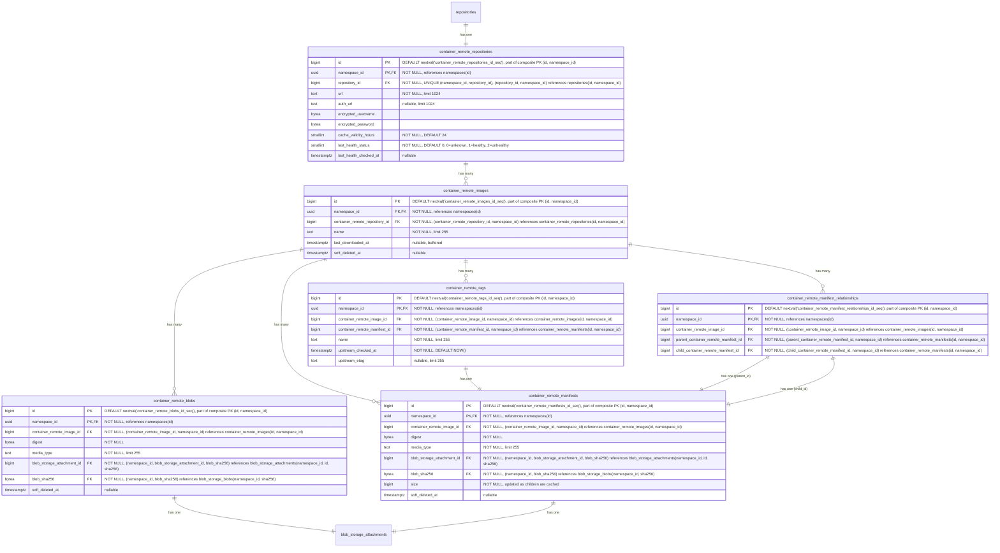

- **container_remote_repositories**: 外部のコンテナレジストリを表します。URL、オプションの認証 URL（`auth_url`）、認証情報、キャッシュ TTL（`cache_validity_hours`）を含みます。モニタリングのためにヘルスチェックのステータスが追跡されます。`repository_id` を介して親の `repositories` テーブルを参照します。リモートリポジトリはスタンドアロンであるため、同じリモートを使用する2つの仮想リポジトリは1つのキャッシュを共有します。`HASH(namespace_id)` で64パーティションにパーティショニングされます。
- **container_remote_images**: リモートリポジトリ内のキャッシュされたコンテナイメージです。`container_images` をミラーします。`last_downloaded_at` はキャッシュされたイメージが最後にプルされた時刻を記録し、ホット行の競合を避けるためにバッファ書き込み／非同期書き込み（`repositories.downloads_count` と同じパターン）を介して維持されます。`keep_last_downloaded_at` ライフサイクルルールとキャッシュ保持の評価で使用されます（[ADR-010](010_data_retention.md)）。`HASH(namespace_id)` で64パーティションにパーティショニングされます。
- **container_remote_blobs**: キャッシュされたレイヤーまたは config blob です。`HASH(namespace_id)` で64パーティションにパーティショニングされます。
- **container_remote_manifests**: キャッシュされたイメージマニフェストです。`size` カラムは、このキャッシュが認識しているサブツリーのバイトフットプリントを保持します。すなわち、キャッシュ時のマニフェスト自身のペイロードに加え、子が到着するごとの各子の `size` です。イメージマニフェストの場合、この値はキャッシュ時に完全です。マニフェストリストと OCI インデックスの場合、子がフェッチされるにつれて段階的にツリー全体のフットプリントに収束し、一部の子が一度もプルされなければ部分的なままになることがあります。この段階的なセマンティクスは遅延リモートキャッシュを反映しています。`size` を完全に保つためだけに子を積極的にフェッチすると、遅延設計を損なうことになります。`HASH(namespace_id)` で64パーティションにパーティショニングされます。
- **container_remote_manifest_relationships**: キャッシュされたマルチアーキテクチャマニフェストリストの関係です。ローカルと同じ構造です。`HASH(namespace_id)` で64パーティションにパーティショニングされます。
- **container_remote_tags**: キャッシュされたタグからマニフェストへのマッピングです。タグは可変ポインターであり、キャッシュの再検証時に、タグが新しいマニフェストへ指し直されることがあります。`upstream_checked_at` は、タグが upstream レジストリに対して最後に検証された時刻を記録し、再検証が必要かどうかを判断するために `cache_validity_hours` と比較されます。`upstream_etag` は upstream が返した ETag を保存し、タグが依然として同じマニフェストを指している場合に完全なマニフェスト解決を回避するための条件付きリクエスト（`If-None-Match`）を可能にします。マニフェストと blob は、暗号学的ハッシュによってコンテンツアドレス可能であるため、鮮度の追跡は不要です。保存されたバイトがダイジェストと一致すれば、コンテンツが正しいことが保証されます。`HASH(namespace_id)` で64パーティションにパーティショニングされます。
- **blob_storage_attachments**: 詳細は [blob ストレージ](#blob-storage) セクションを参照してください。

#### Indexes

- **`container_remote_repositories`**: `(namespace_id, repository_id)` に対する一意インデックス — 親参照によってリモートリポジトリをルックアップします。
- **`container_remote_images`**: `(namespace_id, container_remote_repository_id, name) WHERE soft_deleted_at IS NULL` に対する一意インデックス — 名前でキャッシュされたイメージをルックアップします。部分条件により、ソフト削除後に同じ名前のイメージを再作成できます。
- **`container_remote_blobs`**: `(namespace_id, container_remote_image_id, digest) WHERE soft_deleted_at IS NULL` に対する一意インデックス — イメージ内でダイジェストによってキャッシュされた blob をルックアップします。部分条件により、ソフト削除後に同じダイジェストを再キャッシュできます。`(namespace_id, blob_storage_attachment_id)` に対するインデックス — ストレージアタッチメントによって blob をルックアップします。
- **`container_remote_manifests`**: `(namespace_id, container_remote_image_id, digest) WHERE soft_deleted_at IS NULL` に対する一意インデックス — イメージ内でダイジェストによってキャッシュされたマニフェストをルックアップします。部分条件により、ソフト削除後に同じダイジェストを再キャッシュできます。`(namespace_id, blob_storage_attachment_id)` に対するインデックス — ストレージアタッチメントによってマニフェストをルックアップします。
- **`container_remote_manifest_relationships`**: `(namespace_id, parent_container_remote_manifest_id, child_container_remote_manifest_id)` に対する一意インデックス — 重複する親子関係を防ぎます。`(namespace_id, child_container_remote_manifest_id)` に対するインデックス — 指定した子マニフェストのすべての親を見つけます。`(namespace_id, container_remote_image_id)` に対するインデックス — 指定したイメージのすべてのマニフェスト関係を見つけます。
- **`container_remote_tags`**: `(namespace_id, container_remote_image_id, name)` に対する一意インデックス — イメージ内で名前によってタグをルックアップします。`(namespace_id, container_remote_manifest_id)` に対するインデックス — 指定したマニフェストを指すすべてのタグを見つけます。

#### Query examples

- リモートリポジトリを作成する

  ```sql
  -- Resolve the default repository collection for the namespace
  SELECT id FROM repository_collections WHERE namespace_id = '018f4d6f-0e10-7e3a-9bfd-23a4c5d6e7f8' AND is_default = true;
  -- Create the parent repository
  INSERT INTO repositories (namespace_id, name, format, kind, visibility)
  VALUES ('018f4d6f-0e10-7e3a-9bfd-23a4c5d6e7f8', 'docker-hub', 0, 2, 1)
  RETURNING id;
  -- Link the repository to the repository collection
  INSERT INTO repository_collection_repositories (namespace_id, repository_collection_id, repository_id)
  VALUES ('018f4d6f-0e10-7e3a-9bfd-23a4c5d6e7f8', <repository_collection_id>, <returned_id>);
  -- Then create the format-specific record
  INSERT INTO container_remote_repositories (namespace_id, repository_id, url, encrypted_username, encrypted_password)
  VALUES ('018f4d6f-0e10-7e3a-9bfd-23a4c5d6e7f8', <returned_id>, 'https://registry.hub.docker.com', $1, $2);
  ```

- キャッシュされたマニフェストが新鮮かどうかをチェックする

  ```sql
  SELECT crm.digest
  FROM container_remote_manifests crm
  JOIN container_remote_tags crt
    ON crt.container_remote_manifest_id = crm.id AND crt.namespace_id = crm.namespace_id
  JOIN container_remote_images cri
    ON crt.container_remote_image_id = cri.id AND crt.namespace_id = cri.namespace_id
  WHERE cri.namespace_id = '018f4d6f-0e10-7e3a-9bfd-23a4c5d6e7f8'
    AND cri.container_remote_repository_id = 789
    AND cri.name = 'library/nginx'
    AND crt.name = 'latest'
    AND cri.soft_deleted_at IS NULL AND crm.soft_deleted_at IS NULL;
  ```

- ダイジェストでキャッシュされた blob をプルする（blob ストレージへの読み取りパスのショートカット）

  ```sql
  SELECT bsb.object_storage_key, bsb.size
  FROM container_remote_blobs crb
  JOIN blob_storage_blobs bsb
    ON bsb.namespace_id = crb.namespace_id AND bsb.sha256 = crb.blob_sha256
  WHERE crb.namespace_id = '018f4d6f-0e10-7e3a-9bfd-23a4c5d6e7f8'
    AND crb.container_remote_image_id = 456
    AND crb.digest = 'sha256:abcd1234...'::bytea
    AND crb.soft_deleted_at IS NULL;
  ```

### Virtual Container Repositories

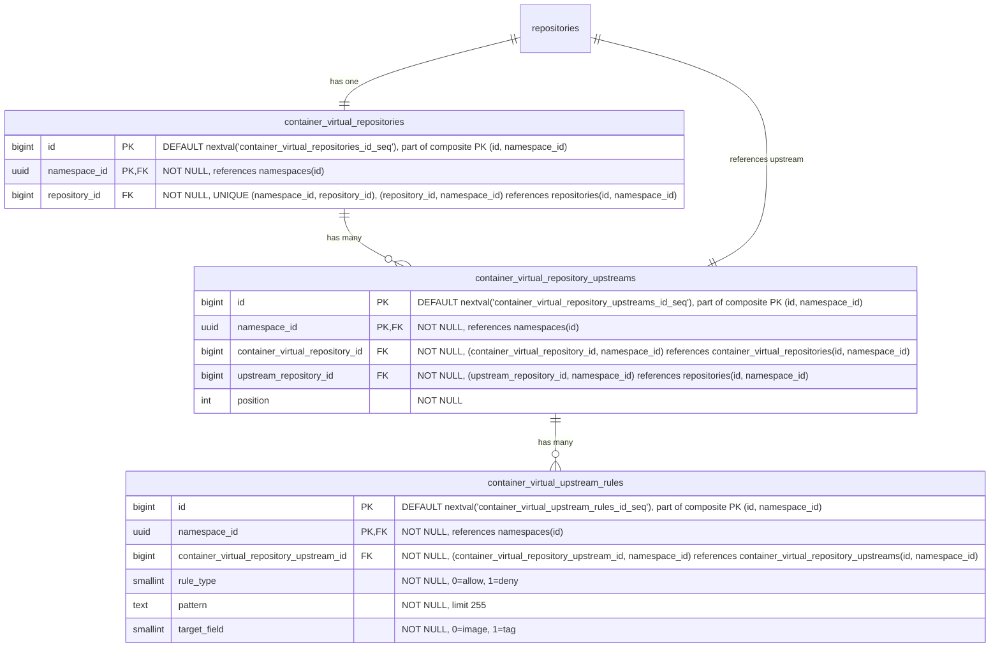

- **container_virtual_repositories**: コンテナイメージ用の仮想リポジトリです。名前、可視性、フォーマット横断クエリのために、`repository_id` を介して親の `repositories` テーブルを参照します。`HASH(namespace_id)` で64パーティションにパーティショニングされます。
- **container_virtual_repository_upstreams**: 仮想リポジトリとその upstream を結合するテーブルです。各仮想リポジトリは、順序付けられた upstream のリストを持ちます。各エントリは `upstream_repository_id` を介して upstream リポジトリを参照し、これは `repositories(namespace_id, id)` を指します。複合 FK `(namespace_id, upstream_repository_id)` は、upstream が同じ名前空間内にあることを強制します。これは、レジストリが名前空間にスコープされること（[ADR-001](001_organizations_as_anchor_point.md)）と一貫しています。`HASH(namespace_id)` で64パーティションにパーティショニングされます。
- **container_virtual_upstream_rules**: upstream に対する許可／拒否のフィルタルールを定義します。各ルールは、この upstream を通じて解決する際にどのアーティファクトを含めるか除外するかを制御するために、ワイルドカードパターンと対象フィールドを指定します。MVP ではパターンはワイルドカードのみで、正規表現のサポートは顧客からのフィードバックが正当化するまで延期されます（[議論](https://gitlab.com/gitlab-org/gitlab/-/work_items/597754#note_3291871207)）。ルールは（リモートリポジトリごとではなく）upstream 参照ごとに保たれ、これは include/exclude パターンが仮想 upstream の関連付けごとに設定される JFrog モデルと一致します。`HASH(namespace_id)` で64パーティションにパーティショニングされます。

#### Indexes

- **`container_virtual_repositories`**: `(namespace_id, repository_id)` に対する一意インデックス — 親参照によって仮想リポジトリをルックアップします。
- **`container_virtual_repository_upstreams`**: `(namespace_id, container_virtual_repository_id, position) DEFERRABLE INITIALLY DEFERRED` に対する一意インデックス — 仮想リポジトリの順序付けられた upstream を取得します。トランザクション内での並べ替えを可能にするために遅延可能です。`(namespace_id, container_virtual_repository_id, upstream_repository_id)` に対する一意インデックス — 同じ upstream が仮想リポジトリに2回追加されるのを防ぎます。
- **`container_virtual_upstream_rules`**: `(namespace_id, container_virtual_repository_upstream_id)` に対するインデックス — 指定した upstream のすべてのルールを取得します。

#### Query examples

- 仮想リポジトリを作成する

  ```sql
  -- First create the parent repository
  INSERT INTO repositories (namespace_id, name, format, kind, visibility)
  VALUES ('018f4d6f-0e10-7e3a-9bfd-23a4c5d6e7f8', 'my-virtual-repo', 0, 1, 1)
  RETURNING id;
  -- Link the repository to a repository collection
  INSERT INTO repository_collection_repositories (namespace_id, repository_collection_id, repository_id)
  VALUES ('018f4d6f-0e10-7e3a-9bfd-23a4c5d6e7f8', 456, <returned_id>);
  -- Then create the format-specific record
  INSERT INTO container_virtual_repositories (namespace_id, repository_id)
  VALUES ('018f4d6f-0e10-7e3a-9bfd-23a4c5d6e7f8', <returned_id>);
  ```

- 仮想リポジトリを upstream に関連付ける

  ```sql
  INSERT INTO container_virtual_repository_upstreams (namespace_id, container_virtual_repository_id, upstream_repository_id, position)
  VALUES ('018f4d6f-0e10-7e3a-9bfd-23a4c5d6e7f8', 123, 789, 1);
  ```

### Maven Repositories

Maven パッケージは、ファイル（`.jar`、`.pom`、`maven-metadata.xml`）の集合を表します。したがって、単一の Maven パッケージのダウンロードは、4〜15 の API リクエストに相当することがあります。

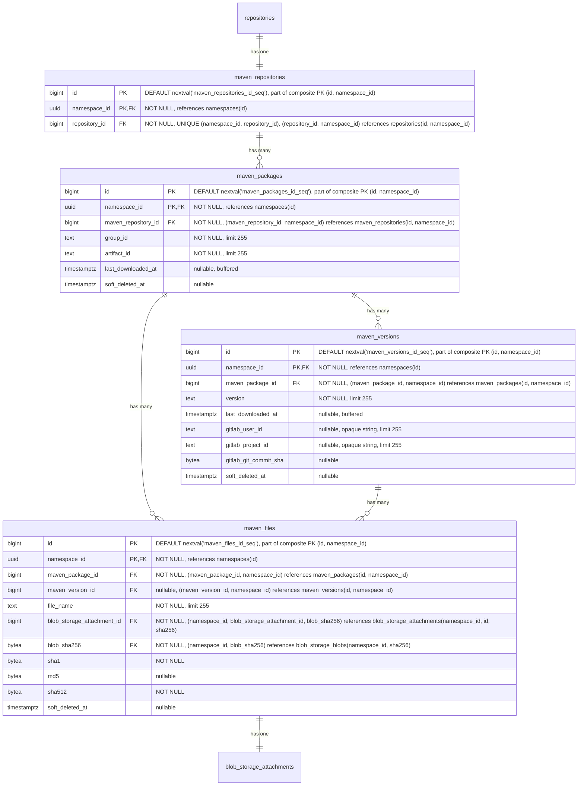

- **maven_repositories**: 複数のパッケージのコンテナです。各リポジトリは、group ID と artifact ID で識別される複数のパッケージをホストできます。名前、可視性、フォーマット横断クエリのために、`repository_id` を介して親の `repositories` テーブルを参照します。`HASH(namespace_id)` で64パーティションにパーティショニングされます。
- **maven_packages**: [group ID と artifact ID](https://maven.apache.org/pom.html#Maven_Coordinates) で識別される Maven パッケージ（例: `com.example:myapp`）を表します。`last_downloaded_at` はパッケージのいずれかのファイルが最後にダウンロードされた時刻を記録し、[バッファ書き込み／非同期書き込み](#buffered-and-asynchronous-writes) を介して維持されます。`NULL` はパッケージが一度もダウンロードされていないことを意味し、`keep_last_downloaded_at` ライフサイクルルールの評価では可能な限り古いダウンロード時刻として扱われます（すなわち、ダウンロードベースの保持で削除対象になります）。ダウンロードベースの保持を評価する `keep_last_downloaded_at` ライフサイクルルールで使用されます（[ADR-010](010_data_retention.md)）。`HASH(namespace_id)` で64パーティションにパーティショニングされます。
- **maven_versions**: Maven パッケージの個々の [バージョン](https://maven.apache.org/pom.html#Maven_Coordinates)（例: `1.0.0`、`2.1.3-SNAPSHOT`）を保存します。`last_downloaded_at` はバージョンのいずれかのファイルが最後にダウンロードされた時刻を記録し、[バッファ書き込み／非同期書き込み](#buffered-and-asynchronous-writes) を介して維持されます。`keep_last_downloaded_at` ライフサイクルルールで使用されます。`gitlab_user_id`、`gitlab_project_id`、`gitlab_git_commit_sha` は、どの GitLab ユーザーがこのバージョンを公開したか、および公開の背後にある CI コンテキスト（プロジェクト、コミット）を記録し、[`container_manifests`](#container-repositories) の同等のカラムと同じ形状・根拠を持ちます。`HASH(namespace_id)` で64パーティションにパーティショニングされます。
- **maven_files**: Maven パッケージに関連付けられた個々のファイルを表します。ファイルは、`maven_version_id` が設定されたバージョン固有のもの（JAR、POM、ソース、Javadoc、チェックサム）か、`maven_version_id` が NULL のパッケージレベルのもの（`maven-metadata.xml` とそのチェックサムなど）のいずれかです。`maven_package_id` は常に設定されており、パッケージからそのすべてのファイルへの直接のパスを提供します。レジストリがパフォーマンスのボトルネックを改善するために使用する補助ファイルである場合もあります。`sha1` と `md5` カラムは、整合性検証のために [Maven プロトコルが要求するチェックサム](https://maven.apache.org/resolver/about-checksums.html) を保存します。Maven クライアントは、すべてのアーティファクトとともに `.sha1` と `.md5` のサイドカーファイルを期待します。これらのカラムが `blob_storage_blobs` ではなく `maven_files` にあるのは、これらが普遍的な blob のプロパティではなく Maven プロトコルの関心事だからです。他のフォーマット（OCI コンテナ）は SHA256 のみを使用します。ここに保持することで、`blob_storage_blobs` をフォーマット固有のカラムやインデックスを持たないフォーマット非依存のテーブルとして保てます。`sha1` は Maven プロトコルが要求するため `NOT NULL` です。`md5` は Maven 3.9+ が [MD5 チェックサムを非推奨にした](https://maven.apache.org/resolver/about-checksums.html) ため nullable です。`sha512` は、Maven プロトコルがレジストリが提供できなければならない `.sha512` サイドカーを公開し、その値はアップロード中にバイトが永続化前にハンドラーを通過する際に常に計算可能であるため、`NOT NULL` です。`HASH(namespace_id)` で64パーティションにパーティショニングされます。
- **blob_storage_attachments**: 詳細は [blob ストレージ](#blob-storage) セクションを参照してください。

ここでは、パッケージ名（この場合は group ID と artifact ID）とバージョンを同じテーブルに保存していません。その理由は、UI がこのデータにパッケージ名でアクセスするためです。パッケージ名がフォルダであるツリー状の UI を想像してください。それを開くと、バージョンごとに1つのサブフォルダがあります。この最初のリクエストはフォルダ、すなわちパッケージ名を一覧表示する必要があります。フォルダを開くと、すべてのサブフォルダ、すなわちパッケージバージョンを一覧表示するリクエストがトリガーされます。したがって、このアクセスパターンを容易にするために、2つの専用テーブル（`maven_packages` と `maven_versions`）を持っています。

#### Indexes

- **`maven_repositories`**: `(namespace_id, repository_id)` に対する一意インデックス — 親リポジトリ参照によって Maven リポジトリをルックアップします。
- **`maven_packages`**: `(namespace_id, maven_repository_id, group_id, artifact_id) WHERE soft_deleted_at IS NULL` に対する一意インデックス — リポジトリ内で Maven 座標によってパッケージをルックアップします。部分条件により、ソフト削除後に同じ座標のパッケージを再作成できます。`(namespace_id, maven_repository_id, last_downloaded_at NULLS FIRST) WHERE soft_deleted_at IS NULL` に対するインデックス — `keep_last_downloaded_at` ライフサイクルルールの評価をサポートします。リポジトリ内のすべてのパッケージをスキャンして行ごとにフィルタするのではなく、範囲スキャンで期限切れのパッケージのみを返します。`NULLS FIRST` は、一度もダウンロードされていないパッケージを最も古い行とグループ化するため、両方が同じ範囲スキャンで返されます。
- **`maven_versions`**: `(namespace_id, maven_package_id, version) WHERE soft_deleted_at IS NULL` に対する一意インデックス — パッケージ内で特定のバージョンをルックアップします。部分条件により、ソフト削除後に同じ識別子のバージョンを再作成できます。`(namespace_id, maven_package_id, last_downloaded_at NULLS FIRST) WHERE soft_deleted_at IS NULL` に対するインデックス — パッケージのバージョンにスコープされた `keep_last_downloaded_at` ライフサイクルルールの評価をサポートし、`maven_packages` と同じ範囲スキャン戦略を使用します。
- **`maven_files`**: `(namespace_id, maven_version_id, file_name) WHERE soft_deleted_at IS NULL AND maven_version_id IS NOT NULL` に対する一意インデックス — バージョン固有のファイル名はバージョン内で一意でなければなりません。部分条件はソフト削除済みの行とパッケージレベルのファイルを除外します。`(namespace_id, maven_package_id, file_name) WHERE soft_deleted_at IS NULL AND maven_version_id IS NULL` に対する一意インデックス — パッケージレベルのファイル名（`maven-metadata.xml` など）はパッケージ内で一意でなければなりません。`(namespace_id, blob_storage_attachment_id)` に対するインデックス — ストレージアタッチメントによってファイルをルックアップします。

#### Query examples

- 指定したリポジトリ ID とパッケージ名のパッケージバージョンを取得する。

  ```sql
  SELECT mv.*
  FROM maven_versions mv
  JOIN maven_packages mp
    ON mv.maven_package_id = mp.id AND mv.namespace_id = mp.namespace_id
  WHERE mp.namespace_id = '018f4d6f-0e10-7e3a-9bfd-23a4c5d6e7f8' AND mp.maven_repository_id = 123 AND mp.group_id = 'com.example' AND mp.artifact_id = 'myapp'
    AND mv.version = '1.0.0'
    AND mp.soft_deleted_at IS NULL AND mv.soft_deleted_at IS NULL;
  ```

- 指定したバージョン ID とファイル名のファイルを取得する。

  ```sql
  SELECT mf.*
  FROM maven_files mf
  WHERE mf.namespace_id = '018f4d6f-0e10-7e3a-9bfd-23a4c5d6e7f8' AND mf.maven_version_id = 456 AND mf.file_name = 'myapp-1.0.0.jar'
    AND mf.soft_deleted_at IS NULL;
  ```

- 指定したパッケージのパッケージレベルファイル（例: `maven-metadata.xml`）を取得する。

  ```sql
  SELECT mf.*
  FROM maven_files mf
  WHERE mf.namespace_id = '018f4d6f-0e10-7e3a-9bfd-23a4c5d6e7f8' AND mf.maven_package_id = 123 AND mf.maven_version_id IS NULL
    AND mf.soft_deleted_at IS NULL;
  ```

### Maven Remote Repositories

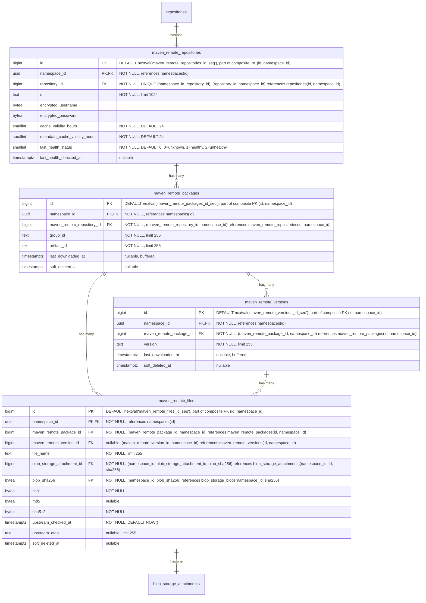

- **maven_remote_repositories**: 外部の Maven リポジトリを表します。URL、認証情報、アーティファクトキャッシュ TTL（`cache_validity_hours`）、および `maven-metadata.xml` などのメタデータレスポンス用の別の TTL（`metadata_cache_validity_hours`）を含みます。モニタリングのためにヘルスチェックのステータスが追跡されます。`repository_id` を介して親の `repositories` テーブルを参照します。`HASH(namespace_id)` で64パーティションにパーティショニングされます。
- **maven_remote_packages**: group ID と artifact ID で識別される、キャッシュされた Maven パッケージです。`maven_packages` をミラーします。`last_downloaded_at` はパッケージのいずれかのキャッシュされたファイルが最後にダウンロードされた時刻を記録し、ホット行の競合を避けるためにバッファ書き込み／非同期書き込みを介して維持されます。`keep_last_downloaded_at` ライフサイクルルールとキャッシュ保持の評価で使用されます。`HASH(namespace_id)` で64パーティションにパーティショニングされます。
- **maven_remote_versions**: Maven パッケージのキャッシュされたバージョンです。`maven_versions` をミラーします。`last_downloaded_at` はバージョンのいずれかのキャッシュされたファイルが最後にダウンロードされた時刻を記録し、ホット行の競合を避けるためにバッファ書き込み／非同期書き込みを介して維持されます。`keep_last_downloaded_at` ライフサイクルルールとキャッシュ保持の評価で使用されます。`HASH(namespace_id)` で64パーティションにパーティショニングされます。
- **maven_remote_files**: キャッシュされたファイル（JAR、POM、チェックサム、`maven-metadata.xml`）です。nullable な `maven_remote_version_id` は、ローカルと同じパターン（バージョン固有のファイル vs. `maven-metadata.xml` のようなパッケージレベルのファイル）を保ちます。`sha1` と `md5` は、コンテンツがローカルかキャッシュかにかかわらず Maven プロトコルがこれらのチェックサムの提供を要求するため保持されます。`sha512` は同等性の観点から追加され、ローカルの `maven_files` のカラム形状をミラーすることで、Maven Virtual の仕様（S14）が単一のクエリパスでどちらのバックエンドからも `.sha512` サイドカーを提供できるようにします。値は他のチェックサムとともにプロキシ書き込みステップ中にキャッシュされたバイトから計算されるため、初日から `NOT NULL` が達成可能です。`upstream_checked_at` は、ファイルが upstream リポジトリに対して最後に検証された時刻を記録し、アーティファクトファイルの場合は `cache_validity_hours`、メタデータファイル（例: `maven-metadata.xml`）の場合は `metadata_cache_validity_hours` と比較されて再検証が必要かどうかを判断します。`upstream_etag` は upstream が返した ETag を保存し、変更されていないファイルの再ダウンロードを回避するための条件付きリクエスト（`If-None-Match`）を可能にします。`HASH(namespace_id)` で64パーティションにパーティショニングされます。
- **blob_storage_attachments**: 詳細は [blob ストレージ](#blob-storage) セクションを参照してください。

#### Indexes

- **`maven_remote_repositories`**: `(namespace_id, repository_id)` に対する一意インデックス — 親参照によってリモートリポジトリをルックアップします。
- **`maven_remote_packages`**: `(namespace_id, maven_remote_repository_id, group_id, artifact_id) WHERE soft_deleted_at IS NULL` に対する一意インデックス — Maven 座標によってキャッシュされたパッケージをルックアップします。部分条件により、ソフト削除後に同じ座標のパッケージを再作成できます。
- **`maven_remote_versions`**: `(namespace_id, maven_remote_package_id, version) WHERE soft_deleted_at IS NULL` に対する一意インデックス — パッケージ内でキャッシュされたバージョンをルックアップします。部分条件により、ソフト削除後に同じ識別子のバージョンを再作成できます。
- **`maven_remote_files`**: `(namespace_id, maven_remote_version_id, file_name) WHERE soft_deleted_at IS NULL AND maven_remote_version_id IS NOT NULL` に対する一意インデックス — バージョン固有のファイル名はバージョン内で一意でなければなりません。`(namespace_id, maven_remote_package_id, file_name) WHERE soft_deleted_at IS NULL AND maven_remote_version_id IS NULL` に対する一意インデックス — パッケージレベルのファイル名はパッケージ内で一意でなければなりません。`(namespace_id, blob_storage_attachment_id)` に対するインデックス — ストレージアタッチメントによってファイルをルックアップします。

#### Query examples

- リモートリポジトリを作成する

  ```sql
  -- First create the parent repository
  INSERT INTO repositories (namespace_id, name, format, kind, visibility)
  VALUES ('018f4d6f-0e10-7e3a-9bfd-23a4c5d6e7f8', 'central', 1, 2, 0)
  RETURNING id;
  -- Link the repository to a repository collection
  INSERT INTO repository_collection_repositories (namespace_id, repository_collection_id, repository_id)
  VALUES ('018f4d6f-0e10-7e3a-9bfd-23a4c5d6e7f8', 456, <returned_id>);
  -- Then create the format-specific record
  INSERT INTO maven_remote_repositories (namespace_id, repository_id, url, encrypted_username, encrypted_password)
  VALUES ('018f4d6f-0e10-7e3a-9bfd-23a4c5d6e7f8', <returned_id>, 'https://repo.maven.apache.org/maven2', $1, $2);
  ```

- 座標でキャッシュされた Maven ファイルをルックアップする

  ```sql
  SELECT mrf.*, bsb.object_storage_key
  FROM maven_remote_files mrf
  JOIN maven_remote_versions mrv
    ON mrf.maven_remote_version_id = mrv.id AND mrf.namespace_id = mrv.namespace_id
  JOIN maven_remote_packages mrp
    ON mrv.maven_remote_package_id = mrp.id AND mrv.namespace_id = mrp.namespace_id
  JOIN blob_storage_blobs bsb
    ON bsb.namespace_id = mrf.namespace_id AND bsb.sha256 = mrf.blob_sha256
  WHERE mrp.namespace_id = '018f4d6f-0e10-7e3a-9bfd-23a4c5d6e7f8'
    AND mrp.maven_remote_repository_id = 789
    AND mrp.group_id = 'com.example'
    AND mrp.artifact_id = 'myapp'
    AND mrv.version = '1.0.0'
    AND mrf.file_name = 'myapp-1.0.0.jar'
    AND mrp.soft_deleted_at IS NULL AND mrv.soft_deleted_at IS NULL AND mrf.soft_deleted_at IS NULL;
  ```

- パッケージのキャッシュされた `maven-metadata.xml` をルックアップする

  ```sql
  SELECT mrf.*
  FROM maven_remote_files mrf
  JOIN maven_remote_packages mrp
    ON mrf.maven_remote_package_id = mrp.id AND mrf.namespace_id = mrp.namespace_id
  WHERE mrp.namespace_id = '018f4d6f-0e10-7e3a-9bfd-23a4c5d6e7f8'
    AND mrp.maven_remote_repository_id = 789
    AND mrp.group_id = 'com.example'
    AND mrp.artifact_id = 'myapp'
    AND mrf.maven_remote_version_id IS NULL
    AND mrf.file_name = 'maven-metadata.xml'
    AND mrp.soft_deleted_at IS NULL AND mrf.soft_deleted_at IS NULL;
  ```

### Maven Virtual Repositories

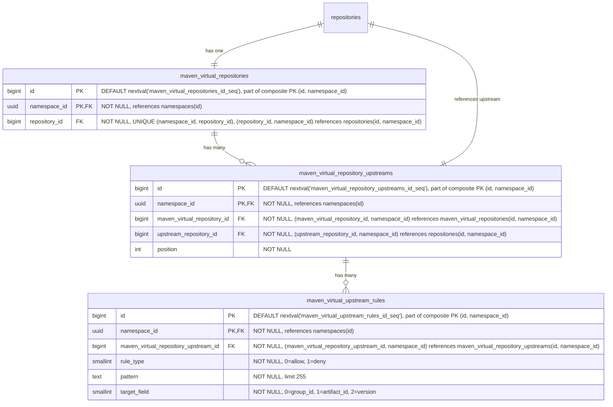

- **maven_virtual_repositories**: Maven パッケージ用の仮想リポジトリです。名前、可視性、フォーマット横断クエリのために、`repository_id` を介して親の `repositories` テーブルを参照します。`HASH(namespace_id)` で64パーティションにパーティショニングされます。
- **maven_virtual_repository_upstreams**: 仮想リポジトリとその upstream を結合するテーブルです。各仮想リポジトリは、順序付けられた upstream のリストを持ちます。各エントリは `upstream_repository_id` を介して upstream リポジトリを参照し、これは `repositories(namespace_id, id)` を指します。複合 FK `(namespace_id, upstream_repository_id)` は、upstream が同じ名前空間内にあることを強制します。これは、レジストリが名前空間にスコープされること（[ADR-001](001_organizations_as_anchor_point.md)）と一貫しています。`HASH(namespace_id)` で64パーティションにパーティショニングされます。
- **maven_virtual_upstream_rules**: upstream に対する許可／拒否のフィルタルールを定義します。各ルールは、この upstream を通じて解決する際にどのアーティファクトを含めるか除外するかを制御するために、ワイルドカードパターンと対象フィールドを指定します。MVP ではパターンはワイルドカードのみで、正規表現のサポートは顧客からのフィードバックが正当化するまで延期されます（[議論](https://gitlab.com/gitlab-org/gitlab/-/work_items/597754#note_3291871207)）。`HASH(namespace_id)` で64パーティションにパーティショニングされます。

#### Indexes

- **`maven_virtual_repositories`**: `(namespace_id, repository_id)` に対する一意インデックス — 親参照によって仮想リポジトリをルックアップします。
- **`maven_virtual_repository_upstreams`**: `(namespace_id, maven_virtual_repository_id, position) DEFERRABLE INITIALLY DEFERRED` に対する一意インデックス — 仮想リポジトリの順序付けられた upstream を取得します。トランザクション内での並べ替えを可能にするために遅延可能です。`(namespace_id, maven_virtual_repository_id, upstream_repository_id)` に対する一意インデックス — 同じ upstream が仮想リポジトリに2回追加されるのを防ぎます。
- **`maven_virtual_upstream_rules`**: `(namespace_id, maven_virtual_repository_upstream_id)` に対するインデックス — 指定した upstream のすべてのルールを取得します。

#### Query examples

- 仮想リポジトリを作成する

  ```sql
  -- First create the parent repository
  INSERT INTO repositories (namespace_id, name, format, kind, visibility)
  VALUES ('018f4d6f-0e10-7e3a-9bfd-23a4c5d6e7f8', 'my-virtual-repo', 1, 1, 1)
  RETURNING id;
  -- Link the repository to a repository collection
  INSERT INTO repository_collection_repositories (namespace_id, repository_collection_id, repository_id)
  VALUES ('018f4d6f-0e10-7e3a-9bfd-23a4c5d6e7f8', 456, <returned_id>);
  -- Then create the format-specific record
  INSERT INTO maven_virtual_repositories (namespace_id, repository_id)
  VALUES ('018f4d6f-0e10-7e3a-9bfd-23a4c5d6e7f8', <returned_id>);
  ```

- 仮想リポジトリを upstream に関連付ける

  ```sql
  INSERT INTO maven_virtual_repository_upstreams (namespace_id, maven_virtual_repository_id, upstream_repository_id, position)
  VALUES ('018f4d6f-0e10-7e3a-9bfd-23a4c5d6e7f8', 123, 789, 1);
  ```

### NPM Repositories

Node のパッケージは基本的に `.tar.gz` ファイルであり、各バージョンが単一のアーカイブです。ただし、node クライアントはより豊富な機能セットを持ち、例えば私たちが扱う必要のある distribution タグの使用などがあります。

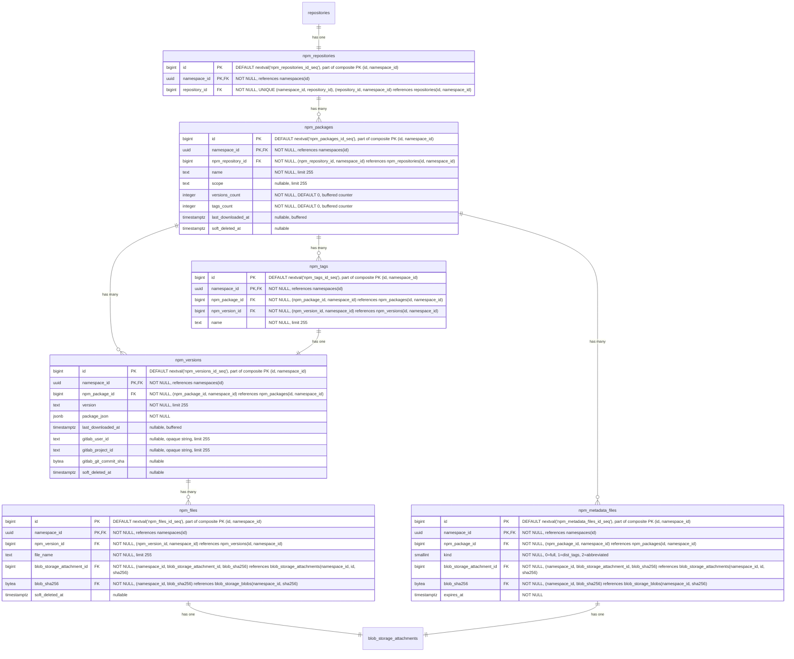

- **npm_repositories**: 複数のパッケージのコンテナです。各リポジトリは、オプションのスコープを持つ複数のパッケージをホストできます。名前、可視性、フォーマット横断クエリのために、`repository_id` を介して親の `repositories` テーブルを参照します。`HASH(namespace_id)` で64パーティションにパーティショニングされます。
- **npm_packages**: npm パッケージを表します。`name` カラムは、スコープを含む完全なパッケージ名（例: `@myorg/mypackage` または `lodash`）を保存します。`versions_count` は、ソフト削除済みのものを含むパッケージの `npm_versions` 行を数え、ガベージコレクションが行をハード削除したときにのみデクリメントします。`tags_count` はその `npm_tags` 行を数えます（`npm_tags` にはソフト削除カラムがないため、この問題は生じません）。どちらも [ADR-004](004_data_and_application_limits.md#entity-count-limits) のパッケージごとのエンティティ数制限（25,000 バージョン、1,000 タグ）を強制するバッファカウンターであり、[バッファ書き込み／非同期書き込み](#buffered-and-asynchronous-writes) を介して維持されます。ソフト削除済みのバージョンを含めることは、`namespace_statistics.deduplicated_size_bytes` の扱いをミラーし、不正利用の経路を塞ぎます。すなわち、ソフト削除済みの行を上限から除外できる顧客が、繰り返しソフト削除して再公開することで、すべてのソフト削除済み行が依然としてストレージを占有し復元可能であるにもかかわらず、25,000 バージョンの制限を無期限に下回り続けられてしまうのを防ぎます。両方の上限が 32 ビットの上限を十分に下回るため、（`bigint` ではなく）`integer` 型です。他の場所の無制限のカウンター（`downloads_count`、`size_bytes`）は無制限に増加するため `bigint` が必要です。`last_downloaded_at` はパッケージのいずれかのファイルが最後にダウンロードされた時刻を記録し、[バッファ書き込み／非同期書き込み](#buffered-and-asynchronous-writes) を介して維持されます。`keep_last_downloaded_at` ライフサイクルルールで使用されます。`HASH(namespace_id)` で64パーティションにパーティショニングされます。
- **npm_versions**: package.json メタデータを埋め込んだ npm パッケージの個々のバージョンを保存します。`last_downloaded_at` はバージョンのいずれかのファイルが最後にダウンロードされた時刻を記録し、[バッファ書き込み／非同期書き込み](#buffered-and-asynchronous-writes) を介して維持されます。`keep_last_downloaded_at` ライフサイクルルールで使用されます。`gitlab_user_id`、`gitlab_project_id`、`gitlab_git_commit_sha` は、どの GitLab ユーザーがこのバージョンを公開したか、および公開の背後にある CI コンテキスト（プロジェクト、コミット）を記録し、[`container_manifests`](#container-repositories) の同等のカラムと同じ形状・根拠を持ちます。`HASH(namespace_id)` で64パーティションにパーティショニングされます。
- **npm_tags**: 特定のパッケージバージョンを指す [NPM distribution タグ](https://docs.npmjs.com/cli/v11/commands/npm-dist-tag)（例: `latest`、`next`、`beta`）を提供します。`HASH(namespace_id)` で64パーティションにパーティショニングされます。
- **npm_files**: npm パッケージバージョンのファイルを表します。これらは主に tarball アーカイブです。レジストリがパフォーマンスのボトルネックを改善するために使用する補助ファイルである場合もあります。`HASH(namespace_id)` で64パーティションにパーティショニングされます。
- **npm_metadata_files**: npm パッケージの事前計算されたメタデータファイルを `kind` ごとに1つ保存します。`kind` カラムはメタデータのバリアントを区別します。`full`（0）はすべてのバージョンを含む完全な packument を含み、`dist_tags`（1）は distribution タグのマッピングのみを含み、`abbreviated`（2）はリクエストが `Accept: application/vnd.npm.install-v1+json` を伴う場合に提供されるインストール専用の射影です。クライアントのリクエストに基づいて、npm メタデータエンドポイントで適切なファイルが提供されます。メタデータはパッケージのすべてのバージョンにまたがるため、（`npm_versions` ではなく）`npm_packages` にリンクされています。メタデータファイルは、バージョンが公開または公開解除された後に非同期で生成されます。`expires_at` カラムはキャッシュの鮮度を駆動します。書き込み側（公開、非推奨化、公開解除、dist-tag の変更）は、データ書き込みと同じトランザクションで、対象のパッケージのすべての行に対して `expires_at = NOW()` を設定することでキャッシュを強制的に期限切れにします。再構築ジョブは、新しく生成された blob を持つ行をアップサートする際に `expires_at = NOW() + npm.packument_cache_ttl` を設定します。読み取り側は `expires_at > NOW()` でフィルタし、ミスの場合はインラインビルドパスにフォールスルーするため、期限切れの行がクライアントに提供されることはありません。このカラムはハード削除の期限ではなく、キャッシュの鮮度シグナルです。強制的な期限切れは blob とアタッチメントをそのまま残すため、すでにそれらに対して解決中のレスポンスは、再構築ジョブがアタッチメントを入れ替えるまで正常に完了します。`HASH(namespace_id)` で64パーティションにパーティショニングされます。
- **blob_storage_attachments**: 詳細は [blob ストレージ](#blob-storage) セクションを参照してください。

[Maven](#maven-repositories) と同様に、まったく同じ理由でパッケージ名とバージョンは2つの異なるテーブルに保存されます。

#### Indexes

- **`npm_repositories`**: `(namespace_id, repository_id)` に対する一意インデックス — 親リポジトリ参照によって NPM リポジトリをルックアップします。
- **`npm_packages`**: `(namespace_id, npm_repository_id, name) WHERE soft_deleted_at IS NULL` に対する一意インデックス — リポジトリ内で名前によってパッケージをルックアップします。部分条件により、ソフト削除後に同じ名前のパッケージを再作成できます。`(namespace_id, npm_repository_id, last_downloaded_at NULLS FIRST) WHERE soft_deleted_at IS NULL` に対するインデックス — `keep_last_downloaded_at` ライフサイクルルールの評価をサポートします。リポジトリ内のすべてのパッケージをスキャンして行ごとにフィルタするのではなく、範囲スキャンで期限切れのパッケージのみを返します。`NULLS FIRST` は、一度もダウンロードされていないパッケージを最も古い行とグループ化するため、両方が同じ範囲スキャンで返されます。
- **`npm_versions`**: `(namespace_id, npm_package_id, version) WHERE soft_deleted_at IS NULL` に対する一意インデックス — パッケージ内で特定のバージョンをルックアップします。部分条件により、ソフト削除後に同じ識別子のバージョンを再作成できます。`(namespace_id, npm_package_id, last_downloaded_at NULLS FIRST) WHERE soft_deleted_at IS NULL` に対するインデックス — パッケージのバージョンにスコープされた `keep_last_downloaded_at` ライフサイクルルールの評価をサポートし、`npm_packages` と同じ範囲スキャン戦略を使用します。
- **`npm_tags`**: `(namespace_id, npm_package_id, name)` に対する一意インデックス — パッケージ内で名前によって distribution タグをルックアップします。`(namespace_id, npm_version_id)` に対するインデックス — 指定したバージョンを指すすべてのタグを見つけます。
- **`npm_files`**: `(namespace_id, npm_version_id, file_name) WHERE soft_deleted_at IS NULL` に対する一意インデックス — ファイル名はバージョン内で一意でなければなりません。部分条件により、ソフト削除後に同じ名前のファイルを再作成できます。`(namespace_id, blob_storage_attachment_id)` に対するインデックス — ストレージアタッチメントによってファイルをルックアップします。
- **`npm_metadata_files`**: `(namespace_id, npm_package_id, kind)` に対する一意インデックス — パッケージごと・kind ごとに1つのメタデータファイルです。`(namespace_id, blob_storage_attachment_id)` に対するインデックス — ストレージアタッチメントによってメタデータファイルをルックアップします。

#### Query examples

- 指定したリポジトリ ID とパッケージ名のすべてのバージョンを取得する

  ```sql
  SELECT nv.*
  FROM npm_versions nv
  JOIN npm_packages np
    ON nv.npm_package_id = np.id AND nv.namespace_id = np.namespace_id
  WHERE np.namespace_id = '018f4d6f-0e10-7e3a-9bfd-23a4c5d6e7f8' AND np.npm_repository_id = 123 AND np.name = '@myorg/mypackage'
    AND np.soft_deleted_at IS NULL AND nv.soft_deleted_at IS NULL;
  ```

- 公開パスの制限事前チェックのために、パッケージごとのエンティティ数カウンターを読み取る（参考値。`npm_versions` と `npm_tags` の部分一意インデックスが、競合のない権威あるガードです）。

  ```sql
  SELECT versions_count, tags_count
  FROM npm_packages
  WHERE namespace_id = '018f4d6f-0e10-7e3a-9bfd-23a4c5d6e7f8' AND id = 456 AND soft_deleted_at IS NULL;
  ```

- 指定したバージョン ID とファイル名のファイルを取得する

  ```sql
  SELECT nf.*
  FROM npm_files nf
  WHERE nf.namespace_id = '018f4d6f-0e10-7e3a-9bfd-23a4c5d6e7f8' AND nf.npm_version_id = 456 AND nf.file_name = 'mypackage-1.0.0.tgz'
    AND nf.soft_deleted_at IS NULL;
  ```

- パッケージの事前計算された完全なメタデータファイルを取得する（npm メタデータエンドポイントで提供）

  ```sql
  SELECT bsb.object_storage_key, bsb.size, bsb.content_type
  FROM npm_metadata_files nmf
  JOIN blob_storage_blobs bsb ON bsb.namespace_id = nmf.namespace_id AND bsb.sha256 = nmf.blob_sha256
  WHERE nmf.namespace_id = '018f4d6f-0e10-7e3a-9bfd-23a4c5d6e7f8' AND nmf.npm_package_id = 456 AND nmf.kind = 0
    AND nmf.expires_at > NOW();
  ```

  読み取りは `expires_at > NOW()` でフィルタします。ミス（行がない、または書き込み側が
  強制的に期限切れにしたか TTL が経過したために `expires_at <= NOW()`）はインラインビルドパスに
  フォールスルーします。後述のキャッシュ再構築ジョブが新鮮な行を復元します。

- 書き込み時に packument キャッシュを強制的に期限切れにする

  公開、非推奨化、公開解除、dist-tag の変更は、データ書き込みと同じトランザクションで、対象のパッケージの
  すべての kind に対して `expires_at` を `NOW()` に切り替えることでキャッシュを無効化します。blob と
  アタッチメントはそのまま残されるため、すでに処理中のレスポンスは、再構築ジョブがアタッチメントを
  入れ替えるまで既存の blob に対して解決し続けます。

  ```sql
  UPDATE npm_metadata_files
  SET expires_at = NOW()
  WHERE namespace_id = '018f4d6f-0e10-7e3a-9bfd-23a4c5d6e7f8' AND npm_package_id = 456;
  ```

  初回公開の場合はまだ行が存在しないため、`UPDATE` は0行に影響します。再構築
  ジョブが初回実行時にキャッシュ行を挿入します。

- バージョンの公開または公開解除の後にメタデータファイルをアップサートする

  キャッシュ再構築ジョブは、パッケージの kind ごとに1回これを実行します。孤立したアタッチメントが
  blob のガベージコレクションをブロックするのを防ぐため、古いアタッチメントは同じトランザクションで
  削除しなければなりません（[クリーンアップタスク](#cleanup-tasks) を参照）。

  ```sql
  -- The new blob and attachment (id=789) are created earlier in the same transaction.
  -- The interval below mirrors the configured `npm.packument_cache_ttl` (default 7 days).
  WITH old AS (
    SELECT blob_storage_attachment_id, blob_sha256
    FROM npm_metadata_files
    WHERE namespace_id = '018f4d6f-0e10-7e3a-9bfd-23a4c5d6e7f8' AND npm_package_id = 456 AND kind = 0
  ),
  upsert AS (
    INSERT INTO npm_metadata_files (namespace_id, npm_package_id, kind, blob_storage_attachment_id, blob_sha256, expires_at)
    VALUES ('018f4d6f-0e10-7e3a-9bfd-23a4c5d6e7f8', 456, 0, 789, 'abcd1234...'::bytea, NOW() + interval '7 days')
    ON CONFLICT (namespace_id, npm_package_id, kind)
    DO UPDATE SET blob_storage_attachment_id = EXCLUDED.blob_storage_attachment_id,
                  blob_sha256 = EXCLUDED.blob_sha256,
                  expires_at = EXCLUDED.expires_at
  )
  DELETE FROM blob_storage_attachments bsa
  USING old
  WHERE bsa.namespace_id = '018f4d6f-0e10-7e3a-9bfd-23a4c5d6e7f8'
    AND bsa.id = old.blob_storage_attachment_id
    AND bsa.sha256 = old.blob_sha256;
  ```

  初回挿入では `old` CTE が行を返さないため、アタッチメントは削除されません。
  競合（更新）の場合、前のアタッチメントが削除されます。古い blob は、他のアタッチメントが
  それを参照していなければガベージコレクションされます（重複排除に安全です。
  各クライアントは自身のアタッチメントを保持するため、1つを削除しても同じ blob を
  共有する他のものには影響しません）。
