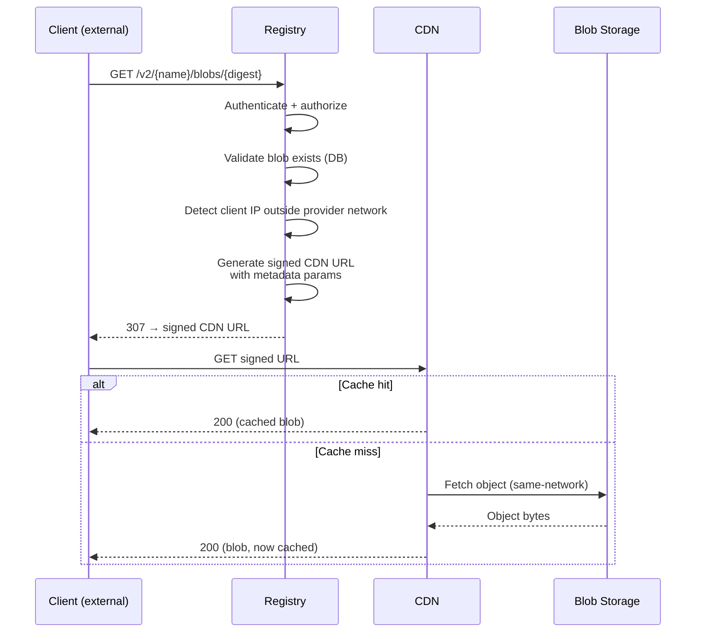
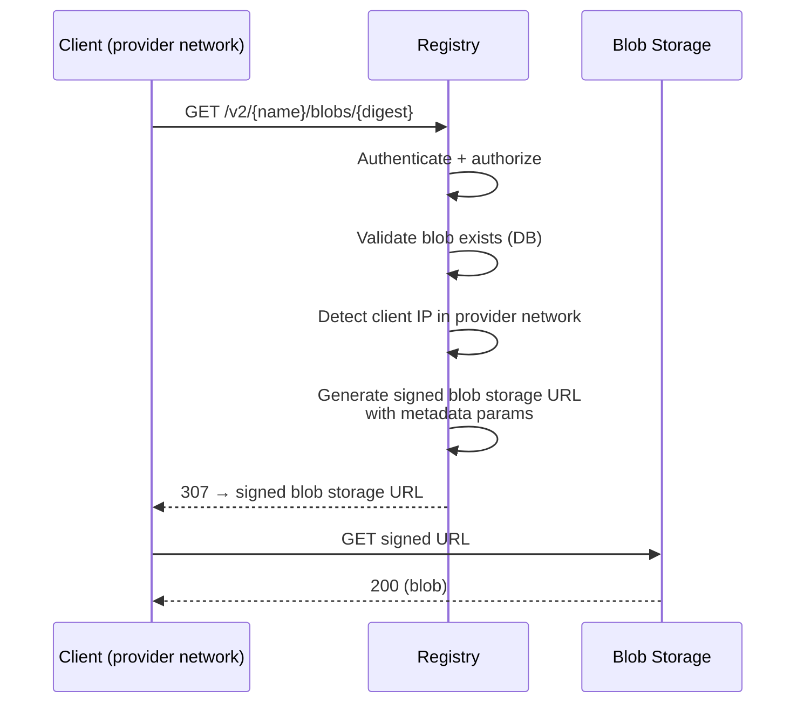
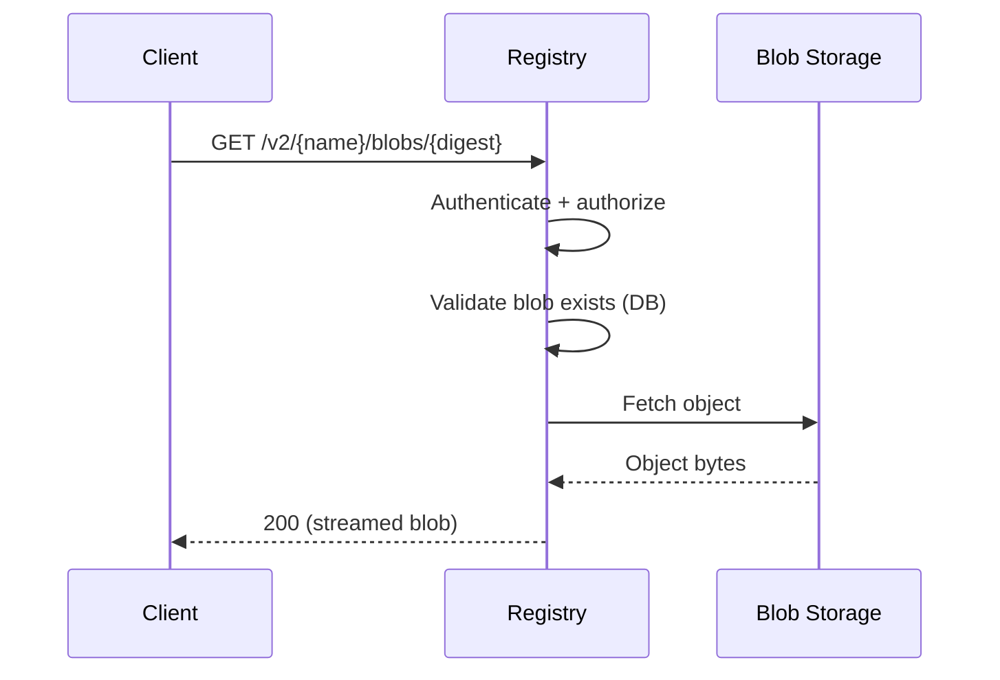

<!-- Design Documents often contain forward-looking statements -->
<!-- vale gitlab.FutureTense = NO -->

## コンテキスト

クライアントがアーティファクトをダウンロードする際、アプリケーションはコンテンツを配信するためにストレージバックエンドとやり取りする必要があります。デプロイとクライアントのネットワーク条件に応じて、アプリケーションは事前署名済み URL でクライアントをストレージバックエンドにリダイレクトするか、コンテンツを直接ストリーミングします（配信モードの決定については [ADR-005](005_artifact_delivery_mode.md) を参照）。それぞれのパターンは、CDN キャッシュ、URL 署名、コスト最適化、課金属性に対して異なる意味を持ちます。

Container Registry はこのアーキテクチャを GitLab.com 上で数年運用しており、月数十ペタバイトの送信トラフィック（[出典](https://docs.google.com/spreadsheets/d/1mvHXxzRNQ2gVUGHtjluV1FyfXeoGA2KwihHdxbUKI-c/edit)）を、85% を超える CDN キャッシュヒット率（[出典](https://gitlab.com/gitlab-com/content-sites/handbook/-/merge_requests/17524#note_3023542021)）で扱っています。Artifact Registry は同じアーキテクチャを採用します。

この ADR は、Artifact Registry のためにストレージバックエンドのインタラクションを独立した参照として形式化し、Container Registry の実装とは独立してデザインのシングルソースオブトゥルースとなるようにします。

## 決定

### サポートするペアリング

ストレージバックエンドと CDN は密結合です。CDN は同じプロバイダーのブロブストレージの前面に立ち、同一ネットワーク内のキャッシュフィル、ネイティブの署名付き URL 検証、運用上の整合性の恩恵を受けます。サポート対象のペアリングは以下を満たす必要があります。

- **ネイティブの署名付き URL 検証**: CDN はキャッシュから配信する前にエッジで署名を検証し、キャッシュヒット時にもプライベートブロブをプライベートに保ちます。
- **キャッシュキー互換性**: 署名およびメタデータのクエリパラメータがキャッシュをフラグメント化してはいけません（つまり、同じブロブに対する異なる署名付き URL は、単一のキャッシュエントリを共有します）。
- **十分な最大キャッシュ可能ファイルサイズ**: コンテナイメージレイヤーと大型アーティファクトは数十 GB に達する可能性があります。許容できる最小制限は 50 GB（サポートペアリングの中で最も低い: [CloudFront](https://docs.aws.amazon.com/AmazonCloudFront/latest/DeveloperGuide/cloudfront-limits.html#limits-web-distributions)）です。Google Cloud CDN は最大 [100 GiB](https://docs.cloud.google.com/cdn/docs/caching#maximum-size) までサポートします。

| デプロイ | ブロブストレージ | CDN | 署名付き URL アルゴリズム |
|---|---|---|---|
| GitLab.com (SaaS) | GCS | Google Cloud CDN | HMAC-SHA1 (CDN)、V4 HMAC-SHA256 (ブロブストレージ) |
| Dedicated (AWS) | S3 | CloudFront | RSA (CDN)、SigV4 HMAC-SHA256 (ブロブストレージ) |

セルフマネージドの顧客は、自身のインフラストラクチャに合致するペアリングを設定します。サポートされるペアリング間の切り替えは設定変更です。

### インタラクションパターン

アプリケーションとストレージバックエンドの間には 3 つのインタラクションパターンが存在します。使用されるパターンは、配信モード（[ADR-005](005_artifact_delivery_mode.md)）とクライアントのネットワーク発信元に依存します。

#### リダイレクト、外部クライアント → CDN

アプリケーションは認証、検証を行い、署名付き URL によりクライアントを CDN にリダイレクトします。CDN は署名を検証し、ヒット時はキャッシュから配信し、ミス時はブロブストレージから取得します。

#### リダイレクト、プロバイダーネットワーク内クライアント → ブロブストレージ直接

クライアントが同じクラウドプロバイダーのネットワーク内から発信される場合、アプリケーションは CDN をバイパスして直接ブロブストレージにリダイレクトできます。これはコスト最適化です: ブロブストレージからプロバイダーネットワーク内クライアントへの同一ネットワーク送信は、CDN 経由でルーティングするよりも安価です。この最適化が価値があるかどうかは、ペアリングに依存します。CDN と直接ブロブストレージのギャップが無視できる場合、ルーティングは利益なしに複雑さを追加するだけです。

#### プロキシ（CDN バイパス）

プロキシモード（[ADR-005](005_artifact_delivery_mode.md)）では、アプリケーションはブロブストレージから直接ブロブをストリーミングします。CDN、署名付き URL、および以下で説明するメタデータの伝播はすべてバイパスされます。アプリケーションは転送の全体を観測します。

### 署名付き URL の生成

アプリケーションはサーバー側で署名付き URL を生成します。ローカルのプライベートキーが利用可能な場合、署名は純粋にインプロセスで行われます。GCS でローカルキーがない場合（例: Workload Identity）、署名には外部の IAM 呼び出しが必要です。S3 の事前署名は、資格情報のソースに関わらず常にインプロセスです。各ペアリングは、CDN URL には CDN プロバイダーのネイティブ署名メカニズムを、直接 URL にはブロブストレージプロバイダーのネイティブ署名メカニズムを使用します。CDN はコンテンツを配信する前にエッジで署名を検証し、キャッシュヒット時にもプライベートブロブがプライベートに保たれることを保証します。

署名付き URL の有効期限は設定可能です。署名付き URL はキャッシュされ（例: Redis 内）、高リクエストレートでの署名オーバーヘッドを削減します。キャッシュキーは、ブロブのストレージパスとリクエストオプション（リクエストごとに固有である有効期限を除く）から導出されます。キャッシュエントリの TTL は、URL の残りの有効期間から安全マージンを引いた値です。

### ダウンロードメタデータの伝播

307 リダイレクトの後、アプリケーションはダウンロードを観測できません。クライアントが転送を完了したかどうか、何バイトが配信されたか、リクエストが失敗したかどうかは分かりません。

アプリケーションは、生成時に署名付き URL のクエリパラメータとしてメタデータを埋め込みます。

| パラメータ | 目的 |
|---|---|
| `gitlab-namespace-id` | モノリス側での課金属性境界（トップレベルグループ／ネームスペース） |
| `gitlab-ar-namespace-id` | AR ネームスペース（[ADR-001](001_organizations_as_anchor_point.md)） |
| `gitlab-auth-type` | 認証方式（PAT、OIDC など） |
| `gitlab-size-bytes` | ブロブサイズ |

これらのパラメータは、ストレージバックエンドのアクセスログ（CDN 配信リクエストの CDN ログ、直接リクエストのブロブストレージログ）に表示され、実際の転送結果がメタデータと一緒にキャプチャされます。

Container Registry は、現在、GCS + Google Cloud CDN の署名付き URL にこのメタデータを埋め込んでいます（[プロトタイプ](https://gitlab.com/gitlab-org/gitlab/-/work_items/438065)）。Artifact Registry は同じアプローチを採用し、AR 固有の属性のために `gitlab-ar-namespace-id` を追加します。メタデータの伝播は、送信トラフィックが計量される SaaS（GitLab.com）でのみ関連します。Dedicated およびセルフマネージドのデプロイメントは送信トラフィックを計量しないため、S3 + CloudFront ペアリングではこれを必要としません。これらのログを課金属性のために処理することは、本 ADR のスコープ外です。

ストレージバックエンドと CDN のペアリングを変更すると、伝播チェーン全体に影響します。すべての CDN がカスタムクエリパラメータをアクセスログに保持するわけではなく、リアルタイム抽出のためのエッジでのインターセプトをサポートするわけでもありません。新しいペアリングごとに、この機能の検証が必要です。

## 結果

### 良い影響

1. **実証済みのアーキテクチャ**: Container Registry をミラーしており、GitLab.com で大規模に実戦テスト済みです。
1. **すべてのペアリング要件を満たす**: サポートされる両方のペアリングが、上記で定義されたネイティブの署名付き URL 検証、キャッシュキー互換性、最大ファイルサイズの要件を満たしています。
1. **リダイレクト境界を超えた課金属性**: URL 内メタデータが、SaaS のリダイレクトモード（GCS + Google Cloud CDN）に固有の可視性ギャップを埋めます。
1. **設定駆動のペアリング**: サポートされるペアリング間の切り替えにはアプリケーションの変更が必要ありません。

### 悪い影響

1. **結合したペアリング**: CDN はブロブストレージプロバイダーに結びつけられています。実際にはこれが制限となる可能性は低く、デプロイメントは通常すべて GCP またはすべて AWS であるためです。必要であれば、クロスプロバイダーの CDN は依然として可能です（[Alternative 1](#alternative-1-cross-provider-cdn-for-example-cloudflare) を参照）。
1. **大規模での CDN 配信コスト**: プロバイダーネイティブの CDN は GiB あたりの配信に対して階層的に課金します。トラフィック量が多い場合、これが大きなコスト項目となる可能性があります。参考として [コスト分析](https://docs.google.com/spreadsheets/d/1mvHXxzRNQ2gVUGHtjluV1FyfXeoGA2KwihHdxbUKI-c/edit) が利用可能です。

## 代替案

### 代替案 1: クロスプロバイダー CDN (例: Cloudflare) {#alternative-1-cross-provider-cdn-for-example-cloudflare}

すべてのブロブストレージプロバイダーにわたる単一の CDN を導入することで、設定の分岐を減らします。Container Registry スケールでの [コスト分析](https://docs.google.com/spreadsheets/d/1mvHXxzRNQ2gVUGHtjluV1FyfXeoGA2KwihHdxbUKI-c/edit) は、Cloudflare の計量されない配信により、大幅な節約の可能性を示しました。

[!19690](https://gitlab.com/gitlab-com/content-sites/handbook/-/merge_requests/19690) で評価されました（クローズ済み）。延期された理由は、Cloudflare が署名付き URL 検証のためのカスタムインフラストラクチャ（WAF ルールまたは Worker）、手動のキャッシュキーストリッピング、検証されていないメタデータ抽出メカニズムを必要とするためです。クロスネットワークのキャッシュフィルコストは、同一ネットワークフィルよりも実質的に高くなります。AR はゼロトラフィックから開始するため、MVP では節約は実質的ではありません。

この代替案は閉ざされたわけではありません。クロスプロバイダー CDN は、将来的に新しいペアリングとして追加できます。

### 代替案 2: CDN なし

CDN レイヤーなしで直接ブロブストレージにダウンロードをリダイレクトします。これは却下されました。理由は、些細でないトラフィック量では CDN がブロブストレージの送信トラフィックを削減し、エッジキャッシングを通じてダウンロードレイテンシを改善し、可用性を向上させるためです。

## 参考資料

- [ADR-005: Artifact Delivery Mode](005_artifact_delivery_mode.md)
- [ADR-008: Content-Addressable Storage](008_content_addressable_storage.md)
- [Container Registry Cloud CDN middleware](https://gitlab.com/gitlab-org/container-registry/-/tree/master/registry/storage/driver/middleware/googlecdn)（参照実装）
- [Container Registry CloudFront middleware](https://gitlab.com/gitlab-org/container-registry/-/tree/master/registry/storage/driver/middleware/cloudfront)（参照実装）
- [Container Registry URL cache middleware](https://gitlab.com/gitlab-org/container-registry/-/tree/master/registry/storage/driver/middleware/urlcache)（参照実装）
- [送信トラフィック可視化プロトタイプ](https://gitlab.com/gitlab-org/gitlab/-/work_items/438065)
- [Cloudflare CDN コスト分析](https://docs.google.com/spreadsheets/d/1mvHXxzRNQ2gVUGHtjluV1FyfXeoGA2KwihHdxbUKI-c/edit)
- [Cloudflare CDN 提案（クローズ済み）](https://gitlab.com/gitlab-com/content-sites/handbook/-/merge_requests/19690)
