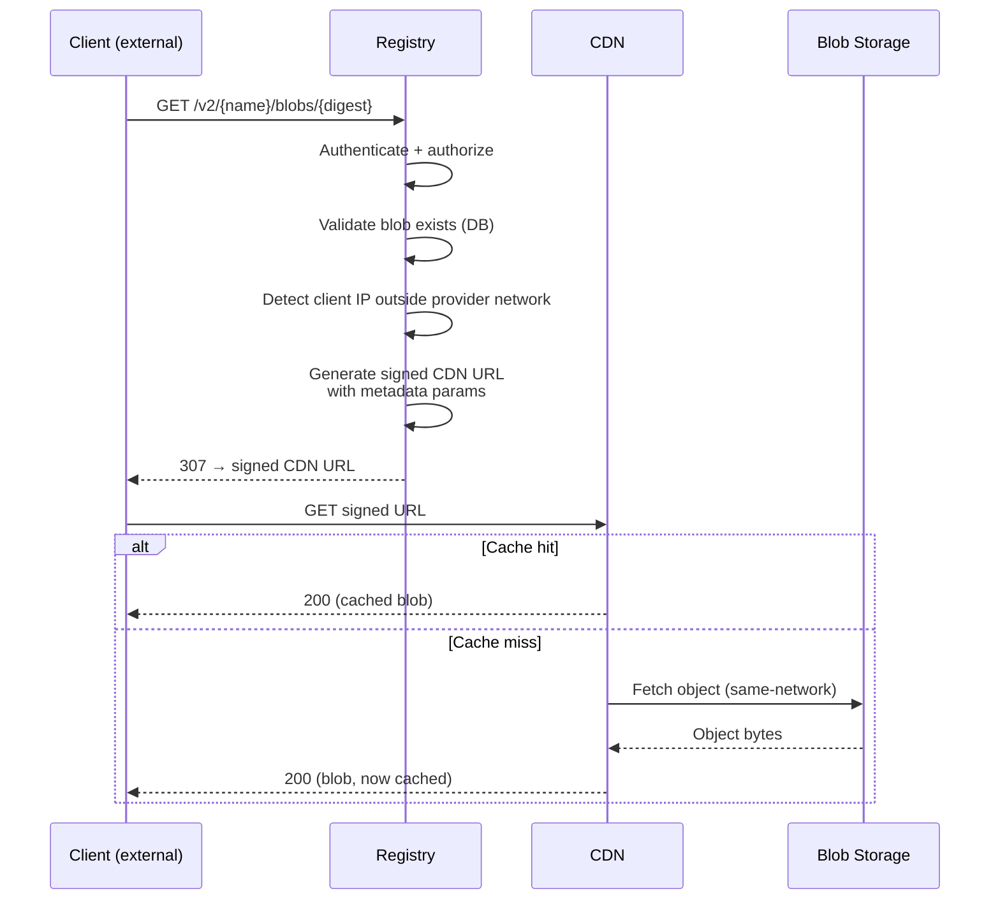
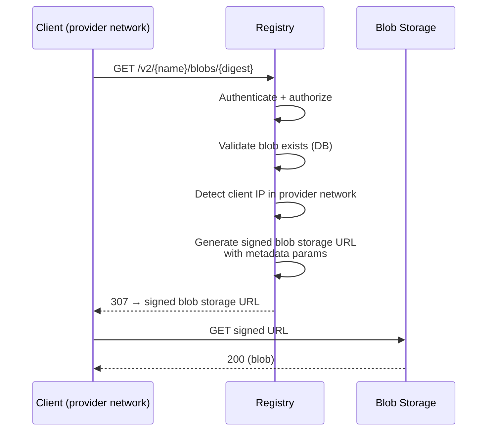
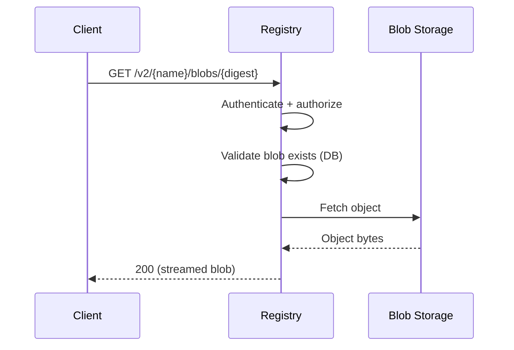

<!-- Design Documents often contain forward-looking statements -->
<!-- vale gitlab.FutureTense = NO -->

## 背景

クライアントがアーティファクトをダウンロードする際、アプリケーションはコンテンツを配信するためにストレージバックエンドと相互作用する必要があります。デプロイメントとクライアントのネットワーク状況に応じて、アプリケーションはクライアントを事前署名付き URL を通じてストレージバックエンドにリダイレクトするか、コンテンツを直接ストリーミングします（配信モードの判断については [ADR-005](005_artifact_delivery_mode.md) を参照）。各パターンは、CDN キャッシング、URL 署名、コスト最適化、課金属性付けにそれぞれ異なる影響を持ちます。

Container Registry は、85% を超える CDN キャッシュヒット率（[出典](https://gitlab.com/gitlab-com/content-sites/handbook/-/merge_requests/17524#note_3023542021)）で月間数十ペタバイトの egress（[出典](https://docs.google.com/spreadsheets/d/1mvHXxzRNQ2gVUGHtjluV1FyfXeoGA2KwihHdxbUKI-c/edit)）を処理しながら、このアーキテクチャを GitLab.com で何年も運用してきました。Artifact Registry は同じアーキテクチャを採用します。

この ADR は、ストレージバックエンドとの相互作用を Artifact Registry 用のスタンドアロンのリファレンスとして形式化し、Container Registry の実装から独立した設計の単一の情報源を持つようにします。

## 決定

### サポートされるペアリング

ストレージバックエンドと CDN は密結合です。CDN は同じプロバイダーの blob ストレージをフロントすることで、同一ネットワーク内のキャッシュフィル、ネイティブな署名付き URL 検証、運用上の整合性の恩恵を受けます。サポートされるペアリングは以下を満たす必要があります。

- **Native signed URL validation**: CDN がエッジで署名を検証してからキャッシュから配信し、キャッシュヒット時にもプライベート blob をプライベートに保つ。
- **Cache key compatibility**: 署名およびメタデータのクエリパラメータがキャッシュを断片化しないこと（すなわち、同じ blob に対する異なる署名付き URL が単一のキャッシュエントリを共有する）。
- **Sufficient max cacheable file size**: コンテナイメージのレイヤーや大規模なアーティファクトは数十ギガバイトに達することがあります。最小許容上限は 50 GB（サポートされるペアリングのうち最低の [CloudFront](https://docs.aws.amazon.com/AmazonCloudFront/latest/DeveloperGuide/cloudfront-limits.html#limits-web-distributions)）です。Google Cloud CDN は最大 [100 GiB](https://docs.cloud.google.com/cdn/docs/caching#maximum-size) までサポートします。

| Deployment | Blob storage | CDN | Signed URL algorithm |
|---|---|---|---|
| GitLab.com (SaaS) | GCS | Google Cloud CDN | HMAC-SHA1 (CDN), V4 HMAC-SHA256 (blob storage) |
| Dedicated (AWS) | S3 | CloudFront | RSA (CDN), SigV4 HMAC-SHA256 (blob storage) |

自己管理型の顧客は、各自のインフラストラクチャに一致するペアリングを構成します。サポートされるペアリング間の切り替えは設定変更です。

### 相互作用パターン

アプリケーションとストレージバックエンドの間には 3 つの相互作用パターンが存在します。使用されるパターンは、配信モード（[ADR-005](005_artifact_delivery_mode.md)）とクライアントのネットワークオリジンに依存します。

#### リダイレクト: 外部クライアント → CDN

アプリケーションは認証、検証を行い、署名付き URL を通じてクライアントを CDN にリダイレクトします。CDN は署名を検証し、ヒット時はキャッシュから配信し、ミス時は blob ストレージから取得します。

#### リダイレクト: プロバイダーネットワーク内クライアント → blob ストレージへ直接

クライアントが同じクラウドプロバイダーのネットワーク内から発信されている場合、アプリケーションは CDN をバイパスして blob ストレージへ直接リダイレクトできます。これはコスト最適化です：blob ストレージからプロバイダーネットワーク内クライアントへの同一ネットワーク egress は、CDN 経由でルーティングするよりも安価です。この最適化が価値あるかはペアリングに依存します。CDN と blob ストレージ直接配信の差が無視できる場合、ルーティングは利益なしに複雑さを増やすだけです。

#### プロキシ (CDN バイパス)

プロキシモード（[ADR-005](005_artifact_delivery_mode.md)）では、アプリケーションは blob ストレージから直接 blob をストリーミングします。CDN、署名付き URL、下記のメタデータ伝播はすべてバイパスされます。アプリケーションが転送全体を観測します。

### 署名付き URL の生成

アプリケーションは署名付き URL をサーバーサイドで生成します。ローカルの秘密鍵が利用可能な場合、署名はプロセス内で完結します。ローカル鍵を持たない GCS（たとえば Workload Identity）の場合、署名には外部の IAM 呼び出しが必要です。S3 の事前署名は、クレデンシャルソースにかかわらず常にプロセス内で行われます。各ペアリングは、CDN URL には CDN プロバイダーのネイティブ署名メカニズムを、直接 URL には blob ストレージプロバイダーのネイティブ署名メカニズムを使用します。CDN はコンテンツを配信する前にエッジで署名を検証し、キャッシュヒット時にもプライベート blob がプライベートのまま保たれることを保証します。

署名付き URL の有効期限は設定可能です。署名付き URL は（たとえば Redis で）キャッシュされ、高リクエストレートでの署名オーバーヘッドを削減します。キャッシュキーは blob のストレージパスとリクエストオプションから派生し、有効期限（リクエストごとに一意）は除外されます。キャッシュエントリの TTL は URL の残りの有効性からセーフティマージンを差し引いた値です。

### ダウンロードメタデータの伝播

307 リダイレクト後、アプリケーションはダウンロードを観測できません。クライアントが転送を完了したか、何バイトが配信されたか、リクエストが失敗したかを知ることはできません。

アプリケーションは生成時に、署名付き URL のクエリパラメータとしてメタデータを埋め込みます。

| Parameter | Purpose |
|---|---|
| `gitlab-namespace-id` | モノリス側の課金属性付け境界（トップレベルのグループ / namespace） |
| `gitlab-ar-namespace-id` | AR namespace（[ADR-001](001_organizations_as_anchor_point.md)） |
| `gitlab-auth-type` | 認証方式（PAT、OIDC など） |
| `gitlab-size-bytes` | Blob サイズ |

これらのパラメータはストレージバックエンドのアクセスログ（CDN 配信リクエストには CDN ログ、直接リクエストには blob ストレージログ）に現れ、実際の転送結果をメタデータとともに捕捉します。

Container Registry は今日、GCS + Google Cloud CDN の署名付き URL にこのメタデータを埋め込んでいます（[プロトタイプ](https://gitlab.com/gitlab-org/gitlab/-/work_items/438065)）。Artifact Registry は同じアプローチを採用し、AR 固有の属性付けのために `gitlab-ar-namespace-id` を追加します。メタデータ伝播は egress が課金される SaaS（GitLab.com）でのみ関連します。Dedicated および自己管理型のデプロイメントは egress を課金しないため、S3 + CloudFront のペアリングではこれを必要としません。課金属性付けのためのこれらのログの処理は、本 ADR の範囲外です。

ストレージバックエンドと CDN のペアリングを変更すると、伝播チェイン全体が影響を受けます。すべての CDN がアクセスログにカスタムクエリパラメータを保持したり、リアルタイム抽出のためのエッジインターセプトをサポートしているわけではありません。新しいペアリングごとにこの能力の検証が必要です。

## 結果

### プラス面

1. **Proven architecture**: Container Registry をミラーしており、GitLab.com でスケール環境において実戦投入済みです。
1. **All pairing requirements satisfied**: サポートされる両方のペアリングが、上記で定義したネイティブな署名付き URL 検証、キャッシュキー互換性、最大ファイルサイズの要件を満たします。
1. **Billing attribution across the redirect boundary**: URL 内メタデータが、SaaS（GCS + Google Cloud CDN）のリダイレクトモードに内在する可視性ギャップを橋渡しします。
1. **Configuration-driven pairings**: サポートされるペアリング間の切り替えにアプリケーションの変更は不要です。

### マイナス面

1. **Coupled pairing**: CDN は blob ストレージプロバイダーに紐づけられます。実際には、デプロイメントは通常 all-GCP または all-AWS のため、これが制限になることはほぼありません。必要であればクロスプロバイダー CDN も可能です（[代替案 1](#alternative-1-cross-provider-cdn-for-example-cloudflare) 参照）。
1. **CDN delivery cost at scale**: プロバイダーネイティブの CDN は、GiB あたりの配信料金を（階層的に）課金します。トラフィック量が大きくなると、これは大きなコスト項目になり得ます。参考として [コスト分析](https://docs.google.com/spreadsheets/d/1mvHXxzRNQ2gVUGHtjluV1FyfXeoGA2KwihHdxbUKI-c/edit) が利用可能です。

## 代替案

### 代替案 1: クロスプロバイダー CDN (例: Cloudflare) {#alternative-1-cross-provider-cdn-for-example-cloudflare}

すべての blob ストレージプロバイダーに対し単一の CDN を用い、構成の発散を削減します。Container Registry スケールでの [コスト分析](https://docs.google.com/spreadsheets/d/1mvHXxzRNQ2gVUGHtjluV1FyfXeoGA2KwihHdxbUKI-c/edit) では、Cloudflare の従量課金されない配信により、潜在的に大きなコスト削減が示されました。

[!19690](https://gitlab.com/gitlab-com/content-sites/handbook/-/merge_requests/19690)（クローズ済み）で評価されました。Cloudflare は署名付き URL 検証用のカスタムインフラ（WAF ルールまたは Worker）、手動でのキャッシュキーストリッピング、未検証のメタデータ抽出メカニズムを必要とするため、見送られました。クロスネットワークのキャッシュフィルコストは、同一ネットワークのフィルよりも大幅に高くなります。AR はゼロトラフィックから始まるため、MVP の段階で節約は大きくありません。

この代替案は閉ざされたわけではありません。将来、新しいペアリングとしてクロスプロバイダー CDN を追加できます。

### 代替案 2: CDN なし

CDN レイヤーなしで、ダウンロードを直接 blob ストレージにリダイレクトする方法。非自明なトラフィック量では、CDN が blob ストレージの egress を削減し、エッジキャッシングを通じてダウンロード遅延を改善し、可用性を高めるため、却下されました。

## 参考文献

- [ADR-005: Artifact Delivery Mode](005_artifact_delivery_mode.md)
- [ADR-008: Content-Addressable Storage](008_content_addressable_storage.md)
- [Container Registry Cloud CDN middleware](https://gitlab.com/gitlab-org/container-registry/-/tree/master/registry/storage/driver/middleware/googlecdn) (reference implementation)
- [Container Registry CloudFront middleware](https://gitlab.com/gitlab-org/container-registry/-/tree/master/registry/storage/driver/middleware/cloudfront) (reference implementation)
- [Container Registry URL cache middleware](https://gitlab.com/gitlab-org/container-registry/-/tree/master/registry/storage/driver/middleware/urlcache) (reference implementation)
- [Egress visibility prototype](https://gitlab.com/gitlab-org/gitlab/-/work_items/438065)
- [Cloudflare CDN cost analysis](https://docs.google.com/spreadsheets/d/1mvHXxzRNQ2gVUGHtjluV1FyfXeoGA2KwihHdxbUKI-c/edit)
- [Cloudflare CDN proposal (closed)](https://gitlab.com/gitlab-com/content-sites/handbook/-/merge_requests/19690)
