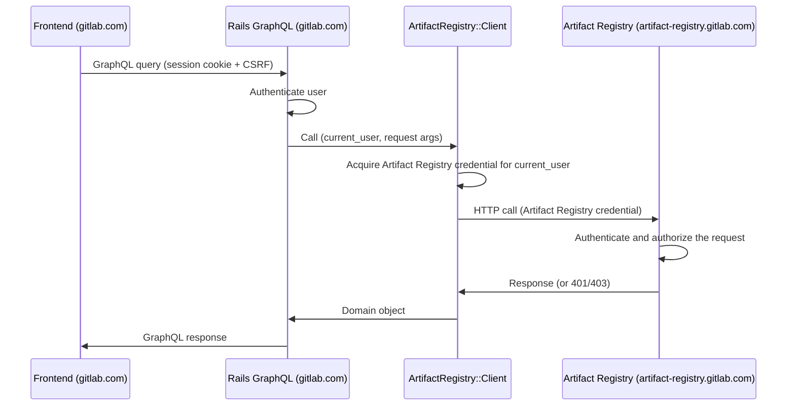

<!-- Design Documents often contain forward-looking statements -->
<!-- vale gitlab.FutureTense = NO -->

## ステータス {#status}

**Proposed.**

## コンテキスト {#context}

Artifact Registry は GitLab モノリスとは別のドメインで動作します（例: モノリスが `gitlab.com` または `gitlab.acme.com` にあるのに対し、`artifact-registry.gitlab.com`）。

この ADR は、ブラウザフロントエンド、すなわちネームスペースをリスト表示し、リポジトリを閲覧し、アーティファクトメタデータを表示し、管理アクションを公開する Vue UI を扱います。

[ADR-009](009_api_design.md) は、Artifact Registry が管理 API を公開することを規定しています。[ADR-022](022_namespace_decoupling.md) は、レジストリが Rails の識別子とは独立してネームスペースを解決する方法を定義しています。Rails と Artifact Registry の間の認証メカニズムは [auth 合意](../agreements/auth.md) に従います。この ADR はそれらのコントラクトを利用します。

Artifact Registry は今日では集中型であり、self-managed デプロイが計画されています。Artifact Registry は Rails モノリスよりも速いペースでリリースされます。

## 決定 {#decision}

**Rails GraphQL リゾルバーパターンを採用し、Rails モノリス内の Ruby クライアントが Artifact Registry の REST API と直接通信します。**

Rails リゾルバーは、Container Registry の `lib/container_registry/client.rb` と同じ方法で、Artifact Registry の REST エンドポイントと 1 対 1 でマッピングする Ruby メソッドを通じてレジストリと通信します。

### 認証とリクエストフロー {#authentication-and-request-flow}

ブラウザは GraphQL のクエリとミューテーションを `/api/graphql` に送信し、セッション cookie と CSRF トークンで認証されます。ブラウザは同一オリジンにとどまります。Artifact Registry の認証情報は Ruby クライアントによってサーバー側で取得・保持され、ブラウザに到達することはありません。

Ruby クライアントは認証を自身で処理します。現在の Rails ユーザーを与えられると、クライアントはトークン交換を実行し、結果として得られた認証情報をリクエストに付与します。Artifact Registry 自身の認証および認可のミドルウェアがリクエストを検証します。

### クロスサービスのデータ join {#cross-service-data-joining}

Artifact Registry は GitLab の識別子を保存し、それらが指し示すデータは保存しません。ユーザーが何かを作成、更新、または公開すると、Artifact Registry はユーザーの ID を記録します。関連するプロジェクトやコミットも参照として保存されます。実際の名前、アバター、プロフィールリンク、プロジェクトメタデータ、コミットの詳細はすべて Rails データベースに存在します。ほとんどのユーザー向け Artifact Registry ビューはそれらの少なくとも 1 つを必要とするため、Artifact Registry の識別子から Rails エンティティへの join は、すべてのユーザー向け読み取りで実行されます。

Rails が join 自体を行います。各種類の参照について、リゾルバーは `BatchLoader::GraphQL` を使用して ID でレコードを取得し、既存の `Types::UserType`、`Types::ProjectType`、`Types::CommitType` を再利用します。このパターンはモノリスの他の場所でも使用されています。ライブの例については `app/graphql/types/container_registry/container_repository_type.rb` を参照してください。ページ上にいくつのレコードがあっても、ビューには 1 回の Artifact Registry 呼び出しと、参照される型ごとに 1 回の Rails クエリのコストがかかります。

これは Artifact Registry がどのように出荷されるか、その互換性ポリシーがどうであるか、どのようにデプロイされるかに関係なく成り立ちます。これは、ユーザー、プロジェクト、コミットのデータを Artifact Registry にコピーするのではなく識別子を保持するという Artifact Registry の選択に由来します。

### API コントラクト {#api-contract}

GraphQL は、Container Registry と一致して、ブラウザ駆動の読み取りとミューテーションのためのサーフェスです。各 Artifact Registry リソースには、対応する Rails GraphQL 型があります: Namespace、Repository、Artifact、Tag、Version。リゾルバーは、`namespacePath` や `repositoryPath` などの引数からターゲットリソースの識別子を導出します。リゾルバーは、Container Registry のリゾルバーと一致して、Artifact Registry の認可失敗を not-available エラーに、トランスポート失敗を service-unavailable エラーにマッピングします。

### Rails 側コンポーネント {#rails-side-components}

それぞれ Container Registry に類似物を持つ、3 つの Rails 側コンポーネントがあります。

| Component | Path | Container Registry analogue |
|---|---|---|
| HTTP client | `lib/artifact_registry/client.rb` | `lib/container_registry/client.rb` |
| GraphQL types and resolvers | `app/graphql/types/artifact_registry/`, `app/graphql/resolvers/artifact_registry/` | `app/graphql/types/container_registry/`, `app/graphql/resolvers/container_repositories_resolver.rb` |
| Vue entry | `app/assets/javascripts/packages_and_registries/artifact_registry/` | `app/assets/javascripts/packages_and_registries/container_registry/explorer/` |

Rails 側の認証情報の取得は [auth 合意](../agreements/auth.md) に従います。具体的なサービスと交換プロトコルは未確定です（[Open Questions](#open-questions) を参照）。

リゾルバーは、ロードされたリソース上のキャッシュされたヘルパーを通じてクライアントを取得します（`ContainerRepository#registry` と同じパターン）。親ごとにファンアウトする子フィールドは、[Cross-service data joining](#cross-service-data-joining) で説明されているのと同じバッチ化されたルックアップパターンを使用し、N 個の親の解決を子フィールドごとに 1 回の Artifact Registry 呼び出しに集約します。

## 結果 {#consequences}

### ポジティブ {#positive}

1. **既存のフロントエンドインフラを再利用する。** セッション cookie、CSRF、axios のデフォルト、Apollo クライアント、フィーチャーフラグ、およびすでに整備されているエラーハンドリングはすべてそのまま機能します。これは Container Registry と Orbit（GKG）の UI が使用するのと同じパターンです。
2. **クロスサービスの join がより安価になる。** Rails は既存の GraphQL 型でユーザー、プロジェクト、コミットのデータを取得し、単一のリクエスト内でルックアップをバッチ化します。そのため、フロントエンド側の join に必要となる余分なラウンドトリップやフロントエンドのマージコードを回避できます。Artifact Registry 側でのバッチ化は、Artifact Registry の REST API に依存する別の問題です（Negative #3 を参照）。
3. **サーバー側の認証。** Ruby クライアントは Rails のセッションアイデンティティからのトークン交換を処理します。

### ネガティブ {#negative}

1. **リゾルバーのサーフェスは Artifact Registry の API に応じて拡大する。** フロントエンドが利用するすべての Artifact Registry エンドポイントには、Rails GraphQL リゾルバーが必要です。
2. **ドメインモデルが二重に表現される。** Artifact Registry のドメインは自身のコントラクトで記述され、Rails GraphQL 型で再度記述されます。ドリフトが起こりうります。コントラクトテストによってこれを緩和できます。
3. **Artifact Registry の API 設計が制約される。** N+1 の緩和は、フロントエンドがレンダリングするすべてのコレクション境界で Artifact Registry が一括読み取りを公開することに依存します。
4. **追加のレイテンシ。** 各リクエストには 2 つのネットワークホップが必要です: フロントエンドから Rails、次に Rails から Artifact Registry。これは、GraphQL 呼び出しを REST API の代わりに gRPC エンドポイントに接続することで緩和できる可能性があります。これは、両方のサービスが同じプラットフォームに同居している場合（例えば .com <-> .com）に機能しえます。これには Artifact Registry が gRPC を公開することが必要であり、追加の作業が発生します。
5. **フロントエンドのリリースペースが Rails に紐付く。** フロントエンドは Rails モノリスとともに出荷されるため、Artifact Registry 向けの新機能は、ユーザーのインストールが対応する Rails リリースを取り込んだときにのみユーザーに届きます。Dedicated インストールは m-2 で動作するため、Dedicated ユーザーは GitLab.com で利用可能になってからおよそ 2 マイルストーン後に新しい Artifact Registry UI を目にします。

## 代替案 {#alternatives}

### 代替案 1: 薄いパススループロキシ {#alternative-1-thin-pass-through-proxy}

Rails は `/-/artifact_registry/proxy/graphql` を公開し、生の GraphQL ボディを Artifact Registry に転送し、Rails が署名した JWT を付与します。CustomersDot は `ee/app/controllers/customers_dot/proxy_controller.rb` でこの形を使用しています。

**Pros:**

- Rails のコードが少ない。リゾルバーごとの作業がない。
- Artifact Registry のスキーマが直接流れる。新しいフィールドが Rails の変更なしにフロントエンドに表示される。Artifact Registry の追加のみのコミットメントと、その速いリリースペースが、スキーマのドリフトをブラウザから遠ざける。

**Cons:**

- クロスサービスの join がフロントエンドに移る: Artifact Registry は、基礎となるユーザー、プロジェクト、コミットのデータではなく GitLab の識別子を保存する。
- ユーザー帰属のビューごとに 2 つの逐次ラウンドトリップが発生し、加えて多くの Vue コンポーネントにまたがって重複するマージユーティリティが発生する。
- フロントエンドが Artifact Registry のスキーマに直接依存する。Rails 側のエラーバッファがない。
- フロントエンドに 2 つ目の GraphQL エンドポイントを導入する。
- Artifact Registry が追加の API（GraphQL）を実装する必要がある。これは Artifact Registry 側で行う追加の作業である。

**Why rejected:**

- クロスサービスの join が、クリーンな実装パスのないフロントエンドの問題になる。すべてのユーザー帰属のビューには、余分な Rails ラウンドトリップと FE 側のマージユーティリティのコストがかかる。
- Vue コンポーネントにまたがるマージロジックの重複は、フロントエンドのサーフェス面積に対してスケールが悪い。

### 代替案 2: GraphQL スキーマスティッチング {#alternative-2-graphql-schema-stitching}

Rails は schema-stitching ゲートウェイを使用して、`GitlabSchema` と Artifact Registry の GraphQL スキーマを `/api/graphql` で統一されたスーパーグラフに合成します。stitching の gem は Rails 内部で実行され、Artifact Registry 型のリクエストは HTTP で Go サービスにルーティングされ、他のクエリは `GitlabSchema` にとどまります。`graphql-stitching` gem を使用した POC 実装が [gitlab-org/gitlab!227224](https://gitlab.com/gitlab-org/gitlab/-/merge_requests/227224) に存在します。

**Pros:**

- フロントエンド向けの GraphQL エンドポイントが 1 つ（選択したパターンと同じ）。
- Artifact Registry のスキーマが直接利用される。Rails は各 Artifact Registry フィールドにリゾルバーを必要とせず、ゲートウェイがスキーマをリロードすると新しいフィールドが Rails の MR なしにフロントエンドに届く。
- クロスサービスの join が宣言的に表現される: Artifact Registry の SDL がクロスサービス参照（例えば `Repository.createdBy: User`）を宣言し、Rails が `id` によって `User` を解決できると宣言し、stitching gem がクロスサービスの取得とバッチ化を自動的に計画する。

**Cons:**

- Artifact Registry が追加の API（GraphQL）を実装する必要がある。これは Artifact Registry 側で行う追加の作業である。
- `graphql-stitching` gem とスキーマ合成パイプラインをモノリスに追加する。
- Rails は、Artifact Registry の SDL をモノリスのリポジトリに同期する（スキーマ変更ごとにクロスリポジトリの調整）か、起動時に Artifact Registry をイントロスペクトする（Rails の起動とその公開 GraphQL サーフェスが Artifact Registry のデプロイペースに紐付く）かのいずれかを行う必要がある。
- Artifact Registry が参照する各 Rails エンティティ型には、Rails 側に境界リゾルバーが、Artifact Registry 側に `@key` 宣言が必要である。

**Why rejected:**

- リゾルバーパターンに対する明確な利点なしにゲートウェイインフラを追加する。
- Rails 側のスキーマ統合は、クロスリポジトリの SDL 同期か、Artifact Registry への起動時依存のいずれかを追加する。

### 代替案 3: ブラウザが保持する認証情報による直接的なクロスドメイン {#alternative-3-direct-cross-domain-with-a-browser-held-credential}

フロントエンドは Artifact Registry とクロスオリジンで通信し、自身の認証情報を Artifact Registry に運びます。モノリスに存在する 2 つのバリアントが検討されました: アイデンティティトークンの Bearer 認証情報（フロントエンドがアイデンティティトークンを取得し、メモリ内に保持し、`Authorization: Bearer` として Artifact Registry に直接送信する）と、暗号化されたセッション cookie（Rails が Artifact Registry のサブドメインにスコープされた暗号化 cookie を設定し、ブラウザがクロスオリジンリクエストで送信する。`app/controllers/concerns/kas_cookie.rb` の `KasCookie` に類似）です。

**Pros:**

- Artifact Registry がフロントエンドに直接対応する。リゾルバーごとの Rails 作業がない。

**Cons:**

- クロスサービスの join は依然としてフロントエンドに委ねられる（Alternative 1 と同じ形）。
- ブラウザが Artifact Registry へオリジンを越えるため、Artifact Registry はモノリスのオリジンに対して CORS を提供する必要がある。アイデンティティトークンのバリアントは `Authorization` を持つリクエストにプリフライトが必要である。cookie のバリアントは `Access-Control-Allow-Credentials: true`、明示的なオリジンの許可リスト（ワイルドカード不可）、および `SameSite=None; Secure` cookie が必要である。
- アイデンティティトークンのバリアント: 認証情報のライフサイクルが JavaScript 内に移る（取得、メモリ内ストレージ、有効期限の処理、401 時の更新、SPA ナビゲーション）。キャッシュミス時の二重交換フロー（FE → Artifact Registry → Rails → Artifact Registry）は、単一の FE → Rails → Artifact Registry 呼び出しよりも遅い。
- cookie のバリアント: KAS は、1 回のハンドシェイクが接続のライフタイム全体で償却される長寿命の WebSocket のためにこのパターンを使用する。Artifact Registry の交換は、それぞれ cookie の再検証を必要とする多数の短命な REST 呼び出しである。Rails の cookie 暗号化とキーローテーションを Go で再現することは、[auth 合意](../agreements/auth.md) における JWT ベースの認証の方向性と衝突する。Artifact Registry の認可モデルは、ロール強制を伴うスコープ付き JWT を中心に構築されている。cookie 認証は Artifact Registry 内部に並行する認可パスを必要とする。cookie ドメインは `gitlab.com` と `artifact-registry.gitlab.com` の両方を含む親にスコープされる必要があり、潜在的には self-managed インスタンスでも機能する必要がある。

**Why rejected:**

- クロスサービスの join が未解決のまま残る。
- 各バリアントは、ブラウザ側の認証情報サーフェス（JS が保持するアイデンティティトークン、または親スコープの暗号化 cookie）と、Artifact Registry 内部の並行する認証パスを追加する。

### 代替案 4: `postMessage` による認証情報配信を伴う iframe 埋め込み {#alternative-4-iframe-embed-with-postmessage-credential-delivery}

Artifact Registry は、`app/assets/javascripts/observability/utils/auth_manager.js` に類似して、ロード時に `postMessage` で認証情報が渡される iframe として UI を提供します。

**Pros:**

- Artifact Registry サービスが自身の完全な UI を所有できる。
- Rails インスタンスのバージョンを Artifact Registry のバージョンから切り離す: UI を伴う新しい Artifact Registry バックエンド機能が、Rails リリースを待たずに、Artifact Registry が出荷されるとすぐに SaaS、Dedicated、Self-Managed の構成に届く。

**Cons:**

- iframe は Artifact Registry のオリジンで実行され、Rails への直接的なパスがない（CORS に加えてセッション共有がない）。クロスサービスの join は、ユーザー、プロジェクト、コミットのデータについて親に戻る `postMessage` リクエストを通じて発生するか、Artifact Registry に保存して Rails と同期し続ける必要がある。
- iframe 通信は、GitLab モノリスが in-shell ビューに期待するディープリンク、ブラウザシェルのナビゲーション、アクセシビリティパターンを壊す。

**Why rejected:**

- クロスサービスの join と CORS。`postMessage` パスは Alternative 3 と同じコストがかかる。ストレージと同期の代替案は、PII の重複、同期インフラ、GDPR 削除の複雑さを追加する。
- iframe 固有の UX 制限がすべての in-shell ビューに適用される。

## 未解決の問い {#open-questions}

1. self-managed デプロイの場合、Artifact Registry のエンドポイント URL はどのように Rails に提示されますか? 可能なメカニズムには、`gitlab.yml` の config キーや Admin UI の設定が含まれます。self-managed のオペレーター向けに、Rails と Artifact Registry の間の構成コントラクトを誰が所有しますか?
2. Rails と Artifact Registry の間のトークン交換は [auth 合意](../agreements/auth.md) のレベルでコミットされていますが、認証情報のフォーマット、クレームの形状、発行サービスはまだ規定されていません。Ruby クライアントの認証情報取得ステップはそれらの決定に依存しており、この ADR では意図的に抽象的なままにしています。
3. Artifact Registry のリストエンドポイントの要素ごとの形状とページネーションの形状（カーソルフォーマット、ページサイズの制限）は、ADR-009 でまだ規定されていません。この ADR の N+1 緩和は、リストエンドポイントが、要素ごとのフォローアップ呼び出しなしにリストビューをレンダリングするのに十分な要素ごとのデータを返すことに依存します。

## 今後の作業 {#future-work}

GitLab Adaptive Trust Environment が確定したら、Rails 側の認証情報取得はそれへ移行します。この ADR のフロントエンドパターンは変更なく引き継がれます。

将来の製品要件がブラウザ側での直接的な Artifact Registry アクセス（例えば、ブラウザからの署名付き URL でのアーティファクトアップロード）を確立する場合、CORS、認証情報のライフサイクル、および対象範囲の具体的なリソースを扱うフォローアップ ADR が必要になります。

## 参考資料 {#references}

- [ADR-009: API Design](009_api_design.md)
- [ADR-022: Namespace Decoupling](022_namespace_decoupling.md)
- [Auth agreement](../agreements/auth.md)
- Container Registry frontend: `app/assets/javascripts/packages_and_registries/container_registry/explorer/`
- Container Registry resolvers: `app/graphql/resolvers/container_repositories_resolver.rb`, `app/graphql/resolvers/container_repository_tags_resolver.rb`
- Container Registry auth service: `app/services/auth/container_registry_authentication_service.rb`
- Container Registry Ruby client: `lib/container_registry/client.rb`, `lib/container_registry/gitlab_api_client.rb`
- KAS cookie pattern: `app/controllers/concerns/kas_cookie.rb`
- CustomersDot proxy: `ee/app/controllers/customers_dot/proxy_controller.rb`, `ee/app/assets/javascripts/lib/customers_dot_graphql.js`
- GitLab Observability iframe and postMessage auth: `app/assets/javascripts/observability/utils/auth_manager.js`
- GraphQL schema stitching draft: [gitlab-org/gitlab!227224](https://gitlab.com/gitlab-org/gitlab/-/merge_requests/227224)
