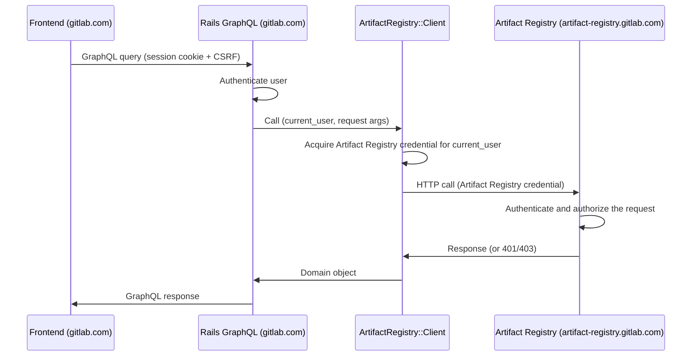

<!-- Design Documents often contain forward-looking statements -->
<!-- vale gitlab.FutureTense = NO -->

## ステータス {#status}

**提案中。**

## コンテキスト {#context}

Artifact Registry は GitLab モノリスとは別のドメインで動作します（たとえば、モノリスが `gitlab.com` または `gitlab.acme.com` にある一方で、Artifact Registry は `artifact-registry.gitlab.com` にあります）。

この ADR はブラウザフロントエンドを扱います。namespace を一覧表示し、リポジトリをブラウズし、アーティファクトメタデータを表示し、管理アクションを公開する Vue UI です。

[ADR-009](009_api_design.md) は、Artifact Registry が管理 API を公開することを規定しています。[ADR-022](022_namespace_decoupling.md) は、レジストリが Rails の識別子とは独立して namespace を解決する方法を定義しています。Rails と Artifact Registry の間の認証メカニズムは、[auth 合意](../agreements/auth.md) に従います。この ADR はこれらのコントラクトを利用します。

Artifact Registry は現在一元化されており、Self-Managed のデプロイが計画されています。Artifact Registry は Rails モノリスよりも速いペースでリリースされます。

## 決定 {#decision}

**Rails GraphQL リゾルバーパターンを採用し、Rails モノリス内の Ruby クライアントが Artifact Registry の REST API と直接やり取りします。**

Container Registry の `lib/container_registry/client.rb` と同じ方法で、Rails リゾルバーは Artifact Registry の REST エンドポイントと 1 対 1 で対応する Ruby メソッドを通じてレジストリとやり取りします。

### 認証とリクエストフロー {#authentication-and-request-flow}

ブラウザは GraphQL のクエリとミューテーションを `/api/graphql` に送信し、セッションクッキーと CSRF トークンによって認証されます。ブラウザは同一オリジンのままです。Artifact Registry の認証情報は Ruby クライアントによってサーバー側で取得・保持され、ブラウザに届くことはありません。

Ruby クライアントは認証を自身で処理します。現在の Rails ユーザーを前提として、クライアントはトークン交換を実行し、得られた認証情報をリクエストに付与します。Artifact Registry 自身の認証および認可ミドルウェアがリクエストを検証します。

### クロスサービスのデータジョイン {#cross-service-data-joining}

Artifact Registry は、参照先のデータではなく GitLab の識別子を保存します。ユーザーが何かを作成、更新、または公開すると、Artifact Registry はそのユーザーの ID を記録します。関連するプロジェクトやコミットも参照として保存されます。実際の名前、アバター、プロフィールリンク、プロジェクトメタデータ、コミットの詳細はすべて Rails データベースに存在します。ほとんどのユーザー向け Artifact Registry ビューはこれらの少なくとも 1 つを必要とするため、Artifact Registry の識別子から Rails エンティティへのジョインは、ユーザー向けの読み取りごとに実行されます。

ジョイン自体は Rails が行います。参照の種類ごとに、リゾルバーが `BatchLoader::GraphQL` を使用して ID でレコードを取得し、既存の `Types::UserType`、`Types::ProjectType`、`Types::CommitType` を再利用します。このパターンはモノリス内の他の箇所でも使用されています。実際の例については `app/graphql/types/container_registry/container_repository_type.rb` を参照してください。ページ上にいくつのレコードがあっても、ビューのコストは 1 回の Artifact Registry 呼び出しに加えて、参照される型ごとに 1 回の Rails クエリです。

これは、Artifact Registry がどのように提供されるか、その互換性ポリシーが何であるか、どのようにデプロイされるかにかかわらず成り立ちます。これは、ユーザー、プロジェクト、コミットのデータを Artifact Registry にコピーするのではなく、識別子を保持するという Artifact Registry の選択に由来します。

### API コントラクト {#api-contract}

GraphQL は、Container Registry と同様に、ブラウザ駆動の読み取りとミューテーションのためのサーフェスです。各 Artifact Registry リソースには対応する Rails GraphQL 型があります。Namespace、Repository、Artifact、Tag、Version です。リゾルバーは、`namespacePath` や `repositoryPath` などの引数からターゲットリソースの識別子を導出します。リゾルバーは、Container Registry のリゾルバーと同様に、Artifact Registry の認可失敗を not-available エラーに、トランスポート失敗を service-unavailable エラーにマッピングします。

### Rails 側のコンポーネント {#rails-side-components}

それぞれに Container Registry の対応物を持つ 3 つの Rails 側コンポーネントです。

| Component | Path | Container Registry analogue |
|---|---|---|
| HTTP client | `lib/artifact_registry/client.rb` | `lib/container_registry/client.rb` |
| GraphQL types and resolvers | `app/graphql/types/artifact_registry/`, `app/graphql/resolvers/artifact_registry/` | `app/graphql/types/container_registry/`, `app/graphql/resolvers/container_repositories_resolver.rb` |
| Vue entry | `app/assets/javascripts/packages_and_registries/artifact_registry/` | `app/assets/javascripts/packages_and_registries/container_registry/explorer/` |

Rails 側の認証情報の取得は [auth 合意](../agreements/auth.md) に従います。具体的なサービスと交換プロトコルは未確定です（[Open Questions](#open-questions) を参照）。

リゾルバーは、ロードされたリソース上のキャッシュされたヘルパーを通じてクライアントを取得します（`ContainerRepository#registry` と同じパターン）。親ごとにファンアウトする子フィールドは、[Cross-service data joining](#cross-service-data-joining) で説明されているのと同じバッチ化されたルックアップパターンを使用し、N 個の親解決を子フィールドごとに 1 回の Artifact Registry 呼び出しにまとめます。

## 結果 {#consequences}

### ポジティブ {#positive}

1. **既存のフロントエンドインフラを再利用する。** セッションクッキー、CSRF、axios のデフォルト、Apollo クライアント、フィーチャーフラグ、すでに用意されているエラーハンドリングがすべてそのまま機能します。これは Container Registry や Orbit（GKG）の UI が使用しているのと同じパターンです。
2. **クロスサービスのジョインがより安価になる。** Rails は既存の GraphQL 型を使用してユーザー、プロジェクト、コミットのデータを取得し、単一のリクエスト内でルックアップをバッチ化します。これにより、フロントエンド側のジョインで必要となる追加のラウンドトリップとマージコードを回避できます。Artifact Registry 側でのバッチ化は、Artifact Registry の REST API に依存する別の問題です（Negative #3 を参照）。
3. **サーバー側の認証。** Ruby クライアントが、Rails のセッションアイデンティティからのトークン交換を処理します。

### ネガティブ {#negative}

1. **リゾルバーのサーフェスが Artifact Registry の API に応じてスケールする。** フロントエンドが利用する Artifact Registry のエンドポイントごとに、Rails の GraphQL リゾルバーが必要です。
2. **ドメインモデルが二重に表現される。** Artifact Registry のドメインは独自のコントラクトで記述され、さらに Rails の GraphQL 型でも記述されます。ドリフトが起こりえます。コントラクトテストでこれを緩和できます。
3. **Artifact Registry の API 設計が制約される。** N+1 の緩和は、フロントエンドがレンダリングするすべてのコレクション境界で Artifact Registry がバルク読み取りを公開することに依存します。
4. **追加のレイテンシー。** 各リクエストには 2 つのネットワークホップが必要です。フロントエンドから Rails へ、次に Rails から Artifact Registry へです。これは、GraphQL の呼び出しを REST API ではなく gRPC エンドポイントに接続することで緩和できます。これは両サービスが同じプラットフォームに同居している場合（たとえば .com <-> .com）に機能しえます。これには Artifact Registry が gRPC を公開することが必要で、追加の作業を伴います。
5. **フロントエンドのリリースペースが Rails に結びつく。** フロントエンドは Rails モノリスとともに提供されるため、新しい Artifact Registry 向けの機能は、各インストールが対応する Rails リリースを取り込んだときにのみユーザーに届きます。Dedicated のインストールは m-2 で動作するため、Dedicated のユーザーは GitLab.com で利用可能になってからおよそ 2 マイルストーン後に新しい Artifact Registry の UI を目にします。

## 代替案 {#alternatives}

### 代替案 1: 薄いパススループロキシ {#alternative-1-thin-pass-through-proxy}

Rails が `/-/artifact_registry/proxy/graphql` を公開し、生の GraphQL ボディを Artifact Registry に転送し、Rails 署名の JWT を付与します。CustomersDot は `ee/app/controllers/customers_dot/proxy_controller.rb` でこの形を使用しています。

**メリット:**

- Rails のコードが少なく、リゾルバーごとの作業がありません。
- Artifact Registry のスキーマが直接流れます。新しいフィールドは Rails の変更なしにフロントエンドに表示されます。Artifact Registry の追加のみのコミットメントと、その速いリリースペースにより、スキーマのドリフトがブラウザに及ばないようにします。

**デメリット:**

- クロスサービスのジョインがフロントエンドに移ります。Artifact Registry は、基となるユーザー、プロジェクト、コミットのデータではなく GitLab の識別子を保存します。
- ユーザーに帰属するビューごとに 2 つの逐次的なラウンドトリップが発生し、加えて多くの Vue コンポーネント間でマージユーティリティが重複します。
- フロントエンドが Artifact Registry のスキーマに直接依存し、Rails 側のエラーバッファがありません。
- フロントエンドに 2 つ目の GraphQL エンドポイントを導入します。
- Artifact Registry が追加の API（GraphQL）を実装する必要があります。これは Artifact Registry 側で行う追加の作業です。

**却下理由:**

- クロスサービスのジョインが、クリーンな実装パスのないフロントエンドの問題になります。ユーザーに帰属するすべてのビューに、追加の Rails ラウンドトリップと FE 側のマージユーティリティのコストがかかります。
- Vue コンポーネント間でのマージロジックの重複は、フロントエンドのサーフェス面積に対してスケールが悪くなります。

### 代替案 2: GraphQL スキーマスティッチング {#alternative-2-graphql-schema-stitching}

Rails はスキーマスティッチングゲートウェイを使用して、`GitlabSchema` と Artifact Registry の GraphQL スキーマを `/api/graphql` で統一されたスーパーグラフに合成します。スティッチング gem は Rails 内部で動作し、Artifact Registry 型へのリクエストは HTTP 経由で Go サービスにルーティングされ、その他のクエリは `GitlabSchema` のままになります。`graphql-stitching` gem を使用した POC 実装が [gitlab-org/gitlab!227224](https://gitlab.com/gitlab-org/gitlab/-/merge_requests/227224) に存在します。

**メリット:**

- フロントエンドにとって 1 つの GraphQL エンドポイント（選択したパターンと同じ）です。
- Artifact Registry のスキーマが直接利用されます。Rails は Artifact Registry のフィールドごとにリゾルバーを必要とせず、ゲートウェイがスキーマを再読み込みすれば、新しいフィールドは Rails の MR なしにフロントエンドに届きます。
- クロスサービスのジョインが宣言的に表現されます。Artifact Registry の SDL がクロスサービス参照（たとえば `Repository.createdBy: User`）を宣言し、Rails は `id` で `User` を解決できると宣言し、スティッチング gem がクロスサービスのフェッチとバッチ化を自動的に計画します。

**デメリット:**

- Artifact Registry が追加の API（GraphQL）を実装する必要があります。これは Artifact Registry 側で行う追加の作業です。
- モノリスに `graphql-stitching` gem とスキーマ合成パイプラインを追加します。
- Rails は Artifact Registry の SDL をモノリスリポジトリに同期する（スキーマ変更のたびにクロスリポジトリの調整）か、起動時に Artifact Registry をイントロスペクトする（Rails の起動とその公開 GraphQL サーフェスが Artifact Registry のデプロイペースに結びつく）かのいずれかが必要です。
- Artifact Registry が参照する Rails のエンティティ型ごとに、Rails 側のバウンダリリゾルバーと Artifact Registry 側の `@key` 宣言が必要です。

**却下理由:**

- リゾルバーパターンに対する明確な優位性なしにゲートウェイインフラを追加します。
- Rails 側のスキーマ統合は、クロスリポジトリの SDL 同期か、Artifact Registry への起動時依存のいずれかを追加します。

### 代替案 3: ブラウザが保持する認証情報による直接クロスドメイン {#alternative-3-direct-cross-domain-with-a-browser-held-credential}

フロントエンドが Artifact Registry とクロスオリジンでやり取りし、自身の認証情報を Artifact Registry に運びます。モノリスに存在する 2 つのバリアントが検討されました。アイデンティティトークンのベアラー認証情報（フロントエンドがアイデンティティトークンを取得し、メモリに保持し、`Authorization: Bearer` として直接 Artifact Registry に送信する）と、暗号化されたセッションクッキー（Rails が `app/controllers/concerns/kas_cookie.rb` の `KasCookie` と同様に、Artifact Registry のサブドメインにスコープされた暗号化クッキーを設定し、ブラウザがクロスオリジンリクエストで送信する）です。

**メリット:**

- Artifact Registry がフロントエンドを直接サーブし、リゾルバーごとの Rails 作業がありません。

**デメリット:**

- クロスサービスのジョインは依然としてフロントエンドに落ちます（Alternative 1 と同じ形）。
- ブラウザがオリジンを越えて Artifact Registry にアクセスするため、Artifact Registry はモノリスのオリジンに対して CORS を提供する必要があります。アイデンティティトークンのバリアントは `Authorization` を伴うリクエストにプリフライトを必要とします。クッキーのバリアントは `Access-Control-Allow-Credentials: true`、明示的なオリジンの許可リスト（ワイルドカード不可）、`SameSite=None; Secure` クッキーを必要とします。
- アイデンティティトークンのバリアント: 認証情報のライフサイクルが JavaScript に移ります（取得、メモリ内保存、有効期限の処理、401 時のリフレッシュ、SPA ナビゲーション）。また、キャッシュミス時のダブル交換フロー（FE → Artifact Registry → Rails → Artifact Registry）は、単一の FE → Rails → Artifact Registry 呼び出しよりも遅くなります。
- クッキーのバリアント: KAS は、1 回のハンドシェイクが接続のライフタイム全体にわたって償却される長寿命の WebSocket のためにこのパターンを使用します。Artifact Registry の交換は多数の短命な REST 呼び出しであり、それぞれがクッキーの再検証を必要とします。Rails のクッキー暗号化とキーローテーションを Go で再現することは、[auth 合意](../agreements/auth.md) における JWT ベースの認証の方向性と衝突します。Artifact Registry の認可モデルは、ロール強制を伴うスコープ付き JWT を中心に構築されています。クッキー認証では、Artifact Registry 内に並行する認可パスが必要になります。クッキーのドメインは、`gitlab.com` と `artifact-registry.gitlab.com` の両方を含む親にスコープされる必要があり、場合によっては Self-Managed のインスタンスとも連携する必要があります。

**却下理由:**

- クロスサービスのジョインが未解決のままです。
- 各バリアントは、ブラウザ側の認証情報サーフェス（JS が保持するアイデンティティトークン、または親スコープの暗号化クッキー）と、Artifact Registry 内の並行する認証パスを追加します。

### 代替案 4: `postMessage` による認証情報配信を伴う iframe 埋め込み {#alternative-4-iframe-embed-with-postmessage-credential-delivery}

Artifact Registry が iframe として UI をサーブし、`app/assets/javascripts/observability/utils/auth_manager.js` と同様に、ロード時に `postMessage` を通じて認証情報を渡します。

**メリット:**

- Artifact Registry サービスが自身の UI 全体を所有できます。
- Rails のインスタンスバージョンを Artifact Registry のバージョンから切り離します。UI を伴う新しい Artifact Registry のバックエンド機能は、Rails のリリースを待つことなく、Artifact Registry が提供されるとすぐに SaaS、Dedicated、Self-Managed のセットアップに届きます。

**デメリット:**

- iframe は Artifact Registry のオリジンで動作し、Rails への直接的なパスを持ちません（CORS に加えてセッション共有なし）。クロスサービスのジョインは、ユーザー、プロジェクト、コミットのデータを得るために親への `postMessage` リクエストを通じて行うか、Artifact Registry に保存して Rails と同期し続けるかのいずれかが必要です。
- iframe 通信は、GitLab モノリスがシェル内ビューに期待するディープリンク、ブラウザシェルのナビゲーション、アクセシビリティのパターンを壊します。

**却下理由:**

- クロスサービスのジョインと CORS。`postMessage` のパスは Alternative 3 と同じコストがかかります。保存と同期の代替案は、PII の重複、同期インフラ、GDPR の削除に関する複雑さを追加します。
- iframe 固有の UX の制限が、すべてのシェル内ビューに適用されます。

## 未解決の問題 {#open-questions}

1. Self-Managed のデプロイでは、Artifact Registry のエンドポイント URL はどのように Rails に提示されますか。考えられるメカニズムには、`gitlab.yml` の構成キーや Admin UI の設定があります。Self-Managed の運用者向けに、Rails と Artifact Registry の間の構成コントラクトを誰が所有しますか。
2. Rails と Artifact Registry の間のトークン交換は [auth 合意](../agreements/auth.md) のレベルでコミットされていますが、認証情報のフォーマット、クレームの形、発行サービスはまだ規定されていません。Ruby クライアントの認証情報取得ステップはこれらの決定に依存しており、この ADR では意図的に抽象的なままにしています。
3. Artifact Registry のリスト系エンドポイントの要素ごとの形とページネーションの形（カーソルフォーマット、ページサイズの上限）は、ADR-009 でまだ規定されていません。この ADR の N+1 緩和は、リスト系エンドポイントが、要素ごとの追加呼び出しなしにリストビューをレンダリングするのに十分な要素ごとのデータを返すことに依存します。

## 今後の作業 {#future-work}

GitLab Adaptive Trust Environment が確定したら、Rails 側の認証情報取得はそれに移行します。この ADR のフロントエンドパターンはそのまま引き継がれます。

将来のプロダクト要件で、ブラウザ側からの直接的な Artifact Registry アクセス（たとえば、ブラウザからの署名付き URL アーティファクトアップロード）が確立される場合は、CORS、認証情報のライフサイクル、対象となる具体的なリソースを扱う後続の ADR が必要です。

## 参考資料 {#references}

- [ADR-009: API Design](009_api_design.md)
- [ADR-022: Namespace Decoupling](022_namespace_decoupling.md)
- [Auth agreement](../agreements/auth.md)
- Container Registry frontend: `app/assets/javascripts/packages_and_registries/container_registry/explorer/`
- Container Registry resolvers: `app/graphql/resolvers/container_repositories_resolver.rb`, `app/graphql/resolvers/container_repository_tags_resolver.rb`
- Container Registry auth service: `app/services/auth/container_registry_authentication_service.rb`
- Container Registry Ruby client: `lib/container_registry/client.rb`, `lib/container_registry/gitlab_api_client.rb`
- KAS cookie pattern: `app/controllers/concerns/kas_cookie.rb`
- CustomersDot proxy: `ee/app/controllers/customers_dot/proxy_controller.rb`, `ee/app/assets/javascripts/lib/customers_dot_graphql.js`
- GitLab Observability iframe and postMessage auth: `app/assets/javascripts/observability/utils/auth_manager.js`
- GraphQL schema stitching draft: [gitlab-org/gitlab!227224](https://gitlab.com/gitlab-org/gitlab/-/merge_requests/227224)
