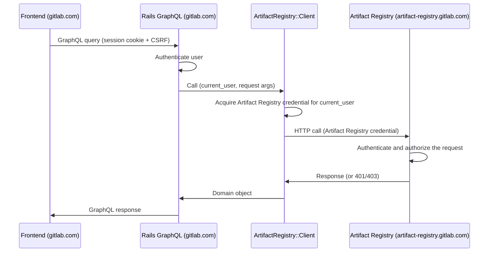

<!-- Design Documents often contain forward-looking statements -->
<!-- vale gitlab.FutureTense = NO -->

## Status

**Proposed（提案中）。**

## Context

Artifact Registry は GitLab モノリスとは別のドメインで動作します
（例えば、モノリスが `gitlab.com` または `gitlab.acme.com` にある一方で、
`artifact-registry.gitlab.com` で動作します）。

この ADR はブラウザフロントエンドを扱います。すなわち、ネームスペースを
一覧表示し、リポジトリを閲覧し、アーティファクトのメタデータを表示し、
管理アクションを公開する Vue UI です。

[ADR-009](009_api_design.md) は、Artifact Registry が管理 API を公開することを
規定しています。[ADR-022](022_namespace_decoupling.md) は、レジストリが
Rails の識別子から独立してネームスペースをどのように解決するかを定義しています。
Rails と Artifact Registry の間の認証メカニズムは、
[認証に関する合意事項](../agreements/auth.md)に従います。
この ADR はこれらの契約を利用します。

Artifact Registry は現在は中央集権型であり、Self-Managed デプロイメントが
計画されています。Artifact Registry は Rails モノリスよりも速いリリースサイクルで
リリースされます。

## Decision

**Rails GraphQL リゾルバーパターンを採用し、Rails モノリス内の Ruby クライアントが
Artifact Registry REST API と直接やり取りします。**

Rails のリゾルバーは、Container Registry の `lib/container_registry/client.rb` と
同じように、Artifact Registry REST エンドポイントに 1 対 1 でマッピングされる
Ruby メソッドを通じてレジストリとやり取りします。

### Authentication and request flow

ブラウザは、セッション cookie と CSRF トークンによって認証された GraphQL の
クエリとミューテーションを `/api/graphql` に送信します。ブラウザは同一オリジンに
留まります。Artifact Registry の資格情報はサーバーサイドで Ruby クライアントによって
取得・保持され、ブラウザには決して届きません。

Ruby クライアントは認証を自前で処理します。現在の Rails ユーザーを前提として、
クライアントはトークン交換を実行し、得られた資格情報をリクエストに付与します。
Artifact Registry 自身の認証・認可ミドルウェアがリクエストを検証します。

### Cross-service data joining

Artifact Registry は GitLab の識別子を保存しますが、それらが指し示すデータ自体は
保存しません。ユーザーが何かを作成・更新・公開すると、Artifact Registry は
そのユーザーの ID を記録します。関連するプロジェクトやコミットも参照として
保存されます。実際の名前、アバター、プロフィールリンク、プロジェクトのメタデータ、
コミットの詳細はすべて Rails データベースに存在します。ユーザー向けの
Artifact Registry ビューの大半は、これらのうち少なくとも 1 つを必要とするため、
Artifact Registry の識別子から Rails エンティティへの結合は、ユーザー向けの
読み取りのたびに実行されます。

Rails はこの結合を自前で行います。各種の参照ごとに、リゾルバーが
`BatchLoader::GraphQL` を使って ID でレコードを取得し、既存の `Types::UserType`、
`Types::ProjectType`、`Types::CommitType` を再利用します。このパターンは
モノリスの他の箇所でも使われています。実際の例は
`app/graphql/types/container_registry/container_repository_type.rb` を参照してください。
ページにいくつのレコードがあっても、ビューのコストは Artifact Registry への
1 回の呼び出しと、参照される型ごとに 1 回の Rails クエリで済みます。

これは Artifact Registry がどのように出荷されるか、その互換性ポリシーが何であるか、
あるいはどのようにデプロイされるかに関わらず成立します。これは、ユーザー、
プロジェクト、コミットのデータを Artifact Registry にコピーするのではなく、
識別子を保持するという Artifact Registry の選択に由来します。

### API contract

GraphQL は、Container Registry に合わせて、ブラウザ駆動の読み取りとミューテーションの
ためのサーフェスです。各 Artifact Registry リソースには、対応する Rails GraphQL 型が
あります。Namespace、Repository、Artifact、Tag、Version です。リゾルバーは、
`namespacePath` や `repositoryPath` といった引数から対象リソースの識別子を導出します。
リゾルバーは、Container Registry のリゾルバーに合わせて、Artifact Registry の認可失敗を
not-available エラーに、トランスポート失敗を service-unavailable エラーにマッピングします。

### Rails-side components

Rails 側のコンポーネントは 3 つあり、それぞれに Container Registry の対応物があります。

| Component | Path | Container Registry analogue |
|---|---|---|
| HTTP client | `lib/artifact_registry/client.rb` | `lib/container_registry/client.rb` |
| GraphQL types and resolvers | `app/graphql/types/artifact_registry/`, `app/graphql/resolvers/artifact_registry/` | `app/graphql/types/container_registry/`, `app/graphql/resolvers/container_repositories_resolver.rb` |
| Vue entry | `app/assets/javascripts/packages_and_registries/artifact_registry/` | `app/assets/javascripts/packages_and_registries/container_registry/explorer/` |

Rails 側の資格情報の取得は[認証に関する合意事項](../agreements/auth.md)に従います。
具体的なサービスと交換プロトコルは未確定です（[未解決の問題](#open-questions)を参照）。

リゾルバーは、ロードされたリソース上のキャッシュ済みヘルパーを通じてクライアントを
取得します（`ContainerRepository#registry` と同じパターン）。親ごとにファンアウトする
子フィールドは、[Cross-service data joining](#cross-service-data-joining)で説明した
バッチルックアップパターンを使い、N 個の親解決を子フィールドごとに 1 回の
Artifact Registry 呼び出しへと集約します。

## Consequences

### Positive

1. **既存のフロントエンドインフラを再利用する。** セッション cookie、CSRF、axios の
   デフォルト設定、Apollo クライアント、フィーチャーフラグ、そしてすでに導入されている
   エラーハンドリングがそのまま機能します。これは Container Registry と Orbit (GKG) の
   UI が使っているのと同じパターンです。
2. **クロスサービス結合が安価になる。** Rails は既存の GraphQL 型を使ってユーザー、
   プロジェクト、コミットのデータを取得し、単一のリクエスト内でルックアップを
   バッチ処理します。これにより、フロントエンド側で結合を行う場合に必要となる
   余分なラウンドトリップとマージコードを回避できます。Artifact Registry 側での
   バッチ処理は、Artifact Registry の REST API に依存する別の問題です（Negative
   #3 を参照）。
3. **サーバーサイド認証。** Ruby クライアントが Rails のセッションアイデンティティからの
   トークン交換を処理します。

### Negative

1. **リゾルバーのサーフェスが Artifact Registry の API に応じて拡大する。**
   フロントエンドが利用する Artifact Registry の各エンドポイントには、Rails GraphQL
   リゾルバーが必要です。
2. **ドメインモデルが二重に表現される。** Artifact Registry のドメインは独自の契約内で
   記述され、さらに Rails GraphQL 型でも記述されます。ドリフトが起こり得ます。
   契約テストでこれを緩和できます。
3. **Artifact Registry の API 設計に制約がかかる。** N+1 の緩和は、フロントエンドが
   レンダリングするすべてのコレクション境界で Artifact Registry がバルク読み取りを
   公開していることに依存します。
4. **追加のレイテンシー。** 各リクエストには 2 回のネットワークホップが必要です。
   フロントエンドから Rails へ、次に Rails から Artifact Registry へです。これは
   GraphQL 呼び出しを REST API ではなく gRPC エンドポイントに接続することで
   緩和できる可能性があります。これは両サービスが同じプラットフォームに
   コロケーションされている場合（例えば .com <-> .com）に機能し得ます。これには
   Artifact Registry が gRPC を公開することが必要で、追加の作業を伴います。
5. **フロントエンドのリリースサイクルが Rails に縛られる。** フロントエンドは Rails
   モノリスと一緒に出荷されるため、Artifact Registry 向けの新機能は、各インストールが
   対応する Rails リリースを取り込んで初めてユーザーに届きます。Dedicated の
   インストールは m-2 で動作するため、Dedicated ユーザーが新しい Artifact Registry の
   UI を目にするのは、GitLab.com で利用可能になってからおよそ 2 マイルストーン後です。

## Alternatives

### Alternative 1: Thin pass-through proxy

Rails が `/-/artifact_registry/proxy/graphql` を公開し、生の GraphQL ボディを
Artifact Registry に転送し、Rails が署名した JWT を付与します。CustomersDot は
`ee/app/controllers/customers_dot/proxy_controller.rb` でこの形を使っています。

**Pros:**

- Rails のコードが少なく、リゾルバーごとの作業が不要です。
- Artifact Registry のスキーマが直接流れます。新しいフィールドは Rails の変更なしに
  フロントエンドに現れます。Artifact Registry の追加のみのコミットメントと、その
  速いリリースサイクルにより、スキーマのドリフトはブラウザから遠ざけられます。

**Cons:**

- クロスサービス結合がフロントエンドに移ります。Artifact Registry は、基礎となる
  ユーザー、プロジェクト、コミットのデータではなく、GitLab の識別子を保存します。
- ユーザーに帰属するビューごとに 2 回の連続したラウンドトリップが発生し、加えて
  マージユーティリティが多くの Vue コンポーネント間で重複します。
- フロントエンドが Artifact Registry のスキーマに直接依存し、Rails 側のエラー
  バッファがありません。
- フロントエンドに 2 つ目の GraphQL エンドポイントが導入されます。
- Artifact Registry が追加の API である GraphQL を実装する必要があります。それは
  Artifact Registry 側で行う追加の作業です。

**Why rejected:**

- クロスサービス結合が、きれいな実装パスのないフロントエンドの問題になります。
  ユーザーに帰属するすべてのビューに、余分な Rails ラウンドトリップと FE 側の
  マージユーティリティのコストがかかります。
- Vue コンポーネント間でのマージロジックの重複は、フロントエンドのサーフェス
  面積に対してスケールが悪くなります。

### Alternative 2: GraphQL schema stitching

Rails がスキーマスティッチングゲートウェイを使い、`GitlabSchema` と Artifact Registry の
GraphQL スキーマを `/api/graphql` で統一されたスーパーグラフへと合成します。
スティッチング gem は Rails 内で動作し、Artifact Registry 型のリクエストは HTTP 経由で
Go サービスへルーティングされ、その他のクエリは `GitlabSchema` に留まります。
`graphql-stitching` gem を使った POC 実装が
[gitlab-org/gitlab!227224](https://gitlab.com/gitlab-org/gitlab/-/merge_requests/227224)
にあります。

**Pros:**

- フロントエンドに対して GraphQL エンドポイントが 1 つになります（採用したパターンと同じ）。
- Artifact Registry のスキーマが直接利用されます。Rails は Artifact Registry の各
  フィールドごとにリゾルバーを必要とせず、ゲートウェイがスキーマを再読み込みすれば、
  新しいフィールドは Rails の MR なしにフロントエンドに届きます。
- クロスサービス結合が宣言的に表現されます。Artifact Registry の SDL がクロスサービス
  参照（例えば `Repository.createdBy: User`）を宣言し、Rails が `id` で `User` を
  解決できると宣言すると、スティッチング gem がクロスサービスのフェッチとバッチ処理を
  自動的に計画します。

**Cons:**

- Artifact Registry が追加の API である GraphQL を実装する必要があります。それは
  Artifact Registry 側で行う追加の作業です。
- モノリスに `graphql-stitching` gem とスキーマ合成パイプラインを追加します。
- Rails は、Artifact Registry の SDL をモノリスのリポジトリに同期する（スキーマ変更の
  たびにリポジトリ横断の調整が必要）か、起動時に Artifact Registry をイントロスペクト
  する（Rails の起動とその公開 GraphQL サーフェスが Artifact Registry のデプロイ
  サイクルに縛られる）かのいずれかが必要です。
- Artifact Registry が参照する Rails の各エンティティ型には、Rails 側で境界リゾルバーが、
  Artifact Registry 側で `@key` 宣言が必要です。

**Why rejected:**

- リゾルバーパターンに対する明確な優位性のないまま、ゲートウェイのインフラを
  追加することになります。
- Rails 側のスキーマ統合には、リポジトリ横断の SDL 同期か、Artifact Registry への
  起動時依存のいずれかが加わります。

### Alternative 3: Direct cross-domain with a browser-held credential

フロントエンドが Artifact Registry とクロスオリジンでやり取りし、Artifact Registry への
独自の資格情報を持ち運びます。モノリスに存在する 2 つのバリアントを検討しました。
1 つはアイデンティティトークンのベアラー資格情報（フロントエンドがアイデンティティ
トークンを取得し、メモリ内に保持し、`Authorization: Bearer` として Artifact Registry に
直接送信する）、もう 1 つは暗号化されたセッション cookie（Rails が Artifact Registry の
サブドメインにスコープされた暗号化 cookie を設定し、ブラウザがクロスオリジン
リクエストで送信する。`app/controllers/concerns/kas_cookie.rb` の `KasCookie` に類似）です。

**Pros:**

- Artifact Registry がフロントエンドに直接サービスを提供し、リゾルバーごとの Rails の
  作業が不要です。

**Cons:**

- クロスサービス結合は依然としてフロントエンドに委ねられます（Alternative 1 と同じ形）。
- ブラウザが Artifact Registry にオリジンを越えるため、Artifact Registry はモノリスの
  オリジンに対して CORS を提供しなければなりません。アイデンティティトークンの
  バリアントは `Authorization` を持つリクエストにプリフライトを必要とし、cookie の
  バリアントは `Access-Control-Allow-Credentials: true`、明示的なオリジンの
  許可リスト（ワイルドカード不可）、そして `SameSite=None; Secure` cookie を
  必要とします。
- アイデンティティトークンのバリアント: 資格情報のライフサイクル（取得、メモリ内
  保存、有効期限の処理、401 時の更新、SPA ナビゲーション）が JavaScript に移り、
  キャッシュミス時の二重交換フロー（FE → Artifact Registry → Rails → Artifact Registry）は
  単一の FE → Rails → Artifact Registry 呼び出しよりも遅くなります。
- cookie のバリアント: KAS は、1 回のハンドシェイクが接続のライフタイム全体で
  償却される長寿命の WebSocket にこのパターンを使っています。Artifact Registry の
  交換は多数の短命な REST 呼び出しであり、それぞれが cookie の再検証を必要とします。
  Rails の cookie 暗号化と鍵ローテーションを Go で再現することは、
  [認証に関する合意事項](../agreements/auth.md)の JWT ベースの認証方針と矛盾します。
  Artifact Registry の認可モデルは、ロール強制を伴うスコープ付き JWT を中心に
  構築されています。cookie 認証では、Artifact Registry 内に並行する認可パスが
  必要になります。cookie のドメインは、`gitlab.com` と
  `artifact-registry.gitlab.com` の両方を含む親にスコープされなければならず、
  さらに Self-Managed インスタンスでも機能する必要が出てくる可能性があります。

**Why rejected:**

- クロスサービス結合が未解決のまま残ります。
- 各バリアントは、ブラウザ側の資格情報サーフェス（JS が保持するアイデンティティ
  トークン、または親にスコープされた暗号化 cookie）と、Artifact Registry 内の並行する
  認証パスを追加します。

### Alternative 4: Iframe embed with `postMessage` credential delivery

Artifact Registry が UI を iframe として提供し、ロード時に `postMessage` で資格情報を
渡します。`app/assets/javascripts/observability/utils/auth_manager.js` に類似します。

**Pros:**

- Artifact Registry サービスが自身の UI 全体を所有できます。
- Rails インスタンスのバージョンを Artifact Registry のバージョンから切り離します。
  UI を伴う新しい Artifact Registry のバックエンド機能は、Rails のリリースを待つことなく、
  Artifact Registry が出荷され次第、SaaS、Dedicated、Self-Managed の各構成に届きます。

**Cons:**

- iframe は Artifact Registry のオリジンで動作し、Rails への直接のパスがありません
  （CORS に加えてセッション共有がない）。クロスサービス結合は、ユーザー、プロジェクト、
  コミットのデータを求めて親に `postMessage` リクエストを返すか、あるいは
  Artifact Registry に保存して Rails と同期し続けるかのいずれかで行う必要があります。
- iframe 通信は、ディープリンク、ブラウザシェルのナビゲーション、そして GitLab
  モノリスがシェル内ビューに期待するアクセシビリティのパターンを壊します。

**Why rejected:**

- クロスサービス結合と CORS です。`postMessage` のパスは Alternative 3 と同じコストが
  かかります。保存と同期のオルタナティブは、PII の重複、同期インフラ、そして GDPR の
  削除に関する複雑さを追加します。
- iframe 固有の UX の制限が、すべてのシェル内ビューに適用されます。

## Open questions

1. Self-Managed デプロイメントの場合、Artifact Registry のエンドポイント URL は
   どのように Rails に提示されますか? 考えられるメカニズムには、`gitlab.yml` の
   設定キーや管理者 UI の設定があります。Self-Managed のオペレーター向けに、Rails と
   Artifact Registry の間の設定契約は誰が所有しますか?
2. Rails と Artifact Registry の間のトークン交換は
   [認証に関する合意事項](../agreements/auth.md)のレベルでコミットされていますが、
   資格情報のフォーマット、クレームの形、ミンティングサービスはまだ規定されていません。
   Ruby クライアントの資格情報取得ステップはこれらの決定に依存しており、この ADR では
   意図的に抽象的なままにしています。
3. Artifact Registry のリスト系エンドポイントの要素ごとの形と、ページネーションの形
   （カーソルのフォーマット、ページサイズの上限）は、ADR-009 ではまだ規定されて
   いません。この ADR の N+1 緩和は、リスト系エンドポイントが、要素ごとの追加呼び出し
   なしにリストビューをレンダリングするのに十分な要素ごとのデータを返すことに
   依存します。

## Future work

GitLab Adaptive Trust Environment が確定したら、Rails 側の資格情報取得はそれに
移行します。この ADR のフロントエンドパターンは変更なしに引き継がれます。

将来の製品要件で、ブラウザ側からの Artifact Registry への直接アクセス（例えば、
ブラウザからの署名付き URL によるアーティファクトのアップロード）が確立される場合、
CORS、資格情報のライフサイクル、対象となる具体的なリソースを扱うフォローアップの
ADR が必要になります。

## References

- [ADR-009: API Design](009_api_design.md)
- [ADR-022: Namespace Decoupling](022_namespace_decoupling.md)
- [Auth agreement](../agreements/auth.md)
- Container Registry frontend: `app/assets/javascripts/packages_and_registries/container_registry/explorer/`
- Container Registry resolvers: `app/graphql/resolvers/container_repositories_resolver.rb`, `app/graphql/resolvers/container_repository_tags_resolver.rb`
- Container Registry auth service: `app/services/auth/container_registry_authentication_service.rb`
- Container Registry Ruby client: `lib/container_registry/client.rb`, `lib/container_registry/gitlab_api_client.rb`
- KAS cookie pattern: `app/controllers/concerns/kas_cookie.rb`
- CustomersDot proxy: `ee/app/controllers/customers_dot/proxy_controller.rb`, `ee/app/assets/javascripts/lib/customers_dot_graphql.js`
- GitLab Observability iframe and postMessage auth: `app/assets/javascripts/observability/utils/auth_manager.js`
- GraphQL schema stitching draft: [gitlab-org/gitlab!227224](https://gitlab.com/gitlab-org/gitlab/-/merge_requests/227224)
