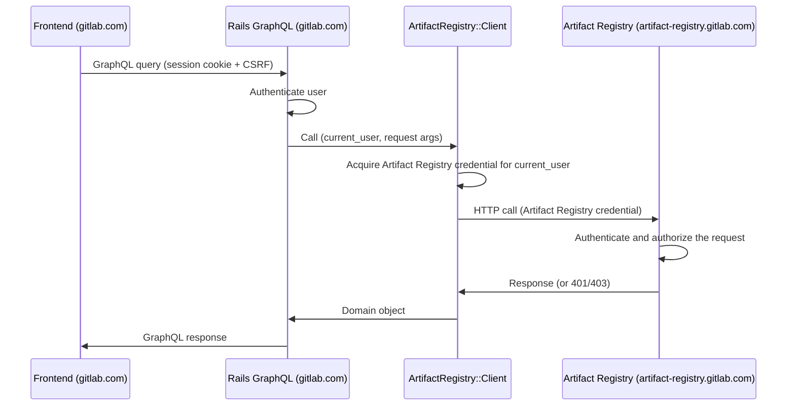

<!-- Design Documents often contain forward-looking statements -->
<!-- vale gitlab.FutureTense = NO -->

## ステータス

**提案中。**

## コンテキスト

Artifact Registry は、GitLab モノリスとは別のドメインで動作します（例: モノリスが
`gitlab.com` や `gitlab.acme.com` にある一方で、
`artifact-registry.gitlab.com` で動作する）。

この ADR は、ブラウザのフロントエンドを扱います。ネームスペースを一覧表示し、
リポジトリを閲覧し、アーティファクトのメタデータを表示し、管理アクションを
公開する Vue UI です。

[ADR-009](009_api_design.md) は、Artifact Registry が管理 API を
公開することを規定しています。[ADR-022](022_namespace_decoupling.md) は、
レジストリが Rails の識別子とは独立してネームスペースを解決する
方法を定義しています。Rails と Artifact Registry の間の認証メカニズムは
[auth agreement](../agreements/auth.md) に従います。この ADR は、それらの
契約を消費します。

Artifact Registry は今日は中央集約されており、セルフマネージドの
デプロイが計画されています。Artifact Registry は Rails モノリスよりも
速いペースでリリースされます。

## 決定

**Rails の GraphQL リゾルバーパターンを採用し、Rails モノリス内の
Ruby クライアントが Artifact Registry REST API と直接通信する。**

Rails のリゾルバーは、Container Registry の `lib/container_registry/client.rb` が
行っているのと同じ方法で、Artifact Registry REST エンドポイントに 1 対 1 で
マッピングされる Ruby メソッドを通じてレジストリと通信します。

### 認証とリクエストフロー

ブラウザは、セッションクッキーと CSRF トークンで認証された GraphQL の
クエリとミューテーションを `/api/graphql` に送信します。ブラウザは
同一オリジンに留まります。Artifact Registry の認証情報は Ruby クライアントが
サーバー側で取得・保持し、ブラウザに渡ることはありません。

Ruby クライアントは認証を自身で処理します。現在の Rails ユーザーを与えられると、
クライアントはトークン交換を実行し、得られた認証情報をリクエストに付加します。
Artifact Registry 自身の認証および認可ミドルウェアがリクエストを検証します。

### サービス間のデータ結合 {#cross-service-data-joining}

Artifact Registry は、GitLab の識別子を保存しますが、それが指すデータ自体は
保存しません。ユーザーが何かを作成、更新、公開すると、Artifact Registry は
ユーザーの ID を記録します。関連するプロジェクトやコミットも参照として
保存されます。実際の名前、アバター、プロフィールリンク、プロジェクトの
メタデータ、コミットの詳細はすべて Rails のデータベースに存在します。
ユーザー向けの Artifact Registry のビューのほとんどは、それらの少なくとも
1 つを必要とするため、Artifact Registry の識別子から Rails エンティティへの
結合は、ユーザー向けのすべての読み取りで実行されます。

Rails が結合自体を行います。参照の種類ごとに、リゾルバーが
`BatchLoader::GraphQL` を使用して ID でレコードを取得し、既存の
`Types::UserType`、`Types::ProjectType`、`Types::CommitType` を
再利用します。このパターンはモノリス内の他の場所でも使用されています。
実際の例については `app/graphql/types/container_registry/container_repository_type.rb`
を参照してください。ページ上にレコードが何件あっても、ビューのコストは
Artifact Registry への 1 回の呼び出しに加えて、参照される型ごとに Rails への
1 回のクエリです。

これは、Artifact Registry がどのように出荷されるか、互換性ポリシーが何であるか、
どのようにデプロイされるかにかかわらず成り立ちます。これは、ユーザー、
プロジェクト、コミットのデータを Artifact Registry にコピーするのではなく、
識別子を保持するという Artifact Registry の選択から生じるものです。

### API 契約

GraphQL は、Container Registry に合わせて、ブラウザ駆動の読み取りと
ミューテーションのための面です。各 Artifact Registry リソースには対応する
Rails GraphQL 型があります。Namespace、Repository、Artifact、Tag、Version です。
リゾルバーは、`namespacePath` や `repositoryPath` などの引数から対象リソースの
識別子を導出します。リゾルバーは、Artifact Registry の認可失敗を「利用不可」
エラーに、トランスポート失敗を「サービス利用不可」エラーにマッピングし、
Container Registry のリゾルバーに合わせます。

### Rails 側コンポーネント

3 つの Rails 側コンポーネント。それぞれに Container Registry のアナログがあります。

| コンポーネント | パス | Container Registry のアナログ |
|---|---|---|
| HTTP クライアント | `lib/artifact_registry/client.rb` | `lib/container_registry/client.rb` |
| GraphQL の型とリゾルバー | `app/graphql/types/artifact_registry/`、`app/graphql/resolvers/artifact_registry/` | `app/graphql/types/container_registry/`、`app/graphql/resolvers/container_repositories_resolver.rb` |
| Vue エントリ | `app/assets/javascripts/packages_and_registries/artifact_registry/` | `app/assets/javascripts/packages_and_registries/container_registry/explorer/` |

Rails 側の認証情報の取得は [auth agreement](../agreements/auth.md) に
従います。具体的なサービスと交換プロトコルは未解決です
（[未解決の問い](#open-questions) を参照）。

リゾルバーは、ロードされたリソース上のキャッシュされたヘルパーを通じて
クライアントを取得します（`ContainerRepository#registry` と同じパターン）。
親ごとにファンアウトする子フィールドは、[サービス間のデータ結合](#cross-service-data-joining)
で説明されているのと同じバッチ化されたルックアップパターンを使用し、
N 個の親解決を子フィールドごとの 1 回の Artifact Registry 呼び出しに
まとめます。

## 結果

### ポジティブ

1. **既存のフロントエンドインフラを再利用する。** セッションクッキー、
   CSRF、axios のデフォルト、Apollo クライアント、フィーチャーフラグ、
   そしてすでに整備されているエラー処理がそのまま機能する。Container Registry
   と Orbit (GKG) の UI が使用するのと同じパターンである。
2. **サービス間の結合がより安価。** Rails は既存の GraphQL 型でユーザー、
   プロジェクト、コミットのデータを取得し、単一のリクエスト内でルックアップを
   バッチ化するため、フロントエンド側の結合が必要とする余分な往復と
   フロントエンドのマージコードを回避できる。Artifact Registry 側での
   バッチ化は Artifact Registry の REST API に依存する別の問題である
   （ネガティブ #3 を参照）。
3. **サーバー側認証。** Ruby クライアントが Rails のセッションアイデンティティから
   トークン交換を処理する。

### ネガティブ

1. **リゾルバーの面が Artifact Registry の API に応じて拡大する。** フロントエンドが
   消費する Artifact Registry のすべてのエンドポイントに Rails GraphQL リゾルバーが
   必要になる。
2. **ドメインモデルが二重に表現される。** Artifact Registry のドメインは自身の
   契約と Rails GraphQL 型の両方で記述され、ドリフトが起こりうる。
   契約テストでこれを緩和できる。
3. **Artifact Registry の API 設計が制約される。** N+1 の緩和は、フロントエンドが
   レンダリングするすべてのコレクション境界で Artifact Registry がバルク読み取りを
   公開することに依存する。
4. **追加のレイテンシ。** 各リクエストは 2 つのネットワークホップを必要とする。
   フロントエンドから Rails、そして Rails から Artifact Registry である。これは
   GraphQL の呼び出しを REST API ではなく gRPC エンドポイントに接続することで
   緩和できる可能性がある。これは両サービスが同じプラットフォームに同居している
   場合（例: .com ↔ .com）に機能しうる。これには Artifact Registry が gRPC を
   公開する必要があり、追加の作業となる。
5. **フロントエンドのリリースペースが Rails に縛られる。** フロントエンドは
   Rails モノリスとともに出荷されるため、新しい Artifact Registry 向けの機能が
   ユーザーに届くのは、そのインストールが対応する Rails リリースを取り込んだ
   ときのみである。Dedicated のインストールは m-2 で動作するため、Dedicated の
   ユーザーは、新しい Artifact Registry の UI が GitLab.com で利用可能になってから
   おおよそ 2 マイルストーン後にそれを見ることになる。

## 代替案

### 代替案 1: 薄いパススループロキシ

Rails が `/-/artifact_registry/proxy/graphql` を公開し、生の GraphQL ボディを
Artifact Registry に転送し、Rails が署名した JWT を付加します。CustomersDot は
`ee/app/controllers/customers_dot/proxy_controller.rb` でこの形を使用しています。

**長所:**

- Rails のコードが少ない。リゾルバーごとの作業がない。
- Artifact Registry のスキーマが直接流れる。新しいフィールドが Rails の変更なしに
  フロントエンドに現れる。Artifact Registry の追加のみのコミットメントと、その
  速いリリースペースが、スキーマのドリフトをブラウザから遠ざける。

**短所:**

- サービス間の結合がフロントエンドに移る。Artifact Registry は、その基となる
  ユーザー、プロジェクト、コミットのデータではなく、GitLab の識別子を保存する。
- ユーザー帰属のビューごとに 2 回の連続した往復があり、加えて多くの Vue
  コンポーネント間で重複するマージユーティリティがある。
- フロントエンドが Artifact Registry のスキーマに直接依存する。Rails 側の
  エラーバッファがない。
- フロントエンドに 2 つ目の GraphQL エンドポイントが導入される。
- Artifact Registry が追加の API（GraphQL）を実装する必要がある。これは
  Artifact Registry での追加の作業となる。

**却下した理由:**

- サービス間の結合が、きれいな実装パスのないフロントエンドの問題になる。
  ユーザー帰属のビューごとに、追加の Rails 往復と FE 側のマージユーティリティの
  コストがかかる。
- Vue コンポーネント間のマージロジックの重複は、フロントエンドの面積に対して
  スケールが悪い。

### 代替案 2: GraphQL スキーマスティッチング

Rails が、スキーマスティッチングゲートウェイを使用して `GitlabSchema` と
Artifact Registry の GraphQL スキーマを `/api/graphql` で統一されたスーパーグラフに
合成します。スティッチング gem は Rails 内で動作し、Artifact Registry の型への
リクエストは HTTP 経由で Go サービスにルーティングされ、それ以外のクエリは
`GitlabSchema` に留まります。`graphql-stitching` gem を使用した POC 実装が
[gitlab-org/gitlab!227224](https://gitlab.com/gitlab-org/gitlab/-/merge_requests/227224) に存在します。

**長所:**

- フロントエンドに 1 つの GraphQL エンドポイント（選択したパターンと同じ）。
- Artifact Registry のスキーマが直接消費される。Rails は各 Artifact Registry
  フィールドのためのリゾルバーを必要とせず、ゲートウェイがスキーマを再ロードすれば、
  新しいフィールドが Rails MR なしにフロントエンドに届く。
- サービス間の結合が宣言的に表現される。Artifact Registry の SDL が
  サービス間の参照を宣言し（例: `Repository.createdBy: User`）、Rails が `id` で
  `User` を解決できることを宣言すると、スティッチング gem がサービス間のフェッチと
  バッチ化を自動的にプランニングする。

**短所:**

- Artifact Registry が追加の API（GraphQL）を実装する必要がある。これは
  Artifact Registry での追加の作業となる。
- モノリスに `graphql-stitching` gem とスキーマ合成パイプラインを追加する。
- Rails は、Artifact Registry の SDL をモノリスのリポジトリに同期する
  （スキーマ変更ごとにリポジトリ間の調整が必要）か、起動時に Artifact Registry を
  イントロスペクトする（Rails の起動と公開 GraphQL の面が Artifact Registry の
  デプロイペースに縛られる）かのいずれかが必要になる。
- Artifact Registry が参照する各 Rails エンティティ型には、Rails 側に境界
  リゾルバーが、Artifact Registry 側に `@key` 宣言が必要になる。

**却下した理由:**

- リゾルバーパターンに対する明確な利点なしにゲートウェイインフラを追加する。
- Rails 側のスキーマ統合が、リポジトリ間の SDL 同期か、Artifact Registry への
  起動時依存性のいずれかを追加する。

### 代替案 3: ブラウザ保持の認証情報によるクロスドメイン直接通信

フロントエンドが、独自の認証情報を Artifact Registry に運びながら、クロスオリジンで
Artifact Registry と通信します。モノリスに存在する 2 つのバリアントを検討しました。
アイデンティティトークンのベアラー認証情報（フロントエンドがアイデンティティ
トークンを取得し、メモリ内に保持し、`Authorization: Bearer` として Artifact Registry に
直接送信する）と、暗号化されたセッションクッキー（Rails が
`app/controllers/concerns/kas_cookie.rb` の `KasCookie` に似た、Artifact Registry の
サブドメインにスコープされた暗号化クッキーを設定し、ブラウザがクロスオリジン
リクエストで送信する）です。

**長所:**

- Artifact Registry がフロントエンドを直接提供する。リゾルバーごとの Rails の
  作業がない。

**短所:**

- サービス間の結合は依然としてフロントエンドに落ちる（代替案 1 と同じ形）。
- ブラウザが Artifact Registry へオリジンをまたぐため、Artifact Registry は
  モノリスのオリジンに対して CORS を提供しなければならない。アイデンティティ
  トークンのバリアントは `Authorization` を運ぶリクエストにプリフライトを必要とし、
  クッキーのバリアントは `Access-Control-Allow-Credentials: true`、明示的な
  オリジン許可リスト（ワイルドカード不可）、`SameSite=None; Secure` クッキーを
  必要とする。
- アイデンティティトークンのバリアント: 認証情報のライフサイクルが JavaScript に
  移る（取得、メモリ内ストレージ、有効期限処理、401 時のリフレッシュ、SPA
  ナビゲーション）。また、キャッシュミス時の二重交換フロー
  （FE → Artifact Registry → Rails → Artifact Registry）は、単一の
  FE → Rails → Artifact Registry 呼び出しよりも遅い。
- クッキーのバリアント: KAS は、1 回のハンドシェイクが接続の存続期間にわたって
  償却される長寿命の WebSocket にこのパターンを使用する。Artifact Registry の
  交換は多数の短命な REST 呼び出しであり、それぞれがクッキーの再検証を必要とする。
  Rails のクッキー暗号化とキーローテーションを Go で再現することは、
  [auth agreement](../agreements/auth.md) の JWT ベースの認証の方向性と矛盾する。
  Artifact Registry の認可モデルはロール強制を伴うスコープ付き JWT を中心に
  構築されており、クッキー認証では Artifact Registry 内に並行する認可パスが
  必要になる。クッキードメインは、`gitlab.com` と `artifact-registry.gitlab.com`
  の両方を含む親にスコープされ、場合によってはセルフマネージドインスタンスでも
  機能する必要がある。

**却下した理由:**

- サービス間の結合を未解決のまま残す。
- 各バリアントが、ブラウザ側の認証情報の面（JS が保持するアイデンティティ
  トークンか、親スコープの暗号化クッキー）と、Artifact Registry 内の並行する
  認証パスを追加する。

### 代替案 4: `postMessage` による認証情報受け渡しを伴う iframe 埋め込み

Artifact Registry が、ロード時に `postMessage` 経由で渡される認証情報とともに
UI を iframe として提供します。
`app/assets/javascripts/observability/utils/auth_manager.js` に似ています。

**長所:**

- Artifact Registry サービスが自身の UI 全体を所有できる。
- Rails のインスタンスバージョンを Artifact Registry のバージョンから切り離す。
  UI を伴う新しい Artifact Registry のバックエンド機能が、Rails のリリースを
  待つことなく、Artifact Registry が出荷されるとすぐに SaaS、Dedicated、
  セルフマネージドのセットアップに届く。

**短所:**

- iframe は Artifact Registry のオリジンで動作し、Rails への直接のパスがない
  （CORS に加えてセッション共有なし）。サービス間の結合は、ユーザー、プロジェクト、
  コミットのデータを求めて親への `postMessage` リクエストを通じて起こるか、
  または Artifact Registry に保存して Rails と同期させる必要がある。
- iframe 通信は、ディープリンク、ブラウザシェルのナビゲーション、GitLab モノリスが
  インシェルビューに期待するアクセシビリティパターンを壊す。

**却下した理由:**

- サービス間の結合と CORS。`postMessage` パスは代替案 3 と同じコストがかかる。
  保存・同期の代替は、PII の重複、同期インフラ、GDPR 削除の複雑さを追加する。
- iframe 固有の UX 制約がすべてのインシェルビューに適用される。

## 未解決の問い {#open-questions}

1. セルフマネージドのデプロイでは、Artifact Registry のエンドポイント
   URL はどのように Rails に提示されるか。可能なメカニズムには `gitlab.yml` の
   設定キーや Admin UI の設定がある。セルフマネージドのオペレーター向けに、
   Rails と Artifact Registry の間の設定契約を誰が所有するか。
2. Rails と Artifact Registry の間のトークン交換は
   [auth agreement](../agreements/auth.md) のレベルでコミットされているが、
   認証情報のフォーマット、クレームの形、ミンティングサービスはまだ規定されていない。
   Ruby クライアントの認証情報取得ステップはそれらの決定に依存しており、
   この ADR では意図的に抽象的なままにしている。
3. Artifact Registry のリスト系エンドポイントに対する要素ごとの形と
   ページネーションの形（カーソルフォーマット、ページサイズの上限）は、
   まだ ADR-009 で規定されていない。この ADR の N+1 緩和は、リスト系
   エンドポイントが、要素ごとのフォローアップ呼び出しなしにリストビューを
   レンダリングするのに十分な要素ごとのデータを返すことに依存する。

## 将来の作業

GitLab Adaptive Trust Environment が確定すると、Rails 側の認証情報取得は
それに移行します。この ADR のフロントエンドパターンは変更なくそのまま
引き継がれます。

将来のプロダクト要件が、ブラウザ側からの Artifact Registry への直接アクセス
（例: ブラウザからの署名付き URL によるアーティファクトアップロード）を確立する
場合、それは CORS、認証情報のライフサイクル、スコープ内の具体的なリソースを
扱うフォローアップ ADR を必要とします。

## 参考文献

- [ADR-009: API Design](009_api_design.md)
- [ADR-022: Namespace Decoupling](022_namespace_decoupling.md)
- [Auth agreement](../agreements/auth.md)
- Container Registry frontend: `app/assets/javascripts/packages_and_registries/container_registry/explorer/`
- Container Registry resolvers: `app/graphql/resolvers/container_repositories_resolver.rb`, `app/graphql/resolvers/container_repository_tags_resolver.rb`
- Container Registry auth service: `app/services/auth/container_registry_authentication_service.rb`
- Container Registry Ruby client: `lib/container_registry/client.rb`, `lib/container_registry/gitlab_api_client.rb`
- KAS cookie pattern: `app/controllers/concerns/kas_cookie.rb`
- CustomersDot proxy: `ee/app/controllers/customers_dot/proxy_controller.rb`, `ee/app/assets/javascripts/lib/customers_dot_graphql.js`
- GitLab Observability iframe and postMessage auth: `app/assets/javascripts/observability/utils/auth_manager.js`
- GraphQL schema stitching draft: [gitlab-org/gitlab!227224](https://gitlab.com/gitlab-org/gitlab/-/merge_requests/227224)
