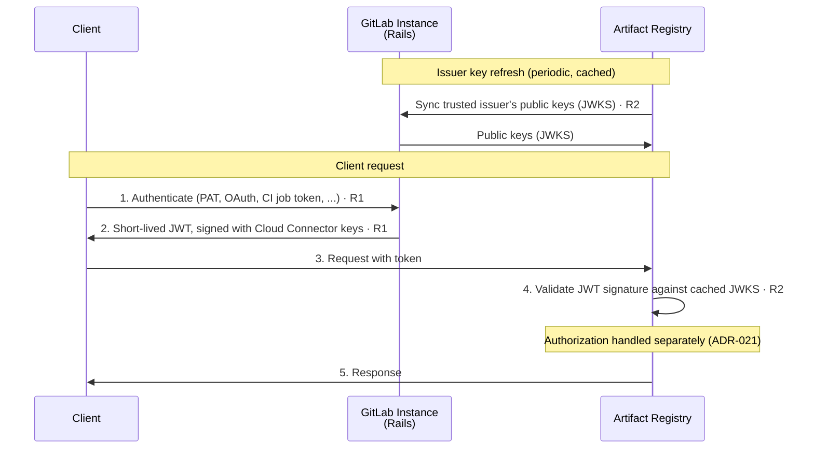

<!-- Design Documents often contain forward-looking statements -->
<!-- vale gitlab.FutureTense = NO -->

## Status

**Proposed**

この ADR は **認証** のみを扱います。つまり、呼び出し元のアイデンティティをどう確立するかです。**認可**（ロール、ポリシー評価、ロール割り当て）は、ADR-021: Authorization で別途扱われます。
<!-- TODO: link to ADR-021 once merged — https://gitlab.com/gitlab-com/content-sites/handbook/-/merge_requests/18717 -->

## Context

クライアントは、専用の API エンドポイントを通じて自身の GitLab Rails インスタンスが発行する短命のトークンを使用して、Artifact Registry に認証します。Artifact Registry はこれらのトークンをローカルで検証し、その発行には関与しません。

Auth Platform チームとの契約は [Artifact Registry and Auth Platform interface agreement](../agreements/auth.md) であり、これは Artifact Registry が必要とするものを 6 つの要件（R1〜R6）にわたって定義します。この ADR は、その認証要件、すなわち R1（トークン交換）、R2（トークン検証）、R3（トークンペイロード）を消費します。

## Decision

**Artifact Registry は、専用のトークン交換 API エンドポイントを通じて GitLab Rails が発行する短命のトークンをローカルで検証することにより、クライアントを認証する。**

### Iteration scope

最初のイテレーションは、同一境界のトポロジー（`.com ↔ .com`、`SM ↔ SM`）を対象とします。ここでは単一のインスタンスが単一の信頼アンカーを持ちます。Rails が Cloud Connector v1 キーでトークンに署名し、`gitlab_instance_uid` はペイロードから省略されます。クロス境界のトポロジー（複数のセルフマネージドインスタンスが 1 つの SaaS Artifact Registry を共有する）は、フォローアップのイテレーションです。

## Architectural constraint

[interface agreement](../agreements/auth.md#no-callbacks-during-request-processing) からの 1 つの制約が、この決定を形作ります。

**リクエスト処理中のコールバックなし。** Artifact Registry は、**リクエストを処理している間**、GitLab インスタンス、Rails、その他のリモートサービスにコールバックすることは決してありません。1 つのリモート依存性は持っています。信頼された発行者の公開鍵を定期的に帯域外で同期することです（[Token validation](#token-validation-r2) を参照）。しかしそれはリクエストごとではなく、リクエスト処理の外で発生します。これはクロス境界のセットアップで最も重要になります。SaaS Artifact Registry に接続するセルフマネージドインスタンスでは、そのインスタンスがネットワーク条件（ファイアウォール、エアギャップ環境）によって到達不能になる可能性があります。リクエストトークンを検証するために必要なものはすべて、トークン自体の中にあるか、すでにローカルにキャッシュされていなければなりません。これが、ローカルでステートレスな検証を最適化ではなく厳格な要件にしている理由です。

## Authentication flow

トークンは Rails が発行し（R1）、Artifact Registry が、定期的に同期してキャッシュする信頼された発行者の公開鍵に対してローカルで検証します（R2）。以下の図は最初のイテレーションのフローを示しています。認可ステップ（ロールルックアップ、ポリシー評価）はここではスコープ外です。ADR-021 を参照してください。



**凡例:**

| ステップ | 説明 |
|------|-------------|
| **発行者キーのリフレッシュ** | Artifact Registry は、事前設定された信頼された発行者の公開鍵（JWKS）を同期し、キャッシュする。これは唯一のリモート依存性であり、帯域外で発生する。リクエスト処理中に発生することは決してない。 |
| **1-2** | クライアントは、（Artifact Registry を通じてではなく）自身の GitLab インスタンスから直接、短命の JWT を取得する。Artifact Registry はクライアントの長命な認証情報を決して見ない。 |
| **3-5** | クライアントはトークンを Artifact Registry に提示し、Artifact Registry はキャッシュされた JWKS に対して署名を検証し、レスポンスを提供する。Rails へのコールバックは発生しない。 |

## Token issuance (R1)

Rails は、クライアントの認証情報を受け付け、Artifact Registry に対して使用可能な短命のトークンを返す、専用のトークン交換 API エンドポイントを公開します。

1. **サポートされる認証情報の種類。** エンドポイントは、それぞれが `User` に解決される標準的な GitLab API の認証情報で呼び出し元を認証します。パーソナルアクセストークン（レガシーまたは粒度の細かいもの）、OAuth トークン、CI ジョブトークン、プロジェクト/グループアクセストークンです。**デプロイトークンは最初のイテレーションではサポートされません**。デプロイトークンは `User` ではなく、最初のイテレーションがトークンを発行する唯一のプリンシパル型ではありません。型付けされた `sub` クレーム（[Token payload](#token-payload-r3) を参照）は、後から他のプリンシパル型を受け入れられるように設計されているため、[R1](../agreements/auth.md#r1--token-exchange-service) のターゲットとして挙げられているデプロイトークンは、フォローアップとして追跡されます。
1. **クライアント側の交換。** トークン交換はクライアント側で行われます。クライアントは自身の GitLab インスタンスからトークンを取得し、それを Artifact Registry に提示します。Artifact Registry が交換を実行することは決してありません。エンドポイントは `curl`、`glab` CLI、または CI ジョブによって自動的に駆動できます。トークンは短命であるため、静的な認証情報を期待するネイティブなパッケージツール（例: Maven の `settings.xml` や npm の `.npmrc`）は、それを取得・リフレッシュするためのヘルパーツールを必要とします。Docker、Maven、npm にまたがるクライアントツールの設計は [client credential management work item](https://gitlab.com/gitlab-org/gitlab/-/work_items/595150) で追跡されています。
1. **トークンの有効期間。** トークンはデフォルトの有効期間が 5 分、最大が 12 時間です。クライアントはより短い有効期間を要求できます。クライアントが要求可能な TTL には AppSec のサインオフが必要です（[token-exchange TTL decision](https://gitlab.com/gitlab-org/gitlab/-/work_items/601469)）。この境界は、Maven/Gradle のビルドが処理の途中で期限切れにならない限りにおいて、[client credential management work item](https://gitlab.com/gitlab-org/gitlab/-/work_items/595150) に文書化された委任認証レジストリの業界の前例に従います。
1. **エンタイトルメントの強制。** トークン交換は、Artifact Registry アドオンのエンタイトルメントを持たない呼び出し元に対しては失敗すべきです（R1、SHOULD）。これは可用性のゲートにすぎず、リポジトリごとの認可は Artifact Registry に留まります。エンタイトルメントは、`:access_artifact_registry_service` の ability を介して Cloud Connector を通じて解決されます。多層防御として、Artifact Registry は自身の側でもエンタイトルメントと消費クォータを再チェックします。エンタイトルメントは、権限を評価するのではなくトークンの *発行* をゲートするため、ADR-021 ではなくここに記録されます。

## Token validation (R2)

トークンは、GitLab インスタンスの既存の Cloud Connector キー（`CloudConnector::Keys`）で署名された JWT です。Artifact Registry は起動時に **信頼された発行者**（自身の GitLab インスタンス）が設定され、その発行者の公開鍵（JWKS）を帯域外で同期します。受信した各トークンの署名を、それらの事前取得されたキーに対して検証します。バリデーターは署名アルゴリズムも固定し、間違ったオーディエンスや過去の `exp` を持つトークンを拒否します。

キーのキャッシュとリフレッシュは、既存の Cloud Connector のアプローチに従います（[R2](../agreements/auth.md#r2--token-validation) に従う）。キーはキャッシュされ、定期的にリフレッシュされ、リフレッシュが失敗した場合は古いキーが短時間保持されるため、キープロバイダーの一時的な不調が、その他の点で有効なトークンを拒否することはありません。

Cloud Connector v1 の仕組みを再利用することで、最初のイテレーションはシンプルに保たれます。新しいキー配布インフラは不要です。ターゲット状態ではキー提供は GATE に移りますが、Artifact Registry 側のアクション、すなわちキャッシュされた信頼鍵に対して署名を検証することは変わりません。

## Token payload (R3)

トークンは、コールバックなしでリクエストを認証するのに十分な情報を運びます。認証に関連するクレームは次のとおりです。

```json
{
  "jti": "5d250d2f-0e6c-4f7d-987b-222973bfb6af",
  "iss": "https://gitlab.example.com",
  "aud": ["gitlab-artifact-registry"],
  "sub": "gid://gitlab/User/42",
  "iat": 1779870540,
  "nbf": 1779870540,
  "exp": 1779870840,
  "gitlab_realm": "saas",
  "gitlab_organization_id": 1
}
```

1. `sub` — プリンシパルのアイデンティティ（R3）。素の数値 ID ではなく、GitLab の GlobalID（例: `gid://gitlab/User/42`）として表現される。値にプリンシパルの *型* をエンコードすることで、曖昧さがなくなり、クレームがその意味を変えることなく非 `User` プリンシパル（例: デプロイトークン）に拡張できる。
1. `iss` — 発行インスタンスの OIDC 発行者 URL。これは情報提供のみ（ログ記録される）であり、Artifact Registry はこれを検証鍵の選択に **使用しない**（[Token validation](#token-validation-r2) を参照）。
1. `aud` — `gitlab-artifact-registry`。トークンを Artifact Registry にスコープする。
1. `gitlab_organization_id` — Organization のコンテキスト（R3 SHOULD）。`gitlab_realm` は `saas` または `self-managed`。
1. `jti`、`iat`、`nbf`、`exp` — 標準的な JWT クレーム。`exp = iat + ttl`。
1. `gitlab_instance_uid` は **現時点では省略される**。最初のイテレーションの同一境界トポロジーには単一の信頼アンカーがあるため、インスタンス識別子は不要である。それはクロス境界のフォローアップでのみ関連する。
1. **ロールやその他の認可を運ぶクレームは、ここではなく ADR-021 で説明される。** Artifact Registry はこのトークンを使用して、呼び出し元が *誰* であるかを確立する。*何ができるか* は別途評価される。認可が *ソース認証情報の種類*（例: PAT 対 CI ジョブトークン）も考慮しなければならないかどうかは、同様に ADR-021 の関心事である。
<!-- TODO: link to ADR-021 once merged — https://gitlab.com/gitlab-com/content-sites/handbook/-/merge_requests/18717 -->

## Alternatives considered

この ADR は代替の認証アーキテクチャを比較検討しません。Artifact Registry 側の設計は、[Artifact Registry and Auth Platform interface agreement](../agreements/auth.md) から導かれます。Artifact Registry は R1〜R3 の要件を消費し、メカニズムはそれらをどう実装するかに関する Authentication チームの決定によって駆動されます。代替案はプラットフォーム側で評価されており（[モジュラーサービスモデルにおける認証および認可の方向性](https://gitlab.com/gitlab-org/gitlab/-/work_items/595148) を参照）、ここではスコープ外です。

## Consequences

### Positive

1. **リクエスト処理中、Rails の可用性から独立している**: 検証がローカルでステートレスであるため、Artifact Registry は、発信元の GitLab インスタンスが到達不能なときでもリクエストを認証できる。
1. **短命のトークンが影響範囲を限定する**: Artifact Registry はクライアントの長命な GitLab 認証情報を決して扱わず、短命のトークンのみを扱う。そのため、漏洩したトークンはすぐに期限切れになり、PAT のような長命な認証情報の漏洩よりもはるかに少ない情報しか露出しない。
1. **プラットフォームの方向性に整合**: Artifact Registry は独自のフローを維持するのではなく、プラットフォームのトークン交換と検証のプリミティブを消費する（[モジュラーサービスモデルにおける認証および認可の方向性](https://gitlab.com/gitlab-org/gitlab/-/work_items/595148) に従う）。

### Negative

1. **暫定的には GitLab インスタンスへのコールバックが必要**: トークンを検証するために、Artifact Registry は GitLab インスタンスの OIDC エンドポイントから発行者キーを同期しなければならない（帯域外、リクエストごとではない）。最終状態の目標は、Artifact Registry が GitLab インスタンスへの接続性に一切依存しないことである。ターゲット状態は、GATE からキーを提供することでこれを達成する。
1. **Cloud Connector v1 の仕組みを再利用する**: 暫定的には、ターゲットの GATE 発行キーではなく、既存の Cloud Connector v1 のキーと OIDC エンドポイントに依存する。
1. **発行されたトークンは期限切れ前に失効できない**: 検証がローカルでコールバックもブロックリストもないため、発信元の認証情報が発行直後に失効されても（例: フィッシングされた PAT が 12 時間のトークンと交換される）、トークンは `exp` まで有効なままである。これは短い *デフォルト* TTL によって緩和され、ベータで受け入れられるトレードオフである。より強力な送信者バインディング（DPoP など）とキーローテーションは、将来の堅牢化として可能である。

### Mitigations

- Artifact Registry 側の検証ロジックは、暫定とターゲットの発行者で同一である。変わるのは発行者キーのソースだけであり、移行の影響範囲を限定する。

## Future work / open debates

これらは未解決の認証に関する問いであり、最初のイテレーションではスコープ外ですが、失われないように記録しています。ほとんどはクロス境界のフォローアップとターゲット（GATE）状態の周辺に集まっています。

1. **GATE のデプロイトポロジー。** ターゲット状態では、発行者キーは発行インスタンス自身の OIDC/JWKS エンドポイントではなく GATE が提供する。GATE がどのようにデプロイされるかに応じて、Artifact Registry は対応する GATE コンポーネントから発行者キーを取得する。デプロイトポロジーはまだ確定していない。
1. **クロス境界の発行者キーと `gitlab_instance_uid`。** 最初のイテレーションは単一の信頼アンカーがあるため `gitlab_instance_uid` を省略する。クロス境界のフォローアップでは、1 つの信頼アンカーの背後に多数のセルフマネージドインスタンスがあるため、トークンは発行インスタンスを識別しなければならない。`gitlab_instance_uid`（または同等のもの）の再導入と、それに伴う検証モデルの変更は未解決である。CI 固有のケース、すなわち SaaS Artifact Registry に接続するリモートランナーのための自動 `CI_JOB_TOKEN` 交換は、このフォローアップに含まれ、[CI_JOB_TOKEN exchange for remote runners work item](https://gitlab.com/gitlab-org/gitlab/-/work_items/599087) で追跡されている。

## References

1. [ADR-001: Organizations as Anchor Point](001_organizations_as_anchor_point.md)
1. ADR-021: Authorization — 認可のための対をなす ADR
<!-- TODO: link to ADR-021 once merged — https://gitlab.com/gitlab-com/content-sites/handbook/-/merge_requests/18717 -->
1. [ADR-022: Namespace Decoupling](022_namespace_decoupling.md)
1. [Artifact Registry and Auth Platform interface agreement](../agreements/auth.md) — ここで消費される R1〜R3（認証）の要件
1. [Authentication and authorization direction work item](https://gitlab.com/gitlab-org/gitlab/-/work_items/595148)
1. [Client credential management for remote artifact clients](https://gitlab.com/gitlab-org/gitlab/-/work_items/595150)
1. [Token-exchange endpoint work item](https://gitlab.com/gitlab-org/gitlab/-/work_items/601475)
1. [GATE identity federation design doc (cross-boundary auth)](https://gitlab.com/gitlab-org/architecture/auth-architecture/design-doc/-/blob/main/decisions/019-gate-identity-federation.md)
1. [RFC 2119](https://www.rfc-editor.org/rfc/rfc2119) — interface agreement で使用される要件レベルのキーワード
1. [OCI Distribution Spec - Authentication](https://github.com/opencontainers/distribution-spec/blob/main/spec.md#authentication)
1. [Container Registry Token Authentication](https://docs.docker.com/registry/spec/auth/token/)
</content>
