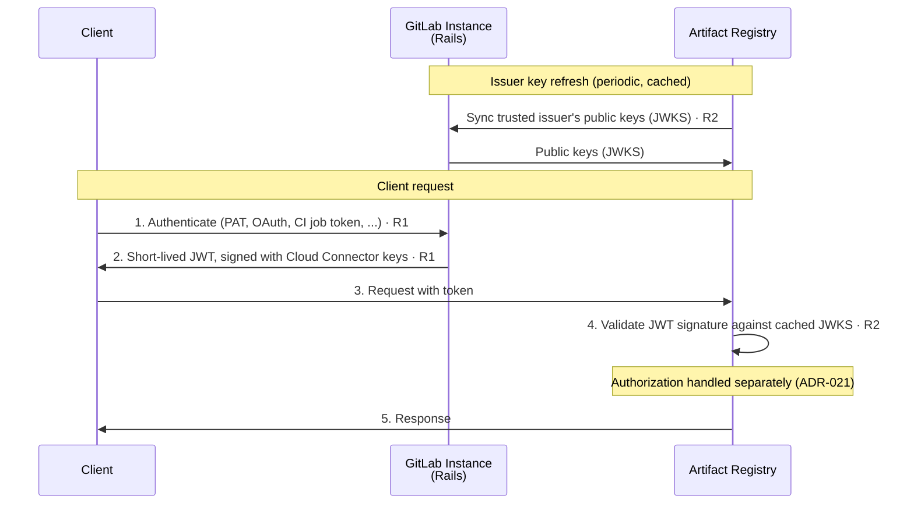

<!-- Design Documents often contain forward-looking statements -->
<!-- vale gitlab.FutureTense = NO -->

## ステータス {#status}

**Proposed**

この ADR は **認証** のみを扱います。つまり、呼び出し元の ID がどのように確立されるかです。**認可**（ロール、ポリシー評価、ロール割り当て）は ADR-021: Authorization で別途扱います。
<!-- TODO: link to ADR-021 once merged — https://gitlab.com/gitlab-com/content-sites/handbook/-/merge_requests/18717 -->

## コンテキスト {#context}

クライアントは、専用の API エンドポイントを通じて自身の GitLab Rails インスタンスが発行した短命なトークンで Artifact Registry に認証します。Artifact Registry はこれらのトークンをローカルで検証し、その発行には関与しません。

Auth Platform チームとの契約は、[Artifact Registry and Auth Platform interface agreement](../agreements/auth.md) であり、Artifact Registry が 6 つの要件（R1〜R6）にわたって必要とするものを定義しています。この ADR はその認証要件、すなわち R1（トークン交換）、R2（トークン検証）、R3（トークンペイロード）を消費します。

## 決定 {#decision}

**Artifact Registry は、専用のトークン交換 API エンドポイントを通じて GitLab Rails が発行した短命なトークンをローカルで検証することで、クライアントを認証します。**

### イテレーションのスコープ {#iteration-scope}

最初のイテレーションは、同一境界トポロジー（`.com ↔ .com`、`SM ↔ SM`）を対象とします。単一のインスタンスが単一の信頼アンカーを持ち、Rails が Cloud Connector v1 キーでトークンに署名し、`gitlab_instance_uid` がペイロードから省略されます。クロス境界トポロジー（複数の Self-Managed インスタンスが 1 つの SaaS Artifact Registry を共有する）はフォローアップのイテレーションです。

## アーキテクチャ上の制約 {#architectural-constraint}

[interface agreement](../agreements/auth.md#no-callbacks-during-request-processing) からの 1 つの制約がこの決定を形作っています。

**リクエスト処理中にコールバックしない。** Artifact Registry は、**リクエストを処理している間**、GitLab インスタンス、Rails、またはあらゆるリモートサービスにコールバックしません。1 つのリモート依存関係（信頼された発行者の公開鍵の定期的な帯域外同期。[トークン検証](#token-validation-r2)を参照）はありますが、それはリクエストごとではなく、リクエスト処理の外で発生します。これはクロス境界の設定（SaaS Artifact Registry に接続する Self-Managed インスタンス）で最も重要になります。そこではそのインスタンスが、ネットワーク状況（ファイアウォール、エアギャップ環境）のために到達不可能な場合があります。リクエストトークンを検証するために必要なすべては、トークン自体に含まれているか、すでにローカルにキャッシュされている必要があります。これが、ローカルでステートレスな検証を最適化ではなく厳格な要件にしているものです。

## 認証フロー {#authentication-flow}

トークンは Rails によって発行され（R1）、Artifact Registry がその信頼された発行者の公開鍵に対してローカルで検証します。公開鍵は定期的に同期されキャッシュされます（R2）。下の図は最初のイテレーションのフローを示しています。認可ステップ（ロールのルックアップ、ポリシー評価）はここでは範囲外です。ADR-021 を参照してください。



**凡例:**

| ステップ | 説明 |
|------|-------------|
| **発行者キーの更新** | Artifact Registry は、事前設定された信頼された発行者の公開鍵（JWKS）を同期しキャッシュします。これは唯一のリモート依存関係であり、帯域外で発生します。リクエスト処理中には決して発生しません。 |
| **1-2** | クライアントは、自身の GitLab インスタンスから直接（Artifact Registry を通じてではなく）短命な JWT を取得します。Artifact Registry はクライアントの長命な認証情報を決して見ません。 |
| **3-5** | クライアントはトークンを Artifact Registry に提示し、Artifact Registry はキャッシュされた JWKS に対して署名を検証し、レスポンスを提供します。Rails へのコールバックは発生しません。 |

## トークン発行 (R1) {#token-issuance-r1}

Rails は、クライアントの認証情報を受け入れ、Artifact Registry に対して使用可能な短命なトークンを返す、専用のトークン交換 API エンドポイントを公開します。

1. **サポートされる認証情報の種類。** エンドポイントは、それぞれが `User` に解決される標準の GitLab API 認証情報で呼び出し元を認証します。パーソナルアクセストークン（レガシーまたはきめ細かい）、OAuth トークン、CI ジョブトークン、プロジェクト/グループアクセストークンです。**デプロイトークンは最初のイテレーションではサポートされません**: デプロイトークンは `User` ではなく、最初のイテレーションがトークンを発行する唯一のプリンシパルタイプです。型付けされた `sub` クレーム（[トークンペイロード](#token-payload-r3)を参照）は、後で他のプリンシパルタイプを受け入れられるように設計されているため、[R1](../agreements/auth.md#r1--token-exchange-service) の対象として列挙されているデプロイトークンは、フォローアップとして追跡されます。
1. **クライアント側の交換。** トークン交換はクライアント側で発生します。クライアントは自身の GitLab インスタンスからトークンを取得し、Artifact Registry に提示します。Artifact Registry は交換を決して実行しません。エンドポイントは `curl`、`glab` CLI、または CI ジョブによって自動的に駆動できます。トークンは短命であるため、静的な認証情報を期待するネイティブなパッケージツール（例: Maven の `settings.xml` や npm の `.npmrc`）には、それを取得して更新するヘルパーツールが必要です。Docker、Maven、npm にまたがるクライアントツールの設計は、[クライアント認証情報管理の作業項目](https://gitlab.com/gitlab-org/gitlab/-/work_items/595150)で追跡されています。
1. **トークンの有効期間。** トークンのデフォルトの有効期間は 5 分、最大は 12 時間です。クライアントはより短い有効期間を要求できます。クライアントが要求可能な TTL には AppSec の承認が必要です（[トークン交換の TTL 決定](https://gitlab.com/gitlab-org/gitlab/-/work_items/601469)）。これらの境界は、Maven/Gradle のビルドが途中で期限切れにならない限り、委任認証レジストリの業界の先例に従っており、[クライアント認証情報管理の作業項目](https://gitlab.com/gitlab-org/gitlab/-/work_items/595150)で文書化されています。
1. **エンタイトルメントの強制。** トークン交換は、Artifact Registry のアドオンエンタイトルメントを持たない呼び出し元に対して失敗すべきです（R1、SHOULD）。これは可用性のゲートのみであり、リポジトリ単位の認可は Artifact Registry に残ります。エンタイトルメントは `:access_artifact_registry_service` アビリティ経由で Cloud Connector を通じて解決されます。多層防御として、Artifact Registry は自身の側でもエンタイトルメントと消費クォータを再チェックします。エンタイトルメントは権限を評価するのではなくトークンの *発行* をゲートするため、ADR-021 ではなくここに記録されています。

## トークン検証 (R2) {#token-validation-r2}

トークンは、GitLab インスタンスの既存の Cloud Connector キー（`CloudConnector::Keys`）で署名された JWT です。Artifact Registry は起動時に **信頼された発行者**（自身の GitLab インスタンス）で設定され、その発行者の公開鍵（JWKS）を帯域外で同期します。受信する各トークンの署名を、それらの事前取得されたキーに対して検証します。バリデーターは署名アルゴリズムも固定し、間違ったオーディエンスまたは過去の `exp` を持つトークンを拒否します。

キーのキャッシュと更新は、既存の Cloud Connector のアプローチ（[R2](../agreements/auth.md#r2--token-validation) に従う）に従います。キーはキャッシュされ定期的に更新され、更新が失敗した場合は陳腐化したキーが短時間保持されるため、キープロバイダーの一時的な障害が、それ以外は有効なトークンを拒否することはありません。

Cloud Connector v1 の仕組みを再利用することで、最初のイテレーションがシンプルに保たれます。新しいキー配布インフラは不要です。目標状態ではキーの提供を GATE に移しますが、Artifact Registry 側のアクション（キャッシュされた信頼されたキーに対して署名を検証する）は変わりません。

## トークンペイロード (R3) {#token-payload-r3}

トークンは、コールバックなしにリクエストを認証するのに十分な情報を運びます。認証に関連するクレームは次のとおりです。

```json
{
  "jti": "5d250d2f-0e6c-4f7d-987b-222973bfb6af",
  "iss": "https://gitlab.example.com",
  "aud": ["gitlab-artifact-registry"],
  "sub": "gid://gitlab/User/42",
  "iat": 1779870540,
  "nbf": 1779870540,
  "exp": 1779870840,
  "gitlab_realm": "saas",
  "gitlab_organization_id": 1
}
```

1. `sub` — プリンシパルの ID（R3）。素の数値 ID ではなく GitLab GlobalID（例: `gid://gitlab/User/42`）として表現されます。値にプリンシパルの *型* をエンコードすることで、曖昧さがなくなり、意味を変えることなく非 `User` プリンシパル（例: デプロイトークン）にクレームを拡張できます。
1. `iss` — 発行元インスタンスの OIDC 発行者 URL。情報提供のみ（ログに記録）であり、Artifact Registry は検証キーを選択するためにこれを使用 **しません**（[トークン検証](#token-validation-r2)を参照）。
1. `aud` — `gitlab-artifact-registry`。トークンを Artifact Registry にスコープします。
1. `gitlab_organization_id` — 組織コンテキスト（R3 SHOULD）。`gitlab_realm` は `saas` または `self-managed` です。
1. `jti`、`iat`、`nbf`、`exp` — 標準の JWT クレーム。`exp = iat + ttl`。
1. `gitlab_instance_uid` は **現時点では省略されています**。最初のイテレーションの同一境界トポロジーには単一の信頼アンカーがあるため、インスタンス識別子は不要です。クロス境界のフォローアップでのみ関連します。
1. **ロールやその他の認可を持つクレームは、ここではなく ADR-021 で説明されています。** Artifact Registry はこのトークンを使用して呼び出し元が *誰* であるかを確立します。*何をしてよいか* は別途評価されます。認可が *ソース認証情報の種類*（例: PAT 対 CI ジョブトークン）も考慮しなければならないかどうかも、同様に ADR-021 の関心事です。
<!-- TODO: link to ADR-021 once merged — https://gitlab.com/gitlab-com/content-sites/handbook/-/merge_requests/18717 -->

## 検討した代替案 {#alternatives-considered}

この ADR は代替の認証アーキテクチャを比較検討しません。Artifact Registry 側の設計は、[Artifact Registry and Auth Platform interface agreement](../agreements/auth.md) から導かれます。Artifact Registry は R1〜R3 の要件を消費し、メカニズムはそれらをどう実装するかについての Authentication チームの決定によって駆動されます。代替案はプラットフォーム側で評価されており（[モジュラーサービスモデルの認証と認可の方向性](https://gitlab.com/gitlab-org/gitlab/-/work_items/595148)を参照）、ここでは範囲外です。

## 結果 {#consequences}

### ポジティブ {#positive}

1. **リクエスト処理中の Rails の可用性から独立**: 検証はローカルでステートレスであるため、Artifact Registry は発行元の GitLab インスタンスが到達不可能な場合でもリクエストを認証できます。
1. **短命なトークンが影響範囲を制限**: Artifact Registry はクライアントの長命な GitLab 認証情報を決して扱わず、短命なトークンのみを扱います。そのため、漏洩したトークンはすぐに期限切れになり、PAT のような漏洩した長命な認証情報よりもはるかに少ない範囲しか露出しません。
1. **プラットフォームの方向性に整合**: Artifact Registry は、独自のフローを維持するのではなく、プラットフォームのトークン交換と検証のプリミティブを消費します（[モジュラーサービスモデルの認証と認可の方向性](https://gitlab.com/gitlab-org/gitlab/-/work_items/595148)に従う）。

### ネガティブ {#negative}

1. **暫定的には GitLab インスタンスへのコールバックが必要**: トークンを検証するために、Artifact Registry は GitLab インスタンスの OIDC エンドポイントから発行者キーを同期する必要があります（帯域外、リクエストごとではない）。最終状態の目標は、Artifact Registry が GitLab インスタンスへの接続にまったく依存しないことです。目標状態は GATE からキーを提供することでこれを達成します。
1. **Cloud Connector v1 の仕組みを再利用**: 暫定的には、目標とする GATE 発行のキーではなく、既存の Cloud Connector v1 キーと OIDC エンドポイントに依存します。
1. **発行されたトークンは期限切れ前に取り消せない**: 検証はコールバックやブロックリストなしにローカルで行われるため、発行元の認証情報が発行直後に取り消された場合（例: フィッシングされた PAT が 12 時間のトークンと交換された）でも、トークンは `exp` まで有効なままです。これは短い *デフォルト* TTL によって軽減され、ベータでは受け入れられたトレードオフです。より強力な送信者バインディング（DPoP など）とキーローテーションは、将来的な強化の可能性があります。

### 緩和策 {#mitigations}

- Artifact Registry 側の検証ロジックは、暫定の発行者と目標の発行者にまたがって同一です。発行者キーのソースのみが変わるため、移行の影響範囲が制限されます。

## 今後の作業 / 未解決の議論 {#future-work-open-debates}

これらは未解決の認証に関する問いであり、最初のイテレーションの範囲外ですが、失われないように記録しています。ほとんどはクロス境界のフォローアップと目標（GATE）状態の周辺に集中しています。

1. **GATE のデプロイトポロジー。** 目標状態では、発行者キーは発行元インスタンス自身の OIDC/JWKS エンドポイントではなく GATE によって提供されます。GATE のデプロイ方法に応じて、Artifact Registry は対応する GATE コンポーネントから発行者キーを取得します。デプロイトポロジーはまだ確定していません。
1. **クロス境界の発行者キーと `gitlab_instance_uid`。** 最初のイテレーションは、単一の信頼アンカーがあるため `gitlab_instance_uid` を省略します。クロス境界のフォローアップでは、1 つの信頼アンカーの背後に多くの Self-Managed インスタンスがあるため、トークンは発行元インスタンスを識別する必要があります。`gitlab_instance_uid`（または同等のもの）の再導入と、結果として生じる検証モデルの変更は未解決です。CI 固有のケース（SaaS Artifact Registry に接続するリモートランナーの自動的な `CI_JOB_TOKEN` 交換）はこのフォローアップに該当し、[リモートランナー向け CI_JOB_TOKEN 交換の作業項目](https://gitlab.com/gitlab-org/gitlab/-/work_items/599087)で追跡されています。

## 参考資料 {#references}

1. [ADR-001: Organizations as Anchor Point](001_organizations_as_anchor_point.md)
1. ADR-021: Authorization — 認可に関する関連 ADR
<!-- TODO: link to ADR-021 once merged — https://gitlab.com/gitlab-com/content-sites/handbook/-/merge_requests/18717 -->
1. [ADR-022: Namespace Decoupling](022_namespace_decoupling.md)
1. [Artifact Registry and Auth Platform interface agreement](../agreements/auth.md) — ここで消費される R1〜R3（認証）の要件
1. [Authentication and authorization direction work item](https://gitlab.com/gitlab-org/gitlab/-/work_items/595148)
1. [Client credential management for remote artifact clients](https://gitlab.com/gitlab-org/gitlab/-/work_items/595150)
1. [Token-exchange endpoint work item](https://gitlab.com/gitlab-org/gitlab/-/work_items/601475)
1. [GATE identity federation design doc (cross-boundary auth)](https://gitlab.com/gitlab-org/architecture/auth-architecture/design-doc/-/blob/main/decisions/019-gate-identity-federation.md)
1. [RFC 2119](https://www.rfc-editor.org/rfc/rfc2119) — interface agreement で使用される要件レベルのキーワード
1. [OCI Distribution Spec - Authentication](https://github.com/opencontainers/distribution-spec/blob/main/spec.md#authentication)
1. [Container Registry Token Authentication](https://docs.docker.com/registry/spec/auth/token/)
</content>
