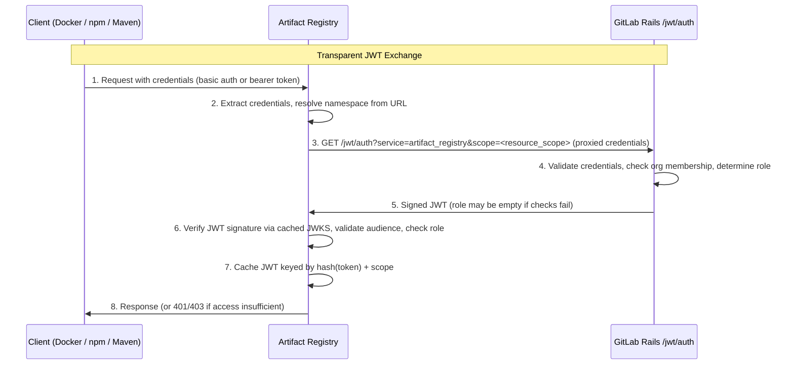
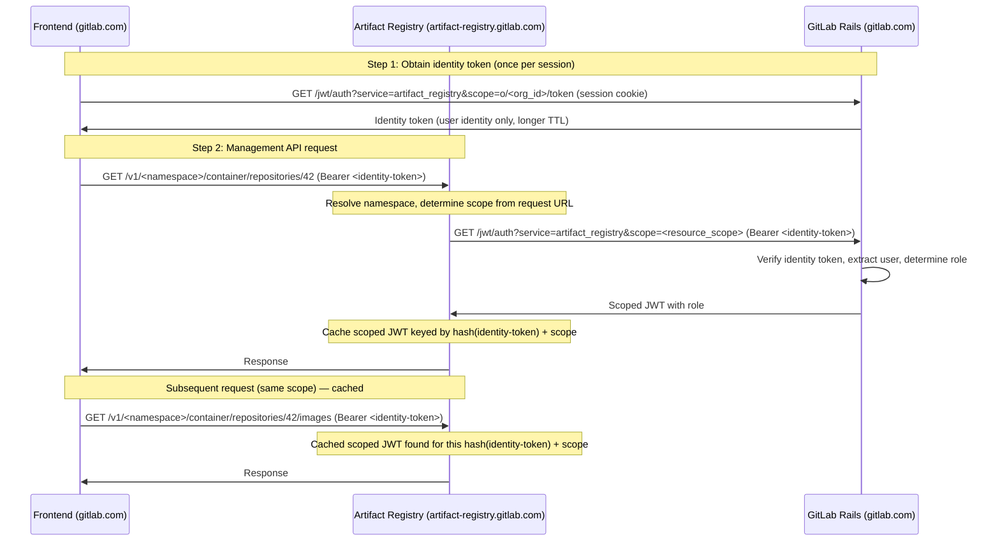

<!-- Design Documents often contain forward-looking statements -->
<!-- vale gitlab.FutureTense = NO -->

## ステータス

**一時停止中。** この ADR は改訂中です。以下の内容は古くなっている可能性があり、依拠すべきではありません。

## コンテキスト

Artifact Registry は、GitLab Rails モノリスから分離されたサテライトサービスです。クライアントは GitLab Rails が発行するトークン（PAT、グループ／プロジェクトアクセストークン、CI ジョブトークン）で認証しますが、Artifact Registry はこれらのトークンを直接検証できません。クライアントの認証情報を、Artifact Registry が信頼できる暗号的に検証可能な JWT に変換するためのトークン交換メカニズムが必要です。

加えて、Artifact Registry アドオンを持つ GitLab インスタンスのみがこのサービスを利用できるべきです。

3 つのアーティファクト形式は、認証情報をそれぞれ異なる方法で提示します:

- **Docker**: OCI トークン認証のチャレンジ／レスポンスを伴う HTTP ベーシック認証
- **Maven**: HTTP ベーシック認証またはカスタム HTTP ヘッダー
- **npm**: Bearer トークン

これらのプロトコルの違いにもかかわらず、すべてのクライアントは同じ認証パターンを使用します: Artifact Registry が、クライアントと GitLab Rails のトークン交換エンドポイントとの唯一の仲介者として機能します。これは、Artifact Registry が GitLab Rails との JWT 交換のためのスコープを構成する前に、リクエスト URL から名前空間を解決しなければならないために必要です <!-- TODO: link to ADR-022 once merged -->
（ADR-022: Namespace Decoupling を参照）。クライアントの認証情報は常に Artifact Registry を経由してプロキシされます。

### 既存のインフラストラクチャ

GitLab Rails には、Container Registry と Dependency Proxy が使用する JWT トークン交換エンドポイント（`GET /jwt/auth`）がすでにあります。このエンドポイントは:

- `Gitlab::Auth.find_for_git_client` を通じて認証情報を検証します。これは PAT、アクセストークン、CI ジョブトークンを統一的に処理します
- `JwtController` を介して `?service=` パラメータに基づいてサービスクラスにディスパッチします
- 検証用の公開鍵を JWKS エンドポイント（`/oauth/discovery/keys`）で公開します

## 決定

**GitLab Rails の既存の JWT トークン交換エンドポイント（`GET /jwt/auth`）を再利用し、Artifact Registry を新しいサービスオーディエンスとして追加する。**

すべてのクライアント認証は Artifact Registry を経由し、Artifact Registry が GitLab Rails とのトークン交換をプロキシします。

### トークン交換のカテゴリ

| カテゴリ | クライアント | 振る舞い |
|----------|---------|----------|
| **透過的 JWT 交換** | Docker (OCI), npm, Maven | クライアントが認証情報を Artifact Registry に送信し、Artifact Registry が名前空間を解決し、スコープを構成し、クライアントに代わって GitLab Rails との交換をプロキシします |
| **アイデンティティトークン交換** | フロントエンド | フロントエンドがセッションクッキー（同一ドメイン）を使用して GitLab Rails からアイデンティティトークンを取得し、それを Artifact Registry に送信して、Artifact Registry が透過的交換を実行します |

### 認証フロー

#### 透過的 JWT 交換



**凡例:**

| ステップ | 説明 |
|------|-------------|
| **1-2** | クライアントが認証情報を Artifact Registry に送信します。Registry は認証情報を抽出し、リクエスト URL から名前空間を解決します。Docker クライアントの場合、最初の未認証リクエストが `401 WWW-Authenticate` チャレンジをトリガーし、クライアントを（Rails に直接ではなく）Artifact Registry 独自のトークンエンドポイントへ誘導し、OCI トークン認証の互換性を維持します。 |
| **3-5** | Artifact Registry が、クライアントに代わって GitLab Rails とのトークン交換をプロキシします。Rails は認証情報を検証し、組織メンバーシップを確認し、ユーザーの権限に応じてロールを決定します。交換は常に成功します。権限が不十分であったりエンタイトルメントが欠けていたりした場合は、エラーではなくロールのない JWT が返されます。 |
| **6-8** | Artifact Registry は、キャッシュされた JWKS を介して JWT 署名を検証し、オーディエンスが `artifact_registry` であることを検証し（他のサービス向けに発行された JWT のリプレイを防止）、ロールが要求されたアクションに対して十分であることを確認し、JWT をキャッシュして、レスポンスを返します。 |

#### アイデンティティトークン交換

フロントエンドは GitLab モノリスのドメイン（例: `gitlab.com`）で動作します。Artifact Registry は別のドメイン（例: `artifact-registry.gitlab.com`）で動作します。セッションクッキーはモノリスドメインにバインドされており、`HttpOnly` であるため、クロスドメインで送信したり JavaScript から読み取ったりできません。フロントエンドは、Artifact Registry で認証するためのポータブルな認証情報、すなわちアイデンティティトークンを必要とします:



**凡例:**

| ステップ | 説明 |
|------|-------------|
| **ステップ 1** | フロントエンドが（セッションクッキーが自動的に送信される）同一ドメインで `/jwt/auth` を、アイデンティティトークンスコープを指定して呼び出します。Rails はアイデンティティトークン、すなわちユーザーのアイデンティティを保持するが認可情報は持たない JWT を返します。これはより長い TTL（例: 1 時間）を持ちます。フロントエンドはこのトークンをメモリにキャッシュします。 |
| **ステップ 2** | フロントエンドは、各 API リクエストとともにアイデンティティトークンを Artifact Registry に送信します。AR は名前空間を解決し、リクエスト URL からスコープを決定し、アイデンティティトークンを認証情報として使用して Rails との透過的交換を実行します。Rails は自身の署名を検証し、ユーザーのアイデンティティを抽出し、ロールを持つスコープ付き JWT を返します。次に AR はそのロールに基づいて認可を評価します。 |
| **キャッシュ** | AR は、(hash(identity-token) + scope) をキーとしてスコープ付き JWT をキャッシュします。同じスコープへの後続リクエストは 2 回目の交換をスキップします。キャッシュされたスコープ付き JWT が期限切れになると（15 分）、AR はアイデンティティトークンを使用して新しい透過的交換を実行します。これはフロントエンドからは見えません。 |

API クライアント（自動化スクリプト、CI/CD パイプライン）はアイデンティティトークンを必要としません。これらは認証情報（PAT、アクセストークン、CI ジョブトークン）を Artifact Registry に直接送信し、Artifact Registry が透過的交換を通じてそれらを処理します。

### スコープの取り扱い

すべてのクライアントが透過的交換を使用するため、Artifact Registry はリクエスト URL から名前空間を解決し、GitLab Rails へプロキシする際にスコープを構成します。2 つのスコープレベルが存在します:

- `organization:<org_id>:<actions>` -- registry レベルのスコープ。レジストリ全体に適用される操作に使用されます
- `repository:o/<org_id>/<repository_path>:<actions>` -- repository レベルのスコープ。特定のリポジトリに対する操作に使用されます

アイデンティティトークンは専用のスコープ形式を使用します:

- `o/<org_id>/token` -- `/jwt/auth` からアイデンティティトークンを取得するために使用されます

### トークンタイプ

#### `/jwt/auth` が受け付けるもの（入力）

以下の認証情報タイプが JWT トークン交換エンドポイントによって受け付けられます。すべて GitLab の既存のトークン検証レイヤーを通じて検証されます:

- **PAT および CI ジョブトークン** は `User` に解決されます。組織メンバーシップはユーザーに対して確認されます。
<!-- TODO: link to ADR-021 once merged -->
- **グループ／プロジェクトアクセストークン** は、専用のグループまたはプロジェクト上で特定のアクセスレベルを持つボット `User` に解決されます。専用エンティティ上のトークンのアクセスレベルが、Artifact Registry のロールを直接決定します（ADR-021: Authorization を参照）。これにより、GitLab の既存の RBAC モデルと Artifact Registry の権限モデルとの間にクリーンなマッピングが提供されます。
- **セッションクッキー** は、`/jwt/auth` への同一ドメインリクエストでブラウザによって自動的に送信されます。アイデンティティトークンの取得のためだけに使用されます。ドメインをまたぐことはできません。
- **アイデンティティトークン** は、ユーザーのアイデンティティを保持する、以前に Rails によって発行された JWT です。Artifact Registry は透過的交換の際にそれらを `/jwt/auth` に提示します。Rails は自身の署名を検証し、ユーザーのアイデンティティを抽出します。

#### `/jwt/auth` が発行するもの（出力）

エンドポイントは、要求されたスコープに応じて 2 つの JWT タイプのいずれかを返します:

- **スコープ付き JWT** — リソーススコープ（registry レベルまたは repository レベル）に対して発行されます。要求されたリソースに対するユーザーの Artifact Registry ロールを保持します。デフォルト TTL: 15 分。[スコープ付き JWT の構造](#scoped-jwt-structure) を参照してください。
- **アイデンティティトークン** — `o/<org_id>/token` スコープに対して発行されます。Artifact Registry で認証するためのポータブルな認証情報としてフロントエンドが使用します。[アイデンティティトークン](#identity-token) を参照してください。

### 署名鍵

組織ごとの専用 RSA 署名鍵で、`Organizations::OrganizationSetting` に暗号化して保存され、OpenID Connect (OIDC) や CI JWT 署名鍵から独立しています。組織ごとに独立してローテーション可能です。公開鍵は組織スコープの JWKS エンドポイント（`/o/<org-path>/oauth/discovery/keys`）で公開されます。Artifact Registry は、サービスを提供する各組織について JWKS を取得してキャッシュします。マルチテナントのデプロイでは、これは複数の組織の公開鍵をキャッシュし、それらを独立してリフレッシュすることを意味し、単一のインスタンス全体の鍵と比較して、メモリ使用量と GitLab Rails への発信リクエスト数が増加します。

### スコープ付き JWT の構造

<!-- TODO: link to ADR-021 once merged -->
スコープ付き JWT には、標準的なクレームと Artifact Registry ロールが含まれます。ロールは、シャドウのトップレベルグループまたはプロジェクト上のユーザーのアクセスレベルと、組織のオーナーシップなどのその他の条件から Rails によって導出されます（ADR-021: Authorization を参照）:

```json
{
  "iss": "gitlab.example.com",
  "aud": "artifact_registry",
  "sub": "username",
  "user_id": 42,
  "organization_id": 123,
  "scope": "repository:o/123/container/hosted/repo-a:pull",
  "role": "contributor"
}
```

トークンの有効期間は、新しい `artifact_registry_token_expire_delay` アプリケーション設定を通じて構成可能です。

### アイデンティティトークン

スコープが `o/<org_id>/token` のときに発行される JWT です。ユーザーのアイデンティティを保持しますが、認可情報は持ちません:

```json
{
  "iss": "gitlab.example.com",
  "aud": "artifact_registry",
  "sub": "username",
  "user_id": 42,
  "organization_id": 123,
  "scope": "o/123/token"
}
```

- 付与されたアクションやアクセスレベルを保持しません — 純粋にアイデンティティトークンです
- 認可情報を持たないため、より長い TTL（例: 1 時間）を持ちます
- ポータブルな認証情報として使用されます: フロントエンドがそれを Artifact Registry に送信し、Artifact Registry が透過的交換を実行して特定のリソースに対するスコープ付き JWT を取得します
- Rails は自身の署名を検証してユーザーのアイデンティティを抽出することで、アイデンティティトークンを検証します
- アイデンティティトークンが期限切れになると、Artifact Registry は 401 を返し、フロントエンドはセッションクッキーを介して新たに取得します

### JWT のキャッシュ

Artifact Registry は、リクエストごとに `/jwt/auth` にアクセスするのを避けるため、受信した認証情報のハッシュとスコープをキーとしてスコープ付き JWT をキャッシュします。認証情報は決して平文で保存されません — そのハッシュのみがキャッシュキーとして使用されます。キャッシュはトークンの有効期間とともに自動的に期限切れになり、期限切れの認証情報が新しい交換をトリガーすることと、キャッシュ領域が際限なく増大しないことを保証します。

例:

- Maven クライアントが PAT で認証してリポジトリ A からダウンロードします。AR は PAT をスコープ付き JWT に交換し、それを `(hash(PAT), repository:o/1/maven/hosted/repo-a:pull)` の下にキャッシュします。リポジトリ A からの後続のダウンロードはキャッシュされた JWT を再利用します。リポジトリ B へのリクエストは新しい交換と別個のキャッシュエントリをトリガーします。
- フロントエンドは、コンテナリポジトリ内のイメージを一覧表示するために、そのアイデンティティトークン（ステップ 1 で Rails から取得した JWT）を送信します。AR はそれをスコープ付き JWT に交換し、`(hash(identity-token-JWT), repository:o/1/container/hosted/repo-c:pull)` の下にキャッシュします。同じリポジトリへの後続リクエストはキャッシュされた JWT を再利用します。別のリポジトリへのリクエストは新しい交換をトリガーします。
- キャッシュされたスコープ付き JWT が期限切れになると（15 分）、同じ認証情報とスコープでの次のリクエストが新しい交換をトリガーします。

### インスタンスレベルのエンタイトルメント

| 強制ポイント | 場所 | メカニズム | 目的 |
|---|---|---|---|
| スコープ決定 | GitLab Rails | JWT スコープ解決中のアドオンチェック | Artifact Registry アドオンを持たないインスタンスは、ロールのない JWT を受け取る |

[Container Registry 認証サービス](https://gitlab.com/gitlab-org/gitlab/-/blob/master/app/services/auth/container_registry_authentication_service.rb) と同じパターンに従い、JWT 交換は常に成功し、署名されたトークンを返します。権限とメンバーシップの失敗は、認証エラーではなくロールのないトークンになります。Artifact Registry は、JWT に含まれるロールに基づいてアクセスを強制します。

### トランスポートセキュリティ

Artifact Registry は、クライアントの認証情報を GitLab Rails の `/jwt/auth` エンドポイントにプロキシします。これらの認証情報の漏洩はサプライチェーンセキュリティのリスクをもたらすため、この通信は認証情報の傍受を防ぐために保護されなければなりません。Artifact Registry と GitLab Rails の間で、双方が互いを認証するように相互 TLS (mTLS) が必要です。実装の詳細（専用の内部エンドポイント、インフラストラクチャレベルの強制）は、実装前に Infrastructure チームと議論されます。

## 結果

### ポジティブ

1. **実証済みのインフラストラクチャの再利用**: JWT トークン交換エンドポイント、トークン検証レイヤー、JWKS エンドポイントは、Container Registry と Dependency Proxy によって実戦で鍛えられています
1. **GitLab Rails の変更が最小限**: 新しい認証システムを構築するのではなく、既存のコントローラーに新しいサービスオーディエンスを追加します
1. **一貫した認証体験**: PAT、アクセストークン、CI ジョブトークンは、他の GitLab サービスと同じように機能します
1. **クリーンなアクセスレベルマッピング**: グループ／プロジェクトアクセストークンは専用エンティティ上に明示的なアクセスレベルを持ち、Artifact Registry ロールへの直接的で監査可能なマッピングを提供します
1. **単一の交換パターン**: すべてのクライアントが Artifact Registry を通じて透過的交換を使用します。これによりアーキテクチャが簡素化され、Artifact Registry が名前空間の解決、スコープの構成、キャッシュを統一的に処理できるようになります
1. **クロスドメインフロントエンドのサポート**: アイデンティティトークンパターンは、セキュリティを損なうことなく（セッションクッキーの共有なし、`HttpOnly` のバイパスなし）クロスドメイン認証の課題を解決します

### ネガティブ

1. **認証における GitLab Rails への依存**: 新しいセッションごとに `/jwt/auth` へのラウンドトリップが必要です。GitLab Rails がダウンしていると、新しい JWT を発行できません（既存のキャッシュされた JWT は期限切れまで機能し続けます）
<!-- TODO: link to ADR-021 once merged -->
1. **アクセストークンの管理**: グループ／プロジェクトアクセストークンは、通常の GitLab プロジェクトではなく、Artifact Registry の認可モデルによって管理される専用のグループまたはプロジェクト上で作成されなければなりません（ADR-021: Authorization を参照）。これらはシャドウエンティティ上の標準的な GitLab アクセストークンであるため、既存の API を通じて管理は容易です

### 緩和策

- **JWT のキャッシュ**: トークンを有効期間いっぱいキャッシュすることで `/jwt/auth` への負荷を軽減します。これは、多くのリクエストをバースト的にトリガーする Maven/npm の依存関係解決にとって重要です
- **15 分のトークン有効期間**: 露出ウィンドウを制限しつつ、交換の頻度を削減します
- **アイデンティティトークンのキャッシュ**: アイデンティティトークンのより長い TTL（1 時間）と Artifact Registry 側でのスコープ付き JWT のキャッシュにより、2 段階の交換はスコープごとの最初のリクエストでのみ追加コストが発生します

## 将来の代替案

### GitLab Adaptive Trust Environment (GATE)

認証アーキテクチャをリファクタリングして一元化する取り組みが進行中です（関連 [エピック](https://gitlab.com/groups/gitlab-org/-/work_items/17711)）。サービス指向アーキテクチャとともに、これらの取り組みは Artifact Registry が利用できる認証と認可のプリミティブを提供します。

Artifact Registry のタイムラインがこれらの取り組みのタイムラインと互換性がないため、私たちは別のアプローチを使用する必要があります。しかし、一元化された認証プラットフォームが実現したら、Artifact Registry の認証はそれに移行すべきです。

## 参照

- [認証の調査](https://gitlab.com/gitlab-org/gitlab/-/issues/589257#note_3081520361)
- [ADR-001: Organizations as Anchor Point](001_organizations_as_anchor_point.md)
<!-- TODO: link to ADR-021 once merged -->
- ADR-021: Authorization
<!-- TODO: link to ADR-022 once merged -->
- ADR-022: Namespace Decoupling
- [Container Registry Token Authentication](https://docs.docker.com/registry/spec/auth/token/)
- [OCI Distribution Spec - Authentication](https://github.com/opencontainers/distribution-spec/blob/main/spec.md#authentication)
