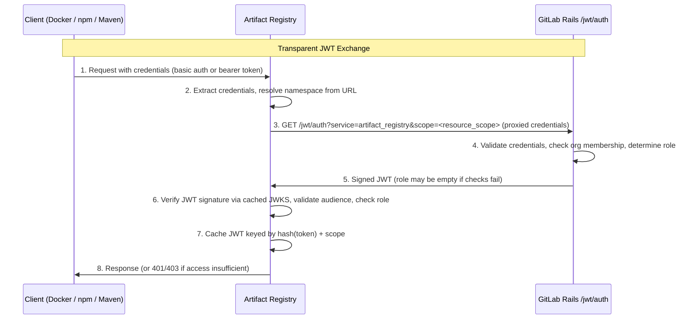
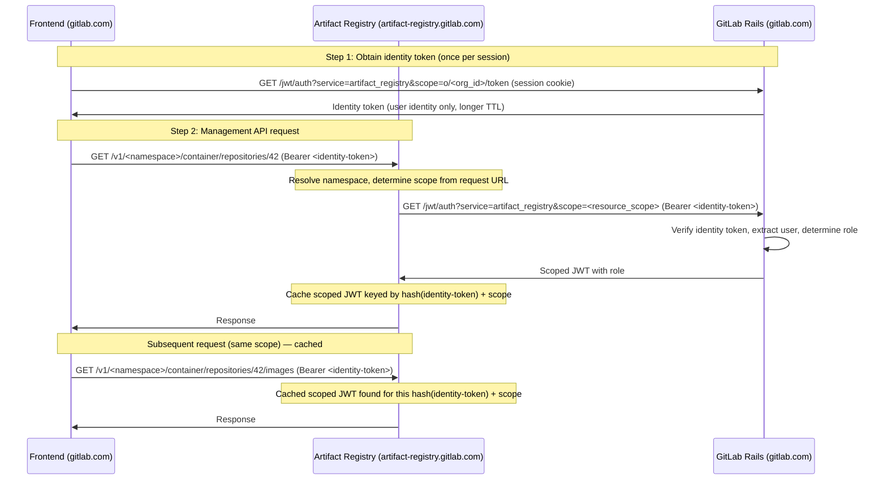

<!-- Design Documents often contain forward-looking statements -->
<!-- vale gitlab.FutureTense = NO -->

## ステータス

**一時停止中。** この ADR は改訂中です。以下の内容は古くなっている可能性があり、依拠すべきではありません。

## コンテキスト

Artifact Registry は GitLab Rails モノリスから分離されたサテライトサービスです。クライアントは GitLab Rails が発行するトークン（PAT、グループ/プロジェクトアクセストークン、CI ジョブトークン）で認証しますが、Artifact Registry はこれらのトークンを直接検証できません。クライアントの認証情報を Artifact Registry が信頼できる暗号学的に検証可能な JWT に変換するためのトークン交換メカニズムが必要です。

加えて、Artifact Registry アドオンを持つ GitLab インスタンスのみがサービスを使用できる必要があります。

3 つのアーティファクトフォーマットは、認証情報を異なる方法で提示します:

- **Docker**: HTTP Basic 認証と OCI トークン認証チャレンジ/レスポンス
- **Maven**: HTTP Basic 認証またはカスタム HTTP ヘッダー
- **npm**: Bearer トークン

これらのプロトコルの違いにもかかわらず、すべてのクライアントは同じ認証パターンを使用します: Artifact Registry はクライアントと GitLab Rails のトークン交換エンドポイントとの間の唯一の仲介者として機能します。これは、Artifact Registry が GitLab Rails との JWT 交換のスコープを構成する前にリクエスト URL からネームスペースを解決する必要があるため必要です <!-- TODO: link to ADR-022 once merged -->
（ADR-022: ネームスペースデカップリングを参照）。クライアントの認証情報は常に Artifact Registry を通じてプロキシされます。

### 既存のインフラ

GitLab Rails には、Container Registry と Dependency Proxy で使用されている JWT トークン交換エンドポイント（`GET /jwt/auth`）がすでに存在します。このエンドポイントは:

- `Gitlab::Auth.find_for_git_client` を通じて認証情報を検証し、PAT、アクセストークン、CI ジョブトークンを統一的に処理します
- `JwtController` 経由で `?service=` パラメーターに基づいてサービスクラスにディスパッチします
- 検証用の公開鍵を JWKS エンドポイント（`/oauth/discovery/keys`）で公開します

## 決定

**GitLab Rails の既存の JWT トークン交換エンドポイント（`GET /jwt/auth`）を再利用し、Artifact Registry を新しいサービスオーディエンスとして追加します。**

すべてのクライアント認証は Artifact Registry を経由し、GitLab Rails とのトークン交換をプロキシします。

### トークン交換カテゴリ

| カテゴリ | クライアント | 動作 |
|----------|--------------|------|
| **透過的 JWT 交換** | Docker (OCI)、npm、Maven | クライアントは認証情報を Artifact Registry に送信し、Artifact Registry はネームスペースを解決し、スコープを構成し、クライアントに代わって GitLab Rails との交換をプロキシします |
| **アイデンティティトークン交換** | フロントエンド | フロントエンドは（同一ドメインの）セッションクッキーを使用して GitLab Rails からアイデンティティトークンを取得し、それを Artifact Registry に送信して透過的な交換を実行します |

### 認証フロー

#### 透過的 JWT 交換



**凡例:**

| ステップ | 説明 |
|---------|------|
| **1-2** | クライアントは認証情報を Artifact Registry に送信します。Registry は認証情報を抽出し、リクエスト URL からネームスペースを解決します。Docker クライアントの場合、最初の認証されていないリクエストは `401 WWW-Authenticate` チャレンジをトリガーし、クライアントを Rails ではなく Artifact Registry 自身のトークンエンドポイントに誘導します（OCI トークン認証の互換性を保持）。 |
| **3-5** | Artifact Registry はクライアントに代わって GitLab Rails とのトークン交換をプロキシします。Rails は認証情報を検証し、組織メンバーシップを確認し、ユーザー権限に応じて役割を決定します。交換は常に成功します。権限不足やエンタイトルメント欠如は、エラーではなく役割なしの JWT を返します。 |
| **6-8** | Artifact Registry はキャッシュされた JWKS を介して JWT 署名を検証し、オーディエンスが `artifact_registry` であることを検証し（他のサービス向けに発行された JWT のリプレイを防ぐ）、リクエストされたアクションに対して役割が十分であることを確認し、JWT をキャッシュし、レスポンスを提供します。 |

#### アイデンティティトークン交換

フロントエンドは GitLab モノリスドメイン（例: `gitlab.com`）で動作します。Artifact Registry は別のドメイン（例: `artifact-registry.gitlab.com`）で動作します。セッションクッキーはモノリスドメインにバインドされ `HttpOnly` であるため、クロスドメインで送信したり JavaScript で読み取ったりすることはできません。フロントエンドは Artifact Registry で認証するためのポータブルな認証情報、つまりアイデンティティトークンを必要とします:



**凡例:**

| ステップ | 説明 |
|---------|------|
| **ステップ 1** | フロントエンドは同一ドメインで `/jwt/auth` を呼び出します（セッションクッキーは自動送信）し、アイデンティティトークンスコープを指定します。Rails はアイデンティティトークン（ユーザーのアイデンティティを伝えるが認可情報は含まない JWT）を返します。より長い TTL（例: 1 時間）を持ちます。フロントエンドはこのトークンをメモリにキャッシュします。 |
| **ステップ 2** | フロントエンドは API リクエストごとにアイデンティティトークンを Artifact Registry に送信します。AR はネームスペースを解決し、リクエスト URL からスコープを決定し、アイデンティティトークンを認証情報として Rails と透過的な交換を実行します。Rails は自身の署名を検証し、ユーザーアイデンティティを抽出し、役割付きのスコープ付き JWT を返します。AR は役割に基づいて認可を評価します。 |
| **キャッシング** | AR は (hash(identity-token) + scope) をキーとしてスコープ付き JWT をキャッシュします。同じスコープへの後続のリクエストは 2 番目の交換をスキップします。キャッシュされたスコープ付き JWT が期限切れになると（15 分）、AR はアイデンティティトークンを使って新しい透過的交換を実行します - フロントエンドからは見えません。 |

API クライアント（自動化スクリプト、CI/CD パイプライン）はアイデンティティトークンを必要としません。認証情報（PAT、アクセストークン、CI ジョブトークン）を直接 Artifact Registry に送信し、透過的な交換を通じて処理されます。

### スコープの扱い

すべてのクライアントが透過的な交換を使用するため、Artifact Registry はリクエスト URL からネームスペースを解決し、GitLab Rails にプロキシする際にスコープを構成します。2 つのスコープレベルが存在します:

- `organization:<org_id>:<actions>` -- レジストリレベルのスコープで、レジストリ全体に適用される操作に使用
- `repository:o/<org_id>/<repository_path>:<actions>` -- リポジトリレベルのスコープで、特定のリポジトリの操作に使用

アイデンティティトークンは専用のスコープ形式を使用します:

- `o/<org_id>/token` -- `/jwt/auth` からアイデンティティトークンを取得するために使用

### トークンタイプ

#### `/jwt/auth` で受け付ける（入力）

JWT トークン交換エンドポイントは以下の認証情報タイプを受け付けます。すべては GitLab の既存のトークン検証レイヤを通じて検証されます:

- **PAT と CI ジョブトークン** は `User` に解決します。組織メンバーシップはユーザーに対して確認されます。
<!-- TODO: link to ADR-021 once merged -->
- **グループ/プロジェクトアクセストークン** は、専用のグループまたはプロジェクトに対して特定のアクセスレベルを持つボット `User` に解決します。専用エンティティ上のトークンのアクセスレベルが直接 Artifact Registry の役割を決定します（ADR-021: 認可を参照）。これは、GitLab の既存の RBAC モデルと Artifact Registry の権限モデルの間の明確なマッピングを提供します。
- **セッションクッキー** は、ブラウザによって `/jwt/auth` への同一ドメインリクエストで自動送信されます。アイデンティティトークンの取得にのみ使用されます。ドメインを越えることはできません。
- **アイデンティティトークン** は、Rails が以前に発行したユーザーのアイデンティティを伝える JWT です。Artifact Registry は透過的な交換中に `/jwt/auth` に提示します。Rails は自身の署名を検証し、ユーザーアイデンティティを抽出します。

#### `/jwt/auth` で発行する（出力）

エンドポイントは、リクエストされたスコープに応じて 2 つの JWT タイプのいずれかを返します:

- **スコープ付き JWT** — リソーススコープ（レジストリレベルまたはリポジトリレベル）に対して発行されます。リクエストされたリソースに対するユーザーの Artifact Registry の役割を伝えます。デフォルト TTL: 15 分。[スコープ付き JWT 構造](#scoped-jwt-structure) を参照。
- **アイデンティティトークン** — `o/<org_id>/token` スコープに対して発行されます。フロントエンドが Artifact Registry で認証するためのポータブルな認証情報として使用します。[アイデンティティトークン](#identity-token) を参照。

### 署名鍵

組織ごとの専用 RSA 署名鍵で、`Organizations::OrganizationSetting` に暗号化されて保存され、OpenID Connect (OIDC) と CI JWT 署名鍵から独立しています。組織ごとに独立してローテーション可能です。公開鍵は組織スコープの JWKS エンドポイント（`/o/<org-path>/oauth/discovery/keys`）で公開されます。Artifact Registry はサービスを提供する各組織の JWKS を取得してキャッシュします。マルチテナントデプロイでは、これは複数の組織公開鍵をキャッシュし、それぞれを独立して更新することを意味し、単一インスタンス全体の鍵と比較してメモリ使用量と GitLab Rails への送信リクエスト数を増やします。

### スコープ付き JWT 構造 {#scoped-jwt-structure}

<!-- TODO: link to ADR-021 once merged -->
スコープ付き JWT には標準クレームと Artifact Registry の役割が含まれます。役割は、シャドウのトップレベルグループまたはプロジェクトでのユーザーのアクセスレベルと、組織オーナーシップなどの他の条件から Rails によって導出されます（ADR-021: 認可を参照）:

```json
{
  "iss": "gitlab.example.com",
  "aud": "artifact_registry",
  "sub": "username",
  "user_id": 42,
  "organization_id": 123,
  "scope": "repository:o/123/container/local/repo-a:pull",
  "role": "contributor"
}
```

トークンの有効性は、新しい `artifact_registry_token_expire_delay` アプリケーション設定を通じて設定可能です。

### アイデンティティトークン {#identity-token}

スコープが `o/<org_id>/token` の場合に発行される JWT。ユーザーのアイデンティティを伝えるが認可情報は含みません:

```json
{
  "iss": "gitlab.example.com",
  "aud": "artifact_registry",
  "sub": "username",
  "user_id": 42,
  "organization_id": 123,
  "scope": "o/123/token"
}
```

- 付与されたアクションやアクセスレベルは含まない - 純粋にアイデンティティトークン
- 認可情報を含まないため長い TTL（例: 1 時間）
- ポータブルな認証情報として使用: フロントエンドは Artifact Registry に送信し、Artifact Registry は特定リソース用のスコープ付き JWT を取得するために透過的な交換を実行
- Rails は自身の署名を検証し、ユーザーアイデンティティを抽出することでアイデンティティトークンを検証
- アイデンティティトークンが期限切れになると、Artifact Registry は 401 を返し、フロントエンドはセッションクッキー経由で再取得

### JWT キャッシング

Artifact Registry はリクエストごとに `/jwt/auth` をヒットすることを避けるため、入力認証情報とスコープのハッシュをキーとしてスコープ付き JWT をキャッシュします。認証情報は決して平文で保存されません - そのハッシュのみがキャッシュキーとして使用されます。キャッシュはトークンの寿命と共に自動期限切れし、期限切れの認証情報が新しい交換をトリガーし、キャッシュ空間が無制限に増加しないようにします。

例:

- Maven クライアントが PAT で認証してリポジトリ A からダウンロードします。AR は PAT をスコープ付き JWT に交換し、`(hash(PAT), repository:o/1/maven/local/repo-a:pull)` の下にキャッシュします。リポジトリ A からの後続のダウンロードはキャッシュされた JWT を再利用します。リポジトリ B へのリクエストは新しい交換と別のキャッシュエントリをトリガーします。
- フロントエンドはアイデンティティトークン（ステップ 1 で Rails から取得した JWT）を送信してコンテナリポジトリのイメージをリストします。AR はそれをスコープ付き JWT に交換し、`(hash(identity-token-JWT), repository:o/1/container/local/repo-c:pull)` の下にキャッシュします。同じリポジトリへのフォローアップリクエストはキャッシュされた JWT を再利用します。異なるリポジトリへのリクエストは新しい交換をトリガーします。
- キャッシュされたスコープ付き JWT が期限切れになると（15 分）、同じ認証情報とスコープでの次のリクエストは新しい交換をトリガーします。

### インスタンスレベルのエンタイトルメント

| 強制ポイント | 場所 | メカニズム | 目的 |
|---|---|---|---|
| スコープ決定 | GitLab Rails | JWT スコープ解決中のアドオンチェック | Artifact Registry アドオンを持たないインスタンスは、役割なしの JWT を受信します |

[Container Registry 認証サービス](https://gitlab.com/gitlab-org/gitlab/-/blob/master/app/services/auth/container_registry_authentication_service.rb) と同じパターンに従い、JWT 交換は常に成功し、署名されたトークンを返します。権限とメンバーシップの失敗は、認証エラーではなく役割なしのトークンを返します。Artifact Registry は JWT に存在する役割に基づいてアクセスを強制します。

### 通信のセキュリティ

Artifact Registry は GitLab Rails の `/jwt/auth` エンドポイントにクライアント認証情報をプロキシします。これらの認証情報の漏洩はサプライチェーンセキュリティリスクをもたらすため、この通信は認証情報の傍受を防ぐために保護される必要があります。Artifact Registry と GitLab Rails 間の相互 TLS (mTLS) が必要であり、双方が互いを認証します。実装の詳細（専用内部エンドポイント、インフラレベルの強制）は実装前にインフラチームと議論されます。

## 帰結

### ポジティブ

1. **実証済みインフラの再利用**: JWT トークン交換エンドポイント、トークン検証レイヤ、JWKS エンドポイントは Container Registry と Dependency Proxy によって本番テストされています
1. **GitLab Rails への最小限の変更**: 既存のコントローラに新しいサービスオーディエンスを追加するだけで、新しい認証システムの構築ではありません
1. **一貫した認証体験**: PAT、アクセストークン、CI ジョブトークンは他の GitLab サービスと同じように動作します
1. **明確なアクセスレベルマッピング**: グループ/プロジェクトアクセストークンは専用エンティティ上で明示的なアクセスレベルを持ち、Artifact Registry の役割への直接的かつ監査可能なマッピングを提供します
1. **単一の交換パターン**: すべてのクライアントが Artifact Registry を通じた透過的な交換を使用します。これによりアーキテクチャがシンプルになり、Artifact Registry がネームスペース解決、スコープ構成、キャッシングを統一的に処理できます
1. **クロスドメインフロントエンドサポート**: アイデンティティトークンパターンは、セキュリティを損なうことなくクロスドメイン認証の課題を解決します（セッションクッキー共有なし、`HttpOnly` バイパスなし）

### ネガティブ

1. **認証における GitLab Rails への依存**: 新しいセッションごとに `/jwt/auth` への往復が必要です。GitLab Rails がダウンしている場合、新しい JWT は発行できません（既存のキャッシュされた JWT は期限切れまで動作し続けます）
<!-- TODO: link to ADR-021 once merged -->
1. **アクセストークン管理**: グループ/プロジェクトアクセストークンは、通常の GitLab プロジェクトではなく、Artifact Registry 認可モデル（ADR-021: 認可を参照）によって管理される専用のグループまたはプロジェクトで作成する必要があります。これらはシャドウエンティティ上の標準 GitLab アクセストークンであるため、管理は既存 API を通じて簡単です

### 緩和策

- **JWT キャッシング**: トークンを完全な寿命キャッシュすることで `/jwt/auth` の負荷を削減します。これは、バーストで多くのリクエストをトリガーする Maven/npm 依存関係解決にとって重要です
- **15 分のトークン寿命**: 露出ウィンドウを制限しつつ、交換頻度を削減します
- **アイデンティティトークンキャッシング**: アイデンティティトークンの長い TTL（1 時間）と Artifact Registry 側でのスコープ付き JWT キャッシングにより、2 段階交換はスコープごとの最初のリクエストでのみ追加コストが発生します

## 将来の代替案

### GitLab Adaptive Trust Environment (GATE)

認証アーキテクチャをリファクタリングして集中化する継続的な取り組みがあります（関連 [epic](https://gitlab.com/groups/gitlab-org/-/work_items/17711)）。サービス指向アーキテクチャと共に、これらの取り組みは Artifact Registry が使用できる認証と認可のプリミティブを提供します。

Artifact Registry のタイムラインはこれらの取り組みのタイムラインと互換性がないため、別のアプローチを使用する必要があります。しかし、集中型認証プラットフォームが実現したら、Artifact Registry の認証はそれに移行すべきです。

## 参考文献

- [認証調査](https://gitlab.com/gitlab-org/gitlab/-/issues/589257#note_3081520361)
- [ADR-001: アンカーポイントとしての組織](001_organizations_as_anchor_point.md)
<!-- TODO: link to ADR-021 once merged -->
- ADR-021: 認可
<!-- TODO: link to ADR-022 once merged -->
- ADR-022: ネームスペースデカップリング
- [Container Registry トークン認証](https://docs.docker.com/registry/spec/auth/token/)
- [OCI Distribution Spec - 認証](https://github.com/opencontainers/distribution-spec/blob/main/spec.md#authentication)
