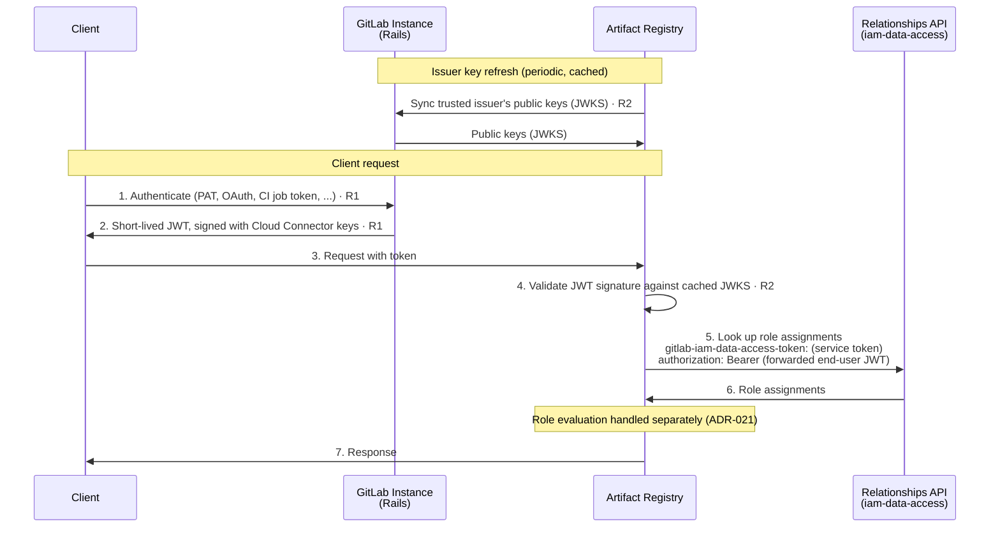

<!-- Design Documents often contain forward-looking statements -->
<!-- vale gitlab.FutureTense = NO -->

## ステータス {#status}

**提案中。**

この ADR は **認証** のみを扱います。つまり、呼び出し元のアイデンティティをどう確立するかです。**認可**（ロール、ポリシー評価、ロール割り当て）は、ADR-021: 認可 で別途扱われます。
<!-- TODO: link to ADR-021 once merged — https://gitlab.com/gitlab-com/content-sites/handbook/-/merge_requests/18717 -->

## コンテキスト {#context}

クライアントは、専用の API エンドポイントを通じて自身の GitLab Rails インスタンスが発行する短命のトークンを使用して、Artifact Registry に認証します。Artifact Registry はこれらのトークンをローカルで検証し、その発行には関与しません。

Auth Platform チームとの契約は [Artifact Registry と Auth Platform のインターフェイス合意](../agreements/auth.md) であり、これは Artifact Registry が必要とするものを 6 つの要件（R1〜R6）にわたって定義します。この ADR は、その認証要件、すなわち R1（トークン交換）、R2（トークン検証）、R3（トークンペイロード）を消費します。

## 決定 {#decision}

**Artifact Registry は、専用のトークン交換 API エンドポイントを通じて GitLab Rails が発行する短命のトークンをローカルで検証することにより、クライアントを認証する。**

### イテレーションのスコープ {#iteration-scope}

最初のイテレーションは、同一境界のトポロジー（`.com ↔ .com`、`SM ↔ SM`）を対象とします。ここでは単一のインスタンスが単一の信頼アンカーを持ちます。Rails が Cloud Connector v1 キーでトークンに署名し、`gitlab_instance_uid` はペイロードから省略されます。クロス境界のトポロジー（複数のセルフマネージドインスタンスが 1 つの SaaS Artifact Registry を共有する）は、フォローアップのイテレーションです。

### 非本番開発モード {#non-production-development-mode}

上記の決定は、実際のアーティファクトを提供するすべてのデプロイメントに適用されます。Artifact Registry は**非本番開発モード**もサポートし、トークンを発行または署名する GitLab インスタンスが利用できない環境、つまりローカルチェックアウトやテスト環境でも実行できます。このモードはデフォルトでオフであり、トークン交換の設定とは排他的です。両方を設定すると、設定読み込み時に拒否されます。

このモードでは、Artifact Registry は Rails が発行したトークンではなく、開発専用の認証情報で認証します。その 2 つの特性は、上記の決定に反します。

1. **プリンシパルを確立しません。** [R3 ペイロードクレーム](#token-payload-r3)を一切持たず、`sub` も `gitlab` コンテキストもありません。そのため、この認証情報で認証されたリクエストは、サブジェクトのないアイデンティティに解決されます。
1. **短命で発行されるものではなく、長寿命で静的です。** デプロイメントの存続期間中に一度だけ設定されるため、[帰結](#consequences)に記載した、短い TTL によって漏えいしたトークンの露出を制限するという考え方は適用されません。

その帰結は記載どおり成立します。このモードでは実際のプリンシパルを受け入れず、本番データも保持しないためです。なりすます対象も、アクセスできる価値のあるものもない場所では、短い TTL が制限する露出は生じません。この ADR が対象とするトポロジーでは、このモードは決して実行されず、それらに対する決定は変わりません。

同じ認証情報は、[GitLab Rails から Artifact Registry の内部 API へ](#gitlab-rails-to-the-artifact-registry-internal-api)の接続でも、本番デプロイメントがその接続で使うヘッダー内のサービストークンとして機能します。したがって、このモードでは、[2 つのレイヤー](#the-two-layers)に記載した、エンドユーザーから決して見えないデプロイ認証情報には該当しません。クライアント認証情報としてそれを提示する開発者は、この接続の認証情報も持っています。上記の 2 つの特性と同じ理由で、これは許容されます。実際のプリンシパルも本番データもなければ、認証情報を隠すべきエンドユーザーも、接続の向こう側にある価値のあるものもありません。それ以外の接続の仕組みは変わりません。サービストークンのレイヤーは引き続き適用され、同じ定時間比較と詳細を明かさない同じ `401` を使用し、構成によって異なるのは認証情報の入手元だけです。

このモードは、[ADR-021](021_authorization.md#non-production-development-mode)に記載した認可を強制しない構成と結び付いており、両者を個別に選択することはできません。[ADR-021](021_authorization.md#authorization-flow)は、関係のルックアップを行う前にプリンシパルのないリクエストを拒否し、識別できない呼び出し元に「存在するが禁止されている」という結果を返すことを認めません。そのため、この認証情報と認可を強制する構成を組み合わせると、ヘルスプローブは正常で設定検証も通る一方で、すべてのサーフェスのすべてのリクエストが拒否されます（[artifact-registry#982](https://gitlab.com/gitlab-org/ops/artifact-registry/-/work_items/982)）。両方を選択する単一のスイッチ（[artifact-registry#692](https://gitlab.com/gitlab-org/ops/artifact-registry/-/work_items/692)）により、その状態を単に防ぐのではなく、設定で表現できなくします。

このガードが制限するのは共存であり、デプロイではありません。トークン交換も IAM も設定していないデプロイメントはこのモードを実行でき、Artifact Registry 自身のエンドツーエンドテストクラスターでも実行しています。安全性を保つのは、実際のプリンシパルがないこと、認可を強制しないこと、そして起動時に警告をログに記録することです。

## アーキテクチャ上の制約 {#architectural-constraint}

[インターフェイス合意](../agreements/auth.md#no-callbacks-during-request-processing) からの 1 つの制約が、この決定を形作ります。

**リクエスト処理中のコールバックなし。** Artifact Registry は、**リクエストを処理している間**、GitLab インスタンスにコールバックすることは決してありません。この制約はそのインスタンスを対象とし、Artifact Registry 自体とともにデプロイおよびプロビジョニングされる依存関係は対象としません。認証のためのリモート依存性を 1 つ持っています。信頼された発行者の公開鍵を定期的に帯域外で同期することです（[トークン検証](#token-validation-r2) を参照）。しかしそれはリクエストごとではなく、リクエスト処理の外で発生します。これはクロス境界のセットアップで最も重要になります。SaaS Artifact Registry に接続するセルフマネージドインスタンスでは、そのインスタンスがネットワーク条件（ファイアウォール、エアギャップ環境）によって到達不能になる可能性があります。リクエストトークンを検証するために必要なものはすべて、トークン自体の中にあるか、すでにローカルにキャッシュされていなければなりません。これが、ローカルでステートレスな検証を最適化ではなく厳格な要件にしている理由です。

## 認証フロー {#authentication-flow}

トークンは Rails が発行し（R1）、Artifact Registry が、定期的に同期してキャッシュする信頼された発行者の公開鍵に対してローカルで検証します（R2）。以下の図は最初のイテレーションのフローを示しています。ロールルックアップが示されているのは、それが運ぶ認証情報のためだけであり、何を返すか、またそれらのロールをどのように評価するかは ADR-021 で扱います。


```mermaid
sequenceDiagram
    participant Client
    participant Rails as GitLab Instance<br/>(Rails)
    participant AR as Artifact Registry
    participant Rel as Relationships API<br/>(iam-data-access)

    Note over AR,Rails: Issuer key refresh (periodic, cached)
    AR->>Rails: Sync trusted issuer's public keys (JWKS) · R2
    Rails->>AR: Public keys (JWKS)

    Note over Client,AR: Client request
    Client->>Rails: 1. Authenticate (PAT, OAuth, CI job token, ...) · R1
    Rails->>Client: 2. Short-lived JWT, signed with Cloud Connector keys · R1
    Client->>AR: 3. Request with token
    AR->>AR: 4. Validate JWT signature against cached JWKS · R2
    AR->>Rel: 5. Look up role assignments<br/>gitlab-iam-data-access-token: (service token)<br/>authorization: Bearer (forwarded end-user JWT)
    Rel->>AR: 6. Role assignments
    Note over AR: Role evaluation handled separately (ADR-021)
    AR->>Client: 7. Response
```

**凡例:**

| ステップ | 説明 |
|------|-------------|
| **発行者キーのリフレッシュ** | Artifact Registry は、事前設定された信頼された発行者の公開鍵（JWKS）を同期し、キャッシュする。これは認証における唯一のリモート依存性であり、帯域外で発生する。リクエスト処理中に発生することは決してない。 |
| **1-2** | クライアントは、（Artifact Registry を通じてではなく）自身の GitLab インスタンスから直接、短命の JWT を取得する。Artifact Registry はクライアントの長命な認証情報を決して見ない。 |
| **3-4** | クライアントはトークンを Artifact Registry に提示し、Artifact Registry はキャッシュされた JWKS に対して署名を検証する。Rails へのコールバックは発生しない。 |
| **5-6** | Artifact Registry は relationships API を呼び出し、呼び出し元のロール割り当てを解決する。この呼び出しは 1 つではなく 2 つの認証情報、すなわち Artifact Registry 自身のサービストークンと、そのまま転送されるエンドユーザー JWT を運ぶ。[サービス間認証](#service-to-service-authentication) を参照。 |
| **7** | Artifact Registry がレスポンスを提供する。 |

## トークン発行 (R1) {#token-issuance-r1}

Rails は、クライアントの認証情報を受け付け、Artifact Registry に対して使用可能な短命のトークンを返す、専用のトークン交換 API エンドポイントを公開します。

1. **サポートされる認証情報の種類。** エンドポイントは、それぞれが `User` に解決される標準的な GitLab API の認証情報で呼び出し元を認証します。パーソナルアクセストークン（レガシーまたは粒度の細かいもの）、OAuth トークン、CI ジョブトークン、プロジェクト/グループアクセストークンです。**デプロイトークンは最初のイテレーションではサポートされません**。デプロイトークンは、最初のイテレーションでトークンを発行する唯一のプリンシパル型である `User` ではありません。型付けされた `sub` クレーム（[トークンペイロード](#token-payload-r3) を参照）は、後から他のプリンシパル型を受け入れられるように設計されているため、[R1](../agreements/auth.md#r1--token-exchange-service) のターゲットとして挙げられているデプロイトークンは、フォローアップとして追跡されます。
1. **クライアント側の交換。** トークン交換はクライアント側で行われます。クライアントは自身の GitLab インスタンスからトークンを取得し、それを Artifact Registry に提示します。Artifact Registry が交換を実行することは決してありません。エンドポイントは `curl`、`glab` CLI、または CI ジョブによって自動的に駆動できます。トークンは短命であるため、静的な認証情報を期待するネイティブなパッケージツール（例: Maven の `settings.xml` や npm の `.npmrc`）は、それを取得・リフレッシュするためのヘルパーツールを必要とします。Docker、Maven、npm にまたがるクライアントツールの設計は [クライアント認証情報管理の作業アイテム](https://gitlab.com/gitlab-org/gitlab/-/work_items/595150) で追跡されています。
1. **トークンの有効期間。** トークンはデフォルトの有効期間が 5 分、最大が 12 時間です。クライアントは、デフォルトより長いものを含め、1 秒から 12 時間の上限まで任意の有効期間を要求できます。クライアントが要求可能な TTL には AppSec のサインオフが必要です（[トークン交換の TTL に関する決定](https://gitlab.com/gitlab-org/gitlab/-/work_items/601469)）。この境界は、Maven/Gradle のビルドが処理の途中で期限切れにならない限りにおいて、[クライアント認証情報管理の作業アイテム](https://gitlab.com/gitlab-org/gitlab/-/work_items/595150) に文書化された委任認証レジストリの業界の前例に従います。
1. **有効化の強制。** トークン交換は、Artifact Registry を有効化していない organization に対しては失敗すべきです（R1、SHOULD）。これは可用性のゲートにすぎず、リポジトリごとの認可は Artifact Registry に留まります。このチェックは、organization レベルの有効化設定を所有する Rails 側で、トークン発行時に実行されます。アクセスは Unit Primitives やアドオンに依存しません。クレジットベースの課金モデルでは Artifact Registry アドオンが存在しないためです。Artifact Registry 側では、namespace レベルでアクセスを強制します。organization UUID であるトークンの `gitlab.origin_id` クレームは、namespace の owner anchor（[ADR-001](001_organizations_as_anchor_point.md)）の `entity_id` と一致しなければなりません。これは organization の認識を必要としない不透明な比較です。有効化は、権限を評価するのではなくトークンの *発行* をゲートするため、[ADR-021](021_authorization.md) ではなくここに記録されます。

## トークン検証 (R2) {#token-validation-r2}

トークンは、GitLab インスタンスの既存の Cloud Connector キー（`CloudConnector::Keys`）で署名された JWT です。Artifact Registry は起動時に **信頼された発行者**（自身の GitLab インスタンス）が設定され、その発行者の公開鍵（JWKS）を帯域外で同期します。受信した各トークンの署名を、それらの事前取得されたキーに対して検証します。バリデーターは署名アルゴリズムも固定し、間違ったオーディエンスや過去の `exp` を持つトークンを拒否します。

キーのキャッシュとリフレッシュは、既存の Cloud Connector のアプローチに従います（[R2](../agreements/auth.md#r2--token-validation) に従う）。キーはキャッシュされ、定期的にリフレッシュされ、リフレッシュが失敗した場合は古いキーが短時間保持されるため、キープロバイダーの一時的な不調が、その他の点で有効なトークンを拒否することはありません。キーのリフレッシュに関する未解決項目については、[将来の作業 / 未解決の議論](#future-work--open-debates) を参照してください。

Cloud Connector v1 の仕組みを再利用することで、最初のイテレーションはシンプルに保たれます。新しいキー配布インフラは不要です。ターゲット状態ではキー提供は GATE に移りますが、Artifact Registry 側のアクション、すなわちキャッシュされた信頼鍵に対して署名を検証することは変わりません。

## トークンペイロード (R3) {#token-payload-r3}

トークンは、コールバックなしでリクエストを認証するのに十分な情報を運びます。この例は CI ジョブトークンから発行されたトークンを示しており、ネストされた `gitlab.job` オブジェクトはその場合にのみ現れます。認証に関連するクレームは次のとおりです。

```json
{
  "jti": "5d250d2f-0e6c-4f7d-987b-222973bfb6af",
  "iss": "https://gitlab.example.com",
  "aud": ["gitlab-artifact-registry", "gitlab-iam-data-access"],
  "sub": "gid://gitlab/User/42",
  "iat": 1779870540,
  "nbf": 1779870540,
  "exp": 1779870840,
  "ver": 1,
  "gitlab": {
    "origin": "organization",
    "origin_id": "6f1a9c02-4b7e-4a3d-9f21-1c8b0d5e77a4",
    "local_id": 42,
    "identity_kind": "user",
    "organization_role": "owner",
    "job": {
      "project_id": 278964,
      "git_commit_sha": "e705c64cf239a2f3b0c6d1e8a9b4f5c6d7e8f9a0",
      "pipeline_id": 2870712707
    }
  }
}
```

1. `sub` — プリンシパルのアイデンティティ（R3）。素の数値 ID ではなく、GitLab の GlobalID（例: `gid://gitlab/User/42`）として表現される。値にプリンシパルの *型* をエンコードすることで、曖昧さがなくなり、クレームがその意味を変えることなく非 `User` プリンシパル（例: デプロイトークン）に拡張できる。
1. `iss` — 発行インスタンスの OIDC 発行者 URL。これは情報提供のみ（ログ記録される）であり、Artifact Registry はこれを検証鍵の選択に **使用しない**（[トークン検証](#token-validation-r2) を参照）。
1. `aud` — 2 つの値を運ぶ。クライアントが要求したオーディエンスである `gitlab-artifact-registry` と、`gitlab-iam-data-access` である。2 つ目の値により、Artifact Registry は同じトークンを変更せずに relationships API へ転送できる。[サービス間認証](#service-to-service-authentication) を参照。
1. `ver` — トークンペイロードのスキーマバージョン。現在は `1` であり、ペイロードの形状に破壊的変更がある場合にのみ上げられる。IAM のバリデーターはそれ以外の値を拒否する。
1. `gitlab` — 呼び出し元のコンテキストを運ぶネストされたオブジェクト。`origin`（`organization`。ローンチ時の唯一の値）、`origin_id`（organization の UUID）、`local_id`（ユーザー ID）、`identity_kind`（`user`）、`organization_role`（`owner` または `member`）を含む。 ネストされた `job` オブジェクトは、交換した認証情報が CI ジョブトークンであった場合にのみ現れます。
1. `gitlab.organization_role` は、認可を運ぶクレームを ADR-021 で扱うという以下のルールの唯一の例外である。ロール割り当てが存在する前に読み取られるため、relationships API を通じて解決できない。何を認可するか、すなわち R6 のブートストラップ要件については [ADR-021](021_authorization.md) を参照。
1. `gitlab.job` — 交換した認証情報が CI ジョブトークンだった場合にのみ存在します。`project_id`（ジョブが属するプロジェクトの数値 ID）、`git_commit_sha`（ジョブの実行対象となった完全なコミット SHA）、`pipeline_id`（ジョブを実行したパイプラインの数値 ID）を含みます。これらは、Artifact Registry のバージョンとコンテナーマニフェストにあるビルドの来歴フィールドを埋めるために存在します。現在はトークンにそれらを埋める情報がないため、これらのフィールドは null となっており、これらのクレームに認可上の意味はありません。ジョブトークンの交換では、ジョブのユーザー（そのビルドを実行した人。手動実行または再試行したジョブでは、パイプラインを起動したユーザーと異なる場合があります）として認証するため、`local_id` はこのビルドコンテキストとともに、引き続き実在の人物を示します。この変更は追加的なものであり、`ver` は 1 のままです。これらのクレームをまだ認識しない検証器は、問題なく無視します。利用側は、値の欠落や形式不正を「来歴なし」として扱い、それを理由にリクエストを失敗させてはいけません。[トークンペイロードの CI コンテキストのワークアイテム](https://gitlab.com/gitlab-org/gitlab/-/work_items/629690)を参照してください。ターゲット状態の `iam-sts`（ADR-016 / ADR-019）は、提示されたトークンからクレームをコピーすることしかできず、GitLab データベースの任意のレコードを読み取れないため、これらの値は交換する認証情報に含まれている必要があります。現在の暫定的な Rails エンドポイントは、認証済みのジョブレコードからこれらを読み取りますが、CI ジョブトークン自体にはプロジェクト ID（ルーティング用の `p` クレーム）しか含まれず、コミット SHA とパイプライン ID はありません。それらを CI ジョブトークンに追加するには、そのトークンを所有するチームと別途フォローアップする必要があります。
1. `jti`、`iat`、`nbf`、`exp` — 標準的な JWT クレーム。`exp = iat + ttl`。
1. `gitlab_instance_uid` は **現時点では省略される**。最初のイテレーションの同一境界トポロジーには単一の信頼アンカーがあるため、インスタンス識別子は不要である。それはクロス境界のフォローアップでのみ関連する。
1. **ロールやその他の認可を運ぶクレームは、ここではなく ADR-021 で説明される。** Artifact Registry はこのトークンを使用して、呼び出し元が *誰* であるかを確立する。*何ができるか* は別途評価される。認可が *ソース認証情報の種類*（例: PAT 対 CI ジョブトークン）も考慮しなければならないかどうかは、同様に ADR-021 の関心事である。
<!-- TODO: link to ADR-021 once merged — https://gitlab.com/gitlab-com/content-sites/handbook/-/merge_requests/18717 -->

## サービス間認証 {#service-to-service-authentication}

上記のセクションでは、Artifact Registry に到着するクライアントのリクエストを扱いました。GitLab 自身のサービス間の呼び出しには独自の答えが必要であり、そのような接続は 1 つではありません。このセクションでは、まず共通パターンを示し、次に各接続が何を運ぶかを説明します。

### 2 つのレイヤー {#the-two-layers}

1. **サービストークン。** 「呼び出し元プロセスは信頼されたピアサービスか」に答える。静的で対称な共有シークレットであり、SHA-512 ハッシュと定時間比較でチェックされる。アイデンティティを運ばないため、結果は受け入れまたは拒否のみである。
1. **呼び出し元のアイデンティティ。** 「この呼び出しは誰のために動作するか」に答える。呼び出しが誰かのために動作する場合にのみ存在する。現在はエンドユーザーの JWT であり、RS256 を使用し、発行者の JWKS に対して、発行者、オーディエンス、有効期限のチェックを伴って検証される。

どのレイヤーが適用されるかは接続によって異なります。エンドユーザーに代わって行われる呼び出しは両方を運びます。ユーザーによって開始されていない呼び出しには、2 番目のレイヤーで運ぶアイデンティティがないため、サービストークンだけが呼び出し元を認証します。適用されるレイヤーがどれであっても、そのすべてが必須です。いずれか 1 つでも失敗すると `Unauthenticated`（gRPC）または `401 Unauthorized`（HTTP）が返され、匿名モードはありません。サービストークンが単独で何かを認可することはありません。エンドユーザーのアイデンティティが存在する場合、認可はそのプリンシパルから派生します（[ADR-021](021_authorization.md) を参照）。

1. **認証情報名はサービスごとに異なる。** 各サービスは、受け入れるサービストークン認証情報に独自の名前を定義する。relationships API は `gitlab-iam-data-access-token` を、IAM auth サービスは `gitlab-iam-auth-token` を読み取る。名前を分けることで、リクエストログからどの呼び出し元がどのサービスにアクセスしたかを確認できる。
1. **拒否は、一方のレイヤーでは不透明で、もう一方では構造化される。** 拒否されたサービストークンは詳細を返さず、欠落と誤りは同じに見える。拒否された JWT は、オーディエンスの不一致、期限切れ、キーが見つからない、という理由を運ぶ。
1. **ローテーションにダウンタイムは不要。** バリデーターは現在のトークンと次のトークンを同時に受け入れるため、切り替えを調整せずにシークレットをローテーションできる。
1. **サービストークンはデプロイ認証情報である。** 呼び出し元サービスにシークレットとしてプロビジョニングされ、エンドユーザーから見えることはない。[非本番開発モード](#non-production-development-mode)が唯一の例外です。
1. **ヘルスチェックは両方のレイヤーをスキップする**ため、Kubernetes のプローブは認証情報なしで機能する。

### Artifact Registry から relationships API へ {#artifact-registry-to-the-relationships-api}

両方のレイヤーが適用されます。これは上記フローのステップ 5〜6 です。gRPC であり、サービストークンは `gitlab-iam-data-access-token` メタデータヘッダーで、JWT は Bearer トークンとして `authorization` ヘッダーで送られます。

各側が JWT を独立して検証します。Artifact Registry は入口で自身の期待するオーディエンスに対して検証し、relationships API は自身の側でもう一度検証します。両方のサービスに同じ検証ライブラリが組み込まれています。トークンの転送はチェックの委任ではなく、各側での完全かつ独立したチェックです。

データパスでは、Artifact Registry は `ReadRelationships` と `LookupResources` を呼び出し、クライアント自身のトークンを変更せずに転送するため、ユーザーのアイデンティティがエンドツーエンドで流れます。これは、Rails のトークン交換エンドポイントが、要求されたオーディエンス（`gitlab-artifact-registry`）と並べて、すべてのトークンの `aud` 配列に `gitlab-iam-data-access` を追加することで機能します。 `LookupResources` がこのパスに含まれるのは、Artifact Registry がリクエストごとにその結果をすべて取得し、リポジトリ一覧の可視範囲を呼び出し元自身への権限付与に基づいて制限するためです。IAM は、`organization` を起点とするサブジェクトの ID を、転送されたトークンの `gitlab.origin_id` と `gitlab.local_id` に照合し、呼び出し元自身の organization に属するサブジェクトについてのみ、この呼び出しを許可します。

管理フローと UI フローは異なります。`LookupSubjects`、`LookupRelationships`、`WriteRelationships`、`DeleteRelationships`、`DeleteRelationshipsByFilter` は Rails GraphQL ラッパーから呼び出されます。このラッパーは Rails のトークン発行者から、独自の `gitlab-iam-data-access` スコープのトークンを要求します。

この接続で除外されるヘルス RPC は、`grpc.health.v1.Health/Check`、`Watch`、`List`、および各サービス自身の `Health` RPC です。

### GitLab Rails から Artifact Registry の内部 API へ {#gitlab-rails-to-the-artifact-registry-internal-api}

サービストークンだけが適用されます。内部 API は [ADR-009](009_api_design.md) で定義された Rails 向け HTTP サーフェスです。これには、Rails が永続化する UUID を返す namespace 作成や、UUID をキーとする namespace 解決などがあります。これらの呼び出しはエンドユーザーに代わって行われないため、2 番目のレイヤーで運ぶアイデンティティはありません。

この接続は gRPC ではなく HTTP なので、認証情報は gRPC メタデータではなくリクエストヘッダーで送られます。それ以外のパターンは同じです。ここでのサービストークンは暫定的なメカニズムです。方向性については [将来の作業 / 未解決の議論](#future-work--open-debates) を参照してください。

## 検討した代替案 {#alternatives-considered}

この ADR は代替の認証アーキテクチャを比較検討しません。Artifact Registry 側の設計は、[Artifact Registry と Auth Platform のインターフェイス合意](../agreements/auth.md) から導かれます。Artifact Registry は R1〜R3 の要件を消費し、メカニズムはそれらをどう実装するかに関する Authentication チームの決定によって駆動されます。代替案はプラットフォーム側で評価されており（[モジュラーサービスモデルにおける認証および認可の方向性](https://gitlab.com/gitlab-org/gitlab/-/work_items/595148) を参照）、ここではスコープ外です。

## 帰結 {#consequences}

### ポジティブ {#positive}

1. **リクエスト処理中、Rails の可用性から独立している**: 検証がローカルでステートレスであるため、Artifact Registry は、発信元の GitLab インスタンスが到達不能なときでもリクエストを認証できる。
1. **短命のトークンが影響範囲を限定する**: Artifact Registry はクライアントの長命な GitLab 認証情報を決して扱わず、短命のトークンのみを扱う。そのため、漏洩したトークンはすぐに期限切れになり、PAT のような長命な認証情報の漏洩よりもはるかに少ない情報しか露出しない。
1. **プラットフォームの方向性に整合**: Artifact Registry は独自のフローを維持するのではなく、プラットフォームのトークン交換と検証のプリミティブを消費する（[モジュラーサービスモデルにおける認証および認可の方向性](https://gitlab.com/gitlab-org/gitlab/-/work_items/595148) に従う）。

### ネガティブ {#negative}

1. **暫定的には GitLab インスタンスへのコールバックが必要**: トークンを検証するために、Artifact Registry は GitLab インスタンスの OIDC エンドポイントから発行者キーを同期しなければならない（帯域外、リクエストごとではない）。最終状態の目標は、Artifact Registry が GitLab インスタンスへの接続性に一切依存しないことである。ターゲット状態は、GATE からキーを提供することでこれを達成する。
1. **Cloud Connector v1 の仕組みを再利用する**: 暫定的には、ターゲットの GATE 発行キーではなく、既存の Cloud Connector v1 のキーと OIDC エンドポイントに依存する。
1. **発行されたトークンは期限切れ前に失効できない**: 検証がローカルでコールバックもブロックリストもないため、発信元の認証情報が発行直後に失効されても（例: フィッシングされた PAT が 12 時間のトークンと交換される）、トークンは `exp` まで有効なままである。これは短い *デフォルト* TTL によって緩和され、ベータで受け入れられるトレードオフである。より強力な送信者バインディング（DPoP など）とキーローテーションは、将来の堅牢化として可能である。

### 緩和策 {#mitigations}

- Artifact Registry 側の検証ロジックは、暫定とターゲットの発行者で同一である。変わるのは発行者キーのソースだけであり、移行の影響範囲を限定する。

## 将来の作業 / 未解決の議論 {#future-work--open-debates}

これらは未解決の認証に関する問いであり、最初のイテレーションではスコープ外ですが、失われないように記録しています。ほとんどはクロス境界のフォローアップとターゲット（GATE）状態の周辺に集まっています。

1. **GATE のデプロイトポロジー。** ターゲット状態では、発行者キーは発行インスタンス自身の OIDC/JWKS エンドポイントではなく GATE が提供する。GATE がどのようにデプロイされるかに応じて、Artifact Registry は対応する GATE コンポーネントから発行者キーを取得する。デプロイトポロジーはまだ確定していない。
1. **クロス境界の発行者キーと `gitlab_instance_uid`。** 最初のイテレーションは単一の信頼アンカーがあるため `gitlab_instance_uid` を省略する。クロス境界のフォローアップでは、1 つの信頼アンカーの背後に多数のセルフマネージドインスタンスがあるため、トークンは発行インスタンスを識別しなければならない。`gitlab_instance_uid`（または同等のもの）の再導入と、それに伴う検証モデルの変更は未解決である。CI 固有のケース、すなわち SaaS Artifact Registry に接続するリモートランナーのための自動 `CI_JOB_TOKEN` 交換は、このフォローアップに含まれ、[リモート Runner 向け CI_JOB_TOKEN 交換の作業アイテム](https://gitlab.com/gitlab-org/gitlab/-/work_items/599087) で追跡されている。
1. **定期的な JWKS リフレッシュはまだ実装されていない。** [トークン検証 (R2)](#token-validation-r2) は望ましい状態を説明している。現在、共有検証ライブラリは起動時に JWKS を 1 度取得するだけで、定期的なリフレッシュも古いキーの保持も行わない。そのため、発行者の署名キーローテーション後に新しく署名されたトークンは、プロセスが再起動するまで拒否される。[JWKS リフレッシュの作業アイテム](https://gitlab.com/gitlab-org/gitlab/-/work_items/616174) で追跡されており、出荷された時点でこの項目は削除される。
1. **来歴に関する CI ジョブトークンのクレーム。** `iam-sts` が交換を担うようになると、GitLab のデータベースを照会できないため、`gitlab.job` のクレーム（`project_id`、`git_commit_sha`、`pipeline_id`）はすべて、提示された認証情報に由来する必要があります。現在の CI ジョブトークンにはプロジェクト ID しか含まれていません。コミット SHA とパイプライン ID の追加には、CI ジョブトークンを所有するチームとの別途のフォローアップが必要です。
1. **ターゲット状態のサービス認証情報。** サービストークンは暫定的なメカニズムである。方向性は、共有シークレットを相互 TLS とワークロードアイデンティティに置き換え、SPIFFE 形式の呼び出し元識別子を使用し、呼び出し元のアイデンティティを GitLab Unified Request Token（[URT](https://gitlab.com/gitlab-org/architecture/auth-architecture/design-doc/-/blob/main/glossary.md)）で運ぶことである。どちらの方向性も決定されておらず、URT はまだ存在しない。相互 TLS を再検討する条件を含む、クラスター内のトランスポートセキュリティについては、[ADR-024](024_infrastructure_delivery.md#transport-security)に記載しています。

## 参考文献 {#references}

1. [ADR-001: アンカーポイントとしての Organizations](001_organizations_as_anchor_point.md)
1. ADR-021: 認可 — 認可のための対をなす ADR
<!-- TODO: link to ADR-021 once merged — https://gitlab.com/gitlab-com/content-sites/handbook/-/merge_requests/18717 -->
1. [ADR-022: namespace の分離](022_namespace_decoupling.md)
1. [Artifact Registry と Auth Platform のインターフェイス合意](../agreements/auth.md) — ここで消費される R1〜R3（認証）の要件
1. [認証と認可の方向性に関する作業アイテム](https://gitlab.com/gitlab-org/gitlab/-/work_items/595148)
1. [リモートアーティファクトクライアントの認証情報管理](https://gitlab.com/gitlab-org/gitlab/-/work_items/595150)
1. [トークン交換エンドポイントの作業アイテム](https://gitlab.com/gitlab-org/gitlab/-/work_items/601475)
1. [GATE アイデンティティフェデレーション設計ドキュメント（境界をまたぐ認証）](https://gitlab.com/gitlab-org/architecture/auth-architecture/design-doc/-/blob/main/decisions/019-gate-identity-federation.md)
1. [RFC 2119](https://www.rfc-editor.org/rfc/rfc2119) — インターフェイス合意で使用される要件レベルのキーワード
1. [OCI Distribution 仕様 - 認証](https://github.com/opencontainers/distribution-spec/blob/main/spec.md#authentication)
1. [Container Registry のトークン認証](https://docs.docker.com/registry/spec/auth/token/)
1. [IAM サービスアクセスドキュメント](https://gitlab.com/gitlab-org/auth/iam/-/blob/main/docs/service-access.md) — IAM サービスが強制する 2 つの認証レイヤー
1. [IAM relationships API](https://gitlab.com/gitlab-org/auth/iam/-/blob/main/docs/relationships-api.md) — 契約と RPC ごとのトークン要件
