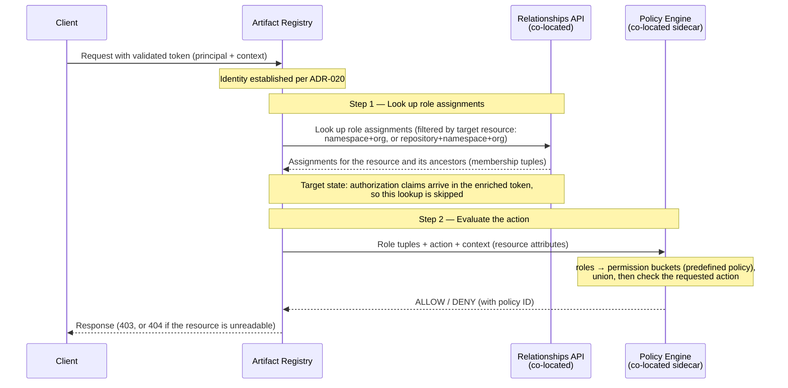

<!-- Design Documents often contain forward-looking statements -->
<!-- vale gitlab.FutureTense = NO -->

## ステータス

**提案中**

この ADR は**認可**のみを扱います。つまり、認証済みの呼び出し元が何を実行できるかです。**認証**（呼び出し元のアイデンティティがどのように確立されるか、トークンがどのように発行および検証されるか）は、[ADR-020: Authentication Flow](020_authentication_flow.md) で別途扱います。

## コンテキスト

Artifact Registry は、GitLab Rails モノリスとは別のサテライトサービス上で動作します。[ADR-020](020_authentication_flow.md) は、呼び出し元のアイデンティティをどのように確立するかを定めています。クライアントは短命のトークンを提示し、Artifact Registry はそれをローカルで検証し、リクエスト処理中に GitLab インスタンスへコールバックすることはありません。

この ADR は次の問いを扱います。**その呼び出し元は何を実行できるのか？**

Auth Platform チームとの契約は [Artifact Registry and Auth Platform interface agreement](../agreements/auth.md) であり、Artifact Registry が 6 つの要件（R1–R6）全体で必要とするものを定義しています。ADR-020 は認証要件（R1–R3）を扱います。この ADR は認可要件である **R4（ポリシー評価エンジン）**、**R5（relationships API）**、**R6（ブートストラップ）** を扱います。

### 権限モデル

操作を許可または拒否するために、Artifact Registry は 3 つの要素を評価します。

- **プリンシパル**: [ADR-020](020_authentication_flow.md) によって確立される、認証済みのユーザーまたはトークン保持者です。これはトークンの `sub` claim によって識別されます。トークンペイロードの形は [ADR-020](020_authentication_flow.md#token-payload-r3) で説明されています。すべての認証情報タイプ（personal、OAuth、CI job、group、project access token）は同じ `User` プリンシパルに解決されるため、**クローズドベータでは、使用された認証情報に関係なく、プリンシパルのみで認可します**。そのため、漏えいした CI job token はユーザーの完全な権限を持ちます。これはクローズドベータ向けの意図的なトレードオフです（トークンはデフォルトで短命です。[ADR-020](020_authentication_flow.md) を参照）。認証情報タイプごとに認可を区別することは[未解決の問い](#open-questions)です。
- **操作**: リポジトリ管理操作とアーティファクト操作の 2 種類があります。[ADR-009](009_api_design.md) で詳細に説明されています。
- **リソース**: リソースは 2 つのレベルに存在します。namespace（レジストリ全体。[ADR-022](022_namespace_decoupling.md) を参照）または個別リポジトリです。ロールはこれらのレベルで割り当てられます（[ロール割り当て](#role-assignment)を参照）。クローズドベータでは、namespace は organization と 1 対 1 で対応します。

Artifact Registry は**ロールと権限**のモデルを使用します。

- **ロール**は、リソースのコンテキストで_プリンシパルが誰であるか_を定義します。プリンシパルには [relationships API](#role-assignment)（R5）を通じてロールが割り当てられます。クローズドベータでは、Artifact Registry がこれらのロール割り当てを取得し、ポリシーエンジンがそこから有効な権限を解決します。目標状態では、認可 claim が enriched token に含まれて届きます。
- **権限**は、_プリンシパルが何を実行できるか_を定義します。各ロールは、[組み込みデフォルト](#default-permission-buckets)で定義された固定の権限セット（「権限バケット」）に対応します。

必要な権限がプリンシパルの有効な権限セットに存在する場合、操作は許可されます。

例:

- **管理操作**: リポジトリの作成には `create_repository` 権限が必要で、これは Artifact Admin ロールが保持します。
- **アーティファクト操作**: アーティファクトの公開には `create_artifact` 権限が必要で、これは Artifact Contributor、Artifact Manager、Artifact Admin ロールが保持します。

クローズドベータでは、これらのロールから権限へのマッピングは固定です。以降のイテレーションで[アクセスルール](#access-rules)を追加し、アーティファクト権限を引き締められるようにします（たとえば、本番リポジトリへの公開を許可するロールから Artifact Contributor を外すなど）。

### 制約

この決定は、次の 3 つの制約によって形作られています。

- **デフォルトでは閉じる。** organization（またはその group や project）のメンバーシップは、Artifact Registry へのアクセスを一切付与しません。Artifact Registry のロールが明示的に割り当てられるまで、プリンシパルには権限がありません。これは、[roles management work item](https://gitlab.com/gitlab-org/gitlab/-/work_items/593455) におけるチーム横断の方向性と一致する、secure-by-default のための意図的な方針です。
- **プラットフォームメンバーシップから継承しない。** トップレベル group や project のロールは、Artifact Registry のロールにはマッピングされません。Artifact Registry のロールは、プロダクト固有の独立した概念であり、個別に割り当てられます。
- **リクエスト処理中に GitLab インスタンスへコールバックしない。** リクエストを認可するために必要なものはすべて、到達不能な可能性がある GitLab インスタンスへ到達しなくても利用可能でなければなりません。この制約の対象は_そのインスタンス_であり、Artifact Registry と同じ場所に配置された依存関係、つまり relationships API と GLAZ ポリシーエンジンサイドカーではありません。クローズドベータでは、Artifact Registry は各リクエストでその両方を呼び出します。relationships API でロールを解決し、サイドカーでそれらを評価します。これらは同じ場所に配置されているため許容されます（[interface agreement](../agreements/auth.md#no-callbacks-during-request-processing)を参照）。依存関係が利用できない場合、認可は fail closed になります。ただし、fail-open/fail-closed のポリシーはまだ[未解決の問い](#open-questions)です。

## 決定

**プロダクト固有の Artifact Registry ロールを定義します。auth platform の relationships API を通じて、それらを namespace と個別リポジトリに割り当てます。同じ場所に配置されたポリシー評価エンジン（GLAZ、サイドカー）を通じて、組み込みのロールから権限へのデフォルトを使って権限を評価します。アクセスはデフォルトで閉じられ、Organization Administrator にはフルアクセスがブートストラップされます。**

クローズドベータでは、認可は 2 つのメカニズムを使用します。

1. **Namespace ロール割り当て**（[詳細](#role-assignment)） — プリンシパルには namespace 上のロールが割り当てられ、レジストリ内のすべてのリポジトリに継承されるベースラインの権限セットが付与されます。
2. **加算的なリポジトリオーバーライド**（[詳細](#role-assignment)） — プリンシパルには個別リポジトリ上の追加ロールを割り当てることができ、そこで権限を追加します。クローズドベータではオーバーライドは加算的です。特定リポジトリでアクセスを減らすことは[延期](#reductive-repository-overrides)されます。

これにより関心事が明確に分離されます。auth platform はロール割り当て（relationships）を保存し、ポリシー評価エンジンを提供します。Artifact Registry はロール定義と権限モデルを所有し、同じ場所に配置されたエンジンを通じてすべての判断を行います。

### ロール

Artifact Registry は、Artifact Registry にスコープされた、プラットフォームロールとは異なる 4 つのプロダクト固有ロールを定義します。

| Role | Intended for |
|---|---|
| **Artifact Viewer** | アーティファクトを pull し、レジストリを閲覧する利用者。 |
| **Artifact Contributor** | アーティファクトも公開する作成者（例: CI job）。 |
| **Artifact Manager** | アーティファクトとリポジトリ設定を管理するリポジトリオーナー。 |
| **Artifact Admin** | レジストリ全体の設定とアクセスを管理するレジストリ管理者。 |

これらは**ユーザーロール**であり、プラットフォームの**ユーザータイプ**（例: Organization Administrator または Organization Member）とは異なります。ユーザータイプは Artifact Registry ロールを意味しません。この 2 つは独立して割り当てられます。この区別の背後にあるチーム横断の整合性については、[roles management work item](https://gitlab.com/gitlab-org/gitlab/-/work_items/593455) を参照してください。

ロールが割り当てられていないプリンシパルは、プライベートリポジトリへアクセスできません（デフォルトでは閉じる）。公開リポジトリは割り当てなしでも読み取り可能です。[リポジトリの可視性](#repository-visibility)を参照してください。

Organization Administrator には、Artifact Admin と同等のフルアクセスが**ブートストラップ**されます（R6）。owner は organization レベルの owner relationship、つまり owner と organization を束ねるタプルを持ちます。これは所有者の変更に合わせて継続的に維持されます（[owner role assignments work item](https://gitlab.com/gitlab-org/gitlab/-/work_items/601665)）。ポリシーエンジンは、そのタプルを organization の Artifact Registry namespace とその配下のすべてのリポジトリへの暗黙的アクセスとして扱います。この付与は暗黙的で取り消し不可です。owner であり続ける限り、取り消したりダウングレードしたりできません。これは通常の relationship レコードを通じて流れ、他の割り当てと同じように評価されるため、Artifact Registry 側で特別な処理は不要です。これにより、有効化時に割り当てがまだ存在しなくても、Organization Administrator がリポジトリを作成し、他のユーザーへロールを割り当てられることが保証されます。

カスタムロールはクローズドベータのスコープ外です。[カスタムロール](#custom-roles)を参照してください。

### 権限

Artifact Registry は固定の権限セットを定義します。

| Permission | Description | Operation type |
|---|---|---|
| `read_artifact` | アーティファクト（ファイル、blob、manifest、tag）の閲覧とダウンロード | アーティファクト操作（クライアント API） |
| `create_artifact` | アーティファクトの公開（Docker push、Maven deploy、npm publish）。プロトコルで許可される場合の再公開を含む | アーティファクト操作（クライアント API） |
| `delete_artifact` | アーティファクト（image、package、version、tag、file）の削除 | アーティファクト操作（クライアント API） |
| `read_repository` | リポジトリ、統計、仮想リポジトリの upstream リストの一覧表示と閲覧 | 管理操作 |
| `create_repository` | ホスト型、remote、virtual リポジトリの作成 | 管理操作 |
| `update_repository` | リポジトリ設定の更新、remote 接続のテスト | 管理操作 |
| `delete_repository` | リポジトリの削除 | 管理操作 |
| `create_upstream_association` | ホスト型または remote upstream を virtual リポジトリに関連付ける | 管理操作 |
| `update_upstream_association` | virtual リポジトリの upstream 関連付けを並べ替える | 管理操作 |
| `delete_upstream_association` | upstream と virtual リポジトリの関連付けを解除する | 管理操作 |

権限は GitLab の[権限の規約](https://docs.gitlab.com/ee/development/permissions/conventions.html)に従います。すべての権限はアクションと `resource(_subresource)` を命名し、アクションは `read`、`create`、`update`、`delete` のいずれかです。この規約をここに適用することで、次の 3 つの結果が生まれます。

- **可逆的な関係は、独自の動詞ではなくリソースとしてモデル化されます**。upstream リンクは `upstream_association` です。関連付けるために作成され、関連付けを解除するために削除されます。
- **キャッシュはアーティファクト権限を再利用します**。個別のキャッシュ権限はありません。Remote リポジトリは、ホスト型スキーマを反映したテーブルにアーティファクトをキャッシュし（[ADR-007](007_database_schema.md)）、同じエンドポイントを通じて提供します（[ADR-009](009_api_design.md)）。
- **`read_repository` は virtual リポジトリの upstream リストも公開します**。解決順序は、そのリポジトリを使用するすべての人に関係するためです。

### デフォルト権限バケット {#default-permission-buckets}

各ロールは、下に示す固定の権限セットに対応します（✓ = そのロールが保持）。ロールは、割り当てられた場所に関係なく同じ権限を保持します。変わるのは_到達範囲_です。namespace 割り当てではレジストリ全体に適用され、リポジトリ割り当てではそのリポジトリのみに適用されます。

| Permission | Viewer | Contributor | Manager | Admin |
|---|:---:|:---:|:---:|:---:|
| `read_artifact` | ✓ | ✓ | ✓ | ✓ |
| `create_artifact` | | ✓ | ✓ | ✓ |
| `delete_artifact` | | | ✓ | ✓ |
| `read_repository` | ✓ | ✓ | ✓ | ✓ |
| `create_repository` | | | | ✓ |
| `update_repository` | | | ✓ | ✓ |
| `delete_repository` | | | | ✓ |
| `create_upstream_association` | | | ✓ | ✓ |
| `update_upstream_association` | | | ✓ | ✓ |
| `delete_upstream_association` | | | ✓ | ✓ |

各ロールは独立した権限バケットです。ロール間に階層や継承はなく、その列でマークされた権限だけを付与します。

### リポジトリの可視性 {#repository-visibility}

各リポジトリには、public または private の可視性レベルがあり、Artifact Registry データベースに保存されます（[ADR-007: Database Schema](007_database_schema.md) を参照）。可視性は Artifact Registry ネイティブの属性であり、外部エンティティには同期されません。

可視性が影響するのは、ベースラインの読み取りアクセスのみです。

- **Public**: ロール割り当てが存在しない場合でも、リポジトリの `public` 属性に基づいて公開読み取りが付与されます。そのため、認証されていない呼び出し元を含むすべての呼び出し元がリポジトリとそのアーティファクトを読み取れます。ロールが割り当てられている呼び出し元は、そのロールが付与するものも追加で保持します。
- **Private**: ロールが割り当てられていない場合、アクセスできません。

書き込み操作と管理操作は、可視性に関係なく、常に割り当てられたロールから対応する権限を必要とします。

Internal visibility は GA 後のイテレーションに延期されます。クローズドベータでは public と private のみをサポートします。

### Namespace レベルとリポジトリレベルのリソース

#### Namespace レベルのリソース

すべての namespace レベルリソースは、固定の権限要件を持つ管理操作です。

| Resource | Operations | Required permission |
|---|---|---|
| リポジトリ一覧 | すべてのリポジトリを一覧表示する、形式別に一覧表示する | `read_repository` |
| レジストリ統計 | ストレージとダウンロード統計を表示する | `read_repository` |
| リポジトリ管理 | ホスト型、remote、virtual リポジトリを作成、更新、削除する | `create_repository`、`update_repository`、`delete_repository` |
| Virtual リポジトリ upstream 一覧 | remote とホスト型 upstream を一覧表示する | `read_repository` |
| Virtual リポジトリ upstream 管理 | remote とホスト型 upstream を関連付け、並べ替え、関連付け解除する | `create_upstream_association`、`update_upstream_association`、`delete_upstream_association` |

#### リポジトリレベルのリソース

**管理操作**（固定の権限要件）:

| Resource | Operations | Required permission |
|---|---|---|
| リポジトリ詳細 | リポジトリ詳細を表示する | `read_repository` |
| リポジトリ設定 | リポジトリ設定を更新する、remote 接続をテストする | `update_repository` |
| リポジトリ統計 | ストレージとダウンロード統計を表示する | `read_repository` |
| リポジトリ upstream 関連付け | upstream を virtual リポジトリに関連付け、並べ替え、関連付け解除する | `create_upstream_association`、`update_upstream_association`、`delete_upstream_association` |
| キャッシュ済みアーティファクト（remote リポジトリ） | `kind=remote` リポジトリ上で、アーティファクトエンドポイント（[ADR-009](009_api_design.md)）を通じて提供されるキャッシュ行を表示し、削除する | `read_artifact`、`delete_artifact` |
| アーティファクト | リポジトリのアーティファクトを閲覧する | `read_artifact` |

namespace 全体およびリポジトリ内で一覧表示をどのように認可するかは、[一覧操作](#list-operations)で説明します。

**アーティファクト操作**（デフォルト権限バケット）:

| Operation | Required permission | Default allowed roles |
|---|---|---|
| 読み取り（閲覧、ファイルと blob のダウンロード、セキュリティ監査） | `read_artifact` | Artifact Viewer、Artifact Contributor、Artifact Manager、Artifact Admin |
| 作成（公開: Docker push、Maven deploy、npm publish、dist-tag 管理） | `create_artifact` | Artifact Contributor、Artifact Manager、Artifact Admin |
| 削除（image、package、version、tag、file、一括削除の削除） | `delete_artifact` | Artifact Manager、Artifact Admin |

公開には、形式のプロトコルで許可される場合の再公開が含まれます（Maven `SNAPSHOT` の再デプロイ、OCI tag の再 push）。公開済みの npm version のような immutable アーティファクトは、プロトコルにより上書きできません。個別の上書き権限はありません。既存アーティファクトの上書きを防ぐことは、クローズドベータから延期される[アクセスルール](#access-rules)機能（`overwrite` アクション）です。

クローズドベータでは、これらのデフォルトは固定です。以降のイテレーションで[アクセスルール](#access-rules)を追加し、それらを引き締められるようにします。

### ロール割り当て {#role-assignment}

ロールは、auth platform の [relationships API](../agreements/auth.md#r5--relationships-api)（R5）を通じて `(subject, role, resource)` タプルとして割り当てられます。subject はトークンから解決される relationships-API の [`Identity`](https://gitlab.com/gitlab-org/auth/iam/-/blob/main/docs/relationships-api.md#subject-and-identity) 型（`origin`、`origin_id`、`local_id`）であり、resource は Artifact Registry namespace またはリポジトリです。ロール割り当ては、subject をその subject の organization 内のリソースに結び付けます。

ロール割り当ての管理自体も、権限が必要な操作です。**Artifact Admin** と **Artifact Manager** ロールはそれらを作成、更新、削除できますが、Artifact Viewer と Artifact Contributor はできません（[決定](https://gitlab.com/groups/gitlab-org/-/work_items/22246#note_3471245743)）。この能力は、ロールがどこで保持されていても同一です。異なるのはスコープだけです。namespace レベルのロールはレジストリ全体の割り当てを管理し、リポジトリレベルのロールはそのリポジトリ上の割り当てを管理します。プリンシパルは自分より上位のロールを付与できません。Artifact Manager は Artifact Admin を作成できません。これは project Maintainer が member を Owner に昇格できないのと同じです。これは GitLab UI を通じて行われ、Rails が frontend と API を提供します（R5）。relationships API は書き込み自体を認可します（[relationships-API write authorization](https://gitlab.com/gitlab-org/gitlab/-/work_items/599078)）。relationships API 自体は gRPC であるため、この Rails surface は GraphQL-over-gRPC ラッパーです（[GraphQL wrapper work item](https://gitlab.com/gitlab-org/gitlab/-/work_items/602144)）。namespace は organization と 1 対 1 で対応するため、これは organization のアクセス管理体験を通じて表示されます。

ロールは、**2 つのリソースレベル**のいずれか、つまり namespace またはリポジトリで動作し、4 つのロールはいずれもどちらのレベルにも割り当てられます。

- **Namespace（トップレベル）**: ロールはレジストリ全体、つまりすべてのリポジトリに適用されます。たとえば、namespace レベルの Artifact Manager はすべてのリポジトリの manager です。namespace レベルの Artifact Viewer はすべてのリポジトリを読み取れます。これは、管理者が数千人のユーザーへ大規模にアクセスを付与できるようにするベースラインです。Organization Administrator は namespace レベルの Artifact Admin としてブートストラップされます（R6）。
- **リポジトリ（加算的オーバーライド）**: 単一リポジトリに割り当てられたロールは、そのリポジトリに対するプリンシパルの namespace ロールへ権限を追加します。権限を増やすことだけができ、減らすことはできません。プリンシパルの有効な権限は、namespace レベルとリポジトリレベルの割り当ての**和集合**です。特定リポジトリでアクセスを減らすこと（減算的オーバーライド）は、[クローズドベータから延期](#reductive-repository-overrides)されます。

`create_repository` と `delete_repository` はレジストリ全体に対して作用するため、Artifact Admin ロールは主に namespace レベルの割り当てとして意味を持ちます。リポジトリオーバーライドとして割り当てられても、そのリポジトリに対する Artifact Manager を超える意味のあるものは追加されません。

ロール割り当てが Artifact Registry に届く方法は、イテレーションによって異なります。

- **クローズドベータ**: トークンはアイデンティティとコンテキストのみを運びます（認可 claim はありません）。Artifact Registry は同じ場所に配置された relationships API に問い合わせ、**対象リソースでフィルタリング**します。namespace 操作では namespace id と organization id を渡し、リポジトリ操作では repository id、namespace id、organization id を渡します。API はそのリソースとその祖先に対するプリンシパルのロール割り当てを membership tuple として返します。Artifact Registry はそれらのすべてのタプルをポリシーエンジンに渡し、ポリシーエンジンが有効な権限を解決します。オーバーライドは加算的であるため、権限は namespace レベルとリポジトリレベルの割り当ての和集合です（エンジンのネイティブな most-permissive 評価）。Artifact Registry は relationships API のレスポンスを、AR で設定された短い期間（デフォルト 30 秒、最大 60 秒）キャッシュします。キャッシュは relationships API に送られた入力、つまりプリンシパル、操作、対象リソースをキーにします。そのため、キャッシュされた結果が別のプリンシパル、操作、リソースに再利用されることはありません。その結果、取り消しを含む最近のロール割り当て変更は、即時に適用されるのではなく、最大でその時間枠だけ反映に時間がかかる可能性があります。
- **目標状態**: auth platform の enrichment layer がロール割り当てを解決し、enriched token に認可 claim を含めるため、lookup は不要になります。ADR-020 がこの ADR に委ねているそれらの claim の形は、enrichment layer が出荷されるときに定義されます。

### 認可フロー

認可は認証の後に始まります。Artifact Registry はすでにトークンを検証し、プリンシパルを確立しています（[ADR-020](020_authentication_flow.md)）。次に、relationships API からプリンシパルのロール割り当てを取得し、同じ場所に配置されたポリシーエンジンサイドカーに要求されたアクションの評価を依頼し、GitLab インスタンスへコールバックせずに判断を返します。

下記のフローは、認証済みプリンシパルを前提としています。認証されていないリクエストにはトークンがありません。公開リポジトリでは、リポジトリの `public` 属性に基づいて読み取りが許可され、非公開リポジトリでは拒否されます。[リポジトリの可視性](#repository-visibility)を参照してください。

操作が拒否された場合、ステータスコードは、プリンシパルがそのリソースの存在を見ることさえできるかどうかによって変わります。これは、一覧および閲覧操作に適用されるメタデータ漏えい防止と同じです。

- **プリンシパルがリソースを読み取れない**（例: そのプリンシパルがロールを持たない private リポジトリ）: Artifact Registry は直接アクセスに対して **404 Not Found** を返し、リソースの存在を確認させません。これは一覧結果のフィルタリングと一致します。
- **プリンシパルはリソースを読み取れるが、特定の操作が不足している**（例: ロールは持っているが `delete_repository` は持っていない）: リソースの存在はすでに知られているため、Artifact Registry は **403 Forbidden** を返します。

どちらの場合も、認可ポリシーの詳細が漏えいすることを避けるため、レスポンスは拒否の原因となった権限やポリシーを明かしません。ポリシーエンジンは、監査ログとデバッグのために判断を決定したポリシー ID を返します（R4）。

### 一覧操作 {#list-operations}

一覧は一度に多くのリソースにまたがるため、上記の単一リソース評価には当てはまりません。

**リポジトリ一覧（namespace スコープ）。** Artifact Registry は、リポジトリごとに 1 回ずつ確認するのではなく、単一の namespace レベルチェックでこれを判断します。

- **任意の namespace レベルロール**を持つプリンシパルは、その namespace 内の**すべての**リポジトリを一覧表示できます。すべてのロールは `read_repository` を含むため、これは「プリンシパルが namespace でロールを持っているか」に単純化されます。その後、Artifact Registry は自身のデータベースからリポジトリを列挙します。
- **namespace レベルロールを持たない**プリンシパル（認証されていない呼び出し元を含む）には、各リポジトリの `public` 属性から解決される**公開リポジトリのみ**が見えます。

レジストリ全体の統計の表示も同じように機能します。これは単一リポジトリではなくレジストリ全体を要約するため、namespace レベルロールが必要です。

**リポジトリ内の一覧（リポジトリスコープ）。** リポジトリのコンテンツまたはサブリソースを閲覧することは単一リポジトリを対象とするため、そのリポジトリに対する通常のポイントチェックです。アーティファクト/コンテンツ一覧（tag、version、file）には `read_artifact` が必要です。リポジトリ詳細、リポジトリ単位の統計、upstream リストには `read_repository` が必要です。

すべての場合において、プリンシパルが読み取れないリソースは拒否されるのではなく結果から省略されます。空または部分的な一覧になり、エラーも、隠されたリソースが存在することを示す情報もありません。これによりメタデータ漏えいを防ぎます。

## 後続イテレーションへ延期 {#deferred-to-later-iterations}

次の機能は、意図的にクローズドベータのスコープ外です。設計を記録に残すためここに文書化しており、クローズドベータの顧客需要に基づいて再検討します。

### 減算的リポジトリオーバーライド {#reductive-repository-overrides}

クローズドベータでは、**加算的（引き上げのみ）**のリポジトリオーバーライドをサポートします。リポジトリレベルの割り当てはそのリポジトリ上で権限を追加するだけであり、Artifact Registry は namespace とリポジトリの割り当ての和集合を付与します（[ロール割り当て](#role-assignment)を参照）。

特定リポジトリ上でプリンシパルのアクセスを下げること（減算的オーバーライド）はスコープ外です。これは、GitLab 全体で機能しているロール継承と衝突するためです。namespace レベルの割り当てはすべてのリポジトリへ伝播します。これが追加される場合、Artifact Registry は namespace レベルとリポジトリレベルの両方でプリンシパルの権限を読み取り、それらの和集合を取るのではなく、リポジトリレベルが完全に優先されるようにして、アクセスを_引き上げる_ことも_引き下げる_こともできるようにすることで優先順位を解決します。

### アクセスルール {#access-rules}

アクセスルールにより、管理者は_どのロールがアーティファクト権限を保持するか_を、namespace、リポジトリ、またはパターンに一致するアーティファクト上で、プリンシパルを指定せずに引き締められます。これは、特定のアーティファクトを保護すること、重複アップロードを許可または防止することという 2 つの顧客ユースケースを扱います。ポリシーエンジン（R4）向けのユーザー定義ポリシーとしてモデル化され、組み込みデフォルトを引き締めることだけができ、広げることはできません。この機能とともに導入される専用の `*_access_rule` 権限セットを通じて管理されます。これらは延期されるため、クローズドベータではリポジトリごとに権限を引き締めることはできません。

### カスタムロール {#custom-roles}

カスタムロールはクローズドベータから延期されます。[custom roles roadmap work item](https://gitlab.com/gitlab-org/gitlab/-/work_items/590721) を参照してください。

権限モデルは、カスタムロールを自然に扱えます。カスタムロールは、独自の権限バケットを持つ新しいロールです。ロールは独立した権限バケットであるため、カスタムロールには Artifact Registry 権限の任意の組み合わせを含められます（例: `read_artifact` と `create_artifact` は持つが `read_repository` は持たない "CI Publisher" ロール）。auth platform を通じて定義されたカスタムロールは、同じ relationships API を通じて割り当てられ、組み込みロールと同じようにアクセスルールで参照できます。

## 影響

### ポジティブ

1. **プラットフォームの方向性と一致している。** Artifact Registry は独自の認可システムを構築するのではなく、auth platform の relationships API とポリシー評価エンジン（R4、R5）を利用し、統合の方向性と一致します。
1. **同じ場所に配置された評価。** ロール割り当てが利用可能になると（クローズドベータでは解決され、目標状態では enriched token に含まれる）、権限判断は GitLab インスタンスへコールバックせず、同じ場所に配置されたサービスを通じて行われます。
1. **関心事の明確な分離。** アイデンティティは ADR-020 で確立されます。この ADR はプリンシパルが何を実行できるかに答えます。auth platform は割り当てを保存し、Artifact Registry はロールと権限モデルを所有します。
1. **デフォルトでセキュア。** プラットフォームメンバーシップからの継承がなく、デフォルトで閉じたアクセスは、明示的に割り当てられた場合にのみアクセスが付与されることを意味し、エンタープライズ顧客が重視するものです。
1. **権限モデルが維持され、移植しやすい。** 独立した権限バケットとしてのロールは、ポリシーエンジンの「deny overrides」モデルに一致し、将来の移行作業を最小化します。

### ネガティブ

1. **クローズドベータのロール解決。** enrichment layer が出荷されるまで、Artifact Registry はトークンから claim を読むのではなく、relationships API に問い合わせてロール割り当てを自ら解決します。これはより複雑です。
1. **オンボーディングの負荷。** デフォルトで閉じるには明示的なロール割り当てが必要であり、管理作業が増えます。これは Organizations UI の一括割り当てワークフローによって緩和されます。
1. **ロール増殖の可能性。** プロダクト固有ロールは時間とともに大きなリストへ増える可能性があります。これは [roles management work item](https://gitlab.com/gitlab-org/gitlab/-/work_items/593455) の north star に従い、スケーリングメカニズムとして Teams と group template によって緩和されます。
1. **クローズドベータではリポジトリごとの引き締めがない。** アクセスルールや減算的オーバーライドがない場合、管理権限はレジストリ全体で保持され、プリンシパルのアクセスはリポジトリ上で引き上げることだけができ、引き下げることはできません。どちらも[延期](#deferred-to-later-iterations)され、顧客需要に基づいて再検討されます。

## 検討した代替案

### Organization Teams

[Organization Teams](https://gitlab.com/gitlab-com/content-sites/handbook/-/merge_requests/17975) は、ベースロールと任意の権限修飾子をユーザーに割り当てる第一級エンティティとして Teams を導入し、明示的な継承制御を備えます。Artifact Registry は、ベースラインアクセス用に organization ごとの Team を使用し、リポジトリごとの粒度は sub-team を通じて扱うこともできました。

**今採用しない理由**: Organization Teams は `proposed` ステータスであり、Artifact Registry のタイムラインでは利用できません。Teams は、[roles management work item](https://gitlab.com/gitlab-org/gitlab/-/work_items/593455) の north star に従った、ロール割り当ての将来的なスケーリングメカニズムであり続けます。relationships API を通じて行われるロール割り当ては、その方向性と互換性があります。

### Artifact Registry ネイティブの認可

Artifact Registry は、auth platform に依存せず、独自のユーザー・リソース関係と権限ロジックを維持することもできました。

**採用しない理由**: これはプラットフォームの認可システムとは別に、もう 1 つの認可システムを導入することになり、統合の方向性とは逆に断片化を増やします。ユーザー管理をゼロから構築する必要があり、一貫性のないユーザー体験を生み、後からプラットフォームへ収束させることも難しくなります。relationships API（R5）は、この ADR が必要とするリソースごとのロール割り当てを、これらの欠点なしに提供します。

## 未解決の問い {#open-questions}

1. **relationships service が利用できない場合の振る舞い。** クローズドベータでは fail closed（リクエストを拒否）ですが、fail-open と fail-closed のどちらにするかのポリシーはまだ最終決定中です（[infrastructure discussion](https://gitlab.com/gitlab-org/gitlab/-/work_items/602298)）。
1. **スケール時の organization から namespace への解決。** ロール割り当ては Artifact Registry namespace に付与され、これはクローズドベータでは organization と 1 対 1 で対応します（[ADR-022](022_namespace_decoupling.md)）。将来の organization merge によって複数の namespace が 1 つの organization 配下に置かれる場合、organization 全体の関心事、つまり owner ブートストラップと割り当てに関する org スコープ不変条件を、それら全体でどのように解決するかを定義します。
1. **認証情報タイプを意識した認可。** クローズドベータでは `User` プリンシパルのみで認可します。すべての認証情報タイプは同じプリンシパルに解決されるため（ADR-020）、漏えいした CI job token はユーザーの完全な権限を持ちます。認証情報タイプによって認可を制約するかどうか、たとえば CI job token を publish-only に制限するかどうかは延期されます。そのためにはまず ADR-020 がトークンに認証情報タイプを含める必要があるため、ADR-020/ADR-021 共同の follow-up です。
1. **Interface agreement との整合。** [interface agreement](../agreements/auth.md#gitlab-role-vocabulary) は現在、Artifact Registry が 5 つの組み込み GitLab ロールを使用し、「独自のロールを定義しない」と述べています。このセクションは、Auth Platform チームと調整して、ここで決定したプロダクト固有ロールを反映する companion update が必要です。

## 参考文献

- [ADR-001: Organizations as Anchor Point](001_organizations_as_anchor_point.md)
- [ADR-007: Database Schema](007_database_schema.md) — アクセスルール
- [ADR-009: API Design](009_api_design.md) — 管理 API とクライアント API エンドポイント
- [ADR-020: Authentication Flow](020_authentication_flow.md) — アイデンティティの確立とトークン検証
- [ADR-022: Namespace Decoupling](022_namespace_decoupling.md)
- [Artifact Registry and Auth Platform interface agreement](../agreements/auth.md) — ここで扱う R4–R6（認可）要件
- [Relationships API](https://gitlab.com/gitlab-org/auth/iam/-/blob/main/docs/relationships-api.md) — IAM relationships API contract。クローズドベータでは、リソースとその祖先に対する直接 relationship tuple を返し、ポリシーエンジンがそれを和集合（加算的オーバーライド）として評価します
- [GitLab permission conventions](https://docs.gitlab.com/ee/development/permissions/conventions.html) — これらの権限が従う命名規則と CRUD 分解ルール
- [Roles management and Artifact Registry onboarding](https://gitlab.com/gitlab-org/gitlab/-/work_items/593455) — プロダクト固有ロール、デフォルトで閉じる、3 部構成モデル
- [GATE Design Document](https://gitlab.com/gitlab-org/architecture/auth-architecture/design-doc/-/blob/main/design.md) — GitLab Adaptive Trust Environment
- [Organization Teams Blueprint](https://gitlab.com/gitlab-com/content-sites/handbook/-/merge_requests/17975)
- [ADR-012: Organizations, Roles, and Permissions in Artifact Registry](https://gitlab.com/gitlab-com/content-sites/handbook/-/merge_requests/20030)
- [Custom roles roadmap](https://gitlab.com/gitlab-org/gitlab/-/work_items/590721)
