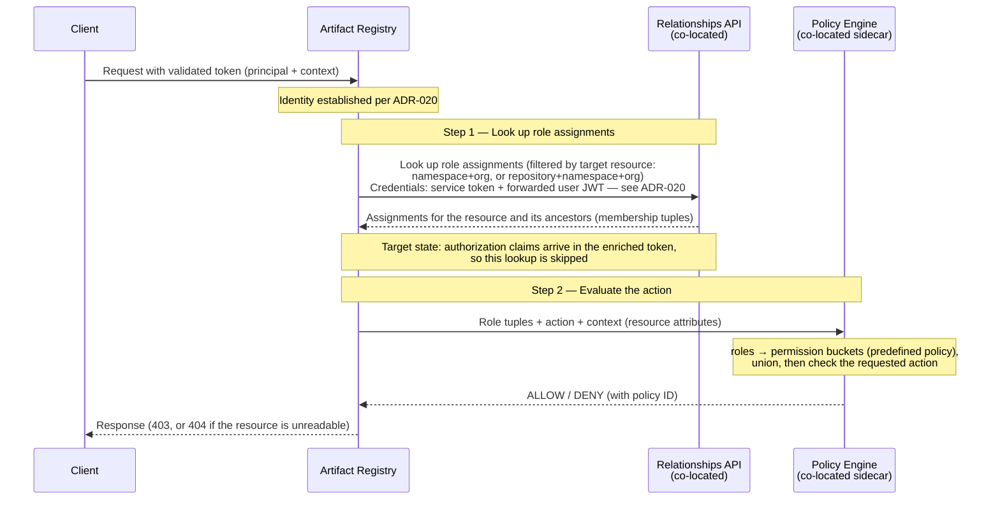
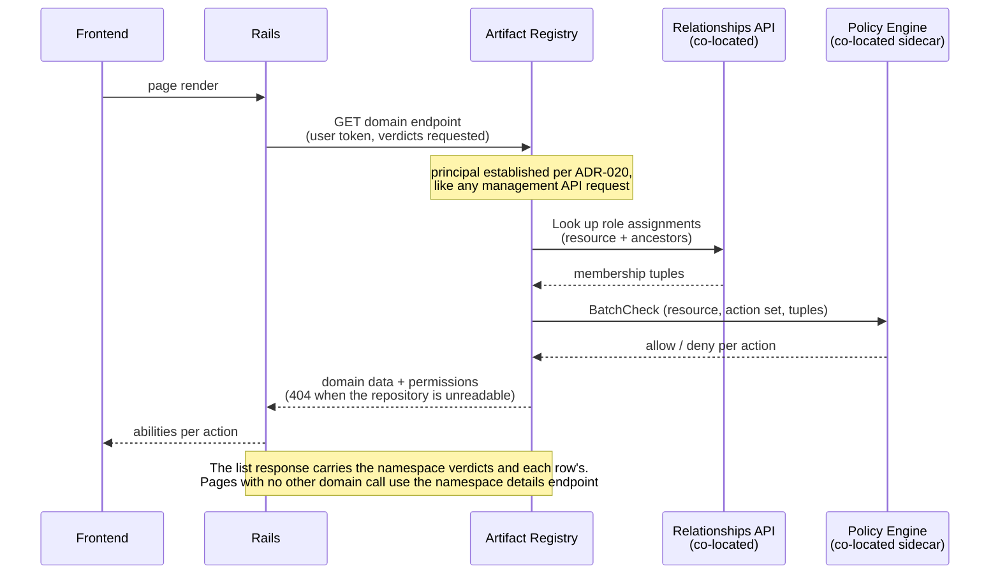

<!-- Design Documents often contain forward-looking statements -->
<!-- vale gitlab.FutureTense = NO -->

## ステータス

**提案中**

この ADR は**認可**のみを扱います。つまり、認証済みの呼び出し元が何を実行できるかです。**認証**（呼び出し元のアイデンティティがどのように確立されるか、トークンがどのように発行および検証されるか）は、[ADR-020: Authentication Flow](020_authentication_flow.md) で別途扱います。

## コンテキスト

Artifact Registry は、GitLab Rails モノリスとは別のサテライトサービス上で動作します。[ADR-020](020_authentication_flow.md) は、呼び出し元のアイデンティティをどのように確立するかを定めています。クライアントは短命のトークンを提示し、Artifact Registry はそれをローカルで検証し、リクエスト処理中に GitLab インスタンスへコールバックすることはありません。

この ADR は次の問いを扱います。**その呼び出し元は何を実行できるのか？**

Auth Platform チームとの契約は [Artifact Registry and Auth Platform interface agreement](../agreements/auth.md) であり、Artifact Registry が 6 つの要件（R1–R6）全体で必要とするものを定義しています。ADR-020 は認証要件（R1–R3）を扱います。この ADR は認可要件である **R4（ポリシー評価エンジン）**、**R5（relationships API）**、**R6（ブートストラップ）** を扱います。

### 権限モデル

操作を許可または拒否するために、Artifact Registry は 3 つの要素を評価します。

- **プリンシパル**： [ADR-020](020_authentication_flow.md) によって確立される、認証済みのユーザーまたはトークン保持者です。これはトークンの `sub` claim によって識別されます。トークンペイロードの形は [ADR-020](020_authentication_flow.md#token-payload-r3) で説明されています。すべての認証情報タイプ（personal、OAuth、CI job、group、project access token）は同じ `User` プリンシパルに解決されるため、**クローズドベータでは、使用された認証情報に関係なく、プリンシパルのみで認可します**。そのため、漏えいした CI job token はユーザーの完全な権限を持ちます。これはクローズドベータ向けの意図的なトレードオフです（トークンはデフォルトで短命です。[ADR-020](020_authentication_flow.md) を参照）。認証情報タイプごとに認可を区別することは[未解決の問い](#open-questions)です。
- **操作**： リポジトリ管理操作とアーティファクト操作の 2 種類があります。[ADR-009](009_api_design.md) で詳細に説明されています。
- **リソース**： リソースは 2 つのレベルに存在します。namespace（レジストリ全体。[ADR-022](022_namespace_decoupling.md) を参照）または個別リポジトリです。ロールはこれらのレベルで割り当てられます（[ロール割り当て](#role-assignment)を参照）。クローズドベータでは、namespace は organization と 1 対 1 で対応します。

Artifact Registry は**ロールと権限**のモデルを使用します。

- **ロール**は、リソースのコンテキストで_プリンシパルが誰であるか_を定義します。プリンシパルには [relationships API](#role-assignment)（R5）を通じてロールが割り当てられます。クローズドベータでは、Artifact Registry がこれらのロール割り当てを取得し、ポリシーエンジンがそこから有効な権限を解決します。目標状態では、認可 claim が enriched token に含まれて届きます。
- **権限**は、_プリンシパルが何を実行できるか_を定義します。各ロールは、[組み込みデフォルト](#default-permission-buckets)で定義された固定の権限セット（「権限バケット」）に対応します。

必要な権限がプリンシパルの有効な権限セットに存在する場合、操作は許可されます。

例:

- **管理操作**： リポジトリの作成には `create_repository` 権限が必要で、これは Artifact Admin ロールが保持します。
- **アーティファクト操作**： アーティファクトの公開には `create_artifact` 権限が必要で、これは Artifact Contributor、Artifact Manager、Artifact Admin ロールが保持します。

クローズドベータでは、これらのロールから権限へのマッピングは固定です。以降のイテレーションで[アクセスルール](#access-rules)を追加し、アーティファクト権限を引き締められるようにします（たとえば、本番リポジトリへの公開を許可するロールから Artifact Contributor を外すなど）。

### 制約

この決定は、次の 3 つの制約によって形作られています。

- **デフォルトでは閉じる。** organization（またはその group や project）のメンバーシップは、Artifact Registry へのアクセスを一切付与しません。Artifact Registry のロールが明示的に割り当てられるまで、プリンシパルには権限がありません。これは、[roles management work item](https://gitlab.com/gitlab-org/gitlab/-/work_items/593455) におけるチーム横断の方向性と一致する、secure-by-default のための意図的な方針です。
- **プラットフォームメンバーシップから継承しない。** トップレベル group や project のロールは、Artifact Registry のロールにはマッピングされません。Artifact Registry のロールは、プロダクト固有の独立した概念であり、個別に割り当てられます。
- **リクエスト処理中に GitLab インスタンスへコールバックしない。** リクエストを認可するために必要なものはすべて、到達不能な可能性がある GitLab インスタンスへ到達しなくても利用可能でなければなりません。この制約の対象は_そのインスタンス_であり、Artifact Registry と同じ場所に配置された依存関係、つまり relationships API と GLAZ ポリシーエンジンサイドカーではありません。クローズドベータでは、Artifact Registry は各リクエストでその両方を呼び出します。relationships API でロールを解決し、サイドカーでそれらを評価します。これらは同じ場所に配置されているため許容されます（[interface agreement](../agreements/auth.md#no-callbacks-during-request-processing)を参照）。依存関係が利用できない場合、認可は fail closed になります。ただし、fail-open/fail-closed のポリシーはまだ[未解決の問い](#open-questions)です。

## 決定

**プロダクト固有の Artifact Registry ロールを定義します。auth platform の relationships API を通じて、それらを namespace と個別リポジトリに割り当てます。同じ場所に配置されたポリシー評価エンジン（GLAZ、サイドカー）を通じて、組み込みのロールから権限へのデフォルトを使って権限を評価します。アクセスはデフォルトで閉じられ、Organization Administrator にはフルアクセスがブートストラップされます。**

クローズドベータでは、認可は 2 つのメカニズムを使用します。

1. **Namespace ロール割り当て**（[詳細](#role-assignment)） — プリンシパルには namespace 上のロールが割り当てられ、レジストリ内のすべてのリポジトリに継承されるベースラインの権限セットが付与されます。
2. **リポジトリロールの割り当て（加算的）**（[詳細](#role-assignment)） — プリンシパルには個別リポジトリ上のロールを直接割り当て、そこで権限を付与します。これは直接的なメンバーシップの関連付けであり、namespace レベルの割り当てを必要としません。クローズドベータのリポジトリレベルの割り当ては加算的です。特定リポジトリでアクセスを制限することは[延期](#reductive-repository-overrides)されます。

これにより関心事が明確に分離されます。auth platform はロール割り当て（relationships）を保存し、ポリシー評価エンジンを提供します。Artifact Registry はロール定義と権限モデルを所有し、同じ場所に配置されたエンジンを通じてすべての判断を行います。

### ロール

Artifact Registry は、Artifact Registry にスコープされた、プラットフォームロールとは異なる 4 つのプロダクト固有ロールを定義します。

| ロール | 対象 |
|---|---|
| **Artifact Viewer** | アーティファクトを pull し、レジストリを閲覧する利用者。 |
| **Artifact Contributor** | アーティファクトも公開する作成者（例: CI job）。 |
| **Artifact Manager** | アーティファクトとリポジトリ設定を管理するリポジトリオーナー。 |
| **Artifact Admin** | レジストリ全体の設定とアクセスを管理するレジストリ管理者。 |

これらは**ユーザーロール**であり、プラットフォームの**ユーザータイプ**（例: Organization Administrator または Organization Member）とは異なります。ユーザータイプは Artifact Registry ロールを意味しません。この 2 つは独立して割り当てられます。この区別の背後にあるチーム横断の整合性については、[roles management work item](https://gitlab.com/gitlab-org/gitlab/-/work_items/593455) を参照してください。

ロールが割り当てられていないプリンシパルはアクセスできません（デフォルトでは閉じる）。クローズドベータではすべてのリポジトリが private であるため、割り当てなしで読み取り可能なものはありません。[リポジトリの可視性](#repository-visibility)を参照してください。

Organization Administrator には、Artifact Admin と同等のフルアクセスが**ブートストラップ**されます（R6）。Organization Administrator は organization レベルの owner relationship、つまり owner と organization を束ねるタプルを持ちます。これは所有者の変更に合わせて継続的に維持されます（[owner role assignments work item](https://gitlab.com/gitlab-org/gitlab/-/work_items/601665)）。ポリシーエンジンは、そのタプルを organization の Artifact Registry namespace とその配下のすべてのリポジトリへの暗黙的アクセスとして扱います。この付与は暗黙的で取り消し不可です。owner であり続ける限り、取り消したりダウングレードしたりできません。これは通常の relationship レコードを通じて流れ、他の割り当てと同じように評価されるため、Artifact Registry 側で特別な処理は不要です。これにより、有効化時に割り当てがまだ存在しなくても、Organization Administrator がリポジトリを作成し、他のユーザーへロールを割り当てられることが保証されます。

カスタムロールはクローズドベータのスコープ外です。[カスタムロール](#custom-roles)を参照してください。

### 権限

Artifact Registry は固定の権限セットを定義します。

| 権限 | 説明 | 操作タイプ |
|---|---|---|
| `read_artifact` | アーティファクト（ファイル、blob、manifest、コンテナイメージ tag、npm dist-tag）の閲覧とダウンロード | アーティファクト操作（クライアント API） |
| `create_artifact` | アーティファクトの公開（Docker push、Maven deploy、npm publish）。プロトコルで許可される場合の再公開、およびコンテナイメージ tag または npm dist-tag の作成や再ターゲットを含む | アーティファクト操作（クライアント API） |
| `delete_artifact` | アーティファクト（image、package、version、コンテナイメージ tag、npm dist-tag、file）の削除 | アーティファクト操作（クライアント API） |
| `read_repository` | リポジトリ、統計、仮想リポジトリの upstream リストの一覧表示と閲覧 | 管理操作 |
| `create_repository` | ホスト型、remote、virtual リポジトリの作成 | 管理操作 |
| `update_repository` | リポジトリ設定の更新、remote 接続のテスト | 管理操作 |
| `delete_repository` | リポジトリの削除 | 管理操作 |
| `create_repository_upstream` | ホスト型または remote リポジトリを virtual リポジトリの upstream として関連付ける | 管理操作 |
| `update_repository_upstream` | virtual リポジトリの upstream を並べ替える | 管理操作 |
| `delete_repository_upstream` | ホスト型または remote リポジトリを virtual リポジトリの upstream から削除する | 管理操作 |

権限は GitLab の[権限の規約](https://docs.gitlab.com/ee/development/permissions/conventions.html)に従います。すべての権限はアクションと `resource(_subresource)` を命名し、アクションは `read`、`create`、`update`、`delete` のいずれかです。この規約をここに適用することで、次の 3 つの結果が生まれます。

- **可逆的な関係は、独自の動詞ではなくリソースとしてモデル化されます**。virtual リポジトリの upstream は `repository_upstream` です。ホスト型または remote リポジトリを関連付けるために作成し、関連付けを解除するために削除します。
- **キャッシュはアーティファクト権限を再利用します**。個別のキャッシュ権限はありません。Remote リポジトリは、ホスト型スキーマを反映したテーブルにアーティファクトをキャッシュし（[ADR-007](007_database_schema.md)）、同じエンドポイントを通じて提供します（[ADR-009](009_api_design.md)）。
- **`read_repository` は virtual リポジトリの upstream リストも公開します**。解決順序は、そのリポジトリを使用するすべての人に関係するためです。

### デフォルト権限バケット {#default-permission-buckets}

各ロールは、下に示す固定の権限セットに対応します（✓ = そのロールが保持）。ロールは、割り当てられた場所に関係なく同じ権限を保持します。変わるのは_到達範囲_です。namespace 割り当てではレジストリ全体に適用され、リポジトリ割り当てではそのリポジトリのみに適用されます。

| 権限 | Artifact Viewer | Artifact Contributor | Artifact Manager | Artifact Admin |
|---|:---:|:---:|:---:|:---:|
| `read_artifact` | ✓ | ✓ | ✓ | ✓ |
| `create_artifact` | | ✓ | ✓ | ✓ |
| `delete_artifact` | | | ✓ | ✓ |
| `read_repository` | ✓ | ✓ | ✓ | ✓ |
| `create_repository` | | | | ✓ |
| `update_repository` | | | ✓ | ✓ |
| `delete_repository` | | | | ✓ |
| `create_repository_upstream` | | | ✓ | ✓ |
| `update_repository_upstream` | | | ✓ | ✓ |
| `delete_repository_upstream` | | | ✓ | ✓ |

各ロールは独立した権限バケットです。ロール間に階層や継承はなく、その列でマークされた権限だけを付与します。

### リポジトリの可視性 {#repository-visibility}

各リポジトリには、Artifact Registry データベースに保存される可視性レベルがあります（[ADR-007: Database Schema](007_database_schema.md) を参照）。可視性は Artifact Registry ネイティブの属性であり、外部エンティティには同期されません。

**クローズドベータでは `private` のみをサポートします**： 割り当てられたロールがなければアクセスできません。すべてのリポジトリはデフォルトで閉じられます。読み取りを含むすべての操作に明示的なロール割り当てが必要です。

`internal`（organization メンバーが読み取り可能）と `public`（認証されていない呼び出し元を含む誰でも読み取り可能）は、いずれもロールなしで読み取りを許可するため、クローズドベータのスコープから外します。`internal` は organization メンバーシップを通じて、`public` はすべての人に許可します。どちらもデフォルトで閉じる制約を破ります。メンバーシップはアクセスを**付与できる**人を決めるゲートであり、付与そのものではありません。どちらも GA まで延期します。[Public および internal の可視性](#public-and-internal-visibility)を参照してください。

書き込み操作と管理操作は、可視性に関係なく、常に割り当てられたロールから対応する権限を必要とします。

### Namespace レベルとリポジトリレベルのリソース {#namespace-level-and-repository-level-resources}

#### Namespace レベルのリソース

すべての namespace レベルリソースは、固定の権限要件を持つ管理操作です。

| リソース | 操作 | 必要な権限 |
|---|---|---|
| リポジトリ一覧 | すべてのリポジトリを一覧表示する、形式別に一覧表示する | `read_repository` |
| レジストリ統計 | ストレージとダウンロード統計を表示する | `read_repository` |
| リポジトリ管理 | ホスト型、remote、virtual リポジトリを作成、更新、削除する | `create_repository`、`update_repository`、`delete_repository` |
| Virtual リポジトリ upstream 一覧 | remote とホスト型 upstream を一覧表示する | `read_repository` |
| Virtual リポジトリ upstream 管理 | remote とホスト型 upstream を関連付け、並べ替え、関連付け解除する | `create_repository_upstream`、`update_repository_upstream`、`delete_repository_upstream` |

#### リポジトリレベルのリソース

**管理操作**（固定の権限要件）:

| リソース | 操作 | 必要な権限 |
|---|---|---|
| リポジトリ詳細 | リポジトリ詳細を表示する | `read_repository` |
| リポジトリ設定 | リポジトリ設定を更新する、remote 接続をテストする | `update_repository` |
| リポジトリ削除 | リポジトリを削除する | `delete_repository` |
| リポジトリ統計 | ストレージとダウンロード統計を表示する | `read_repository` |
| リポジトリ upstream 関連付け | upstream を virtual リポジトリに関連付け、並べ替え、関連付け解除する | `create_repository_upstream`、`update_repository_upstream`、`delete_repository_upstream` |
| キャッシュ済みアーティファクト（remote リポジトリ） | `kind=remote` リポジトリ上で、アーティファクトエンドポイント（[ADR-009](009_api_design.md)）を通じて提供されるキャッシュ行を表示し、削除する | `read_artifact`、`delete_artifact` |
| アーティファクト | リポジトリのアーティファクトを閲覧する | `read_artifact` |

namespace 全体およびリポジトリ内で一覧表示をどのように認可するかは、[一覧操作](#list-operations)で説明します。

**アーティファクト操作**（デフォルト権限バケット）:

| 操作 | 必要な権限 | デフォルトで許可されるロール |
|---|---|---|
| 読み取り（閲覧、ファイルと blob のダウンロード、セキュリティ監査） | `read_artifact` | Artifact Viewer、Artifact Contributor、Artifact Manager、Artifact Admin |
| 公開（Docker push、Maven deploy、npm publish） | `create_artifact` | Artifact Contributor、Artifact Manager、Artifact Admin |
| tag の作成または再ターゲット（OCI tag push、`npm dist-tag add`） | `create_artifact` | Artifact Contributor、Artifact Manager、Artifact Admin |
| 削除（image、package、version、file、一括削除） | `delete_artifact` | Artifact Manager、Artifact Admin |
| tag の削除（OCI untag、`npm dist-tag rm`） | `delete_artifact` | Artifact Manager、Artifact Admin |

公開には、形式のプロトコルで許可される場合の再公開が含まれます（Maven `SNAPSHOT` の再デプロイ、OCI tag の再 push）。公開済みの npm version のような immutable アーティファクトは、プロトコルにより上書きできません。個別の上書き権限はありません。既存アーティファクトの上書きを防ぐことは、クローズドベータから延期される[アクセスルール](#access-rules)機能（`overwrite` アクション）です。

クローズドベータでは、これらのデフォルトは固定です。以降のイテレーションで[アクセスルール](#access-rules)を追加し、それらを引き締められるようにします。

### ロール割り当て {#role-assignment}

ロールは、auth platform の [relationships API](../agreements/auth.md#r5--relationships-api)（R5）を通じて `(subject, role, resource)` タプルとして割り当てられます。subject はトークンから解決される relationships-API の [`Identity`](https://gitlab.com/gitlab-org/auth/iam/-/blob/main/docs/relationships-api.md#subject-and-identity) 型（`origin`、`origin_id`、`local_id`）であり、resource は Artifact Registry namespace またはリポジトリです。ロール割り当ては、subject をその subject の organization 内のリソースに結び付けます。

ロール割り当ての管理自体も、権限が必要な操作です。**Artifact Admin** と **Artifact Manager** ロールはそれらを作成、更新、削除できますが、Artifact Viewer と Artifact Contributor はできません（[決定](https://gitlab.com/groups/gitlab-org/-/work_items/22246#note_3471245743)）。この能力は、ロールがどこで保持されていても同一です。異なるのはスコープだけです。namespace レベルのロールはレジストリ全体の割り当てを管理し、リポジトリレベルのロールはそのリポジトリ上の割り当てを管理します。プリンシパルは自分より上位のロールを付与できません。Artifact Manager は Artifact Admin を作成できません。これは project Maintainer が member を Owner に昇格できないのと同じです。これは GitLab UI を通じて行われ、Rails が frontend と API を提供します（R5）。relationships API は書き込み自体を認可します（[relationships-API write authorization](https://gitlab.com/gitlab-org/gitlab/-/work_items/599078)）。relationships API 自体は gRPC であるため、この Rails surface は GraphQL-over-gRPC ラッパーです（[GraphQL wrapper work item](https://gitlab.com/gitlab-org/gitlab/-/work_items/602144)）。namespace は organization と 1 対 1 で対応するため、これは organization のアクセス管理体験を通じて表示されます。

ロールは、**2 つのリソースレベル**のいずれか、つまり namespace またはリポジトリで動作し、4 つのロールはいずれもどちらのレベルにも割り当てられます。

- **Namespace（トップレベル）**： ロールはレジストリ全体、つまりすべてのリポジトリに適用されます。たとえば、namespace レベルの Artifact Manager はすべてのリポジトリの manager です。namespace レベルの Artifact Viewer はすべてのリポジトリを読み取れます。これは、管理者が数千人のユーザーへ大規模にアクセスを付与できるようにするベースラインです。Organization Administrator は namespace レベルの Artifact Admin としてブートストラップされます（R6）。
- **リポジトリ（直接、加算的）**： 単一リポジトリに割り当てられたロールは、そのリポジトリ上で権限を付与します。これは独立した直接メンバーシップの関連付けであり、namespace レベルの割り当てを必要としません。そのため、プリンシパルには単一リポジトリへのアクセスのみを付与できます。プリンシパルが両レベルでロールを持つ場合、リポジトリ上の有効な権限は 2 つの**和集合**になります。リポジトリレベルの割り当ては権限を増やすことだけができ、減らすことはできません。特定リポジトリでアクセスを制限すること（減算的オーバーライド）は、[クローズドベータから延期](#reductive-repository-overrides)されます。

`create_repository` はレジストリ全体に対して作用するため、リポジトリレベルでは意味を持ちません。Artifact Admin をリポジトリレベルで割り当てると、Artifact Manager に対してちょうど `delete_repository` が追加され、そのリポジトリを削除することを含む完全な制御が可能になります。

**各リクエストは 1 つのリソースに対して解決されます。** リクエストは、それが指す単一リソースに対して認可されます。relationships lookup はそのリソースと祖先（リポジトリ → namespace → organization）でフィルタリングされるため、_別の_リポジトリの割り当てが判断に含まれることはありません。オーバーライドは権限を上げるだけなので、有効ロールは該当する中で最上位のものになります。「最も制限的」という解決はありません。これは仮想リポジトリにも含まれます。**仮想リポジトリを経由して**提供されるリクエストは、**その仮想リポジトリ**自体のロールに対して解決される一方、含まれる**ホスト型またはリモートリポジトリ**に割り当てられたロールは、その含まれるリポジトリに**直接**宛てたリクエストを制御します。したがって、仮想リポジトリのロールは、それを経由して提供される集約対象コンテンツへのアクセスを許可します。これは、含まれるリポジトリの割り当てを迂回するものではなく、設計どおりです。

ロール割り当てが Artifact Registry に届く方法は、イテレーションによって異なります。

- **クローズドベータ**： トークンはアイデンティティとコンテキストのみを運びます（認可 claim はありません）。Artifact Registry は同じ場所に配置された relationships API に問い合わせ、**対象リソースでフィルタリング**します。namespace 操作では namespace id と organization id を渡し、リポジトリ操作では repository id、namespace id、organization id を渡します。API はそのリソースとその祖先に対するプリンシパルのロール割り当てを membership tuple として返します。Artifact Registry はそれらのすべてのタプルをポリシーエンジンに渡し、ポリシーエンジンが有効な権限を解決します。リポジトリレベルの割り当ては加算的であるため、権限は namespace レベルとリポジトリレベルの割り当ての和集合です（エンジンのネイティブな most-permissive 評価）。Artifact Registry は relationships API のレスポンスを、AR で設定された短い期間（デフォルト 30 秒、最大 60 秒）キャッシュします。キャッシュは relationships API に送られた入力、つまりプリンシパル、対象リソース、relationship kind フィルターをキーにします。キャッシュされた結果が別のプリンシパルやリソースに再利用されることはありません。その結果、取り消しを含む最近のロール割り当て変更は、即時に適用されるのではなく、最大でその時間枠だけ反映に時間がかかる可能性があります。
- **目標状態**： auth platform の enrichment layer がロール割り当てを解決し、enriched token に認可 claim を含めるため、lookup は不要になります。ADR-020 がこの ADR に委ねているそれらの claim の形は、enrichment layer が出荷されるときに定義されます。

### 認可フロー {#authorization-flow}

認可は認証の後に始まります。Artifact Registry はすでにトークンを検証し、プリンシパルを確立しています（[ADR-020](020_authentication_flow.md)）。次に、relationships API からプリンシパルのロール割り当てを取得し、同じ場所に配置されたポリシーエンジンサイドカーに要求されたアクションの評価を依頼し、GitLab インスタンスへコールバックせずに判断を返します。

下記のフローは、認証済みプリンシパルを前提としています。認証されていないリクエストにはトークンがなく、拒否されます。クローズドベータには public リポジトリがありません（[リポジトリの可視性](#repository-visibility)を参照）。

```mermaid
sequenceDiagram
    participant Client
    participant AR as Artifact Registry
    participant Rel as Relationships API<br/>(co-located)
    participant PE as Policy Engine<br/>(co-located sidecar)

    Client->>AR: Request with validated token (principal + context)
    Note over AR: Identity established per ADR-020

    Note over AR,Rel: Step 1 — Look up role assignments
    AR->>Rel: Look up role assignments (filtered by target resource:<br/>namespace+org, or repository+namespace+org)<br/>Credentials: service token + forwarded user JWT — see ADR-020
    Rel-->>AR: Assignments for the resource and its ancestors (membership tuples)
    Note over AR,Rel: Target state: authorization claims arrive in the enriched token,<br/>so this lookup is skipped

    Note over AR,PE: Step 2 — Evaluate the action
    AR->>PE: Role tuples + action + context (resource attributes)
    Note over PE: roles → permission buckets (predefined policy),<br/>union, then check the requested action
    PE-->>AR: ALLOW / DENY (with policy ID)

    AR-->>Client: Response (403, or 404 if the resource is unreadable)
```

操作が拒否された場合、ステータスコードは、プリンシパルがそのリソースの存在を見ることさえできるかどうかによって変わります。これは、一覧および閲覧操作に適用されるメタデータ漏えい防止と同じです。

- **プリンシパルがリソースを読み取れない**（例: そのプリンシパルがロールを持たない private リポジトリ）: Artifact Registry は直接アクセスに対して **404 Not Found** を返し、リソースの存在を確認させません。これは一覧結果のフィルタリングと一致します。
- **プリンシパルはリソースを読み取れるが、特定の操作が不足している**（例: ロールは持っているが `delete_repository` は持っていない）: リソースの存在はすでに知られているため、Artifact Registry は **403 Forbidden** を返します。

どちらの場合も、認可ポリシーの詳細が漏えいすることを避けるため、レスポンスは拒否の原因となった権限やポリシーを明かしません。ポリシーエンジンは、監査ログとデバッグのために判断を決定したポリシー ID を返します（R4）。

### 一覧操作 {#list-operations}

一覧は一度に多くのリソースにまたがるため、上記の単一リソース評価には当てはまりません。

**リポジトリ一覧（namespace スコープ）。** Artifact Registry は、リポジトリごとに 1 回ずつポリシーチェックを行うのではなく、プリンシパルのロール割り当てからこれを判断します。

- **任意の namespace レベルロール**を持つプリンシパルは、その namespace 内の**すべての**リポジトリを一覧表示できます。すべてのロールは `read_repository` を含むため、これは「プリンシパルが namespace でロールを持っているか」に単純化されます。その後、Artifact Registry は自身のデータベースからリポジトリを列挙します。
- **namespace レベルロールを持たない**プリンシパルには、**リポジトリレベルの割り当て**を持つリポジトリのみが見えます。クローズドベータには、ロールなしで読み取りを許可する可視性レベルがありません（[リポジトリの可視性](#repository-visibility)を参照）。直接割り当てはリポジトリごとの評価を通じて解決されます。Artifact Registry は relationships API からリポジトリの tuple を取得し、割り当てが `read_repository` を提供する場合にポリシーエンジンが許可します。

レジストリ全体の統計の表示も同じように機能します。これは単一リポジトリではなくレジストリ全体を要約するため、namespace レベルロールが必要です。

**リポジトリ内の一覧（リポジトリスコープ）。** リポジトリのコンテンツまたはサブリソースを閲覧することは単一リポジトリを対象とするため、そのリポジトリに対する通常のポイントチェックです。アーティファクト/コンテンツ一覧（tag、version、file）には `read_artifact` が必要です。リポジトリ詳細、リポジトリ単位の統計、upstream リストには `read_repository` が必要です。

すべての場合において、プリンシパルが読み取れないリソースは拒否されるのではなく結果から省略されます。空または部分的な一覧になり、エラーも、隠されたリソースが存在することを示す情報もありません。これによりメタデータ漏えいを防ぎます。これはランディング時の体験でもあります。レジストリのナビゲーションエントリは権限チェックでゲートされません（[ADR-014](014_frontend_to_artifact_registry.md)）。organization に対して Artifact Registry が有効であることなど、他のゲートは引き続き適用されます。そのため、アクセス権のないプリンシパルはリポジトリ一覧に到達し、空の一覧を見ます。

### UI ゲーティングの権限チェック {#permission-checks-for-ui-gating}

frontend は、ユーザーがアクションを試みる前に、ボタン、タブ、ルートなど、どのアクションを表示するかを知る必要があります。そして、それに答えられるのは Artifact Registry だけです。Artifact Registry は**権限チェック**、すなわち呼び出し元プリンシパルに対するアクションごとの許可または拒否の判断を公開します。チェックでは権限を列挙するのではなくアクションを指定します。権限からアクションへのマッピングはレジストリが所有します。

判断は、オプトインで、管理 API のドメインレスポンスに**埋め込まれます**。リポジトリ詳細レスポンスはそのリポジトリの判断を運び、リポジトリ一覧レスポンスは namespace の判断と各行の判断を含むエンベロープを運びます。1 ページにつき 1 回の呼び出しです。

namespace の判断も、判断のために作成された namespace 詳細レスポンス `GET /api/v1/:slug/namespace` に同じ方法で埋め込まれます（ルートの一覧は [ADR-009](009_api_design.md#management-apis) を参照）。仕様は初期フィールドを固定します。organization の移行により複数の namespace が 1 つの organization 配下に置かれる可能性があるため、namespace がユーザー向けエンティティになるにつれてレスポンスは追加的に成長します。他のドメイン呼び出しがないページで、namespace スコープの操作機能を提供します。

各サーフェスのアクションセットは、そのリソースレベル、つまり [Namespace レベルとリポジトリレベルのリソース](#namespace-level-and-repository-level-resources)の対応付けによって固定され、OpenAPI 契約で公開されます。frontend は独自に考案するのではなく、そこからアクションを取得します。同じ名前でも、各レベルでは異なる問いになります。namespace に対する `update_repository` はレジストリ全体の設定をゲートし、リポジトリに対するものはそのリポジトリ自身の設定をゲートします。

```mermaid
sequenceDiagram
    participant FE as Frontend
    participant Rails
    participant AR as Artifact Registry
    participant Rel as Relationships API<br/>(co-located)
    participant PE as Policy Engine<br/>(co-located sidecar)

    FE->>Rails: page render
    Rails->>AR: GET domain endpoint<br/>(user token, verdicts requested)
    Note over AR: principal established per ADR-020,<br/>like any management API request
    AR->>Rel: Look up role assignments<br/>(resource + ancestors)
    Rel-->>AR: membership tuples
    AR->>PE: BatchCheck (resource, action set, tuples)
    PE-->>AR: allow / deny per action
    AR-->>Rails: domain data + permissions<br/>(404 when the repository is unreadable)
    Rails-->>FE: abilities per action

    Note over Rails,AR: The list response carries the namespace verdicts and each row's.<br/>Pages with no other domain call use the namespace details endpoint
```

この契約には 4 つのルールがあります。

- **助言にすぎない。** 判断は UI の操作機能を事前にゲートするが、レジストリは実際のすべてのリクエストを引き続き認可する（[認可フロー](#authorization-flow)）。そのため、古い判断によってコントロールが誤って表示されることはあっても、アクセスが許可されることはない。これが、利用側が[ロール割り当て](#role-assignment)の解決キャッシュに加えて判断をキャッシュできる理由である。判断は認可だけを対象とする。表示にはプラットフォームがキャッシュする namespace のステータスも必要であり（[ADR-022](022_namespace_decoupling.md)）、レジストリは実際のリクエストで両方を強制する。
- **呼び出し元はエンドユーザーである。** このサーフェスは管理 API のエンドユーザー認証を使用する（[ADR-020](020_authentication_flow.md)）。プラットフォームは現在のユーザーのトークンを取得し、そのユーザーとして呼び出す。レジストリは、ユーザーアイデンティティを主張するサービス呼び出し元を受け入れない。また、判断は GitLab API サーフェスには置かれない。GitLab API はエンドユーザーではなくサービスを認証するためである（[ADR-009](009_api_design.md#gitlab-api)）。認証以外の権限は不要である。存在の隠蔽とデフォルト拒否により、アクセス権のない呼び出し元が、ゲート対象エンドポイントで明かされない情報を知ることはない。
- **存在の隠蔽。** プリンシパルが読み取れないリポジトリでは、ドメインレスポンス自身の **404 Not Found** が返され、存在しないものと区別できない。namespace エンドポイントは、所有 organization の認証済みプリンシパルであれば誰にでも応答する。上記のランディング体験ですでに namespace の存在を明かしているためである。割り当てがない場合はすべてのアクションを拒否する。別の organization の呼び出し元は、不明な slug と同じく 404 を受け取るため、namespace ルートが一覧ルート以上の情報を漏らすことはない。レスポンスは許可または拒否だけを運び、決定したポリシーや理由は決して運ばない。
- **埋め込み、かつオプトイン。** 判断は、要求された場合にのみ、ゲートするデータのレスポンスに同乗する。そのため、両者が食い違うことはなく、何も表示しない利用側にはコストがかからない。

一覧エンベロープの判断は、それを提供することの副産物です。namespace ロールを持たない呼び出し元では、表示可能な行をフィルタリングする時点ですでに各リポジトリを評価し、namespace の判断も同じタプルから得られます。namespace ロールで決まるのは可視性だけです。リポジトリ割り当ては加算的なので、要求された判断では返されるすべての行を引き続き評価します。

各行の判断はその行自身の評価から得られ、行の評価が失敗した場合は黙って除外するのではなくリクエスト全体が失敗します。リクエスト内の lookup 間の一貫性は、アトミックではなく解決キャッシュの TTL によって制限されます。可視性のフィルタリング自体が判断であるため、すべての一覧リクエストはすでに relationships service とポリシーエンジンに依存しています。オプトインで増えるのは行ごとの評価コストであり、依存関係ではありません。依存関係に到達できなければリクエスト全体が失敗します。fail-open ポリシーと namespace ごとの評価のキャッシュは、依然として[未解決の問い](#open-questions)です。

形状は [proposal 016](https://gitlab.com/gitlab-org/architecture/auth-architecture/design-doc/-/blob/main/proposals/016-batchcheck-ar-ui-authorization.md) に従います。判断をドメインレスポンスに埋め込み、AR-GLAZ の [`BatchCheck` 契約](https://gitlab.com/gitlab-org/architecture/auth-architecture/design-doc/-/blob/main/proposals/016-batchcheck-ar-ui-authorization.md#interface)を通じて解決します。namespace も一致します。016 は namespace 詳細エンドポイントを想定しており、この決定がそれを作成します。

## 後続イテレーションへ延期 {#deferred-to-later-iterations}

次の機能は、意図的にクローズドベータのスコープ外です。設計を記録に残すためここに文書化しており、クローズドベータの顧客需要に基づいて再検討します。

### Public および internal の可視性 {#public-and-internal-visibility}

クローズドベータでは `private` の可視性のみをサポートします（[リポジトリの可視性](#repository-visibility)を参照）。`public`（認証されていない呼び出し元を含む誰でも読み取り可能）と `internal`（organization メンバーが読み取り可能）を再導入するには、デフォルトで閉じたまま広範な読み取りアクセスをどう付与するかについて、追加の検討が必要です。まだ決定されていないため、どちらも GA まで延期します。

### 減算的リポジトリオーバーライド {#reductive-repository-overrides}

クローズドベータのリポジトリレベルの割り当ては、**加算的（引き上げのみ）**です。リポジトリ上の権限を追加するだけであり、Artifact Registry は namespace レベルとリポジトリレベルの割り当ての和集合を付与します（[ロール割り当て](#role-assignment)を参照）。

特定リポジトリ上でプリンシパルのアクセスを下げること（減算的オーバーライド）はスコープ外です。これは、GitLab 全体で機能しているロール継承と衝突するためです。namespace レベルの割り当てはすべてのリポジトリへ伝播します。これが追加される場合、Artifact Registry は namespace レベルとリポジトリレベルの両方でプリンシパルの権限を読み取り、それらの和集合を取るのではなく、リポジトリレベルが完全に優先されるようにして、アクセスを_引き上げる_ことも_引き下げる_こともできるようにすることで優先順位を解決します。

### アクセスルール {#access-rules}

アクセスルールにより、管理者は_どのロールがアーティファクト権限を保持するか_を、namespace、リポジトリ、またはパターンに一致するアーティファクト上で、プリンシパルを指定せずに引き締められます。これは、特定のアーティファクトを保護すること、重複アップロードを許可または防止することという 2 つの顧客ユースケースを扱います。ポリシーエンジン（R4）向けのユーザー定義ポリシーとしてモデル化され、組み込みデフォルトを引き締めることだけができ、広げることはできません。この機能とともに導入される専用の `*_access_rule` 権限セットを通じて管理されます。これらは延期されるため、クローズドベータではリポジトリごとに権限を引き締めることはできません。

### カスタムロール {#custom-roles}

カスタムロールはクローズドベータから延期されます。[custom roles roadmap work item](https://gitlab.com/gitlab-org/gitlab/-/work_items/590721) を参照してください。

権限モデルは、カスタムロールを自然に扱えます。カスタムロールは、独自の権限バケットを持つ新しいロールです。ロールは独立した権限バケットであるため、カスタムロールには Artifact Registry 権限の任意の組み合わせを含められます（例: `read_artifact` と `create_artifact` は持つが `read_repository` は持たない "CI Publisher" ロール）。auth platform を通じて定義されたカスタムロールは、同じ relationships API を通じて割り当てられ、組み込みロールと同じようにアクセスルールで参照できます。

### 付与数で制限されたリポジトリ一覧評価

IAM は、呼び出し元のロールでフィルタリングされた付与を返す `LookupResources` エンドポイントを計画しています（[gitlab#626615](https://gitlab.com/gitlab-org/gitlab/-/work_items/626615)）。namespace 自身のリポジトリと共通部分を取ることで、一覧評価を namespace のサイズではなく呼び出し元の付与数で制限し、スキャンに関する[未解決の問い](#open-questions)を解消します。このエンドポイントは .com クローズドベータに間に合わない見込みのため、採用は延期されます（[artifact-registry#969](https://gitlab.com/gitlab-org/ops/artifact-registry/-/work_items/969)）。

## 影響

### ポジティブ

1. **プラットフォームの方向性と一致している。** Artifact Registry は独自の認可システムを構築するのではなく、auth platform の relationships API とポリシー評価エンジン（R4、R5）を利用し、統合の方向性と一致します。
1. **同じ場所に配置された評価。** ロール割り当てが利用可能になると（クローズドベータでは解決され、目標状態では enriched token に含まれる）、権限判断は GitLab インスタンスへコールバックせず、同じ場所に配置されたサービスを通じて行われます。
1. **関心事の明確な分離。** アイデンティティは ADR-020 で確立されます。この ADR はプリンシパルが何を実行できるかに答えます。auth platform は割り当てを保存し、Artifact Registry はロールと権限モデルを所有します。
1. **権限モデルが維持され、移植しやすい。** 独立した権限バケットとしてのロールは、ポリシーエンジンの「deny overrides」モデルに一致し、将来の移行作業を最小化します。

### ネガティブ

1. **クローズドベータのロール解決。** enrichment layer が出荷されるまで、Artifact Registry はトークンから claim を読むのではなく、relationships API に問い合わせてロール割り当てを自ら解決します。これはより複雑です。
1. **オンボーディングの負荷。** デフォルトで閉じるには明示的なロール割り当てが必要であり、管理作業が増えます。これは Organizations UI の一括割り当てワークフローによって緩和されます。
1. **ロール増殖の可能性。** プロダクト固有ロールは時間とともに大きなリストへ増える可能性があります。これは [roles management work item](https://gitlab.com/gitlab-org/gitlab/-/work_items/593455) の north star に従い、スケーリングメカニズムとして Teams と group template によって緩和されます。
1. **クローズドベータではリポジトリごとの引き締めがない。** アクセスルールや減算的オーバーライドがない場合、プリンシパルのアクセスはリポジトリ上で引き上げることだけができ、引き下げることはできません。namespace レベルの割り当ては例外を切り出す方法なくすべてのリポジトリに到達します。どちらも[延期](#deferred-to-later-iterations)され、顧客需要に基づいて再検討されます。

## 検討した代替案

### Organization Teams

[Organization Teams](https://gitlab.com/gitlab-com/content-sites/handbook/-/merge_requests/17975) は、ベースロールと任意の権限修飾子をユーザーに割り当てる第一級エンティティとして Teams を導入し、明示的な継承制御を備えます。Artifact Registry は、ベースラインアクセス用に organization ごとの Team を使用し、リポジトリごとの粒度は sub-team を通じて扱うこともできました。

**今採用しない理由**： Organization Teams は `proposed` ステータスであり、Artifact Registry のタイムラインでは利用できません。Teams は、[roles management work item](https://gitlab.com/gitlab-org/gitlab/-/work_items/593455) の north star に従った、ロール割り当ての将来的なスケーリングメカニズムであり続けます。relationships API を通じて行われるロール割り当ては、その方向性と互換性があります。

### Artifact Registry ネイティブの認可

Artifact Registry は、auth platform に依存せず、独自のユーザー・リソース関係と権限ロジックを維持することもできました。

**採用しない理由**： これはプラットフォームの認可システムとは別に、もう 1 つの認可システムを導入することになり、統合の方向性とは逆に断片化を増やします。ユーザー管理をゼロから構築する必要があり、一貫性のないユーザー体験を生み、後からプラットフォームへ収束させることも難しくなります。relationships API（R5）は、この ADR が必要とするリソースごとのロール割り当てを、これらの欠点なしに提供します。

## 未解決の問い {#open-questions}

1. **relationships service が利用できない場合の振る舞い。** クローズドベータでは fail closed（リクエストを拒否）ですが、fail-open と fail-closed のどちらにするかのポリシーはまだ最終決定中です（[infrastructure discussion](https://gitlab.com/gitlab-org/gitlab/-/work_items/602298)）。
1. **スケール時の organization から namespace への解決。** ロール割り当ては Artifact Registry namespace に付与され、これはクローズドベータでは organization と 1 対 1 で対応します（[ADR-022](022_namespace_decoupling.md)）。将来の organization merge によって複数の namespace が 1 つの organization 配下に置かれる場合、organization 全体の関心事、つまり owner ブートストラップと割り当てに関する org スコープ不変条件を、それら全体でどのように解決するかを定義します。
1. **認証情報タイプを意識した認可。** クローズドベータでは `User` プリンシパルのみで認可します。すべての認証情報タイプは同じプリンシパルに解決されるため（ADR-020）、漏えいした CI job token はユーザーの完全な権限を持ちます。認証情報タイプによって認可を制約するかどうか、たとえば CI job token を publish-only に制限するかどうかは延期されます。そのためにはまず ADR-020 がトークンに認証情報タイプを含める必要があるため、ADR-020/ADR-021 共同の follow-up です。
1. **Interface agreement との整合。** [interface agreement](../agreements/auth.md#gitlab-role-vocabulary) は現在、Artifact Registry が 5 つの組み込み GitLab ロールを使用し、「独自のロールを定義しない」と述べています。このセクションは、Auth Platform チームと調整して、ここで決定したプロダクト固有ロールを反映する companion update が必要です。
1. **リポジトリ一覧認可スキャンのキャッシュ。** 稼働開始時、リポジトリ一覧は各行に編集と削除のコントロールを表示するため、一覧エンドポイントは呼び出し元が読み取れない行を隠すと同時に、それらのコントロールについて行ごとの許可または拒否を返さなければならない。namespace ロールを持たない呼び出し元では、リポジトリレベルロールによって表示されるものを見つけるため、namespace 内のすべてのリポジトリをチェックすることになる。クローズドベータの規模では数千行であり（[ADR-004](004_data_and_application_limits.md) はアーティファクトタイプごとに namespace 内のリポジトリ数を制限する）、認証済みのどの呼び出し元からも到達可能で、ページロードのたびに繰り返される。このスキャンをどのようにキャッシュし、レート制限するかは未解決である（[proposal 016 の未解決の問い](https://gitlab.com/gitlab-org/architecture/auth-architecture/design-doc/-/blob/main/proposals/016-batchcheck-ar-ui-authorization.md#open-questions)）。IAM の `LookupResources` エンドポイントによって完全に解消される可能性がある（[artifact-registry#969](https://gitlab.com/gitlab-org/ops/artifact-registry/-/work_items/969)）。

## 参考文献

- [ADR-001: Organizations as Anchor Point](001_organizations_as_anchor_point.md)
- [ADR-007: Database Schema](007_database_schema.md) — アクセスルール
- [ADR-009: API Design](009_api_design.md) — 管理 API とクライアント API エンドポイント
- [ADR-020: Authentication Flow](020_authentication_flow.md) — アイデンティティの確立とトークン検証
- [ADR-022: Namespace Decoupling](022_namespace_decoupling.md)
- [Artifact Registry and Auth Platform interface agreement](../agreements/auth.md) — ここで扱う R4–R6（認可）要件
- [Relationships API](https://gitlab.com/gitlab-org/auth/iam/-/blob/main/docs/relationships-api.md) — IAM relationships API contract。クローズドベータでは、リソースとその祖先に対する直接 relationship tuple を返し、ポリシーエンジンがそれを和集合（加算的なリポジトリレベル割り当て）として評価します
- [GitLab permission conventions](https://docs.gitlab.com/ee/development/permissions/conventions.html) — これらの権限が従う命名規則と CRUD 分解ルール
- [Roles management and Artifact Registry onboarding](https://gitlab.com/gitlab-org/gitlab/-/work_items/593455) — プロダクト固有ロール、デフォルトで閉じる、3 部構成モデル
- [Proposal 016: BatchCheck](https://gitlab.com/gitlab-org/architecture/auth-architecture/design-doc/-/blob/main/proposals/016-batchcheck-ar-ui-authorization.md) — 権限チェックの背後にある AR-GLAZ バッチ評価契約とその UI フロー
- [UI gating direction (gitlab#602144)](https://gitlab.com/gitlab-org/gitlab/-/work_items/602144#note_3532439195) — UI ゲーティングがレジストリの回答するアクションベースのチェックを使用するという合意
- [GATE Design Document](https://gitlab.com/gitlab-org/architecture/auth-architecture/design-doc/-/blob/main/design.md) — GitLab Adaptive Trust Environment
- [Organization Teams Blueprint](https://gitlab.com/gitlab-com/content-sites/handbook/-/merge_requests/17975)
- [ADR-012: Organizations, Roles, and Permissions in Artifact Registry](https://gitlab.com/gitlab-com/content-sites/handbook/-/merge_requests/20030)
- [Custom roles roadmap](https://gitlab.com/gitlab-org/gitlab/-/work_items/590721)
