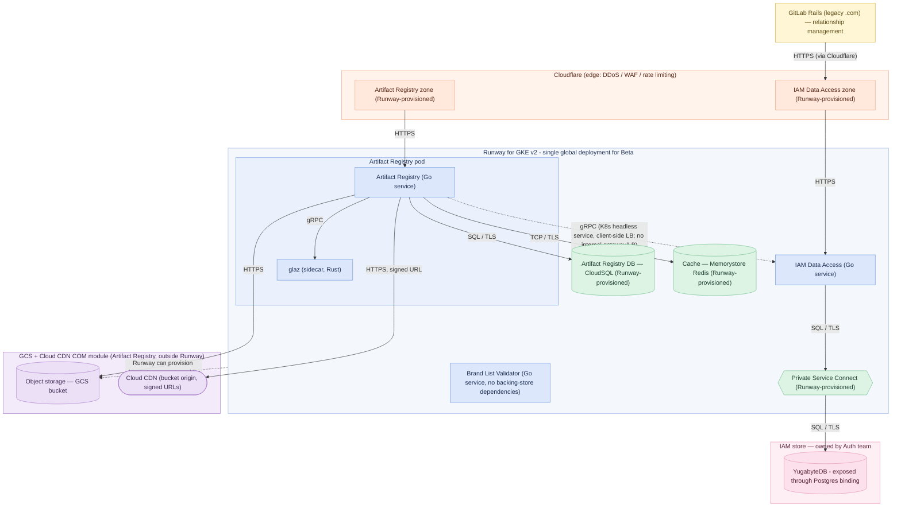

<!-- Design Documents often contain forward-looking statements -->
<!-- vale gitlab.FutureTense = NO -->

## ステータス {#status}

**Proposed.**

## コンテキスト {#context}

Artifact Registry のターゲットデプロイモデルは、Cell ベースのマルチテナントアーキテクチャです。
各 Cell は自己完結したリージョナルなデータプレーン（GKE、PostgreSQL、Redis、GCS）であり、
共有エッジ（Cloudflare + Cloud CDN）の背後に配置され、
Anchor Router と Anchor Topology サービスを通じたスラグベースのルーティング（[ADR-022](022_namespace_decoupling.md)）と、
Terraform、Argo CD、Fairway によって管理される Cell ライフサイクルを備えます。

そのターゲットはクローズドベータでは完全には整いません。
ベータには FY27-Q2 という固定された期間があり、
その依存先のいくつかはまだ進行中です:

1. **Anchor Router** と **Anchor Topology** サービスは、
   Artifact Registry がルーティング先として利用できる状態にまだありません。
   それらが存在するまでは、
   レジストリは自身のデータベースでスラグの一意性を所有します（[ADR-022](022_namespace_decoupling.md)）。
1. **Cells と Dedicated のための Theseus Platform Binding**
   — レジストリを既存の Instrumentor スタックを通じて Cell の *内部* にプロビジョニングできるようにする仕組み —
   はまだ準備できていません。
   Runway for GKE v2 の作業は、明示的に Runway の Enterprise（非 Cellular）インスタンスを対象としています。
   Cells と Dedicated のプロビジョニングは後から行われます。
1. Cell ごとの移行とリバランスのツールは存在しません。

## 決定 {#decision}

Artifact Registry は、
依存先である Auth コンポーネントとともに、
GitLab の社内開発者プラットフォームである [Theseus](https://gitlab.com/gitlab-com/content-sites/handbook/-/merge_requests/19702) を構築するための
**最小限で実用的なプラットフォーム** として使用されています。

AR は本番に向かう最初のステートフルな GitLab Module であり、
そのためプラットフォームの各部分 — プロビジョニング、サービスバインディング、可観測性、ビルド、提供 —
を実際に動かします。これらは将来の Modular Components が再利用するものです。
Theseus のプラットフォームチームは、AR と Auth のチームの **少しだけ先を切り拓きます**。
すなわち、完全な Cell ベースのターゲットではなく、ベータに必要な最小限のプラットフォームを提供し、
プロダクトとプラットフォームを並行して構築します。

Artifact Registry は、Runway の新しい「Runway for GKE v2」ターゲット上で
Fairway ディスクリプターを使ってデプロイされます。

Theseus により、アプリケーション開発チームは自身のコンポーネント用のバッキングストアをリクエストできます。
これらは手動の介入を必要とせず、自動化を使ってプロビジョニングされます。
仕組みはリソースによって異なります。
Runway はほとんどのバッキングストアを直接プロビジョニングしますが、
少数のものは Artifact Registry の
**[COM（Component Ownership Model）モジュール](/handbook/engineering/infrastructure-platforms/production/component-ownership-model/)**
として提供されます。これらは該当するプロダクトエンジニアリングチームが所有し、
Config-Mgmt に統合され、Runway の外部で管理されます。

この分担は Artifact Registry チームと Runway チームの間で合意されました:

| インフラストラクチャ | 提供方法 | 追跡 |
|---|---|---|
| CloudSQL (database) | Runway がプロビジョニング | Runway [`team#933`](https://gitlab.com/gitlab-com/gl-infra/platform/runway/team/-/work_items/933) |
| Memorystore Redis (cache) | Runway がプロビジョニング | Runway [`team#931`](https://gitlab.com/gitlab-com/gl-infra/platform/runway/team/-/work_items/931) |
| Private Service Connect | Runway がプロビジョニング。VPC ピアリングは複雑すぎ、スコープの純増になるとして却下された | Runway [`team#934`](https://gitlab.com/gitlab-com/gl-infra/platform/runway/team/-/work_items/934) |
| GCS bucket | 一般的なケースでは Runway がプロビジョニングする。Artifact Registry では Cloud CDN と結合された COM モジュールである | Runway [`team#932`](https://gitlab.com/gitlab-com/gl-infra/platform/runway/team/-/work_items/932); COM [`production-engineering#28463`](https://gitlab.com/gitlab-com/gl-infra/production-engineering/-/work_items/28463) |
| Cloud CDN | Artifact Registry の COM モジュール。Runway のプロビジョニングはなし。GCS と Cloud CDN の強い結合のため、GCS bucket は同じ Terraform モジュールに含まれる | COM [`production-engineering#28464`](https://gitlab.com/gitlab-com/gl-infra/production-engineering/-/work_items/28464); [結合の決定](https://gitlab.com/gitlab-com/gl-infra/production-engineering/-/work_items/28464#note_3467903274) |
| YugabyteDB (IAM store) | Auth チームが所有し、config-management を通じて提供される。Runway がプロビジョニングした Private Service Connect 経由でアクセスされる | [`gitlab#598250`](https://gitlab.com/gitlab-org/gitlab/-/work_items/598250) |

*出典: [Runway work item #44](https://gitlab.com/groups/gitlab-com/gl-infra/platform/runway/-/work_items/44#note_3465201308).*

Runway がプロビジョニングした依存先は、Fairway が生成したサービスバインディングを通じてアプリケーションから利用されます。

### 戦略 — 実用最小限のプラットフォームとしての Artifact Registry と認証 {#strategy-artifact-registry-and-auth-as-the-thinnest-viable-platform}

AR と Auth は、Theseus をエンドツーエンドで使って提供される最初の実際の Modular Components であり、
プラットフォーム自体のための **最小限で実用的なプラットフォーム** として意図的に使用されています。
すなわち、各 Theseus のケイパビリティを統合せざるを得なくする最小のワークロードです。

Theseus のチームは、AR と Auth のチームの少しだけ先を切り拓き、
Beta dotcom ターゲットを提供するために各フェーズが必要とする最小限のプラットフォームを提供します。
そのターゲットが達成されたら、焦点は Self-Managed Beta ターゲットに切り替わります。

### 働き方 — 早期からの継続的インテグレーション {#ways-of-working-early-continuous-integration}

コンポーネントは **早期かつ継続的に** 統合され、
最後にまとめて組み立てられることはありません。

開発者は **Caproni**（[`gitlab-org#22286`](https://gitlab.com/groups/gitlab-org/-/work_items/22286)）を使って、
完全な Cloud Native スタックに対してローカルで統合を行います。
そして **毎週のデモ** で、さまざまなチーム
— AR、Auth、Theseus のプラットフォームチーム —
を代表する個々のコントリビューターが集まり、
できる限り早期に作業を統合し、
まだ修正コストが低いうちにインターフェースのギャップを表面化させます。
これにより、ビッグバン的な統合フェーズが、デモ駆動の常設の統合ループに置き換わります。

### フェーズ 1 — Dotcom クローズドベータ {#phase-1-dotcom-closed-beta}

Artifact Registry は **Runway for GKE v2 上の単一のグローバルサービス**
（Runway の Enterprise、非 Cellular／非 Dedicated インスタンス）としてデプロイされます。

これはマルチテナントであり、
テナントは **ネームスペースパーティショニング** によって分離されます:
データベースはネームスペースでパーティション分割され（[ADR-007](007_database_schema.md)）、
オブジェクトストレージのパスと重複排除はネームスペースごとにスコープされます（[ADR-008](008_content_addressable_storage.md)）。

Phase 1 では、Cell ごとのデプロイ、
Anchor Router／Anchor Topology のルーティング、
移行ツールはありません。
トポロジーは [Phase 1 の図](#architecture) に示されています。

以下のコンポーネントが構築・デプロイされます:

1. **Artifact Registry**（Go）
1. **IAM Data Access** サービス（Go）
1. **GLAZ**（Rust の認可サイドカー）
1. **[Brand List Validator](https://internal.gitlab.com/handbook/engineering/architecture/design-documents/artifact_registry/decisions/015_slug_policy/)** サービス（Go）

ベータでは、非 FIPS のバイナリとコンテナイメージが GoReleaser で生成されます。
FIPS イメージはベータの対象外です。

[TUBE 提案](https://gitlab.com/gitlab-com/content-sites/handbook/-/merge_requests/11660) が承認され、
TUBE のビルドツールが準備できたときには、それがプロジェクトに後付けされます。
後付けは、アプリケーションコードではなくビルドのボイラープレート
（CI/CD 設定とビルドスクリプト）に限定される見込みです。
これはベータ期間後、または開発中に行われる可能性がありますが、
重要なのは、クリティカルパス上にはないということです。

Artifact Registry と IAM Data Access サービスは、
自身の `FairwayManifest` を通じてバッキングストアをリクエストします。Platform Binding として動作する Runway for GKE v2 がこれらの依存先を満たし、
アプリケーションは **LabKit v2** を通じて公開されるプロバイダー非依存の **サービスバインディング**
（Postgres と Redis のバインディング）を通じてそれらを利用します。

注意: オブジェクトストレージは LabKit のオブジェクトストレージバインディングを通じては利用 **されません**。
Theseus は一般的なケースではオブジェクトストレージのプロビジョニングとサービスバインディングを提供しますが、
Artifact Registry は **ネイティブのクラウドプロバイダー SDK（GCS/S3）に HTTP リクエストを通じて直接** アクセスします。
レジストリはネイティブのオブジェクトストレージプリミティブ、具体的には再開可能なチャンク分割アップロードに依存しており、
これは現時点では汎用的でプロバイダー非依存の抽象化を通じてはサポートできません。
Artifact Registry では、オブジェクトストレージは Runway によってプロビジョニングされるのではなく COM モジュールを通じて提供されるため、
レジストリ自身がエンドポイントを設定し、プロバイダーの違い
（GitLab.com では GCS、Cells では S3）はバインディングによって隠蔽されるのではなく、アプリケーション設定で扱う必要があります。
Artifact Registry と Container Registry の要件を満たす LabKit のオブジェクトストレージ抽象化は、
後のイテレーションで構築される可能性がありますが、ベータのクリティカルパス上にはありません。

サービスバインディングは、プロバイダー固有のインターフェース、たとえば
CloudSQL と Amazon RDS と Self-Managed Postgres の違いを、
アプリケーションマニフェストに漏らしては **なりません**。
これにより、同じバインディングがアプリケーション側の変更なしに Self-Managed と
Cellular ターゲット（Phase 2）に引き継がれます。

ドライバーの選択もバインディングの背後に位置します:
アプリケーションは初期の YugabyteDB 統合で Postgres 互換の `v2/postgres` クライアントを使用し、
Yugabyte のクラスター対応のスマートドライバーの将来的な利用は、アプリケーションマニフェストで選択されるのではなく、
LabKit と Runway の設定で扱われます。
これにより、開発、テスト、本番の各環境のポータビリティが保たれます。

### フェーズ 2 — Cellular ターゲット {#phase-2-cellular-target}

GitLab Dedicated と Cell のための Theseus Platform Binding が利用可能になったら、
Artifact Registry は **Instrumentor を通じて Cell インフラストラクチャの一部として** デプロイされ、
Cell ベースのマルチテナントターゲットに到達します。

これは、新しく並行する Cellular ファブリックではなく、
GitLab の **既存** の Cells と Dedicated の自動化（Instrumentor スタック）の上に構築されます。
**Dedicated／Cells Platform Binding for Theseus** を加速することによってであり、
これは他の GitLab Modules にも同じプラットフォーム基盤への経路を与えます。

Artifact Registry が Cells に移動する際、
顧客は元のグローバルインスタンスから適切な Cell へ **透過的に** 移行され、
移行ツールが達成できる最小限の顧客から見える中断を目指します。
この暫定からターゲットへの移行は、先送りされるほど大きくなる実際のコストとリスクを伴います — [ネガティブな影響](#negative) を参照してください。

GitLab.com／Cells の顧客の場合、
デフォルトの配置は、顧客の GitLab Cell と同じ分離境界内にある Cell です（厳密なルールではなく経験則です）。

スラグの一意性に対する権限は、この時点でレジストリ自身のデータベースから Anchor Topology サービスへ移ります。
2 つ目の Cell がネームスペース作成を受け入れられるようになる前に、単一インスタンス時代に作成されたスラグを Anchor Topology にシードする必要があります。

顧客を移し入れるために必要な移行ツールは、使い捨ての一回限りの作業ではなく、
**通常業務としてのリバランスケイパビリティ** として扱われます。

## 影響 {#consequences}

### ポジティブな影響 {#positive}

- Dotcom ベータは、Anchor Router、Anchor Topology、Cells/Dedicated のための Theseus Platform Binding を待たずに、
  FY27-Q2 のスケジュールで出荷されます。
- AR と Auth を最小限で実用的なプラットフォームとして使用することで、実際の本番ワークロードに対して Theseus が構築されます:
  各ケイパビリティは、それを必要とするプロダクトの少しだけ先に、
  かつ次の Modular Component が再利用できる形で提供されます。
  Caproni と毎週のデモを通じた早期かつ継続的な統合により、後の統合マイルストーンではなく、
  修正コストが低いうちにインターフェースのギャップが表面化します。
- バッキングストアは、明確な所有権を持つ一貫したプロビジョニングモデルに従います:
  Runway はデータベース、キャッシュ、Private Service Connect を直接プロビジョニングし、
  これらは Fairway が生成したサービスバインディングを通じてアプリケーションから利用されます。
  Artifact Registry の GCS bucket と Cloud CDN は、プロダクトエンジニアリングが所有する、
  自己完結した置き換え可能な **COM モジュール** として提供されます。
- Cells の成果物は、実証済みの Cells と Dedicated の自動化の上に構築され、
  レジストリと将来の GitLab Modules に対して、競合する 2 つの経路ではなく、
  単一の共有されたデプロイと運用の経路を与えます。
- グローバルインスタンスから Cells へ移すために必要な顧客移行作業は、
  Cellular アーキテクチャがいずれ必要とするリバランスツールも兼ねます。
  無駄になるものはありません。

### ネガティブな影響 {#negative}

- ベータ期間中、レジストリは Cellular では **ありません**:
  Cell ごとのデプロイ、リクエストルーティング、移行ツールはありません。
  ただし Cells は、Runway for GKE で稼働するグローバルインスタンスを通じて
  Artifact Registry を利用できます。
  このフェーズでは Artifact Registry はグローバルサービスですが、これは [一時的な状態](https://gitlab.com/gitlab-com/content-sites/handbook/-/merge_requests/20067#note_3460179693) です。
  Artifact Registry を Cellular インフラストラクチャに移せるようになる前に、さまざまな技術的課題を克服する必要があります。
  これには、[信頼された issuer の公開鍵](020_authentication_flow.md#authentication-flow) を同期する必要性や、
  各 Cell が [Relationships API](https://gitlab.com/gitlab-com/content-sites/handbook/-/merge_requests/18717) を呼び出せるようにすることが含まれます。
- Dotcom ベータでのテナント分離は、単一の共有データプレーン内のネームスペースパーティショニングに完全に依存します。
  Cellular モデルのより強力な分離とレジリエンシーの特性は、Cells/Dedicated Platform Binding と、
  Artifact Registry を Cellular アーキテクチャに備えるために必要な他の作業によって初めて実現します。
- Dotcom ベータの顧客をグローバルインスタンスから Cells へ後で移行することは避けられず、
  スラグ権限の引き継ぎ（レジストリデータベース → Anchor Topology）は慎重に設計・実行されなければなりません。
  この移行が先送りされるほど、リスクは高まります:
  - グローバルインスタンスの垂直スケーリングは一時的なヘッジにすぎません。
    グローバルインスタンスが大きくなるほど、最終的な移行はより大規模でリスクが高くなります。
  - グローバルインスタンスは Google Cloud（GCS ベース）で稼働し、Cellular インスタンスは AWS（S3 ベース）で稼働するため、
    この移動はハイパースケーラー間の egress コストを伴い、これは顧客のアクティビティと、移行がサポートされるまでの遅延の両方に応じて増大します
    （egress は最初の 1 TB で約 120 USD、最初の 10 TB で約 1,000 USD のオーダーです）。
  - Cell 間の移行ツールは、理想的には Cellular（Modular）コンポーネントを構築するすべてのチームのための共有インフラストラクチャとして提供されるべきです。
    そうすれば、標準化、セキュリティ、運用のベストプラクティスが、コンポーネントごとに再実装されるのではなく、一度で確立されます。
  - その共有インフラストラクチャの構築には時間がかかります。最初の移行の緊急度によっては、
    完全に成熟する前にツールが使用される可能性があり、顧客から見える中断を数秒に抑えて移行を実行できるようになる前には、
    ある程度の中断（数分、場合によっては数時間）が生じます。

  より広範な Cell 間移行のコンテキストについては、[CTO レビューの移行計画ノート](https://docs.google.com/document/d/12eJYdzyCcEUUeBjkV6wIL_5FymsUbh9Tb_yRDWHRWKo/edit?tab=t.i2jtfrt0twt9#bookmark=id.7n3stb68gv0a) を参照してください。

## 検討した代替案 {#alternatives-considered}

**レジストリ用に並行する Cellular ファブリックを構築する。**
既存の Cells／Dedicated Instrumentor への投資とは独立した、レジストリ固有の Cell アーキテクチャを立ち上げる。
*却下:* これはプラットフォームの最も複雑でコストのかかる部分を重複させ、
デプロイと運用のストーリーを断片化し、
モジュールを Single-Tenant、Dedicated、Dedicated for Government、Self-Managed へデプロイすることを、容易にするどころか難しくします。
システムの一部に Cellular アーキテクチャを選び、残りには選ばないというのは、両者の悪いところ取りです —
最も困難なコンポーネントを Cellular にするコストを払いながら、フリート全体のメリットは一切得られません。

## アーキテクチャ {#architecture}

### フェーズ 1 — Dotcom ベータサービスのアーキテクチャ {#phase-1-dotcom-beta-service-architecture}

