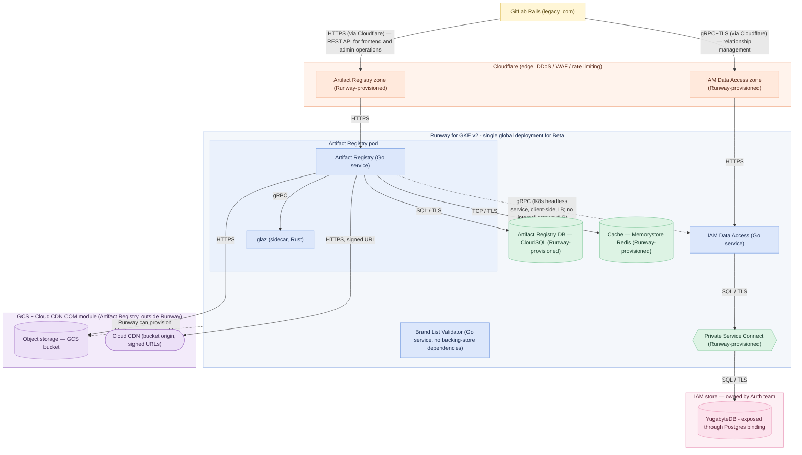

<!-- Design Documents often contain forward-looking statements -->
<!-- vale gitlab.FutureTense = NO -->

## ステータス

**提案中。**

## 背景

Artifact Registry のターゲットデプロイモデルは、Cell ベースのマルチテナントアーキテクチャです。各 Cell は共有エッジ（Cloudflare + Cloud CDN）の背後にある自己完結したリージョナルデータプレーン（GKE、PostgreSQL、Redis、GCS）であり、Anchor Router と Anchor Topology サービスを通じた slug ベースのルーティング（[ADR-022](022_namespace_decoupling.md)）と、Terraform、Argo CD、Fairway によって管理される Cell ライフサイクルを備えます。

そのターゲットをクローズドベータまでに完全に整えることはできません。ベータには FY27-Q2 という固定された期間があり、その依存関係のいくつかはまだ進行中です。

1. **Anchor Router** と **Anchor Topology** サービスは、Artifact Registry がルーティングで利用できる状態にまだありません。それらが存在するまでは、レジストリが自身のデータベースで slug の一意性を所有します（[ADR-022](022_namespace_decoupling.md)）。
1. **Theseus Platform Binding for Cells and Dedicated**、つまり既存の Instrumentor スタックを通じてレジストリを Cell の*内部*にプロビジョニングできるようにする仕組みは、まだ準備できていません。Runway for GKE v2 の作業は、Runway の Enterprise（非 Cellular）インスタンスを明示的に対象としており、Cells と Dedicated のプロビジョニングは後続です。
1. Cell ごとの移行およびリバランシングツールは存在しません。

## 決定

Artifact Registry は、それが依存する Auth コンポーネントとともに、GitLab の内部開発者プラットフォームである [Theseus](https://gitlab.com/gitlab-com/content-sites/handbook/-/merge_requests/19702) を構築するための **最小限の実行可能なプラットフォーム**として使われます。

AR は本番に向かう最初の stateful な GitLab Module であるため、将来の Modular Components が再利用するプラットフォームの各部分、つまりプロビジョニング、サービスバインディング、オブザーバビリティ、ビルド、デリバリーを実地で使います。Theseus プラットフォームチームは、AR チームと Auth チームの**少し先の道を舗装します**。つまり、Cell ベースの完全なターゲットではなく、ベータに必要な最小限のプラットフォームを提供し、プロダクトとプラットフォームを並行して構築します。

Artifact Registry は、Runway の新しい "Runway for GKE v2" ターゲット上で Fairway descriptors を使ってデプロイされます。

Theseus により、アプリケーション開発チームはコンポーネントのバッキングストアをリクエストできます。これらは手動介入を必要とせず、自動化によってプロビジョニングされます。仕組みはリソースによって異なります。Runway はほとんどのバッキングストアを直接プロビジョニングしますが、一部は Artifact Registry の **[COM（Component Ownership Model）モジュール](/handbook/engineering/infrastructure-platforms/production/component-ownership-model/)**として提供されます。これは関連するプロダクトエンジニアリングチームが所有し、Config-Mgmt に統合され、Runway の外部で管理されます。

この分担は Artifact Registry チームと Runway チームの間で合意されました。

| インフラストラクチャ | 提供方法 | 追跡 |
|---|---|---|
| CloudSQL（データベース） | Runway がプロビジョニング | Runway [`team#933`](https://gitlab.com/gitlab-com/gl-infra/platform/runway/team/-/work_items/933) |
| Memorystore Redis（キャッシュ） | Runway がプロビジョニング | Runway [`team#931`](https://gitlab.com/gitlab-com/gl-infra/platform/runway/team/-/work_items/931) |
| Private Service Connect | Runway がプロビジョニング。VPC peering は複雑すぎ、スコープが純増するとして却下 | Runway [`team#934`](https://gitlab.com/gitlab-com/gl-infra/platform/runway/team/-/work_items/934) |
| GCS バケット | 一般ケースでは Runway がプロビジョニング。Artifact Registry では Cloud CDN と結合された COM モジュール | Runway [`team#932`](https://gitlab.com/gitlab-com/gl-infra/platform/runway/team/-/work_items/932); COM [`production-engineering#28463`](https://gitlab.com/gitlab-com/gl-infra/production-engineering/-/work_items/28463) |
| Cloud CDN | Artifact Registry COM モジュール。Runway によるプロビジョニングはなし。GCS と Cloud CDN の結合が強いため、GCS バケットは同じ Terraform モジュールで提供 | COM [`production-engineering#28464`](https://gitlab.com/gitlab-com/gl-infra/production-engineering/-/work_items/28464); [結合に関する決定](https://gitlab.com/gitlab-com/gl-infra/production-engineering/-/work_items/28464#note_3467903274) |
| YugabyteDB（IAM store） | Auth チームが所有し、config-management を通じて提供。Runway がプロビジョニングする Private Service Connect 経由で到達 | [`gitlab#598250`](https://gitlab.com/gitlab-org/gitlab/-/work_items/598250) |

*出典: [Runway work item #44](https://gitlab.com/groups/gitlab-com/gl-infra/platform/runway/-/work_items/44#note_3465201308)。*

Runway がプロビジョニングする依存関係は、Fairway が生成するサービスバインディングを通じてアプリケーションから利用されます。

### 戦略 — 最小限の実行可能なプラットフォームとしての Artifact Registry と Auth

AR と Auth は、Theseus を使ってエンドツーエンドで提供される最初の実際の Modular Components であり、プラットフォーム自体のための **最小限の実行可能なプラットフォーム**として意図的に使われます。つまり、各 Theseus 機能を統合せざるを得ない最小のワークロードです。

Theseus チームは AR チームと Auth チームの少し先の道を舗装し、各フェーズで Beta dotcom ターゲットを提供するために必要な最小限のプラットフォームを提供します。そのターゲットが達成されたら、焦点は Self-Managed Beta ターゲットに移ります。

### 働き方 — 早期かつ継続的な統合

コンポーネントは最後に組み合わせるのではなく、**早期かつ継続的に**統合されます。

開発者は **Caproni**（[`gitlab-org#22286`](https://gitlab.com/groups/gitlab-org/-/work_items/22286)）を使って、フル Cloud Native スタックに対してローカルで統合します。また、**週次デモ**では、AR、Auth、Theseus プラットフォームチームなど、各チームを代表する個人コントリビューターが集まり、できるだけ早期に作業を統合し、修正コストがまだ低いうちにインターフェースのギャップを表面化させます。これにより、ビッグバン型の統合フェーズを、常設のデモ駆動の統合ループに置き換えます。

### フェーズ 1 — Dotcom クローズドベータ

Artifact Registry は **Runway for GKE v2 上の単一グローバルサービス**（Runway の Enterprise、非 Cellular／非 Dedicated インスタンス）としてデプロイされます。

これはマルチテナントであり、**namespace パーティショニング**によってテナントを分離します。データベースは namespace ごとにパーティション化され（[ADR-007](007_database_schema.md)）、オブジェクトストレージのパスと重複排除は namespace ごとにスコープされます（[ADR-008](008_content_addressable_storage.md)）。

フェーズ 1 には、Cell ごとのデプロイ、Anchor Router / Anchor Topology ルーティング、移行ツールはありません。トポロジーは [フェーズ 1 の図](#architecture)に示されています。

以下のコンポーネントが構築およびデプロイされます。

1. **Artifact Registry**（Go）
1. **IAM Data Access** サービス（Go）
1. **GLAZ**（Rust authorization sidecar）
1. **[Brand List Validator](https://internal.gitlab.com/handbook/engineering/architecture/design-documents/artifact_registry/decisions/015_slug_policy/)** サービス（Go）

ベータでは、非 FIPS バイナリとコンテナイメージが GoReleaser で生成されます。FIPS イメージはベータのスコープ外です。

[TUBE 提案](https://gitlab.com/gitlab-com/content-sites/handbook/-/merge_requests/11660)が承認され、TUBE ビルドツールが準備できた場合、プロジェクトへ後付けされます。後付けはアプリケーションコードではなく、ビルドのボイラープレート（CI/CD 構成とビルドスクリプト）に限定される見込みです。これはベータ期間後、または開発中に起こる可能性がありますが、重要なのは、クリティカルパス上にはないということです。

Artifact Registry と IAM Data Access サービスは、それぞれの `FairwayManifest` を通じてバッキングストアをリクエストします。Platform Binding として機能する Runway for GKE v2 がこれらの依存関係を満たし、アプリケーションは **LabKit v2** を通じて公開されるプロバイダー非依存の**サービスバインディング**（Postgres と Redis のバインディング）を通じてそれらを利用します。

注: オブジェクトストレージは LabKit のオブジェクトストレージバインディング経由では利用**されません**。Theseus は一般ケースではオブジェクトストレージのプロビジョニングとサービスバインディングを提供しますが、Artifact Registry は **ネイティブなクラウドプロバイダー SDK（GCS/S3）へ HTTP リクエスト経由で直接アクセス**します。レジストリは、再開可能なチャンクアップロードというネイティブなオブジェクトストレージプリミティブに依存しており、これは現在、汎用的でプロバイダー非依存の抽象化ではサポートできません。Artifact Registry では、オブジェクトストレージは Runway でプロビジョニングされるのではなく COM モジュールを通じて提供されるため、レジストリがエンドポイントを自分で構成します。また、プロバイダー差異（GitLab.com では GCS、Cells では S3）は、バインディングで隠すのではなくアプリケーション構成で扱う必要があります。Artifact Registry と Container Registry の要件を満たす LabKit オブジェクトストレージ抽象化は後続のイテレーションで構築される可能性がありますが、ベータのクリティカルパス上にはありません。

サービスバインディングは、CloudSQL と Amazon RDS と Self-Managed Postgres の違いのような、プロバイダー固有のインターフェースをアプリケーションマニフェストへ漏らしては**なりません**。そのため、同じバインディングが Self-Managed と cellular ターゲット（フェーズ 2）へ、アプリケーション側の変更なしに引き継がれます。

ドライバー選択もバインディングの背後に置かれます。アプリケーションは初期の YugabyteDB 統合に Postgres 互換の `v2/postgres` クライアントを使い、Yugabyte のクラスタ対応スマートドライバーを将来使う場合も、アプリケーションマニフェストで選択するのではなく、LabKit と Runway 構成で扱います。これにより、開発、テスト、本番環境のポータビリティが保たれます。

### フェーズ 2 — Cellular ターゲット

GitLab Dedicated と Cell 向けの Theseus Platform Binding が利用可能になると、Artifact Registry は **Instrumentor を通じて Cell インフラストラクチャの一部として**デプロイされ、Cell ベースのマルチテナントターゲットに到達します。

これは新しい並列の cellular fabric ではなく、GitLab の**既存の** Cells と Dedicated の自動化（Instrumentor スタック）を土台にします。そのために **Dedicated / Cells Platform Binding for Theseus** を加速させます。これは他の GitLab Modules にも同じプラットフォーム基盤への道筋を提供します。

Artifact Registry が Cells に移行すると、顧客は元のグローバルインスタンスから適切な Cell へ**透過的に**移行されます。移行ツールで実現できる範囲で、顧客に見える中断を最小にすることを目指します。この暫定状態からターゲットへの移行には、延期が長引くほど増大する実際のコストとリスクがあります。[ネガティブな結果](#negative)を参照してください。

GitLab.com / Cells の顧客については、デフォルトの配置先は顧客の GitLab Cell と同じ分離境界内の Cell です（目安であり、厳格なルールではありません）。

この時点で、slug の一意性に対する権限は、レジストリ自身のデータベースから Anchor Topology サービスへ移ります。単一インスタンス時代に作成された slug は、2 つ目の Cell が namespace 作成を受け入れられるようになる前に Anchor Topology へ seed しなければなりません。

顧客を移行するために必要な移行ツールは、使い捨ての一回限りの作業ではなく、**通常業務としてのリバランシング機能**として扱われます。

## 結果

### ポジティブ

- Dotcom ベータを FY27-Q2 のタイムラインで出荷できます。Anchor Router、Anchor Topology、Cells/Dedicated 向け Theseus Platform Binding を待つ必要はありません。
- AR と Auth を最小限の実行可能なプラットフォームとして使うことで、実際の本番ワークロードに対して Theseus を構築できます。各機能は、それを必要とするプロダクトの少し先で、次の Modular Component が再利用できる形で提供されます。Caproni と週次デモによる早期かつ継続的な統合により、インターフェースのギャップを、遅い統合マイルストーンではなく修正コストが低いうちに表面化できます。
- Backing store は、所有権が明確な一貫したプロビジョニングモデルに従います。Runway はデータベース、キャッシュ、Private Service Connect を直接プロビジョニングし、アプリケーションは Fairway が生成するサービスバインディングを通じて利用します。Artifact Registry の GCS バケットと Cloud CDN は、プロダクトエンジニアリングが所有する、自己完結した置き換え可能な **COM モジュール**として提供されます。
- Cells の成果物は、実証済みの Cells と Dedicated の自動化を土台とするため、レジストリ、および将来の GitLab Modules に、競合する 2 つの経路ではなく、単一の共有されたデプロイおよび運用経路を提供します。
- グローバルインスタンスから Cells へ移行するために必要な顧客移行作業は、cellular アーキテクチャがいずれにせよ必要とするリバランシングツールとしても機能します。無駄になるものはありません。

### ネガティブ {#negative}

- ベータ期間中、レジストリは **Cellular ではありません**。Cell ごとのデプロイ、リクエストルーティング、移行ツールはありません。ただし Cells は、Runway for GKE で稼働する Global インスタンスを通じて Artifact Registry を利用できます。このフェーズでは Artifact Registry は Global Service ですが、これは[一時的な状態](https://gitlab.com/gitlab-com/content-sites/handbook/-/merge_requests/20067#note_3460179693)です。Artifact Registry を Cellular インフラストラクチャへ移す前に、さまざまな技術的課題を克服する必要があります。これには、[trusted issuer の公開鍵](020_authentication_flow.md#authentication-flow)を同期する必要性や、各 Cell が [Relationships API](https://gitlab.com/gitlab-com/content-sites/handbook/-/merge_requests/18717)を呼び出せることが含まれます。
- Dotcom ベータにおけるテナント分離は、単一の共有データプレーン内の namespace パーティショニングに完全に依存します。cellular モデルが持つより強い分離性とレジリエンス特性は、Cells/Dedicated Platform Binding と、Artifact Registry を cellular アーキテクチャへ準備するために必要なその他の作業によって初めて実現します。
- Dotcom ベータ顧客をグローバルインスタンスから Cells へ後で移行することは避けられず、slug 権限の引き渡し（レジストリデータベース → Anchor Topology）は慎重に設計し実行しなければなりません。この移行を延期すればするほど、リスクは高まります。
  - グローバルインスタンスの垂直スケーリングは一時的なヘッジに過ぎません。グローバルインスタンスが成長する期間が長いほど、最終的な移行は大きく、リスクが高くなります。
  - グローバルインスタンスは Google Cloud（GCS ベース）で稼働し、cellular インスタンスは AWS（S3 ベース）で稼働するため、移動にはクロスハイパースケーラーの egress コストが発生します。このコストは顧客の活動量と、移行サポートまでの遅れの両方に応じて増加します（egress は最初の TB で約 USD 120、最初の 10 TB で約 USD 1,000 の規模です）。
  - Inter-Cell 移行ツールは、cellular（Modular）コンポーネントを構築するすべてのチーム向けの共有インフラストラクチャとして提供されるのが理想です。そうすれば標準化、セキュリティ、運用ベストプラクティスを、コンポーネントごとに再実装するのではなく一度確立できます。
  - その共有インフラストラクチャの構築には時間がかかります。最初の移行の緊急度によっては、ツールが完全に成熟する前に使われる可能性があり、顧客に見える中断を数秒に抑えられるようになる前に、ある程度の中断（数分、場合によっては数時間）が発生する可能性があります。

  Cross-Cell 移行のより広い文脈については、[CTO review migration planning notes](https://docs.google.com/document/d/12eJYdzyCcEUUeBjkV6wIL_5FymsUbh9Tb_yRDWHRWKo/edit?tab=t.i2jtfrt0twt9#bookmark=id.7n3stb68gv0a)を参照してください。

## 検討した代替案

**レジストリ向けに並列の cellular fabric を構築する。**
既存の Cells / Dedicated Instrumentor への投資から独立した、レジストリ固有の Cell アーキテクチャを立ち上げる。
*却下:* プラットフォームの中で最も複雑でコストのかかる部分を重複させ、デプロイと運用のストーリーを断片化し、Single-Tenant、Dedicated、Dedicated for Government、Self-Managed へのモジュールのデプロイを容易にするどころか難しくします。システムの一部だけに cellular アーキテクチャを選び、他には選ばないのは、両方の悪いところ取りです。フリート全体の便益を得られないまま、最も難しいコンポーネントを cellular にするコストだけが発生します。

## アーキテクチャ {#architecture}

### フェーズ 1 — Dotcom ベータサービスアーキテクチャ

