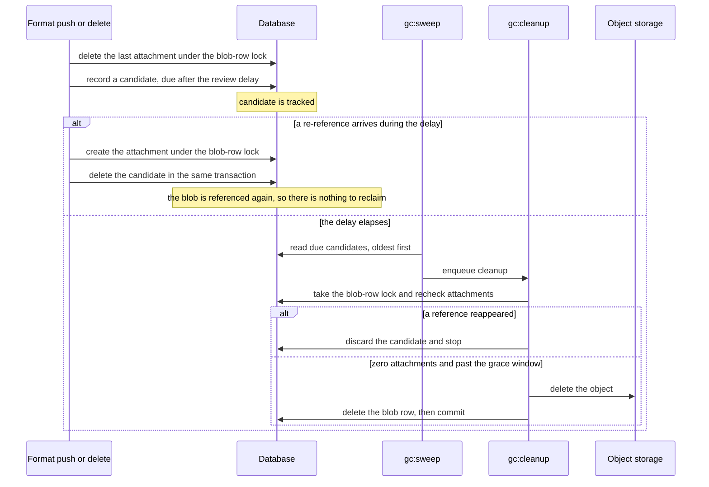
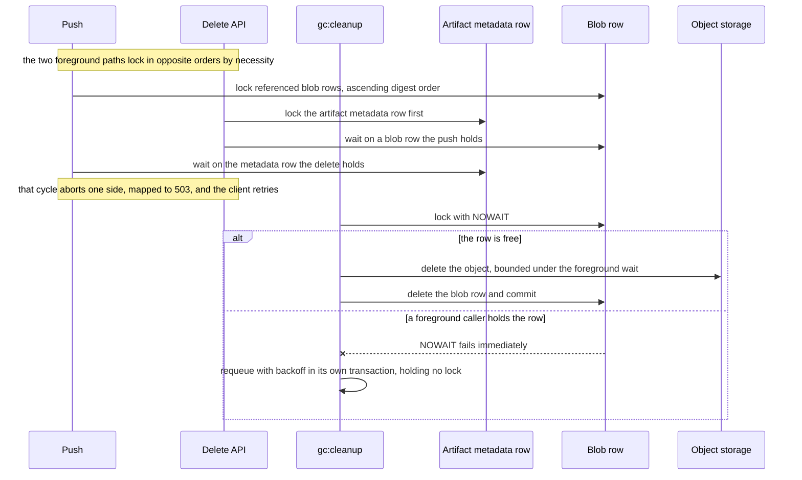

<!-- Design Documents often contain forward-looking statements -->
<!-- vale gitlab.FutureTense = NO -->

## ステータス

**提案済み。**

## コンテキスト

Artifact Registry は、アーティファクトをコンテンツアドレス指定された blob として保存し（[ADR-008](008_content_addressable_storage.md)）、ネームスペース内で重複排除します（[ADR-002](002_storage_deduplication_scope.md)。Organization のマージ後も [ADR-022](022_namespace_decoupling.md) によりネームスペースをキーとして維持）。クライアントがタグ、マニフェスト、パッケージバージョンを削除すると、参照元のメタデータはなくなりますが、blob とそのストレージオブジェクトは残ります。参照されていない blob が蓄積し、ストレージは際限なく増加します。

ガベージコレクション（GC）は、この回収プロセスです。[ADR-010](010_data_retention.md) がその契約を定めています。GC はどのアーティファクトも参照していない blob を回収し、アーティファクトの存続を決して判断しません。保持するタグ、マニフェスト、バージョンを決定するのは、保持、ライフサイクルポリシー、フォーマットレイヤーの役割です。GC は、削除によってアタッチメントが直ちに削除される場合でも、ソフト削除期間の経過後に削除される場合でも、これらのレイヤーが参照なしの状態にしたものを回収します。この ADR は、その *方法* を決定します。

GC を難しくする特性が 2 つあります。どちらも規模ではなく、正しさに関する特性です。

1. **回収によって稼働中の pull を壊してはなりません。** アーティファクトがまだ参照している blob や、同時実行中の push がまもなく参照する blob を削除すると、アーティファクトが壊れ、永久にデータを失います。
1. **削除は元に戻せません。** オブジェクトがストレージからなくなると、取り戻せません。GC のバグは復元可能なレコードを破損するのではなく、バイト列を破壊します。

GitLab Container Registry が本番環境における先例です。最初の GC はオフラインのマークアンドスイープ方式で、書き込みの継続中には安全に実行できません（欠点は「代替案」に記録しています）。その後、オンラインモデルに移行しました。これは遅延付きのレビューキューを使い、現在参照が解除された blob を、再 push で救済できる期間が経過してから回収するものです。オンラインモデルは本番環境で実証済みであり、Artifact Registry はその形を採用します。Container Registry の [オンラインガベージコレクション設計](https://gitlab.com/gitlab-org/container-registry/-/blob/master/docs/spec/gitlab/online-garbage-collection.md)を参照してください。

Artifact Registry は重複排除の境界が狭いため、調整モデルが変わります。Container Registry はインスタンス全体で重複排除するため、ネームスペースをまたぐ参照カウントとグローバルな調整が必要です。その広い範囲により、push と GC の最悪の競合を解消するために必要な削除時ロックは、導入コストが高すぎました。そのため、Container Registry はそのロックを延期しました。[ADR-002](002_storage_deduplication_scope.md) と [ADR-022](022_namespace_decoupling.md) により、Artifact Registry は 1 つのネームスペース内で重複排除することがすでに決定されています。そのため、すべての参照カウントと回収はネームスペース内で完結します。この境界があるため、Artifact Registry は Container Registry のプロトコルを移植せず、独自のプロトコルを設計します。先例との相違点はすべて後述します。

## 決定

**Artifact Registry は、ネームスペース単位のオンライン遅延ガベージコレクションを使用します。** ネームスペース内の最後の参照が削除されると、blob は回収候補になります。候補は一定の遅延期間、レビューキューで待機し、キューから取り出す際に再確認されます。その後にのみ、ストレージからオブジェクトを削除し、続いてメタデータ行を削除します。候補はストレージの列挙ではなく、データベースクエリから取得します。GC は、River ジョブバックエンド（[S27](https://gitlab.com/gitlab-org/ops/artifact-registry/-/blob/main/docs/specs/S27-background-jobs-foundation.md)）と定期スケジューラー（[S27-A](https://gitlab.com/gitlab-org/ops/artifact-registry/-/blob/main/docs/specs/S27-a-periodic-scheduling-foundation.md)）上で一連のバックグラウンドジョブとして実行されます。完全なメカニズムは [S28](https://gitlab.com/gitlab-org/ops/artifact-registry/-/merge_requests/728) で定義しています。この ADR はモデルとその根拠を記録します。

レビューキューは River のジョブテーブルではなく、専用の候補テーブルです。キューには遅延が必要ですが、River は即時実行するジョブをキューに追加します。そのため、レビュー期限はデータベース列に保持し、期限に達した候補を定期ジョブが昇格させます。候補行は繰り返し試行を安全にする役割も果たし、クラッシュ復旧のマーカーでもあります（「ストレージ優先の削除はクラッシュセーフ」を参照）。いずれの役割を果たすにも、候補行は処理するジョブより長く存続する必要があります。River のジョブ行はそうではありません。River はそのジョブ自体の再試行期間中は行を維持しますが、試行回数の上限に達した後の破棄を含め、保持期間の経過後に完了済みの行を削除します。未完了の回収は、その時点を過ぎても可視性を保たなければなりません。キューを専用テーブルに保持することで、回収するという永続的な意図を、実行する使い捨ての試行から分離します。

### モデルの 3 つの特性

**ネームスペース単位。** 回収可能性のテストは 1 つのクエリです。この `(namespace_id, sha256)` にアタッチメントが残っているかを確認します。重複排除がネームスペースにスコープされているため、このクエリにはネームスペースをまたぐ調整、グローバルな参照カウント、パーティションをまたぐスキャンは不要です。ネームスペースの境界により、Artifact Registry は削除時の blob ロック（後述）を利用できます。Container Registry のインスタンス全体のモデルでは、コストが高すぎるとして延期されたものです。

**オンライン。** GC はストレージを走査するのではなく、最後の参照が削除されたときにデータベースから blob が参照されていないことを把握します。アプリケーションは、アタッチメントを削除する同じコードパスで候補を記録します。blob 行を低頻度でスキャンすることで、そのパスを補完します。このスキャンもストレージではなくデータベースを読み取ります。

**遅延。** 回収が削除と同期して行われることはありません。同期的な回収は、オブジェクトがまだ存在することを前提とする、ほぼ同時の再 push と競合します。この競合は規模に関係する正しさの特性です。1 日に 1 回しか push しないシングルテナントレジストリにも存在します。レビュー遅延（デフォルトは 24 時間）、キューから取り出す際の再確認、行ロックによって、この競合を解消します。

### 参照カウントを到達可能性のモデルとする

blob の参照カウントは、ネームスペース内のアタッチメント数です。このカウントがゼロになると、GC は blob を回収します。どのアーティファクトを保持するかは、GC が blob を認識する前に決定されているため（[ADR-010](010_data_retention.md)）、到達可能性グラフを構築せず、アーティファクトの生存性も計算しません。

これが中心となる簡素化です。Artifact Registry では、OCI の config または layer blob、Maven ファイル、npm tarball のすべてを GC は同じものとして扱います。つまり、アタッチメント数を持つコンテンツアドレス指定された blob です。削除またはソフト削除の期限切れによってアーティファクトのアタッチメントが削除されると、GC はアタッチメント数がゼロになった blob を回収し、それ以外は残します。別のアーティファクトがまだ参照する blob のカウントはゼロではないためです。Container Registry は、マニフェストから blob への参照を追跡する専用テーブルと複数のトリガーを維持します。Artifact Registry にはどちらも不要です。アタッチメント行自体が参照だからです。

削除によって *どの* アタッチメントを削除するかの判断は、フォーマットレイヤーとソフト削除の期限切れ（S20、計画中）に属し、GC には属しません。ここで言及する価値のある、フォーマット固有の帰結は OCI です。タグなしのマニフェストは、保持され、一覧表示できるアーティファクトのままです。[ADR-010](010_data_retention.md) に従い、その ADR が指定する削除トリガーだけがマニフェストを削除します。そのため、タグがないことは、GC がマニフェストを削除する理由にはなりません。

### 候補のライフサイクル

| ステージ | 実行されること |
|---|---|
| **記録** | フォーマットが blob の最後のアタッチメントを削除する。同じトランザクション内で、レビュー遅延とジッターの経過後にレビュー期限を迎える候補を GC が記録する。 |
| **追跡中** | 候補が遅延期間の経過を待つ。この期間中に再参照されると、アタッチメントを作成する同じトランザクション内で候補が削除されるため、blob は回収されない。 |
| **期限到来** | 遅延期間が経過する。GC は blob 行のロック下でアタッチメントの確認を再実行し、猶予期間に対する blob の経過時間も再テストする。参照が再び現れた場合、GC は候補を破棄して停止する。まだ猶予期間内の blob は回収せず、期間後に再びキューに追加する。 |
| **回収済み** | 参照がなく、猶予期間も過ぎているため、GC は 1 つのトランザクション内で、まずストレージからオブジェクトを削除し、次にメタデータ行を削除する。 |

候補を消去するメカニズムは 2 つあり、それぞれ異なる期間を対象とします。遅延期間中の再参照は、push パス上で、アタッチメントを作成するトランザクション内から候補を直ちに削除します。キューから取り出す際の再確認は、スイープがすでに進行中にコミットされる再参照など、即時消去では認識できないものすべてを補完します。候補は回収の *提案* であり、ロック下で最後の瞬間にのみ確定します。そのため、遅延を単なる形式ではなく安全なものにするのは再確認です。

即時消去は単なる整理ではありません。有効な候補行は、blob 行が信頼できない可能性を示すシグナルです（「ストレージ優先の削除はクラッシュセーフ」を参照）。そのため、再参照された blob に古い候補を残すと、その digest に対する以後のすべての重複排除スキップで、無意味なストレージ存在確認が発生します。また、キューを実際のガベージ量に比例させ、キュー深度と最古経過時間のメトリクスが表す内容を正確に保ちます。そのコストは、すでに blob 行のロックを保持するトランザクション内で、パーティションプルーニングされた削除を 1 回追加することです。

### ジョブファミリー

GC は 6 種類のジョブで構成され、すべて River 上で実行されます。ここで名前を挙げることで、このドキュメントの残りの部分が読みやすくなります。後述する複数の制御や障害モードは、特定の 1 ジョブにスコープされているためです。

| ジョブ | 実行間隔 | 責務 | フェーズ |
|---|---|---|---|
| `gc:sweep` | 定期、リーダー選出 | 期限に達した候補を古い順に読み取り、クリーンアップをキューに追加する。スイープを行うリーダーは 1 つで、重複してキューに追加しても安全な no-op となるため、行ロックは取得しない。 | 1（スケルトン）、2 |
| `gc:cleanup` | 候補ごと、またはバッチごと | blob 行のロックを取得し、アタッチメントと猶予期間に対する blob の経過時間を再確認し、ストレージ優先の削除を実行する。blob のバイト列を破壊する唯一のジョブ。 | 2、3 |
| `gc:reconcile-scan` | 定期、低頻度 | 補完機構。猶予期間より古く、アタッチメント数がゼロで、ネームスペースに処理中のアップロードがない blob を見つけ、イベントパスが見逃した候補をキューに追加する。 | 1 |
| `gc:expiry-sweep` | 定期、ネームスペースごと | ソフト削除期間が経過したパッケージファイルのアタッチメントを解除する。アタッチメントの削除によって候補が記録される。 | 4 以降 |
| `gc:cache-evict` | 定期、ネームスペースごと | サイズ上限によって開始されるキャッシュ退避。キャッシュのアタッチメントを解除し、オブジェクトを直接削除しない。 | 4 以降 |
| `gc:staging-sweep` | 定期 | 期限切れの各アップロードセッションについて、ステージングオブジェクトと行を削除する。放棄されたアップロードには救済する参照がないため、レビュー遅延は設けない。 | 4 以降 |

blob のバイト列を破壊するのは `gc:cleanup` だけです。他の 5 つは、このジョブに入力を与えるか、共有コンテンツではないものに作用します。`gc:expiry-sweep` と `gc:cache-evict` はアタッチメントを解除し、回収パスが評価する候補を生成します。`gc:staging-sweep` は blob にならなかったステージングオブジェクトを削除します。これにより、前述の契約が維持されます。有効期限切れのスイープは、アーティファクトの存続を自ら判断するのではなく、ポリシーが決定した保持のしきい値を実施します。そして、そのアタッチメント解除によって参照を失った blob は、他のすべての blob と同じ、アタッチメント数がゼロのパスを通じてのみ回収されます。

`gc:reconcile-scan` はストレージ内のオブジェクトではなく、データベースの blob 行をスキャンします。これは放棄されたアップロードを消去するのではなく、*記録漏れ* を復旧するために存在します。放棄されたアップロードの消去は、異なるトリガーを持つ別のジョブ `gc:staging-sweep` が担います。この 2 つは混同されることが多いため、区別が重要です。記録漏れでは、実体のあるバイト列を持つ blob が、どこからも参照されない状態で残ります。一方、放棄されたアップロードは blob にすらなっていません。

スキャンは blob 行を読み取るため、2 種類のリークを制限しますが、3 つ目は検出できません。どこからも参照されない blob 行、つまり記録漏れを検出します。孤立した *アタッチメント* 行は、blob のカウントがゼロではなくなるため検出しません。また、ストレージに存在しながら blob 行がまったくないオブジェクトも、ストレージを列挙しないため検出できません。後の 2 つは、ストレージとデータベースを直接比較する、延期されたデータ照合サービス（[ADR-011](011_data_reconciliation.md)）が担います。

### GC が River から利用するものと、GC 自身が管理するもの

GC は、適合する箇所では River 自身の信頼性プリミティブを使用します。元に戻せないパスで同等の仕組みを自作すると、新たな誤りの原因になるためです。

1. **失敗時の再試行。** ロック競合、ストレージのタイムアウト、バックエンドエラーが発生したクリーンアップは、処理を失わずにロールバックして再びキューに追加する。バックオフスケジュール自体は GC が管理し、そのスケジュールを設定したジョブ試行より長く存続できるよう、候補行に保持する。
1. **最大試行回数。** 決して成功しない候補は、永遠に再試行してジョブ行を消費し続けることなく停止する。
1. **キュー追加の一意性。** 次のスイープでも期限に達したままの候補は、ジョブ行を増殖させず、処理中のジョブに集約される。
1. **リーダー選出を伴う定期スケジューリング**（[S27-A](https://gitlab.com/gitlab-org/ops/artifact-registry/-/blob/main/docs/specs/S27-a-periodic-scheduling-foundation.md)）。これにより、正確に 1 つのレプリカがスイープする。

GC が独自に管理するものは 3 つあります。1 つ目は、前述のバックオフスケジュールです。2 つ目はレビュー遅延で、スケジュールされたジョブではなく候補テーブルに保持します。単に遅延を待つのではなく、キューから取り出す際に、実際のアタッチメント状態に対して遅延を再評価する必要があるためです。3 つ目として、一意性のスコープは処理中の状態だけに限定します。River のデフォルト集合には完了済みジョブが含まれており、1 回のレビュー遅延期間内に 2 回参照解除された blob の 2 回目のクリーンアップが抑制されてはならないためです。

### blob 行ロックは、GC が敗北し得るすべての競合を直列化する

アタッチメントを追加または削除するすべての操作と GC の削除自体は、まず対象の `(namespace_id, sha256)` に対応する `blob_storage_blobs` 行に対して `SELECT ... FOR UPDATE` を取得します。この 1 つのロックが、blob の状態を破損し得る 3 つの競合を直列化します。つまり、同じ候補を記録しようとする 2 つの削除の競合、GC の削除と push の競合、GC がオブジェクトを削除中の行を重複排除スキップが信頼する競合です。

各呼び出し元が取得モードを選択するため、GC がクライアントを待たせることはありません。

| 呼び出し元 | 取得方法 | 競合時 |
|---|---|---|
| フォアグラウンドの push または削除 | `NOWAIT` も `SKIP LOCKED` も指定しない通常の `FOR UPDATE`。呼び出し元は最大 5 秒のロックタイムアウトまで、現在の保持者の後で待機する | クライアントが再試行する HTTP 503 を返す |
| バックグラウンド GC ワーカー | `FOR UPDATE ... NOWAIT`、または非常に短いタイムアウト | バックオフ付きで候補を再びキューに追加する |

フォアグラウンドパスは、スキップせず意図的に待機します。`SKIP LOCKED` を使用すると、プロトコルが依存する直列化なしで push が進行します。`NOWAIT` を使用すると、同時回収とのわずかな接触でもクライアントにエラーが表示されます。以下で説明する 1 つの例外を除き、すべての保持者はロック下で実行するストレージ処理を制限しているため、このパスでは待機が正しい動作です。

フォアグラウンドの削除パスでは 2 つのロックがネストし、その順序は固定されています。削除は最初にアーティファクトメタデータ行を取得し、次に参照を解除する blob 行を取得します。push はメタデータ行を作成する途中で、参照を検証するまでロック対象が存在しないため、この順序を使用できません。そのため、push は最初に blob 行を digest の昇順で取得し、2 つの同時 push が互いに循環することを防ぎます。この 2 つの順序は、実際に相互にデッドロックする可能性があります。PostgreSQL のデッドロック検出器が一方を中止し、両方のフォアグラウンドパスは、その中止をロックタイムアウトと同じ 503 に変換します。クライアントが再試行するため、マッピングされていない 500 を受け取る呼び出し元はありません。GC の再キュー追加は、この順序には含まれません。これは、ロールバックされた処理トランザクションとは別の独自トランザクションで実行され、blob 行ではなく候補行とジョブ行を書き込みます。そのため、ワーカーはロックに失敗して処理を中断した blob 行の候補を再びキューに追加できます。離れた blob に対するロックは不要です。

ロックを保持しているプロセスにかかわらず、競合は同じ方法で解消されます。プロトコルは呼び出し元の種類ではなく取得モードで定義されるためです。バックグラウンドワーカーが保持中の行を見つけた場合、その保持者が API リクエストでも別の GC ワーカーでも、直ちに処理を中断して再びキューに追加します。

Container Registry がレビューキュー行をロックするのに対し、Artifact Registry は blob 行をロックします。この選択については「代替案」で検討しています。そのコストとしてロックが push パス上に置かれ、blob を共有する 2 つの push は重複排除の存在確認中に短時間直列化されます。ネームスペース単位の境界により、この競合は 1 つのテナント内に限定されます。

ストレージへのラウンドトリップ中にロックを保持する操作は 2 つあり、どちらもフォアグラウンド呼び出し元が待機する 5 秒の範囲内となる 2 秒に制限します。`gc:cleanup` はオブジェクト削除中にロックを保持します。push は、blob 行に有効な候補を見つけた場合にだけ実行する、重複排除スキップを検証する存在確認中にロックを保持します。いずれのタイムアウトでもトランザクションがロールバックされ、何も削除またはアタッチされないままロックが解放されますが、2 つの結果は異なります。GC 側では遅いバックエンドによって回収が遅延します。一方、push 側ではクライアントが再試行するための 503 を返します。push パスには制限されていないケースが 1 つ残っています。存在確認でオブジェクトがないことが判明した push は、同じトランザクション内で再アップロードするため、ロックの保持時間はアップロードに要する時間と同じになります。すでにオブジェクトを削除した削除処理だけが blob 行をこのパスに至る状態にできるため、初めてこの状態が生じるのはフェーズ 3 です。保持時間を制限することは、このフェーズの開始ゲート基準の 1 つです（「運用上の制御」を参照）。

### ストレージ優先の削除はクラッシュセーフ

GC はデータベース行より先にストレージオブジェクトを削除します。アタッチメント数がゼロの blob には到達できないため、削除中に pull が到達することはありません。ストレージの削除後、コミット前に GC がクラッシュした場合、トランザクションはロールバックされ、オブジェクトがない状態で blob 行が残ります。

候補行によって、この状態から復旧できます。候補行は以前のトランザクションで書き込まれているため、blob 行を復元するロールバック後にも残ります。blob 行に有効な候補があることは、その行が存在するオブジェクトを正しく表していない可能性があるというマーカーそのものです。行が存在することを理由に再アップロードをスキップしようとする以後の push は、その候補を検出し、ロック下でストレージに対してオブジェクトを再検証し、なければ再アップロードします。次の `gc:cleanup` は削除を再試行します。オブジェクトがないことは成功とみなされるため、これは冪等です。これにより、[ADR-008](008_content_addressable_storage.md) の保証が同時実行下でも維持されます。最悪の場合でも、ストレージが一時的に孤立するだけであり、削除済みオブジェクトへの有効な参照が生じることはありません。

### 猶予期間と、それでも保護できない 1 つの公開処理

新しくコミットされた blob は、その行が書き込まれてからフォーマットがアタッチするまでの短時間、アタッチメントがない状態になります。イベントパスでこれを回収するものはありません。候補の記録は参照ありから参照なしへの遷移時に実行されますが、一度もアタッチメントを持たない blob にはその遷移がないためです。アタッチメントの削除ではなく blob 行を基準に処理する `gc:reconcile-scan` だけが、このような blob をキューに追加できるパスです。2 つのフィルターがこれを防ぎます。1 つは、blob 行の作成時刻から測定して、固定の 24 時間の猶予期間より新しい blob をスキップするものです。もう 1 つは、処理中のアップロードを保持するネームスペース内の blob をスキップするものです。この期間は設定項目ではなくコンパイル時定数であり、テストするすべてのパスが 1 つのシンボルを共有します。そのため、値を調整しても 2 つのパス間で不一致が生じません。`gc:cleanup` も削除前に同じ経過時間のテストを適用するため、この期間はキューへの追加だけでなく回収も防ぎます。

候補の記録を blob 行が書き込まれる時点まで早めても役に立ちません。このような候補は、アタッチメントが作成されると再確認時に破棄されます。これは補完スキャンがすでにホットパス外で実行していることです。また、すべての push のすべての blob に候補の書き込みと削除が追加されます。期間より遅い公開処理はどちらの方法でも回収されるため、以下のギャップも解消しません。

blob 自身のアップロードセッションは、コミット時に猶予期間が始まる前に削除されるため、処理中アップロードのフィルターは、実際に危険にさらされる blob を保護しません。このフィルターが保護するのは、同じネームスペース内の、無関係で長時間維持されたセッションだけです。そのため、コミット済みだが未アタッチの blob を実際に保護するものは経過時間だけであり、その期間はコミットから最初のアタッチメントまでの間隔より長くなければなりません。それより長く実行される公開処理は、実行時間全体にわたって何らかのアップロードセッションをネームスペース内で開いたままにする必要があります。

どのセッションの有効期間よりも長い公開処理が、経過時間で保護できない残余です。これは処理中に回収される可能性があります。これを解消するには、フォーマットが選択した期限まで blob を保護済みとしてマークできるストレージレイヤーの後続作業が必要ですが、まだ実装されていません。これはモデルに残る唯一の未緩和のデータ損失パスであり、黙って受け入れるのではなく追跡します。

### アクティブに使用されている blob は、設計上回収されない

最後の参照が削除された後、各レビュー期限までに再作成される blob は、回収が永遠に延期されます。再参照のたびに候補が消去され、次の参照解除時には遅延期間全体を持つ新しい候補が記録されるため、頻繁に再利用される blob は回収されることなく、このサイクルを無期限に繰り返す可能性があります。

これは意図した結果であり、スターベーションのバグではありません。24 時間未満の間隔で再び参照される blob は、アクティブに使用されています。これを回収すると、次の push で同じオブジェクトを再度アップロードしなければなりません。そのコストは、頻繁な変更が続く間、重複排除された blob 1 つ分のストレージを使用することです。これは blob 自体のサイズに制限され、どの正しさの特性も、その blob が回収されることに依存しません。即時消去により、このパターンでもキューのメトリクスは正確に保たれます。また、このサイクルにおける唯一の実質的なコストは push パス上にあります。各記録後の最初の再参照で有効な候補を検出するため、頻繁に変更される blob は記録と消去のサイクルごとに、ロック下で存在確認を 1 回実行します。この範囲を狭めるかどうかは、後述する未解決事項です。

### 障害処理では不良バックエンドと不良候補を分離する

ストレージの削除が失敗する理由は 2 つあり、GC はそれぞれ異なる方法で処理します。永続的な障害への対応は恒久的な除外であり、正常な候補を除外してはならないためです。

1. **環境障害**は、候補ではなくバックエンドの障害です。タイムアウト、ネットワークエラー、バックエンドの 5xx、スロットリングなどがあります。その性質上相関しており、劣化したバックエンドでは処理中の多数の削除が同時に失敗します。これらが広範囲に発生すると、スイープを一時停止します。一時停止は期間が制限され、自動的に再開するため、バックエンド障害によって回収が遅延しても、プローブなしで復旧します。
1. **候補固有の障害**は、バックエンドが他の削除を正常に処理している間も、1 つの blob に結びついて繰り返し発生する障害です。発生するたびにストライクを加算し、ストライク数の増加に応じてバックオフを長くします。上限数のストライクに達すると、オペレーターが確認できるよう候補を除外します。

GC は、壊れやすくバックエンド固有であるバックエンドのエラー文字列を分類しません。2 つのケースを分けるのは、観測された障害の *割合* です。広範囲なら環境障害、孤立していれば候補固有です。そのため、ストライクは、スイープの一時停止がまだ有効になっていない場合にだけ記録します。これにより、障害によってキュー全体が除外に向かうことを防ぎます。Container Registry の障害時に延期するレジリエンスを維持しつつ、欠けていた上限を追加するため、実際に処理不能な候補が永遠に再試行されることはありません。

候補を除外することは、削除ではありません。行は残りますが、部分インデックスによってキューからの取り出し対象外となり、キューの排出シグナルからも除外されます。そのため、1 つの処理不能な候補によってキューの経過時間や期限到来数が増大することはありません。メトリクスによって件数をオペレーターに示して調査できるようにし、GC は自動的に再試行しません。このような blob を体系的に復旧する役割は、ストレージとデータベースの実際の状態から再導出できる、延期されたデータ照合サービス（[ADR-011](011_data_reconciliation.md)）に属します。この状態は GC のキュー内部のものであり、プロダクトロードマップにある、ユーザーが確認できるアーティファクトに作用するアーティファクト隔離機能とは無関係です。

### 運用上の制御

1. **実行時キルスイッチ**により、デプロイなしで blob の回収を停止します。これは LabKit の Flipt ベースのクライアントを通じて評価されるフィーチャーフラグであるため、オペレーターはデータベース行を書き換えるのではなく、他のフラグと同じ方法で切り替えます。元に戻せない削除を保護するスイッチには、2 つの重要な特性があります。フェイルクローズであるため、GC がフラグサービスに到達できない場合は回収が無効になります。障害時には制御を失うのではなく回収が停止し、復旧可能なリークとの引き換えに保証を維持します。また、`gc:cleanup` はバッチごとに 1 回ではなく、各候補を削除する前に再評価するため、停止までの時間がバッチサイズに応じて増加しません。これは、GC を有効にするデプロイ時設定や、データベースに保持するスイープ一時停止状態とは異なります。スイープ一時停止状態は、オペレーターが設定するものではなく、ワーカー間で調整するためにデータベースに保持します。
1. **メトリクスと構造化イベントがオペレーター向けインターフェースです。** キューゲージは、追跡中の候補数、期限到来した候補数、最古候補の経過時間、除外された件数を報告します。追跡中の候補数が多いことは正常な定常状態です。これらの候補は、まだ経過していない遅延期間を待っているためです。キューゲージと並んで、push パスには blob 行ロック待機時間のヒストグラムと、重複排除の存在確認回数という 2 つの計測があります。どちらもフェーズ 1 から有効になり、削除試行マーカーに関する未解決事項を、フェーズ 3 の開始前に判断するデータとなります（「未解決事項」を参照）。元に戻せない削除ごとに、digest とネームスペースを含むイベントも発行するため、すべての削除にフォレンジックの証跡が残ります。
1. **5 つのアラームが障害モードを網羅します。** 期限到来数の増加は、ワークロードがガベージを生成する速度よりも GC の排出が遅いことを意味します。連続するスクレイプにわたってスイープの一時停止が有効なままである場合、ストレージバックエンドで削除の失敗が長く続き、一時停止が維持されているため、回収が停止しています。除外件数がゼロでなければ、候補にオペレーターの対応が必要です。オブジェクト数またはバイト数で表す回収率が直近のベースラインの倍数を超えると、過剰削除のトリップワイヤーが作動します。これは記録のバグや上流での過剰な参照解除による損失の前兆であり、他のアラームでは検出できない唯一の障害です。5 つ目は回収の停止を報告し、オペレーターの意図的な停止と、フェイルクローズのフラグ自体が生じさせた停止を区別します。そのため、どちらも排出障害と誤診されません。
1. **ネームスペース単位の管理ステータスルートはフェーズ 4 で導入します。** そのネームスペースの候補数、最古候補の経過時間、除外件数、最後に回収を完了した時刻を報告します。これにより、フリート全体のメトリクスでは回答できないネームスペース単位のサポート質問に答えられます。以前のフェーズでは、メトリクスとイベントによってオペレーターの質問に対応し、フェーズ 1 と 2 では何も削除しません。
1. **段階的ロールアウト**では、すべてのデータ損失リスクをゲートで保護された 1 ステップに集中させます。フェーズ 1 では、スキーマ、候補の記録、補完スキャンを提供し、削除は行いません。フェーズ 2 では、再確認して破棄するパスを追加しますが、まだオブジェクトは削除しません。フェーズ 3 では、1 つの開始ゲートの背後で、元に戻せないオブジェクト削除を有効にします。両側の push ロックが実装され、競合テストで証明されていること、猶予期間のプロパティテスト、観測された再 push のタイミングに対してレビュー遅延が検証されていること、再アップロード時のロック保持に上限があること（「blob 行ロックは、GC が敗北し得るすべての競合を直列化する」を参照）が条件です。フェーズ 3 で初めて、このロック保持が生じます。フェーズ 4 以降では、パッケージフォーマットのソフト削除期限切れスイープ、仮想およびリモートリポジトリのキャッシュ退避、放棄されたアップロードのクリーンアップを追加します。

### Container Registry との相違点とその理由

Artifact Registry は Container Registry の形を採用するため、意図的な相違点にはそれぞれ理由があります。

1. **インスタンス全体ではなくネームスペース単位。** [ADR-002](002_storage_deduplication_scope.md) と [ADR-022](022_namespace_decoupling.md) で決定済みです。すべての参照カウントがネームスペース内で完結するため、Container Registry の削除時ロックを導入困難にした、ネームスペースをまたぐ調整が不要になります。
1. **レビューキュー行ではなく blob 行をロックする。** blob 行は永続的な不変条件であるため、1 つのロックが候補記録の競合、push の競合、クラッシュ復旧に対応します。push パス上で短時間直列化するコストを受け入れます。
1. **アタッチメント数を参照カウントとする。** アタッチメント行自体が参照であるため、専用の参照テーブルやトリガーは不要です。
1. **レビューキューはジョブバックエンドのテーブルではなく、専用テーブルとする。** 遅延はキューから取り出す際に再評価する必要があり、クラッシュ復旧のマーカーとして機能するには、候補行が個々の試行より長く存続する必要があります。
1. **候補の記録はゼロへの遷移時にだけ実行する。** 他の参照が残る参照解除では何も書き込みません。Container Registry は残る参照の有無にかかわらず、参照解除のたびにキューへ追加するため、まだ参照されている blob もキューに保持します。一方、Artifact Registry は 1 回のガベージ発生期間につき、blob ごとに 1 行を保持し、実際のガベージ量に比例します。
1. **再確認を待たず、再参照時に候補を直ちに消去する。** 候補行は信頼できない行のマーカーを兼ねるため、古い候補があると以後の重複排除スキップに負荷を与えます。また、キューのメトリクスを意味のある状態に保ちます。
1. **永続的な障害に上限を設ける。** Container Registry は、処理に失敗する候補を無期限に延期しました。上限数のストライク後に候補を除外することで、実際に処理不能な候補が永遠に再試行されることを防ぎます。また、割合に基づく分離によって、障害時に多数の候補が除外されることを防ぎます。

## 帰結

### ポジティブ

1. **システム全体を停止しない。** オンライン GC は、オフラインのマークアンドスイープとは異なり、書き込みをブロックせず継続的に回収します。
1. **正しさのための 1 つのメカニズム。** blob 行ロックが候補記録の競合、push と GC の競合、クラッシュ復旧のケースを解消します。
1. **単純な到達可能性モデル。** アタッチメント数を参照カウントとするため、blob の回収にアーティファクトの生存性グラフ、フォーマットごとの参照テーブル、トリガーは不要です。
1. **制限された影響範囲。** ネームスペース単位の境界によって、ネームスペースをまたぐすべての調整が不要になります。レビュー遅延と再確認により、誤った参照解除は削除時点まで復旧可能です。
1. **候補記録の復旧が可能。** 記録漏れは `gc:reconcile-scan` が回収するストレージリークであり、早すぎる削除には決してなりません。記録は、損失ではなくリークする方向に誤ります。損失し得る 1 つのパスは、コミット済みだが未アタッチの残余であり、「ネガティブ」に記録しています。
1. **インシデント中にも運用可能。** 実行時キルスイッチはデプロイなしで回収を停止し、フラグサービスに到達できない場合はフェイルクローズします。また、段階的ロールアウトにより、元に戻せないリスクを 1 つのゲートの背後に分離します。

### ネガティブ

1. **回収は即時ではなく遅延する。** 現在参照解除された blob は、レビュー遅延後にのみ回収されます。オペレーターとユーザーには、ストレージが論理的に削除されていても物理的にはまだ解放されていない状態が見えます。そのため、遅延回収で生じやすい「何も起きなかった」という混乱を避けるには、キューのメトリクスとバイト数の計算で回収待ちを可視化する必要があります。
1. **未緩和のデータ損失パスが 1 つある。** コミットから最初のアタッチメントまでの間隔が、猶予期間とネームスペース内の処理中アップロードセッションの両方より長い公開処理では、処理中に blob が回収される可能性があります（「猶予期間と、それでも保護できない 1 つの公開処理」を参照）。これはまれで追跡済みです。そのセクションで挙げたストレージレイヤーの後続作業が実装されるまで、フェーズ 3 の削除は開始ゲートの背後に置かれます（「運用上の制御」を参照）。そのため、各フォーマットが元に戻せない削除を提供するのは、その公開処理が期間内に収まるようになってからです。
1. **ホットパス上のロック。** blob を共有する 2 つの push は、blob 行ロックによって短時間直列化されます。Artifact Registry にはまだ本番トラフィックがなく、Container Registry は別の行をロックしていたため、複数フォーマットにまたがる同一ネームスペース内の実際の push 同時実行下での規模は未計測です。ボトルネックとして扱う前に、負荷テストで定量化する必要があります。
1. **仕様をまたぐ連携。** 安全な削除は、フォーマットの push パスが同じロックを取得することに依存します。GC は最初にキュー側を提供し、両側のロックがフェーズ 3 の開始ゲートの最初の項目になります（「運用上の制御」を参照）。
1. **キャッシュと孤立したアタッチメントへの対応の延期。** キャッシュ退避はアタッチメント数がゼロになったことではなく容量によって開始され、キャッシュテーブルとともに導入されます。一部の孤立したアタッチメントのリークと、blob 行がまったくないストレージ内のオブジェクトは、延期されたデータ照合サービス（[ADR-011](011_data_reconciliation.md)）の提供後にのみ回収されます。これらはすべて復旧可能なリークであり、データ損失ではありません。
1. **提供開始時の唯一の安全網は補完スキャン。** [ADR-011](011_data_reconciliation.md) はストレージとデータベースの照合サービスを延期するため、それまでは `gc:reconcile-scan` だけが復旧を担います。また、対象はすべてのリーク種別ではなく、blob のリークです。

## 代替案

### オフラインのマークアンドスイープ

ストレージ全体を列挙し、有効なメタデータから到達可能なものすべてにマークを付け、マークのない残りをスイープします。これは Container Registry の元のモデルです。

**却下した理由。** 書き込みを停止しなければならず、停止しない場合は同時実行中の push が参照する blob を削除する危険があります。変更量にかかわらずストレージ全体をスキャンし、大規模なスイープは中断後に正常に再開できません。オンライン GC は変更量に比例する処理を行い、書き込みをブロックしません。

### 同期的な参照カウント式削除

最後の参照が削除された瞬間に、オブジェクトを削除します。

**却下した理由。** オブジェクトがまだ存在することを前提とする、ほぼ同時の再 push と競合し、この競合はどの規模でも存在します。レビュー遅延、再確認、ロックによって解消できますが、即時削除では解消できません。

### 候補記録のためのデータベーストリガー

アタッチメントテーブルの `AFTER INSERT` および `AFTER DELETE` トリガーを使用して、候補を記録および消去します。

**提供開始時に却下した理由。** アタッチメントを削除するすべての箇所は、すでに 1 つの共有ストアを経由します。そのため、アプリケーションコード内で候補を記録すれば、単体テストが可能になり、同じパスで可観測性イベントを発行できます。また、記録漏れは補完機構が回収する復旧可能なリークです。トリガーにも同じ read committed の競合が存在し（これを解消するのは行ロックであり、トリガーではありません）、これらの利点がありません。経路を保護するため、`forbidigo` lint によってテーブルに対する直接の削除を禁止します。将来のフォーマットがストア外でアタッチメントを削除する場合は、再検討します。

### blob 行ではなくレビューキュー行をロックする

Container Registry と同様に、GC パス上で候補行をロックし、ホットな blob パスはロックなしに保ちます。

**却下した理由。** blob 行は永続的なコンテンツアドレス指定の不変条件です。そのため、blob 行をロックすれば、ロックに参照上の意味を持たせ、1 つのメカニズムで 3 つすべての競合に対応できます。キュー行をロックする場合は、push と GC の競合とクラッシュ復旧のケースに別のメカニズムが必要です。前述した、push パスでの短時間の直列化というコストを受け入れます。

### digest をキーとする分散ロック

blob 行自体をロックせず、`(namespace_id, sha256)` をキーとするアドバイザリロックまたは Redis ロックで直列化します。

**却下した理由。** 行ロックに追加のラウンドトリップは不要です。ロックが必要なすべてのパスは、すでにその行を読み書きしており、同じステートメント内でロックを取得できるためです。アドバイザリロックや外部ロックは、別のサブシステムに対する別の取得処理であり、単独では何も保護しません。blob 行は、ロックの取得を忘れたパスから引き続き書き換え可能ですが、行ロックなら行自体によって強制されます。また、アドバイザリキーはペアの 64 ビットハッシュであるため、無関係な digest が同じキーに衝突し、互いに直列化される可能性があります。Redis ロックは、元に戻せないパスに 2 つ目の障害ドメインを追加し、その正しさはトランザクション境界ではなくリースの期限切れに依存します。blob 行のロック待機が実際にボトルネックであると負荷テストで判明した場合にのみ、再検討する価値があります（「帰結」を参照）。

### 帯域外のオブジェクト削除

最初にメタデータの変更をコミットし、次に別のジョブでストレージからオブジェクトを削除します。これにより、ストレージ呼び出し中に blob 行ロックを保持するトランザクションがなくなります。

**提供開始時に却下した理由。** クラッシュ復旧を安全にする順序が逆転します。ストレージ優先の削除では、オブジェクトがない状態で残る blob 行には、必ず信頼できないことを示す有効な候補が存在します。行を先に削除すると、オブジェクトを指すものがなくなります。そのため、2 つのステップ間でクラッシュすると、GC のスキャン対象である blob 行が存在せず、GC が検出できないリークが発生します。延期された照合サービスだけが検出できます。この方法で回避できるロック保持時間は、すでに 2 秒に制限され、フォアグラウンド呼び出し元が待機する時間を十分に下回ります。また、タイムアウトによって何も削除せずロックを解放します。この保持時間が push のレイテンシーに悪影響を及ぼすことが計測で判明した場合、この案が最有力です。到達可能性モデルの変更ではなく、トゥームストーン状態が必要になります。

### マニフェストから layer へのエッジを実体化する

push 時にマニフェストごとの layer テーブルを書き込み、OCI layer の到達可能性を純粋なデータベースの差集合として扱います。

**却下した理由。** 到達可能性の計算は GC の役割ではありません。アタッチメント数が参照カウントであり、マニフェストの削除によってどの config と layer のアタッチメントを削除するかは、フォーマットレイヤーのカスケードが決定します。そのため、GC はマニフェストから layer へのエッジを必要とせず、マニフェストのペイロードも読み取りません。この性質を維持することは、セキュリティ上の特性でもあります。細工された、または不正な形式のマニフェストが、GC が回収する blob に影響を与えることはありません。エッジテーブルが、そのカスケードを計算するフォーマットレイヤーの最適化として価値を持つ可能性はありますが、これは GC ではなく OCI フォーマットの決定です。

## 未解決事項

1. **重複排除の存在確認を、削除試行マーカーの有無で制御するか。** 有効な候補は、信頼できない行のマーカーです（「ストレージ優先の削除はクラッシュセーフ」を参照）。そのため、重複排除スキップで候補を検出した場合は、ロック下でストレージに対して再検証します。この代理指標は保守的です。オブジェクトが存在し得ないのは、`gc:cleanup` がストレージの削除を発行した後、コミットに失敗した場合だけです。これはまれですが、候補は一般的です。そのため、アクティブに使用されている blob は、ほぼ発生しない期間を保護するために、記録と消去のサイクルごとに存在確認のコストを負います（「アクティブに使用されている blob は、設計上回収されない」を参照）。代替案は、ストレージの削除を発行する直前に、独立してコミットされるトランザクション内で候補行に書き込む、null 許容のタイムスタンプです。blob 行を復元するロールバック後にも残るため、そのマーカーのない候補を見つけたスキップでは、ストレージへのラウンドトリップを省略できます。

   賛成意見：この方法は、ネットワークをまたぐサイクルごとの唯一のコストをなくし、クリーンアップ試行ごとに 1 回コミットされる書き込みとして、フォアグラウンドの push パスからバックグラウンド GC パスへ移します。また、削除するものが存在しないため、削除なしのフェーズでは確認が不要になります。

   反対意見：この方法は、元に戻せないパスに 2 つ目の状態を追加します。また、候補があればオブジェクトがない可能性があるという構造上成立する安全性の論拠から、すべてのオブジェクト削除の前にマーカーがコミットされることに依存する論拠へと弱まります。帯域外削除はこの条件を破りますが、現在使用している代理指標も同様に破ります。Artifact Registry にはまだ本番トラフィックがないため、取り除こうとしているコストも未計測です。

   この判断には、フェーズ 1 と 2 で観測した再参照率とロック待機時間の分布を使用すべきです。マーカーを採用する場合は、この ADR に記録したモデルを変更せず、S28 を修正します。

## 参考文献

1. [ADR-002：ストレージ重複排除のスコープ](002_storage_deduplication_scope.md) - GC が動作するネームスペースの境界
1. [ADR-008：コンテンツアドレス指定ストレージ](008_content_addressable_storage.md) - CAS キーと、ストレージをデータベースより先に削除する順序
1. [ADR-009：API 設計](009_api_design.md) - タグとは独立してマニフェストを公開するマニフェスト一覧エンドポイント
1. [ADR-010：データ保持](010_data_retention.md) - GC の契約：参照数ゼロの blob を回収し、アーティファクトの存続を判断しない
1. [ADR-011：データ照合機能の導入時期](011_data_reconciliation.md) - 照合サービスが延期されたため、提供開始時は補完スキャンが復旧を担う
1. [ADR-022：ネームスペースデカップリング](022_namespace_decoupling.md) - Organization のマージ後も重複排除はネームスペースをキーとする
1. [S28：ガベージコレクション](https://gitlab.com/gitlab-org/ops/artifact-registry/-/merge_requests/728) - レビュー中の完全なメカニズム、スキーマ、調整プロトコル
1. [Container Registry のオンラインガベージコレクション](https://gitlab.com/gitlab-org/container-registry/-/blob/master/docs/spec/gitlab/online-garbage-collection.md) - 遅延付きレビューキューモデルの本番環境における先例
