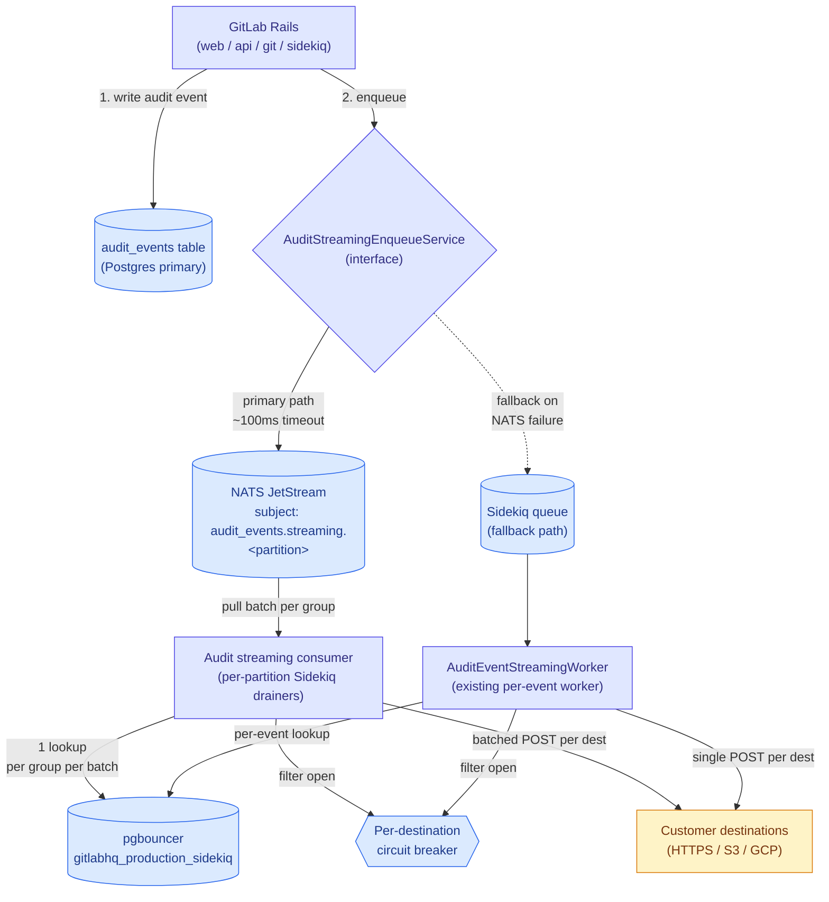

<!-- vale gitlab.FutureTense = NO -->



## 概要

監査イベントストリーミングは、顧客が設定した外部送信先（HTTP webhook、AWS S3、GCP Cloud Logging）へ 1 日あたり約 6,500 万〜 7,500 万件のイベントを配信します。現在のアーキテクチャでは、（監査イベント × 送信先）ごとに 1 つの Sidekiq job を `redis-sidekiq-catchall-b` に enqueue します。このイベント単位の fan-out により、過去 6 か月で複数の S1/S2 インシデントが発生しました。Redis メモリと `gitlabhq_production_sidekiq` pgbouncer プールが飽和し、その影響範囲は `catchall-b` shard を共有する他のワークロードにも広がりました。

このドキュメントでは、イベント単位の Sidekiq dispatch を NATS ベースのイベント配信パイプラインに置き換えることを提案します。Rails は監査イベント作成時に NATS JetStream へ同期的に publish します（NATS が利用できない場合は Sidekiq に fallback します）。Sidekiq cron worker（モノリス内で実行）が NATS から batch を pull し、イベントを top-level group ごとにグループ化し、batch ごとに送信先 lookup と認証情報の復号を集約して顧客の送信先へ dispatch します。これにより、監査ストリーミングを Redis に制約された Sidekiq queue から切り離し、batching によって pgbouncer プールへの負荷を約 100 分の 1 に削減し、このワークロードを戦略的な Data Insights Platform の方向性に合わせます。

## 動機

監査イベントストリーミングは、過去 6 か月で少なくとも 3 件の本番インシデントのトリガーワークロードになっています。

1. **[INC-10096](https://gitlab.com/gitlab-com/gl-infra/production/-/work_items/22103) (S1, 2026-05-12):** `redis-sidekiq-catchall-b` がメモリ不足になりました。pgbouncer の飽和を緩和するために監査ストリーミング jobs は deferred されましたが、deferred set が際限なく増え、Redis を使い果たしました。この cascade によって `catchall-b` shard が停止し、それを共有するすべてのワークロードに影響しました。
2. **[INC-10255](https://gitlab.com/gitlab-com/gl-infra/production/-/work_items/22170) (S2, 2026-05-19):** circuit breaker の rollout 後に `gitlab-org` のストリーミングを再有効化したところ、pgbouncer プールが即座に飽和しました。ピーク負荷は約 1 万監査イベント/秒に達しました。ストリーミングは全体で約 3 時間無効化されました。
3. **[INC-8169](https://gitlab.com/gitlab-com/gl-infra/production/-/work_items/21484) (S2, 2026-03-09):** Sidekiq jobs で catchall-b、elasticsearch、low-urgency-cpu-bound shard にわたって持続的かつ大きな backlog が発生し、job 処理性能の低下と SLO 違反を引き起こしました。

これまでに出荷された緩和策:

1. **送信先ごとの circuit breaker**（[MR !235349](https://gitlab.com/gitlab-org/gitlab/-/merge_requests/235349)）は、継続的に失敗する送信先への dispatch を short-circuit することで、エラー率を 19.44% から 0.058% に下げました。これは送信先障害の増幅というインシデント種別には対応しましたが、生のイベント量は削減しませんでした。
2. **特定の監査イベントタイプをストリーミング対象からブロックする**（[MR !237996](https://gitlab.com/gitlab-org/gitlab/-/merge_requests/237996)）ことを、設定可能な denylist によって外部送信先に対して可能にしました。これにより、`repository_git_operation` や `user_authenticated_using_job_token` のような高 volume のイベントタイプをブロックできます。

これらは response-time の緩和策であり、構造的な修正ではありません。このワークロードが現在のインフラの容量を超えているという根本的な性質は残っています。[Data Insights Platform blueprint](/handbook/engineering/architecture/design-documents/data_insights_platform/) は、NATS ベースの配信へ移行する対象ワークロードとして監査イベントを明示的に挙げています。

### 目標

1. 監査ストリーミングの **Redis メモリに制約された backlog をなくす**。イベント作成から配信までのバッファは RAM に制約されるのではなく、disk に制約されるべきです。
2. batch 化された送信先 lookup によって、監査ストリーミング dispatch による **pgbouncer プール負荷を 1 桁以上削減する**。
3. 監査ストリーミングの spike が隣接するワークロード（CI、env_mgmt）に影響しないよう、**監査ストリーミングを `catchall-b` から切り離す**。
4. **顧客との契約を維持する。** 現在の single-event path を利用している顧客には変更はありません。batched NATS path に opt in した顧客は、batched payload（HTTP request あたりイベントの配列、S3 object あたり複数 entry）を受け取ります。これはグループごとに gate され、告知される契約変更であり、silent ではありません。
5. **配信の耐久性を維持する。** 監査イベントが silent に失われてはなりません。at-least-once delivery semantics を持ち、送信先（顧客）レイヤーで deduplication します。
6. 現在インシデントを引き起こしている gitlab-org を含む **高 volume namespace でも安全に再有効化できる**。

### 非目標

1. **リアルタイム配信レイテンシの改善。** 監査ストリーミングはすでに秒単位の配信レイテンシで動作しており、SIEM ingestion には許容できます。Batching により数秒のレイテンシが加わる可能性がありますが、これは許容できます。
2. **送信先ごとの circuit breaker の置き換え。** breaker は、バッファ技術に関係なく dispatch レイヤーで引き続き適用されるワークロード保護ロジックです。
3. **監査イベント作成 path の変更。** 監査イベントは source of truth として引き続き Postgres table に書き込まれます。この提案は streaming-delivery レイヤーのみを変更します。
4. **初期 rollout における Self-Managed parity。** この提案は GitLab.com を対象とします。NATS が SM bundle の一部になるまで、Self-Managed は現在の Sidekiq path を継続します。interface abstraction（「移行」を参照）により、独立した rollout timing が可能になります。
5. **監査ストリーミングをモノリスから modularize すること。** consumer process（Sidekiq cron）は送信先 model にアクセスするため、モノリス環境で実行する必要があります。これを別 service に抽出することは今後の検討事項です。

## 提案

イベント単位の Sidekiq enqueue を、3 層の NATS ベースパイプラインに置き換えます。

1. **Producer:** Rails は監査イベント作成時に NATS JetStream へ同期的に publish します。interface abstraction が enqueue call をラップし、NATS 障害時には既存の Sidekiq path に fallback して、移行中および恒久的な safety net として耐久性を保ちます。

2. **Buffer:** NATS JetStream は監査イベントを durable で disk-backed な stream に保持し、top-level group ID の hash によって固定数の subject に partition します。Partitioning は subject cardinality を制限し、並列で順序付きの consumption を可能にします。

3. **Consumer:** Sidekiq cron scheduler が partition ごとに 1 つの drainer worker を fan out します。各 drainer は自身の partition から batch を pull し、top-level group ごとにイベントをグループ化し、（group × batch）ごとに 1 回の送信先 lookup を行い、batched payload を顧客送信先へ dispatch します。既存の送信先ごとの circuit breaker は dispatch step で適用されます。



### 期待される影響

現在の volume（約 6,500 万〜 7,500 万イベント/日、ピーク約 1 万/秒）と batch size 100 に基づくと、次のようになります。

| 指標 | 現在 | 変更後 |
| --- | --- | --- |
| 1 日あたりに enqueue される Sidekiq jobs | 約 6,500 万〜 7,500 万 | 約 65 万〜 75 万（consumer cron trigger のみ） |
| NATS publish volume | n/a（Redis-backed Sidekiq queue） | 約 6,500 万〜 7,500 万/日（約 750/秒）、streamed event ごとに 1 publish、disk-backed |
| Peak Sidekiq enqueue rate | 約 1 万/秒 | 約 100/秒 |
| dispatch のための pgbouncer acquisitions | ピーク時に約 1 万/秒 | ピーク時に約 100/秒（送信先 lookup のみ） |
| 監査ストリーミングによる Redis メモリ負荷 | Unbounded、OOM prone（events と payloads が Redis 内） | 最小（cron entries のみ、payloads は NATS disk に移動） |
| Catchall-b Redis dependency | すべての streaming の critical path | streaming dispatch では解消 |
| Streaming-only events handling | Sidekiq 経由の in-job payload | NATS 経由の in-message payload |
| Consumer-side Postgres dependency | イベントごとに必要 | 送信先 config のために group ごと、batch ごとに必要 |

## 設計と実装の詳細

動作する end-to-end proof-of-concept は[短いデモ動画](https://youtu.be/MDFGnL18924)で確認できます。実際の Rails codebase を通じて full path を実行し、監査イベントが Rails から NATS stream に publish され、consumer に picked up され、送信先に streamed されます。この流れで必要な手動手順は one-time stream creation だけです。これにより、以下で説明する core mechanics が紙上だけではなく実際に機能することを検証しています。

### Producer: fallback 付き同期 publish

Rails は監査イベント作成 transaction 内で、監査イベントを NATS に publish します。publish call には aggressive timeout（目標: 50〜100ms。具体値は NATS infrastructure team との benchmark で TBD）と circuit breaker を設定し、NATS が利用できないことで Rails request path が hanging しないようにします。

```ruby
# ee/app/services/audit_events/streaming/enqueue_service.rb
module AuditEvents
  module Streaming
    class EnqueueService
      def self.enqueue(audit_event)
        return unless streamable?(audit_event)

        if use_nats?(audit_event)
          publish_to_nats(audit_event)
        else
          enqueue_to_sidekiq(audit_event)
        end

      rescue StandardError => e
        Gitlab::ErrorTracking.log_exception(e, audit_event_id: audit_event.id)
        enqueue_to_sidekiq(audit_event)  # fallback on any failure
      end

      def self.publish_to_nats(audit_event)
        payload = {
          schema_version: 1,
          event: audit_event.streaming_payload,  # full serialized event, same as current per-event worker sends
          group_id: audit_event.root_group_entity_id,
          event_type: audit_event.event_type,
          persisted: audit_event.persisted?  # informational; consumer doesn't branch on this
        }.to_json

        partition = audit_event.root_group_entity_id % PARTITION_COUNT
        subject = "audit_events.streaming.#{partition}"

        Gitlab::Nats::Client.instance.publish(
          subject,
          payload,
          timeout: PUBLISH_TIMEOUT_MS
        )
      end

      # NATS is used only when all three gates pass:
      #   1. Gitlab::Nats.configured?  - connection settings present (infra capability)
      #   2. use_nats_for_audit_streaming  - instance application setting (operator master switch)
      #   3. audit_event_streaming_via_nats - per-root-group feature flag (rollout)
      def self.use_nats?(audit_event)
        Gitlab::Nats.enabled? &&
          Feature.enabled?(:audit_event_streaming_via_nats, audit_event.root_group_entity)
      end

      def self.enqueue_to_sidekiq(audit_event)
        # Existing per-destination enqueue path, retained as fallback
        audit_event.root_group_entity.external_audit_event_streaming_destinations.active.each do |dest|
          AuditEventStreamingWorker.perform_async(audit_event.id, dest.id)
        end
      end
    end
  end
end
```

重要な性質:

1. **同期 publish。** 初期実装です。NATS team の recommendation に沿っています。Async + ack-wait は将来のイテレーションで検討される可能性があります。
2. **あらゆる failure で Sidekiq に fallback。** 別の outbox pattern を要求せずに耐久性を保ちます。
3. **3 層の gating。** NATS publish には、NATS connection config（`Gitlab::Nats.configured?`）、instance-wide な `use_nats_for_audit_streaming` application setting、per-group の `audit_event_streaming_via_nats` feature flag（circuit breaker pattern と同じ段階的 rollout）が必要です。
4. **NATS message に full payload を含める。** serialized audit event payload は、ID reference だけでなく NATS message に含めます。これは、Postgres table に永続化されないが顧客送信先には stream される streaming-only events をサポートするために必要です。[Kibana data](https://log.gprd.gitlab.net/app/r/s/juRKw)によると、streaming-only events は streaming volume の圧倒的多数（streaming-only が約 4.55 億/週、DB 保存が約 620 万/週、約 99%）を占めます。full payload を運ぶことで、consumer の hot path から PG fetch もなくなり、pgbouncer 負荷をさらに減らします。size と data-handling の影響については、以下の「Storage and security considerations」を参照してください。

**`Gitlab::Nats::Client` に関する注記:** この class は現在 GitLab Rails codebase には存在しません。この作業の一環として、公式の pure-Ruby NATS client である `nats-pure` gem をラップする NATS client wrapper を導入する必要があります。この gem の公開 JetStream API（nats-pure 2.5.0 に対して検証済み）は、この設計が依存する operation をサポートしています。同期 `publish` は pub-ack を返し、ack timeout で raise します。また durable name と `fetch(batch_size)`、明示的な `msg.ack` を伴う `pull_subscribe` は、documented pull-consumer pattern です。実装中に検証すべき残りの項目は API gap ではなく production-hardening concern です。GitLab NATS cluster に対する TLS configuration、この設計が目標とする低い値での publish-timeout behavior、長寿命 connection の reconnect-on-failure semantics です。wrapper は connection lifecycle（singleton with reconnect-on-failure）、TLS configuration、publish-with-timeout、JetStream pull-subscribe semantics を扱います。
上記の end-to-end proof-of-concept は、running NATS instance に対してこれらの operation（Rails からの publish、および consumer 側での durable pull-subscribe と ack）を実行し、公開 docs だけでなく実際の flow で client behavior を確認しています。

### Event ID 生成

stream されるすべてのイベントには安定した identifier が必要です。これは publish 時に一度だけ生成され、NATS message ID と顧客側 deduplication の両方に使われます（下の Buffer configuration にある deduplication の議論を参照）。

per-event ID は現在、[`BaseStreamDestination#request_body`](https://gitlab.com/gitlab-org/gitlab/-/blob/ac27e17550cd47edccd40916719296e8855b11db/ee/lib/audit_events/streaming/destinations/base_stream_destination.rb#L40) で生成されています。`audit_event.id` を使い、streaming-only events のように id が blank の場合は `SecureRandom.uuid` を使います。この生成は dispatch 時に送信先ごとに行われるため、同じイベントでも現在は送信先ごとに異なる UUID を受け取ります。この設計では、NATS が安定した key で publish を dedup でき、すべての送信先が同じイベントに対して同じ ID を見るようにするため、ID はイベントごとに publish 時に一度だけ生成し、message payload で運ぶ必要があります。Sidekiq fallback path も同じ upstream-generated ID を使う必要があります。これにより、fallback 経由で配信されたイベントと NATS 経由で配信された同じイベントが、顧客側で dedup 可能なままになります。consumer は独自に ID を mint するのではなく、payload から ID を読み取ります。

### Buffer: NATS JetStream 設定

新しい JetStream stream が監査イベントストリーミングの traffic を担います。subject は group ごとに 1 つではなく、deterministic partitioning を使います。top-level group ID を固定数の partition（初期提案: 256）へ hash し、subject pattern は `audit_events.streaming.<partition>` になります。ここで `<partition>` は `group_id % PARTITION_COUNT` です。

GitLab.com の scale では、group ごとに 1 subject は機能しません。top-level group は約 725 万あり、単一の JetStream stream が distinct subject として追跡できる規模を桁違いに超えています（subject state は memory に保持され、数万 subject で stream は degrade します）。固定 partition count に hash することで、group count に関係なく subject cardinality を PARTITION_COUNT で一定に保ちます。

hash は deterministic なので、特定の group は常に同じ partition に map され、そのすべてのイベントが publish order でそこに入ります。多くの group が partition を共有しても、group ごとの FIFO ordering は保たれます。partition count は consumer parallelism も制限します。各 partition は一度に 1 つの worker だけで drain されるため、最大 PARTITION_COUNT 個の drainer が並列実行されます。また group が partition をまたがないため、group のイベントは常に 1 つの drainer によって順序どおり処理されます。256 は subject-cardinality limit を大きく下回りながら、十分な parallelism headroom を残す値として選んでいます。shadow mode 中の re-partitioning は安価ですが、live cutover 後は disruptive なので、count は shadow mode 中に確定し、最初から余裕を持って sizing します。

Stream configuration（初期値、NATS team review の対象）:

1. **Retention:** Limits-based（messages は `max_age` または `max_bytes` のいずれかに到達するまで retained）
2. **Storage:** File-backed（RAM ではなく disk-bounded）
3. **Replication:** 3（cluster 内の他の JetStream streams と一貫）
4. **Max age:** 24 時間（これより古い events は silent に lag するのではなく fail-loudly）
5. **Max bytes:** capacity planning に基づき TBD。peak burst と consumer-lag buffer に合わせて sizing
6. **Duplicate window:** 2 分（message ID による NATS-native deduplication）

work-queue retention ではなく limits-based retention を選ぶ理由は、この設計が at-least-once delivery と parallel consumers（partition ごとに 1 durable）、さらに将来の追加 independent reader（たとえば streaming-only events を ClickHouse に永続化する future consumer）を想定しているためです。work-queue retention は ack 時に messages を削除するため、message lifecycle が単一 consumer に結合され、それができなくなります。limits-based retention では、durable consumer ごとに自身の ack state を追跡します。messages は retention window を過ぎたときにのみ解放されます。

すべてのイベントは、上の Event ID generation で説明した安定 ID を持ちます。この ID が deduplication の基盤であり、2 つの役割を果たします。

load-bearing な役割は customer-side dedup です。At-least-once delivery では、顧客が同じイベントを複数回受け取る可能性があります（consumer が POST に成功した後、NATS に ack する前に crash すると、その message は redeliver されます）。安定 ID によって、顧客は duplicate を認識して drop できます。これは NATS によって導入される新しい behavior ではありません。現在の Sidekiq path も at-least-once であり、顧客への redelivery という同じ性質を持ちます。この migration はその必要性を新たに作るのではなく、安定 ID の必要性を引き継ぎます。

optimization として、同じ ID を NATS message ID として設定し、NATS が dedup window 内の duplicate *publishes* を drop できるようにします（たとえば、publish は NATS 側で成功したが Rails への ack が失われ、再 publish が発生した場合）。2 分の window は現実的な publish-retry timing をカバーします。これは上記の customer-side dedup とは別物です。NATS publish-dedup は duplicate rate を下げますが、それがなくても system は correct です。一方、安定 ID に基づく customer-side dedup は、at-least-once delivery を許容可能にするものです。

### ストレージとセキュリティの考慮事項

**NATS ストレージ量。** 約 750 events/sec の sustained rate と payload あたり約 2KB では、stream はおおよそ 130 GB/day を消費します。24-hour retention と 3x replication では、cluster は任意の時点で約 400〜500 GB の streaming data を保持します。これは JetStream の file-backed storage が扱える範囲に十分収まります。retention policy が safety valve です。`max_age` より古いものは ack status に関係なく drop されるため、consumer が stuck しても stream は永遠に増え続けません。

burst では、約 1 万 events/sec の 1 時間 spike により、consumer が追いつく前に約 70 GB が追加されます。NATS はそれを disk で吸収し、consumer は自身の rate で drain します。これこそ現在の Redis-backed setup に欠けているものです。buffer が RAM の場合、「disk で吸収する」相当の仕組みがありません。

**転送中および保存時のデータ。** 監査イベント payload は、user IDs、IP addresses、target resources などの identifying information を運びます。full payload を NATS に入れると、その data は retention window まで stream 内に存在します。NATS は Rails と同じ trust boundary 内で動作し、client connections には TLS、underlying volumes には disk encryption を使います。現在の Sidekiq path も同じ boundary の Redis 内に同じ payload を保持しているため、これは新しい地平ではありません。

**Streaming-only events。** streaming traffic の約 99%（[Kibana](https://log.gprd.gitlab.net/app/r/s/juRKw)によると、Postgres に永続化される約 620 万/週に対し、streaming-only が約 4.55 億/週）は、Postgres に永続化されない events です。これらは request 中に Ruby objects として存在し、その場で streamed されます。full-payload approach は、それらを DB-saved events と同じように扱えます。consumer は「この event は PG 由来かどうか」で branch する必要がありません。必要なものはすべて NATS message に入っています。

### Message serialization format

NATS messages は JSON（evolution のために `schema_version` field を含む）を使います。これは customer-facing payload format と [Data Insights Platform](../data_insights_platform/_index.md) の CloudEvents direction と一貫しています。Protobuf は検討しましたが、このワークロードでは採用しませんでした。

**Protobuf の利点:**

- wire size が小さい（JSON 比で約 30〜60%）。stream で約 130 GB/day になる状況では意味があります。
- Schema が enforced contract になり、producer と consumer が silent に drift できません。
- decode が速く allocation が少ない。言語をまたぐ type-safe generated models（ClickHouse exporter のような将来の Go consumer で relevant）。

**Protobuf の欠点（監査イベントでは決定的）:**

- 監査イベント payload は heterogeneous です。`details` object は event type ごとに異なります。これを protobuf で modeling するには `google.protobuf.Struct` / `map` / opaque bytes が必要になり、type-safety benefit が失われ、「binary JSON」に degrade します。
- 顧客との contract は JSON（HTTP / S3 / GCP）なので、consumer は dispatch 前に protobuf を JSON に transcode する必要があります。これは JSON end-to-end と比べて余分な encode/decode cycle です。
- inspectability の低下。`nats stream view` で読める JSON は、監査/compliance system の運用上価値があります。一方、binary payload は opaque です。
- Rails monolith に codegen/dependency step を追加し、`Gitlab::Json` より Ruby ergonomics が悪くなります。

**決定:** JSON を使用し、Data Insights Platform の JSON/CloudEvents standard に合わせます。NATS storage volume が後で binding constraint になった場合は、message compression（body の gzip）により、JSON contract と inspectability を維持したまま protobuf の size advantage の大半を取り戻せます。

### Consumer: partition ごとの Sidekiq drainers

Consumption には、cron 上の軽量 scheduler と、partition ごとの drainer という 2 つの worker を使います。

Sidekiq cron は最大でも 1 分に 1 回しか実行されないため、それだけでは配信間隔として粗すぎます。そのため scheduler は drain しません。毎分実行され、partition ごとに 1 つの drainer job を enqueue します。各 drainer は 1 つの partition の durable consumer を所有し、ほぼ 1 分の間 loop で drain し、次の tick の前に終了します。次の分の scheduler run が partition ごとに新しい drainer を開始します。この「long-running cron」pattern により、1-minute cron floor にもかかわらずほぼ連続した draining が可能になります。同時に、deploy、monitor、page 対象となる新しい long-running process type を追加せず、既存の Sidekiq infrastructure に留まれます。

partition ごとに 1 つの durable consumer があることが、group ごとの ordering を保ちます。group は常に 1 つの partition に hash され、その partition は一度に 1 つの worker だけで drain されるため、group の events は常に順序どおり処理されます。scheduler は同じ partition の run を overlap させません（drainer は次の minute tick の前に終了します）。したがって、2 つの drainer が同じ partition の durable を共有することはありません。もし共有すると、JetStream が partition の messages を workers 間で load-balance し、ordering を壊します。

したがって worst-case delivery latency はおおよそ 1 分であり、SIEM ingestion tolerance の範囲内です。これは dedicated long-running consumer より緩いものですが、Sidekiq に留まるための deliberate tradeoff です。将来の要件でより低い latency が必要になった場合、drainer logic は変更せずに long-running process へ移します。変わるのは scheduling wrapper だけです。

この形を long-running Rails consumer process より選んだ理由はいくつかあります。

1. deploy、monitor、alert 対象となる新しい process type が不要です。workers は既存 tooling を備えた既存の Sidekiq infrastructure 上で動作します。
2. cron-based pattern は、チームがすでに成功裏に出荷した circuit breaker rollout と一致します。
3. reversibility。feature flag を無効化し、cron workers を削除するのは、deployed process type を decommission するより trivial です。

```ruby
# Scheduler: on the 1-minute cron, fans out one drainer per partition.
# ee/app/workers/audit_events/streaming/nats_consumer_worker.rb
module AuditEvents
  module Streaming
    class NatsConsumerWorker
      include ApplicationWorker
      include CronjobQueue

      feature_category :audit_events
      urgency :low
      idempotent!

      PARTITION_COUNT = 256

      def perform
        return unless Gitlab::Nats.enabled?

        PARTITION_COUNT.times do |partition|
          AuditEvents::Streaming::NatsPartitionConsumerWorker.perform_async(partition)
        end
      end
    end
  end
end
```

```ruby
# Drainer: owns one partition's durable, drains in a loop for most of the minute.``
# ee/app/workers/audit_events/streaming/nats_partition_consumer_worker.rb
module AuditEvents
  module Streaming
    class NatsPartitionConsumerWorker
      include ApplicationWorker

      feature_category :audit_events
      urgency :low
      idempotent!  # safe to re-run: unacked messages redeliver, acked ones don't

      BATCH_SIZE = 100
      MAX_RUN_TIME = 55.seconds # exit before the next 1-minute cron tick
      PULL_TIMEOUT = 5.seconds
      DISPATCH_CONCURRENCY = 20 # in-process concurrent dispatches; see throughput note

      def perform(partition)
        return unless Gitlab::Nats.enabled?

        deadline = Time.current + MAX_RUN_TIME
        subscription = Gitlab::Nats::Client.instance.pull_subscribe(
          "audit_events.streaming.#{partition}",
          durable: "audit_streaming_consumer_#{partition}",
          batch_size: BATCH_SIZE
        )

        loop do
          break if Time.current >= deadline

          messages = subscription.fetch(BATCH_SIZE, timeout: PULL_TIMEOUT)
          break if messages.empty?

          process_batch(messages)
        end
      rescue NATS::Timeout
        # No messages this run; normal, exit cleanly.
      rescue StandardError => e
        Gitlab::ErrorTracking.track_exception(e, partition: partition)
        # Do not re-raise: unacked messages stay in NATS and redeliver on the
        # next run, which the next cron tick schedules anyway.
      end

      private

      def process_batch(messages)
        parsed = messages.map { |msg| [msg, Gitlab::Json.parse(msg.data)] }

        # All messages in this partition belong to groups that hash here.
        # Group by group_id so destination config is looked up once per group
        # per batch, not per event (avoids N+1).
        parsed.group_by { |_, payload| payload['group_id'] }.each do |group_id, group_msgs|
          dispatch_for_group(group_id, group_msgs)
        end
      end

      def dispatch_for_group(group_id, group_messages)
        group = Group.find_by(id: group_id)
        unless group
          group_messages.each { |msg, _| msg.ack }  # group gone; ack to stop redelivery
          return
        end

        destinations = group.external_audit_event_streaming_destinations.active.to_a
        destinations = AuditEvents::Streaming::CircuitBreaker.reject_open(destinations)

        # Events come from the NATS message body; no PG fetch. Works uniformly
        # for DB-saved and streaming-only events.
        events = group_messages.map { |_, payload| payload['event'] }

        # Dispatch destinations concurrently, up to DISPATCH_CONCURRENCY in flight.
        # Concrete primitive TBD at implementation (e.g. Concurrent::FixedThreadPool
        # from concurrent-ruby, already a dependency). Serial dispatch is not viable
        # at peak; see "concurrent in-process dispatch" below.
        destinations.each do |destination|
          # runs concurrently, not serially
          BatchedDispatcher.new(destination, events).execute
        end

        group_messages.each { |msg, _| msg.ack }  # ack only after dispatch
      rescue StandardError => e
        Gitlab::ErrorTracking.track_exception(e, group_id: group_id)
        # Leave unacked; NATS redelivers after ack_wait. Do not ack on failure.
      end
    end
  end
end
```

重要な性質:

1. **hot path で PG fetch しない group-by-group dispatch。** event ごとではなく、（group × batch）ごとに 1 回の送信先 config lookup を行います。payload は Postgres ではなく NATS message body から取得します。これが pgbouncer 削減の主要因であり、dispatch を Postgres availability から切り離します。
2. **partition ごとに 1 durable があり、group ごとの ordering を保つ。** group は 1 つの partition に hash され、一度に 1 つの worker によって drain されるため、その events は順序どおり配信されます。
3. **in-process concurrent dispatch は throughput knob であり optional ではありません。** 現在の Sidekiq path はピーク時に約 4.2K concurrent worker threads（7-day max、mean 約 1.1K）を実行し、それぞれが 1 つの event-to-destination delivery を行います。NATS path は同等の peak dispatch concurrency を提供する必要があります。そうでなければ throughput が regress します。effective concurrency は（active drainers）×（drainer あたりの `DISPATCH_CONCURRENCY`）です。たとえば、256 partitions × 20 concurrent dispatches で約 5,120 となり、peak を十分に上回ります。serial drainer（同時に 1 dispatch）では約 256-way concurrency しか得られないため、in-process concurrency が必要です。4.2K という数字は conservative ceiling です。batching により、多数の per-event delivery が 1 つの batched request に collapsed されるため、実際の concurrency requirement はより低く、Phase 3 で load 下に確認します。
4. **明示的な ack による at-least-once delivery。** group の batch は dispatch 成功後にのみ ack されます。failure が起きると unacked のままになり、NATS が redeliver します。安定 ID による customer-side dedup が duplicate を吸収します。単一の persistently-failing destination があると、その group の batch の ack を block し（すでに成功した送信先にも redelivery が起きる）、送信先ごとの circuit breaker が、dispatch 前に継続的に失敗する送信先を reject することでこれを緩和します。
5. **送信先ごとの circuit breaker を維持。** 既存の breaker は dispatch 前に送信先を filter します。NATS は destination-level protection を置き換えません。
6. **NATS path では batched delivery が default かつ唯一の mode。** group の events は、event ごとに 1 request ではなく、送信先ごとに 1 つの batched payload として dispatch されます。`audit_event_streaming_via_nats` feature flag は、顧客の batched payload format への opt-in も兼ねます。まだ flag 上にない group は single-event Sidekiq path に留まります。すべての group が移行したら legacy single-event path は削除されます。

### Batch payload の契約

Batched delivery は送信先 type ごとの wire format を変更します。

| 送信先 | 変更 | 詳細 |
| --- | --- | --- |
| GCP Cloud Logging | 破壊的変更なし | Logging API は複数の `entries` を native に受け付けます。batch は multi-entry write に map されます。 |
| HTTP | 破壊的変更 | body は events の配列になります（各 element は event type を自己記述し、それは body にすでに存在します）。per-request の `X-Gitlab-Audit-Event-Type` header は削除されます。 |
| AWS S3 | 破壊的変更 | event ごとに 1 object ではなく、1 object に複数 events が書き込まれます（revised object-naming scheme を伴います）。 |

HTTP と S3 の変更は breaking であるため、影響を受ける顧客には、その group を NATS path で有効化する前に通知します。また変更は `audit_event_streaming_via_nats` flag によって group ごとに gate されます（Goal 4「顧客との契約を維持する」を参照）。GCP Cloud Logging destinations では顧客の action は不要です。

### 移行計画

Sidekiq への継続的な fallback を伴う phased rollout:

**Phase 1: Interface abstraction（behavior change なし）**

- 既存の Sidekiq enqueue をラップする `AuditEvents::Streaming::EnqueueService` を導入する
- すべての直接的な `AuditEventStreamingWorker.perform_async` call を `EnqueueService.enqueue` に置き換える
- 独立して ship されます。顧客または運用への影響はありません。

**Phase 2: NATS publish path**

- `EnqueueService` 内に NATS publishing を実装し、3 つの layered checks で gate します: (1) `Gitlab::Nats.configured?`（NATS connection settings が存在）、(2) `use_nats_for_audit_streaming` instance application setting（operator-level master switch、default off）、(3) `audit_event_streaming_via_nats` feature flag（per-root-group rollout）
- GSTG に NATS deployment を立て、non-production traffic で publish path を検証する
- target environment で `use_nats_for_audit_streaming` instance setting を有効化し、その後 low-volume groups の small subset で per-group feature flag を有効化し、publish success rate を検証する

**Phase 3: shadow mode の NATS consumer**

consumer は、顧客へ配信する前に、実際の production load に対して検証されます。

- 既存の Sidekiq infrastructure 上に consumer（partition ごとに 1 drainer を fan out する scheduler cron）を deploy し、feature flag の背後に置きます。Instrumentation（consumer-lag apdex SLI、per-partition stream depth、publish-to-would-be-dispatch latency）は shadow traffic 開始前に landing します。この phase の価値は、測定する内容にあります。
- shadow mode で実行します。Sidekiq は live delivery path のままであり、顧客への配信に対して単独で責任を持ちます。並行して events は NATS に publish され、per-partition drainers は full pipeline（publish、partitioned streams、grouping、batching、ack）を実行しますが、final dispatch step は顧客送信先へ write しません。これにより、duplicate または incorrect customer delivery のリスクをゼロにしたまま、実 production load の下で NATS path を exercise できます。
- real load の下で測定します。per-partition throughput、256 partitions が peak volume に追いつくか、batch fill rates、ack と fetch overhead、publish から would-be-dispatch までの end-to-end lag を測ります。
- 制約が 1 つあります。即座に return する shadow dispatch では、実際の顧客 HTTP/S3/GCP round-trip cost を再現できず、partition sizing が依存する正確な dimension である dispatch concurrency に関して consumer が artificially healthy に見えてしまいます。そのため shadow dispatch は、即座に return するのではなく、representative dispatch latency を simulate します。dispatch concurrency が十分かどうかの最終確認は、Phase 4 の controlled gitlab-org cutover で行います。
- Decision gate: shadow mode が single partitioned-stream design が追いつくことを示してから初めて live NATS delivery へ cut over します。追いつかない場合は、two-stream repartitioning design（Open Decisions を参照）が documented fallback です。

**Phase 4: gitlab-org から開始する production rollout**

- gitlab-org で最初に `audit_event_streaming_via_nats` を有効化する
- rationale: gitlab-org は、その volume profile が Sidekiq path の容量を超えているワークロードです。low-volume groups で先に NATS path を検証しても、過去のインシデントを引き起こした条件を exercise できません。gitlab-org-first は、実際に処理すべき load に対して設計を検証します
- fallback safety: NATS publish failure は `EnqueueService` 経由で Sidekiq に fallback するため、rollout 中の worst case は現在の behavior へ degrade することです
- 初期 enablement 中は closely monitor します: consumer lag、NATS publish success rate、end-to-end delivery latency、pgbouncer pool saturation、circuit breaker trip rate
- gitlab-org が NATS 上で observation window（提案: 1〜2 週間）安定した後、残りの customer groups をより大きな cohort で有効化します

**Phase 5: Sidekiq dispatch path の deprecate**

- すべての group が NATS path 上にあり安定性が証明されたら、Sidekiq は fallback としてのみ保持します
- 最終的には `AuditEventStreamingWorker` を完全に削除します

### 障害モードと緩和策

| 障害 | 挙動 | 緩和策 |
| --- | --- | --- |
| NATS publish がタイムアウトする | `EnqueueService` が catch、log し、Sidekiq enqueue に fallback | event loss なし → current behavior に degrade |
| NATS cluster が利用できない | すべての publishes が Sidekiq に fallback → current system と同じ behavior | Sidekiq path を permanent fallback として保持 |
| Consumer process が crash する | Unacked messages は ack_wait 後に NATS により redeliver | 標準的な at-least-once redelivery |
| Consumer が遅れる | NATS stream depth が増える → alert fires → consumer scaled up | NATS pending message count で monitor |
| 顧客送信先が壊れている | per-destination circuit breaker が trip → breaker window の間 events skipped | 既存 breaker behavior、変更なし |
| 顧客への重複配信 | NATS dedup window が多くの case を捕捉 → customer が Event ID で dedup | customer-facing audit streaming docs に documented |

### Observability

各 signal は、それが測る内容に合った type の SLI として model します。Apdex は latency を扱います。Error ratio は success/failure rates を扱います。Gauges には plain threshold alert を設定します。

1. **Consumer lag** は publish から ack までの時間です。apdex SLI として track します。satisfactory lag と tolerated lag（values は infra と TBD）を選びます。各 measurement はそれらの bucket のいずれかに入ります。SLO は結果として得られる apdex score に置きます。
2. **Publish success rate** は total publish attempts に対する successful publishes です。success ratio 上の SLO を持つ error ratio SLI として track します。drop は NATS が unhealthy であることを示します。
3. **Fallback rate** は total publishes に対して Sidekiq に fallback した publishes です。error ratio SLI として track します。steady state ではほぼゼロに留まるべきです。sustained rise は NATS path が trouble にある early warning です。
4. **NATS stream depth** は subject ごとの pending messages 数です。これは latency や ratio ではなく gauge です。sustained growth に対する threshold alert で watch します。
5. **Existing dashboards retained:** Kibana audit streaming dashboard、circuit breaker metrics、pgbouncer pool saturation。

## 代替案

### 代替案 1: Postgres outbox pattern

監査イベントと同じ transaction で `audit_event_streaming_outbox` table に row を書き込みます。background worker が outbox から batch を pull し、dispatch します。

利点:

1. 新しい infrastructure dependency がない
2. より速く ship できる（Postgres はすでに利用可能）
3. Self-Managed で即座に動作する
4. 監査イベントと outbox row の transactional consistency

欠点:

1. すでに pressure を受けている `gitlabhq_production_sidekiq` pgbouncer pool へ load を追加する（outbox への追加 writes、batch claim のための追加 reads）
2. WAL volume が event volume に比例して増加する
3. high-churn table に vacuum pressure がかかる
4. root constraint である同じ Postgres primary へ load を追加する
5. Data Insights Platform direction と合わない

Postgres outbox は defensible な architecture であり、Redis OOM failure mode を解決できます。採用しない決定要因は、infra team が dependency を減らそうとしている resource である Postgres primary へ pressure を移すことです。NATS は、監査ストリーミングを constrained resource から完全に切り離します。

### 代替案 2: Redis Streams

Sidekiq queues の代わりに Redis Streams を buffer として使い、batched consumption のために consumer-group semantics を利用します。

利点:

1. Sidekiq の list-based queues より queue 用 data structure として優れている
2. native consumer-group support

欠点:

1. 依然として RAM-bounded です。現在の architecture と同じ failure mode（Redis OOM）があります
2. underlying constraint に対応しません

現在の system と同じ failure mode であるため rejected しました。

### 代替案 3: 現在のアーキテクチャと tuning を継続する

pgbouncer pool size を増やし、Redis memory を増やし、periodic incidents を受け入れます。

利点:

1. engineering effort がない
2. new dependencies がない

欠点:

1. structural problem に対応しない
2. incident pattern が続く。監査ストリーミング volume が増えるたびに次の incident が発生する
3. repeated runbook execution の operational burden
4. gitlab-org が full streaming re-enablement の blocker のまま残る

Rejected しました。繰り返される incident pattern は、このワークロードが現在の infrastructure shape を超えて成長したことを示しています。

### 代替案 4: 既存の Sidekiq architecture 内で batching する

Redis を buffer として維持したまま、event ごとの Sidekiq enqueue を batched enqueue（job あたり N events）に置き換えます。

利点:

1. NATS migration より change が小さい
2. batch size に比例して job count を削減する

欠点:

1. Redis-as-RAM-bounded-buffer には対応しない（Redis OOM failure mode が残る）
2. producer-side batching には shared state（batch をどこに accumulate するか）が必要で、それ自体が design problem になる
3. より単純に scoped した version はどの solution にも含まれる。問題は buffer が Redis か NATS かです

stepping stone として検討しました。Batching はどの solution にも必要な component であり、interim improvement として独立して ship できる可能性がありますが、それ単体では Redis OOM failure mode に対応しません。

### 代替案 5: ClickHouse を buffer として使う

イベント作成と dispatch の間の durable buffer として ClickHouse を使います。既存の Siphon（Postgres → ClickHouse）replication pipeline を活用する可能性もあります。

欠点:

1. Siphon は Postgres に永続化された events だけを replicate します。現在の volume では、永続化 events は streaming traffic の約 1%（約 4.61 億/週のうち約 620 万/週）です。残りの約 99% は streaming-only であり、Siphon 経由では ClickHouse に到達しません。ClickHouse-fed-by-Siphon approach では、streaming が必要なほぼすべての events を取り逃がします。streaming-only events を ClickHouse に直接 publish するには別の write path が必要になり、その時点で ClickHouse はそれ自体の merits で評価される別の queue candidate にすぎません。
2. ClickHouse は batch inserts と analytical reads に最適化された columnar OLAP store です。queue primitives がありません。row-level claim/ack も、multi-consumer dispatch 用の `SELECT ... FOR UPDATE SKIP LOCKED` 相当もなく、頻繁な small inserts（queue write pattern）は background merge process を thrash させる明示的な anti-pattern です。events を dispatched として mark するには、cheap deletes ではなく expensive mutations が必要です。
3. JetStream に相当する backpressure または redelivery semantics がありません。

Rejected しました。ClickHouse は監査イベントの analytics（historical streaming activity や aggregations の query）には適しており、Buffer configuration の limits-based retention rationale で述べたように、NATS stream の future downstream consumer としては候補のままです。ただし queue role 自体には適していません。

## 未解決の決定事項

実装を開始する前に、以下について participating teams から input が必要です。

1. **NATS GSTG/GPRD deployment timeline。** NATS は現在 dedicated Orbit cluster に deploy されています。GSTG/GPRD clusters には、monolith-serving deployment が必要です。*(Owner: NATS infrastructure team / Platform Insights)*

2. **Publish timeout and retry policy。** synchronous publishes の具体的な timeout value（50〜100ms?）と retry count。*(Owner: NATS infrastructure team)*

3. **Partition count, drainer count, and per-drainer dispatch concurrency。** subject partition count（proposed: 256）は一度設定し、余裕を持たせます。re-partitioning は group-to-partition mapping を変えるため disruptive です。Drainer count と per-drainer dispatch concurrency は peak delivery concurrency に掛け合わされ、現在の Sidekiq peak（約 4.2K concurrent、7-day max、mean 約 1.1K）以上を満たす必要があります。ただし batching により実際の requirement はより低く、Phase 3 shadow mode の load 下で確認します。Batch size と 1-minute cron 実行間隔もここで tune します。*(Owner: SSCS:Compliance, validated with infra during Phase 3 shadow mode)*

4. **Self-Managed migration timeline。** SM customers がいつ、どのように NATS path へ移るか。これは NATS が SM bundle の一部になることに依存します。*(Owner: Distribution, Platform Insights)*

5. **Payload size in NATS messages。** この設計は DB-saved events と streaming-only events の両方を一様にサポートするため、full audit event payload を NATS messages で運びます。平均 payload size は約 2KB です。750/sec sustained では、24h retention の NATS storage で約 130 GB/day になります。この storage profile が許容できることを NATS infrastructure team と確認します。*(Owner: NATS infrastructure team)*

6. **Two-stream repartitioning design（deferred、shadow-mode validation 後に revisit）。** single partitioned stream と per-partition cron drainers が production shadow testing の下で追いつかない場合の代替は two-stream design です。`raw_events` ingestion stream（short retention、message ごとに 1 event、producer stays trivial）と、`hash(top_level_group_id) % N` で partition された `grouped_events` stream を使い、各 grouped message は events の *array* にします。array-per-message shape により、dispatch consumer は event ごとではなく batch ごとに 1 回 ack し、dispatch-side の ack と fetch overhead を collapse できます。また grouping は dispatch run のたびではなく repartitioning step で一度だけ行われます。repartitioning and batching consumer は、新しい GitLab-operated process としてではなく Data Insights Platform infrastructure 上で実行できる可能性があり、「new process type なし」という性質を保てます。これは意図的に deferred しています。stream、repartitioning hop、operate する process が追加されるため、そこに進む前に、より単純な設計で十分かどうかについて shadow mode の production data を得たいからです。*(Owner: SSCS:Compliance, Platform Insights / DIP)*

### リスクと未知事項

この設計は NATS JetStream を採用しますが、GitLab は production monolith path ではまだそれを運用していません（現在は dedicated Orbit cluster のみで動作しています）。より elaborate な two-stream approach ではなく、partitioning-only design を先に提案することで、operational experience を得る前に取り込む new surface area を意図的に制限しています。以下は known unknowns であり、Phase 3 shadow mode の validation は、顧客 traffic を移す前にこれらを retire するためにあります。

1. **比較的新しい pub/sub dependency を運用すること。** JetStream の failure modes、tuning、そして私たちの specific load の下での operational behavior は、monolith context では team にも infra にもまだ分かっていません。この設計が目標とする低い publish timeout、reconnect-on-failure、GitLab cluster に対する TLS に関する production behavior は docs と proof-of-concept に対して検証済みですが、sustained production load では未検証です。shadow mode で初めて表面化する unknown unknowns がある可能性が高いです。

2. **大量の in-flight messages に対する NATS behavior。** この設計は burst 時に大きな backlog（1 時間 spike で最大約 70 GB）を disk 上に保持し、PARTITION_COUNT 個までの durable consumers を significant per-consumer fetch and ack traffic とともに実行します。この concurrency と in-flight-message volume で JetStream がどのように振る舞うか（fetch latency、ack throughput、deep streams の下での memory）は、私たちの workload ではまだ characterized されておらず、shadow mode が測る主要な対象です。

3. **Partition count は shadow mode 中は変更が安価だが、cutover 後は高価。** Re-partitioning は group-to-subject assignments を re-hash します。live cutover 後は disruptive です（drop できない real backlog、interrupted できない ordering）。shadow mode 中はほぼ無料です。messages は顧客へ配信されないため、feature flag を無効化し、新しい `PARTITION_COUNT` で stream を drop and recreate し、再有効化できます。数分で行え、何も失いません。そのため shadow mode は partition count を確定する場所です。まさにそこで初めて、number を安価に変更できます。それでも、iteration を最小限にするため、最初からおおよそ正しい sizing を目指します。

これらの unknowns には schedule cost があります。core implementation に加えて、NATS client の production hardening と shadow-mode investigation and tuning（timeout behavior、reconnect、per-partition consumer sizing、real load 下の ack throughput）のために、Phase 4 cutover 前に追加で約 2〜4 週間を見込んでください。これは上記の unknowns を retire するための調査期間であり、新機能の実装ではありません。
