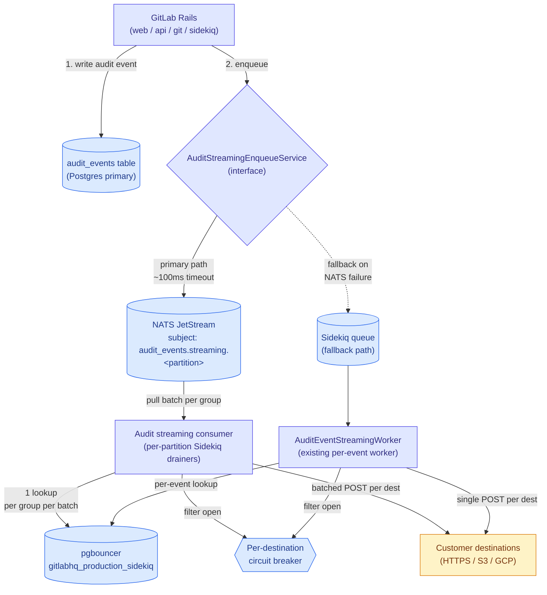

<!-- vale gitlab.FutureTense = NO -->



## 概要

監査イベントストリーミングは、顧客が設定した外部の送信先（HTTP Webhook、AWS S3、GCP Cloud Logging）に 1 日あたり約 6,500 万〜7,500 万件のイベントを配信します。現在のアーキテクチャでは、（監査イベント × 送信先）ごとに 1 件の Sidekiq ジョブを `redis-sidekiq-catchall-b` にエンキューします。このイベント単位のファンアウトにより、過去 6 か月で Redis メモリと `gitlabhq_production_sidekiq` pgbouncer プールが飽和し、複数の S1/S2 インシデントが発生しました。その影響範囲は `catchall-b` シャードを共有する他のワークロードにも及んでいます。

このドキュメントでは、イベント単位の Sidekiq ディスパッチを NATS ベースのイベント配信パイプラインに置き換えることを提案します。Rails は監査イベントの作成時に NATS JetStream へ同期的に発行します（NATS が利用できない場合は Sidekiq にフォールバックします）。Sidekiq の cron ワーカー（モノリス内で実行）が NATS からバッチを取得し、トップレベルグループ別にイベントをまとめ、バッチごとに送信先のルックアップと認証情報の復号を集約して、顧客の送信先にディスパッチします。これにより、監査ストリーミングを Redis の容量に制約される Sidekiq キューから切り離し、バッチ処理によって pgbouncer プールへの負荷を約 100 分の 1 に軽減し、ワークロードを戦略的な Data Insights Platform の方向性に合わせます。

## 動機

監査イベントストリーミングは、過去 6 か月で少なくとも 3 件の本番インシデントを引き起こしたワークロードです。

1. **[INC-10096](https://gitlab.com/gitlab-com/gl-infra/production/-/work_items/22103)（S1、2026-05-12）:** `redis-sidekiq-catchall-b` のメモリが枯渇しました。pgbouncer の飽和を緩和するために監査ストリーミングジョブを遅延させましたが、遅延セットが際限なく増大し、Redis を使い果たしました。この連鎖によって `catchall-b` シャードが停止し、それを共有するすべてのワークロードに影響しました。
2. **[INC-10255](https://gitlab.com/gitlab-com/gl-infra/production/-/work_items/22170)（S2、2026-05-19）:** サーキットブレーカーのロールアウト後に `gitlab-org` のストリーミングを再有効化すると、pgbouncer プールが即座に飽和しました。ピーク負荷は監査イベント約 1 万件/秒に達しました。ストリーミングは約 3 時間にわたってグローバルに無効化されました。
3. **[INC-8169](https://gitlab.com/gitlab-com/gl-infra/production/-/work_items/21484)（S2、2026-03-09）:** catchall-b、elasticsearch、low-urgency-cpu-bound の各シャードで Sidekiq ジョブの高いバックログが継続し、ジョブ処理性能の低下と SLO 違反が発生しました。

これまでにリリースした緩和策は次のとおりです。

1. **送信先ごとのサーキットブレーカー**（[MR !235349](https://gitlab.com/gitlab-org/gitlab/-/merge_requests/235349)）は、一貫して失敗する送信先へのディスパッチを短絡することで、エラー率を 19.44% から 0.058% に低減しました。これにより、送信先の障害が増幅する種類のインシデントには対処しましたが、生のイベント量は減りませんでした。
2. **特定の監査イベントタイプのストリーミングをブロックする**（[MR !237996](https://gitlab.com/gitlab-org/gitlab/-/merge_requests/237996)）ことで、設定可能な拒否リストを介して外部の送信先へのストリーミングを防ぎます。これにより、`repository_git_operation` や `user_authenticated_using_job_token` など、量の多い特定のイベントタイプをブロックできます。

これらは対応時間を短縮する緩和策であり、構造的な修正ではありません。ワークロードが現在のインフラストラクチャの容量を超えるという根本的な性質は残っています。[Data Insights Platform ブループリント](/handbook/engineering/architecture/design-documents/data_insights_platform/)では、NATS ベースの配信へ移行する対象ワークロードとして監査イベントを明示しています。

### 目標

1. 監査ストリーミングの **Redis メモリ容量に制約されるバックログを解消する**。イベントの作成から配信までのバッファは、RAM 容量ではなくディスク容量に制約されるべきです。
2. バッチ化した送信先ルックアップにより、監査ストリーミングのディスパッチが pgbouncer プールに与える負荷を 1 桁以上軽減する。
3. 監査ストリーミングを `catchall-b` から切り離し、その急増が隣接するワークロード（CI、env_mgmt）に影響しないようにする。
4. **顧客との契約を維持する。** 現在の単一イベントパスを利用する顧客には変更がありません。バッチ化された NATS パスにオプトインした顧客は、HTTP リクエストごとにイベントの配列、S3 オブジェクトごとに複数のエントリというバッチ化されたペイロードを受け取ります。これはグループ単位でゲートし、告知する契約変更であり、黙って変更するものではありません。
5. **配信の耐久性を維持する。** 監査イベントを黙って失ってはなりません。少なくとも 1 回の配信セマンティクスを採用し、送信先（顧客）レイヤーで重複排除します。
6. 現在インシデントを引き起こしている gitlab-org を含む、イベント量の多い名前空間で安全に再有効化できるようにする。

### 目標外

1. **リアルタイム配信のレイテンシ改善。** 監査ストリーミングの配信レイテンシはすでに秒単位であり、SIEM への取り込みには許容できます。バッチ処理によって数秒のレイテンシが加わる可能性がありますが、これは許容範囲です。
2. **送信先ごとのサーキットブレーカーの置き換え。** ブレーカーは、バッファ技術に関係なくディスパッチレイヤーで引き続き適用されるワークロード保護ロジックです。
3. **監査イベント作成パスの変更。** 監査イベントは、信頼できる唯一の情報源として引き続き Postgres テーブルに書き込まれます。この提案で変更するのは、ストリーミング配信レイヤーだけです。
4. **初回ロールアウトでの Self-Managed との同等性。** この提案は GitLab.com を対象とします。NATS が SM バンドルの一部になるまで、Self-Managed は現在の Sidekiq パスを継続します。インターフェースの抽象化（「移行」を参照）により、ロールアウトのタイミングを独立させられます。
5. **監査ストリーミングのモノリス外へのモジュール化。** コンシューマープロセス（Sidekiq cron）は、送信先モデルにアクセスするため、モノリス環境で実行する必要があります。別サービスへの切り出しは、将来の検討事項です。

## 提案

イベント単位の Sidekiq エンキューを、3 レイヤーの NATS ベースのパイプラインに置き換えます。

1. **プロデューサー:** Rails は監査イベントの作成時に NATS JetStream へ同期的に発行します。インターフェースの抽象化でエンキュー呼び出しをラップし、NATS の障害時には既存の Sidekiq パスへフォールバックします。これにより、移行中の耐久性を維持し、恒久的な安全策としても機能します。

2. **バッファ:** NATS JetStream は監査イベントを耐久性のあるディスクベースのストリームに保持し、トップレベルグループ ID のハッシュによって固定数のサブジェクトに分割します。パーティショニングによってサブジェクトのカーディナリティに上限を設け、並列かつ順序どおりの消費を可能にします。

3. **コンシューマー:** Sidekiq の cron スケジューラーは、パーティションごとに 1 件のドレイナーワーカーをファンアウトします。各ドレイナーは自身のパーティションからバッチを取得し、トップレベルグループ別にイベントをまとめ、（グループ × バッチ）ごとに 1 回の送信先ルックアップを実行し、バッチ化したペイロードを顧客の送信先へディスパッチします。既存の送信先ごとのサーキットブレーカーは、ディスパッチのステップで適用されます。



### 期待される影響

現在の量（1 日あたり約 6,500 万〜7,500 万件、ピーク時は約 1 万件/秒）とバッチサイズ 100 を前提とします。

| 指標 | 現在 | 移行後 |
| --- | --- | --- |
| 1 日あたりにエンキューされる Sidekiq ジョブ | 約 6,500 万〜7,500 万件 | 約 65 万〜75 万件（コンシューマーの cron トリガーのみ） |
| NATS の発行量 | 該当なし（Redis ベースの Sidekiq キュー） | 約 6,500 万〜7,500 万件/日（約 750 件/秒）、ストリーミング対象イベントごとに 1 回発行、ディスクベース |
| Sidekiq のピークエンキュー率 | 約 1 万件/秒 | 約 100 件/秒 |
| ディスパッチ用の Pgbouncer 接続取得 | ピーク時に約 1 万件/秒 | ピーク時に約 100 件/秒（送信先のルックアップのみ） |
| 監査ストリーミングによる Redis メモリへの負荷 | 上限なし、OOM が発生しやすい（Redis 内のイベントとペイロード） | 最小限（cron エントリのみ、ペイロードは NATS ディスクへ移動） |
| Catchall-b Redis への依存 | すべてのストリーミングにおけるクリティカルパス | ストリーミングのディスパッチでは解消 |
| ストリーミング専用イベントの処理 | Sidekiq を介したジョブ内ペイロード | NATS を介したメッセージ内ペイロード |
| コンシューマー側の Postgres への依存 | イベントごとに必要 | 送信先設定についてグループ、バッチごとにのみ必要 |

## 設計と実装の詳細

動作するエンドツーエンドの概念実証は、[短いデモ動画](https://youtu.be/MDFGnL18924)で確認できます。実際の Rails コードベースを通る完全なパスを実行し、Rails から NATS ストリームへ監査イベントを発行し、コンシューマーがそれを取得して送信先へストリーミングします。1 回限りのストリーム作成を除き、処理の途中に手動ステップはありません。これにより、以下で説明する中核的なメカニズムが机上だけでなく、実際に機能することを検証しています。

### プロデューサー: フォールバック付き同期発行

Rails は、監査イベント作成トランザクション内で監査イベントを NATS に発行します。発行呼び出しには厳しいタイムアウト（目標: 50〜100ms。具体的な値は NATS インフラストラクチャチームとベンチマークして決定）とサーキットブレーカーを設け、NATS を利用できない場合に Rails のリクエストパスが停止しないようにします。

```ruby
# ee/app/services/audit_events/streaming/enqueue_service.rb
module AuditEvents
  module Streaming
    class EnqueueService
      def self.enqueue(audit_event)
        return unless streamable?(audit_event)

        if use_nats?(audit_event)
          publish_to_nats(audit_event)
        else
          enqueue_to_sidekiq(audit_event)
        end

      rescue StandardError => e
        Gitlab::ErrorTracking.log_exception(e, audit_event_id: audit_event.id)
        enqueue_to_sidekiq(audit_event)  # fallback on any failure
      end

      def self.publish_to_nats(audit_event)
        payload = {
          schema_version: 1,
          event: audit_event.streaming_payload,  # full serialized event, same as current per-event worker sends
          group_id: audit_event.root_group_entity_id,
          event_type: audit_event.event_type,
          persisted: audit_event.persisted?  # informational; consumer doesn't branch on this
        }.to_json

        partition = audit_event.root_group_entity_id % PARTITION_COUNT
        subject = "audit_events.streaming.#{partition}"

        Gitlab::Nats::Client.instance.publish(
          subject,
          payload,
          timeout: PUBLISH_TIMEOUT_MS
        )
      end

      # NATS is used only when all three gates pass:
      #   1. Gitlab::Nats.configured?  - connection settings present (infra capability)
      #   2. use_nats_for_audit_streaming  - instance application setting (operator master switch)
      #   3. audit_event_streaming_via_nats - per-root-group feature flag (rollout)
      def self.use_nats?(audit_event)
        Gitlab::Nats.enabled? &&
          Feature.enabled?(:audit_event_streaming_via_nats, audit_event.root_group_entity)
      end

      def self.enqueue_to_sidekiq(audit_event)
        # Existing per-destination enqueue path, retained as fallback
        audit_event.root_group_entity.external_audit_event_streaming_destinations.active.each do |dest|
          AuditEventStreamingWorker.perform_async(audit_event.id, dest.id)
        end
      end
    end
  end
end
```

主な特性は次のとおりです。

1. **同期発行。** 初期実装であり、NATS チームの推奨に沿っています。非同期 + ack-wait は、将来のイテレーションで検討する可能性があります。
2. **障害時は常に Sidekiq へフォールバック。** 別個の outbox パターンを必要とせずに耐久性を維持します。
3. **3 レイヤーのゲート。** NATS への発行には、NATS 接続設定（`Gitlab::Nats.configured?`）、インスタンス全体の `use_nats_for_audit_streaming` アプリケーション設定、グループ単位の `audit_event_streaming_via_nats` フィーチャーフラグ（サーキットブレーカーのパターンに合わせた段階的ロールアウト）が必要です。
4. **NATS メッセージ内の完全なペイロード。** ID 参照だけでなく、シリアライズされた監査イベントのペイロードを NATS メッセージに含めます。これは、Postgres テーブルに永続化されないものの、顧客の送信先にはストリーミングされる、ストリーミング専用イベントをサポートするために必要です。[Kibana のデータ](https://log.gprd.gitlab.net/app/r/s/juRKw)によると、ストリーミング専用イベントはストリーミング量の圧倒的大部分を占めます（ストリーミング専用は週あたり約 4 億 5,500 万件、DB に保存されるものは週あたり約 620 万件で、約 99%）。完全なペイロードを含めることで、コンシューマーのホットパスから PG 取得も排除され、pgbouncer への負荷がさらに軽減されます。サイズとデータ処理への影響については、以下の「ストレージとセキュリティに関する考慮事項」を参照してください。

**`Gitlab::Nats::Client` に関する注記:** このクラスは、現在の GitLab Rails コードベースには存在しません。この作業の一環として、`nats-pure` gem（公式の Pure Ruby NATS クライアント）をラップする NATS クライアントラッパーを導入する必要があります。この gem で公開されている JetStream API（nats-pure 2.5.0 で検証済み）は、この設計が依存する操作をサポートしています。同期的な `publish` は pub-ack を返し、ack のタイムアウト時に例外を発生させます。また、永続名を指定した `pull_subscribe` と `fetch(batch_size)` および明示的な `msg.ack` は、文書化された pull コンシューマーのパターンです。実装時に残る検証項目は API の不足ではなく、本番環境向けの堅牢化に関する事項です。具体的には、GitLab NATS クラスターに対する TLS 設定、この設計が目標とする短い値での発行タイムアウトの挙動、長時間維持する接続の障害時再接続セマンティクスです。ラッパーは、接続ライフサイクル（障害時に再接続するシングルトン）、TLS 設定、タイムアウト付き発行、JetStream の pull-subscribe セマンティクスを処理します。
上記のエンドツーエンドの概念実証では、実行中の NATS インスタンスに対してこれらの操作（Rails からの発行、コンシューマーでの ack 付き永続 pull-subscribe）を実行しており、公開ドキュメントだけでなく実際のフローでもクライアントの挙動を確認しています。

### イベント ID の生成

ストリーミングされるすべてのイベントには、発行時に一度だけ生成され、NATS メッセージ ID と顧客側の重複排除（以下の「バッファ設定」にある重複排除の説明を参照）の両方に使用される、安定した識別子が必要です。

現在は、[`BaseStreamDestination#request_body`](https://gitlab.com/gitlab-org/gitlab/-/blob/ac27e17550cd47edccd40916719296e8855b11db/ee/lib/audit_events/streaming/destinations/base_stream_destination.rb#L40)でイベントごとの ID を生成しています。`audit_event.id` を使用し、ストリーミング専用イベントで ID が空の場合は `SecureRandom.uuid` を使用します。この生成はディスパッチ時に送信先ごとに行われるため、同じイベントでも送信先ごとに異なる UUID が割り当てられます。この設計では、イベントごとに発行時に 1 回だけ ID を生成してメッセージペイロードに含める必要があります。そうすることで、NATS は安定したキーを使って発行の重複を排除でき、すべての送信先で同じイベントに同じ ID が見えるようになります。Sidekiq のフォールバックパスでも同じ上流で生成した ID を使用し、フォールバック経由で配信されたイベントと NATS 経由で配信された同じイベントを、顧客側で重複排除できる状態にします。コンシューマーは独自に ID を生成せず、ペイロードから読み取ります。

### バッファ: NATS JetStream の設定

新しい JetStream ストリームが、監査イベントストリーミングのトラフィックを処理します。サブジェクトにはグループごとに 1 つではなく、決定的なパーティショニングを使用します。トップレベルグループ ID を固定数のパーティション（初期提案: 256）にハッシュし、`audit_events.streaming.<partition>` というサブジェクトパターンを使用します。ここで `<partition>` は `group_id % PARTITION_COUNT` です。

GitLab.com の規模では、グループごとに 1 つのサブジェクトを用意する方法は機能しません。トップレベルグループは約 725 万あり、単一の JetStream ストリームが個別のサブジェクトとして追跡できる数を桁違いに超えます（サブジェクトの状態はメモリに保持され、サブジェクトが数万に達するとストリームの性能が低下します）。固定されたパーティション数へハッシュすることで、グループ数に関係なく、サブジェクトのカーディナリティを常に PARTITION_COUNT に保ちます。

ハッシュは決定的であるため、特定のグループは常に同じパーティションにマッピングされ、そのすべてのイベントは発行順にそのパーティションへ送られます。これにより、多数のグループが 1 つのパーティションを共有していても、グループごとの FIFO 順序が維持されます。パーティション数はコンシューマーの並列度にも上限を設けます。各パーティションを一度に 1 つのワーカーだけがドレインするため、最大 PARTITION_COUNT 個のドレイナーが並列に動作します。また、グループが複数のパーティションにまたがらないため、グループのイベントは常に 1 つのドレイナーによって順番に処理されます。256 という値は、サブジェクトのカーディナリティ上限を十分に下回りつつ、並列処理に余裕を持たせるために選択しています。シャドウモードでは再パーティショニングが容易ですが、ライブ切り替え後は大きな影響を伴うため、パーティション数はシャドウモード中に確定し、最初から余裕を持たせます。

ストリーム設定（初期値、NATS チームのレビューによって変更される可能性があります）:

1. **保持:** 上限制（`max_age` または `max_bytes` のいずれかに最初に到達するまでメッセージを保持）
2. **ストレージ:** ファイルベース（RAM ではなくディスク容量に制約）
3. **レプリケーション:** 3（クラスター内の他の JetStream ストリームと同じ）
4. **最大経過時間:** 24 時間（これより古いイベントは、気づかないまま遅延させるのではなく、明示的に失敗させる）
5. **最大バイト数:** キャパシティプランニングに基づいて決定。ピーク時の急増とコンシューマー遅延用バッファに対応できるサイズにする
6. **重複ウィンドウ:** 2 分（メッセージ ID に基づく NATS ネイティブの重複排除）

上限制の保持をワークキュー保持よりも選んだ理由は、この設計が並列コンシューマー（パーティションごとに 1 つの durable）による少なくとも 1 回の配信を前提とし、将来的に独立した読み取り元が追加される可能性もあるためです（たとえば、ストリーミング専用イベントを ClickHouse に永続化する将来のコンシューマー）。ワークキュー保持は ack 時にメッセージを削除するため、メッセージのライフサイクルが単一コンシューマーに結び付き、そのような構成が不可能になります。上限制の保持では、各 durable コンシューマーが独自の ack 状態を追跡し、メッセージは保持期間を過ぎた場合にのみ解放されます。

すべてのイベントには、上記の「イベント ID の生成」で説明した安定した ID が含まれます。この ID は重複排除の基礎となり、2 つの役割を果たします。

不可欠な役割は、顧客側の重複排除です。少なくとも 1 回の配信では、顧客が同じイベントを複数回受け取る可能性があります（コンシューマーが POST に成功した後、NATS に ack する前にクラッシュすると、メッセージが再配信されます）。安定した ID によって、顧客は重複を認識して破棄できます。これは NATS によって新たに導入される挙動ではありません。現在の Sidekiq パスも少なくとも 1 回の配信であり、顧客への再配信という同じ性質があります。この移行は、安定した ID の必要性を新たに生み出すのではなく、既存の必要性を引き継ぎます。

最適化として、同じ ID を NATS メッセージ ID に設定し、重複ウィンドウ内の重複した *発行* を NATS が破棄できるようにします（たとえば、NATS 側では発行に成功したものの、Rails へ返す ack が失われ、再発行が発生する場合）。2 分間のウィンドウで、現実的な発行の再試行時間をカバーできます。これは上記の顧客側の重複排除とは異なります。NATS の発行時重複排除は重複率を下げますが、それがなくてもシステムは正しく動作します。一方、少なくとも 1 回の配信を許容可能にするのは、安定した ID に基づく顧客側の重複排除です。

### ストレージとセキュリティに関する考慮事項

**NATS のストレージ量。** 毎秒約 750 イベントが継続し、ペイロードあたり約 2KB とすると、ストリームは 1 日あたり約 130 GB を使用します。24 時間の保持と 3 倍のレプリケーションにより、クラスターは常時約 400〜500 GB のストリーミングデータを保持します。これは JetStream のファイルベースストレージで十分に処理できる範囲です。保持ポリシーが安全弁となります。ack の状態に関係なく、`max_age` より古いものは破棄されるため、コンシューマーが停止してもストリームが際限なく増大することはありません。

急増時には、毎秒約 1 万イベントが 1 時間続くと、コンシューマーが追いつくまでに約 70 GB が追加されます。NATS はそれをディスクに吸収し、コンシューマーは自身の速度でドレインします。これこそ現在の Redis ベースの設定に欠けているものです。バッファが RAM の場合、「ディスクに吸収する」ことに相当する手段はありません。

**転送中および保存時のデータ。** 監査イベントのペイロードには、ユーザー ID、IP アドレス、対象リソースなどの識別情報が含まれます。完全なペイロードを NATS に含めると、そのデータは保持期間が終わるまでストリーム内に存在します。NATS は Rails と同じ信頼境界内で実行され、クライアント接続には TLS、基盤となるボリュームにはディスク暗号化を使用します。現在の Sidekiq パスも同じ境界内の Redis に同じペイロードを保持しているため、これは新しい領域ではありません。

**ストリーミング専用イベント。** ストリーミングトラフィックの約 99%（[Kibana](https://log.gprd.gitlab.net/app/r/s/juRKw)によると週あたり約 4 億 5,500 万件。一方、Postgres に永続化されるのは約 620 万件）は、Postgres に永続化されないイベントです。リクエスト中は Ruby オブジェクトとして存在し、その場でストリーミングされます。完全なペイロードを使用する方法では、DB に保存されたイベントと同様にこれらを処理します。コンシューマーは「このイベントが PG 由来かどうか」で分岐する必要がありません。必要なものはすべて NATS メッセージ内にあります。

### メッセージのシリアライズ形式

NATS メッセージには JSON（進化に対応する `schema_version` フィールド付き）を使用します。これは顧客向けのペイロード形式と、[Data Insights Platform の](../data_insights_platform/_index.md) CloudEvents の方向性に一致します。このワークロードでは Protobuf も検討しましたが、採用しませんでした。

**Protobuf の利点:**

- ワイヤサイズが小さい（JSON と比べて約 30〜60%）。ストリームが 1 日あたり約 130 GB になることを考えると、これは有意です。
- スキーマが強制された契約となり、プロデューサーとコンシューマーが気づかないまま乖離することはありません。
- デコードが速く、割り当てが少ない。言語をまたいだ型安全な生成モデル（ClickHouse エクスポーターなど、将来の Go コンシューマーに関連）。

**Protobuf の欠点（監査イベントでは決定的）:**

- 監査イベントのペイロードは異種混在です。`details` オブジェクトはイベントタイプごとに異なります。これを Protobuf でモデル化するには `google.protobuf.Struct` / `map` / 不透明なバイト列が必要となり、型安全性の利点を失って「バイナリ JSON」に退化します。
- 顧客との契約は JSON（HTTP / S3 / GCP）であるため、いずれにしてもコンシューマーはディスパッチ前に Protobuf を JSON へトランスコードします。これは JSON をエンドツーエンドで使用する場合と比べて、余分なエンコード/デコードサイクルです。
- 検査可能性が失われます。`nats stream view` で可読な JSON は監査/コンプライアンスシステムの運用に有用ですが、バイナリペイロードは不透明です。
- Ruby での使い勝手が `Gitlab::Json` より扱いにくく、Rails モノリスにコード生成/依存関係のステップが追加されます。

**決定:** Data Insights Platform の JSON/CloudEvents 標準に合わせて JSON を使用します。後で NATS のストレージ量が制約となった場合は、メッセージ圧縮（本文の gzip）によって、JSON の契約と検査可能性を維持したまま、Protobuf のサイズ上の利点の大部分を得られます。

### コンシューマー: パーティションごとの Sidekiq ドレイナー

消費には 2 種類のワーカーを使用します。cron で動作する軽量のスケジューラーと、スケジューラーがファンアウトするパーティションごとのドレイナーです。

Sidekiq cron は最大でも 1 分に 1 回しか実行されず、それだけでは配信間隔として粗すぎます。そのため、スケジューラー自身はドレインしません。毎分実行し、パーティションごとに 1 件のドレイナージョブをエンキューします。各ドレイナーは 1 つのパーティションの durable コンシューマーを所有し、1 分間の大部分をループでドレインして、次の実行前に終了します。次の 1 分にスケジューラーが実行されると、パーティションごとに新しいドレイナーが起動します。この「長時間実行 cron」パターンにより、1 分という cron の下限があってもほぼ連続的にドレインでき、新しい長時間実行プロセスタイプをデプロイ、監視、ページングすることなく、既存の Sidekiq インフラストラクチャを使い続けられます。

パーティションごとに 1 つの durable コンシューマーを設けることで、グループごとの順序を維持します。グループは常に 1 つのパーティションにハッシュされ、そのパーティションは一度に 1 つのワーカーだけがドレインするため、グループのイベントは常に順番に処理されます。同じパーティションに対するスケジューラーの実行は重複しません（ドレイナーは次の 1 分の実行前に終了します）。そのため、2 つのドレイナーが 1 つのパーティションの durable を共有することはありません。共有すると、JetStream がパーティションのメッセージを複数のワーカーに負荷分散し、順序が崩れる可能性があります。

したがって、最悪の配信レイテンシは約 1 分であり、SIEM への取り込みの許容範囲内です。これは専用の長時間実行コンシューマーより緩い値であり、Sidekiq を使い続けるための意図的なトレードオフです。将来、より低いレイテンシが必要になった場合、ドレイナーのロジックは変更せずに長時間実行プロセスへ移し、スケジューリングラッパーだけを変更します。
