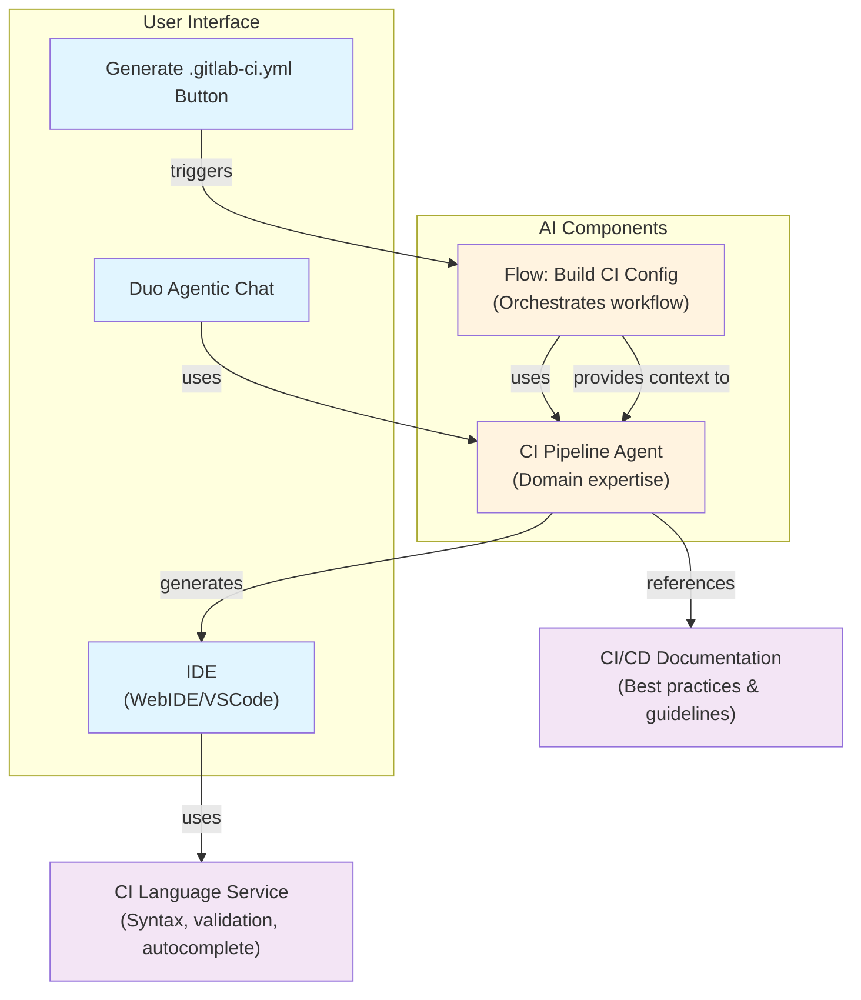



## はじめに

AutoDevOps v2 は、GitLab の自動 CI/CD パイプライン生成システムの根本的な進化を表します。
現在の AutoDevOps の実装は、古いテンプレートとアンチパターンに依存しており、その効果が制限され、
ユーザーから多大な手動設定を必要としています。
この設計は、AutoDevOps を静的なパイプラインジェネレータから、最新の GitLab CI/CD コンポーネントと
GitLab Duo を活用してテーラードされたパイプライン推奨と自動生成機能を提供する、
インテリジェントで AI 駆動の CI/CD 改善アシスタントへと変革することを提案します。

ビジョンは、CI/CD パイプラインのセットアップと最適化を、経験レベルに関係なくすべてのユーザーがアクセスできるようにし、
手動設定に費やされる時間を削減し、既存のパイプラインの継続的な改善を可能にすることです。

## ビジネス目標

主要な目標は次のとおりです。

1. **新規プロジェクトの価値実現までの時間の短縮**: ユーザーがプロジェクトのニーズに合わせた動作する CI/CD パイプラインを取得できるようにし、
   オンボーディングの摩擦と最初のパイプラインまでの時間を削減します。
2. **パイプライン品質の向上**: 既存のパイプライン作者にインテリジェントな推奨を提供し、
   セキュリティのベストプラクティス（例: シークレット検出、コンテナスキャン）とパフォーマンス最適化の採用を支援します。
3. **AutoDevOps の採用率の向上**: AutoDevOps をニッチな機能から、CI 設定がないプロジェクトだけでなく、
   すべてのプロジェクトに価値を加える継続的な改善アシスタントへと変革します。
4. **CI/CD の学習曲線の低減:** インテリジェントなガイダンス、ベストプラクティスの推奨、
   教育用テンプレートとして機能する自動生成された設定を提供することで、CI/CD の概念に不慣れなユーザーの参入障壁を下げます。

期待されるビジネスインパクト:

- **ユーザーの生産性**: 新規プロジェクトごとの初期 CI/CD セットアップ時間で節約される推定時間。
- **セキュリティ姿勢**: 顧客ベース全体でセキュリティスキャンコンポーネントの採用増加。
- **機能の採用**: GitLab CI/CD コンポーネントとカタログ機能とのエンゲージメント向上。
- **顧客満足度**: 改善されたオンボーディング体験と削減された設定の複雑さ。

## 高レベル概要

AutoDevOps v2 は、2 つの主要な機能を持つ多面的なシステムとして動作します。

### 1. 新規プロジェクト向けのパイプライン自動生成

プロジェクトに `.gitlab-ci.yml` ファイルがない場合、AI 駆動のプロセスがプロジェクトの構造を分析し、初期パイプライン設定を生成します。この分析では以下を検出します:

- プロジェクトタイプ（Node.js、Python、Go、Ruby など）
- Dockerfile またはコンテナ関連ファイルの存在
- 既存のテストフレームワークと設定
- セキュリティに敏感なファイル（シークレット、認証情報）
- `AGENTS.md` ファイルを読み込んでプロジェクトのコンテキスト、ビルドおよびテストの方法を取得

生成された設定は、CI テンプレートまたはカタログから GitLab がメンテナンスする CI/CD コンポーネントで構成されますが、プロジェクトに合わせた特定のジョブも含まれます。
プロセスは CI lint ツールを使用して生成された `.gitlab-ci.yml` を検証し、必要な調整を行います。

### 2. 自動パイプライン修正のための継続的な commit-validate ループ

最初のパイプラインコミット後、AutoDevOps v2 は自律的にパイプライン実行を観察し、反復的な commit-validate サイクルを通じてマージリクエスト内のランタイム失敗を自動的に修正します。この機能により、システムは以下を実行できます:

- **ランタイム失敗の検出**: 不足している依存関係、誤設定されたコマンド、環境問題によって引き起こされる失敗をパイプライン実行で監視
- **失敗の根本原因の分析**: パイプラインのログとエラーメッセージを使用して根本的な問題（例: 不足しているパッケージ、不正なコマンド構文、互換性のないバージョン）を特定
- **修正の生成**: 特定された問題を解決するコミットを自動的に作成（例: ビルド設定への不足している依存関係の追加、コマンドパラメータの修正、パッケージバージョンの更新）
- **修正の検証**: パイプラインを再実行して修正が失敗を解決することを確認
- **成功するまで反復**: マージリクエストでパイプラインが正常に実行されるまでサイクルを繰り返す

この自律的なループは手動介入を削減し、ユーザーが手動で問題をデバッグして修正することなく、プロジェクトが動作するパイプラインを達成できるようにします。システムは適用されたすべての修正の記録を維持し、ユーザーがパイプライン設定にどのような変更が加えられたかをレビューして理解できるようにします。

**主な制約**:

- 修正は人間の判断なしに安全に解決できる設定と依存関係の問題に限定されます
- アーキテクチャ変更や外部依存を必要とする複雑な失敗は、ユーザーレビューのためにフラグが立てられます
- すべての自動変更は、問題と適用された修正を文書化する明確なコミットメッセージとともにコミットされます

### 3. 既存パイプライン向けのインテリジェント推奨

既存の CI/CD 設定を持つプロジェクトに対して、AutoDevOps v2 はコンテキストに応じた推奨を提供します:

- 不足しているセキュリティスキャンコンポーネント（SAST、DAST、シークレット検出、コンテナスキャン）を提案
- パフォーマンス最適化（キャッシング戦略、並列実行）を推奨
- 古い依存関係や非推奨の CI/CD パターンを特定
- プロジェクト分析に基づいてコンポーネントのアップグレードを提案

推奨事項は、IDE で利用可能な GitLab CI Language Service とも互換性のある GitLab UI または Duo Agentic Chat を通じて表面化されます。

## 現状

現在の AutoDevOps の実装（[AutoDevOps ドキュメント](https://docs.gitlab.com/topics/autodevops/) を参照）:

- プロジェクトに `.gitlab-ci.yml` がない場合のみパイプラインを生成
- アンチパターン（過剰なトップレベルキーワード、不十分な変数の分離）を持つ古いテンプレートを使用
- 広範なカスタマイズに CI 変数に依存しており、貧弱なユーザー体験を作り出している
- 生成された設定を破棄し、再利用と反復の機会を逃している
- 既存パイプラインへの推奨や改善を提供しない
- スコープが限定されており、多様なプロジェクトタイプと要件に適応できない

- **all-or-nothing アプローチ**: AutoDevOps は、すべてのステージ（ビルド、テスト、デプロイ、セキュリティ）を含むモノリシックなテンプレートとして動作します。
  ユーザーはテンプレート全体を含めるか、個々のジョブテンプレートを手動でコピーしてメンテナンスするかのいずれかなしには特定の機能を簡単にオプトインできず、メンテナンスの負担を作り出します。
- **限定された言語とフレームワークの検出**: AutoDevOps は「言語とフレームワークを自動的に検出する」と主張していますが、
  検出は比較的基本的で、過去に破壊的変更の原因となったビルドパックに依存しています。
  ポリグロットプロジェクト、最新のフレームワーク、
  非標準のプロジェクト構造に苦労し、正しく動作させるには広範な変数設定が必要です。
- **環境変数による設定**: カスタマイズは宣言的な設定ではなく、CI/CD 変数に大きく依存しています。
  これは、ユーザーが希望の動作を達成するために多数の変数（`HELM_UPGRADE_EXTRA_ARGS`、`AUTO_DEVOPS_BUILD_IMAGE_FORWARDED_CI_VARIABLES` など）を発見して理解する必要がある、貧弱な開発者体験を作り出します。
- **静的なテンプレート継承モデル**: AutoDevOps はテンプレートインクルージョンを使用しており、これはユーザーがテンプレート全体を受け入れるか、フォークするかのいずれかであることを意味します。
  特定の機能を選択して組み合わせる構成可能でモジュール式のアプローチはなく、プロジェクトのニーズが変化するにつれてパイプラインを進化させることが困難です。
- **インテリジェント推奨の欠如**: AutoDevOps は、特定のプロジェクトタイプに対してどの機能を有効にすべきかについてのガイダンスを提供しません。
  ユーザーは使用するセキュリティスキャナ、テストツール、デプロイ戦略を手動で決定する必要があり、パイプライン品質を能動的に向上させる機会を逃しています。
- **既存パイプラインのサポートなし**: AutoDevOps はプロジェクトに `.gitlab-ci.yml` がない場合に有効化されます。既存のパイプラインを持つプロジェクトは推奨や改善を受け取らず、ユーザーベースの大部分が AutoDevOps の利点にアクセスできない状態のままになっています。
- **古い依存関係管理**: AutoDevOps は古い依存関係（例: PostgreSQL バージョン）を使用しており、互換性の問題と潜在的なセキュリティギャップを作り出しています。

## 詳細コンポーネント

基盤となる CI Pipeline Agent がドメインの専門知識を提供し、ベストプラクティスに対して GitLab CI/CD ドキュメントを参照する **Flow + Agent** アーキテクチャを使用して、AI 支援の CI/CD パイプライン生成を実装します。Flow がユーザー体験をオーケストレーションします。

**1. CI Pipeline Agent（基盤）**

- CI/CD ドメインの専門知識を提供する汎用的で再利用可能なコンポーネント
- プロジェクトを分析（言語、フレームワーク、テストファイル、デプロイターゲット）
- ベストプラクティスに基づいてパイプライン設定を生成
- 推奨のために CI/CD ドキュメントを参照（ハードコードされていない）
- 複数のフローとユースケースで活用可能
- ベストプラクティスとガイドラインの進化に応じて自動的に適応

**2. Flow: Build CI Config（基盤）**

- 初めてのパイプライン作成のための意見ある、ガイド付きワークフロー
- ユーザージャーニーをオーケストレーション: コンテキスト収集 → 生成 → レビュー → 承認
- UI の `Generate .gitlab-ci.yml with AI` ボタンによってトリガーされる
- 重い作業のために内部で CI Pipeline Agent を使用
- 制約された選択肢とスマートなデフォルトを通じて認知負荷を削減
- 初心者ユーザーへの明確なエントリーポイントを提供

**3. CI/CD ドキュメント（ベストプラクティス）**

- CI/CD 推奨のための単一の真実の情報源
- エージェントは推奨パイプライン構造、ジョブ設定ベストプラクティス、セキュリティスキャン、
  パフォーマンス最適化、ティア固有の機能のためにドキュメントを参照
- ベストプラクティスをエージェントロジックから切り離す
- エージェント再訓練なしの推奨の迅速な反復を可能にする

**4. CI Language Service**

- 構文検証、自動補完、ホバードキュメントを提供
- YAML スキーマ検証を処理
- 結果のパイプラインのリアルタイムビジュアライゼーションを提供
- ロジックではなく構文に焦点を当てることでエージェントを補完
- IDE でのリアルタイムフィードバックを可能にする

**5. IDE 統合（WebIDE/VSCode）**

- 生成されたパイプライン設定を表示
- 編集サポートのために Language Service を統合
- 学習のためのドキュメントへのリンク
- リアルタイムビジュアライゼーション（将来の機能拡張）を表示

### ユーザーフロー

1. ユーザーが `Generate .gitlab-ci.yml with AI` ボタンをクリック
1. Flow が開始され、コンテキスト（プロジェクト分析、ユーザー設定）を収集
1. Flow が収集したコンテキストで CI Pipeline Agent を呼び出す
1. エージェントがベストプラクティスのために CI/CD ドキュメントを参照
1. エージェントが説明付きでパイプライン設定を生成
1. Flow がレビュー/承認のために結果をユーザーに提示
1. ユーザーは Language Service サポート付きで編集するために IDE を開ける
1. IDE がドキュメントリンクとビジュアライゼーションを表示

### 利点

- **柔軟性:** エージェントは汎用的で顧客のニーズに適応可能なまま
- **メンテナンス性:** ベストプラクティスはコードではなくドキュメントに集約される
- **再利用性:** エージェントは複数の機能（フロー、チャットコマンド、IDE 提案）を駆動可能
- **スケーラビリティ:** ドキュメントの更新が自動的にエージェントの推奨を改善
- **ユーザー体験:** Flow が初心者向けにガイド付きで意見のある体験を提供
- **将来対応:** アーキテクチャは利用可能になったときに WebIDE エージェント統合をサポート

## アーキテクチャ決定記録

### ADR 1: コアロジックを基盤エージェントとして実装する

**コンテキスト**: AutoDevOps v2 は、プロジェクト分析、パイプライン生成、設定検証、失敗調査、対話型支援を含む高度な機能を必要とします。これらの機能は複数のドメイン（コード分析、CI/CD の専門知識、デバッグ）にまたがり、継続的な学習と適応を必要とします。

**決定**: AutoDevOps v2 のコアロジックを、個別のマイクロサービスやルールベースシステムを構築する代わりに、GitLab AI Catalog の [CI/CD Expert Agent](https://gitlab.com/explore/ai-catalog/agents/1169/) の修正版に基づいた基盤エージェントとして実装します。

**根拠**:

- **統合されたインテリジェンス**: 基盤エージェントは、一貫した推論とコンテキスト認識を持って複数のタスク（プロジェクト分析、パイプライン生成、検証、デバッグ、ユーザー支援）をシームレスに処理できる
- **実証された専門知識の活用**: エージェントは GitLab CI/CD パターン、ベストプラクティス、一般的な問題を理解し、開発時間を削減して品質を向上させる
- **適応性**: エージェントベースのアプローチは、アーキテクチャの変更を必要とせずにチューニングとフィードバックを通じて継続的な改善を可能にする
- **複雑性の削減**: 複雑なサービス間通信を持つ複数の専門サービスを構築・維持することを回避する
- **プラットフォーム戦略との整合**: 基盤エージェントを通じた AI 駆動の開発ワークフローという GitLab のビジョンをサポートする
- **拡張性**: エージェントフレームワークは、コアアーキテクチャを再設計せずに新機能（例: セキュリティ分析、パフォーマンス最適化）の追加を可能にする

**トレードオフ**:

- 基盤エージェントプラットフォームの安定性とパフォーマンスに依存
- 信頼できる出力を保証するため、注意深いプロンプトエンジニアリングと検証が必要
- アクションを実行する前にエージェントの応答を検証する必要がある（コミット、パイプライン実行）
- AutoDevOps v2 の機能が拡張するにつれて継続的なチューニングが必要になる場合がある

**検討した代替案**:

- マイクロサービスアーキテクチャ: 複雑なオーケストレーションを持つ複数の専門サービスの構築とメンテナンスが必要
- ルールベースシステム: 柔軟性が限定され、時間とともに改善することが困難で、新しいシナリオを処理できない
- カスタム ML モデル: 高い開発コスト、ML の専門知識が必要、市場投入までの時間が長い

### ADR 2: CI コンポーネントの選択

**コンテキスト**: AutoDevOps v2 はプロジェクト分析に基づいてインテリジェントにコンポーネントを選択する必要がありますが、ユーザーは推奨を理解して信頼する必要があります。

**決定**: GitLab がメンテナンスするコンポーネントと組織レベルのコンポーネントの AI 駆動の選択を、各コンポーネントが推奨される理由の明確な説明とともに実装し、ユーザーが推奨を受け入れる、カスタマイズする、拒否することを可能にします。

**根拠**:

- インテリジェントでコンテキストを意識した推奨を提供
- ユーザーの主体性とコントロールを維持
- 透明性を通じて信頼を構築
- ユーザーフィードバックを通じた継続的な改善を可能にする

**トレードオフ**:

- エージェントは再利用性とメンテナンス性および明確性のバランスを取る必要がある
- GitLab がメンテナンスするコンポーネントと組織の内部コンポーネントのみを推奨する場合がある

### ADR 3: MVP では CI のみに焦点を当てる

**コンテキスト**: AutoDevOps v2 は野心と提供リスクのバランスを取る必要があります。CD（継続的デプロイ）は CI（継続的インテグレーション）よりも大幅に高い複雑性とリスクを持ち込みます。

**決定**: MVP のスコープを CI 機能（テスト、セキュリティスキャン、コード品質）のみに絞ります。すべての CD 機能（デプロイ、リリース、インフラプロビジョニング）を初期実装から除外します。

**根拠**:

- CI は自動化のリスクが低く価値が高く、人間の監視なしでの完全自動化の優れた候補です。
  バグを高頻度で検出します（すべてのブランチ/タグ/MR）。
  ミスは本番インシデントではなくパイプライン失敗をもたらします。
  リポジトリコンテキストから完全に導出可能です（外部のシークレット/認証情報は不要）。
- CD は人間の判断を必要とし、リスクが高くなります。
  ソフトウェアを本番に低頻度で配信します（リリースタグ/ブランチ）。
  ミスは本番インシデント、セキュリティ侵害、顧客向け失敗を直接引き起こします。
  機密の認証情報とインフラアクセスの処理が必要です。
  デプロイパターンはプロジェクトと組織間で大きく異なります。
  リポジトリコンテキストだけからは推論できないプロジェクト固有の詳細に依存します。

**トレードオフ**:

- 初期の価値提案をパイプライン品質とテストに限定する。
- デプロイ自動化を将来のフェーズに延期する。

**検討した代替案**:

- MVP に CD を含める: 高い実装複雑性、増加したセキュリティリスク、長い提供タイムライン。
- 限定された CD を含むハイブリッドアプローチ: 機密の認証情報処理と承認ワークフローが依然として必要。

### ADR 4: 補完機能としての CI Pipeline Language Service

**コンテキスト**: AutoDevOps v2 は初期パイプラインを生成し推奨を提供しますが、ユーザーは CI/CD 設定を理解し、カスタマイズし、メンテナンスするためのツールを必要とします。専用のパイプラインオーサリング体験は使いやすさを向上させ、摩擦を削減します。

**決定**: AutoDevOps v2 にパイプラインオーサリング機能を直接構築するのではなく、[CI Pipeline Language Service](https://gitlab.com/groups/gitlab-org/editor-extensions/-/work_items/158) を AutoDevOps v2 への補完機能として位置づけます。

**根拠**:

- **関心の分離**: AutoDevOps v2 は生成と推奨に焦点を当て、CI Pipeline Language Service はオーサリングと編集体験を処理します
- **より広い影響**: CI Pipeline Language Service は AutoDevOps v2 ユーザーだけでなく、すべてのパイプライン作者に利益をもたらします
- **削減されたスコープ**: AutoDevOps v2 が包括的な IDE/エディタ機能を構築せずにコアインテリジェンスに集中できるようにします
- **相乗的な統合**: 両方の機能が互いを強化します。AutoDevOps v2 は初期設定を生成し、ユーザーは CI Pipeline Language Service でそれらを洗練させます
- **より速い提供**: 互いをブロックせずに両方の機能の並行開発を可能にします

**CI Pipeline Language Service の機能の根拠**:

- 複数の IDE のサポートにより、ユーザーが最も快適な場所で生産性をもたらす
- パイプラインビジュアライゼーションがユーザーが実行フローと依存関係を理解するのを助ける
- インラインで文脈を意識した自動提案とドキュメントが学習曲線を削減する
- シームレスな Duo 統合により、ユーザーは自然に質問したり変更を要求したりできる
- CI カタログ（コンポーネントと関数）との統合が発見可能性と再利用を可能にする

**トレードオフ**:

- 2 つの別々の機能間の調整が必要
- ユーザーは完全な利益を得るために両方のツールを採用する必要がある
- CI Pipeline Language Service の開発タイムラインに依存

### ADR 5: 強化されたプロジェクトコンテキストのために AGENTS.md を活用する

**コンテキスト**: AutoDevOps v2 の基盤エージェントは、適切なパイプラインを生成し、関連する推奨を提供するために、正確なプロジェクト理解を必要とします。ファイル構造と依存検出のみに基づくプロジェクト分析には、プロジェクト固有のビルドプロセス、テスト戦略、アーキテクチャ決定を捕捉する上での制限があります。

**決定**: 自動プロジェクト構造分析と依存関係検出によって補完される、`AGENTS.md` ファイルの読み込みと分析を（存在する場合）プロジェクトコンテキストの主要なソースとして優先します。

**根拠**:

- **豊富なコンテキスト情報**: AGENTS.md ファイルには、プロジェクトメンテナーによって書かれたプロジェクト構造、ビルド手順、テスト戦略、デプロイ考慮事項の明示的なドキュメントが含まれている
- **正確性と信頼性**: メンテナーが提供する情報は推論されたパターンよりも正確であり、誤った仮定と不正確なパイプライン生成を削減する
- **エッジケースの処理**: 自動検出が苦労する非標準のプロジェクト構造、ポリグロットプロジェクト、カスタムビルドプロセスを捕捉する
- **ベストプラクティスのサポート**: プロジェクトがビルドとテストの手順を文書化することを促進し、全体的なプロジェクトのメンテナンス性を向上させる
- **設定負担の削減**: AGENTS.md が明確なガイダンスを提供する場合、広範な CI/CD 変数や手動設定の必要性を排除する
- **コミュニティ標準との整合**: AGENTS.md はエージェントが読める形式のプロジェクト情報を文書化するためのベストプラクティスとして採用が進んでいる

**トレードオフ**:

- プロジェクトが正確な AGENTS.md ファイルをメンテナンスすることに依存する
- AGENTS.md がないプロジェクトには自動分析へのフォールバックが必要
- エージェントは一貫性のないまたは古い AGENTS.md コンテンツを優雅に処理する必要がある

**検討した代替案**:

- 自動プロジェクト分析のみに依存: 複雑または非標準のプロジェクトでの精度が限定され、広範な CI/CD 変数設定が必要
- AGENTS.md を必須とする: ドキュメントのない既存プロジェクトの採用をブロックする
- ファイル構造ヒューリスティックのみを使用: 重要なプロジェクト固有のコンテキストとベストプラクティスを見逃す

### ADR 6: 初期 `.gitlab-ci.yml` 生成を Flow として行う

**コンテキスト:** AutoDevOps v2 は、新規プロジェクトのための初期 `.gitlab-ci.yml` 設定を生成する必要があります。基盤エージェントはプロジェクト分析と設定生成のためのコアインテリジェンスを提供しますが、初期設定の作成プロセスは、ユーザーが要件を操舵することを可能にしながら、特定のプロンプトを必要とする非常に特定のタスクです。

**決定:** 完全に自律的なエージェント機能としてではなく、CI/CD 基盤エージェントの上に構築された Flow として初期 `.gitlab-ci.yml` 設定生成を実装します。

**根拠:**

- **特定タスクへの焦点:** 設定生成は、オープンエンドのエージェント自律性ではなく、構造化された Flow から利益を得る、よく定義されてスコープされたタスクです
- **ユーザーの主体性とコントロール:** Flow は生成プロセスに対する明確なユーザーコントロールを維持し、信頼を構築し、ユーザーが各ステップを理解して検証できるようにします
- **反復的な洗練:** ユーザーは中間結果をレビューし、調整を要求し、エージェントを希望の結果に向けて導くことができ、設定品質とユーザー満足度を向上させます
- **より良い UX:** Flow は明確なプロンプトとフィードバックループを持つガイド付きの体験を提供し、CI/CD に不慣れなユーザーにとってプロセスをより直感的にします

**トレードオフ:**

- 完全に自律的な生成と比較してより多くのユーザー対話を必要とする
- Flow 設計は多様なプロジェクトタイプに対応するためにガイダンスと柔軟性のバランスを取る必要がある
- Flow がユーザーから必要とする情報の明確なコミュニケーションが必要

## 脅威モデル

### セキュリティ考慮事項

1. **安全でないパイプライン**: 生成されたパイプラインが意図せず安全でない手法を使用する可能性。
   - **緩和策**: 生成された設定を検証、承認ワークフローを実装
2. **サプライチェーン攻撃**: 侵害されたコンポーネントが生成されたパイプラインで推奨され使用される可能性
   - **緩和策**: コンポーネント検証を実装、コンポーネントセキュリティ標準を維持、脆弱性を監視
3. **ユーザーの操作**: AI 推奨が安全でない、または悪意のある設定を提案するように操作される可能性
   - **緩和策**: 推奨の検証を実装、監査証跡を維持、ユーザーオーバーライドを有効化
4. **プロンプトインジェクション:** エージェント自体が設定生成中に任意のコードを実行するように操作される可能性。
   - **緩和策:** タスクに必要な最小限の権限にエージェントの権限を削減します。非常に特定の読み取り専用 API 呼び出し、外部ネットワークアクセスなし、ローカル環境外への書き込み API 呼び出し _なし_ のみを使用できます。データを取り出す唯一の方法は、生成された CI 設定経由です。

## まとめ

AutoDevOps v2 は、GitLab がユーザーが CI/CD パイプラインをセットアップして最適化するのを助ける方法における重要な進化を表します。実証された CI/CD ベストプラクティス、最新の CI/CD コンポーネント、AI 駆動のインテリジェンス、プロジェクト中心のアプローチを活用することで、AutoDevOps を静的なパイプラインジェネレータから、すべてのプロジェクトに価値を加える継続的な改善アシスタントへと変革できます。

成功は、採用メトリクス、ユーザー満足度、GitLab ユーザーベース全体のパイプライン品質とセキュリティ姿勢への影響を通じて測定されます。

## 参考文献

- [AutoDevOps ドキュメント](https://docs.gitlab.com/topics/autodevops/)
- [GitLab CI/CD コンポーネント](https://docs.gitlab.com/ee/ci/components/)
- [GitLab Handbook - アーキテクチャ設計ワークフロー](https://gitlab.com/gitlab-com/content-sites/handbook/-/merge_requests/16893)
- [Issue #627: AutoDevOps v2](https://gitlab.com/gitlab-org/verify-stage/-/issues/627)
- [Epic #20172: Intelligent CI/CD](https://gitlab.com/gitlab-org/verify-stage/-/issues/20172)
