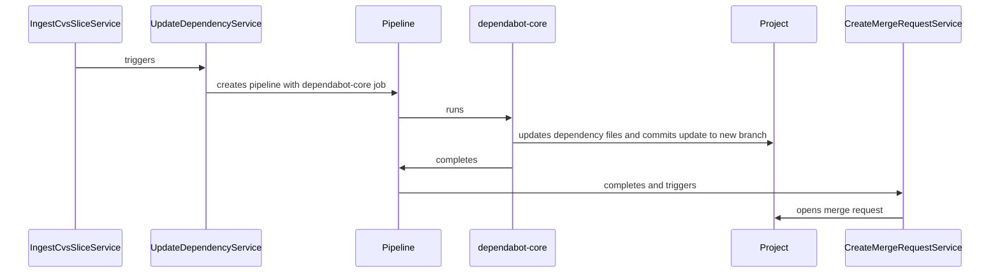
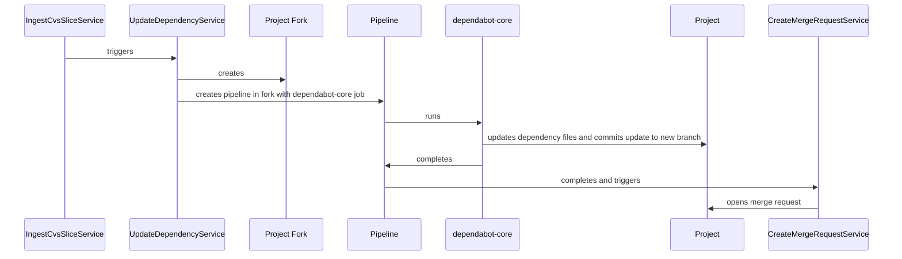

<!-- Design Documents often contain forward-looking statements -->
<!-- vale gitlab.FutureTense = NO -->

<!-- This renders the design document header on the detail page, so don't remove it-->



## 概要

自動依存関係更新は、プロジェクトの依存関係を最新に保つ責任を負うサービスです。
プロジェクトの依存関係を最新に保つことは、広くベストプラクティスとして
考えられています。これにより、最新のバグ修正、パフォーマンス改善、
セキュリティパッチがプロジェクトの依存関係に適用されることが保証されます。
依存関係の更新を確認して適用するプロセスは
非常にシンプルなことが多いですが、時間がかかります。
自動依存関係更新は、このプロセスを自動的に実行することを目指し、
GitLab Duo Agent Platform と統合することで、ユーザーが手間のかからない
依存関係更新体験を享受できるようにします。

## モチベーション

[Renovate](https://docs.renovatebot.com/) や
[dependabot-core](https://github.com/dependabot/dependabot-core#) のような既存の依存関係管理ツールは、
更新を確認するプロセスを自動化でき、見つかった更新でマージリクエストを作成することもできます。
しかし、それらにはいくつかの制限があります:

- インストールがスケールアップしにくい場合がある [^1]
- ユーザーは必要なアクセストークンを管理する必要があり、設定オーバーヘッドが追加される
- 任意のコードをよく実行するため、追加のセキュリティコントロールが必要 [^2] [^3]
- ツールが提案する依存関係の更新には、その更新が脆弱性に対処するか、
  対処する場合はその脆弱性の重大度がどれかなど、
  重要なコンテキストが欠けている。

### ゴール

- 言語依存関係更新のための自動 MR 作成 [^4]
- ゼロ設定での有効化
- GitLab Agent Duo Platform との統合により、以前に手動で修正された依存関係更新の問題の特定と対処を支援する。

### 非ゴール

- Renovate がサポートしているようなカスタム依存関係マネージャー
- 言語依存関係以外の更新

## 提案

依存関係管理は本質的に複雑な問題領域です。完全にグリーンフィールドのソリューションを
構築することは可能ですが、十分に使用され、よく機能することが実証されている
既製のツールを使用することがはるかに効率的なオプションです。
そのため、自動依存関係更新を駆動するために dependabot-core ライブラリの使用を選択しました。
このライブラリをオプションとして評価する際に、次の長所と短所が考慮されました。

**長所**:

- サポートされているエコシステムの多様なリスト
- コアコントリビュータとオープンソースコミュニティから頻繁に貢献を受ける
- GitLab で広く使用されている言語（Ruby）で書かれている

**短所**:

- インタプリタやランタイムマネージャーのような依存関係を必要とする [^5]
- 隔離された CI/CD ジョブとして実行するように設計されており、Sidekiq ワーカーのようなもののコンテキストでは実行されない
- セキュリティ推奨事項としてプライベートレジストリ用の依存プロキシの実行が必要
- ロックファイルを持つプロジェクトの間接的な依存関係更新のみを許可

いくつかの欠点があるにもかかわらず、dependabot-core は実質的な利点を提供し、
ユーザーの広い割合に対して機能するソリューションを提供できるようにします。
したがって、依存関係更新を自動化するために dependabot-core を使用します。

## 設計および実装の詳細

高レベルでは、システムは次のコンポーネントとやり取りします。

- **IngestCvsSliceService**: この
  [サービス](https://gitlab.com/gitlab-org/gitlab/blob/e4102ebc0e751446b73628c4a0161e5a4dcad504/ee/app/services/security/ingestion/ingest_cvs_slice_service.rb#L5)
  は
  [継続的脆弱性スキャン](https://docs.gitlab.com/user/application_security/continuous_vulnerability_scanning/)
  の脆弱性を作成します。スキャンが完了すると、脆弱なコンポーネントを
  さらなる分析のために転送します。更新可能な脆弱なコンポーネントは、
  そうするためのキューに入れられます。
- **UpdateDependencyService**: この新しいサービスは、依存関係更新ジョブ **のみ** を実行する
  新しいパイプラインの作成を担当します。機能を有効にすること以外、
  ユーザー設定は不要です。
- **dependabot-core**: このソフトウェアは CI/CD ジョブで実行され、
  依存関係が更新できる最新バージョンを解決します。その後、必要な変更を
  ブランチにコミットします。
- **CreateMergeRequestService**: このサービスは、依存関係更新パイプラインが完了した後に
  マージリクエストを作成します。これは、dependabot-core コミットに使用されるアカウントが
  プロジェクト、グループ、またはインスタンスレベルでマージリクエストを作成する権限を必要としないことを意味します。
- **RebaseMergeRequestService**: このサービスは、コンフリクトの場合に
  オープンな依存関係更新マージリクエストをリベースする責任を負います。

**プロジェクトベースのシステム**

**代替フォークベースのシステム**

### 責任の分離

述べたように、dependabot-core ジョブは特定の依存関係を更新するときに任意のコードを実行する能力を持っています。
この強力な能力により、dependabot-core は複雑な更新を実行できますが、
緩和する必要があるリスクも追加されます。このため、CI/CD ジョブ用と
マージリクエスト作成用の 2 つの別々のアカウントを使用して、
依存関係更新を実行します。

CI/CD ジョブは、リポジトリを読み取ることができ、依存関係更新関連の
ブランチセットにのみ書き込むことができるアカウントへのアクセスを持ちます。
さらに、ジョブにはパッケージレジストリトークンが設定されておらず、
強化されたプロキシサービスを通じてレジストリにアクセスします。

CI/CD ジョブが API を介してマージリクエストを作成できないため、
別のアカウントを使用して `DependencyManagement::CreateMergeRequestService` クラスでマージリクエストを作成します。
このクラスは、dependabot-core ジョブによって作成されたブランチからの
新しいマージリクエストのみを開きます。これらの事前設定されたタスクの外で何もできません。

この設計により、侵害されたトークンは保護されていないブランチに対する
読み書き権限のみを持つようになります。マージリクエスト作成を CI/CD ジョブからの API 呼び出しと
バンドルすると、侵害されたトークンには過度に許容的な `api` スコープが付与されないことを意味します。

### モジュールのグループ化

この機能セットに使用するモジュール名には注意深い検討が必要です。可能ですが、
後で変更するのは簡単な作業ではありません。
たとえば、Sidekiq ワーカーは削除前に [少なくとも 3 マイルストーン](https://docs.gitlab.com/development/sidekiq/compatibility_across_updates/#removing-worker-classes)
を必要とします。

そのため、関連するすべてのコードに `DependencyManagement` モジュールを使用することを提案します。
この名前は説明的で、見つけやすく、処理すべきことに対する明確な境界を提供します。
`UpdateDependencyService` と `CreateMergeRequestService` は両方ともこのモジュールに存在し、
次の参照を持ちます。

- `DependencyManagement::UpdateDependencyService`
- `DependencyManagement::CreateMergeRequestService`

### イメージのメンテナンス

依存関係の更新を完了するには、必要なインタプリタ、コンパイラ、パッケージマネージャーへの
アクセスが必要です。これを達成するための実行可能な 2 つのアプローチがあり、
両方ともコンテナを利用します。

1. 依存関係の包括的なセットがバンドルされたモノリシックイメージ。
1. 環境ごとにセグメント化された複数のイメージ

2 つの間の明確な選択は、複数のイメージを作成してメンテナンスすることです。
他のプロジェクトでモノリシックイメージのアプローチを試しましたが、このアプローチには
多くの欠点があることがわかりました。1 つは、モノリシックイメージは巨大なサイズになる傾向があります。
これは、ビルド、圧縮、コンテナレジストリへのアップロードに大幅に長くかかることを意味します。
さらに、モノリシックイメージのバグの影響範囲ははるかに大きくなります。
単一のエコシステムへの単一の損害を引き起こす代わりに、モノリシックイメージは含まれる
すべてのエコシステムに損害を引き起こすリスクがあります。これらの理由から、
各エコシステムが独自のコンテナイメージを持つ、マルチイメージアプローチを採用します。

### 依存関係管理のインサイト

顧客は、開いている依存関係の更新、そのような更新の現在のステータスを表示し、
自動依存関係更新によって脆弱性が閉じられたかどうかを確認できる必要があります。
これを達成するために、次のオプションが利用可能です。

1. マージリクエストリストビューを更新してこの情報を表面化する
1. セキュリティの下に新しいダッシュボードタイプを作成する
1. 依存関係リストを脆弱性を修正するマージリクエストへの参照で強化する
1. 脆弱性詳細で関連するマージリクエストに言及する

#### マージリクエストリストビューを更新する

このオプションは素早く反復できるようにし、最小限の作業を必要とします。
依存関係管理ボットによって作成されたマージリクエストを表面化するために、既存のマージリクエストページを活用できます。
このリストには、適切な承認ステータス、パイプラインステータス、最終更新ステータス、
通常のマージリクエストですでに表示されているその他すべての詳細が表示されます。欠点は、
対処される脆弱性に対する可視性がないことです。

#### セキュリティの下に新しいダッシュボードタイプを作成する

このオプションは初期コストが高くなりますが、依存関係管理および脆弱性解決のコンテキストに
体験を合わせることができます。この新しいビューでは、次の情報を表面化します。

- 依存関係更新によって解決された脆弱性。現在マージリクエストウィジェットでこれを行っており、
  この作業から再利用または構築できるはずです。
- パイプラインのステータスと、Duo によって適用された修正。
- マージリクエストの年齢。この情報は、古くなったマージリクエストを優先するのに役立ちます。

#### 依存関係リストを強化する

依存関係リストにはすでに各依存関係に関連する脆弱性の数がリストされているため、
脆弱性を解決するマージリクエストの数を強調する追加のデータを追加できる可能性があります。

#### 脆弱性詳細で関連するマージリクエストに言及する

脆弱性ページには、脆弱性が検出されなくなったコミットが言及されています。
その後、コミット詳細を表示することで関連するマージリクエストを見つけることができます。
これは機能しますが、管理された依存関係更新がこの解決を支援したという非常に重要な詳細を
隠します。

### 使用メトリクスとオブザーバビリティ

GitLab は顧客が [GitLab の使用状況を分析](https://docs.gitlab.com/user/analytics/) できるようにします。
この機能セットにより、ユーザーは AI Impact Analytics や CI/CD アナリティクスのようなものを表示できます。
このようなデータは、脆弱性解決を伴う依存関係管理のような機能の採用の影響を顧客が視覚化するのに役立つため、
ここでもこれを表面化します。

## 代替ソリューション

### 独自の依存関係管理サービスをブートストラップする

これはかなり大きなタスクで、時間とともに大量のパッケージマネージャーに対するバージョン解決を
実装する必要がありますが、いくつかの利点があります。

**長所**:

- ロックファイルを **持たない** プロジェクトのバージョン範囲をバンプ
- 依存関係をローカルにインストールする必要なし

**短所**:

- Renovate や dependabot-core のような既存ツールと同じエコシステムをサポートするためには、
  大量の作業が必要。

[^1]:
    たとえば、Renovate は
    [グローバルアクセスまたは許可リスト](https://docs.renovatebot.com/getting-started/installing-onboarding/#repository-installation) を必要とします。

[^2]:
    Renovate は
    [任意のコード](https://docs.renovatebot.com/security-and-permissions/#execution-of-code) を実行する場合があり、
    ユーザーコマンドの許可リストの使用を頻繁に推奨します。

[^3]:
    dependabot-core は
    [任意のコード](https://github.com/dependabot/dependabot-core#private-registry-credential-management) を実行する場合があり、
    追加のセキュリティのために、アクセストークンから隔離されてジョブを実行するようにユーザーに設定を要求します。

[^4]:
    言語依存関係は、パッケージマネージャーによって管理されるプログラミング言語の依存関係です。
    例には、Bundler 管理の Ruby gems、Go モジュール、
    Rust crates などがあります。

[^5]:
    たとえば、Python と PyEnv は `dependabot-core/python` を実行するために必要です。
