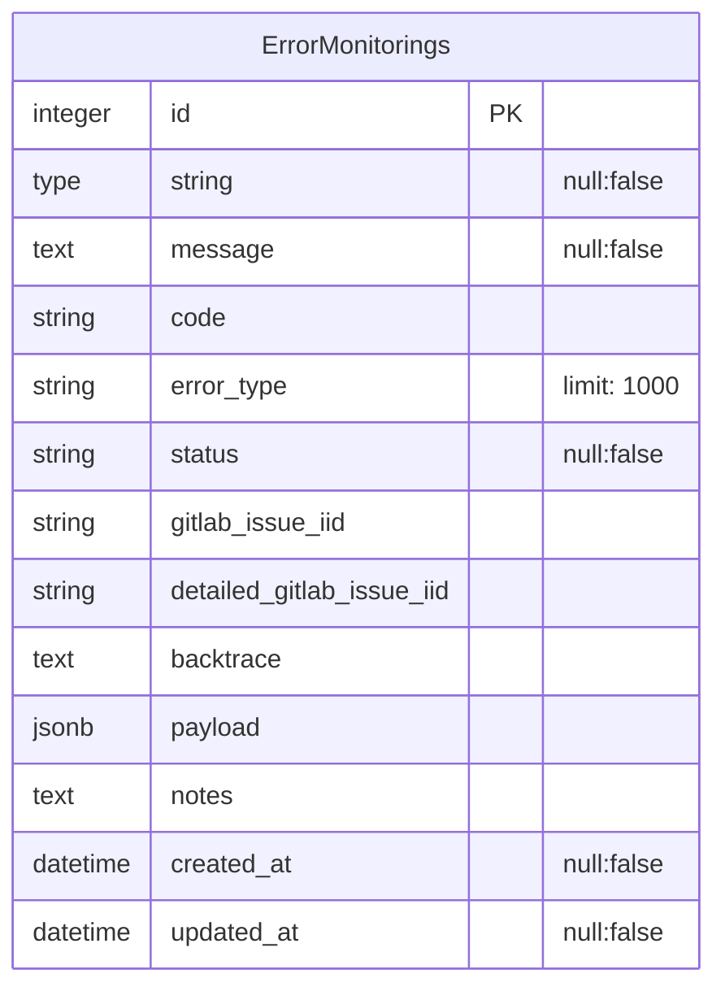
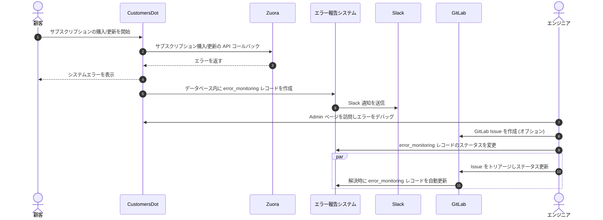

<!-- This renders the design document header on the detail page, so don't remove it-->




## サマリー

CustomersDot は、顧客がサブスクリプションを購入・管理するためのシームレスな体験を提供する強力なプラットフォームです。SaaS アプリケーションでは、CustomersDot は API 呼び出しを通じて GitLab.com と通信し、サブスクリプションの詳細をリアルタイムで更新します。セルフマネージド (SM) アプリケーションおよび Dedicated インスタンスでは、顧客のシステムにインストールするためのライセンスを生成します。最新バージョンでは、クラウド経由でライセンスをインストールできるようにすることで、このプロセスを強化し、より高い利便性と柔軟性を提供します。

CustomersDot は [Zuora](../../../../business-technology/enterprise-applications/guides/zuora/) や Salesforce などのいくつかのサードパーティツールと統合しています。Zuora はエンドツーエンドの order-to-revenue SaaS プラットフォームで、GitLab の見積、課金、収益回収、収益認識、サブスクリプションメトリクスのレポートを支えています。また、これらの業務を担当するバックオフィスチームもサポートしています。

## 動機

SOX コンプライアンスの観点から、CustomersDot アプリケーションでサブスクリプションの購入、更新、プロビジョニング中に発生するあらゆるエラーを特定・追跡することが重要です。現在、私たちはサブスクリプションの作成または更新後のプロビジョニングプロセスをモニタリングするために [プロビジョニングトラッキングシステム](https://gitlab.com/gitlab-org/customers-gitlab-com/-/blob/de36e3ddef5c875aa2c675b3d9e0f34767a43bfc/doc/provision_tracking_system/failure_monitoring.md) を活用しています。しかし、サブスクリプションの購入や更新の前に発生する一部の収益認識に影響するエラーには追跡のギャップがあります。包括的なエラー追跡を保証し、収益認識プロセスの正確性を向上させるためには、このギャップに対処することが重要です。

### ゴール

ゴールは、購入、更新、更新 (renewal)、再調整 (reconciliation) のフローで発生する収益影響エラーの追跡・モニタリングシステムを提供することです。これは CustomersDot の統合の以下の側面 (Q3 では Zuora、Salesforce、Q4 2025 では他) をカバーします。

提案のスパイク issue は gitlab-org/customers-gitlab-com#10430 にあります。

* 関係者にとっての可視性の向上 (データ検証のために異なるシステムへアクセスする必要を解消)
* エッジケースのドキュメント化
* 自動化されたエラーモニタリング/アラートシステム
* サードパーティのエラー (例: Zuora の利用不可など) に対する修正やプロセスのドキュメント化

## 提案

[Fulfillment Platform グループ](../../../development/fulfillment/fulfillment-platform/) は現在、上述のエラーをモニタリングする手動プロセスを担っています。毎週、エンジニアが [ジョブモニタリング issue](https://gitlab.com/gitlab-org/customers-gitlab-com/-/blob/main/.gitlab/issue_templates/Job%20monitoring%20weekly.md?ref_type=heads) にアサインされ、毎日スクリプトを実行してエラーのコレクションを収集する必要があります。これらのエラーは個別にレビューされ、ユーザーバリデーション、支払方法バリデーション、ロケーション問題に関連しないものなど、対応すべき項目を特定します。エンジニアはコンソールまたは Admin パネルを使ってこれらのエラーを手動で解決します。

効率と結果を改善するため、このプロセスを自動化する必要があります。

* **新しいエラー追跡システムを開発** し、プロビジョニングおよび収益認識エラーのモニタリングを改善します。
  * **新しいデータベーステーブルを作成** してエラーログを保存します。
  * **管理画面に新しいビューを追加** してこれらのエラーを表示・管理します。
* **コードベースを強化** して、関連エラーを新しいデータベースに自動的に保存します。
* 新しいエラーが発生したときにチームに通知する **Slack 通知** を実装します。
* **issue 作成を自動化**:
  * 毎日発生する新しいエラーをまとめた日次 issue を生成します。
  * 週を通じて発生したすべてのエラーをまとめた週次 issue を生成します。
* 監査として毎日実行される **cron ジョブ** をセットアップし、処理に失敗した再調整 (reconciliation) と更新 (renewal) を追跡してエラーログに追加します。

## 設計および実装の詳細

### DB スキーマ



`error_monitorings` テーブルは、発生時にモニタリングする価値のある意味のあるエラーを保存するように設計されています。ほとんどのカラムは自明です。[現状の Google Cloud のロギング](https://console.cloud.google.com/logs/query;query=resource.type%3D%22gce_instance%22%0Aseverity%3DERROR%0AinsertId%3D%22va7ahf34wc3i%22;cursorTimestamp=2024-09-06T03:18:44.840Z;aroundTime=2024-09-06T03:18:44.840Z;duration=PT24H?project=gitlab-subscriptions-prod) を例に取ると以下のとおりです。

* `code` -> VALIDATION_ERROR
* `error_type` -> このコードは無効です。メールから受け取ったコードを再入力してみてください。
* `message` -> サブスクリプションの更新に失敗しました

`error_monitorings` テーブルは [Single Table Inheritance (STI)](https://martinfowler.com/eaaCatalog/singleTableInheritance.html) を使って異なるタイプのエラーを保存します。Rails では、type カラムによりこの STI パターンが有効になり、複数のエラータイプを同じテーブルに保存できます。

現在は 'RevenueImpact' と 'SalesforceErrors' の 2 タイプを使用しており、両方とも基底の `ErrorMonitoring` モデルから継承しています。

私たちは、コードベース内に Revenue Impact エラーを保存するために `fulfillment_job_monitoring` でエラーメッセージにタグを付け、GCloud を使ってそれらを個別に検索・解決します。

私たちは、Salesforce 関連のエラーをコードベース内に保存するために `salesforce_error_monitoring` で Salesforce エラーメッセージにタグを付けます。

エラーは引き続き個別に対処されます。エラーが発生するとすぐに、タイムリーな解決を保証するため、バックグラウンドジョブを通じて指定された Slack チャンネルに即時通知を送信します。

#### エラー状態

status カラムには発生したエラーの状態が保存されます。

```mermaid
flowchart TD
    A[エラー発生] -->|データベースに保存| B(状態 - 要対応)
    B --> |対応不要| D[無視]
    B --> |エラーを調査中| F[状態 - 進行中]
    F --> C[GitLab Issue を作成/リンク (オプション)]
    F --> |Issue クローズ| G[状態 - 解決済み]
```

### ワークフロー


