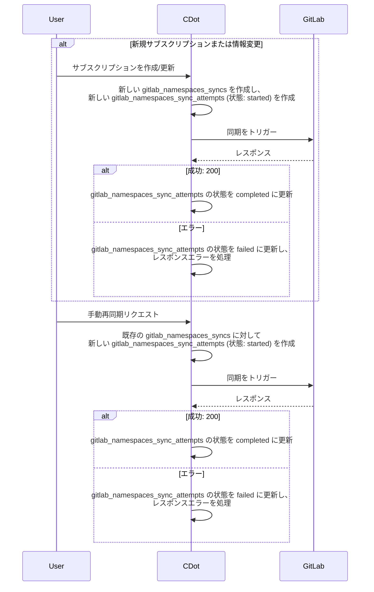
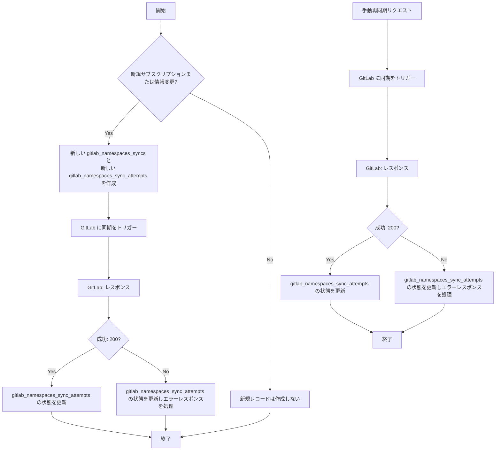
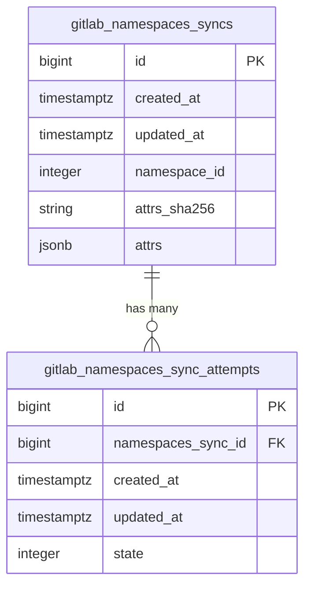
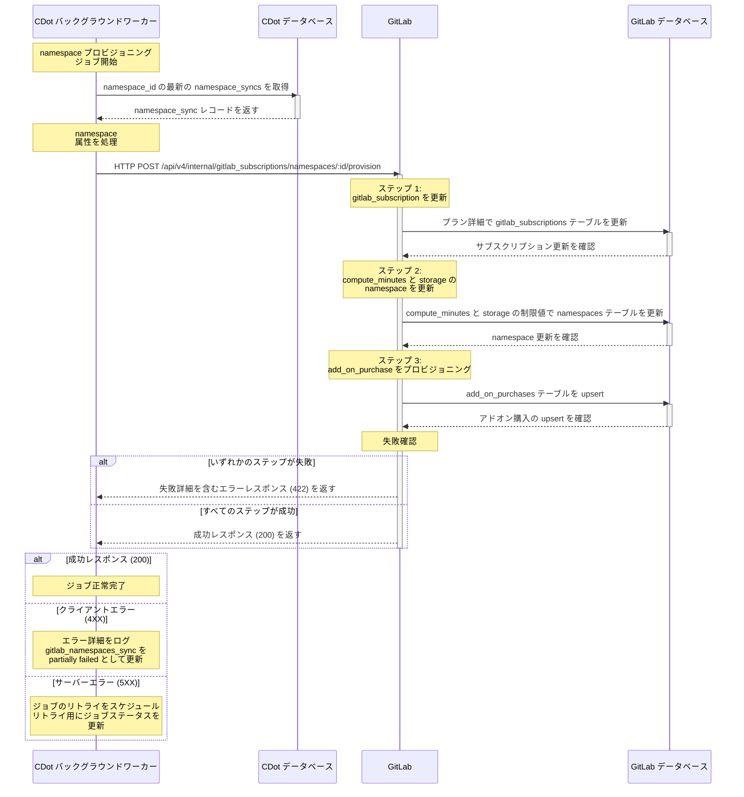

<div class="my-3 border-l-4 border-blue-500 bg-blue-50 px-4 py-3 rounded-r text-sm text-blue-800">
このページには今後予定されている製品・機能・機能性に関する情報が含まれています。ここに示す情報は参考目的のみです。購入・計画の決定にこの情報を使用しないでください。製品・機能・機能性の開発、リリース、タイミングは変更または延期される可能性があり、GitLab Inc. の独自の判断に委ねられています。
</div>

<div class="overflow-x-auto my-4">
<table class="w-full text-sm border-collapse">
<thead>
<tr class="bg-gray-100 text-left">
<th class="px-3 py-2 border border-gray-300">Status</th>
<th class="px-3 py-2 border border-gray-300">Authors</th>
<th class="px-3 py-2 border border-gray-300">Coach</th>
<th class="px-3 py-2 border border-gray-300">DRIs</th>
<th class="px-3 py-2 border border-gray-300">Owning Stage</th>
<th class="px-3 py-2 border border-gray-300">Created</th>
</tr>
</thead>
<tbody>
<tr>
<td class="px-3 py-2 border border-gray-300"><span class="inline-block rounded px-2 py-0.5 text-xs font-medium bg-gray-100 text-gray-700">proposed</span></td>
<td class="px-3 py-2 border border-gray-300"><a href="https://gitlab.com/bhrai" class="text-blue-600 hover:underline">@bhrai</a>, <a href="https://gitlab.com/cwiesner" class="text-blue-600 hover:underline">@cwiesner</a></td>
<td class="px-3 py-2 border border-gray-300"></td>
<td class="px-3 py-2 border border-gray-300"><a href="https://gitlab.com/ppalanikumar" class="text-blue-600 hover:underline">@ppalanikumar</a>, <a href="https://gitlab.com/rhardarson" class="text-blue-600 hover:underline">@rhardarson</a></td>
<td class="px-3 py-2 border border-gray-300"><span class="inline-block rounded px-2 py-0.5 text-xs font-medium bg-gray-100 text-gray-700">~devops::fulfillment</span></td>
<td class="px-3 py-2 border border-gray-300">2025-02-12</td>
</tr>
</tbody>
</table>
</div>


## サマリー

セルフマネージド/Dedicated と GitLab.com 間のプロビジョニングを揃える取り組みの一環として、私たちは GitLab.com 上での namespace プロビジョニングの仕組みを再構築しています。

## 動機

このための作業により、GitLab.com のプロビジョニングをセルフマネージド/Dedicated のプロビジョニング方法により近づけます。

`GitLab.com` では、`Namespace` プロビジョニング用に生成されたパラメータを新しい `gitlab_namespaces_syncs` テーブルに記録し、各同期試行の結果ステータスを `gitlab_namespacess_sync_attempts` テーブルに記録します。これは `セルフマネージド` 向けの `License` の扱い方と類似しており、両方のプロビジョニングプロセスをより近づける結果となります。

## ゴール

このブループリントのゴールは以下を生み出すことです:

- 新しいプロセスを通じて namespace がどのようにプロビジョニングされるかのアーキテクチャ設計
- 選択した設計を実現するためのイテレーション計画

## 提案

生成された `namespace` プロビジョニングパラメータのレコードを保持する新しいテーブル `gitlab_namespace_syncs` を作成します。`gitlab_namespaces_sync` レコードは、`gitlab_namespaces_sync` のステータスをログする多数の `gitlab_namespaces_sync_attempts` を持ちます。状態は `[started, failed, skipped, completed]` のいずれかとなります。

`gitlab_namespaces_sync` レコードが作成されるたびに、`started` 状態の関連する `gitlab_namespaces_sync_attempt` レコードが必ず存在します。その後、関連する `params` を使って namespace をプロビジョニングするため、`GitLab` への **内部 HTTP リクエスト** を行います。`params` には、プロビジョニング対象のすべてのリソース (`[base_product, compute_minutes, storage, add_on_purchases]`) に対するプロビジョニング情報が含まれます。詳細は [API 契約](#api-contract) を参照してください。`GitLab` へのプロビジョニング中、いずれかのリソースのプロビジョニングが失敗しても他のリソースのプロビジョニングは継続されます。たとえば、`Compute Minutes` リソースのプロビジョニングが失敗しても、`Storage` および `AddOnPurchase` リソースのプロビジョニングは継続されます。

プロビジョニング同期のレスポンスに基づいて、`gitlab_namespaces_sync_attempt` レコードの状態を更新します。`200 OK` レスポンスの場合はステータスが `completed` に更新され、それ以外の場合は `failed` になります。

失敗レスポンスコードに基づき、私たちはさらにアクションを実行します:

- `5XX` : これは `Server` エラーで、同期は数回リトライされます
- `4XX` : これはバリデーションエラーで、`Client` 側のパラメータ生成に関連します。これをログし、ケースごとに調査します。

## イテレーション 1

イテレーション 1 では、`CustomersDot` および `GitLab` 上で実装する予定の `シーケンス図`、`フローチャート`、`データベーステーブル`、および `内部 API` を以下に示します。

### CustomersDot (CDot) 側

#### シーケンス図



#### フローチャート



#### データベース



### GitLab.com 側

#### シーケンス図



#### API 契約

`GitLab` 上に namespace のフルプロビジョニングを行う新しい内部エンドポイントを作成します。

`POST /api/v4/internal/gitlab_subscriptions/namespaces/:id/provision`

このエンドポイントは以下の JSON ボディ構造を受け付けます:

```json
{
  "provision": {
    "base_product": {
      "plan_code": "string_value",
      "start_date": "2023-06-01",
      "end_date": "2024-05-31",
      "seats": 100,
      "max_seats_used": 90,
      "trial": false,
      "trial_starts_on": "2023-07-01",
      "trial_ends_on": "2024-07-01",
      "auto_renew": true
    },
    "compute_minutes": {
      "shared_runners_minutes_limit": 50000,
      "extra_shared_runners_minutes_limit": 10000,
      "packs": [
        {
          "purchase_xid": "purchase_1",
          "number_of_minutes": 5000,
          "expires_at": "2023-12-31"
        },
        {
          "purchase_xid": "purchase_2",
          "number_of_minutes": 5000,
          "expires_at": "2024-06-30"
        }
      ]
    },
    "storage": {
      "additional_purchased_storage_size": 1000,
      "additional_purchased_storage_ends_on": "2024-05-31"
    },
    "add_on_purchases": {
      "duo_pro": [
        {
          "quantity": 100,
          "started_on": "2023-06-01",
          "expires_on": "2024-05-31",
          "purchase_xid": "purchase_123",
          "trial": false
        }
      ],
      "duo_enterprise": [
        {
          "quantity": 100,
          "started_on": "2023-06-01",
          "expires_on": "2024-05-31",
          "purchase_xid": "purchase_123",
          "trial": false
        }
      ],
      "product_analytics": [
        {
          "quantity": 100,
          "started_on": "2023-06-01",
          "expires_on": "2024-05-31",
          "purchase_xid": "purchase_123",
          "trial": false
        }
      ]
    }
  }
}
```

##### レスポンス

1. `200` : リクエスト成功
1. `400` : 不正なリクエスト
1. `401` : 認証されていないリクエスト
1. `404` : Namespace が見つからない
1. `422` : 処理不可能なエンティティ
1. `500`: サーバーエラー
