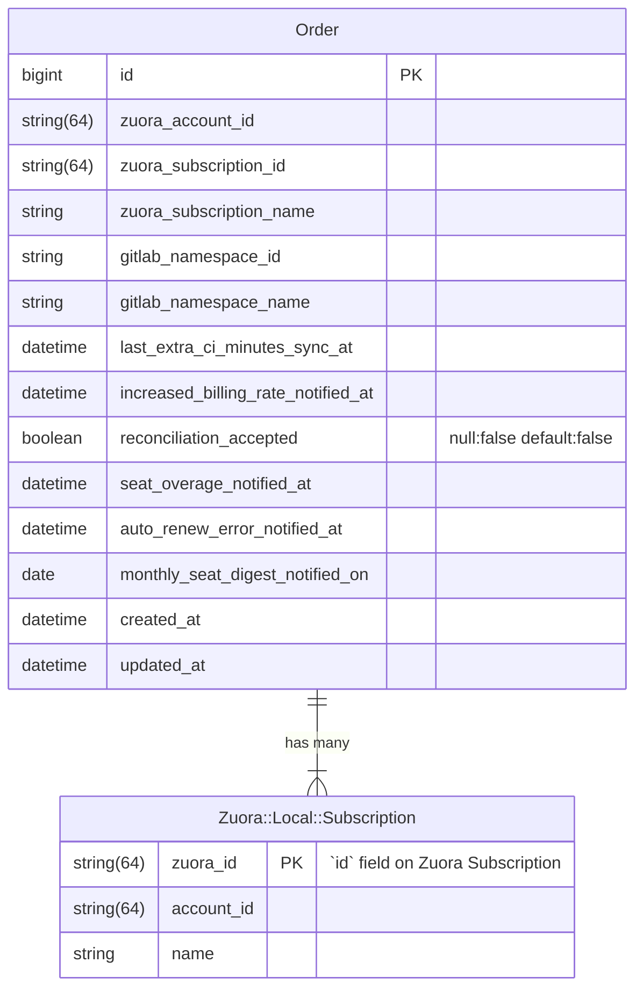

```mermaid
erDiagram
  "Zuora::Local::Subscription" ||--|{ "Zuora::Local::RatePlan" : "has many"
  "Zuora::Local::RatePlan" ||--|{ "Zuora::Local::RatePlanCharge" : "has many"
  "Zuora::Local::RatePlanCharge" ||--|{ "Zuora::Local::RatePlanChargeTier" : "has many"

  "Zuora::Local::Subscription" {
    string(64) zuora_id PK "`id` field on Zuora Subscription"
    integer version "null:false"
    integer current_term
    integer initial_term
    integer renewal_term
    datetime created_date "null:false"
    datetime updated_date "null:false"
    date term_start_date "null:false"
    date term_end_date
    date cancelled_date
    date subscription_start_date "null:false"
    date subscription_end_date
    boolean auto_renew "null:false default:false"
    string(3) eoa_starter_bronze_offer_accepted__c
    string(3) contract_auto_renew__c
    string(3) turn_on_auto_renew__c
    string(3) turn_on_operational_metrics__c
    string(3) turn_on_seat_reconciliation__c
    string(5) current_term_period_type
    string(7) turn_on_cloud_licensing__c
    string(7) marketplace_offer_type__c
    string(18) status
    string(64) account_id "null:false"
    string(64) previous_subscription_id
    string(64) invoice_owner_id "null:false"
    string(64) original_id "null:false"
    string(64) ramp_id
    string(64) created_by_id "null:false"
    string(64) updated_by_id "null:false"
    string(255) name "null:false"
    string(255) opportunity_id__c
    string(255) renewal_subscription__c__c
    string(255) external_subscription_id__c
    string(255) external_subscription_source__c
    string(255) git_lab_namespace_id__c
    string(255) git_lab_namespace_name__c
    string(255) marketplace_agreement_id__c
    string(255) marketplace_offer_id__c
    string(255) marketplace_fee_percentage__c
    string(500) notes
    datetime created_at
    datetime updated_at
  }

  "Zuora::Local::RatePlan" {
    string(64) zuora_id PK "`id` field on Zuora RatePlan"
    datetime created_date "null:false"
    datetime updated_date "null:false"
    datetime created_at "null:false"
    datetime updated_at "null:false"
    string(64) subscription_id FK "null:false"
    string(64) product_rate_plan_id "null:false"
    string(64) created_by_id "null:false"
    string(64) updated_by_id "null:false"
    string(255) name "null:false"
  }

  "Zuora::Local::RatePlanCharge" {
    string(64) zuora_id PK "`id` field on Zuora RatePlanCharge"
    integer version "null:false"
    integer segment "null:false"
    integer quantity
    integer mrr
    integer tcv
    integer dmrc
    integer dtcv
    datetime created_date "null:false"
    datetime updated_date "null:false"
    datetime created_at "null:false"
    datetime updated_at "null:false"
    date effective_start_date
    date effective_end_date
    boolean is_last_segment "null:false default:false"
    string(9) charge_type
    string(30) price_change_option
    string(50) charge_number "null:false"
    string(64) rate_plan_id FK "null:false"
    string(64) subscription_id "null:false"
    string(64) subscription_owner_id "null:false"
    string(64) product_rate_plan_charge_id "null:false"
    string(64) created_by_id "null:false"
    string(64) updated_by_id "null:false"
    string(100) name
    string(500) description
  }

  "Zuora::Local::RatePlanChargeTier" {
    string(64) zuora_id PK "`id` field on Zuora RatePlanChargeTier"
    integer tier
    decimal price "precision:18 scale:2"
    datetime created_date "null:false"
    datetime updated_date "null:false"
    datetime created_at "null:false"
    datetime updated_at "null:false"
    string(3) currency
    string(16) price_format
    string(64) rate_plan_charge_id FK "null:false"
    string(64) created_by_id "null:false"
    string(64) updated_by_id "null:false"
  }
```

<div class="my-3 border-l-4 border-blue-500 bg-blue-50 px-4 py-3 rounded-r text-sm text-blue-800">
このページには今後予定されている製品・機能・機能性に関する情報が含まれています。ここに示す情報は参考目的のみです。購入・計画の決定にこの情報を使用しないでください。製品・機能・機能性の開発、リリース、タイミングは変更または延期される可能性があり、GitLab Inc. の独自の判断に委ねられています。
</div>

<div class="overflow-x-auto my-4">
<table class="w-full text-sm border-collapse">
<thead>
<tr class="bg-gray-100 text-left">
<th class="px-3 py-2 border border-gray-300">Status</th>
<th class="px-3 py-2 border border-gray-300">Authors</th>
<th class="px-3 py-2 border border-gray-300">Coach</th>
<th class="px-3 py-2 border border-gray-300">DRIs</th>
<th class="px-3 py-2 border border-gray-300">Owning Stage</th>
<th class="px-3 py-2 border border-gray-300">Created</th>
</tr>
</thead>
<tbody>
<tr>
<td class="px-3 py-2 border border-gray-300"><span class="inline-block rounded px-2 py-0.5 text-xs font-medium bg-gray-100 text-gray-700">proposed</span></td>
<td class="px-3 py-2 border border-gray-300"><a href="https://gitlab.com/tyleramos" class="text-blue-600 hover:underline">@tyleramos</a></td>
<td class="px-3 py-2 border border-gray-300"><a href="https://gitlab.com/fabiopitino" class="text-blue-600 hover:underline">@fabiopitino</a></td>
<td class="px-3 py-2 border border-gray-300"><a href="https://gitlab.com/tgolubeva" class="text-blue-600 hover:underline">@tgolubeva</a>, <a href="https://gitlab.com/jameslopez" class="text-blue-600 hover:underline">@jameslopez</a></td>
<td class="px-3 py-2 border border-gray-300"><span class="inline-block rounded px-2 py-0.5 text-xs font-medium bg-gray-100 text-gray-700">~devops::fulfillment</span></td>
<td class="px-3 py-2 border border-gray-300">2023-10-12</td>
</tr>
</tbody>
</table>
</div>


## サマリー

[GitLab Customers Portal](https://customers.gitlab.com/) は、GitLab 製品とは別のアプリケーションで、GitLab の顧客が自分のアカウントとサブスクリプションを管理し、追加シートの購入などのタスクを実行できるようにします。Customers Portal の詳細については [GitLab ドキュメント](https://docs.gitlab.com/ee/subscriptions/customers_portal.html) を参照してください。社内では、このアプリケーションは [CustomersDot](https://gitlab.com/gitlab-org/customers-gitlab-com) (CDot とも呼ばれる) として知られています。

GitLab は、サブスクリプションベースのサービスを管理するために [Zuora のプラットフォーム](../../../../business-technology/enterprise-applications/guides/zuora/) を利用しています。CustomersDot は Zuora Billing と直接統合しており、サブスクリプションデータの単一の信頼できる情報源 (SSoT) として [Zuora Billing](../../../../finance/accounting/finance-ops/billing-ops/zuora-billing/) を扱います。

CustomersDot は一部のサブスクリプションおよびオーダーデータをローカルに `orders` データベーステーブルの形で保存していますが、Zuora Billing と同期がずれることがあります。このブループリントの主な目的は、Zuora Billing との統合を改善し、より信頼性が高く、正確で、パフォーマンスに優れたものにする計画を立てることです。

## 動機

CustomersDot の `Order` モデルを扱うことは Fulfillment エンジニアにとって課題でした。`Order` データは、サブスクリプションデータの単一の信頼できる情報源である Zuora Billing と同期がずれることがあるので、信頼するのが難しいです。これがバグ、混乱、機能開発の遅延を引き起こしてきました。データ整合性の問題に関連するさまざまな issue を一覧している [CustomersDot Order を Zuora オブジェクトと整合させるエピック](https://gitlab.com/groups/gitlab-org/-/epics/9748) があります。このブループリントの動機は、信頼を構築しバグを減らす、Subscription および関連データモデル向けのより良いデータアーキテクチャを CustomersDot で開発することです。

### ゴール

この再アーキテクチャプロジェクトには、複数の多面的な目的があります。

- Subscription とその権利に関する CustomersDot データの正確性を高める。このデータは CustomersDot で `Order` レコードとして保存されています。顧客が購入したものを表現するには十分粒度がなく、以下の issue が示すようにエラーが発生しやすくなっています:
  - [同じサブスクリプションに対する複数の order レコード](https://gitlab.com/gitlab-org/customers-gitlab-com/-/issues/6971)
  - [同じ namespace に対する複数のサブスクリプションがアクティブ](https://gitlab.com/gitlab-org/customers-gitlab-com/-/issues/6972)
  - [Namespace 上での複数のアクティブ Order をサポート](https://gitlab.com/groups/gitlab-org/-/epics/9486)
- Zuora Billing がサブスクリプションおよびオーダーデータの SSoT であることとの整合を継続する。
- Zuora Billing の稼働時間への依存を低減する。
- 関連する Subscription データをローカルに保存し、Zuora Billing と同期を保つことで、CustomersDot のパフォーマンスを改善する。これは Seat Link をより効率的かつ信頼性の高いものにする鍵となるかもしれません。
- Subscription により近いデータを含む CustomersDot Order と、顧客と販売者間のトランザクションを表し、複数の Subscription に適用できる [Zuora Order](https://knowledgecenter.zuora.com/Zuora_Billing/Manage_subscription_transactions/Orders) との混乱を排除する。
  - CustomersDot の `orders` テーブルには、Zuora Subscription とトライアルが混在し、GitLab.com との同期タイムスタンプなどの GitLab 固有メタデータも含まれています。GitLab は現時点では Zuora にトライアルサブスクリプションを保存していません。

## 提案

上記のゴールリストが示すとおり、実装の最後に達成したい望ましい結果が多数あります。これらのゴールに到達するため、この作業をより小さなイテレーションに分割します。

1. [フェーズ 1: Zuora subscriptions のローカルコピー用モデルを構築する](#phase-one-build-models-for-zuora-subscriptions-local-copy)

    最初のイテレーションは、CustomersDot 内の Zuora Subscription オブジェクト (Rate Plan、Rate Plan Charge、Rate Plan Charge Tier を含む) のローカルコピーの基盤を作ることに焦点を当てます。これには、リソースのローカルコピー用のデータベーステーブルとモデルを作成することが含まれます。

    [Phase 1: Build Zuora Cache Models (&11751)](https://gitlab.com/groups/gitlab-org/-/epics/11751)

1. [フェーズ 2: Zuora subscriptions のローカルコピーの同期とバックフィルを実装する](#phase-two-implement-sync-and-backfill-of-zuora-subscriptions-local-copy)

    2 つ目のイテレーションでは、Zuora と新しく導入したモデル間の同期を確立します。さらに、シームレスな統合とデータ整合性を保証するために、既存の Zuora Subscription データをバックフィルする必要があります。

    [Phase 2: Implement Zuora Cache Sync and Backfill (&13630)](https://gitlab.com/groups/gitlab-org/-/epics/13630)

1. [フェーズ 3: Zuora subscriptions のローカルコピーを活用する](#phase-three-utilize-zuora-subscriptions-local-copy)

    3 つ目のフェーズでは、フェーズ 1 で導入されフェーズ 2 で同期された Zuora subscriptions ローカルコピーを活用することが目的です。Subscription データを取得するために現在 Zuora にリードリクエストを行っている CustomersDot のコードを ActiveRecord クエリで置き換えることに焦点を当てます。これにより、大幅なパフォーマンス改善が期待できます。

    [Phase 3: Utilize Zuora Cache Models (&11752)](https://gitlab.com/groups/gitlab-org/-/epics/11752)

1. [フェーズ 4: `Order` から `Subscription` への移行](#phase-four-transition-from-order-to-subscription)

    次のイテレーションでは、`Order` モデルのスリム化とデータ整合性問題の解決に焦点を当てます。

    [Phase 4: Replace CDot Order with Subscription (&11753)](https://gitlab.com/groups/gitlab-org/-/epics/11753)

- 注: ローカルモデルの実装は伝統的なキャッシュとは一致しないので、cache の代わりに「ローカルコピー」と呼ぶことが決定されました。完了済みおよび進行中の issue 名を除き、cache への参照は適宜更新されました。

## 設計および実装の詳細

### フェーズ 1: Zuora subscriptions のローカルコピー用モデルを構築する

このブループリントの最初のフェーズは、Zuora Subscription データを CustomersDot 内にローカルキャッシュするための新しいモデルの追加に焦点を当てます。これらのローカルデータモデルにより、CustomersDot は Zuora Subscription についてローカルデータベースに対してクエリを実行できるようになります。現在は Zuora に直接クエリする必要があり、Zuora がダウンしているときには問題となり得ます。Zuora には API 利用に関するレートリミットもあり、CustomersDot がスケールするにつれてこれを避けたいと考えています。

このフェーズは、新しいデータベーステーブルを作成するためのマイグレーションの記述と、新しいデータモデルの構築から成ります。これには、これらの Zuora リソースのどのデータ属性が CustomersDot アプリケーションで必要かを分析し、それらを適切なデータタイプと制約付きでマイグレーションに組み込むことが含まれます。新しいデータモデルにはバリデーションとアソシエーションも設定する必要があります。

#### 提案 DB スキーマ



#### 注

- `Zuora` 名前空間は `IronBank` リソースクラスを拡張するために使われているクラスですでに使われています。これらのクラスは、Zuora にリーチアウトすることを意図していることを示すために `Zuora::Remote` 名前空間に移動されます。これにより、`Zuora` 名前空間が後のフェーズで他の目的に使えるようになります。
- Zuora subscriptions ローカルコピーに関連する新しいモデルは `Zuora::Local` 名前空間に追加されます。これは `Zuora::Remote` と対称的で、どのクラスがリモートの Zuora データソースを参照するか、どれがローカルデータソースを参照するかが明確になります。
- Zuora がダウンしているときに現在のものだけでなく将来の購入も表示できるよう、Zuora Subscription のすべてのバージョンがこのテーブルに保存されます。2023-08-06 のアーキテクチャレビューミーティングからの指針の 1 つは、「顧客は Zuora がダウンしていても自分が購入したものを閲覧・アクセスできるべき」でした。顧客は将来日付の購入を行えるので、CustomersDot は Subscription の現在および将来のバージョンを保存する必要があります。
- ActiveRecord で magical な `id` フィールド名を避けたいので、`zuora_id` が主キーになります。
- Zuora Billing のタイムゾーンは Pacific Time として設定されています。Zuora から CDot のキャッシュモデルへデータを同期する際にこのタイムゾーンを考慮し、より正確な比較を可能にしましょう。

### フェーズ 2: Zuora subscriptions のローカルコピーの同期とバックフィルを実装する

このブループリントの 2 つ目のフェーズでは、ローカルデータを Zuora と同期させる機構の構築と、既存データのバックフィルに焦点を当てます。理想的には、ローカルキャッシュモデルはアプリケーションの大部分から読み取り専用とし、データの同期を保証します。同期機構のみがこれらのモデルへの書き込み機能を持ちます。

#### Zuora とのデータ同期の維持

CDot は現在、`Update Product` ([全リスト](https://gitlab.com/gitlab-org/customers-gitlab-com/-/blob/64c5d17bac38bef1156e9a15008cc7d2b9aa46a9/lib/zuora/order.rb#L26)) のような Order アクションに対する `Order Processed` Zuora callout を受信して処理しています。これらの callout は CustomersDot を Zuora と同期させ、プロビジョニングイベントをトリガーする手助けをします。これらの callout は、`Zuora::Local::Subscription` および関連するローカルモデルを Zuora の変更と同期させるために重要となります。

ただし、この既存の callout は Zuora Subscription への全変更をカバーするには十分ではありません。特に、カスタムフィールドへの変更はこれらの既存 callout で取得できない場合があります。CustomersDot 内の Zuora subscriptions ローカルコピーで利用しているリソースのいずれかにあるカスタムフィールドに対しては、CDot を Zuora と同期させるためのカスタムイベントと callout を作成する必要があります。ただし現時点では、CustomersDot で他の提案ローカルリソース上のカスタムフィールドが使われていないので、これは `Zuora::Local::Subscription` のみに影響します。

#### 読み取り専用モデル

これらの新しいモデルに保存されるデータは Zuora データのコピーなので、これらのモデルが適切なコンテキスト内でのみ変更されることを保証することが重要です。リソースのローカルコピーが「書き込み」モードか「読み取り専用」モードかの明確な分離が欲しいです。この分離は、リソースのローカルコピーへの不適切または誤った書き込みを避けるのに役立ちます。私たちは [この Spike issue](https://gitlab.com/gitlab-org/customers-gitlab-com/-/issues/8511) の一部としてさまざまなオプションを検討しました。

私たちは、ActiveRecord モデルに含めると保存を防ぐ concern (`ReadOnlyRecord`) を作成することで合意しました。

```ruby
module ReadOnlyRecord
  extend ActiveSupport::Concern

  included do
    after_initialize :readonly!
  end
end
```

- これらのモデルのいずれかを保存しようとすると (例: create、update、destroy)、エラー (例: `ActiveRecord::ReadOnlyRecord: Subscription is marked as readonly`) が発生します。
- このコードがあっても、レコードは `record.delete` で削除可能です。delete の使用を避ける RuboCop ルールを書けます (これらの ReadOnlyModel に限定することも可能)。このメソッドをオーバーライドしてエラーを発生させることもできます。
- Zuora subscriptions ローカルコピー同期サービスのような特定の名前空間内では、書き込み権限を持つモデルへのアクセスが必要です。

#### Zuora subscriptions ローカルコピーのロールアウト

Zuora subscriptions ローカルコピーのモデルを導入する最初のイテレーションでは、ロールアウトに対して反復的アプローチを取ります。モデルを構築し、callout を通じてデータの投入を開始し、これらのモデルをバックフィルする際に、既存機能への影響はないはずです。これが整ったら、Zuora を直接クエリする代わりに Zuora subscriptions ローカルコピーを使うように、既存機能を反復的に更新していきます。

Zuora subscriptions ローカルコピーを使う新しいロジックすべてをゲートする 1 つの大きなフィーチャーフラグではなく、多くの小さなスコープのフィーチャーフラグを使ってこの移行を行います。これにより、より速くデリバリーでき、フィーチャーフラグロジックが維持される期間とテストケースが保持される期間を短縮できます。

Zuora subscriptions ローカルコピーがコードベースで使われる前にテストを実行して、subscriptions ローカルコピーのモデルのデータ整合性を保証できます。

### フェーズ 3: Zuora subscriptions のローカルコピーを活用する

このフェーズは、Order 再アーキテクチャの 3 つ目の作業フェーズをカバーします。このフェーズでは、フェーズ 1 で導入された Zuora subscriptions ローカルコピー用の新しいモデルを活用することに焦点を当てます。Subscription データを取得するために Zuora をクエリすることは Customers にとって基本的なことなので、更新が必要な箇所は多数あります。CDot が Zuora から読み取りを行っている箇所は、代わりにローカルコピーへのクエリで置き換えられます。これにより、特に Seat Link Service のようなコンポーネントで、サードパーティリクエストを回避することによる大きなパフォーマンスブーストが期待できます。

ローカルコピー用のこれらのモデルを使う新しいロジックすべてをゲートする 1 つの大きなフィーチャーフラグではなく、多くの小さなスコープのフィーチャーフラグを使ってこの移行を完了します。これにより、より速くデリバリーでき、フィーチャーフラグロジックが維持される期間とテストケースが保持される期間を短縮できます。

### フェーズ 4: `Order` から `Subscription` への移行

このブループリントの 4 つ目のフェーズは、`orders` テーブルのスリム化とデータ整合性問題の解決に焦点を当てます。

#### 1. `orders` テーブルのスリム化

以下の属性を確認し、その機能をメソッドで置き換え可能か評価したいと考えています。実現可能であれば、`orders` テーブルからカラムを削除し、`Order` モデルに新しいメソッドを追加すべきです。

- billing_account_id
- product_rate_plan_id
- subscription_id
- start_date
- end_date
- quantity
- amendment_type
- source

##### orders テーブルの現行スキーマ

| カラム                             | アクション                            |
| ---------------------------------- | --------------------------------- |
| customer_id                        | トライアルデータマイグレーションで処理 * |
| product_rate_plan_id               | 評価して、可能なら削除   |
| subscription_id                    | 評価して、可能なら削除   |
| subscription_name                  | 維持                              |
| start_date                         | 評価して、可能なら削除   |
| end_date                           | 評価して、可能なら削除   |
| quantity                           | 評価して、可能なら削除   |
| gl_namespace_id                    | 維持                              |
| gl_namespace_name                  | 維持                              |
| amendment_type                     | 評価して、可能なら削除   |
| trial                              | トライアルデータマイグレーションで処理 * |
| last_extra_ci_minutes_sync_at      | 維持                              |
| zuora_account_id                   | 維持                              |
| increased_billing_rate_notified_at | 維持                              |
| reconciliation_accepted            | 維持                              |
| source                             | 評価して、可能なら削除   |
| seat_overage_notified_at           | 維持                              |
| auto_renew_error_notified_at       | 維持                              |
| billing_account_id                 | 評価して、可能なら削除   |
| monthly_seat_digest_notified_on    | 維持                              |
| source_gl_namespace_id             | 維持                              |
| trial_type                         | トライアルデータマイグレーションで処理 * |

- トライアルデータマイグレーションは https://gitlab.com/gitlab-org/customers-gitlab-com/-/issues/11047 の一部として行われています

#### 2. データ問題の解決

サブスクリプション名ごとに 1 つの order だけがあるべきですが、いくつかの重複があります。これらの重複は、Zuora Subscription の `zuora_account_id` が変更されたときに CDot が `Order Processed` callout を処理する現在の動作によって作成されています。

  1. Sold To メールアドレスに一致する CDot `Customer` の Billing Account Membership が新しい Billing Account に更新されます。
  1. CDot は新しい `billing_account_id` と `subscription_name` を持つ CDot `Order` を見つけようとします。
  1. この条件に一致する `Order` が見つからない場合、新しい `Order` が作成されます。これにより、同じ Zuora Subscription に対して 2 つの `Order` レコードが生まれます。

これは修正されるべきで、既存の重複は削除されるべきです。

既存の重複を解決するには、以下が必要です:

  1. 重複の場合にどのレコードを保持するかを決定し、適切なデータを削除する rake task を追加する
  1. subscription_name + zuora account id に対するユニーク DB 制約とモデルバリデーションを追加する

`start_date`、`end_date`、`quantity`、`amendment_type` のような Subscription 関連データは、最新の subscription にデリゲートできます。

最新の subscription を見つけるには、その名前だけが必要です:

- ID は特定のバージョンを参照する
- Name は subscription のすべてのバージョンに共通

`zuora_subscription_id` は、典型的な更新時に最新バージョンに設定できます。`Order` 上のほとんどのデータは GitLab メタデータ (例: `last_extra_ci_minutes_sync_at`) なので、更新する必要はありません。

#### 3. `Order` および/または `Subscription` のリネーム (TBD)

`Order` モデルと `orders` テーブルのリネームは、`Order` モデルに関する混乱を排除できます。CustomersDot の `Order` モデルに保存されるデータは Zuora Order に対応しません。`Order` は GitLab.com との同期に関する追加メタデータを持つ Zuora Subscription により近いので、`Subscription` にリネームできます。

`Subscription` モデルがすでに存在するため、`Order` モデルのリネームは議論の対象です。

#### 提案 DB スキーマ



#### 注

- このモデルは CDot アプリケーションが変更可能な Subscription レコードとして機能しますが、下の `Zuora::Local::Subscription` テーブルは読み取り専用であるべきです。
- Subscription バージョンではなく、実際の subscription ごとに 1 つの `Subscription` レコードが存在します。
  - これにより、`gitlab_namespace_id` や `last_extra_ci_minutes_sync_at` のようなフィールドの重複を回避できる利点があります。
  - `zuora_subscription_id` カラムは削除することも、最新の Zuora Subscription バージョンへの参照として残すこともできます。

##### トライアルデータ

CDot Order モデルには、有償サブスクリプションデータと、`customer_id`、`trial`、`trial_type` のようなトライアルデータが含まれています。

トライアルデータ用の新しいテーブルとモデルが [Build new trial structures](https://gitlab.com/gitlab-org/customers-gitlab-com/-/merge_requests/9422) で追加されました。これらの新しい構造へのトライアルデータのマイグレーションは [Move GitLab.com Trials to use new data structure](https://gitlab.com/gitlab-org/customers-gitlab-com/-/issues/11047) の一部として処理されています。

### リソース

- [FY24Q3 OKR - Create plan to align CustomersDot Orders to Zuora Orders](https://gitlab.com/gitlab-com/gitlab-OKRs/-/work_items/3378)
- [Epic &9748 - Align CustomersDot Orders to Zuora objects](https://gitlab.com/groups/gitlab-org/-/epics/9748)
