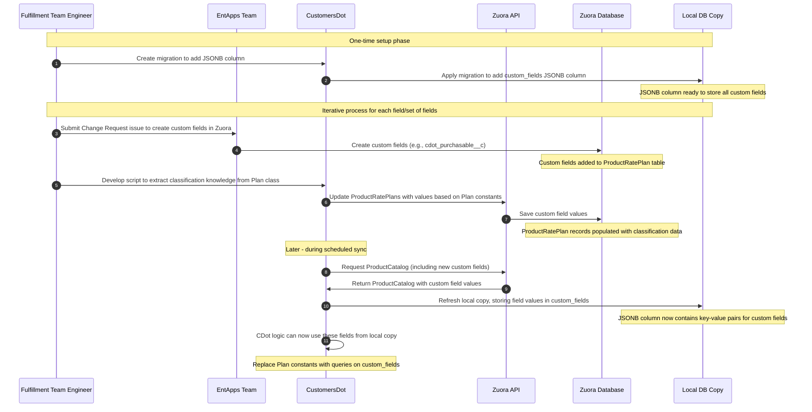
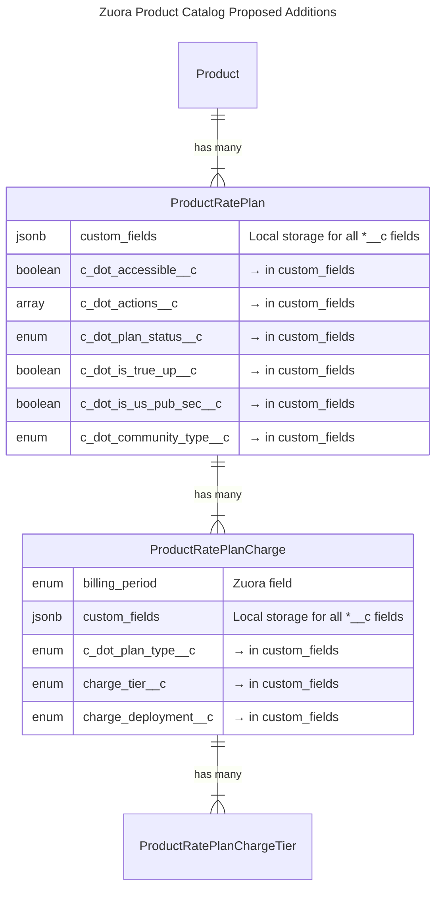

<div class="my-3 border-l-4 border-blue-500 bg-blue-50 px-4 py-3 rounded-r text-sm text-blue-800">
このページには今後予定されている製品・機能・機能性に関する情報が含まれています。ここに示す情報は参考目的のみです。購入・計画の決定にこの情報を使用しないでください。製品・機能・機能性の開発、リリース、タイミングは変更または延期される可能性があり、GitLab Inc. の独自の判断に委ねられています。
</div>

<div class="overflow-x-auto my-4">
<table class="w-full text-sm border-collapse">
<thead>
<tr class="bg-gray-100 text-left">
<th class="px-3 py-2 border border-gray-300">Status</th>
<th class="px-3 py-2 border border-gray-300">Authors</th>
<th class="px-3 py-2 border border-gray-300">Coach</th>
<th class="px-3 py-2 border border-gray-300">DRIs</th>
<th class="px-3 py-2 border border-gray-300">Owning Stage</th>
<th class="px-3 py-2 border border-gray-300">Created</th>
</tr>
</thead>
<tbody>
<tr>
<td class="px-3 py-2 border border-gray-300"><span class="inline-block rounded px-2 py-0.5 text-xs font-medium bg-gray-100 text-gray-700">proposed</span></td>
<td class="px-3 py-2 border border-gray-300"><a href="https://gitlab.com/vshumilo" class="text-blue-600 hover:underline">@vshumilo</a></td>
<td class="px-3 py-2 border border-gray-300"><a href="https://gitlab.com/vitallium" class="text-blue-600 hover:underline">@vitallium</a></td>
<td class="px-3 py-2 border border-gray-300"><a href="https://gitlab.com/tgolubeva" class="text-blue-600 hover:underline">@tgolubeva</a>, <a href="https://gitlab.com/jameslopez" class="text-blue-600 hover:underline">@jameslopez</a></td>
<td class="px-3 py-2 border border-gray-300"><span class="inline-block rounded px-2 py-0.5 text-xs font-medium bg-gray-100 text-gray-700">~devops::fulfillment</span></td>
<td class="px-3 py-2 border border-gray-300">2024-02-07</td>
</tr>
</tbody>
</table>
</div>


## サマリー

[GitLab Customers Portal](https://customers.gitlab.com/) は GitLab 製品とは独立したアプリケーションであり、GitLab のお客様がアカウント・サブスクリプションを管理し、更新や追加シートの購入といった作業を行えるようにすることを目的としています。Customers Portal の詳細については [GitLab ドキュメント](https://docs.gitlab.com/ee/subscriptions/customers_portal.html) を参照してください。社内では、このアプリケーションは [CustomersDot](https://gitlab.com/gitlab-org/customers-gitlab-com)（CDot とも呼ばれます）として知られています。

GitLab は [Zuora のプラットフォーム](../../../../business-technology/enterprise-applications/guides/zuora/) を、すべての製品関連情報の SSoT として使用しています。[Zuora Product Catalog](https://knowledgecenter.zuora.com/Get_Started/Zuora_quick_start_tutorials/B_Billing/A_The_Zuora_Product_Catalog) は、GitLab が販売可能な、または販売した収益を生む製品・サービスの完全なリストを表しており、CustomersDot の意思決定に欠かせない中核的な情報源です。CustomersDot は現在、Zuora Product Catalog のローカルコピーを保持しており、スケジュールジョブによって毎日更新しています。しかし、Zuora Product Catalog に新しい Product、Product Rate Plan、Product Rate Plan Charge が追加・更新されるたびに、CustomersDot で利用可能にするための追加の手作業が必要になります。

CustomersDot は `Plan` をラッパークラスとして使用しており、Product Catalog 内の Plan に関するすべての詳細情報に簡単にアクセスできるようにしています。Plan の名前、価格、最低数量、その他の詳細は `Zuora::ProductRatePlan`、`Zuora::ProductRatePlanCharge`、`Zuora::ProductRatePlanChargeTier` の各オブジェクトに分散しており、従来のアクセス方法では煩雑になります。このクラスは、これらすべての詳細を都度クエリする手間を省いてくれるため非常に便利です。さらに、このクラスはアプリ全体で使われる tier、デプロイメントタイプ、その他の基準に基づいて `Zuora::ProductRatePlan` を分類するのにも役立っています。

この設計ドキュメントの主な目的は、CustomersDot 内の `Plan` モデルのアーキテクチャと保守性を改善することです。Zuora で Product Catalog が更新されたとき、アプリの再起動、コード変更、または手動の介入を必要とせずに、CustomersDot に自動的に反映されるようにすべきです。

## 動機

新しい Product/SKU が Zuora Product Catalog に追加されるたびに、毎日更新されるローカルコピーがあるにもかかわらず、CustomersDot で利用可能にするにはコード変更が必要です。これは、現在の `Plan` クラスが採用している分類戦略によるもので、`Zuora::ProductRatePlan` の ID を定数に割り当て、それから Ultimate tier のすべてのプランや、GitLab.com 向けに self-procurement で利用可能なすべてのアドオンといった異なるカテゴリを表すために手作業で ID のグループを作成しています。これらのカテゴリは、実行時の意思決定に使用されています。

コードベースと製品数が増えるにつれて、この手作業の介入はコストが増していきます。

### ゴール

CustomersDot におけるプラン管理を自動化し、Zuora での基本的な Product Catalog 更新（例: 新しい Product/SKU の追加、RatePlanCharge の更新、Product の廃止など）に対して手動介入が不要になるようにします。これを実現するためには、CustomersDot 内で静的に Product Rate Plan ID を定義することから脱却し、分類の知識を Zuora Product Catalog に移行（カスタムフィールドの形で CustomersDot メタデータを追加）して、これらの集合を動的に解決できるようにする必要があります。

### 意思決定

1. [ADR-001 分類メタデータのストレージに JSONB を使用する](decisions/001_jsonb_for_classification_metadata.md)

## 提案

CustomersDot の分類知識を Zuora Product Catalog に移し、Product Catalog のローカルコピーを動的にクエリすることで `ProductRatePlan` を解決します。この移行は、`ProductRatePlan` ID を参照しているすべてのプラン定数が置き換え・削除されるまで、以下に示すフローに沿ってイテレーションで進められます。



### 新しいカスタムフィールド



| フィールド名 | レベル | 新規フィールドか？ | データ型 | 値 | 説明 |
|------------|-------|------------|-----------|--------|-------------|
| **CDotAccessible__c** | `ProductRatePlan` | はい | Boolean | `true`, `false` | プランが CustomersDot 内でアクセス可能かどうかを示します。`true` のプランは購入元に関わらずユーザーに表示され、詳細を閲覧できます。`false` のプランは Zuora には存在しますが、CustomersDot からは完全に不可視となります。 |
| **CDotActions__c** | `ProductRatePlan` | はい | Multiselect | `initial_purchase`, `additional_purchase`, `renew` | このプランで CustomersDot 内で利用できるアクションを指定します。複数選択可能です:<br>• `initial_purchase`: Customers Portal 経由でセールスの介在なしにセルフサービスで購入できます。<br>• `additional_purchase`: Customers Portal 経由でセルフサービスでこのプランの追加数量を購入できます。<br>• `renew`: Customers Portal 経由でセルフサービスでこのプランのサブスクリプションを更新できます。<br>• 何も選択されていない状態も有効であり、Customers Portal 上でこれらのアクションが利用できないことを意味します。 |
| **CDotPlanStatus__c** | `ProductRatePlan` | はい | String | `active`, `eoa_deprecated`, `tier_deprecated`, `not_applicable` | プランのライフサイクル段階を表します:<br>• `active`: 現在販売可能で完全にサポート/利用可能なプラン<br>• `eoa_deprecated`: EoA オファリングにおける既存サブスクリプションのためにのみ維持されている過去のプラン<br>• `tier_deprecated`: Tier 改名後の既存サブスクリプションのためにのみ維持されている過去のプラン<br>• `not_applicable`: ステータスの概念が当てはまらない特殊ケース |
| **CDotIsTrueUp__c** | `ProductRatePlan` | はい | Boolean | `true`, `false` | true-up プラン（当初購入分を超えた使用量を調整するために用いる特殊な Product Rate Plan）を識別します。 |
| **CDotMarketSegment__c** | `ProductRatePlan` | はい | String | `us_pubsec`, `us_govt`, `not_applicable` | 特定の市場セグメント向けに作成されたプランを識別します。 |
| **CDotCommunityType__c** | `ProductRatePlan` | はい | String | `education`, `open_source`, `startup`, `education_with_support`, `open_source_with_support`, `startup_with_support`, `education_enterprise`, `not_applicable` | 特定のコミュニティ向けの特別価格プログラムを識別します:<br>• `education`: 教育機関<br>• `open_source`: オープンソースプロジェクト<br>• `startup`: スタートアップ企業<br>• `education_with_support`, `open_source_with_support`, `startup_with_support`: サポートとバンドルされたプログラム<br>• `education_enterprise`: 企業向けの教育向け定額料金<br>• `not_applicable`: 標準的な商用プラン |
| **CDotPlanType__c** | `ProductRatePlanCharge` | はい | String | `ci_minutes`, `storage`, `duo_pro`, `duo_enterprise`, `duo_amazon_q`, `duo_self_hosted`, `agile_planning`, `product_analytics`, `professional_services`, `ecosystem`, `gitlab_credits`, `base_product`, `not_applicable` | チャージを提供するサービスごとに分類します:<br>• `ci_minutes`: 追加の CI/CD パイプライン時間<br>• `storage`: 追加のリポジトリストレージ<br>• `duo_pro`: GitLab Duo Pro AI 機能<br>• `duo_enterprise`: GitLab Duo Enterprise AI 機能<br>• `duo_amazon_q`: Amazon Q 連携<br>• `duo_self_hosted`: Duo Pro のセルフホスト機能<br>• `agile_planning`: Enterprise Agile Planning 機能<br>• `product_analytics`: プロダクトアナリティクス機能<br>• `professional_services`: トレーニング、コンサルティング、導入支援サービス<br>• `gitlab_credits`: 使用量ベース課金機能<br>• `base_product`: 単独チャージ（例: Ultimate や Premium）<br>• `ecosystem`: GitLab Ecosystem オファリングの割引チャージ<br>• `not_applicable`: 上記いずれにも該当しない |
| **BillingPeriod** | `ProductRatePlanCharge` | いいえ | String | `monthly`, `annual`, `two_year`, `three_year`, `four_year`, `five_year`（または `1`, `12`, `24`, `36`, `48`, `60`） | プランの請求サイクルの期間を定義します。名前付きの期間か、月数のいずれかを使用できます。 |
| **ChargeTier__c** | `ProductRatePlanCharge` | いいえ | String | `Ultimate`, `Premium`, `Bronze`, `Legacy`, `Starter`, `Not Applicable`, `null` | プランの機能 tier を表し、tier ごとに段階的により多くの機能を提供します:<br>• `ultimate`: 最も包括的な機能セット<br>• `premium`: 高度な機能<br>• `bronze`/`silver`/`gold`: レガシーな tier 名<br>• `starter`: エントリーレベルの有償 tier<br>• `free`: 機能制限のある無料 tier |
| **ChargeDeployment__c** | `ProductRatePlanCharge` | いいえ | String | `Self-Managed`, `Dedicated`, `GitLab.com`, `Not Applicable`, `null` | GitLab インスタンスがどのようにデプロイ・管理されるかを示します:<br>• `Self-Managed`: お客様が自身のインフラに GitLab をインストール・管理する<br>• `Dedicated`: GitLab が管理するシングルテナントインスタンス<br>• `GitLab.com`: gitlab.com 上のマルチテナント SaaS オファリング |

## 追加の検討事項

- フィールド名は Zuora のカスタムフィールド命名規則に従い、`__c` のサフィックスを付けます
- CDot のために特別に追加された新規フィールドには `CDot` のプレフィックスを付けます

## 設計と実装の詳細

私たちの分類は `ProductRatePlan`、`ProductRatePlanCharge` のレベルにあります。最初のステップとして、`ProductRatePlan` および `ProductRatePlanCharge` のローカルコピーに、この分類を永続化するための JSONB カラムを追加します。

```ruby
# example migration
class AddCustomFieldsToProductRatePlans < ActiveRecord::Migration[7.1]
  def change
    add_column :zuora_product_rate_plans, :custom_fields, :jsonb, default: {}, null: false,
      comment: column_comment
    add_index :zuora_product_rate_plans, :custom_fields, using: :gin
  end

  private

  def column_comment
    {
      owner: 'section::fulfillment',
      data_classification: 'orange',
      description: 'Stores plan classification metadata as key-value pairs.'
    }.to_json
  end
end

class AddCustomFieldsToProductRatePlanCharges < ActiveRecord::Migration[7.1]
  def change
    add_column :zuora_product_rate_plan_charges, :custom_fields, :jsonb, default: {}, null: false,
      comment: column_comment
    add_index :zuora_product_rate_plan_charges, :custom_fields, using: :gin
  end

  private

  def column_comment
    {
      owner: 'section::fulfillment',
      data_classification: 'orange',
      description: 'Stores plan charge classification metadata as key-value pairs.'
    }.to_json
  end
end
```

### イテレーション計画

提案されたカスタムフィールドを 1 フィールド / 1 セットずつ取り上げ、以下を繰り返します:

1. EntApps に Change Request を提出し、Zuora に必要なフィールドを追加してもらいます。
2. CustomersDot の知識を Zuora Product Catalog に移し、新しいフィールドに値を投入し、ロールアウト中も同期を保ちます。
3. Product Catalog のコピーが正しく同期されたことを確認します（同期を手動でトリガーするか、毎日のスケジュール同期を待ちます）。
4. [フィーチャーフラグの裏で] 与えられた分類を満たすレコード集合を表す `Plan` 定数の利用箇所を、カスタムフィールドを利用して Product Catalog のローカルコピーから同じ集合を読み込むメソッドの呼び出しに置き換えます。
5. ステージング環境でロジックとパフォーマンスの両方を検証します。
6. 変更を本番にデプロイし、すべてのユーザーに対して有効化します。

以下のコード例は、上記イテレーションプロセスのステップ 4 を示しています。`Plan` クラス内のハードコードされた定数を、ローカルの Product Catalog コピーのカスタムフィールドを利用する動的なメソッドに置き換える方法を示しています。この例では特に、SaaS プラン用のハードコードされた定数を `cdot_actions__c` および `charge_deployment__c` フィールドに基づく動的クエリに移行する例を示しています。

```ruby
# app/models/zuora/local/product_rate_plan_charge.rb
custom_field :deployment, remote_name: :charge_deployment__c, type: :string

scope :gitlab_com, -> { jsonb_contains(deployment: 'GitLab.com') }

# app/models/zuora/local/product_rate_plan.rb
custom_field :actions, remote_name: :c_dot_actions__c, type: :zuora_multiselect_selection

scope :cdot_purchasable, -> { jsonb_contains(actions: 'initial_purchase') }
scope :gitlab_com, lambda {
        joins(:product_rate_plan_charges)
        .merge(Zuora::Local::ProductRatePlanCharge.gitlab_com)
        .distinct
      }

# lib/plan_classifier.rb
module PlanClassifier
  def self.all_gitlab_com_plans
    Zuora::Local::ProductRatePlan.gitlab_com.pluck(:zuora_id)
  end

  def self.self_service_gitlab_com_plans
    Zuora::Local::ProductRatePlan.cdot_purchasable.gitlab_com.pluck(:zuora_id)
  end
end

# In app/models/plan.rb
class Plan
  # before
  def self.self_service_gitlab_com_plans
    @@self_service_gitlab_com_plans ||= ALL_SELF_SERVICE_SAAS_PLANS
  end

  # after
  def self.self_service_gitlab_com_plans
    PlanClassifier.self_service_gitlab_com_plans
  end

  # before
  def self.all_gitlab_com_plans
    @@all_gitlab_com_plans ||= [
      BASIC_SAAS_1_YEAR_PLAN,
      PREMIUM_SAAS_PLANS,
      ULTIMATE_SAAS_PLANS,
      GITLAB_COM_BRONZE_PLANS,
      DEPRECATED_SILVER_SAAS_PLANS,
      DEPRECATED_GOLD_SAAS_PLANS,
      ALL_GITLAB_COM_EDU_OSS_PLANS,
      TRIAL_SAAS_PLANS
    ].flatten.compact
  end

  # after
  def self.all_gitlab_com_plans
    PlanClassifier.all_gitlab_com_plans
  end
```

最初のイテレーションとして、True up 関連のロジックは provision への影響がないため、これを置き換えることができます。

### 検証戦略

1. **データの整合性**: rake タスクを使用して、両アプローチの分類結果を比較する
2. **パフォーマンス**: 両アプローチでクエリのベンチマークを取る
3. **網羅性**: 既存のすべてのユースケースがメタデータベースのアプローチでカバーされることを確認する

### ロールバック計画

各フィーチャーフラグはロールバック機構を内包しています。問題が検出された場合:

1. フィーチャーフラグを無効化する
2. 定数ベースのアプローチに戻す
3. 問題を解決のためにドキュメント化する
4. 修正後に再度有効化する

## 実装タイムライン

1. **Phase 1**（FY2026Q1）:
   1. JSONB カラムと基本的な分類フィールドを実装する
   2. EntApps への Change Request を作成し、Zuora の ProductRatePlan にカスタムフィールドを追加する
   3. CustomersDot の同期メカニズムを更新し、メタデータを動的に同期できるようにする
   4. `Plan` 定数が `Plan` クラス内でのみ使用されるようにコードベースをリファクタリングし、外部からの利用はメソッド経由とする。これにより、メタデータが利用可能になった時点で各メソッドのアプローチを置き換えられるようにする。
   5. プラン関連の操作についてのベースラインメトリクスを確立する

2. **Phase 2**（FY2026Q2）優先度の高い定数から順番にイテレーション:
   1. CustomersDot の知識を、前回のイテレーションで追加したカスタムフィールドに rake タスクで投入することで移行する
   2. メタデータクエリが定数ベースのアプローチと同一の結果を返すことを検証する
   3. 定数をメタデータクエリで置き換える
   4. 実装後にパフォーマンスメトリクスを比較する
   5. ドキュメントを更新し、デモを録画し、ナレッジ共有セッションを実施する（特に最初のイテレーション後は、`Plan` への新規追加が同じやり方に従えるようにする）
   6. ロールアウト

_優先度基準: 「優先度の高い」定数は使用頻度に基づいて決定します。_

## リスクの軽減

| リスク | 軽減策 |
|------|------------|
| Zuora 上のカスタムフィールド投入が不完全である | 同期プロセスにバリデーションチェックを実装する |
| JSONB クエリのパフォーマンスへの影響 | モニタリングとベンチマークを追加する。よくあるクエリパターンに対するインデックスを作成する |
| 旧来の分類と新しい分類の差異 | 分類を比較する整合性レポートを作成する |
| メタデータでカバーされないエッジケース | 特殊ケースを扱うためのプロセスをドキュメント化する |
