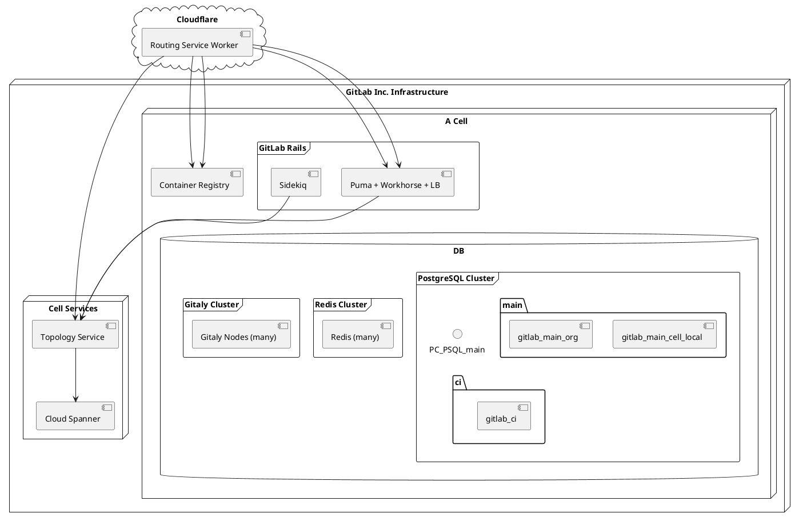



このドキュメントは作業中であり、Cells の設計のごく初期の状態を表しています。重要な部分の多くがまだ文書化されていませんが、今後追記していく予定です。

Cells は、私たちの SaaS プラットフォームのための新しいアーキテクチャです。このアーキテクチャは水平方向にスケール可能で、レジリエントであり、より一貫したユーザー体験を提供します。将来的には、データレジデンシー制御（リージョン）やフェデレーション機能などの追加機能も提供する可能性があります。

## ゴール

[Goals, Glossary and Requirements](goals.md) を参照してください。

## Cells のイテレーション

- （保留中）[Cells 1.0](iterations/cells-1.0.md) のターゲットは、SaaS GitLab.com オファリングを利用する社内のお客様向けのソリューションを提供し、Cells の基礎的な作業を行うことです。
- （保留中）[Cells 1.5](iterations/cells-1.5.md) のターゲットは、Cells 1.0 アーキテクチャの上に構築された、SaaS GitLab.com オファリングを利用する既存および新規のエンタープライズ顧客向けのマイグレーションソリューションを提供することです。
- （保留中）[Cells 2.0](iterations/cells-2.0.md) のターゲットは、cellular アーキテクチャにおけるパブリックおよびオープンソースのコントリビューションモデルをサポートすることです。
- [Protocells](https://gitlab.com/groups/gitlab-com/gl-infra/-/epics/1616)
  は Cells 1.0、Cells 1.5、Cells 2.0 を置き換え、データベースの負荷を恒久的に削減することに新たな焦点を置いたものです。

### アーキテクチャ概要

## 技術的な提案

Cells アーキテクチャは、データ処理、ロケーション、スケーラビリティ、そして GitLab アーキテクチャ全体に長期的な影響を与えます。
このセクションでは、評価対象となっているさまざまな技術提案へのリンクをまとめます。

- Cells Services:
  - [HTTP Routing Service](http_routing_service.md)
  - [Topology Service](topology_service.md)
    - [Topology Service Transactional Behavior](topology_service_transactional_behavior.md)
  - [Mutual authentication between Cell services](mutual_authentication_between_cell_services.md)
  - [Routable Tokens](routable_tokens.md)
  - [Container Registry Routing Service](container_registry_routing_service.md)
  - [SSH Routing Service](ssh_routing_service.md)
  - 計画中: Indexing Service
- [Cells: Infrastructure](./infrastructure/_index.md)
- [Feature Flags](./infrastructure/feature_flags.md) - ([Previous iteration](feature_flags.md))
- [Settings Synchronization](./proposal-admin_area_setting_sychronization_in_cells.md)
- [Organization migration](../organization-data-migration/_index.md)

## 影響を受ける機能

Cells アーキテクチャは多くの機能に影響を与え、その中には書き直しや大幅な変更を必要とするものもあります。
影響を受ける既知の機能と、暫定的な解決案のリストを以下に示します。

- [Cells: Admin Area](impacted_features/admin-area.md)
- [Cells: Advanced search](impacted_features/advanced-search.md)
- [Cells: Backups](impacted_features/backups.md)
- [Cells: CI/CD Catalog](impacted_features/ci-cd-catalog.md)
- [Cells: CI Runners](impacted_features/ci-runners.md)
- [Cells: Container Registry](impacted_features/container-registry.md)
- [Cells: Dependency Proxy](impacted_features/dependency-proxy.md)
- [Cells: Contributions: Forks](impacted_features/contributions-forks.md)
- [Cells: Data Migration](impacted_features/data-migration.md)
- [Cells: Explore](impacted_features/explore.md)
- [Cells: Git Access](impacted_features/git-access.md)
- [Cells: Global Search](impacted_features/global-search.md)
- [Cells: GraphQL](impacted_features/graphql.md)
- [Cells: Organizations](impacted_features/organizations.md)
- [Cells: Personal Access Tokens](impacted_features/personal-access-tokens.md)
- [Cells: Personal Namespaces](impacted_features/personal-namespaces.md)
- [Cells: Secrets & Credentials](impacted_features/secrets.md)
- [Cells: Snippets](impacted_features/snippets.md)
- [Cells: Term Agreements](impacted_features/term-agreements.md)
- [Cells: User Profile](impacted_features/user-profile.md)
- [Cells: Your Work](impacted_features/your-work.md)

### 影響を受ける機能: プレースホルダー

以下の影響を受ける機能のリストは、Cells の影響を見積もり、ソリューション提案を作成するための作業がまだ必要なプレースホルダーにすぎません。

- [Cells: Agent for Kubernetes](impacted_features/agent-for-kubernetes.md)
- [Cells: Data pipeline ingestion](impacted_features/data-pipeline-ingestion.md)
- [Cells: GitLab Pages](impacted_features/gitlab-pages.md)
- [Cells: Group Transfer](impacted_features/group-transfer.md)
- [Cells: Issues](impacted_features/issues.md)
- [Cells: Merge Requests](impacted_features/merge-requests.md)
- [Cells: Project Transfer](impacted_features/project-transfer.md)
- [Cells: Router Endpoints Classification](impacted_features/router-endpoints-classification.md)
- [Cells: Schema changes (Postgres and Elasticsearch migrations)](impacted_features/schema-changes.md)
- [Cells: Uploads](impacted_features/uploads.md)
- ...

## よくある質問

### Cells アーキテクチャと GitLab Dedicated の違いは何ですか？

Cells と Dedicated の個別の考えと違いについては、[こちら](infrastructure/diff-between-dedicated.md) にまとめています。

新しい Cells アーキテクチャは、GitLab.com をスケールするためのものです。
そのために、Organization を Cells に移すという方法を取りますが、異なる Organization は引き続きサーバーリソースを共有することができます（アプリケーション側で他の Organization からの分離を提供する形です）。
それでも、すべては既存の GitLab SaaS ドメイン名 `gitlab.com` の下で動作します。
また、Cells は引き続き、`users` などの一部の共通データや、Group・Project のルーティング情報を共有します。
たとえば、別々の Organization に属していて、それらが別の Cell に存在していたとしても、2 人のユーザーが同じユーザー名を持つことはできません。

上記の違いがあるため、[GitLab Dedicated](https://about.gitlab.com/dedicated/) は、お客様ごとに専用のサーバーリソースで provision されるという理由から、依然として高いコストで提供されています。一方、Cells は共有リソースを使用します。
このため、GitLab Dedicated は大規模顧客により適しており、GitLab Cells は GitLab.com で利用を始める中小規模の企業により適しています。

一方、GitLab Dedicated は、任意の Organization に対して完全に分離された GitLab インスタンスを提供することを目的としています。
このインスタンスは独自のカスタムドメイン名で動作しており、GitLab SaaS を含む他のすべての GitLab インスタンスから完全に分離されています。
たとえば、GitLab Dedicated 上のユーザーは、GitLab.com で既に取られているユーザー名と異なるユニークなユーザー名を持つ必要はありません。

### 異なる Cells は互いに通信できますか？

直接はできません。私たちのゴールは、Cells を分離した状態に保ち、グローバルサービスを通じてのみ通信することです。

### Cells はどのように provision されますか？

Cells の GitLab.com クラスタは、`GitLab Instances` の provisioning に [GitLab Dedicated](https://gitlab-com.gitlab.io/gl-infra/gitlab-dedicated/team/) のツーリングを使用しています。
そのため、いくつかのプロジェクトでは Cells は Tenant と呼ばれることがあります。
Cell インスタンスが provision されると、GitLab.com クラスタに参加して Cell となります。
1 つの要件として、そのインスタンスに事前のデータが含まれていないことが挙げられます。これは、Cells が [Topology Service](topology_service.md) から取得するカスタムのプライマリキー範囲でデータを保存するためです。

Cells は [the tissue](https://ops.gitlab.net/gitlab-com/gl-infra/cells/tissue/-/tree/main/rings?ref_type=heads)
プロジェクトで管理されており、`dev` および `prod` の両環境のすべての Cells を `rings` ディレクトリで管理しています。

各 Cells の構成は、GitLab Dedicated のテナントでも既に使用されている [tenant-model-schema](https://gitlab.com/gitlab-com/gl-infra/gitlab-dedicated/tenant-model-schema)
に対して検証されます。

#### デプロイメントプロセス

デプロイメントワークフローは以下の手順に従います:

1. [The instrumentor](https://gitlab.com/gitlab-com/gl-infra/gitlab-dedicated/instrumentor) が Cell の構成（`Dedicated Tooling` では `TENANT_MODEL` として知られています）を取得します。
2. Instrumentor が `TENANT_MODEL` をパースし、必要な構成を [GET (GitLab Environment Toolkit)](https://gitlab.com/gitlab-org/gitlab-environment-toolkit/) に渡します。
3. GET がインフラをデプロイし、provision された Kubernetes Cluster に GitLab をインストールするために [`Helm Installation`](https://docs.gitlab.com/install/install_methods/#helm-chart) を使用します。

このアプローチは、ステージングおよび本番環境において [Kubernetes workloads](https://gitlab.com/gitlab-com/gl-infra/k8s-workloads/gitlab-com) を経由して既存のレガシー Cell インフラに GitLab をデプロイする方法と整合しています。

> [!note]
> これは高レベルの概要です。より詳細については、[Dedicated Architecture Documentation](https://gitlab-com.gitlab.io/gl-infra/gitlab-dedicated/team/architecture/Architecture.html) を参照してください。

共有リソースに到達するため、Cells は [Private Service Connect](https://cloud.google.com/vpc/docs/private-service-connect) を使用します。

[design discussion](https://gitlab.com/gitlab-org/gitlab/-/issues/396641) も参照してください。

### Cells のトポロジーとは何ですか？

[design discussion](https://gitlab.com/gitlab-org/gitlab/-/issues/396641) を参照してください。

### Organization のユーザーは、どのように正しい Cell にルーティングされるのですか？

TBD

### ユーザーは Cells と Organization に対してどのように認証しますか？

[design discussion](https://gitlab.com/gitlab-org/gitlab/-/issues/395736) を参照してください。

### Cells はどのようにリバランスされますか？

TBD

### Cells はディザスタリカバリー機能をどのように実装できますか？

TBD

### 機能を Cells と互換性のあるものにするにはどう適応すればよいですか？

[draft checklist](https://gitlab.com/gitlab-org/architecture/readiness/-/issues/57#note_2743953306) を参照してください。

より包括的なガイドは、この [merge request](https://gitlab.com/gitlab-com/content-sites/handbook/-/merge_requests/14596) でも公開されています。

ご質問は `#f_protocells` か、Protocells Office Hours セッションにご連絡ください。

### 機能を cell-local にすべきか、cluster-wide にすべきかをどう判断しますか？

デフォルトでは、機能は Organization レベルにスコープされる必要があります。このルールから逸脱する場合は、Tenant Scale による検証と承認が必要です。

Cells アーキテクチャの設計目標では、[すべての Cells は単一のドメイン下にある](goals.md#all-cells-are-under-a-single-gitlabcom-domain) ため、Cells はユーザーから不可視である必要があります:

- Cell-local な機能は、Cell の管理に関係するものに限定されるべきであり、Cell のセマンティクスを顧客に公開するような機能であってはなりません。
- Cells アーキテクチャは、データのマイグレーション時にユーザーに影響を与えずに、Cell 間で Organization と顧客データの分散を自由に制御したいと考えています。

Cluster-wide な機能は強く推奨されません。理由は次のとおりです:

- 大量のデータを cluster-wide に保存する必要が出てくる可能性があり、[scalability headroom](goals.md#provides-100x-headroom) を減らしてしまいます。
- 自明でない [data aggregation](goals.md#aggregation-of-cluster-wide-data) の実装が必要になる可能性があり、[single node failure](goals.md#high-resilience-to-a-single-cell-failure) に対するレジリエンスが低下します。
- [mixed deployments](goals.md#cells-running-in-mixed-deployments) で動作させる必要があるため、構築がより難しくなります。Cluster-wide な機能はこのことを考慮する必要があります。
- [GitLab.com 上での on-premise ライクな体験](goals.md#on-premise-like-experience) を提供する能力に影響する可能性があります。
- cluster-wide だと考えられている機能の一部は、信頼された intra-cluster 通信を同じユーザー ID で使った aggregation 技術によって、より良く実装できる可能性があります。
  たとえば、ユーザーの Profile はクラスタ全体で共有されています。
- Cells アーキテクチャは、何が cluster-wide なサービスとみなせるかを制限しています。
  最初は cluster-wide であるサービスでも、完全なサービス分離を達成するため、将来的には分割されることが想定されています。
  どの機能も、そのようなサービス（例: Elasticsearch）に依存して構築されるべきではありません。

### Cells は最大 1000 RPS または 50,000 ユーザー向けのリファレンスアーキテクチャを使用しますか？

[reference architecture for up to 1000 RPS or 50,000 users](https://docs.gitlab.com/ee/administration/reference_architectures/50k_users.html) を参照してください。

インフラチームは、負荷に応じて Cells を適切にサイジングします。
Tenant Scale チームは、Cells のデプロイメントの基盤として GitLab Dedicated を使用する機会を見出しています。

## 意思決定ログ

- [ADR-001: Routing Technology using Cloudflare Workers](decisions/001_routing_technology.md)
- [ADR-002: One GCP Project per Cell](decisions/002_gcp_project_boundary.md)
- [ADR-003: One GKE Cluster per Cell](decisions/003_num_gke_clusters_per_cell.md)
- [ADR-004: One VPC per Cell, with Private Service Connect for internal communication between Cells](decisions/004_vpc_subnet_design.md)
- [ADR-005: Cells use Flexible Reference Architectures](decisions/005_flexible_reference_architectures.md)
- [ADR 006: Use Geo for Disaster Recovery](decisions/006_disaster_recovery_geo.md)
- [ADR-007: Cells 1.0 for internal customers only (obsolete)](decisions/007_internal_customers.md)
- [ADR-008: Cluster wide unique database sequences](decisions/008_database_sequences.md)
- [ADR-009: Initial Cell Sizes](decisions/009_cell_initial_sizing.md)
- [ADR-010: HTTP Router uses static rules and HTTP-based caching mechanism](decisions/010_http_router_rules_and_cache.md)
- [ADR-011: Cell Specific Configuration](decisions/011_cell_specific_configuration.md)
- [ADR-012: Cell Unique Identifier](decisions/012_cell_unique_identifier.md)
- [ADR 013: Use the same Cell ID for restoring a Cell from backup](decisions/013_cell_restore_from_backup.md)
- [ADR 014: No clusterwide syncing for Protocells](decisions/014_clusterwide_syncing_in_cells_1_0.md)
- [ADR 015: Cloud Spanner Region Configuration for Topology Service](decisions/015_spanner_multiregional.md)
- [ADR 016: Cross Cloud Dependencies](decisions/016_cross_cloud_dependecies.md)
- [ADR 017: Container Registry Routing Service](decisions/017_container_registry.md)
- [ADR 018: Topology Service Transactional Behavior](decisions/018_topology_service_transactional_behavior.md)
- [ADR 019: AWS Primary Region for Cell Services](decisions/019_aws_primary_region_selection_for_cells.md)
- [ADR 020: Cloud spanner backup strategy selection for Topology Service](decisions/020_spanner_backup_strategy.md)
- [ADR 021: Topology Service Claims In Database Transactions](decisions/021_claims_in_database_transaction.md)
- [ADR 022: Ring definition for Protocells](decisions/022_ring_definition_for_protocells.md)
- [ADR 023: Database Configuration for Cells](decisions/023_database_configuration.md)
- [ADR-024: Use Backup and Restore for Disaster Recovery](decisions/024_disaster_recovery_cells.md)
- [ADR 025: Separate Cloudflare Worker for /api/v4/jobs/request endpoint](decisions/025_separate_worker_for_jobs_request_endpoint.md)
- [ADR 026: Using Hono for HTTP Router Path-Based Routing](decisions/026_hono_for_http_router.md)
- [ADR 027: Cross-Cloud Dependency Allow-List](decisions/027_cross_cloud_dependency_allow_list.md)

## リンク

- [Internal Pods presentation](https://docs.google.com/presentation/d/1x1uIiN8FR9fhL7pzFh9juHOVcSxEY7d2_q4uiKKGD44/edit#slide=id.ge7acbdc97a_0_155)
- [Cells Epic](https://gitlab.com/groups/gitlab-org/-/epics/7582)
- [Database group investigation](../../../data-engineering/database-excellence/database-frameworks/doc/root-namespace-sharding/)
- [Shopify Pods architecture](https://shopify.engineering/a-pods-architecture-to-allow-shopify-to-scale)
- [Opstrace architecture](https://gitlab.com/gitlab-org/opstrace/opstrace/-/blob/main/docs/architecture/overview.md)
- [Adding Diagrams to this blueprint](diagrams/_index.md)
