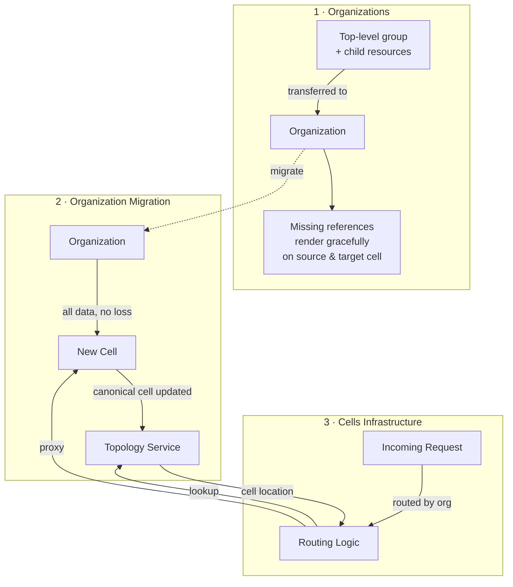
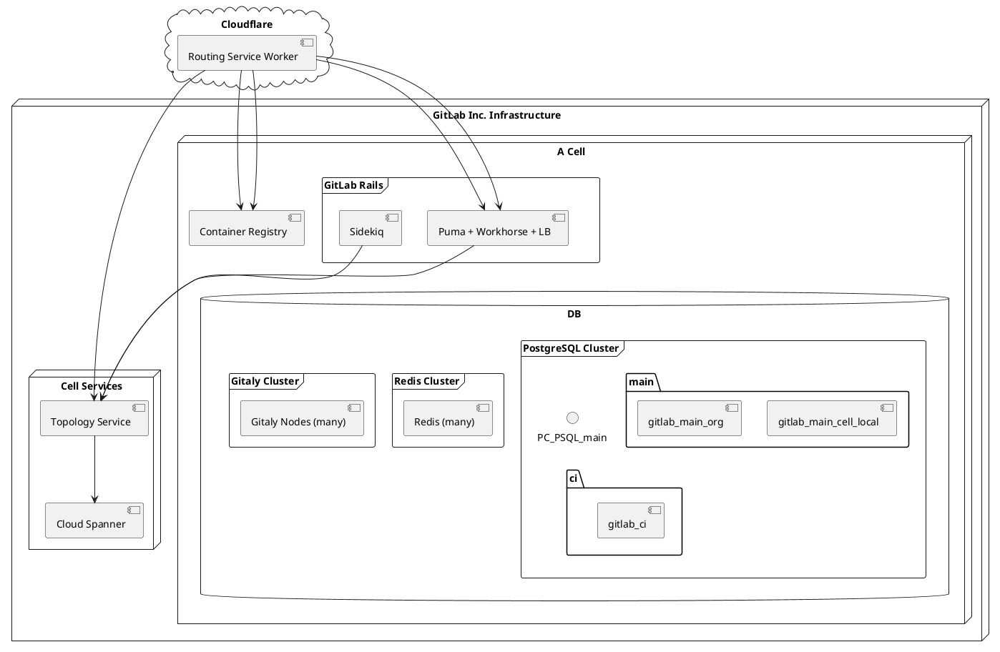



このドキュメントは作業中であり、Cells の設計のごく初期の状態を表しています。重要な部分の多くがまだ文書化されていませんが、今後追記していく予定です。

Cells は、私たちの SaaS プラットフォームのための新しいアーキテクチャです。このアーキテクチャは水平方向にスケール可能で、レジリエントであり、より一貫したユーザー体験を提供します。将来的には、データレジデンシー制御（リージョン）やフェデレーション機能などの追加機能も提供する可能性があります。

## ゴール {#goals}

[目標、用語集、要件](goals.md)を参照してください。

## Protocells {#protocells}

Protocells は Cells アーキテクチャの現在のイテレーションです。以前の Cells 1.0、
Cells 1.5、Cells 2.0 のイテレーションに代わり、レガシー Cell のデータベースの負荷を恒久的に軽減することに
新たな重点を置いています。

### 概要 {#summary}

Protocells は、水平スケーラビリティを提供することで[レガシー Cell](goals.md#legacy-cell)のデータベースの負荷を軽減します。

Organizations は論理的な境界として、Cells は物理的な境界として機能します。

この設計は、Organizations、Organization の移行、Cells インフラストラクチャという 3 つの主要コンポーネントを統合します。

進捗は[作業用エピック](https://gitlab.com/groups/gitlab-com/gl-infra/-/work_items/1616)で追跡します。

### 提案 {#proposal}

```mermaid
flowchart TD
    subgraph P1["1 · Organizations"]
        A["Top-level group\n+ child resources"] -->|"transferred to"| B["Organization"]
        B --> C["Missing references\nrender gracefully\non source & target cell"]
    end

    subgraph P2["2 · Organization Migration"]
        D["Organization"] -->|"all data, no loss"| E["New Cell"]
        E -->|"canonical cell updated"| F["Topology Service"]
    end

    subgraph P3["3 · Cells Infrastructure"]
        G["Incoming Request"] -->|"routed by org"| H["Routing Logic"]
        H -->|"lookup"| F
        F -->|"cell location"| H
        H -->|"proxy"| E
    end

    B -.->|"migrate"| D
    A ~~~ G
```

Protocells は 3 本の柱で構成されています:

| 柱 | 目的 | 結果 |
| ------ | ------- | ------ |
| 1. Organizations | [Organization の分離](../organization/isolation.md)により、Organizations を論理的な境界として導入します。 | トップレベルグループと、その子リソース（グループ、プロジェクト、ユーザーなど）を、専用の Organization に移管します。 |
| 2. Organization の移行 | [Organization のデータ移行](../organization-data-migration/_index.md)の設計ドキュメントに基づいて、Cells 間で Organizations を移動できるようにします。 | Organization のすべてのデータを、損失なく別の Cell に移動します。Topology Service でその Organization の正規の Cell を更新して切り替えます。 |
| 3. Cells インフラストラクチャ | [Cells インフラストラクチャ](./infrastructure/_index.md)の設計ドキュメントに基づいて、自己完結した複数の GitLab インスタンスを GitLab.com 上に Cells としてデプロイします。 | [ルーティングロジック](http_routing_service.md)が Organization に基づいて適切な Cell にリクエストを振り分けます。 |

各柱の詳細:

| 柱 | 詳細 |
| ------ | ------- |
| 1. Organizations | すべてのリクエストに対して Organization コンテキストの解決を確立し、データや操作が Organization の境界を越えることを防ぎます。Self-Managed と Dedicated では、[Organization の ADR](../organization/decisions/007_self_managed_dedicated_single_organization.md)に基づいて、インスタンスと Organization の 1 対 1 の対応を確立します。Organization を別の Cell に移動した際、参照先が欠けていても移動元と移動先の両方の Cell でページが引き続き表示されます。たとえば、作成者（ユーザー）が Organization と一緒に移動されなかった Issue や、移動したユーザーが別の Organization の Issue に残したコメントが該当します。 |
| 2. Organization の移行 | このツールは、レガシー Cell から新しい Cells への Organizations の移行をサポートします。水平スケーラビリティと、インフラストラクチャ全体での負荷分散を可能にします。 |
| 3. Cells インフラストラクチャ | 各 Cell は複数の Organizations をホストできます。Cells は、独自のデータベースとインフラストラクチャを持つ独立した GitLab インスタンスとして動作します。 |

この取り組みは、[データ保持](../../guidelines/data_lifecycle/data_retention.md)など、レガシー Cell のデータベースを支える他の補完的な取り組みを妨げるものではありません。

### 設計と実装の詳細 {#design-and-implementation-details}

#### 論理的な境界と物理的な境界 {#logical-vs-physical-boundaries}

このアーキテクチャでは、2 種類の境界を区別します:

**論理的な境界（Organization）**: データのシャーディング境界（例: PostgreSQL、Gitaly）とアクセス制御を定義します。

Organizations は、GitLab のすべての機能とデータを分離する単位です。

**物理的な境界（Cell）**: インフラストラクチャの分散を定義します。

Cells は、複数の Organizations をホストできる自己完結した GitLab インスタンスです。

この分離により、次のことが可能になります:

- 論理構造を変更せずに Organizations を Cells 間で移動します。
- 複数の Organizations が単一の Cell 上のインフラストラクチャを共有します。
- Organizations をまたぐ操作で公開 API を使用します。

#### Organization にスコープを限定した操作 {#organization-scoped-operations}

ほとんどの操作は、スコープを 1 つの Organization に限定すべきです。

これにより、機能が論理的な境界の内側で動作し、分離を維持します。

#### Organizations をまたぐ操作 {#cross-organization-operations}

複数の Organizations をまたぐすべての操作は、公開 API を使用しなければなりません。

これにより、次のことを確保します:

- 適切な認証と認可の境界。
- デプロイモデル間で一貫した動作。
- Organizations 間での明確な関心の分離。

Organizations をまたぐ操作の例:

- ユーザー認証とセッション管理。
- 共有リソースへの公開 API アクセス。
- GitLab.com の管理操作。

#### デプロイモデル {#deployment-models}

##### GitLab.com {#gitlabcom}

- 複数の Cells があり、それぞれが複数の Organizations をホストします。
- Organizations が分離の単位になります。
- Cells が物理的な分散の単位になります。
- デフォルトの Organization が既存ユーザー向けの後方互換性を提供します。

##### Self-Managed と Dedicated {#self-managed-and-dedicated}

- Organization ごとに単一のインスタンスを使用します（1 対 1 の対応）。
- Organizations が論理的な境界を提供します。
- インスタンスが物理的な境界を提供します。
- GitLab.com と比べて運用モデルが簡素になります。

### 機能の同等性 {#feature-parity}

お客様が既存の機能を引き続き利用できるようにするため、機能の同等性が必要です。
これらの取り組みでは、次の点に重点を置きます:

- [**Organization の機能の同等性**](https://gitlab.com/groups/gitlab-com/gl-infra/-/work_items/1871): すべてのデプロイモデルで Organizations が一貫した機能を持つようにします。
- [**Cells の機能の同等性**](https://gitlab.com/gitlab-org/architecture/readiness/-/blob/main/templates/platform_strategy/cells.md): 本番利用に必要な GitLab のすべての機能を Cells がサポートするようにします。

## アーキテクチャ概要 {#architecture-overview}

```plantuml
@startuml

cloud "Cloudflare" as CF {
  [Routing Service Worker] as CF_RSW
}

node "GitLab Inc. Infrastructure" {
  node "Cell Services" as Cell_Services {
    [Topology Service] as TS
    [Cloud Spanner] as TS_CS

    TS --> TS_CS
  }

  node "A Cell" as Cell {
    frame "GitLab Rails" as Cell_Rails {
      [Puma + Workhorse + LB] as Cell_Puma
      [Sidekiq] as Cell_Sidekiq
    }

    [Container Registry] as Cell_Registry

    database DB as Cell_DB {
      frame "PostgreSQL Cluster" as Cell_PSQL {
        package "ci" as Cell_PSQL_ci {
          [gitlab_ci] as Cell_PSQL_gitlab_ci
        }

        package "main" as Cell_PSQL_main {
          [gitlab_main_cell_local] as Cell_PSQL_gitlab_main_cell_local
          [gitlab_main_org] as Cell_PSQL_gitlab_main_org
        }

        PC_PSQL_main -[hidden]-> Cell_PSQL_ci
      }

      frame "Redis Cluster" as Cell_Redis {
        [Redis (many)] as Cell_Redis_many
      }

      frame "Gitaly Cluster" as Cell_Gitaly {
        [Gitaly Nodes (many)] as Cell_Gitaly_many
      }
    }

    Cell_Rails -[hidden]-> Cell_DB
  }

}

CF_RSW --> Cell_Puma
CF_RSW --> Cell_Registry
CF_RSW --> Cell_Puma
CF_RSW --> Cell_Registry
CF_RSW --> TS
Cell_Puma --> TS
Cell_Sidekiq --> TS

@enduml
```

## 将来のスコープ {#future-scope}

Cells 2.0 の目標は、Cell ベースのアーキテクチャで
パブリックおよびオープンソースのコントリビューションモデルをサポートすることでした。
Protocells では、当面の焦点をレガシー Cell のデータベースの負荷軽減に絞ったため、
元のスコープに含まれていた次の側面は未解決のままです。
現在の Protocells のロールアウトの一部ではなく、将来のスコープとして追跡します:

1. **Organizations 間の相互運用（「Org Connect」）**: Organization の境界を越えて公開プロジェクトに貢献するには、
   まだ存在しない相互運用機能が必要です。
   [Organizations ADR 015](../organization/decisions/015_non_isolation_is_permanent.md)では、この概念を
   「Org Connect」と名付け、実現までにはまだ「長い道のりがある」としています。
1. **ユーザーの Organizations が複数の Cells にまたがること**: ユーザーはすでに多数の
   Organizations に所属できますが、異なる Cells 上にある Organizations をシームレスに利用するには、
   まだデプロイされていない [New Auth Stack](../new_auth_stack/_index.md)（GATE）が必要です。
   これは未解決の設計上の疑問ではなく、実施順序に関する依存関係です。
1. **公開 Organizations の Cells 間での移行**: Organization を Cells 間で移行することは
   Protocells のスコープに含まれます（[Cells: データ移行](impacted_features/data-migration.md)を参照）が、
   現時点で現実的な候補となるのは非公開の Organizations だけです。
   公開 Organizations は、内部 API を介して「行き来」し、
   同一クラスタ内で到達可能であると想定する機能に依存しています。たとえば、Gitaly の
   リポジトリ間操作によるフォークなどです。
   公開 Organization を別の
   Cell に移行すると、その前提が崩れるため、公開 Organization を
   移行できるようにするには、この部分を別途作り直す必要があります。

## 技術的な提案 {#technical-proposals}

Cells アーキテクチャは、データ処理、ロケーション、スケーラビリティ、そして GitLab アーキテクチャ全体に長期的な影響を与えます。
このセクションでは、評価対象となっているさまざまな技術提案へのリンクをまとめます。

- Cells Services:
  - [HTTP Routing Service](http_routing_service.md)
  - [Topology Service](topology_service.md)
    - [Topology Service のトランザクション動作](topology_service_transactional_behavior.md)
  - [Cell サービス間の相互認証](mutual_authentication_between_cell_services.md)
  - [ルーティング可能なトークン](routable_tokens.md)
  - [Container Registry Routing Service](container_registry_routing_service.md)
  - [SSH Routing Service](ssh_routing_service.md)
  - 計画中: Indexing Service
- [Cells: インフラストラクチャ](./infrastructure/_index.md)
- [フィーチャーフラグ](./infrastructure/feature_flags.md) - ([以前のイテレーション](feature_flags.md))
- [設定の同期](./proposal-admin_area_setting_sychronization_in_cells.md)
- [Organization の移行](../organization-data-migration/_index.md)

## 影響を受ける機能 {#impacted-features}

Cells アーキテクチャは多くの機能に影響を与え、その中には書き直しや大幅な変更を必要とするものもあります。
影響を受ける既知の機能と、暫定的な解決案のリストを以下に示します。

- [Cells: 管理者エリア](impacted_features/admin-area.md)
- [Cells: 高度な検索](impacted_features/advanced-search.md)
- [Cells: バックアップ](impacted_features/backups.md)
- [Cells: CI/CD カタログ](impacted_features/ci-cd-catalog.md)
- [Cells: CI Runner](impacted_features/ci-runners.md)
- [Cells: Container Registry](impacted_features/container-registry.md)
- [Cells: Dependency Proxy](impacted_features/dependency-proxy.md)
- [Cells: コントリビューション: フォーク](impacted_features/contributions-forks.md)
- [Cells: データ移行](impacted_features/data-migration.md)
- [Cells: 探索](impacted_features/explore.md)
- [Cells: Git アクセス](impacted_features/git-access.md)
- [Cells: グローバル検索](impacted_features/global-search.md)
- [Cells: GraphQL](impacted_features/graphql.md)
- [Cells: Organization](impacted_features/organizations.md)
- [Cells: パーソナルアクセストークン](impacted_features/personal-access-tokens.md)
- [Cells: 個人の名前空間](impacted_features/personal-namespaces.md)
- [Cells: シークレットと認証情報](impacted_features/secrets.md)
- [Cells: スニペット](impacted_features/snippets.md)
- [Cells: 規約への同意](impacted_features/term-agreements.md)
- [Cells: ユーザープロフィール](impacted_features/user-profile.md)
- [Cells: 自分の作業](impacted_features/your-work.md)

### 影響を受ける機能: プレースホルダー {#impacted-features-placeholders}

以下の影響を受ける機能のリストは、Cells の影響を見積もり、ソリューション提案を作成するための作業がまだ必要なプレースホルダーにすぎません。

- [Cells: Agent for Kubernetes](impacted_features/agent-for-kubernetes.md)
- [Cells: データパイプラインの取り込み](impacted_features/data-pipeline-ingestion.md)
- [Cells: GitLab Pages](impacted_features/gitlab-pages.md)
- [Cells: グループの移管](impacted_features/group-transfer.md)
- [Cells: Issue](impacted_features/issues.md)
- [Cells: マージリクエスト](impacted_features/merge-requests.md)
- [Cells: プロジェクトの移管](impacted_features/project-transfer.md)
- [Cells: ルーターエンドポイントの分類](impacted_features/router-endpoints-classification.md)
- [Cells: スキーマ変更（Postgres と Elasticsearch のマイグレーション）](impacted_features/schema-changes.md)
- [Cells: アップロード](impacted_features/uploads.md)
- ...

## よくある質問 {#frequently-asked-questions}

### Cells アーキテクチャと GitLab Dedicated の違いは何ですか？ {#whats-the-difference-between-cells-architecture-and-gitlab-dedicated}

Cells と Dedicated の個別の考えと違いについては、[こちら](infrastructure/diff-between-dedicated.md)にまとめています。

新しい Cells アーキテクチャは、GitLab.com をスケールするためのものです。
そのために、Organization を Cells に移すという方法を取りますが、異なる Organization は引き続きサーバーリソースを共有することができます（アプリケーション側で他の Organization からの分離を提供する形です）。
それでも、すべては既存の GitLab SaaS ドメイン名 `gitlab.com` の下で動作します。
また、Cells は引き続き、`users` などの一部の共通データや、Group・Project のルーティング情報を共有します。
たとえば、別々の Organization に属していて、それらが別の Cell に存在していたとしても、2 人のユーザーが同じユーザー名を持つことはできません。

上記の違いがあるため、[GitLab Dedicated](https://about.gitlab.com/dedicated/)は、お客様ごとに専用のサーバーリソースでプロビジョニングされるという理由から、依然として高いコストで提供されています。一方、Cells は共有リソースを使用します。
このため、GitLab Dedicated は大規模顧客により適しており、GitLab Cells は GitLab.com で利用を始める中小規模の企業により適しています。

一方、GitLab Dedicated は、任意の Organization に対して完全に分離された GitLab インスタンスを提供することを目的としています。
このインスタンスは独自のカスタムドメイン名で動作しており、GitLab SaaS を含む他のすべての GitLab インスタンスから完全に分離されています。
たとえば、GitLab Dedicated 上のユーザーは、GitLab.com で既に取られているユーザー名と異なるユニークなユーザー名を持つ必要はありません。

### 異なる Cells は互いに通信できますか？ {#can-different-cells-communicate-with-each-other}

直接はできません。私たちのゴールは、Cells を分離した状態に保ち、グローバルサービスを通じてのみ通信することです。

### Cells はどのようにプロビジョニングされますか？ {#how-are-cells-provisioned}

Cells の GitLab.com クラスタは、`GitLab Instances` のプロビジョニングに [GitLab Dedicated](https://gitlab-com.gitlab.io/gl-infra/gitlab-dedicated/team/)のツーリングを使用しています。
そのため、いくつかのプロジェクトでは Cells は Tenant と呼ばれることがあります。
Cell インスタンスがプロビジョニングされると、GitLab.com クラスタに参加して Cell となります。
1 つの要件として、そのインスタンスに事前のデータが含まれていないことが挙げられます。これは、Cells が [Topology Service](topology_service.md)から取得するカスタムのプライマリキー範囲でデータを保存するためです。

Cells は [the tissue](https://ops.gitlab.net/gitlab-com/gl-infra/cells/tissue/-/tree/main/rings?ref_type=heads)
プロジェクトで管理されており、`dev` および `prod` の両環境のすべての Cells を `rings` ディレクトリで管理しています。

各 Cells の構成は、GitLab Dedicated のテナントでも既に使用されている [tenant-model-schema](https://gitlab.com/gitlab-com/gl-infra/gitlab-dedicated/tenant-model-schema)
に対して検証されます。

#### デプロイメントプロセス {#deployment-process}

デプロイメントワークフローは以下の手順に従います:

1. [Instrumentor](https://gitlab.com/gitlab-com/gl-infra/gitlab-dedicated/instrumentor)が Cell の構成（`Dedicated Tooling` では `TENANT_MODEL` として知られています）を取得します。
2. Instrumentor が `TENANT_MODEL` をパースし、必要な構成を [GET (GitLab Environment Toolkit)](https://gitlab.com/gitlab-org/gitlab-environment-toolkit/)に渡します。
3. GET がインフラをデプロイし、プロビジョニングされた Kubernetes Cluster に GitLab をインストールするために [`Helm Installation`](https://docs.gitlab.com/install/install_methods/#helm-chart)を使用します。

このアプローチは、ステージングおよび本番環境において [Kubernetes ワークロード](https://gitlab.com/gitlab-com/gl-infra/k8s-workloads/gitlab-com)を経由して既存のレガシー Cell インフラに GitLab をデプロイする方法と整合しています。

> [!note]
> これは高レベルの概要です。より詳細については、[Dedicated アーキテクチャドキュメント](https://gitlab-com.gitlab.io/gl-infra/gitlab-dedicated/team/architecture/Architecture.html)を参照してください。

共有リソースに到達するため、Cells は [Private Service Connect](https://cloud.google.com/vpc/docs/private-service-connect)を使用します。

[設計に関するディスカッション](https://gitlab.com/gitlab-org/gitlab/-/issues/396641)も参照してください。

### Cells のトポロジーとは何ですか？ {#what-is-a-cells-topology}

[設計に関するディスカッション](https://gitlab.com/gitlab-org/gitlab/-/issues/396641)を参照してください。

### Organization のユーザーは、どのように正しい Cell にルーティングされるのですか？ {#how-are-users-of-an-organization-routed-to-the-correct-cell}

未定

### `mycorp.gitlab.com` のようなサブドメインを使用しないのはなぜですか？ {#why-not-use-subdomains-like-mycorpgitlabcom}

[すべての Cells は単一の GitLab.com ドメイン下にあります](goals.md#all-cells-are-under-a-single-gitlabcom-domain)を参照してください。
その目標に加えて、サブドメインには具体的な問題がいくつかあります:

- サブドメイン間で Cookie が漏れることによるセキュリティ上の問題を防ぐため、注意が必要です。
- Organization によって URL とホストが変わるため、インテグレーションと API のやり取りが複雑になります。
- ユーザーを有効な Organization/URL にリダイレクトする共通のログインサービスを構築する必要があります。
- 名前の衝突が発生するリスクが高まり、その影響も大きくなります。たとえば、大企業内の異なる部門や
  組織、似た名前の企業などが該当します。

### ユーザーは Cells と Organization に対してどのように認証しますか？ {#how-do-users-authenticate-with-cells-and-organizations}

[設計に関するディスカッション](https://gitlab.com/gitlab-org/gitlab/-/issues/395736)を参照してください。

### ユーザーはどのようにログインしますか？ {#how-would-users-log-in}

現在の承認済みの設計については、[Organization ログイン設計ドキュメント](../organization/login.md)を参照してください。

- UI: Organization へのログインは、その Organization にスコープを限定します: `https://<GITLAB_DOMAIN>/users/sign_in?organization=gitlab-inc`。
- SAML: `https://<GITLAB_DOMAIN>/users/auth/saml/callback` が `?organization=gitlab-inc` を受け取り、正しい Cell にルーティングされます。
- これには、高可用性のソリューションで利用可能にした Organization のリストを使う動的ルーティング方式が必要です。

### Cells はどのようにリバランスされますか？ {#how-are-cells-rebalanced}

未定

### 追加の Cell 上の Organization にユーザーをどのようにオンボーディングしますか？ {#how-will-we-onboard-users-to-an-organization-on-additional-cells}

> [!note]
> この回答は以前の Cells 1.0 のイテレーションから引き継いだもので、現在の Protocells の設計に照らした検証は行われていません。確定的な回答として扱うには、Product からの意見が必要です。

Admin が以下のタスクを実行します。

1. 追加の Cell 上に Organization を作成します。
1. Organization に Owner ロールを持つ新しいユーザーを作成します。
1. Organization から Admin を削除します。機能セットによっては省略可能です。
1. 新しい Owner がこのグループのデータをインポートします。これにより、ユーザーが作成され、グループ/プロジェクトと Organization に追加されます。

### Cells はディザスタリカバリー機能をどのように実装できますか？ {#how-can-cells-implement-disaster-recovery-capabilities}

未定

### 機能を Cells と互換性のあるものにするにはどう適応すればよいですか？ {#how-can-i-adapt-a-feature-to-be-compatible-with-cells}

[チェックリストの草案](https://gitlab.com/gitlab-org/architecture/readiness/-/issues/57#note_2743953306)を参照してください。

より包括的なガイドは、この [マージリクエスト](https://gitlab.com/gitlab-com/content-sites/handbook/-/merge_requests/14596)でも公開されています。

ご質問は `#f_protocells` か、Protocells Office Hours セッションにご連絡ください。

### 機能を Cell 内に限定すべきか、クラスタ全体にすべきかをどう判断しますか？ {#how-can-i-decide-if-my-feature-can-be-cell-local-or-clusterwide-}

デフォルトでは、機能は Organization レベルにスコープされる必要があります。このルールから逸脱する場合は、Tenant Scale による検証と承認が必要です。

Cells アーキテクチャの設計目標では、[すべての Cells は単一のドメイン下にある](goals.md#all-cells-are-under-a-single-gitlabcom-domain)ため、Cells はユーザーから不可視である必要があります:

- Cell 内に限定した機能は、Cell の管理に関係するものに限定されるべきであり、Cell のセマンティクスを顧客に公開するような機能であってはなりません。
- Cells アーキテクチャは、データのマイグレーション時にユーザーに影響を与えずに、Cell 間で Organization と顧客データの分散を自由に制御したいと考えています。

クラスタ全体の機能は強く推奨されません。理由は次のとおりです:

- 大量のデータをクラスタ全体に保存する必要が出てくる可能性があり、[スケーラビリティの余力](goals.md#provides-100x-headroom)を減らしてしまいます。
- 自明でない [データ集約](goals.md#aggregation-of-cluster-wide-data)の実装が必要になる可能性があり、[単一ノードの障害](goals.md#high-resilience-to-a-single-cell-failure)に対するレジリエンスが低下します。
- [混在デプロイメント](goals.md#cells-running-in-mixed-deployments)で動作させる必要があるため、構築がより難しくなります。クラスタ全体の機能はこのことを考慮する必要があります。
- [GitLab.com 上でのオンプレミスのような体験](goals.md#on-premise-like-experience)を提供する能力に影響する可能性があります。
- クラスタ全体で提供すべきだと考えられている機能の一部は、信頼されたクラスタ内通信を同じユーザー ID で使った集約技術によって、より良く実装できる可能性があります。
  たとえば、ユーザーのプロフィールはクラスタ全体で共有されています。
- Cells アーキテクチャは、何がクラスタ全体のサービスとみなせるかを制限しています。
  最初はクラスタ全体で提供するサービスでも、完全なサービス分離を達成するため、将来的には分割されることが想定されています。
  どの機能も、そのようなサービス（例: Elasticsearch）に依存して構築されるべきではありません。

### Cells は最大 1000 RPS または 50,000 ユーザー向けのリファレンスアーキテクチャを使用しますか？ {#will-cells-use-the-reference-architecture-for-up-to-1000-rps-or-50000-users}

[最大 1000 RPS または 50,000 ユーザー向けのリファレンスアーキテクチャ](https://docs.gitlab.com/ee/administration/reference_architectures/50k_users.html)を参照してください。

インフラチームは、負荷に応じて Cells を適切にサイジングします。
Tenant Scale チームは、Cells のデプロイメントの基盤として GitLab Dedicated を使用する機会を見出しています。

## 意思決定ログ {#decision-log}

- [ADR-001: Cloudflare Workers を使用するルーティング技術](decisions/001_routing_technology.md)
- [ADR-002: Cell ごとに 1 つの GCP プロジェクト](decisions/002_gcp_project_boundary.md)
- [ADR-003: Cell ごとに 1 つの GKE クラスタ](decisions/003_num_gke_clusters_per_cell.md)
- [ADR-004: Cell ごとに 1 つの VPC を用意し、Cell 間の内部通信に Private Service Connect を使用](decisions/004_vpc_subnet_design.md)
- [ADR-005: Cells で柔軟なリファレンスアーキテクチャを使用](decisions/005_flexible_reference_architectures.md)
- [ADR 006: ディザスタリカバリーに Geo を使用](decisions/006_disaster_recovery_geo.md)
- [ADR-007: 社内顧客のみを対象とする Cells 1.0（廃止）](decisions/007_internal_customers.md)
- [ADR-008: クラスタ全体で一意なデータベースシーケンス](decisions/008_database_sequences.md)
- [ADR-009: Cell の初期サイズ](decisions/009_cell_initial_sizing.md)
- [ADR-010: HTTP Router で静的ルールと HTTP ベースのキャッシュ機構を使用](decisions/010_http_router_rules_and_cache.md)
- [ADR-011: Cell 固有の設定](decisions/011_cell_specific_configuration.md)
- [ADR-012: Cell の一意な識別子](decisions/012_cell_unique_identifier.md)
- [ADR 013: バックアップから Cell を復元する際に同じ Cell ID を使用](decisions/013_cell_restore_from_backup.md)
- [ADR 014: Protocells ではクラスタ全体の同期を行わない](decisions/014_clusterwide_syncing_in_cells_1_0.md)
- [ADR 015: Topology Service 向けの Cloud Spanner のリージョン設定](decisions/015_spanner_multiregional.md)
- [ADR 016: クラウド間の依存関係](decisions/016_cross_cloud_dependecies.md)
- [ADR 017: Container Registry Routing Service](decisions/017_container_registry.md)
- [ADR 018: Topology Service のトランザクション動作](decisions/018_topology_service_transactional_behavior.md)
- [ADR 019: Cell サービス向けの AWS プライマリリージョン](decisions/019_aws_primary_region_selection_for_cells.md)
- [ADR 020: Topology Service 向けの Cloud Spanner バックアップ戦略の選択](decisions/020_spanner_backup_strategy.md)
- [ADR 021: データベーストランザクション内の Topology Service のクレーム](decisions/021_claims_in_database_transaction.md)
- [ADR 022: Protocells のリング定義](decisions/022_ring_definition_for_protocells.md)
- [ADR 023: Cells のデータベース設定](decisions/023_database_configuration.md)
- [ADR-024: ディザスタリカバリーにバックアップと復元を使用](decisions/024_disaster_recovery_cells.md)
- [ADR 025: /api/v4/jobs/request エンドポイント専用の Cloudflare Worker](decisions/025_separate_worker_for_jobs_request_endpoint.md)
- [ADR 026: HTTP Router のパスベースルーティングに Hono を使用](decisions/026_hono_for_http_router.md)
- [ADR 027: クラウド間の依存関係の許可リスト](decisions/027_cross_cloud_dependency_allow_list.md)
- [ADR 028: オブザーバビリティのフェデレーション](decisions/028_observability_federation.md)

## リンク {#links}

- [社内向け Pods プレゼンテーション](https://docs.google.com/presentation/d/1x1uIiN8FR9fhL7pzFh9juHOVcSxEY7d2_q4uiKKGD44/edit#slide=id.ge7acbdc97a_0_155)
- [Cells エピック](https://gitlab.com/groups/gitlab-org/-/epics/7582)
- [Protocells 作業用エピック](https://gitlab.com/groups/gitlab-com/gl-infra/-/work_items/1616)
- [Database グループの調査](../../../data-engineering/database-excellence/database-frameworks/doc/root-namespace-sharding/)
- [Shopify Pods アーキテクチャ](https://shopify.engineering/a-pods-architecture-to-allow-shopify-to-scale)
- [Opstrace アーキテクチャ](https://gitlab.com/gitlab-org/opstrace/opstrace/-/blob/main/docs/architecture/overview.md)
- [このブループリントへの図の追加](diagrams/_index.md)
- [Organization 設計ドキュメント](../organization/_index.md)
- [Organization の分離](../organization/isolation.md)
- [Organization ADR: Self-Managed と Dedicated での単一 Organization](../organization/decisions/007_self_managed_dedicated_single_organization.md)
