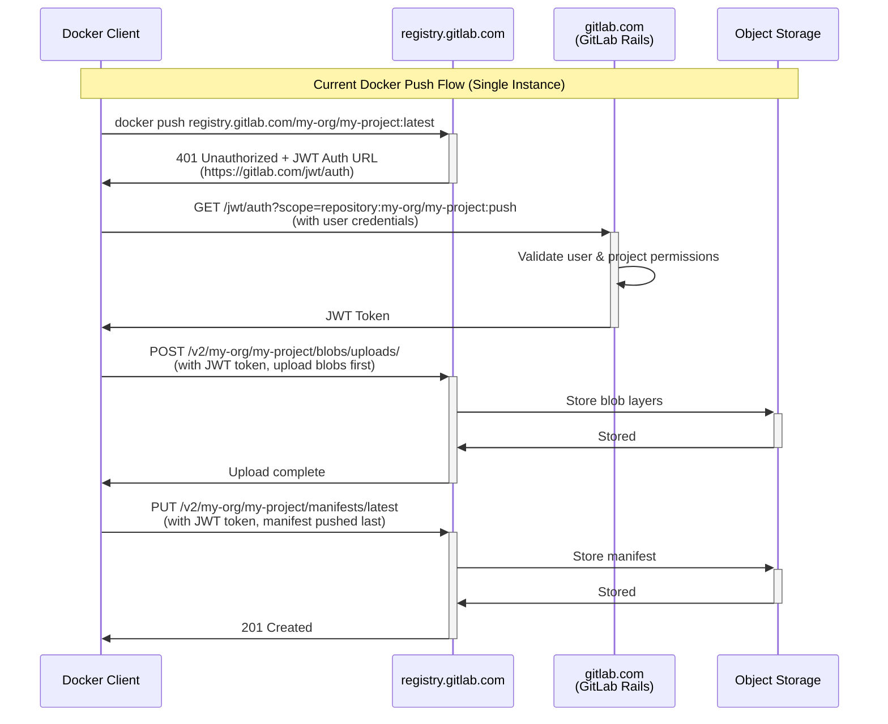
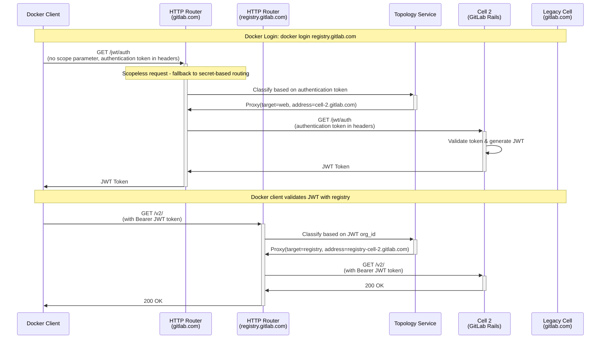
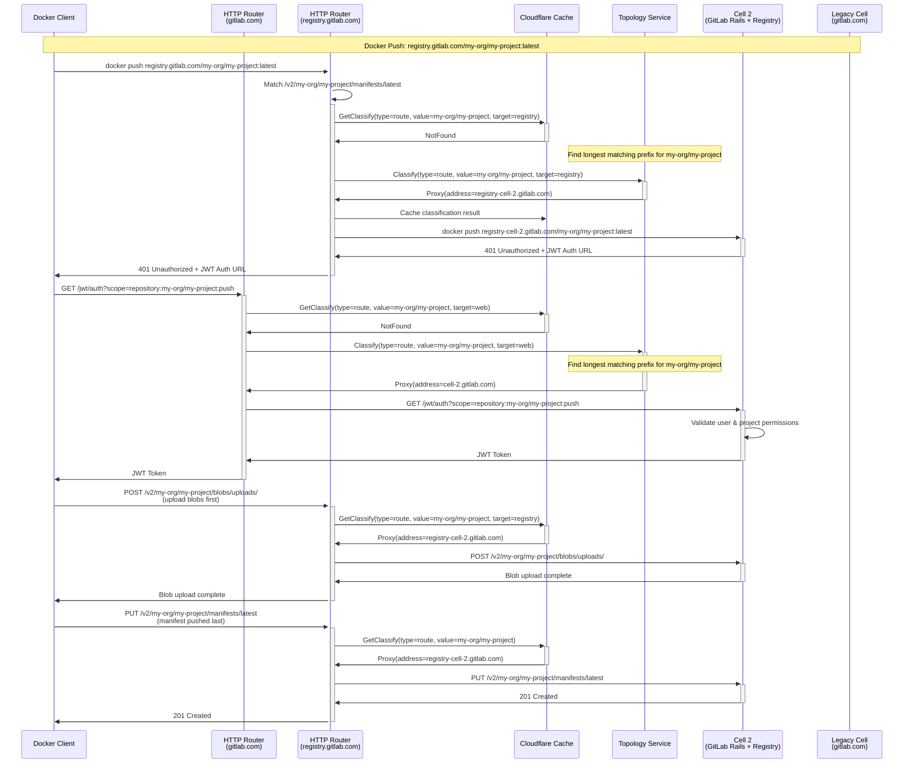
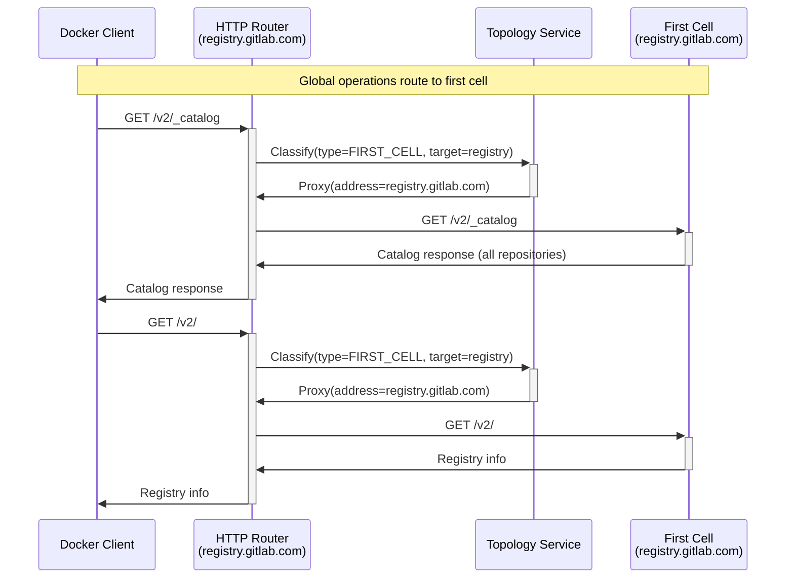
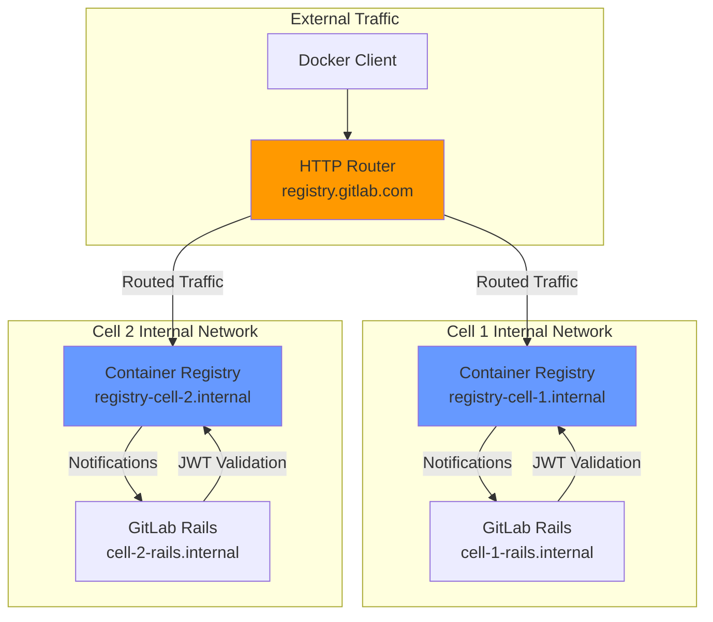




このドキュメントは、Container Registry Routing Service の設計目標とアーキテクチャを概説します。

## 概要

このドキュメントは、HTTP Router を使用して GitLab Cells アーキテクチャ内で Container Registry のルーティングを実装する方法を説明します。Container Registry は、パスベースのルーティングを使用して、プロジェクトの所有関係に基づいて正しい Cell にルーティングする必要があります。

## 現在の Docker push フロー

Cells での実装に入る前に、現在の Docker push がどのように動作するかを理解しておきましょう:



## アーキテクチャ概要

Cells アーキテクチャでは、`/jwt/auth` エンドポイントは GitLab Rails の一部であり、scope をデコードして正しい Cell にルーティングするために HTTP Router で処理する必要があります。Container Registry のルーティングは、URL パスからプロジェクト情報を抽出する形で、パスベースのルーティングのみを使用します。明示的に分類されていないすべてのエンドポイントは、レガシー Cell にルーティングされます。

### 主なコンポーネント

- **HTTP Router**: Cloudflare Worker としてデプロイされ、リクエストのルーティングを処理します
- **Container Registry**: 各 Cell 内のローカルサービスとして動作します
- **Topology Service**: Cell の検出と分類を提供します
- **JWT Authentication**: Docker 認証のために GitLab Rails 内にある `/jwt/auth` エンドポイント
- **Legacy Cell**: 分類されていないすべてのエンドポイントとグローバル操作のデフォルトターゲット

## HTTP Router ルール構成

### Session Token ルール（`ruleset/session_token.json`）

JWT 認証のために、既存の session token のルールセットに以下のルールを追加します:

```json
{
  "comment": "Container Registry JWT Authentication - with scope (path-based routing)",
  "match": [
    {
      "type": "path",
      "regex_name": "jwt_auth",
      "regex_value": "^/jwt/auth$"
    },
    {
      "type": "query_string",
      "regex_name": "scope",
      "regex_value": "repository:(?<route>[^:]+):(?<actions>.*)"
    }
  ],
  "action": "classify",
  "classify": [
    {
      "type": "route",
      "value": "${route}",
      "target": "web"
    }
  ]
}
```

注: `/jwt/auth` は scope に repository が含まれている場合のみパスベースでルーティングされ、含まれていない場合はシークレットベースのルーティング（session token ルールセット内の他のルールで処理される）にフォールバックします。route はそのまま Topology Service に送信され、Topology Service が最長一致のプレフィックスを見つけようとします。

#### JWT 認証ルーティングの制限事項

現在の実装は、ルーティングの判断を `/jwt/auth` リクエスト内の **最初の registry scope** に依存しています。Docker Registry の仕様ではリクエスト内の scope の順序が定義されていないため、これは潜在的な問題を生む可能性があります。

**現在の前提**: クライアントは push したいリポジトリを最初の scope にし、それ以外の scope は（blob mounting 操作のために）リンクするつもりのリポジトリです。

**潜在的な問題**: この前提が正しくなく、クライアントが scope を異なる順序で提供した場合、リクエストが間違った Cell にルーティングされる可能性があります。

#### 代替のルーティングソリューション

最初の scope に依存する前提が問題となる場合、いくつかの代替案があります:

1. **現在の実装**: シークレットベースのルーティングを伴う `/jwt/auth`（上記で説明したもの）

2. **Option 1（推奨）**: `/jwt/auth?cell_id=X`
   - Registry が `cell_id` パラメータを含むように構成する
   - 必要な変更が最小限
   - リスク: 一部のクライアントは cell_id パラメータをサポートしておらず、削除する可能性がある

3. **Option 2**: `/c/cell-id/jwt/auth`
   - GitLab Rails 側で `/c/cell-id` プレフィックスをサポートするための変更が必要
   - クエリパラメータより信頼性が高い
   - 実装の複雑さは中程度

4. **Option 3**: `/jwt/auth/cell/cell_id`
   - GitLab Rails 側で異なるパスをサポートするための変更が必要
   - 実装の複雑さがより高い

**推奨**: 必要な変更が最小限であることから Option 1 が推奨され、クエリパラメータのサポートが不十分な場合のフォールバックとして Option 2 が候補となります。

### Container Registry ルール（`ruleset/container_registry.json`）

Container Registry 用の最小限のルールセット（4 ルール）:

```json
{
  "rules": [
    {
      "comment": "Container Registry v2 API - All project-related operations",
      "match": [
        {
          "type": "path",
          "regex_name": "v2_api",
          "regex_value": "^/v2/(?<route>[^/]+(?:/[^/]+)*)/.*$"
        }
      ],
      "action": "classify",
      "classify": [
        {
          "type": "route",
          "value": "${route}",
          "target": "registry"
        }
      ]
    },
    {
      "comment": "Container Registry v2 base endpoint - JWT token validation",
      "match": [
        {
          "type": "path",
          "regex_name": "v2_base",
          "regex_value": "^/v2/$"
        }
      ],
      "action": "classify",
      "classify": [
        {
          "type": "org_id",
          "value": "${org_id}",
          "target": "registry"
        }
      ]
    },
    {
      "comment": "GitLab Container Registry HTTP API V1",
      "match": [
        {
          "type": "path",
          "regex_name": "gitlab_v1_api",
          "regex_value": "^/gitlab/v1/repositories/(?<route>[^/]+(?:/[^/]+)*)/.*$"
        }
      ],
      "action": "classify",
      "classify": [
        {
          "type": "route",
          "value": "${route}",
          "target": "registry"
        }
      ]
    },
    {
      "comment": "All other registry endpoints route to first cell",
      "match": [],
      "action": "classify",
      "classify": {
        "type": "FIRST_CELL",
        "target": "registry"
      }
    }
  ]
}
```

注: `/v2/` エンドポイントは Docker クライアントによる JWT トークンの検証に使用されます。JWT トークンには organization_id が含まれており、これによって正しい Cell へのルーティングが可能になります。これには、GitLab Rails が生成する JWT に organization_id を追加することが必要です。

## Topology Service の構成拡張

### 現在の Topology Service 構成

Topology Service の構成を拡張し、各 Cell 用の Container Registry の URL 情報を含めるようにする必要があります:

```toml
# Legacy Cell configuration
[[cells]]
address = "gitlab.com"
registry_address = "registry.gitlab.com"

[[cells]]
address = "cell-us-1.gitlab.com"
registry_address = "registry-cell-us-1.gitlab.com"

[[cells]]
address = "cell-eu-1.gitlab.com"
registry_address = "registry-cell-eu-1.gitlab.com"
```

## Docker login 認証フロー

### Docker login プロセス

`docker login` コマンドは scope を持たず、シークレットベースのルーティングを使用してルーティングされます:



### Repository Linking の制限事項

Repository linking 機能はこのアーキテクチャでは動作しません:

- **Cross-Cell Mounting**: ユーザーは異なる Cell のリポジトリから blob をマウントできません
- **Public Resource Access**: ユーザーは他の Organization や Cell のパブリックリソースにのみアクセスできます
- **Single Repository Routing**: 各 JWT リクエストは scope 内の最初のリポジトリにのみ基づいてルーティングされます

### Cell 間でのパブリックリポジトリアクセス

プロジェクトパスに基づく `/jwt/auth` エンドポイントのルーティングは、他の Cell からパブリックなコンテナリポジトリにアクセスするために不可欠です。ユーザーが別の Cell からパブリックイメージを pull しようとした場合:

1. **Path-Based Routing**: `/jwt/auth` リクエストにはリポジトリの scope が含まれているため、HTTP Router はリポジトリが存在する Cell に認証リクエストをルーティングできます
2. **Cross-Cell Public Access**: これにより、ユーザーはホーム Cell とは異なる Cell に存在するパブリックリポジトリに対して認証して pull することが可能になります
3. **Public Project Resolution**: ユーザーの認証情報が別の Cell では有効でない場合でも、認証リクエストをパブリックリポジトリが存在する正しい Cell にルーティングすることで、システムはパブリックプロジェクトへのアクセスを解決できます

`/jwt/auth` のパスベースルーティングがなければ、ユーザーは自身の Cell 内のリポジトリにのみアクセスできることになります。

## Container Registry リクエストフロー

### 別々の HTTP Router を伴う Docker push フロー



### Legacy Cell フォールバックフロー



## 実装の詳細

### HTTP Router の構成

異なるドメインに対しては別々の HTTP Router がデプロイされます:

```javascript
// wrangler.toml configuration for gitlab.com
[env.gprd.vars]
vars = { 
  GITLAB_SESSION_RULES = "session_token", 
  TOPOLOGY_SERVICE_URL = "https://topology-service.gitlab.com" 
}

// wrangler.toml configuration for registry.gitlab.com
[env.reg_gprd.vars]
vars = { 
  GITLAB_SESSION_RULES = "container_registry", 
  TOPOLOGY_SERVICE_URL = "https://topology-service.gitlab.com"
}
```

### 別々の HTTP Router アーキテクチャ

Container Registry が GitLab Rails とは別の HTTP Router デプロイメントを使用するのには、以下のアーキテクチャ上の理由があります:

#### サービスを分離するメリット

1. **ルールの複雑さが異なる**: Registry のルールは軽量（3〜4 ルール）であり、初期デプロイ後はあまり変わらない可能性が高い一方、GitLab Rails のルールはより複雑で頻繁に更新される

2. **トークンの取り扱いが異なる**: Registry は GitLab Rails の session token とは異なる検証要件を持つ JWT Bearer トークンを使用する

3. **パフォーマンスの最適化**: Registry のリクエストにマッチすることのない GitLab Rails のルールを処理する CPU コストを回避できる

4. **複雑さの低減**: 以下の必要性を排除できる:
   - 必要のないときに Host ヘッダーを処理する必要
   - ホスト名に基づいて異なるルールセットを使う条件分岐
   - 環境固有のルールセット管理

5. **サービスのスケーラビリティ**: 既存のものに統合するのではなく、追加サービスがそれぞれ独自のルールセットを持つというパターンに従う

6. **構成管理**: 各サービスは、サービス間の依存関係なしに独自のルールセットを保守できる

#### 構成のアプローチ

複数の場所に複製された暗黙的な慣習に頼るのではなく、明示的な構成が必要です。慣習は単一の場所で実装されている場合は受け入れられますが、同じ慣習が複数の場所にあると保守の複雑さが生まれます。慣習を実装するサービスは適切な構成を生成できますが、構成自体は明示的かつ集中管理されている必要があります。

### HTTP Router に必要な変更

HTTP Router は Container Registry のルーティングをサポートするために、以下の機能拡張が必要です:

#### 1. ターゲットベースのルーティングのサポート

ルーティングルールにおいて `target` パラメータのサポートを追加します:

```javascript
export interface ClassifyRequest {
  type: string;
  value?: string;
  target: string; // default to "web"
}
```

#### 2. Topology Service API の更新

ClassifyRequest インターフェイスを更新します:

```proto
enum TargetType {
  WEB = 0;
  REGISTRY = 1;
}

message ClassifyRequest {
  ClassifyType type = 2;
  string value = 3;
  TargetType target = 4;
}
```

#### 3. Topology Service Config の更新

```toml
[[cells]]
id = 1
address = "my.cell-1.example.com"
registry_address = "registry.my.cell-1.example.com"
```

#### 4. 複数の分類マッチのサポート

HTTP Router は、順次処理される複数の分類マッチをサポートする必要があります。ルール構造の例:

```json
{
  "match": [
    {
      "type": "path",
      "regex_name": "jwt_auth",
      "regex_value": "^/jwt/auth$"
    },
    {
      "type": "query_string",
      "regex_name": "scope",
      "regex_value": "repository:(?<project_path>[^:]+):(?<actions>.*)"
    }
  ]
}
```

マッチは順次処理され、分類が成功するまで続けられます。route はそのまま Topology Service に送信され、Topology Service が最長一致のプレフィックスを見つけようとします。

#### 5. ターゲットパラメータを伴うキャッシング

target パラメータは classify リクエストのボディハッシュの一部として自動的にキャッシュされます。HTTP Router 内の既存のキャッシング機構はリクエストボディのハッシュに基づいてキャッシュを行うため、target パラメータも含まれることになり、異なる target タイプ間で適切なキャッシュ分離が保たれます。

### Topology Service のターゲットベースのルーティング

HTTP Router は Topology Service を呼び出す際に target パラメータを使用します。Topology Service は target に基づいて適切な URL を返します:

```javascript
// Example Topology Service call
const response = await topologyService.classify({
  type: "project_full_path",
  value: "my-org/my-project",
  target: "registry"  // or "web"
});

// Response will contain the appropriate URL based on target
// For target="registry": returns registry-cell-2.gitlab.com
// For target="web": returns cell-2.gitlab.com
```

### Cell の構成要件

GitLab Rails や Container Registry のコンポーネント側で必要な変更はありません。すべての接続は HTTP Router によって処理されます。各 Cell に必要な構成は最小限です:

#### Container Registry の構成

各 Cell の Container Registry は次のように構成する必要があります:

1. **公開エンドポイント**: すべての Cell は公開ホストとして `registry.gitlab.com` を使用する
2. **内部通信**: 各 Cell は Cell から Registry への通信に内部 URL（`api_url`）を使用する
3. **Cell 固有のキー**: 各 Cell は JWT トークンの検証用に独自の署名キーを持つ
4. **内部通知**: Registry は内部ネットワークを使用して Cell の Rails に通知を送信する

#### GitLab Rails の構成

GitLab Rails 側で必要な構成変更は最小限です:

```yaml
# GitLab Rails configuration for Cell
gitlab:
  registry:
    enabled: true
    host: registry.gitlab.com  # Public endpoint
    port: 443
    api_url: http://registry-cell-1.internal:5000/  # Internal registry URL
    key: /path/to/cell-1-registry.key  # Same key as registry for JWT validation
    issuer: cell-1-gitlab-issuer  # Cell-specific issuer
```

### ネットワークアーキテクチャ

HTTP Router がすべての外部ルーティングを処理し、Cell は内部ネットワークを使用します:



## 関連ドキュメント

- [GitLab Cells Infrastructure Architecture](infrastructure/_index.md)
- [HTTP Router Configuration](https://gitlab.com/gitlab-org/cells/http-router/-/blob/main/docs/config.md)
- [HTTP Router Rulesets](https://gitlab.com/gitlab-org/cells/http-router/-/tree/main/config/ruleset)
- [Topology Service Implementation](https://gitlab.com/gitlab-org/cells/topology-service)
- [Container Registry Auth Request Flow](https://gitlab.com/gitlab-org/container-registry/-/blob/master/docs/auth-request-flow.md) - 最も正確な Docker フローのドキュメント
