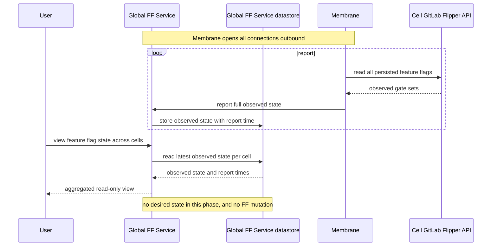
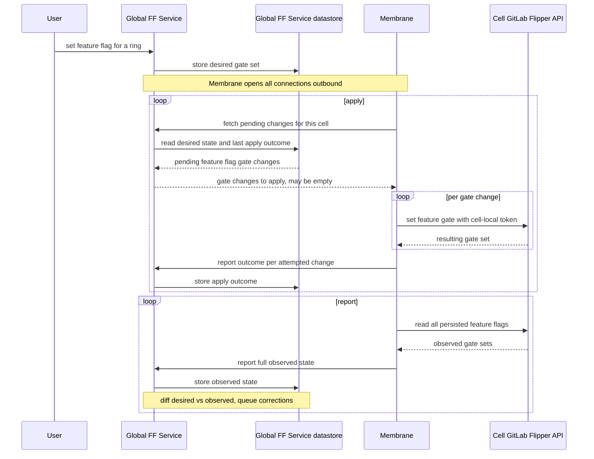
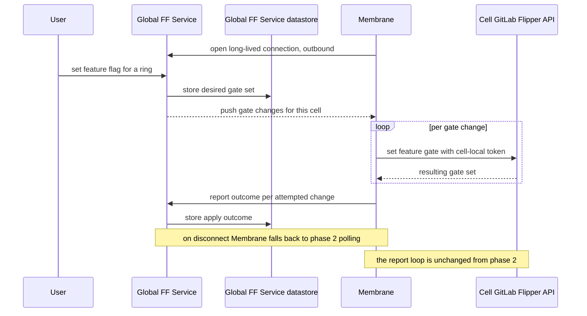

## コンテキスト {#context}

最初のお客様を移行する前に、Cells でフィーチャーフラグが必要です。フィーチャーフラグはリスクの高い機能を
ロールアウトし、インシデントを緩和するために使用されるため、エンジニアは現在の Legacy Cell とほぼ同じように
Cells でフラグを設定し、照会できなければなりません。この作業は[エピック &1423](https://gitlab.com/groups/gitlab-com/gl-infra/-/work_items/1423)で追跡され、
以前のハイレベル設計である [Cells でのフィーチャーフラグの設定](../infrastructure/feature_flags.md)を基礎としています。

設計を形作る厳しい制約があります。各 Cell の GitLab API トークンは Cell ローカルの資格情報であり、
Cell の境界外へ持ち出してはなりません。中央サービスは Cell ごとのトークンを保持し、各 Cell の API を直接呼び出すことはできません。

この制約を満たすため、`@ayufan` は Cell の運用に対するコントロールプレーンとして機能する Cell ローカルサービスの
導入を提案しました。[Membrane](https://gitlab.com/gitlab-org/cells/membrane)は、小規模な Cell ローカルのコントロールプレーンサービスとして導入されました（子[エピック &2055](https://gitlab.com/groups/gitlab-com/gl-infra/-/work_items/2055)で追跡）。Cell ごとに
1 つのインスタンスがあり、Cell の `flipper_feature` スコープのトークン（AWS Secrets Manager から Cell 内に保存）を保持し、
そのトークンを Cell 自身の GitLab Flipper API に対する呼び出しへ変換します。

Membrane における最初のフィーチャーフラグ実装は、GitLab の `/api/v4/features` API を、その
`/v1` API を介してバイト単位でそのまま転送するインバウンドプロキシであり、Cell の外部から呼び出すことを意図していました。この ADR は、そのインバウンドモデルから、
Membrane が Global Feature Flag Service へアウトバウンド接続するモデルへ方針を変更します（[決定](#decision)および
[検討した代替案](#alternatives-considered)を参照）。Membrane の前段となる Global Feature Flag Service（Cell 横断で
集約するダッシュボード UI）はまだ存在しません。

## 決定 {#decision}

### 段階的な提供 {#phased-delivery}

Cells でのフィーチャーフラグ管理を 3 つのフェーズで提供し、Global Feature Flag Service を反復的に構築するとともに、
すべてのフェーズで Membrane をアウトバウンド接続するサービスとして維持します。各フェーズでは、まだ必要でない作業やプラットフォーム依存関係を
避けるため、システムの各部分が準備でき次第、提供して利用できます。

### Cell へのインバウンド接続なし {#no-inbound-connections-to-the-cell}

Membrane からのトラフィックをアウトバウンドのみにする主な理由は 2 つあります。

1. Dedicated テナントはプライベートネットワークの背後にあり、インバウンドではまったく到達できない可能性があります。ネットワーク到達性は非対称です。グローバルサービスが
   インバウンドで到達できない Cell でも、グローバルサービスへのアウトバウンド接続は可能です。

1. pull と push（どちらが転送を開始し、所有するか）の比較: push では、グローバルサービスが Cell ごとの再試行キューと
   バックオフタイマーを Cell ごとに保持する必要があります。pull では、各 Membrane は自身の失敗した取得だけを追跡し、独自のスケジュールで再試行します。
   Cells の数が増えるにつれて、push モデルはグローバルサービスへの負荷を増やし続けますが、
   pull モデルはより適切にスケールします。

### フェーズ 1: 最小限の読み取り専用グローバルサービス {#phase-1-minimal-read-only-global-service}

最初に、実用的な最小限のグローバルサービスを構築します。これは、すべての Cell の観測されたフィーチャーフラグ状態を集約して表示する読み取り専用サービスです。

各 Cell の Membrane サービスは、その Cell の Flipper API をポーリングしてすべてのフィーチャーフラグの現在のフィーチャーフラグ状態を取得し、
グローバルサービスへアウトバウンドで報告します。グローバルサービスはこれらのレポートを集約して表示し、フィーチャーフラグ状態を
Cell 横断およびリングごとに把握できるようにします（同じリング内の Cells 間で状態が一致しない箇所も含む）。グローバルサービスは、
そのビューを提供できるよう、各 Cell から受信した集約済みの観測状態を永続化します。これはグローバルサービス独自のストレージであり、
Cell とは別です。

グローバルサービスではユーザーのログインを必須とし、ログインしたユーザーにアクセスを帰属させます。このフェーズでは、望ましい状態の保存、
フィーチャーフラグの変更、調整、長時間接続のストリーミングはありません。Membrane は常にアウトバウンド接続だけを行うため、
Cell へのインバウンドパスを解決する必要はありません。

### フェーズ 2: 望ましい状態、変更、調整 {#phase-2-desired-state-mutation-and-reconciliation}

グローバルサービスに望ましい状態の保存、グローバルサービスを介したフィーチャーフラグの変更、フィーチャーフラグの副作用（例えば、
feature-flag-log Issue やロールアウトの注釈）、調整ループを追加します。

グローバルサービスは、望ましいフィーチャーフラグ状態を所有し、差分を計算します。Cell のリングについての望ましい状態と、
その Cell が最後に報告した観測状態を比較し、適用が必要なゲート変更を導出します。
Membrane は保留中の変更を取得し、Cell ローカルのトークンを使用して各変更を Cell の Flipper テーブルに適用し、
各試行の結果を報告します。Membrane は望ましい状態も適用内容の記録も保持しないため、
どの時点で再起動しても何も失いません。

グローバルサービスは、Membrane の mTLS クライアント証明書で運ばれる `tenant_id` から Cell を識別します（Cell の
Cell ごとの証明書では、証明書サブジェクトの Organization として `tenant_id` がすでに設定されています）。その `tenant_id` を
Tissue のリング構造と照合して Cell が属するリングを判定し、そのリングの保留中の変更を
返します。

このフェーズの調整はポーリングベースです。Membrane は一定間隔でグローバルサービスから保留中の変更を取得し、観測状態を報告します。これにより
長時間接続のストリーミングを意図的に避けるため、数時間にわたる接続を Runway がサポートすることへの依存はありません。

フェーズ 1 では、Membrane が Cell を定期的にポーリングし、すべてのフィーチャーフラグの状態をグローバルサービスへ報告しました。これは
フェーズ 2 でも継続し、Cell 内のフィーチャーフラグのドリフトを検出するために使用されます。
Cell で直接行われた手動変更は、次の観測状態レポートでドリフトとして現れます。その後、グローバルサービスが
修正をキューに追加し、続く適用処理で Membrane が適用します。

変更の適用中に、Membrane が Cell のフィーチャーフラグ状態全体を読み取ることはありません。これにより、観測状態が完了済みのどの適用処理よりも
明確に新しい状態に保たれるため、レポートで順序メタデータを運ぶ必要はありません。これを単一の逐次ループで実現するか、
2 つの並行ループ間で明示的に同期して実現するかは、実装上の決定です。

### フェーズ 3: 長時間接続のストリーミング（目標状態） {#phase-3-long-lived-streaming-target-state}

レイテンシ最適化として、調整ループの上に長時間接続のストリーミングを追加します。次のポーリングで保留中の変更を知る代わりに、
Membrane がアウトバウンドの長時間接続を開き、グローバルサービスがほぼリアルタイムで変更をストリーミングします。
ストリームが切断された場合、Membrane はバックオフを伴って再試行し、ストリームを再確立できるまで通常のポーリングへフォールバックするため、
フェーズ 2 のポーリングパスはフォールバックとして残ります。

長時間接続のストリーミングは、数時間にわたる接続を Runway がサポートすることに依存しており、このフェーズの前に解決する必要があります。

### すべてのフェーズに共通する不変条件 {#invariants-across-all-phases}

1. Cell 側では、既存の Flipper テーブルが適用済み状態を保存する唯一の場所です。Membrane は Cell に 2 つ目の保存場所を追加せず、
   Rails データベースのスキーマ変更も必要としません。これは Cell 側だけを制約します。グローバルサービスは、集約された観測状態と、
   フェーズ 2 以降は望ましい状態のために独自のストレージを持ちます。
1. Membrane はすべての接続を開始します（アウトバウンドのみ）。インバウンドのフィーチャーフラグ API は公開しません。
1. Membrane は望ましい状態も、適用内容の記録も保持しません。
1. Cell ローカルのトークンが Cell の境界外へ出ることはありません。
1. グローバルサービスはユーザーを認証し、すべての変更とアクセスをユーザーに帰属させます。

### スコープ外 {#out-of-scope}

1. バージョニングや調整済み状態の出所（誰が／何が FF 値を設定したか）、観測状態スナップショットの転送、Cell からリングへの解決を含む、
   詳細な調整メカニズム。これらはフォローアップの ADR または設計ドキュメントに記載します。
1. きめ細かなロールアウト、リングのターゲティング、Cell ごとの段階的ロールアウト（フォローアップ[エピック &1448](https://gitlab.com/groups/gitlab-com/gl-infra/-/epics/1448)）。
1. フィーチャーフラグの適用済み状態を記録するためのテナントモデルと Cell の Rails スキーマの変更。
1. Global Feature Flag Service の内部設計と長期的な所有権。
1. グローバルサービスの詳細な認証・認可モデル。方針（ユーザーがログインし、すべての変更が
   帰属されること）は上記に記載していますが、完全なモデルは先送りします。

## 検討した代替案 {#alternatives-considered}

### 暫定的なエントリポイントとしての ChatOps {#chatops-as-the-interim-entry-point}

この方針の以前のバージョンでは ChatOps を暫定的なエントリポイントとして使用していました。グローバルサービスが存在するようになるまで、ChatOps が Membrane のインバウンド
フィーチャーフラグ API を呼び出し、Cells でフラグを設定、照会するものです。これはグローバルサービスを反復的に構築する方針を支持して却下されました。
理由は次のとおりです。

1. 作業が使い捨てになります。グローバルサービスが存在すれば Cell へのインバウンドパスは削除されるため、それに費やした労力は
   将来に引き継がれません。
1. インバウンドパスはブロックされています。Cells は Cloudflare の背後にあります。Cloudflare は Cell のホスト名で TLS を終端してから、Cell へ別の
   接続を開くため、クライアント証明書が Membrane に届くことはありません。Membrane へインバウンドで到達するには、追加の
   インフラ（例えば、クライアント証明書を検証し、結果をヘッダーとして転送する Cloudflare API Shield mTLS）が必要です。
1. 現在の ChatOps にはクライアントアイデンティティもリングごとのファンアウトもありません。mTLS クライアントアイデンティティのための専用 Vault PKI マウント、ロール、ポリシーと、
   リング内の Cells を解決して反復するための新しい抽象化が必要です。
1. アクセス制御が弱くなります。ChatOps コマンドを実行できる人は誰でもフィーチャーフラグを変更できますが、グローバルサービスは
   ユーザーを認証し、すべての変更を帰属させます。

最初に読み取り専用グローバルサービスを構築することで、目標状態が必要とするアウトバウンドの方針を再利用し、ブロックされている
インバウンドパスを避け、同程度の作業量で有用な Cell 横断の可視性を提供できます。

## 結果 {#consequences}

### 良い点 {#the-good}

1. システムの各部分が準備でき次第、利用を開始できます。
1. システムは最初のフェーズから、有用な Cell 横断のフィーチャーフラグ可視性を提供します。
1. すべてのフェーズで、接続は（各 Cell からの）アウトバウンドのみです。
1. フィーチャーフラグ状態へのすべての変更は認証済みユーザーによって行われ、そのユーザーに帰属します。

### あまり良くない点 {#the-not-so-good}

1. 第 2 フェーズまでは、エンジニアは Cells でフィーチャーフラグを設定できません。第 1 フェーズは読み取り専用です。
1. すでに構築済みの Membrane のインバウンドフィーチャーフラグプロキシは、この方針では使用せず、削除されます。
1. 最終フェーズの長時間接続のストリーミングは、数時間にわたる接続を Runway がサポートすることに依存しますが、これはまだ解決されていません。
