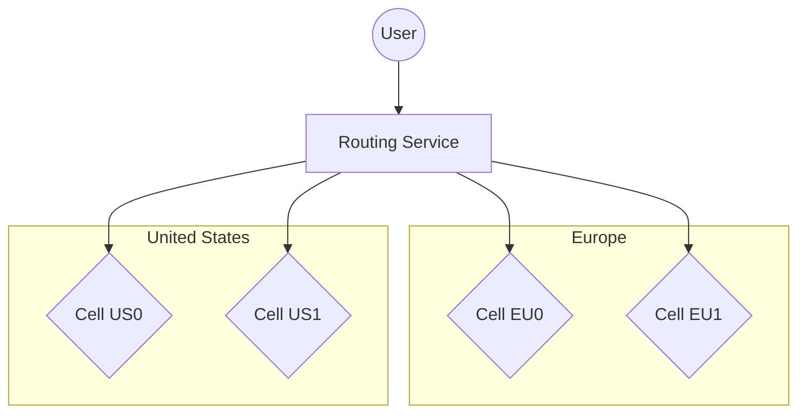
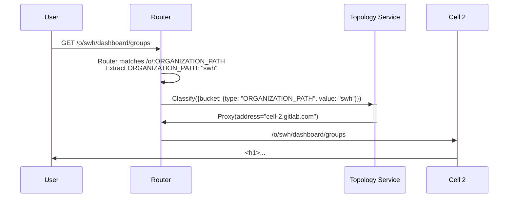
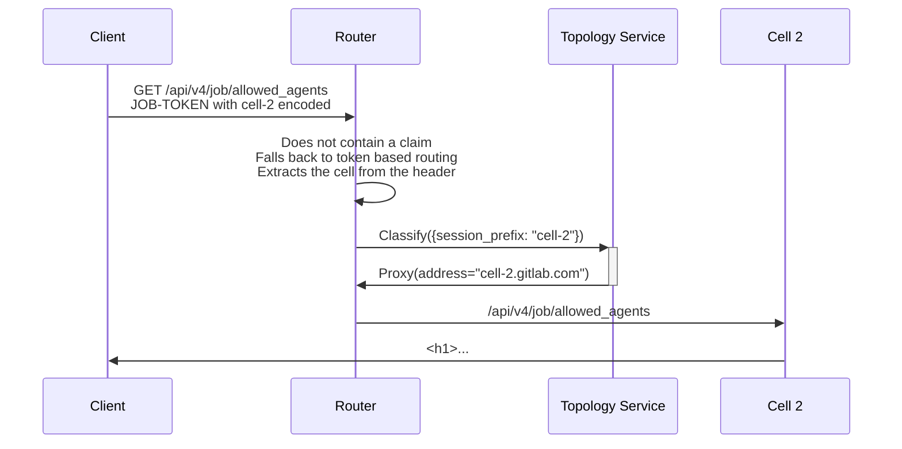
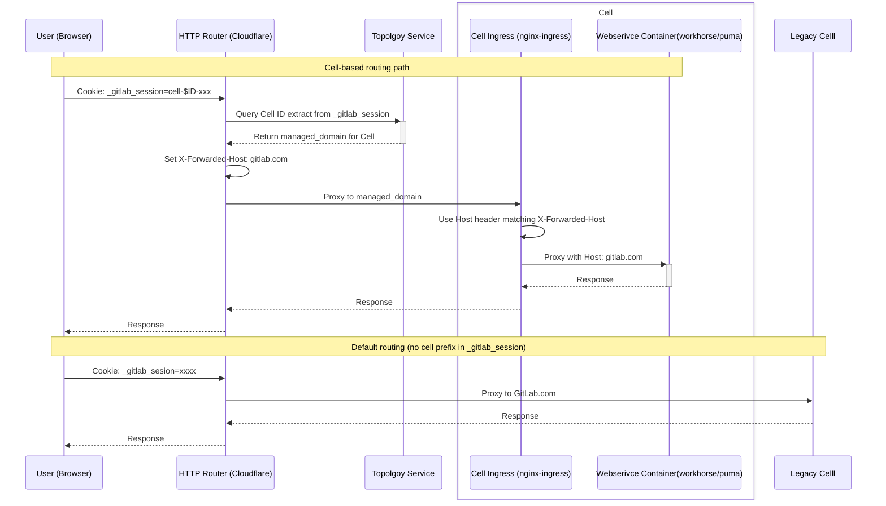

このドキュメントでは、Cells で使用されるルーティングサービスの設計目標とアーキテクチャについて説明します。ルーティングサービスがアーキテクチャのどこに位置するかをより理解するには、[インフラストラクチャアーキテクチャ](infrastructure/index.md#architecture) を参照してください。

## ゴール

ルーティングレイヤーは、すべての Cells が（例えば `gitlab.com` のような）単一ドメインの下で提供される一貫したユーザーエクスペリエンスを提供することを目的としています。

ユーザーは `https://gitlab.com` を使用して Cell 対応の GitLab にアクセスできます。
URL アクセスに応じて、この特定の情報を提供できる正しい Cell に透過的にプロキシされます。
例えば:

- `https://gitlab.com/users/sign_in` へのすべてのリクエストはすべての Cells にランダムに分散されます。
- `https://gitlab.com/gitlab-org/gitlab/-/tree/master` へのすべてのリクエストは、例えば Cell 5 に常に転送されます。
- `https://gitlab.com/my-username/my-project` へのすべてのリクエストは Cell 1 に常に転送されます。

1. **テクノロジー。**

    ルーティングサービスがどのテクノロジーで書かれるかを決定します。
    選択は最もパフォーマンスの高い言語と、ルーティングレイヤーのデプロイの期待される方法と場所に依存します。
    サービスをマルチクラウドにする必要がある場合、CDN プロバイダーへのデプロイが必要かもしれません。
    そうすると、サービスは CDN プロバイダーと互換性のあるテクノロジーで書かれる必要があります。

    [ADR 001](decisions/001_routing_technology.md)

1. **Cell ディスカバリー。**

    ルーティングサービスはすべての Cells を検出し、ヘルスを監視できる必要があります。

1. **ユーザーが単一ドメインで多数の Cells と対話できる。**

    ルーティングサービスは、アクセスされるリソースとそのデータを含む Cell に基づいて、
    すべてのリクエストを Cells にインテリジェントにルーティングします。

1. **ルーターエンドポイントの分類。**

    ステートレスなルーティングサービスは、Cells の 1 つからエンドポイントに関する情報を
    フェッチしてキャッシュします。受信リクエストを正確に記述するプロトコル（そのフィンガープリント）を実装する必要があり、
    そのプロトコルにより Cell の 1 つによってリクエストが分類され、その結果がキャッシュされます。
    また、ネガティブキャッシュとキャッシュの無効化メカニズムを実装する必要があります。

1. **GraphQL およびその他の曖昧なエンドポイント。**

    ほとんどのエンドポイントには一意の分類キーがあります: Organization（直接または間接的に（グループやプロジェクトを通じて）エンドポイントの分類に使用できます）。
    一部のエンドポイントは使用方法が曖昧（分類キーをエンコードしない）か、分類キーがペイロードの深い部分に格納されています。
    これらの場合、`/api/graphql` などのエンドポイントの処理方法を決定する必要があります。

1. **小規模。**

    ルーティングサービスは設定とルール駆動であり、ビジネスロジックを実装しません。
    プロジェクトは最小限に保ち、ルーティングの懸念事項のみを処理するべきです。

## 要件

| 要件 | 説明 | 優先度 |
| ------------------- | ----------------------------------------------------------------- | -------- |
| ディスカバリー | すべての Cells を検出しヘルスを監視できる必要がある | high |
| セキュリティ | 認可された Cells のみにルーティングされる | high |
| 単一ドメイン | 例えば GitLab.com | high |
| キャッシュ | パフォーマンスのためにルーティング情報をキャッシュできる | high |
| 低レイテンシー | [50 ms の増加レイテンシー](#低レイテンシー) | high |
| パスベース | パスに基づいてルーティング決定ができる | high |
| 複雑さ | ルーティングサービスは設定駆動で小規模であるべき | high |
| ローリング | ルーティングサービスは混在バージョンの Cells で動作する | high |
| フィーチャーフラグ | 機能をオン、オフ、% ロールアウトできる | high |
| プログレッシブロールアウト | 変更をゆっくりとロールアウトできる | medium |
| ステートレス | データベース不要、Cells がすべてのルーティング情報を提供する | medium |
| シークレットベース | シークレット（例: JWT）に基づいてルーティング決定ができる | medium |
| オブザーバビリティ | 既存のオブザーバビリティツールを使用できる | low |
| セルフマネージド | 最終的に [セルフマネージド](goals.md#self-managed) で使用できる | low |
| リージョン | 異なる [リージョン](goals.md#regions) へのリクエストをルーティングできる | low |

### 低レイテンシー

ルーティングサービスの目標レイテンシーは **50 _ms_ 未満** であるべきです。

`urgency: high` リクエストを見ると、p50 でのヘッドルームはあまりありません。
追加の 50 _ms_ を加えると、p95 レベルで SLO 内に収まることができます。

アプリケーションへの主なエントリーポイントは 3 つあります; [`web`](https://gitlab.com/gitlab-com/runbooks/-/blob/5d8248314b343bef15a4c021ac33978525f809e3/services/service-catalog.yml#L492-537)、[`api`](https://gitlab.com/gitlab-com/runbooks/-/blob/5d8248314b343bef15a4c021ac33978525f809e3/services/service-catalog.yml#L18-62)、[`git`](https://gitlab.com/gitlab-com/runbooks/-/blob/5d8248314b343bef15a4c021ac33978525f809e3/services/service-catalog.yml#L589-638) です。
各サービスには [apdex](https://www.apdex.org/wp-content/uploads/2020/09/ApdexTechnicalSpecificationV11_000.pdf) 標準を使用したレイテンシーに基づくサービスレベルインジケーター（SLI）が割り当てられています。
これらの SLI に対応するサービスレベル目標（SLO）は、大量のリクエストに対して低レイテンシーを要求します。
これらのサービスの前にルーティングレイヤーを追加しても SLI に影響を与えないことが重要です。
ルーティングレイヤーはこれらのサービスのプロキシであり、リクエストフロー全体（エッジネットワークやロードバランサーなどのコンポーネントを含む）に対する包括的な SLI 監視システムがないため、`web`、`git`、`api` の SLI をターゲットとして使用します。

使用する主な SLI は [rails リクエスト](https://docs.gitlab.com/ee/development/application_slis/rails_request.html) です。
[リクエストの緊急度](https://docs.gitlab.com/ee/development/application_slis/rails_request.html#how-to-adjust-the-urgency) に応じた複数の `satisfied` ターゲット（apdex）があります:

| 緊急度 | 時間（ms） |
| ---------- | -------------- |
| `:high` | 250 _ms_ |
| `:medium` | 500 _ms_ |
| `:default` | 1000 _ms_ |
| `:low` | 5000 _ms_ |

#### 分析

ヘッドルームの計算方法は以下の通りです:

```math
\mathrm{Headroom}\ {ms} = \mathrm{Satisfied}\ {ms} - \mathrm{Duration}\ {ms}
```

**`web`**:

| 目標時間 | パーセンタイル | ヘッドルーム |
| --------------- | ---------- | --------- |
| 5000 _ms_ | p99 | 4000 _ms_ |
| 5000 _ms_ | p95 | 4500 _ms_ |
| 5000 _ms_ | p90 | 4600 _ms_ |
| 5000 _ms_ | p50 | 4900 _ms_ |
| 1000 _ms_ | p99 | 500 _ms_ |
| 1000 _ms_ | p95 | 740 _ms_ |
| 1000 _ms_ | p90 | 840 _ms_ |
| 1000 _ms_ | p50 | 900 _ms_ |
| 500 _ms_ | p99 | 0 _ms_ |
| 500 _ms_ | p95 | 60 _ms_ |
| 500 _ms_ | p90 | 100 _ms_ |
| 500 _ms_ | p50 | 400 _ms_ |
| 250 _ms_ | p99 | 140 _ms_ |
| 250 _ms_ | p95 | 170 _ms_ |
| 250 _ms_ | p90 | 180 _ms_ |
| 250 _ms_ | p50 | 200 _ms_ |

_分析は <https://gitlab.com/gitlab-org/gitlab/-/issues/432934#note_1667993089> で行われました_

**`api`**:

| 目標時間 | パーセンタイル | ヘッドルーム |
| --------------- | ---------- | --------- |
| 5000 _ms_ | p99 | 3500 _ms_ |
| 5000 _ms_ | p95 | 4300 _ms_ |
| 5000 _ms_ | p90 | 4600 _ms_ |
| 5000 _ms_ | p50 | 4900 _ms_ |
| 1000 _ms_ | p99 | 440 _ms_ |
| 1000 _ms_ | p95 | 750 _ms_ |
| 1000 _ms_ | p90 | 830 _ms_ |
| 1000 _ms_ | p50 | 950 _ms_ |
| 500 _ms_ | p99 | 450 _ms_ |
| 500 _ms_ | p95 | 480 _ms_ |
| 500 _ms_ | p90 | 490 _ms_ |
| 500 _ms_ | p50 | 490 _ms_ |
| 250 _ms_ | p99 | 90 _ms_ |
| 250 _ms_ | p95 | 170 _ms_ |
| 250 _ms_ | p90 | 210 _ms_ |
| 250 _ms_ | p50 | 230 _ms_ |

_分析は <https://gitlab.com/gitlab-org/gitlab/-/issues/432934#note_1669995479> で行われました_

**`git`**:

| 目標時間 | パーセンタイル | ヘッドルーム |
| --------------- | ---------- | --------- |
| 5000 _ms_ | p99 | 3760 _ms_ |
| 5000 _ms_ | p95 | 4280 _ms_ |
| 5000 _ms_ | p90 | 4430 _ms_ |
| 5000 _ms_ | p50 | 4900 _ms_ |
| 1000 _ms_ | p99 | 500 _ms_ |
| 1000 _ms_ | p95 | 750 _ms_ |
| 1000 _ms_ | p90 | 800 _ms_ |
| 1000 _ms_ | p50 | 900 _ms_ |
| 500 _ms_ | p99 | 280 _ms_ |
| 500 _ms_ | p95 | 370 _ms_ |
| 500 _ms_ | p90 | 400 _ms_ |
| 500 _ms_ | p50 | 430 _ms_ |
| 250 _ms_ | p99 | 200 _ms_ |
| 250 _ms_ | p95 | 230 _ms_ |
| 250 _ms_ | p90 | 240 _ms_ |
| 250 _ms_ | p50 | 240 _ms_ |

_分析は <https://gitlab.com/gitlab-org/gitlab/-/issues/432934#note_1671385680> で行われました_

## 非ゴール

未定義です。

## 提案

ルーティングサービスは以下の設計ガイドラインを実装します:

1. シンプル:
   - ルーティングサービスはリクエストをバッファリングしません。
   - ルーティングサービスは受信リクエストに基づいて単一の Cell にのみプロキシできます。
1. ステートレス:
   - ルーティングサービスは永続ストレージを持ちません。
   - ルーティングサービスはマルチレベルキャッシュを使用します: インメモリ、外部共有キャッシュ。
1. ゼロトラスト:
   - ルーティングサービスはプロキシされる各リクエストに署名します。
   - 信頼は JWT トークンまたは相互認証スキームを使用して確立されます。
   - Cells はゼロトラストモデルに従う限り、パブリックインターネット上で利用可能になれます。
1. 設定ベース:
   - ルーティングサービスは静的な Cells のリストで設定されます。
   - ルーティングサービスの設定はサービスデプロイの一部として適用されます。
1. ルールベース:
   - ルーティングルールは設定可能です。
1. 非依存:
   - ルーティングサービスは Organization のような高レベルの概念を認識していません。
   - 分類はルールで提供される仕様に基づいて、分類キーを見つけるために行われます。
   - 分類キーの結果はキャッシュされます。
   - キャッシュされた単一の分類キーは、多くの類似リクエストの処理に使用されます。

以下のダイアグラムは、ユーザーリクエストが DNS を通じて Cloudflare Worker としてデプロイされたルーティングサービスにルーティングされ、ルーターがリクエストを送信する Cell を選択する方法を示しています。



### ルーティングルール

- ルーターはリクエストをルーティングするためにルールの階層を適用します。
  - 受信リクエストは最初にルーター内で設定されたパスパターンに照合されます。クレームはパスから抽出され（例: `/:NAMESPACE_PATH`）、[トポロジーサービス](topology_service.md) を通じてターゲット Cell を決定するために使用されます。
  - パス内のクレームが見つからない場合、またはパスにクレームが含まれていない場合（例: `/api/graphql` や `cable`）、ルーターはトークンベースのルーティングにフォールバックします。
- ルーティングルールは、リクエストをデコードし、分類キーを見つけ、ルーティング決定を行う方法を記述します。
- ルーティングルールは静的であり、HTTP Router のデプロイの一部として事前に定義されます。
- パスルーティングルール以外のルーティングルールは、順番に操作のシーケンスを記述する JSON ドキュメントとして定義されます。
- ルーティングルールはより高速な実行スキームを提供するためにアプリケーションコードにコンパイルされる場合があります。
- 各ルーティングルールは `cookies`、`headers`、`method`、`action` によって記述されます。
- `action` は `classify` にすることができ、動的な分類を実行するためにトポロジーサービスを使用することを示します。
- `action` は `proxy` にすることができ、`proxy` アドレスが指定されていない限り、HTTP Router 設定に格納された固定ホストへのパススルーを実行することを示します。
  通常、これはクラスター内の `Cell 1` になります。

ルーティングルールの JSON 構造はすべてのマッチャーを記述します:

```json
{
    "rules": [
        {
            "cookies": {
                "<cookie_name>": {
                    "match_regex": "<regex_match>"
                },
                "<cookie_name2>": {
                    "match_regex": "<regex_match>"
                }
            },
            "headers": {
                "<header_name>": {
                    "match_regex": "<regex_match>"
                },
                "<header_name2>": {
                    "match_regex": "<regex_match>"
                },
            },
            "method": ["<list_of_accepted_methods>"],

            "action": "classify",
            "classify": {
                "type": "session_prefix|...",
                "value": "string_build_from_regex_matchers"
            },

            "action": "proxy",
            "proxy": {
                "address": "cell1.gitlab.com"
            }
        }
    ]
}
```

セッションクッキーとシークレットに基づいてルーティング決定を行うルーティングルールの例:

```json
{
    "rules": [
        {
            "cookies": {
                "_gitlab_session": {
                    "match_regex": "^(?<cell_name>cell.*:)" // accept `_gitlab_session` that are prefixed with `cell1:`
                }
            },
            "action": "classify",
            "classify": {
                "type": "session_prefix",
                "value": "${cell_name}"
            }
        },
        {
            "headers": {
                "GITLAB_TOKEN": {
                    "match_regex": "^(?<cell_name>cell.*:)" // accept `_gitlab_session` that are prefixed with `cell1:`
                }
            },
            "action": "classify",
            "classify": {
                "type": "token_prefix",
                "value": "${cell_name}"
            }
        }
    ]
}
```

### 分類

分類は [トポロジーサービスの分類サービス](topology_service.md#classify-service) によって実装されます。

- 分類エンドポイントはアクセスを保護するために REST（mTLS 付き）を使用します。
- 分類エンドポイントは情報をルーティングする Cell 名のみを返します。
- 分類は類似リクエストのキャッシュを汚染するために他の同等の分類キーを返すことがあります。
  これにより、すべての類似リクエストが毎回分類することなく迅速に処理されることを確保します。
- HTTP Router は `classify` 呼び出しを適切な回数リトライします。
- 特定の値の分類は返されたレスポンスに関わらずキャッシュされます（肯定的または否定的）。
  見つからない分類キーに対する過剰なリクエストを防ぐために、拒否された分類がキャッシュされます。
- レスポンスにはリクエストがキャッシュされる期間を制御する `Cache-*` ヘッダーが含まれます:
  [Cloudflare Workers - Cache](https://developers.cloudflare.com/workers/runtime-apis/cache/)。
- キャッシュが使用される場合、エッジで特定のタイプのキャッシュを選択的にワイプするメカニズムとして `Cache-Tag:` の使用が必要です。
- キャッシュはトポロジーサービスによって制御されますが、HTTP Router は一部のレスポンスをキャッシュに強制することがあります。

#### パスベースルーティングの例

`/o/swh/dashboard/groups` へのリクエストの場合:



#### JSON ルール分類の例

`cell-2` をエンコードした `JOB-TOKEN` ヘッダーを持つ `/api/v4/job/allowed_agents` へのリクエストの場合:



### 設定

すべての設定は環境変数で提供されます:

- HTTP Router はトポロジーサービスへのアドレスのみを設定します
- トポロジーサービスへの接続には mTLS が認証/認可に使用されます。

### デプロイ

HTTP ルーティングサービスを GitLab.com に完全にデプロイするには、いくつかのフェーズがあります。

1. 最初のフェーズは、webservice（`gitlab.com`）の前にシンプルなパススループロキシをデプロイすることです。
   1. まず、DNS を変更せずに Worker を徐々にロールアウトするために [Cloudflare Routes](https://developers.cloudflare.com/workers/configuration/routing/routes/) を利用します。
   1. （おそらくオプション）次のステップは、レガシー Cell の内部専用 DNS をプロビジョニングすることです（例: `cell-1.gprd.int.gitlab.com`）。
      その後、HTTP Router をこの新しい DNS にプロキシし、`mTLS` や Cloudflare Tunnel のようなソリューションでこの接続を保護します。
      これを行うためには、HTTP Router に `gitlab.com` DNS レコードを割り当てる必要があります。おそらく
      [カスタムドメイン](https://developers.cloudflare.com/workers/configuration/routing/custom-domains/) を使用します。
1. 2 番目のフェーズは、コンテナレジストリ（`registry.gitlab.com`）の前にシンプルなパススループロキシをデプロイすることです。
   これは `gitlab.com` 用の HTTP Router の同じデプロイメントを使用します。
   1. まず、DNS を変更せずに Worker を徐々にロールアウトするために [Cloudflare Routes](https://developers.cloudflare.com/workers/configuration/routing/routes/) を利用します。
   1. （おそらくオプション）次のステップは、レガシー Cell の内部専用 DNS をプロビジョニングすることです（例: `cell-1-registry.gprd.int.gitlab.com`）。
      その後、HTTP Router をこの DNS にプロキシし、`mTLS` や Cloudflare Tunnel のようなソリューションでこの接続を保護します。
      これを行うためには、HTTP Router に `registry.gitlab.com` DNS レコードを割り当てる必要があります。おそらく
      [カスタムドメイン](https://developers.cloudflare.com/workers/configuration/routing/custom-domains/) を使用します。
1. 3 番目のフェーズは複数の Cell を含みます。
   1. HTTP Router がルーティングする新しい Cell それぞれに、以下が必要です:
      1. `cell-2.gdrd.int.gitlab.com` のような内部専用 DNS（HTTP Router 経由でのみアクセス可能）。
      1. HTTP Router と Cell の間の安全な暗号化された接続。

### ルールセットのロールアウト

HTTP Router のルールセットは、Cells 環境内でどのように HTTP リクエストをルーティングするかのロジックを定義します。
これらのルールセットを変更すると、サイト全体の可用性または特定のサービスの SLO に影響を与える可能性があります。
そのため、ルールセットへの変更をロールアウトする際は極めて慎重に行う必要があります。
ユーザーへの影響を最小限に抑え、ダウンタイムなしでこれらの変更を実装するために、Cloudflare が提供する [段階的デプロイ](https://developers.cloudflare.com/workers/configuration/versions-and-deployments/gradual-deployments/) 機能を使用します。このアプローチにより、問題のある変更の影響を総リクエストの小さなサブセットに限定できます。
使用されるルールセットは [HTTP Router 設定ファイル](https://gitlab.com/gitlab-org/cells/http-router/-/blob/main/wrangler.toml?ref_type=heads#L69) で設定されており、`GITLAB_RULES_CONFIG` 環境変数が [src/rules](https://gitlab.com/gitlab-org/cells/http-router/-/tree/main/src/rules?ref_type=heads) ディレクトリからの相対的なルールセットファイル名を定義します。
既存の [デプロイメカニズム](https://gitlab.com/gitlab-org/cells/http-router/-/blob/a9d4dc69385d59bbe1d93211c156fc39b75b5ce9/docs/deployment.md) を使用します。ルールセットの変更の品質と期待される結果に確信を持った場合にのみ、ロールアウトのパーセンテージを徐々に増加させます。推奨されるロールアウトパーセンテージのシーケンスは: 5% → 25% → 50% → 75% → 100% です。

#### 前提条件

- ロールアウト手順を進める前に、タイムラインを明確に定義してください。
- 変更をスケジュールしてください
- [設定](https://gitlab.com/gitlab-com/gl-infra/change-lock/-/blob/f1c2a4e197fc5c0c1ca4aae18e7480a904212f80/config/changelock.yml) ファイルに新しい変更ロックエントリを追加してください。このエントリには `http-router` 変更ロックタグを使用してください。

注意: このロールアウト戦略ではタイムラインに従うことが重要です。一定の間隔で MR をマージする必要があります。そのため、ペアで作業することをお勧めします。

#### ロールアウト手順

1. HTTP Router Deployer の CI 設定 [`.gitlab-ci.yml`](https://gitlab.com/gitlab-com/gl-infra/cells/http-router-deployer/-/blob/main/.gitlab-ci.yml) を変更する MR を作成します。グローバル変数セクションで、変更管理の Issue へのリンクを付けて `CHANGE_LOCK_OVERRIDE` と `OVERRIDE_LAST_PERCENTAGE` 環境変数の両方を `true` に設定します。
1. 同じ MR で、[deploy-worker.sh](https://gitlab.com/gitlab-com/gl-infra/cells/http-router-deployer/-/blob/main/scripts/deploy-worker.sh) スクリプトの `ROLLOUT_PERCENTAGES` 環境変数を変更します。値を `5` に設定します。例: `ROLLOUT_PERCENTAGES="5"`
1. MR をマージします。
1. [`wrangler.toml`](https://gitlab.com/gitlab-org/cells/http-router/-/blob/main/wrangler.toml) 内の `GITLAB_RULES_CONFIG` 設定を新しいルールセットに更新する MR を作成してマージします。
1. 新しいルールセットの検証を行い、SLO に影響がないことを確認します。
1. `ROLLOUT_PERCENTAGES` を増加する前に、環境によって変化するベーキング時間を設けます。
1. 異常が見つからず SLO への影響がない場合は、`25`、`50`、`75`、`100` パーセントに対してステップ 1 を繰り返します。ロールアウトサイクル全体を通じて `CHANGE_LOCK_OVERRIDE` と `OVERRIDE_LAST_PERCENTAGE` を `true` に保ちます。
1. トラフィックの 100% がロールアウトされたら、[deploy-worker.sh](https://gitlab.com/gitlab-com/gl-infra/cells/http-router-deployer/-/blob/main/scripts/deploy-worker.sh) スクリプトの値を完全なシーケンス `"5 25 50 75 100"` に戻す MR を開きます。例: `ROLLOUT_PERCENTAGES="5 25 50 75 100"`。[`.gitlab-ci.yml`](https://gitlab.com/gitlab-com/gl-infra/cells/http-router-deployer/-/blob/main/.gitlab-ci.yml) の `OVERRIDE_LAST_PERCENTAGE` と `CHANGE_LOCK_OVERRIDE` 環境変数を削除します。

## 代替案

### リクエストのバッファリング

[リクエストバッファリングを使用したステートレスルーター](rejected/proposal-stateless-router-with-buffering-requests.md) は、Cell が `X-Gitlab-Cell-Redirect` で応答して別の Cell にリクエストをリダイレクトするアプローチを説明しています:

- これはリクエスト全体（ヘッダー + ボディ）をバッファリングする必要があり、非常にメモリ集約的です。
- この提案は、Cells が異なるバージョンで実行されている混在デプロイを扱う簡単な方法を提供しません。
- この提案はデコードされた分類キーではなくリクエストに基づいているため、より多くの情報をキャッシュする必要があります。

### ルート学習

[ルート学習を使用したステートレスルーター](rejected/proposal-stateless-router-with-routes-learning.md) は、このドキュメントのアプローチに似たアプローチを説明しています。ただし、ルートルールと分類は `/api/v4/internal/cells/learn` のプリフライトチェックの形式で一度に行われます:

- これにより、全体のルート学習が動的になり、Cells の可用性に依存します。
- この提案は、Cells が異なるバージョンで実行されている混在デプロイを扱う簡単な方法を提供しません。
- この提案はデコードされた分類キーではなくリクエストに基づいているため、より多くの情報をキャッシュする必要があります。

## 単一ドメイン

すべての Cell に対して単一ドメインを維持するために、webserver はリダイレクトを実行する際にパブリックホストとして応答する必要があります。Dedicated の BYOD 機能は、Cell がパブリックドメイン上でサービスを提供しているかのように動作できるようにすることでこの目的を果たします。

byod 設定スニペットの例。注意 - インスタンスのみが設定されており、kas やレジストリドメインは設定されていません

```json
  "byod": {
    "instance": "gitlab.com",
  }
```

### ドメイン設定

- [BYOD](https://gitlab.com/gitlab-com/gl-infra/gitlab-dedicated/team/-/blob/main/architecture/blueprints/bring-your-own-domain.md#scope) パブリックドメイン（例: gitlab.com）を使用して設定された本番 Cell
- 各 Cell は設定された [`managed_domain`](https://gitlab.com/gitlab-com/content-sites/handbook/-/blob/e7897e7240a3ddfb95ab4dd8f4735a332aff81fc/content/handbook/engineering/architecture/design-documents/cells/http_routing_service.md#L186) にも応答します
- Nginx ingress は両方のドメインを処理します

### SSL/TLS 設定

- 設定された BYOD ドメインの証明書はすでに管理されており、インストルメンターが管理するものではありません。
- [`managed_domain`](https://gitlab.com/gitlab-com/content-sites/handbook/-/blob/e7897e7240a3ddfb95ab4dd8f4735a332aff81fc/content/handbook/engineering/architecture/design-documents/cells/http_routing_service.md#L186) は、Cells がパブリックにルーティング可能でない場合に特にプロキシの背後でデフォルトの http ソルバーが機能しないため、[cert-manager](https://cert-manager.io/) DNS ソルバーを使用して処理されます

### Nginx-ingress 設定

- プライマリドメインと [`managed_domain`](https://gitlab.com/gitlab-com/content-sites/handbook/-/blob/e7897e7240a3ddfb95ab4dd8f4735a332aff81fc/content/handbook/engineering/architecture/design-documents/cells/http_routing_service.md#L186) ドメインの両方でリッスンします
- 適切なルーティングのために `X-Forwarded-Host` ヘッダーを処理します。ホストヘッダーは[使用できない](https://community.cloudflare.com/t/not-possible-to-override-the-host-header-on-workers-requests/13077)ため、nginx はルーターによって渡される `X-Forwarded-Host` を使用します

### Cell インフラストラクチャルーティング

[ここで説明されている session_prefix ルールを使用します](#ルーティングルール)



## FAQ

1. ルーティングサービスはいつ、どのようにしてルールセットをコンパイルしますか?

未定義です。

## リンク

- [Cells - ルーティング: テクノロジー](https://gitlab.com/groups/gitlab-org/-/epics/11002)
- [エンドポイントの分類](https://gitlab.com/gitlab-org/gitlab/-/issues/430330)
