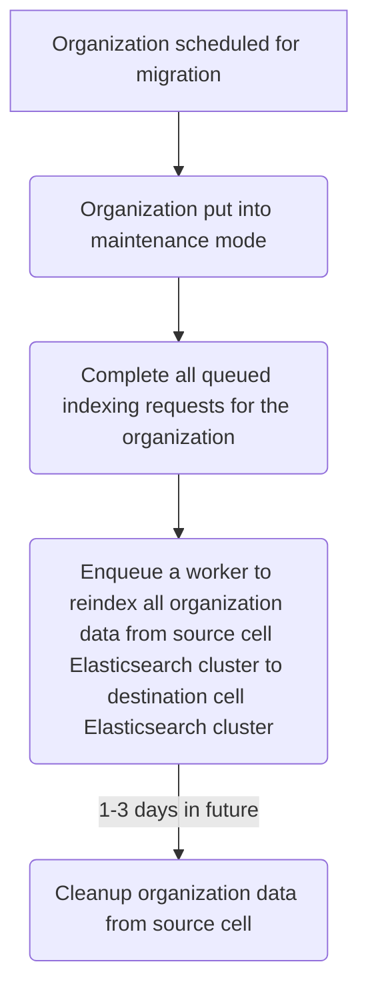

{}
このドキュメントは作業中であり、Cells 設計の非常に初期の状態を表しています。重要な側面は文書化されていませんが、将来追加する予定です。これは Cells のアーキテクチャの 1 つの可能性であり、実装するアプローチを決定する前に代替案と比較検討する予定です。このアプローチを実装しないと決定した場合でも、このアプローチを選択しなかった理由を文書化できるよう、このドキュメントは保持されます。
{}

## 概要

[高度な検索機能](https://docs.gitlab.com/ee/user/search/advanced_search.html) により、ユーザーは GitLab インスタンス全体を検索できます。高度な検索は Elasticsearch と OpenSearch を検索バックエンドとしてサポートします。

**注意:** グローバル検索も影響を受ける機能であり、[別の設計ドキュメント](global-search.md) で取り上げられます。

GitLab.com は高度な検索をサポートするためにすべてのインデックスデータを収容する 1 つの Elasticsearch クラスターを持っています。高度な検索には[自動インデックスパイプライン](https://docs.gitlab.com/ee/development/advanced_search.html#deep-dive)とデータマイグレーション用の[マイグレーションフレームワーク](https://about.gitlab.com/blog/2021/06/01/advanced-search-data-migrations/) が含まれます。ほとんどのインフラストラクチャとインデックスのメンテナンスタスクは、[変更リクエストワークフロー](../../../../change-management.md/#change-request-workflows) を通じて Global Search チームが手動で実施しています。

複数の [Cells](../goals.md#cell) を導入する際、高度な検索は以下をサポートする必要があります:

1. インフラストラクチャのメンテナンス
   - Elasticsearch クラスターのバージョンアップグレード
   - Elasticsearch クラスターのスケーリング
   - インシデントの根本原因分析と解決のサポート
2. インデックスのメンテナンス
   - ゼロダウンタイム再インデックス機能を使用したインデックスシャードのリサイズ（[例 Issue](https://gitlab.com/gitlab-com/gl-infra/production/-/issues/18158)）
   - シャード分割 Elasticsearch API を使用したインデックスシャードのリサイズ（[例 Issue](https://gitlab.com/gitlab-com/gl-infra/production/-/issues/18646)）
   - Elasticsearch スローログの有効化（[例 Issue](https://gitlab.com/gitlab-com/gl-infra/production/-/issues/18159)）
   - 高度な検索マイグレーションインデックスからリバートされたマイグレーションのクリーンアップ
（[例 Issue](https://gitlab.com/gitlab-com/gl-infra/production/-/issues/16231)）
3. Organization の移行
   - 高度な検索は Organization がある Cell から別の Cell に移動される場合をサポートする必要があります。
   - Organization が移動された際、データベースレコード、埋め込み、および git データを再インデックスする必要があります。

この設計ドキュメントでは、これらの領域をサポートするための高レベルな計画を説明します。

## 提案

各 Cell は独自の Elasticsearch クラスターを持ちます。

### インフラストラクチャのメンテナンス

すべてのインフラストラクチャのメンテナンスは自動化される必要があります。マイグレーションフレームワークの使用を検討してもよいですが、他の方法も評価する必要があります。

これをサポートするために、以下が必要です:

- インデックスパイプラインの一時停止フレームワークを、[特定のインデックスのインデックス作成を一時停止](https://gitlab.com/gitlab-org/gitlab/-/issues/381705) できるように変更する必要があります。
  特定のインデックスを一時停止することで、他のデータタイプに影響を与えずにそのインデックスでメンテナンスタスクを実行できます。インデックス作成が遅れているために検索結果が古くなる影響を軽減するために重要です。
- 検索とインデックス作成の検証を自動化する必要があります。
  `Search::ClusterHealthCheck` クラスを拡張して検索とインデックス作成の検証を含めることができます。[gitlab#499586](https://gitlab.com/gitlab-org/gitlab/-/issues/499586)

### インデックスのメンテナンス

すべてのインデックスメンテナンスタスクは最初に
[高度な検索マイグレーションフレームワーク](https://docs.gitlab.com/ee/development/search/advanced_search_migration_styleguide.html) を使用して完了します。
マイグレーションプロセスが検証されたら、すべてのインデックスメンテナンスマイグレーションは Cron ワーカーによって実行されます。メンテナンスタスクごとに 1 つの Cron ワーカーが必要です:

1. シャードリサイズ Cron ワーカーは各インデックスをレビューし、しきい値を超えた場合にシャードサイズを調整します
1. マイグレーションクリーンアップ Cron ワーカーはコードベースに存在しないマイグレーションをマイグレーションインデックスから削除します
1. スローログ Cron ワーカーは ops フィーチャーフラグ（またはアプリケーション設定）が有効な場合にスローログを有効にします

### Organization の移行

Organization の移行にはいくつかのアプローチがあり、それぞれトレードオフがあります。Cells はフェーズに分けてロールアウトされるため、この提案にはフェーズごとの推奨事項が含まれています。

#### [Cells 1.0] 既存のインデックスフレームワークを使用する

Organization の移行は既存のインデックスフレームワークを使用して自動化されます。Organization がメンテナンスモードに置かれ、すべての PostgreSQL と Gitaly データが移動されたら、Organization を宛先 Cell でインデックスキューに追加できます。

事前に決定されたサイズの Organization の移行にかかる時間を決定するためのベンチマークを実施します。このデータは、インデックスパイプラインを後の Cell フェーズでの Organization 移行に引き続き使用するかどうかを決定するために使用されます。

これをサポートするために、以下が必要です:

- フレームワークは Organization のインデックス作成を処理するよう調整する必要があります。これは単純に、Organization のすべての名前空間を反復処理して適切なワーカーを起動するだけかもしれません。

このアプローチの利点:

1. Cells はどの検索クラスタータイプとバージョンでも使用できます。
1. 既存のフレームワークはチームメンバーによってよくテストされ理解されています。

このアプローチの欠点:

1. Organization のインデックス作成に時間がかかりすぎる可能性があります。異なる Organization サイズのベンチマークが必要です。関連する Issue:
   1. [gitlab#480372](https://gitlab.com/gitlab-org/gitlab/-/issues/480372)
   1. [gitlab#391489](https://gitlab.com/gitlab-org/gitlab/-/issues/391489)
1. データベースレコードのインデックス作成が完了した時点での指標がありません。
   インデックス作成が完了するまで、Organization の検索結果が不足します。
1. Sidekiq、Gitaly、PostgreSQL を含む GitLab インスタンスへの追加負荷。
   Cell 内の他の Sidekiq ジョブがインデックス作成の完了に影響を与えます。

#### [Cells 2.0] Elasticsearch API を使用してデータを移動する

以下の計画は提案のみです。Cells の検索プラットフォームはまだ決定されていません。Cells 間で検索プラットフォームが異なる場合は、提案を更新する必要があります。

ベンチマーク結果が既存のインデックスフレームワークが十分に速くないことを示す場合、Organization の移行は [Elasticsearch Reindex API](https://www.elastic.co/guide/en/elasticsearch/reference/current/docs-reindex.html) を使用して自動化できます。このAPIは Organization のすべてのインデックスデータを新しい Cell の Elasticsearch クラスターに移動します。API は 2 つの異なるクラスター（またはホスト）間でのデータ移動をサポートしています。

これをサポートするために、以下が必要です:

- Organization がメンテナンスモードに置かれたら、すべてのキューに入れられたインデックスリクエストが完了するよう、インデックスパイプラインの一時停止フレームワークを変更する必要があります。これにより、移行前にすべてのインデックスデータが最新であることが保証されます。
- 移行されたデータのみを処理する新しいキューを設定する必要があります。これにより、他のアクティブなインデックスジョブが既存のキューで優先されることを防ぎます。
- データベース ID の値は Cell 間で一貫している必要があります。クラスター全体の一意なデータベースシーケンスは [Cells で計画されています](../decisions/008_database_sequences.md)。

提案されたワークフロー:

このアプローチの利点:

1. Sidekiq、Gitaly、PostgreSQL を含む GitLab インスタンスへの追加負荷がありません。
1. インデックス作成がいつ完了するかを正確に把握できます。

このアプローチの欠点:

1. すべての検索クラスターが同じプラットフォーム上にある必要があります。
1. Cell 間の検索クラスター間での通信が許可されている必要があります。
