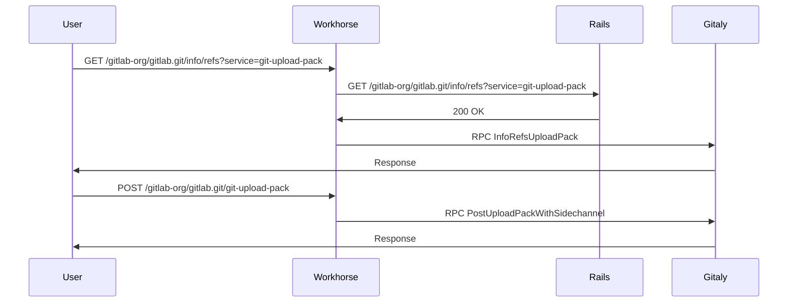
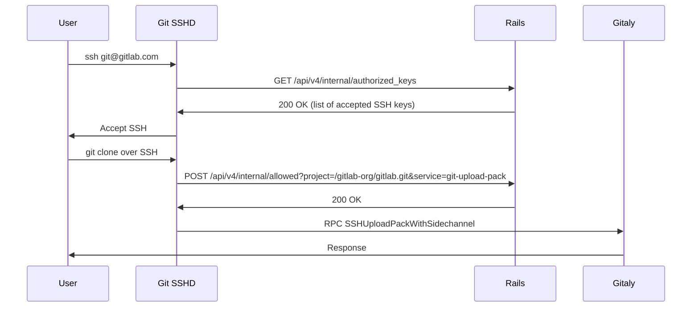
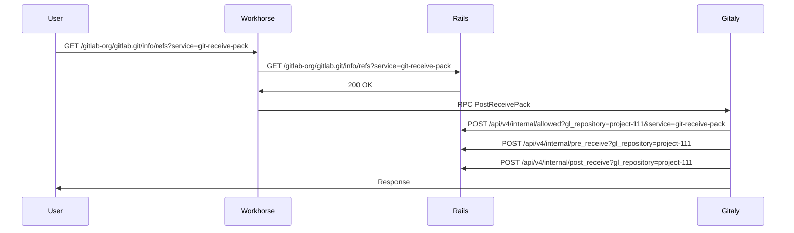
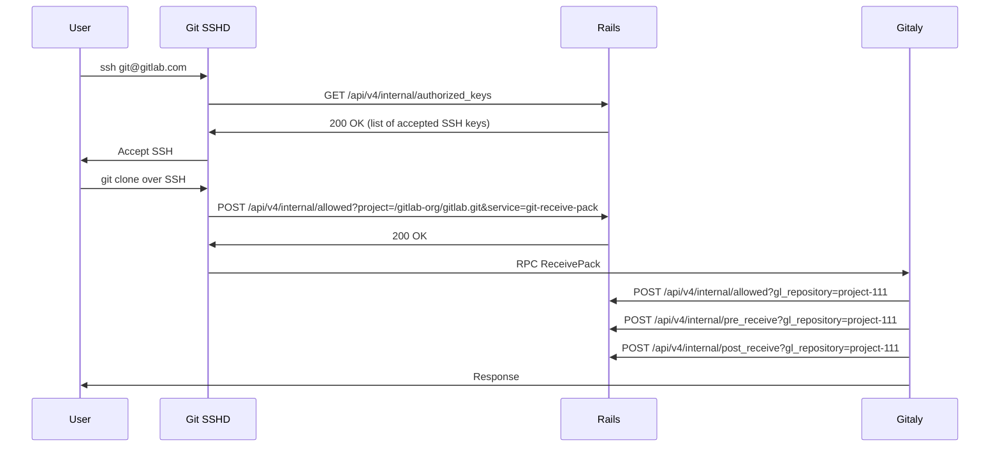
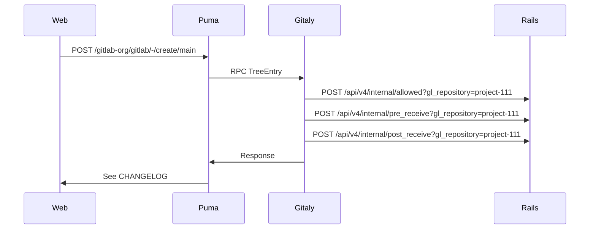

{}
このドキュメントは作業中であり、Cells 設計の非常に初期の状態を示しています。重要な側面はまだ文書化されていませんが、今後追加する予定です。これは Cells に対して考えられるアーキテクチャの一つであり、どのアプローチを実装するかを決定する前に代替案と比較検討する予定です。このアプローチを実装しないと決定した場合でも、そのアプローチを選ばなかった理由を記録するため、このドキュメントは保持されます。
{}

このドキュメントでは、Cells アーキテクチャがすべての Git アクセス（HTTPS と SSH 経由）パターンに与える影響について説明し、それらの機能が Cells と適切に連携するためにどのように変更されるべきかを解説します。

## 1. 定義

Git アクセスはアプリケーション全体で行われます。システムによる操作（Git リポジトリの読み取り）やユーザーによる操作（Web IDE 経由の新しいファイルの作成、コマンドラインからの `git clone` または `git push`）の場合があります。Cells アーキテクチャでは、すべての Git リポジトリは Cell のローカルであり、リポジトリを別の Cell と共有することはできません。

Cells アーキテクチャでは、すべての Git 操作はデータを保持する Cell によってのみ処理される必要があります。つまり、Web インターフェース、API、または GraphQL を介した操作は正しい Cell にルーティングされる必要があります。また、`git clone` または `git push` 操作は Cell のコンテキストでのみ実行できます。

## 2. データフロー

GitLab が今日 Git リポジトリに対して実行するさまざまな操作があります。これは、影響をよりよく表現するために今日の動作のデータフローを説明しています。

Git アクセスは、プロジェクトにスコープされた少数のエンドポイントへの変更のみを必要とするようです。異なるタイプのリポジトリがあります：

- プロジェクト：グループに割り当て
- Wiki：プロジェクトに割り当てられた追加リポジトリ
- デザイン：Wiki と同様、プロジェクトに割り当てられた追加リポジトリ
- スニペット：リポジトリを保持するための仮想プロジェクトを作成し、おそらくユーザーに紐づく

### 2.1. HTTPS 経由の Git clone

実行：HTTPS 経由の `git clone`

### 2.2. SSH 経由の Git clone

実行：SSH 経由の `git clone`

### 2.3. HTTPS 経由の Git push

実行：HTTPS 経由の `git push`

### 2.4. SSHD 経由の Git push

実行：SSH 経由の `git clone`

### 2.5. Web 経由のコミット作成

リポジトリへの `Add CHANGELOG` の実行：

## 3. 提案

Cells ステートレスルーターの提案では、曖昧なパス（ルーティング不可）はルーティング可能にする必要があります。つまり、少なくとも以下のパスはルーティング可能なエンティティ（プロジェクト、グループ、または Organization）を導入するために更新する必要があります。

変更：

- `/api/v4/internal/allowed` => `/api/v4/internal/projects/<gl_repository>/allowed`
- `/api/v4/internal/pre_receive` => `/api/v4/internal/projects/<gl_repository>/pre_receive`
- `/api/v4/internal/post_receive` => `/api/v4/internal/projects/<gl_repository>/post_receive`
- `/api/v4/internal/lfs_authenticate` => `/api/v4/internal/projects/<gl_repository>/lfs_authenticate`

ここで：

- `gl_repository` は `project-1111`（`Gitlab::GlRepository`）になれます
- `gl_repository` は GitLab Shell によって実行されるリポジトリへのフルパス（`/gitlab-org/gitlab.git`）の場合もあります

## 4. 評価

Cell が自身のリポジトリのみにアクセスできる場合の Git リポジトリのサポートは、複雑ではないようです。主要な複雑さはスニペットのサポートですが、これはおそらくユーザーの個人名前空間をサポートするアプローチと同じカテゴリに分類されます。

### 4.1. メリット

1. HTTPS/SSH およびフックをサポートするために使用される API は明確に定義されており、簡単にルーティング可能にできます。

### 4.2. デメリット

1. リポジトリオブジェクトの共有は、特定の Cell と Gitaly ノードに限定されます。
1. Cell 間のフォークはサポートできない可能性があります（調査：今日、異なる Gitaly ノード間でこれがどのように機能するか）。

## 5. フォークとオブジェクトプール

Cells アーキテクチャで対処する必要がある最大の課題の一つは、フォークの処理方法です。現在、Gitaly はオブジェクトプールを活用してフォークストレージの重複排除を提供しています。フォークがフォーク元のリポジトリと同じストレージノードに作成されない場合、実質的にリポジトリの 2 つの完全なコピーが存在し、オブジェクトプールを使用してパフォーマンスを向上させることができないため、大幅なストレージ非効率が生じます。

一方の Cell のストレージノードが別の Cell のストレージノードと通信できないため、Cell 間のフォークは不可能です。したがって、フォークされたリポジトリがアップストリームの親リポジトリと同じ Cell（および同じ Gitaly ノード）に置かれるようにする必要があります。これにより、Gitaly はストレージとパフォーマンスの効率を提供するためにオブジェクトプールを引き続き利用できます。

### 5.1. 現在の動作

**単一の Gitaly ストレージノード**

現在、単一の Gitaly ストレージノードでバックアップされた GitLab インスタンスの場合、フォークは問題なく機能します。フォークは 1 つしかないため、必ず同じストレージノードに存在する必要があり、オブジェクトの重複排除（およびオブジェクトプール）はすべて期待どおりに機能します。

**シャーディングされた Gitaly ストレージ**

シャーディングされた Gitaly ストレージとは、複数の Gitaly ストレージノードが単一インスタンスに接続され、ノード間の優先度の重み付けに基づいてリポジトリが割り当てられる場合です。

Gitaly はクロスストレージフェッチを行う方法を知っているため、シャード間のフォークは問題なく機能します。

**Gitaly クラスター**

Gitaly クラスターについては、親リポジトリと同じストレージノードにオブジェクトプールが作成されない [Issue](https://gitlab.com/gitlab-org/gitaly/-/issues/5094) を最近解決しました。これにより、効率の観点（オブジェクトプールを共有できる）とオブジェクトの重複排除の観点（Git がストレージを適切に重複排除できる）からフォークが正しく機能するようになりました。
