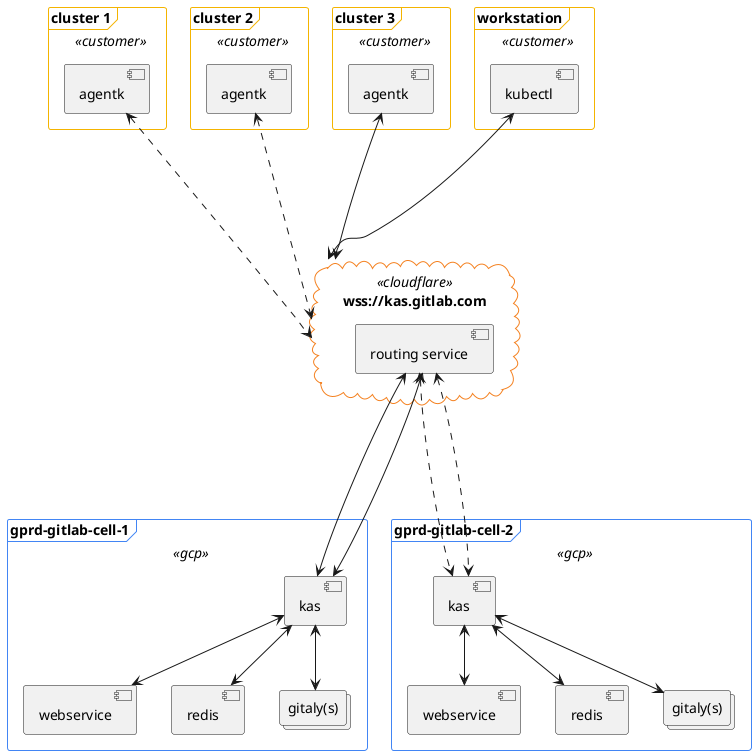
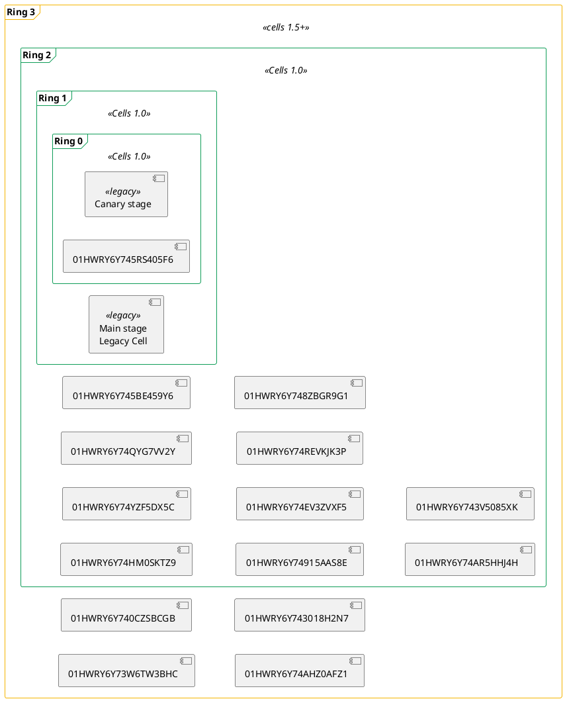
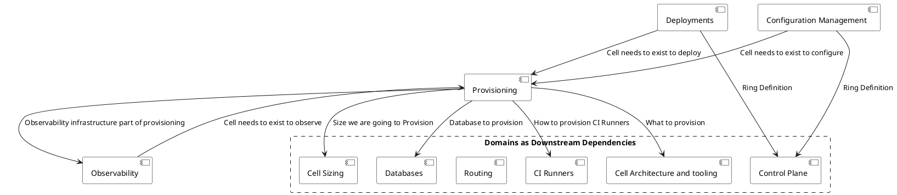



## 事前学習

1. [Cells イテレーション](../_index.md#cells-iterations)、特に `Cells 1.0`
1. [GitLab Dedicated](https://about.gitlab.com/dedicated/)
1. [GitLab Dedicated アーキテクチャ](https://gitlab-com.gitlab.io/gl-infra/gitlab-dedicated/team/architecture/Architecture.html)

## 哲学

- **デフォルトでセルローカル**: すべてのサービスはセルローカルにすべきであり、セルローカルでない正当な理由が文書化されていない限り、グローバルであってはなりません。
  セルローカルを維持することで、Cell とサービス間の通信が内部にとどまり、サービスはより小さなスケールで動作し、爆発半径がはるかに小さくなります。
  例: Gitaly と GitLab Registry はセルローカルです。
- **均質な環境**: 現在のところ、すべての GitLab Cell は同じ外観であるべきです。ブートストラップとプロビジョニングは自動化された方法で行われるべきです。
  最初のイテレーションではすべての Cell が同じサイズであり、異なるサイズを実行することにはメリットがありますが、複雑さとスコープが増します。
- **フレッシュスタート、でもそれほどでもない**: 新しい GitLab インスタンスが作成されるため、すべてをやり直したくなります。既存のインフラストラクチャ、Dedicated ツール、そして時間のバランスを取る必要があります。
- **すべての操作が同じようにロールアウトされる**: 設定変更、フィーチャーフラグ、デプロイメント、および運用タスクは、理想的にはすべて変更をロールアウトする同じプロセスを通じて行われます。
  1 つのやり方を持つことで効率化と自動化の唯一の情報源をもたらします。
- **ツールの一元化**: GitLab.com を管理するためのツールと GitLab Dedicated のための別のツールが多数あり、
  サイロ化、作業の重複、移植性の低下を招いています。
  GitLab.com に複数の Cell をプロビジョニングする必要があり、新しいツールが必要で、GitLab Dedicated はそのために専用ツールを構築しました。
  このツールをできる限り使用するように努め、同意できないことがあれば[不同意、コミット、そして再び不同意する](/handbook/values/#disagree-and-commit)ようにして 1 つのツールを改善すべきです。
  欠点があるツールから始めることは問題ありません。イテレーション的なアプローチにより、2 つではなく_1 つ_の成熟した製品が生まれます。

## 用語集/ユビキタス言語

[ユビキタス言語](https://martinfowler.com/bliki/UbiquitousLanguage.html)

- `Provision`（プロビジョン）: 新しい Cell を作成するとき。例: Cell 5 を_プロビジョン_しました。これは全く新しい Cell です。
- `Deploy`（デプロイ）: 既存の Cell の中で実行されているコードを変更するとき。例: GitLab.com で新しい auto-deploy バージョンを_デプロイ_しました。
  - [ブループリント](deployments.md)
- `Configuration change`（設定変更）: アプリケーションまたはインフラストラクチャの設定を変更するとき。例: VM に追加されたラベルに対して_設定変更_を行いました。
- `Tenant`（テナント）: GitLab Dedicated ツール（[Instrumentor](https://gitlab.com/gitlab-com/gl-infra/gitlab-dedicated/instrumentor)）を通じてプロビジョニングされた GitLab インスタンス。テナントは GitLab Dedicated 顧客インスタンス_または_ Cell インスタンスのどちらかです。
- `Cell`（セル）: 複数の顧客が単一のテナントを通じてサービスを受ける GitLab.com の一部となるようにプロビジョニングされたテナント。
- `Legacy Cell`（レガシーセル）: 既存の GitLab.com デプロイメント。
- `Ring`（リング）: 単一のデプロイメントステージターゲットとしてグループ化された Cell の集合。例: リング 2 の Cell はリング 1 の Cell の後に変更をデプロイします。
- `Cluster`（クラスター）: Cell の集合と既存の GitLab.com インフラストラクチャ。例: クラスター内の Registry のバージョンを変更する必要があります。
- `Fleet`（フリート）: 本番環境を構成する、シングルテナントとマルチテナントの両方を含むすべての SaaS 環境の集合。
  既存の GitLab.com インフラストラクチャ、Cell、および Dedicated が含まれます。

## アーキテクチャ

```plantuml
@startuml
!include <k8s/Common>
!include <k8s/Context>
!include <k8s/Simplified>
!include <k8s/OSS/all>
!include <gcp/GCPCommon>
!include <gcp/Compute/all>
!include <gcp/Databases/all>
!include <gcp/Security/all>
!include <gcp/Storage/all>

skinparam actorStyle awesome
skinparam frame {
  borderColor<<gcp_project>> #4285F4
}
skinparam frame {
  borderColor<<vpc>> #F4B400
}
skinparam frame {
  borderColor<<gcp>> #0F9D58
}
skinparam frame {
  borderColor<<cluster>> #DB4437
}
skinparam cloud {
  borderColor<<cloudflare>> #F48120
}

:User:
cloud gitlab.com <<cloudflare>> {
  [DoS Protection]-->[WAF]
  [WAF]-->[RoutingService]
}
cloud "cloud.gitlab.com" <<cloudflare>> {
  [Cloud Connector]-->[AI Gateway]
}
:User:->gitlab.com
:User:->cloud.gitlab.com

cloud "ClickHouse Cloud" {
  database "ClickHouse" as cell1Clickhouse
  database "ClickHouse" as cell2Clickhouse
}

frame "Google Cloud Platform" <<gcp>> {
  frame "topology-service" <<gcp_project>>{
    rectangle "TopologyService" as TopologyService
  }
  frame "Cell Cluster" <<cluster>> {
    frame "gitlab-production" <<gcp_project>>{
      frame "gprd (Shared VPC Network)" <<vpc>> as gprdVPC {
        rectangle "Frontend" as primaryFrontend {
          node "HAProxy"
        }

        rectangle "Compute" as primaryCompute {
          node zonal [
          <b> zonal cluster x3
          ===
          api
          ---
          web
          ---
          git
          ---
          gitlab-shell
          ---
          websockets
          ---
          registry
          ]

          node regional [
          <b>regional x1
          ===
          sidekiq
          ---
          kas
          ---
          zoekt
          ---
          cny
          ---
          pages
          ]
        }

        rectangle "Storage" as primaryStorage {
          database "patroni-main"
          database "patroni-ci"
          database "patroni-registry"
          database "redis (multiples)"
          file "object storage" as primaryObjectStorage
        }

        primaryFrontend <--> primaryCompute
        primaryCompute <--> primaryStorage
      }
    }

    frame "gitlab-ci" <<gcp_project>> {
      node "runner managers" as runnerManager

      runnerManager --> "HAProxy"
    }
    frame "gitlab-ci-*" <<gcp_project>> {
      node "ephemeral VMs"
    }
    runnerManager --> "gitlab-ci-*"

    frame "gitlab-gitaly-gprd-*" <<gcp_project>> {
      file "gitaly-[1,9]" as primaryGitaly
    }
    primaryCompute <--> primaryGitaly
    primaryGitaly .r[#F4B400].* gprdVPC

    frame "cell-01HV3FBWXHSYBAR2R2" as cell1 <<gcp_project>> {
      frame "cell-01HV3FBWXHSYBAR2R2 VPC" <<vpc>> as cell1VPC {
        Cluster_Boundary(cell1gke, "cell1gke") {
          Namespace_Boundary(cell1gitlab, "gitlab") {
            KubernetesPod(cell1web, "Web", "")
            KubernetesPod(cell1shell, "Shell", "")
            KubernetesPod(cell1registry, "Registry", "")
            KubernetesPod(cell1sidekiq, "Sidekiq", "")
          }
          Namespace_Boundary(cell1Observability, "monitoring") {
            KubernetesPod(cell1Prom, "Prometheus", "")
          }
        }

        storage "Storage" as cell1Storage {
          Cloud_SQL(cell1Postgres, "PostgreSQL", "")
          Cloud_Memorystore(cell1Redis, "Redis", "")
          Cloud_Storage(cell1ObjectStorage, "GCS", "")
          Key_Management_Service(cell1SecretStorage, "GKMS", "")
          Compute_Engine(cell1Gitaly, "Gitaly", "")
        }
        cell1gke <--> cell1Storage
        cell1gke <---> cell1Clickhouse
      }
    }

    frame "cell-01HV3FBYX37C18SW05" as cell2 <<gcp_project>> {
      frame "cell-01HV3FBYX37C18SW05 VPC" <<vpc>> as cell2VPC {
        Cluster_Boundary(cell2gke, "cell2gke") {
          Namespace_Boundary(cell2gitlab, "gitlab") {
            KubernetesPod(cell2web, "Web", "")
            KubernetesPod(cell2shell, "Shell", "")
            KubernetesPod(cell2registry, "Registry", "")
            KubernetesPod(cell2sidekiq, "Sidekiq", "")
          }
          Namespace_Boundary(cell2Observability, "monitoring") {
            KubernetesPod(cell2Prom, "Prometheus", "")
          }
        }

        storage "Storage" as cell2Storage {
          Cloud_SQL(cell2Postgres, "PostgreSQL", "")
          Cloud_Memorystore(cell2Redis, "Redis", "")
          Cloud_Storage(cell2ObjectStorage, "GCS", "")
          Key_Management_Service(cell2SecretStorage, "GKMS", "")
          Compute_Engine(cell2Gitaly, "Gitaly", "")
        }

        cell2gke <--> cell2Storage
        cell2gke <---> cell2Clickhouse
      }
    }

    cell1VPC <. gprdVPC : Private Service Connect
    cell2VPC <. gprdVPC : Private Service Connect
  }

  "Cell Cluster" -u-> cloud.gitlab.com
}
[RoutingService]-[thickness=1]->TopologyService
[cell1gke]-[thickness=1]->TopologyService
[cell2gke]-[thickness=1]->TopologyService
[primaryFrontend]-[thickness=1]->TopologyService
[RoutingService]-[thickness=3]->primaryFrontend
[RoutingService]-[thickness=3]->cell1gke
[RoutingService]-[thickness=3]->cell2gke
@enduml
```

以下は Cell アーキテクチャです。現在の GitLab.com アーキテクチャ（Cell 導入前）は <https://handbook.gitlab.com/handbook/engineering/infrastructure-platforms/production/architecture/> で確認できます。

### KAS

### リング

`リング`は、プロビジョニングする Cell と既存のインフラストラクチャをどのようにグループ化するかというメンタルモデルの基礎となります。
リングの内部には X 個の Cell があり、後続のリングはより多くの Cell を含み、フリート全体を段階的にカバーします。
各リングは前のリングのスーパーセットになります。
例えばリングゼロにはリングゼロの Cell のみが含まれ、
リング 5 には `リング 5` の Cell とその前のすべてのリングが含まれます。
変更は内側のリングから外側のリングへと段階的にカスケードします。
例えば変更が `リング 5` に達した場合、リング 4、3、2、1 にも達しています。

どのタイプのロールアウトも `リング 0` から始まり、変更が成功すれば後続のリングに移行します。
失敗した場合はロールアウトを停止でき、すべての顧客に影響を与えません。
このような段階的なロールアウトにより、以下のメリットが得られます:

1. 変更の爆発半径が小さくなり、すべての顧客に一度に影響を与えません。
1. 変更をロールアウトする方法に明確な境界があります。
1. [ステージング](#staging)のような異なる環境を持つ必要がなくなり、すべての Cell が本番環境になります。
1. 変更への信頼度が高まるほど、対象者が広がります。

[Cells 1.0](../iterations/cells-1.0.md) では、`リング 2` 内に最大 10 個の Cell を目標としています。
リング内の Cell 数は任意であり、そのサイズはまだ決定されていません。
[公開リリース前に auto-deploy パッケージを適切にテストする](deployments.md#package-rollout-policy)必要性、
セキュリティ修正のための本番ロールアウトの速度、
そしてユーザーへの障害やバグからの保護を考慮します。

最終的にはリングを使って Cell 環境での[すべての変更の管理](managing_changes.md)に使用します。

#### ステージング

リングには従来のステージング環境がありません。
なぜなら、最初のリングで変更をテストできるため、同じ結果が得られるからです。
これは既存のステージング環境をシャットダウンするという意味ではなく、
Cell 以外のインフラストラクチャには引き続き使用されます。

この設定により、現在ステージングで抱えているいくつかの問題を解消できます:

1. ステージングは本番環境の真の表現ではありません。
1. デプロイメントをブロックするため、ステージングを本番として扱っています。
1. ステージングの設定が本番から逸脱する可能性があります。

## 大規模ドメイン

インフラストラクチャは多面的であり、すべてのチームが Cell インフラストラクチャの設定に役割を持っています。

`信頼度` 列は、特定のドメインとその Cell に向けた方向性についてどれだけ自信があるかを示しています。
ブループリントがマージされた場合、そのドメインに方向性を提供するブループリントがあるため、信頼度は 👍 に移行するのが理想的です。

| ドメイン                           | オーナー                             | ブループリント                                                                 | 信頼度 |
|----------------------------------|-----------------------------------|---------------------------------------------------------------------------|------------|
| ルーティング                          | group::tenant scale               | [ブループリント](../http_routing_service.md)                                   | 👍         |
| Cell コントロールプレーン               | group::Delivery/team::Foundations | To-Do                                                                     | 👎         |
| Cell サイジング                      | team::Scalability-Observability   | [To-Do](https://gitlab.com/gitlab-com/gl-infra/scalability/-/issues/2838) | 👎         |
| CI ランナー                       | team::Scalability-Practices       | [ブループリント](runner.md)                                                    | 👎         |
| データベース                        | team::Database Reliability        | [ブループリント](postgresql.md)                                                | 👍         |
| デプロイメント                      | group::Delivery                   | [ブループリント](deployments.md)                                               | 👍         |
| オブザーバビリティ                    | team::Scalability-Observability   | [ブループリント](observability.md)                                             | 👎         |
| Cell アーキテクチャとツール    | team::Foundations                 | [ブループリント](cell_arch_tooling.md)                                         | 👍         |
| プロビジョニング                     | team::Foundations                 | To-Do                                                                     | 👎         |
| 設定管理/ロールアウト | team::Foundations                 | To-Do                                                                     | 👎         |
| 障害復旧                | team::Production Engineering       | [ブループリント](disaster_recovery.md)                                        | 👎         |

## ステークホルダー

Cell の運用には複数のチームが参加しています。
最初の区別は、ツールを実装・保守するチームと、それらのツールを使用するチームの間です。

| エリア                                             | 機能                                                  | オーナー                          |
|---------------------------------------------------|-----------------------------------------------------------|---------------------------------|
| Dedicated ツールとの統合*                 |                                                           |                                 |
|                                                   | リリースマネージャーのワークフローとの統合              | team::Delivery-Deployments      |
|                                                   | `Instrumentor` と `AMP` を使用したデプロイメントの仕組み       | team::Foundations               |
|                                                   | Cell アプリケーションの参照アーキテクチャとオーバーレイ     | team::Ops                       |
|                                                   | Cell のブートストラップ、ツール、および補助インフラストラクチャ | team::Ops                       |
|                                                   | Cell のデプロビジョニング                                       | team::Ops                       |
| クラスター状態のコントロールプレーン**                 |                                                           |                                 |
|                                                   | GitOps モデルの調査                                  | team::Delivery-Deployments      |
|                                                   | `CRD` + オペレーターの調査                              | team::Delivery-Deployments      |
| リングベースのデプロイメント自動化                  |                                                           |                                 |
|                                                   | リング境界内での変更の伝播               | team::Delivery-Deployments      |
|                                                   | リング境界外での変更伝播のオーケストレーション  | team::Foundations               |
|                                                   | 緊急ブレーキ: パッケージロールアウトの停止               | team::Delivery-Deployments      |
| ロールバック機能                             |                                                           |                                 |
|                                                   | ダウンタイムありのロールバック（リング 0 の QA Cell 向け）            | team::Delivery-Deployments      |
|                                                   | ロールバックサポートのための遅延ポストデプロイマイグレーション       | group::environment automation    |
| オブザーバビリティ                                     |                                                           |                                 |
|                                                   | Cell ヘルスメトリクス                                        | team::Scalability-Observability |
|                                                   | フリートヘルスメトリクス                                       | team::Scalability-Observability |
|                                                   | パッケージ状態                                            | team::Delivery-Deployments      |
| インシデントライフサイクル管理                     |                                                           |                                 |
|                                                   | エンジニア・オン・コールへのページング                                   | team::Ops                       |
|                                                   | インシデントツール                                          | team::Ops                       |
| ネットワークエッジ                                      |                                                           |                                 |
|                                                   | Web アプリケーションファイアウォール                                  | team::Foundations               |
|                                                   | CDN                                                       | team::Foundations               |
|                                                   | 負荷分散とネットワーキング                             | team::Foundations               |
|                                                   | レート制限                                             | team::Foundations               |

> \* これらのアイテムは、SaaS プラットフォームとコアプラットフォームのさまざまなステークホルダーからの貢献が必要な場合があります。ステークホルダーはオーナーチームと顧客チームのニーズを満たすための適切なアライメントを確保するためにこの作業を緊密に連携すべきです。
>
> \*\* これらのアイテムは Cell 2.0 イテレーション後の検討事項です。

これらの機能のユーザーは、リリースマネージャー、エンジニア・オン・コール、および Team:Ops です。
以下のリストは、これらのグループが Cell クラスターで実行できるタスクを定義しています:

1. リリースマネージャー
   - 境界内のデプロイメントの指揮
   - 「graduated」パッケージの宣言
   - 境界内のデプロイメントのロールバック
1. エンジニア・オン・コール
   - 失敗したデプロイメントのアラート受信
   - パッケージロールアウトの一時停止（次のリングへの到達を阻止）
   - 失敗したデプロイメントの調査の推進
1. Team::Ops
   - Cell のブートストラップ
      - プロビジョニング
      - デプロビジョニング
      - 再バランシング
      - Cell とリングの関連付け
