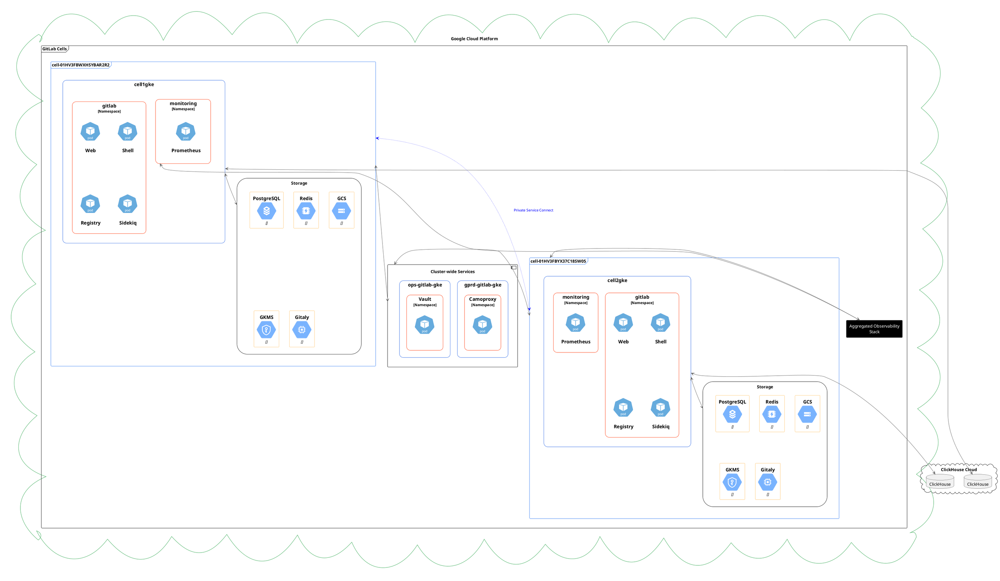
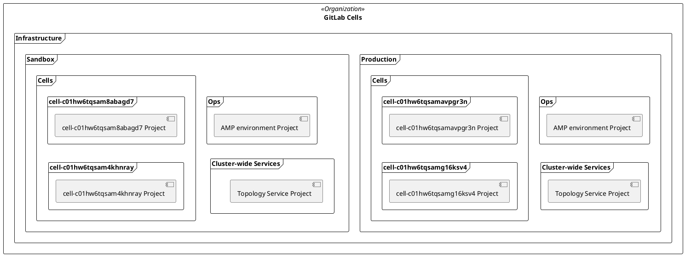
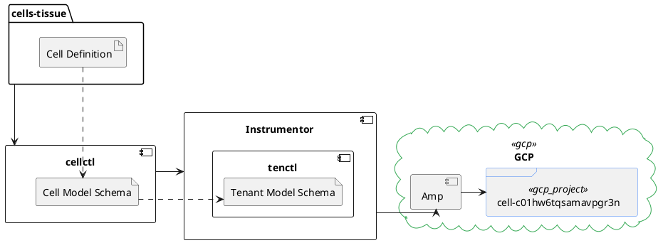
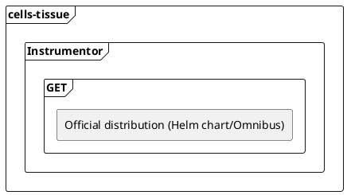
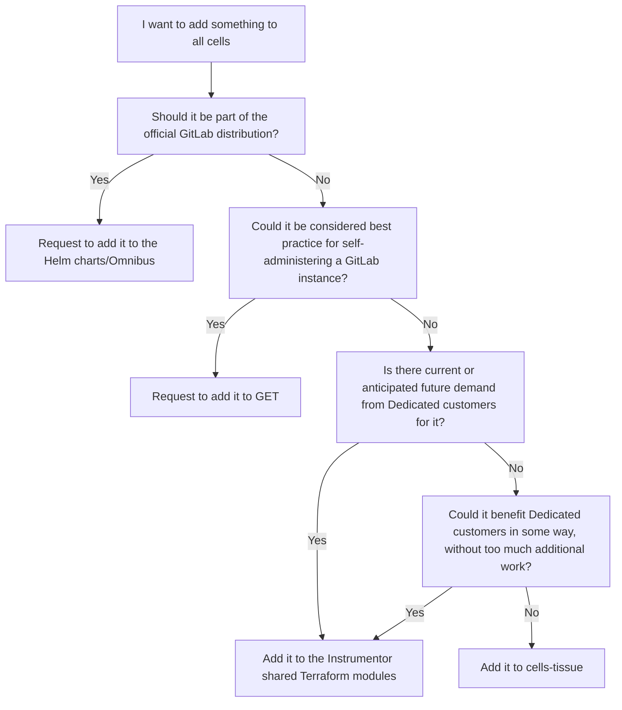

<div class="my-3 border-l-4 border-blue-500 bg-blue-50 px-4 py-3 rounded-r text-sm text-blue-800">
このページには今後予定されている製品・機能・機能性に関する情報が含まれています。ここに示す情報は参考目的のみです。購入・計画の決定にこの情報を使用しないでください。製品・機能・機能性の開発、リリース、タイミングは変更または延期される可能性があり、GitLab Inc. の独自の判断に委ねられています。
</div>

<div class="overflow-x-auto my-4">
<table class="w-full text-sm border-collapse">
<thead>
<tr class="bg-gray-100 text-left">
<th class="px-3 py-2 border border-gray-300">Status</th>
<th class="px-3 py-2 border border-gray-300">Authors</th>
<th class="px-3 py-2 border border-gray-300">Coach</th>
<th class="px-3 py-2 border border-gray-300">DRIs</th>
<th class="px-3 py-2 border border-gray-300">Owning Stage</th>
<th class="px-3 py-2 border border-gray-300">Created</th>
</tr>
</thead>
<tbody>
<tr>
<td class="px-3 py-2 border border-gray-300"><span class="inline-block rounded px-2 py-0.5 text-xs font-medium bg-gray-100 text-gray-700">proposed</span></td>
<td class="px-3 py-2 border border-gray-300"><a href="https://gitlab.com/pguinoiseau" class="text-blue-600 hover:underline">@pguinoiseau</a>, <a href="https://gitlab.com/jcstephenson" class="text-blue-600 hover:underline">@jcstephenson</a>, <a href="https://gitlab.com/ayeung" class="text-blue-600 hover:underline">@ayeung</a></td>
<td class="px-3 py-2 border border-gray-300"><a href="https://gitlab.com/sxuereb" class="text-blue-600 hover:underline">@sxuereb</a>, <a href="https://gitlab.com/andrewn" class="text-blue-600 hover:underline">@andrewn</a></td>
<td class="px-3 py-2 border border-gray-300"><a href="https://gitlab.com/product-manager" class="text-blue-600 hover:underline">@product-manager</a>, <a href="https://gitlab.com/sabrams" class="text-blue-600 hover:underline">@sabrams</a></td>
<td class="px-3 py-2 border border-gray-300"><span class="inline-block rounded px-2 py-0.5 text-xs font-medium bg-gray-100 text-gray-700">~devops::data stores</span></td>
<td class="px-3 py-2 border border-gray-300">2024-03-22</td>
</tr>
</tbody>
</table>
</div>


## サマリー

このブループリントは、Cell のアーキテクチャ、どのコンポーネントがセルローカルまたはグローバルに管理されるか、そして新しい Cell をプロビジョニングするために既存と新しいツールがどのように使用されるかを説明します。

各 Cell のコアは、本質的に GitLab.com の Cell クラスターの一部を形成するように設定された Dedicated インスタンスです。これにより、既存の Dedicated ツール（具体的には Instrumentor と Amp）を初期 Cell のプロビジョニングと設定に再利用できます。一方、Dedicated に依存することの結果として、Cell が内部的にどのようにアーキテクチャされるかなど、多くの決定がすでに行われています。

Foundations チームは新しいツール（仮名 `cellctl`）を開発します。これは Cell とやり取りしたい呼び出し元が使用します。これにより、呼び出し元が Cell の構築方法についての知識を必要としなくなります。クライアントに Cell モデルスキーマ（基本的に Dedicated テナントモデルスキーマの縮小版で、追加の Cell 関連フィールドが加えられたもの）を提示することでこれを実現し、Dedicated ツールが使用できる Dedicated テナントモデルスキーマに変換されます。`cellctl` は Terraform を使用して、GCP リソースがリソース階層内の適切な場所に配置されるようにする責任も持ちます。`cells-tissue` は引き続き Cell 定義の情報源となります。

Cell ロールアウトの初期段階では、セルローカルインフラストラクチャの別のプロビジョニングプロセスを持つ必要はないと考えていますが、Cell と Dedicated の要件が大きく乖離した場合に Instrumentor 内で統合しきれなくなった場合に備えて、そのオプションは残しています。

## 動機

GitLab.com のスケーラビリティの限界に達していることはしばらく前から明らかでした。ノイジーネイバーの問題が多発し、基礎インフラストラクチャは、蓄積された未対処の技術的負債により SRE に膨大な作業負荷を要求しています。

これらの問題を軽減するために、現在のモノリシックなアーキテクチャを、テナント間の高いレベルの分離を提供しながら、ユーザーへの体験はほぼ変わらない回復力のある水平スケーラブルなマルチテナントアーキテクチャ（「Cells」）に置き換えることを目指しています。この変更により、データ所在地などの顧客要件の実装も可能になります。

また、これを行う中で、GitLab のデプロイ方法においてある程度の均質性を実現しようとしています。現在 GitLab.com では、Helm、Chef、Tanka、Terraform など、プロビジョニングに多数の異なるツールが使用されています。Cell は GitLab Dedicated テナントのプロビジョニングに使用されるツールを使用するため、Cell のプロセスへの改善は Dedicated 顧客にも適用でき、その逆も同様です。

### ゴール

このブループリントは以下を行います:

- 各 Cell のアーキテクチャを説明する
- 特定のアーキテクチャ上の決定が行われた理由を列挙する
- Cell プロビジョニングのために既存と新しいツールがどのように使用されるかを広く説明する

### 非ゴール

以下はスコープ外です:

- Cell プロビジョニングまたは設定管理の詳細 - 簡潔さのために別のブループリントで対応されます
- プロセスの変更（例: どのチームがどのタスクを担当するか）
- ツールの低レベル実装の詳細
- モノリスから Cell への移行
  - モノリスと Cell を並行して実行する方法

## 提案

- 各 Cell は、事実上、GitLab.com の他の部分とシームレスに連携できる独自の GitLab Dedicated インスタンスですが、その Cell で利用可能なリソースのみを使用することに制限されています。Cell 上のユーザーは基礎リソースの分離を感じません
- Dedicated ツール（Instrumentor と Amp）が新しい Cell のプロビジョニングに使用されます
  - 将来的な混乱を最小限に抑えるため、共通の Terraform モジュールは現在の Instrumentor リポジトリから分割され、代わりにベンダー化されます。Foundations は Dedicated チームとモジュールの共同オーナーシップを持ちます
  - Cell 用に別の Amp 環境がセットアップされます
- `cellctl` は Foundations によって開発されるツールで、Cell モデルスキーマを Dedicated テナントモデルスキーマに変換し、Instrumentor を呼び出してテナントをプロビジョニングおよび設定します。`cellctl` のユーザーは Cell の基礎インフラストラクチャを意識する必要がありません
  - `cellctl` は GCP のリソース階層が `cells-tissue` で定義された階層と一致するようにする責任も持ちます

## 設計と実装の詳細

### アーキテクチャ



#### コンポーネント

各 Cell には、期待されるワークロードに合わせて適切なサイズの GitLab の [Cloud Native Hybrid デプロイメント](https://docs.gitlab.com/ee/administration/reference_architectures/50k_users.html#cloud-native-hybrid-reference-architecture-with-helm-charts-alternative)が含まれています。これは、GET の上にオーケストレーションレイヤーとして機能する Dedicated ツール [Instrumentor](https://gitlab.com/gitlab-com/gl-infra/gitlab-dedicated/instrumentor) を介した [GitLab Environment Toolkit (GET)](https://gitlab.com/gitlab-org/gitlab-environment-toolkit) によって提供されます。

Cell の定義（各 Cell のサイズ、含まれるコンポーネントなど）は、すでに多数の Cell とリングの定義が含まれている [`cells-tissue` リポジトリ](https://gitlab.com/gitlab-com/gl-infra/cells-tissue)に保存されます。

| サービス | 実行場所 |
|---------|---------|
| Webservice | Kubernetes |
| Sidekiq | Kubernetes |
| 補助サービス | Kubernetes |
| Gitaly | Google Compute Engine VM |
| PostgreSQL | CloudSQL |
| Redis | Memorystore |
| オブジェクトストレージ | Google Cloud Storage |
| Cell ごとのオブザーバビリティスタック | Kubernetes |
| Cell 間ネットワーキング | Private Service Connect |
| ClickHouse | ClickHouse Cloud |

グローバルコンテキストを持つ補助サービス（つまり、個々の Cell に固有でないデータを処理するサービス）は、Cell とは完全に独立してライフサイクルが管理されます。そのようなサービスには以下が含まれます:

- Hashicorp Vault（CI で使用されるシークレットの保存と管理、およびオブザーバビリティスタックで使用されるものなどの共有インフラストラクチャシークレット）
  - [`config-mgmt`](https://ops.gitlab.net/gitlab-com/gl-infra/config-mgmt/-/tree/main/environments/vault-production) を使用して設定され、[`gitlab-helmfiles`](https://gitlab.com/gitlab-com/gl-infra/k8s-workloads/gitlab-helmfiles/-/tree/master/releases/vault) にデプロイされた既存の[本番 Vault インスタンス](https://vault.gitlab.net)を使用します。
- Camoproxy（[アセットのプロキシ](https://docs.gitlab.com/ee/security/asset_proxy.html)用）
  - [`gitlab-helmfiles`](https://gitlab.com/gitlab-com/gl-infra/k8s-workloads/gitlab-helmfiles/-/tree/master/releases/camoproxy) にデプロイされた既存の Camoproxy インスタンスを使用します。

#### Cell の命名規則

ID フィールドは、[Dedicated テナントモデル](https://gitlab.com/gitlab-com/gl-infra/gitlab-dedicated/tenant-model-schema/-/blob/main/json-schemas/tenant-model.json)と [GCP プロジェクト命名](https://cloud.google.com/resource-manager/docs/creating-managing-projects)による制限のため、最大 30 文字しか使用できません。
これにより、Cell 名に含めることができるメタデータの種類が制限されます。例えば、リージョン名を含めることができません。

これを念頭に置いて、Cell はテナント ID として [ULID](https://github.com/ulid/spec) を使用し、17 文字に切り詰め、小文字にして `c` をプレフィックスとして付けます。例えば、単一の Cell の ID は `c01hw6tqsamavpgr3n` になります。

人間が読みやすいように `cell-` をプレフィックスとしたより見やすい名前が使用されます。例えば GCP プロジェクト名などです。例えば、Cell の ID が `c01hw6tqsamavpgr3n` の場合、その綺麗な名前は `cell-c01hw6tqsamavpgr3n` になります。

ID の長さにより、単一の Cell に関連する追加の GCP プロジェクト（必要な場合）の名前付けに使用できる追加の 7 文字が許可されています。例えば、Cell がランナーまたは Gitaly リソース用に追加のプロジェクトを必要とする場合、30 文字の制限内に収まりながら次のように命名できます:

- `cell-c01hw6tqsamavpgr3n-rnr123` または `cell-c01hw6tqsamavpgr3n-runner`
- `cell-c01hw6tqsamavpgr3n-git594` または `cell-c01hw6tqsamavpgr3n-gitaly`

詳細については[この Issue](https://gitlab.com/gitlab-com/gl-infra/production-engineering/-/issues/25065) を参照してください。

#### GCP プロジェクトとの関係

各 Cell は、Cell 間の分離を高め、管理を簡素化するために GCP 内に独自のプロジェクトを持ちます。これは、テナントごとに 1 つの GCP プロジェクトを想定している既存の Dedicated ツールとも一致しています。

詳細については[この Issue](https://gitlab.com/gitlab-com/gl-infra/production-engineering/-/issues/25067) と [この ADR](../decisions/002_gcp_project_boundary.md) を参照してください。

#### ネットワーキング

各 Cell は独自の VPC を持ち、リージョンごとに 1 つのサブネットがあります。

Cell ごとに 1 つの VPC を持つことで、IP アドレス空間の重複の問題を心配する必要がなくなり、Cell のプロビジョニングと管理が容易になり、完全に分離されるため Cell がデフォルトで安全になります。

Cell 間で必要な場合は [Private Service Connect](https://cloud.google.com/vpc/docs/private-service-connect) を使用して通信します。Cell がどのように接続されているかを指定する定義は、`cellctl` が必要なリソースをプロビジョニングするために使用する Cell 定義と一緒に保持されます。

詳細については[この Issue](https://gitlab.com/gitlab-com/gl-infra/production-engineering/-/issues/25069) と [この ADR](../decisions/004_vpc_subnet_design.md) を参照してください。

#### GCP 組織

Cell を専用にホストするための新しい GCP 組織（仮名 `GitLab Cells`）が作成されます。既存の `gitlab.com` 組織と同じ集中課金アカウントを使用しますが、新しい組織配下のすべてのリソースと権限は Terraform を使用して権威的に制御され、必要なチームメンバーのみにアクセスが制限されます。管理者アクセスはブレークグラスの状況でのみ許可され、完全に監査可能です。

これは、多くの異なるチームが依存しており（ビジネスクリティカルな何かを壊すリスクがある）、Terraform によって部分的にしか管理されていない既存の組織を徹底的に監査して統合するよりも好ましいと判断されました。詳細については[この Issue](https://gitlab.com/gitlab-com/gl-infra/production-engineering/-/issues/25282) を参照してください。

#### クラウドリソース階層

Cell ツール（`cellctl`）は `GitLab Cells` 組織の下にクラウドリソース階層を作成・維持する責任があります。この階層は [`cells-tissue` リポジトリ](https://gitlab.com/gitlab-com/gl-infra/cells-tissue)内の定義のファイルシステム階層を反映すべきです。

この階層では、すべての環境が独自のフォルダを持ち、そのフォルダには `Ops` フォルダと `Cells` フォルダが含まれます。

各 Cell は `Cells` フォルダ内にその（綺麗な）ID で名付けられた独自のフォルダを持ちます。これにより、将来的にセル固有のコンポーネント（ランナーや追加の Gitaly ノードなど）の新しいプロジェクトをフォルダに追加し、関連する Cell とグループ化するオプションが得られます。

`Ops` フォルダには Amp 環境 GCP プロジェクトが含まれます。



#### Cell を提供する GKE クラスター数

各 Cell は 1 つの GKE クラスター上で動作します。Cell 間およびCell へのルーティングがシンプルになります。Helm チャートは複数のクラスターにまたがって 1 つのアプリケーションインスタンスをデプロイすることをサポートしておらず、GET は 1 つのクラスターに複数のアプリケーションインスタンスを管理することをサポートしていません。

詳細については[この Issue](https://gitlab.com/gitlab-com/gl-infra/production-engineering/-/issues/25068) と [この ADR](../decisions/003_num_gke_clusters_per_cell.md) を参照してください。

#### Cell のシークレット管理

シークレット管理には Google Secret Manager と Hashicorp Vault の両方を使用します。

Secret Manager は単一の Cell に固有のシークレットを保存し、特定の GCP プロジェクトにスコープされます。

Hashicorp Vault は複数（またはすべて）の Cell で共有されるシークレットを保存します。そのようなシークレットにはオブザーバビリティスタックの認証情報が含まれる場合があります。

すべての Kubernetes シークレットは [`external-secrets`](https://github.com/external-secrets/external-secrets) を使用してインジェクトされ、直接プロビジョニングされ_ません_。

詳細については[この Issue](https://gitlab.com/gitlab-com/gl-infra/production-engineering/-/issues/25076) を参照してください。

#### Cell インフラストラクチャへのアクセス

Cell の基礎インフラストラクチャの多くは GCP 上の Dedicated インスタンスから派生しており、そのため手順は両プロジェクト間で広く共有されます。

必要に応じて GCP リソースへのアクセスを提供するために [GCP の PAM (IAM) 機能](https://cloud.google.com/iam/docs/pam-overview)を使用します。

デフォルトでは GCP リソースへのアクセスはありません。

プロジェクトレベルと組織レベルの両方で権限を昇格するための 3 つのエンタイトルメントが利用可能です:

| 名前         | 承認が必要 | 目的                                                                                         |
|--------------|-------------------|-------------------------------------------------------------------------------------------------|
| `readonly`   | いいえ                | GCP リソースへの読み取り専用アクセス。機密リソースへのアクセスは含まれません               |
| `admin`      | はい               | 運用作業に必要な SRE アクセスのためのピアレビュー済み管理者アクセス                    |
| `breakglass` | いいえ                | 承認者がいないインシデント時に SRE EOC がリソースへのブレークグラス管理者アクセスを行うため |

権限昇格はログに記録され監査されます。

詳細については[この Issue](https://gitlab.com/gitlab-com/gl-infra/gitlab-dedicated/team/-/issues/4625) を参照してください。

#### オブザーバビリティ

一般的に、Cell のオブザーバビリティコンポーネントのライフサイクルは[オブザーバビリティチーム](/handbook/engineering/infrastructure-platforms/production-engineering/observability/)が所有します。

デフォルトでは、各 Dedicated テナントには完全に機能する Prometheus/Grafana スタックがプロビジョニングされます。Cell はこのスタックを再利用し、複数の Cell にまたがってクエリを実行できるようメトリクスを集約する予定です。詳細は[こちら](https://gitlab-com.gitlab.io/gl-infra/gitlab-dedicated/team/engineering/observability/metrics.html)を参照してください。

詳細については[この Issue](https://gitlab.com/gitlab-com/gl-infra/production-engineering/-/issues/25267) を参照してください。

#### Cell 固有の設定

テナントモデルの単一の値を使用して、テナントが GitLab.com の Cell になるか Dedicated テナントになるかが決定されます。[ADR: 011](../decisions/011_cell_specific_configuration.md) に示されているように `cell_id` を使用します。

### ツール

#### Cells 1.0

Cells 1.0 のマイルストーンを最短時間で達成するために、Foundations は以下を行います:

- Instrumentor モノリポから Dedicated GCP インスタンスに必要な Terraform モジュールを抽出する
  - 各モジュールは独自のリポジトリに分割され、Instrumentor の外部 Terraform モジュールとしてベンダー化されます
  - その後、Dedicated チームと Foundations の両方がこれらのモジュールの保守を担当します
- 適切な変数をテンプレート化できるよう、Cell の参照アーキテクチャとその関連 Jsonnet ファイルを Instrumentor に追加する
- Cell をオーケストレーションするために、仮名 `cellctl` と呼ばれる新しいツールを開発する
  - Cells 1.0 では、`cellctl` は単純に薄い変換ラッパーとなり、独自の Cell テナントモデルを [Dedicated が使用するテナントモデルスキーマ](https://gitlab.com/gitlab-com/gl-infra/gitlab-dedicated/tenant-model-schema/-/blob/main/json-schemas/tenant-model.json)の意見を持ったインスタンスに変換します
  - Cell モデルは [Dedicated が使用するテナントモデルスキーマ](https://gitlab.com/gitlab-com/gl-infra/gitlab-dedicated/tenant-model-schema/-/blob/main/json-schemas/tenant-model.json)の意見を持った派生であり、`cellctl` のオーケストレーターが使用するための追加の Cell 固有フィールドが含まれます
- Cell のプロビジョニング専用に GCP に新しい Amp 環境をセットアップする



[`ringctl`](https://gitlab.com/gitlab-com/gl-infra/ringctl) などの他のツールは、`cellctl` とインターフェースして、Cell の実装またはオーケストレーションの詳細を意識せずに 1 つまたは多数の Cell に対して操作を実行できます。

#### Cell テナントモデル

Cell のテナントモデルはこの構造に従い、2 つのコアフィールドに分割されます:

- Cell インスタンスを識別するために使用される情報（名前とラベル）、および使用するテンプレートなどのツール固有の情報を含むメタデータ構造体。ラベルは、Cell が属するリングなど、他のツールに関連する情報を保存するために使用できます。
- Cell インスタンスの定義に関する情報（インスタンスを作成する場所を含む）を含む spec 構造体。

```go
// Model entry point
type Cell struct {
  metadata CellMetadata
  spec     CellSpec
}

// Contains fields specific to Cells
type CellMetadata struct {
  // The identifier of the cell
  name string
  // Optional template specifier
  //
  // If this is not set then the template must be provided
  // externally.
  template *string `json:",omitempty"`
  // Additional annotations
  //
  // To be used for defining features and passing additional
  // context through to the cell template.
  annotations map[string]string `json:",omitempty"`
  // Additional labels

  // Used to add human understandable context to cell instances.
  // Can be used to perform searches across cell instances.
  labels map[string]string `json:",omitempty"`
}

// Contains fields related to the definition of the cell through the dedicated tooling
type CellSpec struct {
  // Primary GCP project ID
  project_id string
  // The region we want this cell to be provisioned within
  region string
  // Reference architecture
  reference_architecture string
  // Instrumentor version
  instrumentor_version *string `json:",omitempty"`
  // GitLab version
  gitlab_version *string `json:",omitempty"`
  // Prerelease version
  prerelease_version *string `json:",omitempty"`
}
```

`cellctl` は YAML ファイルからこれらの Cell インスタンス定義を処理し、Amp と Instrumentor を通じてプロビジョニングするためのテナントモデルを出力する jsonnet テンプレートのマッピングレイヤーを介して変換します。

これらの Cell 定義ファイルは、すべての Cell インスタンスの「グローバル」ビューで追加のインフラストラクチャを作成するために、`cellctl` と同じプレーンの他のツールによっても処理できます。

#### Cells 1.0 以降

Cell が徐々に構築されるにつれ、Dedicated テナントと Cell の要件が乖離し、これを Instrumentor に統合しようとすると許容できない複雑さが生じる可能性があります。これにより、Foundations が開発・保守する Cell 固有のツールによってプロビジョニングおよび管理される追加のリソースレイヤーが必要になる場合があります。

##### Cell にはどこに実装すべきか?

単一の Cell を構成するコンポーネントのリソース定義を含む 4 つの場所があります。それぞれが前の場所の上に構築されています:



Cell を構築していくにつれ、何かを追加する最適な場所について必ず疑問が生じます。以下のチャートが決定を助けるでしょう:


