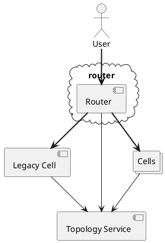
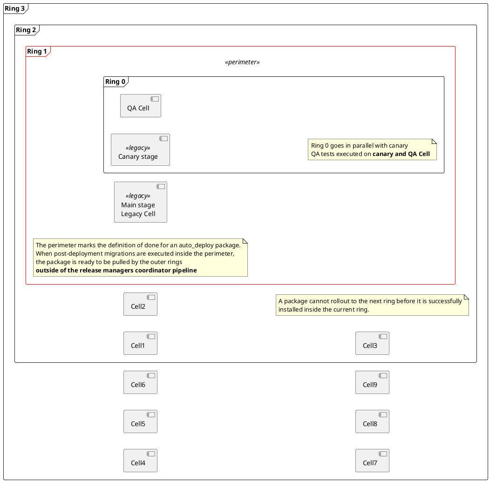
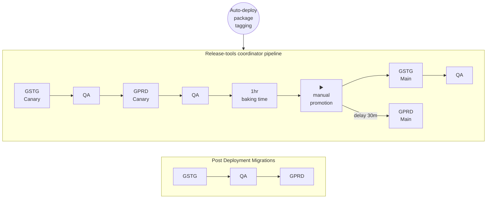
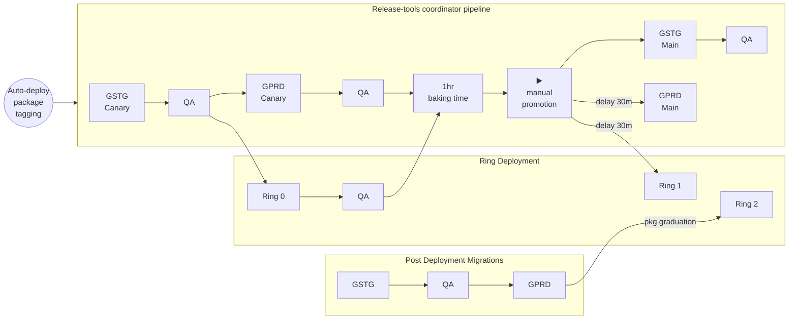
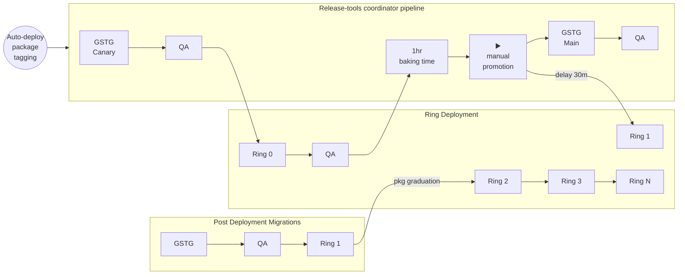
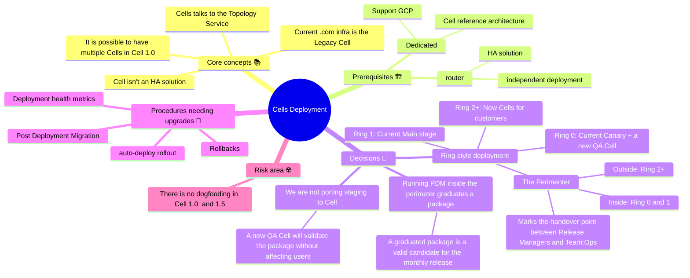
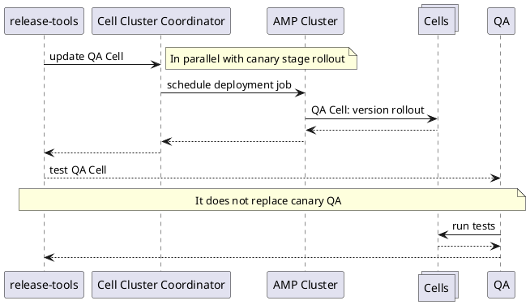
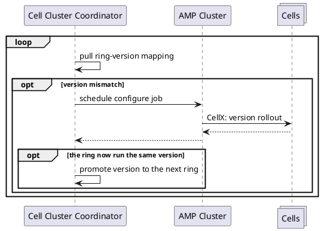



免責事項: このブループリントはより多くのクロスファンクショナルなアライメントが必要です - **信頼度レベル:** 低

このブループリントは、Cell アーキテクチャによって導入された新しいスケーリングの次元をサポートできるデプロイメント戦略を説明します。

この移行の複雑さにより、このアーキテクチャで本番グレードの評価に達するために必要な機能のオーナーシップを持つ、Platforms セクションの多くのチームが参加する必要があります。

## はじめに

### 前置き

高レベルの視点から、Cell クラスターは 3 つのアイテムのみで構成されるシステムです:

1. **ルーター** - GitLab アプリケーションとは独立してデプロイされた HA ルーティングシステム。
1. **レガシーセル** - 既存の GitLab.com インフラストラクチャ。
1. ゼロ以上の **Cell** - 限られた数の Organization の権威となる GitLab インストール。これらの Cell は GitLab Dedicated ツールを使用してデプロイされます。
1. **トポロジーサービス** - クラスター全体のユニークネスとリソース分類に使用される HA システム。

図からわかるように、ユーザーはルーターのみを通じてシステムと対話します。Cell はトポロジーサービスと通信し、操作に必要なすべてのデータベース行のローカルコピーを持ちます。

Cell が GitLab Geo をサポートしていても、ルーターがサポートするまでこの機能をユーザーに提供できないことに注意することが重要です。

### キーワード

- デプロイメント - インフラストラクチャにインストールされる GitLab アプリケーションとそのコンポーネント
- `auto-deploy` バージョン - デプロイ可能なパッケージを作成するアクティブバージョン
- リング - Cell クラスターの論理パーティション。次のリングにデプロイするには、パッケージが現在のリング内で検証される必要があります。
- `perimeter`（境界）- リリースマネージャーにとっての「完了の定義」を示すリング。境界内で検証されたパッケージは、フリートの残りの部分にロールアウトすることが許可されます。
- `graduated` バージョン - 境界外の Cell にデプロイするのに安全とみなされたバージョン
- `.com` - 既存の実行中のインフラストラクチャ
- レガシーセル - 既存の GitLab.com インフラストラクチャ。
- Cell(s) - 限られた数の Organization の権威となる GitLab インストール。GitLab Dedicated ツールを使用してデプロイされます。

### リングデプロイメント

Cell プロジェクトのデプロイメントのスケールと強力なユーザーパーティショニングは、[リングデプロイメント](https://configcat.com/ring-deployment/)アプローチとよく合致します。

上の画像では、レガシーセルと Cells 1.0 マイルストーンの上限である 10 個の Cell で構成されるクラスターでの可能なリングレイアウトを示しています。

一般的なルールは:

1. デプロイメントプロセスはリング 0 から外側のリングに進みます。
1. リングはデプロイメントに関連する同じリスクファクターを共有する Cell の集合です。
1. デプロイメントはどの段階でも停止でき、パッケージは外側のリングに到達しません。
1. リリースマネージャーにとっての「完了の定義」を示す「境界」リングを定義します。
    - 境界を超えることは、PDM が Main Stage で正常に実行された後の特定のパッケージライフサイクルの論理的な時点です。実際には、このドキュメントで説明しているリング 1 とリング 2 の間です。
    - 境界内でのポストデプロイマイグレーションの正常な実行は、パッケージを `graduated` としてマークします。
    - `graduated` パッケージは月次リリースの有効な候補です。
    - `graduated` パッケージは残りのリングに自動的にロールアウトされます。
    - デプロイメントは自動化される必要があります: 境界内はリリースマネージャーの責任で、境界外は Team:Ops の責任です。

#### アプリケーション変更のライフサイクル

このセクションでは、新しいパッケージが新しいインフラストラクチャにデプロイされる方法を説明し、既存のツールとプロセスとの相互作用とフックを説明します。

GitLab.com のデプロイメントプロセスは[ハンドブック](../../../deployments-and-releases/deployments/)に詳しく説明されています。リングデプロイメントについて話すために必要なことに認知負荷を減らすために、ここでは簡略化します。

##### 現在のプロセス

現在 GitLab.com のデプロイメントは 2 つの主要なプロセスで構成されています:

1. **release-tools コーディネーターパイプライン**は auto-deploy パッケージのデプロイメントと QA をステージングおよび本番環境を通じて順序付ける責任があります。このプロセスのタイムラインは利用可能なリリースマネージャーによって異なりますが、通常は 1 日に 10 回行われます。
1. **ポストデプロイメントマイグレーション**パイプラインは本番環境で実行中の現在のパッケージのポストデプロイメントマイグレーションを実行し、デプロイされた変更の品質保証を完了します。このプロセスは、環境をロールバックできなくなるポイントを示すため、通常 1 日 1 回しか実行されません。

パッケージはポストデプロイメントマイグレーションを実行した後にのみセルフマネージド顧客にリリースできます。

##### レガシーインフラストラクチャと Cell の共存

しばらくの間、既存の（レガシー）デプロイメントと Cell が共存します。当初、リングデプロイメントの実装は 3 つのリングのみで構成されます:

- リング 0: QA Cell をホストし、最終的には他の実験的なビルドもホストします。このリングはレガシー本番 Canary ステージと同期を保ちます。
- リング 1: レガシー本番 Main ステージの空のプレースホルダー。既存のレガシーデプロイメントからユーザーを抽出し始めることができるにつれ、このリングは私たち自身、フリーユーザー、そして一般的に私たちの新機能への迅速なトラックに興味がある Organization をホストできます。
- リング 2: 顧客向けの最初の Cell をホストします。

リリースプロセスの性質上、これらの最初のリングは既存の release-tools ツールによって制御されます。

##### 将来 - Cell のみ

完全性のために、レガシーインフラストラクチャが廃止され、すべてのユーザーが新しい Cell に移行された将来のシナリオも説明します。

これはプロジェクトの進化に伴って変更される可能性があります。例えば、ステージング環境の将来は Cell の開発によって影響を受ける可能性がありますが、ここではドキュメントのスコープを減らすためにそのままにしています。

共存シナリオからの変更点は以下のとおりです:

1. リング 2 以降に新しいリングが存在します。パッケージの進行は各リングのゲートを強制するリングデプロイメントエンジンによってコーディネートされます。
1. release-tools コーディネーターパイプラインはリングのみを管理し、本番環境に Canary と Main ステージの概念はなくなります。
1. ポストデプロイメントマイグレーションパイプラインはリング 1 でのマイグレーション実行を制御します（プロジェクトのこの段階では不要なさらなる議論に依存します）。

### 参考資料

- [Cell 1.0 ブループリント](https://gitlab.com/gitlab-org/gitlab/-/blob/master/doc/architecture/blueprints/cells/iterations/cells-1.0.md)
- [このブループリントのマージリクエスト](https://gitlab.com/gitlab-org/gitlab/-/merge_requests/141427)
- [Cells に関する Delivery の観点](https://gitlab.com/gitlab-com/Product/-/issues/12770)
- [Cells 以前の GitLab.com デプロイメントプロセス](https://gitlab.com/gitlab-com/content-sites/handbook/-/blob/21f6898110466b5c581a881db0ce343bf9cb1a72/content/handbook/engineering/deployments-and-releases/deployments/index.md)

## ゴールと非ゴール

### ゴール

- リリースマネージャーの認知負荷の増加を制限します。そのために、パッケージがリリースマネージャーの責任でなくなる明確な引き継ぎポイントとして境界を定義しました。
- Cell クラスターをリングに分割することで障害の爆発半径を制限し、各リング間で自動検証が行われます。
- デプロイメントが確実に自動化されるようにします
- 失敗したデプロイメントの自動処理を確保します
- パッケージロールアウトとデプロイメントへのオブザーバビリティを提供します

### 非ゴール

- Cell アプリケーションデプロイメントのオーナーシップを持つように `release-tools` を拡張すること。より小さく特定のソフトウェアにより、ツールを 1 つの仕事に集中させることができます。
- リリース管理に関連する大きな変更を導入すること
- Cell のライフサイクル管理
- Cell への/からのトラフィックルーティングの管理
- 個々のコンポーネントのデプロイ

## 要件

Cell をデプロイメントパイプラインに統合する前に、いくつかのアイテムがすぐに必要です:

1. ルーターが存在し、HA であり、独立したデプロイメントパイプラインを持つ必要があります
    - 適切なテストに必要です。以下に述べるように、QA がテストを実行するデプロイメントを向けるための QA Cell が必要です。ルーターは QA テストを適切な Cell にルーティングする必要があります。
1. アセットのデプロイメント
    - これは今日の .com にすでに存在します。今日は HAProxy で処理されていますが、Cell では、ルーティングレイヤーが同様の方法でアセットをリダイレクトする責任者になります。
    - アセットが異なる方法で管理されることを選択した場合、これは Delivery がゼロダウンタイムアップグレードに近い方法でアセットをデプロイする方法と、アセットへのルーティングをサポートするための Cell インストールの設定の両方を変更します。
1. フィーチャーフラグ
    - 現在のフィーチャーフラグのワークフローとツールがレガシーセルでそのまま機能し、Cell は影響を受けないと仮定しています。
    - インシデントを軽減するためのフィーチャーフラグの使用はレガシーセルのみに制限されます。
    - Cell が長期間フィーチャーフラグでドリフトしないようにするためにツールが成熟する必要がある場合があります。これにより、顧客の作業が Cell をまたいで展開される場合に同様の体験が保証され、オペレーターとして、フィーチャーフラグの背後にあるコードの相違とバージョンドリフトおよびその影響について心配する必要がなくなります。
    - この領域にはさらなるガイダンスとドキュメントの開発が必要です。エンジニアは Organization がどの Cell に属するかを気にすべきではありません。したがってフィーチャーフラグのトグルは、エンジニアが気にする必要性を抽象化します。

## 提案されたアクションプラン

デリバリーの観点から、提案された 3 つの Cell イテレーション（1.0、1.5、2.0）間にあまり変化はありません。分割は、特定の Cell にバインドされた Organization で利用可能な機能のスコープを削減するイテレーション的なアプローチです。デプロイメントの観点からは、最初のイテレーションから複数の Cell を持つことが可能なはずなので、Cell アーキテクチャバージョンから独立したロードマップを把握する必要があります。

### イテレーション

#### Cells 1.0

このイテレーションの意図は、Cell を構築・統合する独自のツールの構築と統合に努力を集中することです。以下のマイルストーンとその終了基準は、Platforms セクションの協力的な取り組みであり、多くのチームにまたがっています。

1. Dedicated テクノロジースタックの拡張:
    - Instrumentor と AMP が GCP をサポート
    - Cell が Instrumentor で参照アーキテクチャとして定義される
1. Cell のコントロールプレーン - Cell クラスターコーディネーター
    - Switchboard は現在 Dedicated によって活用されていますが、Cell には適切なツールではありません。Dedicated が作成した他のツール `amp` と `instrumentor` の機能を評価して、デプロイメントワークフローにどのように統合できるかを判断する必要があります。
    - Cell デプロイメントを実装して Cell の全インフラストラクチャを収束させる（現在の dedicated 機能）
    - リングの概念を実装する: 最初はリング 0 とリング 2 のみ
1. 最初の Cell: リング 0 の QA Cell
    - コーディネーターを介して QA Cell へのデプロイメントを実行するための現在のツールとの統合を構築する
    - QA Cell が独自の QA スモークテストを実行する
    - QA Cell は本番 Canary ステージと並行して更新される: QA Cell の失敗はソフトとみなされ auto_deploy をブロックしない
1. Cell のコントロールプレーン - 個別のダッシュボードとアラート
    - オブザーバビリティが少なくともレガシーインフラストラクチャと同等である
    - アラートが少なくともレガシーインフラストラクチャと同等である
1. 最初の顧客 Cell: リング 2
    - release-tools が PDM 実行後にパッケージを `graduate` できる
    - コーディネーターがリング 2 のデプロイメントを管理できる
1. 複数の Cell のサポート
    - コーディネーターが同じリング内の複数の Cell を希望するバージョンに収束させることができる

> - 制限事項:
>   - すべての Cell が同じリング、リング 2 に入ります
>   - ロールバックは可能ですが、すべての Cell でダウンタイムが必要です

#### Cells 1.5 と 2.0

以下の機能は Cell 1.5 と 2.0 の間に分散できます。これらはすべて運用面を改善するものであり、Cell の運用について学ぶにつれて優先順位を付ける必要があります。

1. Cell のコントロールプレーン - 追加のリング
    - Cell を複数のリングにまたがって展開できる
    - 現在のリングが収束した後、次のリングへのデプロイメントが自動的に開始される
    - 緊急ブレーキ: 次のリングへのパッケージロールアウトをブロックする機能
1. QA Cell が auto-deploy のブロッカーになる
1. Cell のコントロールプレーン - クラスターダッシュボードとアラート
    - ダッシュボードには、任意の Cell とリングのデプロイメントで期待されるパッケージが表示されるべきです
    - 希望するバージョンを実行していない Cell は容易に可視化され、合理的な時間内に収束しない場合はアラートが発生するべきです
    - リング内のパッケージロールアウトをブロックするためのデプロイメントヘルスメトリクス（4 つのゴールデンシグナルの z スコア？）
1. Cell でロールバックを実行できるようにするために、ポストデプロイマイグレーション（PDM）のステップをアプリケーションデプロイメントから分離する必要があります。
    - この機能がないと、ロールバックを正常に完了するために Cell がダウンタイムを被る必要があります。これは破壊的であり、賢明な解決策とは考えられません。
    - レガシーセル上での PDM の分離はすでに希望通りに機能しています。したがってレガシーセルはインシデントを軽減するためのオプションとしてロールバックを持ちます。
1. GitLab アプリケーションのみをデプロイすることを可能にする修正されたツール。現在デプロイされる予定のツールは、インフラストラクチャと GitLab のバージョンを含む Cell のインストール全体を収束させる戦略を採用しており、これにより CI パイプラインが長くなり、ジョブの実行時間が長くなります。
1. 自動ロールバック - 何らかの理由でデプロイメントが失敗した場合、影響を受けた Cell への混乱を最小化するために自動的にロールバック手順が開始されるべきです。このためにはヘルスメトリクスを使用できるべきです。

ここでの焦点は、構築されたものを本番化し、最初のイテレーションの MVP 段階で発生した技術的負債の領域をクリーンアップすることです。

#### マインドマップ

#### デプロイメントコーディネーターと Cell クラスターコーディネーター

`auto deploy` のコンテキストでは、`release-tools` プロジェクト内に外部コーディネーターパイプラインがあり、各ジョブのための特定のツールを呼び出してパッケージの生成とロールアウトのオーケストレーションを担当します。

今日の GitLab.com インフラストラクチャでは、デプロイメントは SRE とリリースマネージャーが独立して操作できる特定のツール（`deployer` と `gitlab-com/k8s-workloads`）によって実行されており、Cell クラスターの導入によりシンプルなクラスター概要、パッケージロールアウトの状態、フィーチャーフラグの設定、プロビジョニングとデプロビジョニングなどの新しい運用上の課題に直面します。

GitLab Dedicated スタックは、主に Switchboard、Amp、Tenctl という一連のツールを通じて、GitLab のインストールを制御する独自の方法を持っています。Switchboard の使用は Cell 向けに設計されておらず、そのため活用できません。Instrumentor と Amp などの他のツールは、Dedicated チームと Cell の両方で使用できるよう、より移植性を高めるための修正が加えられる場所があるかもしれません。スケジュールされた作業の状況によっては、最初の期間や Cell の MVP において要件が満たされるよう、チームの境界を越えて密接に協力するチームメンバーによる非常に協力的な取り組みになる可能性があります。

このパラグラフでは、更新される希望バージョンを含むデータストアが更新され、Cell デプロイメントをサポートするために Cell クラスターコーディネーターが作成される理想的な相互作用を説明します。

Cell 1.0 では、境界内に 1 つの Cell、QA Cell があります。
オンデマンドで Cell の更新を実行するための何らかのツールを指示するために release-tools を拡張するべきです。

前述の通り、リング 1 でポストデプロイメントマイグレーションを実行すると、release-tools はそのバージョンを `graduated` としてマークし、境界外にロールアウトできるようになります。

Cell クラスターコーディネーターは、デプロイ前後の自動チェックにより希望するリングの正しい Cell にデプロイし、デプロイ後もインスタンスが正常であることを確認し、障害の場合はロールバックし、必要なチームへのアラート発報を行うことで、さらなるリングへの自動バージョンアップグレードのコーディネーションを支援します。

### 手順

#### Auto-Deploy

Auto-deploy は、レガシーセルが既存の .com インフラストラクチャと同等であるため、今日と同様に機能し続けます。したがって、auto-deploy に関連する既存の手順（ホットパッチ、ロールバック、auto-deploy ピッキング、PDM、既存の auto-deploy スケジュールなど）は引き続き活用できます。PDM が実行された後、`release-tools` が次のリングへのデプロイメントをトリガーするよう新しい手順が追加されます。現在 `release-tools` はリングデプロイメントに関連するものを何も理解していないため、この機能を追加する必要があります。

- Auto-deploy はリング 0 とリング 1 に制限されます:
  - リング 0 には QA Cell と .com インフラストラクチャの Canary ステージが含まれます
  - リング 1 には .com インフラストラクチャの Main ステージが含まれます - これは release tools のカットオフです
  - すべての Cell は同じ方法でデプロイされます。これにより異なるデプロイメントテクノロジーを扱う必要がなくなります
  - `release-tools` はコーディネーターパイプラインの一部としてリング 0 へのデプロイメントをパイロットするためにコーディネーターと連携します
- Release-tools はパッケージを `graduate` できる必要があります:
  - `graduate` バージョンの GitLab とは、Main Stage の本番環境に正常にデプロイされ、[ポストデプロイマイグレーション（PDM）](https://gitlab.com/gitlab-org/release/docs/-/blob/master/general/post_deploy_migration/readme.md)が完了した任意の `auto-deploy` バージョンです。
  - これは毎日 1 つのパッケージを Cell にデプロイすることを意味します。現在、PDM は 1 日 1 回しか実行されません。このルールには例外があることに注意してください。
  - これにより、アプリケーションコードが問題である可能性がある高重大度インシデントを軽減するための既存の手順を使用できます。
  - auto-deploy よりもはるかに遅く生成されるため、公式にリリースされたバージョンの GitLab を実行したくはありません。したがってインシデント対応の SLA を見逃すリスクがあります。Cell アーキテクチャでは、ほとんどの問題はレガシーセルで見つかり、Cell にデプロイされる前に修正されるはずです。
  - 手動テストで問題が見つかった場合に、`graduated` とラベル付けされたパッケージのデプロイを実際には中断できる能力を持てるよう、新しい手順、ランブック、ドキュメントが必要です。
  - QA が問題を見つけて自動デプロイメントを実行できるようにする必要があるため、現実的にこれらの失敗ケースを追跡することが賢明です。

現在、いくつかの小さなコンポーネントが .com インフラストラクチャに自分自身をデプロイしていることに注意してください。特に Zoekt、Container Registry、Mailroom には、.com に新しいバージョンを提供する独自のサイクルがあります。この側面は Cell には引き継がれません。なぜなら、現在活用されるツールはこの機能を有効にするためのコンポーネントの分離を許可しないからです。代わりに、`auto-deploy` パッケージを構築したデフォルトブランチで指定されている現在の定義済みバージョンに依存します。これはリリースの達成方法を模倣しており、Cell にうまく引き継がれるはずです。

#### ロールバック

長期的には、Cell が障害のデプロイメントや、デプロイ後に気づいた障害を軽減するためのロールバックのための猶予期間を与えられるようにデプロイメントツールを修正することを目指すべきです。現在、レガシー .com またはレガシーセルでは、PDM をリリースマネージャーの裁量で 1 日 1 回実行します。Cell へのデプロイメントを実行するツールは現在 PDM を実行しない方法がないため、特定の Cell でダウンタイムを引き起こさずにロールバックする方法は現在存在しません。この領域では手順とツールのアップデートが必要です。

#### ホットパッチ

ホットパッチは問題を軽減する能力の 1 つの源泉です。`graduate` バージョンに依存する場合、ホットパッチは Cell には使えません。ただし、レガシーセルには引き続き活用できます。しかし、より安全なデプロイメント方法論のためにホットパッチを排除できれば賢明です。

> 参考として、2023 年の本番環境でのホットパッチは 1 回のみです。

#### デプロイメントヘルスメトリクス

現在、.com レガシーインフラストラクチャまたはレガシーセルの Main ステージへのデプロイメントは自動化していません。運用オーバーヘッドを削減するために、特定のインストールの健全性指標を形成し、適切な時間に自動的にデプロイメントをトリガーできる既存のメトリクスに依存できるべきです。このデプロイメント健全性指標は各 Cell にも持ち込まれる必要があります。さまざまなリングでデプロイメントをトリガーするツールは、前のリングの状態と次のターゲットリングの健全性状態を認識して、デプロイを継続または停止すべきかどうかを判断する必要があります。

#### フィーチャーフラグ

フィーチャーフラグについては [data-stores#83](https://gitlab.com/gitlab-org/enablement-section/data-stores/-/issues/83) で議論されています。

#### パッケージロールアウトポリシー

現在の auto-deploy の使用によって駆動される暗黙の手順があります。これは
Cell でより目立つようになります。上記のさまざまな形式で示唆されているように、
auto-deploy は今日の動作と比較的同様に動作します。Cell は
トリガーが異なる領域にある既存の `release-tools` パイプラインへの追加となります。
何をいつトリガーするかを明確に定義する必要があります。Cell は GitLab の `graduated` バージョンのみを受け取ることが期待されます。したがって、
パッケージが `graduated` とみなされる際のゲートキーパーとして、ポストデプロイメントマイグレーションパイプラインの使用を活用します。理想的には、
PDM がレガシーセルで正常に実行された時点で、そのパッケージは
`graduated` とみなされ、任意の外側のリングにデプロイできます。この同じコンセプトは
セルフマネージド顧客向けのリリースを構築する際にすでに活用されています。このブレークポイントはリリースマネージャーにとってすでに自然であり、したがって Cell のデプロイメントへの良い引き継ぎです。

Cell にできるだけ早くデプロイすることを目指すべきです。単一のリングに存在するすべての Cell に対して、並行してデプロイする能力を持つべきです。そうすることで Cell 間のバージョンドリフトが最小化され、潜在的な問題が減少します。バージョンが大きくドリフトした場合、auto-deploy は自動停止し、なぜ大幅に遅れているかの調査が始まります。この状況については事前に把握していることが理想的です。PDM 1 つに対して 1 回の Cell へのデプロイメントが期待値であるため、`graduated` パッケージの遅れは 1 パッケージ以内に抑えるべきです。PDM がスキップされる日もあります。Cell のデプロイメントへの影響を判断するために、PDM が停止された理由をケースバイケースで評価する必要があります。

境界外のリングはオーケストレーションエンジンによって自己管理されます。`release-tools` がパッケージを graduated させると、それを忘れることができます。オーケストレーションエンジンは境界外の最初のリングであるリング 2 のすべての Cell に希望する GitLab バージョンを収束させ、すべての Cell が収束した場合のみ次のリングに移行します。

#### 選択された Helm チャートのアップデート

現在、Instrumentor は GitLab Environment Toolkit のデフォルト動作を使用して、使用する Helm チャートのバージョンを推定します。
.com は現在、テストまたはドッグフーディングのためにリリース前の未公開バージョンの Helm チャートを活用しているため、これは Cell には適していません。
Cell での機能の同等性を維持するために、この機能を Dedicated スタックに追加する必要があります。
この機能の実装に向けた議論と推進のためのブループリントが Dedicated のチームブループリントで提案されています [Enabling Prerelease Helm Chart Selection](https://gitlab-com.gitlab.io/gl-infra/gitlab-dedicated/team/architecture/blueprints/cell-chart-enhancement.html)

### FAQ

**開発者は MR がさまざまな Cell にデプロイされる際に指標が表示されますか？**

いいえ。現在のラベリングスキーマは主に、コミットが本番環境に到達したこと、PDM が正常に実行されたことを示すためのものです。これは観察されたコミットがセルフマネージド顧客向けのリリースに配置するのに安全であることを示します。この時点に達した後、パッケージの問題は最小限であるべきなので、多数のリングへの進行に伴って Issue/MR の状態を更新する必要はありません。開発者はどのバージョンがどの Cell にデプロイされているかを気にする必要はありません。

**P1/S1 の問題が存在する場合、Cell でどのように軽減しますか？**

Cell はまだ .com の一部であるため、既存の
[バグ](/handbook/product-development/how-we-work/issue-triage/#severity-slos)
および[脆弱性](/handbook/security/product-security/vulnerability-management/sla/)
の修正に関する SLA が適用されます。`graduated` とみなされるものであれば、Cell に何でもデプロイできます。高優先度の問題が発生した場合、既存の手順を活用してコードベースと特定の auto-deploy ブランチを更新して軽減し、追加のテストラウンドや遅いロールアウトの後に、その auto-deploy パッケージを Cell にデプロイできます。これにより今日活用しているのと同じ軽減方法が提供されます。これが引き起こす問題は、完全に検証されていないコードが存在する可能性があることです。この場合はロールバックに頼ることができ、次の auto-deploy ラウンドのために必要なパッチを再検討し、Cell の修正を別途試みることができます。

**開発者の観点からどのような変更が期待されますか**

リリースと Auto-Deploy の手順は概ね同じままです。コードが到達する場所が変わります。この領域の変更は、GitLab のさまざまな環境やステージが変化し始める Iteration 2.0 に近づくほど最大になります。

**最後のティアを除くすべてのティアでデプロイが失敗した場合、すべての Cell でそのパッケージのロールバックをトリガーするのは何ですか？**

これは、おそらくイテレーションして開発するプロセスのさまざまな特性に依存します。例えば、最初のティアの最初の Cell で失敗した場合、その Cell を調査するだけでなく、これがすべての Cell に対して系統的でないことを確認する必要があります。これはケースバイケースでしか対処できません。最後のティアと最後の Cell に到達して何らかの障害が発生した場合、アプリケーションの障害を見つけるのに十分な時間が経過しているはずなので、他の Cell をロールバックする理由はないはずです。

**セルフマネージドリリースはどうなりますか？**

理論的にはあまり変化しません。現在、セルフマネージドにリリース可能であることが確定した変更の証明の場として本番環境または .com の Main ステージを使用しています。これは Cell アーキテクチャでも同じ場所に変わりません。語彙が変わるため、この場合 `graduated` パッケージはリリースに安全とみなされます。

**PreProd はどうなりますか**

このインスタンスは、リリース候補を作成する際に GitLab パッケージと Helm チャートのハイブリッドインストールを具体的にテストします。リリースがタグ付けされる前の最終ステップです。これは Cell の作業によって影響を受けません。ただし、preprod の管理方法が変わる可能性があります。

**ステージングはどうなりますか**

ステージングは QA とともにデプロイメントの長期インスタンステストには重要です。
仮説的には、ステージングはティア 0 へのデプロイメントに取って代わって完全になくなる可能性があります。上記の Iteration 3 を参照してください {+TODO: 適切なリンクを追加する+}

**Ops はどうなりますか**

変更の必要はありません。しかし Cell の管理が容易になれば、操作チームに独自の知識で多数のインスタンスを過負荷にしないようにするために、このインストールをできるだけ類似するように動作させることが賢明です。

この同じ回答は Dev インスタンスにも提供できます。
