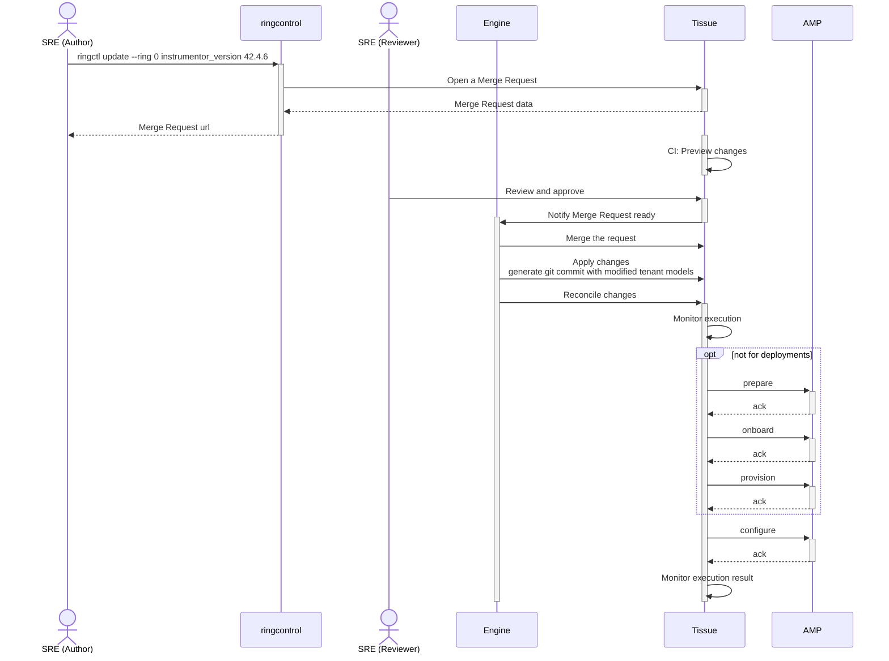

このページには今後予定されている製品・機能・機能性に関する情報が含まれています。ここに示す情報は参考目的のみです。購入・計画の決定にこの情報を使用しないでください。製品・機能・機能性の開発、リリース、タイミングは変更または延期される可能性があり、GitLab Inc. の独自の判断に委ねられています。

<table class="w-full text-sm border-collapse">
<thead>
<tr class="bg-gray-100 text-left">
<th class="px-3 py-2 border border-gray-300">Status</th>
<th class="px-3 py-2 border border-gray-300">Authors</th>
<th class="px-3 py-2 border border-gray-300">Coach</th>
<th class="px-3 py-2 border border-gray-300">DRIs</th>
<th class="px-3 py-2 border border-gray-300">Owning Stage</th>
<th class="px-3 py-2 border border-gray-300">Created</th>
</tr>
</thead>
<tbody>
<tr>
<td class="px-3 py-2 border border-gray-300"></td>
<td class="px-3 py-2 border border-gray-300"><a href="https://gitlab.com/nolith" class="text-blue-600 hover:underline">@nolith</a></td>
<td class="px-3 py-2 border border-gray-300"><a href="https://gitlab.com/andrewn" class="text-blue-600 hover:underline">@andrewn</a></td>
<td class="px-3 py-2 border border-gray-300"></td>
<td class="px-3 py-2 border border-gray-300">~devops::platforms</td>
<td class="px-3 py-2 border border-gray-300">2024-07-16</td>
</tr>
</tbody>
</table>

私たちは Cells 環境における「変更」の正しいシーケンシングを確保する必要があります。デプロイメント、設定変更、通常のマージリクエストは、すべて正しい順序でシーケンスされ、順次適用される必要があります。重要な変更を加速するための優先順位システムが必要です。その後、このシステムはリング間での変更の伝播もできる必要があります。マージリクエストとパイプラインだけではこれらの特性を強制できません。これらはソリューションのビルディングブロックになり得ますが、コーディネーターエンジンが必要です。

## はじめに

### 主要用語

- [デプロイメント](deployments.md) - GitLab アプリケーションとそのコンポーネントをインフラストラクチャにインストールするプロセス。
- 設定変更 - テナントモデルのフィールドを変更すること。フィールドが `prerelease_version` の場合はデプロイメントと呼びます。
- 変更 - デプロイメント、設定変更、および tissue プロジェクトをターゲットとするマージリクエスト。

### 問題

私たちのデプロイメントエンジンは Dedicated switchboard_uat のフォークとして生まれ、GitLab CI パイプラインをベースとしています。switchboard_uat の元の設計では、エンジニアがマージリクエストでテナントモデルを編集し、CI エンジンが各マージリクエストの影響を受けるテナントを識別して、マージされたときにデプロイメントをトリガーします。変更率は非常に低く、各マージリクエストは単一のテナントに影響します。

この状況では、`resource_group` 機能によるパイプラインの順序付けはデプロイメントの衝突を避けるのに十分以上です。

Cells プロジェクトでは、1 日あたり 6〜10 回のデプロイメントに加え、プロジェクトへの設定変更やその他のマージリクエストも発生すると見込んでいます。release-tools はデプロイメントが重ならないよう調整しますが、他の 2 種類の変更については同様ではありません。

このタスクを自動化するツールがない場合、10 Cell（Cells 1.0 のターゲット）で 1 日あたり合計 10 件の変更（いかなるタイプも）があるとすると、1 日あたり 100 件の個別のファイル変更が発生します。リングごとに単一のマージリクエストに変更をまとめたとしても、合計 10 件のマージリクエストが生じ、それらの 100 件のファイル変更は手動で解決する必要があるマージコンフリクトを引き起こします。

プロジェクトのインフラストラクチャスタックの性質を考えると、設定変更とデプロイメントをバンドルすることは、その Cell に深刻な影響を与える可能性があります。

さらに、各変更はリング全体に適用され、通常のマージリクエストで作業すると、マージリクエスト作成時に知られていなかった新しい Cell が同期から外れる可能性があります。

最後に、別のリング（フェーズ セット C: フェーズ 10）を導入するとすぐに、別のリングのテナントモデルに影響を与える新しいマージリクエストを作成せずに同じ変更を適用する方法が必要になります。リング 0 から外向きへの変更を追跡する単一のマージリクエストを持つことで、作業量を大幅に削減し、各変更の進捗を追跡する能力が向上します。

### 目標

このブループリントは、Cells プロジェクトインフラストラクチャの高レベルな運用原則を定義し、望ましいソリューションの特性と、それを操作するエンジニアの UX に焦点を当てることを目的としています。

実装の詳細の定義と、4 つの Instrumentor ステージ（prepare、onboard、provision、configure）の最適化はこのドキュメントの対象外です。

## 提案

この問題に対する提案されたソリューションは、2 つの主要な概念に基づいています。

1. 人間は `tissue` で変更をマージできません。変更のマージを担当するボットからの必須承認が必要です。
2. `ringctl` で生成されたマージリクエストはテナントモデルへの変更を含めず、要求されたコマンドラインパラメーターの表現を含めます。これにより、自動化が適切なタイミングで正確な変更を適用し、既存のすべてのテナントをターゲットにして、その後同じリクエストを他のリングに適応させることができます。

ある意味では、これは SRE がすでに慣れ親しんでいる [`atlantis`](https://www.runatlantis.io/) ツールに似ています。

以下のシーケンス図は、Instrumentor バージョンをアップグレードするための単純な変更リクエストを示しています。

### 変更のオーサリング

1. このワークフローは、SRE がリング 0 のすべてのテナントモデルの値をアップグレードするよう `ringctl` を呼び出すところから始まります。
1. ツールは `tissue` に望ましい変更の表現を含むマージリクエストを作成します。
1. マージリクエストの CI は、main ブランチの現在の状態に基づいて望ましい変更のプレビューを生成します。変更されたテナントモデルは既存の `tenctl` 機能を使用して検証される必要があります。
1. マージリクエストは別の SRE によるレビューのために割り当てられる必要があります。
1. マージリクエストが承認されると、エンジンはそれをキューに入れます。
1. 変更を処理するタイミングになったら、ツールはリクエストをマージします。
1. 現在のテナントモデルへの記述された変更を適用します。
1. AMP クラスターの必要なステージを実行する Reconcile パイプラインをトリガーします。

上記の図はテナントモデルの変更に焦点を当てていますが、同じプロセスはパイプライン Yaml ファイルなどのリポジトリ内の他のファイルを変更する通常のマージリクエストにも適用できます。

### インシデントへの対応

完全に自動化されたインフラストラクチャは Cells プロジェクトにとって最も重要です。ただし、単一の Cell が誤動作した場合、顧客への影響を調査して軽減する必要があります。通常の自動化サイクルから Cell を除外する方法が必要です。

隔離リングの概念を導入することで、障害のある Cell のテナントファイルを一時的にそのリングに移動して、自動化がこの障害のある Cell に変更を適用しないようにすることができます。ブレークグラス操作とターゲットを絞った Tissue パイプラインを使用することで、Cell を元のリングに再導入する準備が整うまでインシデント解決プロセスを進めることができます。

## 追加資料

- 私たちは [kubernete operator](https://gitlab.com/nolith/ringctl-operator) のアイデアを検討し、[プライベートな録画デモ](https://www.youtube.com/watch?v=55glecMYD7k&t=1m) が利用可能です。この取り組みの一環として、私たちはまず人間のインタラクションに焦点を当てたいと気付きました。システムを操作するエルゴノミクスは、エンジンの実装の詳細よりも重要です。
- これを今行っている理由: [Start Release Engineering at the Beginning](https://sre.google/sre-book/release-engineering/#start-release-engineering-at-the-beginning-8ksKtxCm) Google SRE ブック。
- [安全な設定変更の適用](https://sre.google/workbook/configuration-design/#safe-configuration-change-application)の特性、Google による設定設計とベストプラクティス。
- 変更をシーケンスするエンジンがないことによる[現在の作業への影響](https://gitlab.com/gitlab-com/gl-infra/production-engineering/-/issues/25601#note_1996861638)。
