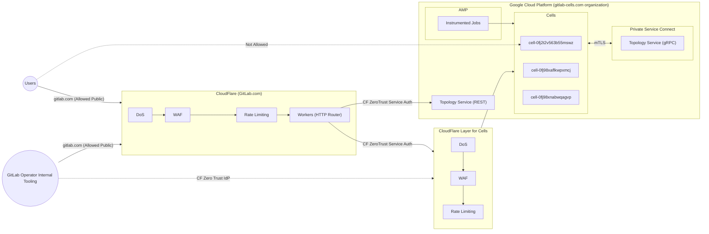



## 事前学習資料

- [HTTP Router](../http_routing_service.md)
- [Topology Service](../topology_service.md)
- [ADR 002](../decisions/002_gcp_project_boundary.md)
- [ADR 004](../decisions/004_vpc_subnet_design.md)

## ガイドライン

- **GCP における VPC 間通信:** 異なる VPC 内のサービス間のあらゆるやり取り。たとえば、Cell が Topology Service と通信する際には [Private Service Connect](https://cloud.google.com/vpc/docs/private-service-connect) を使用します。これにより、CIDR の重複、VPC ピアリングの制限、VPC 間での一貫性のない DNS 解決、公共インターネット経由の通信を回避できます。
- **認証と認可:** 各サービスは、HTTP リクエストを使用した通信に使用される証明書またはトークンの形でアイデンティティを持つ必要があります。そのアイデンティティはリクエストの認可にも使用されます。証明書によるアイデンティティは mTLS として広く知られており、[独立したブループリント](../mutual_authentication_between_cell_services.md)があります。
- **Cells は公開されていないが、個別にアクセス可能:** ユーザーは中央エントリポイントを維持し、レート制限のグローバルカウンターを確保するために、公共インターネット上の `gitlab.com` ドメインを通じてすべてのリクエストを送信する必要があります。
  - **外部:** Cell は外部ホスト名を通じて個別にアクセス可能ですが、これは公開されていません - 顧客は Cell ドメインに直接アクセスできません。
  - **公開:** Cell は公共インターネットで利用可能な gitlab.com ドメインを通じてのみ顧客がアクセスできます。

上記のガイドラインに従うと、次のような通信になります。

## GCP における VPC 間通信

各 Cell は[独自の GCP プロジェクト](../decisions/002_gcp_project_boundary.md)を持ち、その結果[独自の VPC](../decisions/004_vpc_subnet_design.md) を持ちます。
これは、Cell が下流サービスにリクエストを送信する際に、公共インターネットまたは内部ネットワークを経由する必要があることを意味します。
[ADR 004](../decisions/004_vpc_subnet_design.md) で、内部通信に [Private Service Connect](https://cloud.google.com/vpc/docs/private-service-connect) を使用することを決定しました。
これは、速度とコストの観点からサービス間のリクエストは内部であるべきであることを意味します。そうしなければ、イングレスとエグレスの料金を支払う必要があります。
Private Service Connect のトラフィックは、中間ホップやプロキシを経由せずに、コンシューマークライアントからプロデューサーバックエンドに直接流れます。
NAT（ネットワークアドレス変換）はコンシューマーとプロデューサーの VM をホストする物理ホストマシン上で直接実行されるため、レイテンシが低減し、帯域幅容量が向上します。

Private Service Connect は GCP ホストサービス間の通信にのみ使用されます。HTTP Router は GCP でホストされていないため、HTTP Router と Topology Service の間では使用できません。

Private Service Connect には 2 つのエンティティがあります: `Consumer` と `Producer` です。例えば、Cell（`Consumer`）が Topology Service（`Producer`）にリクエストを送信する場合です。

`Consumer` が `Producer` にアクセスする方法には [`Endpoint`](https://cloud.google.com/vpc/docs/private-service-connect#endpoints) と [`Backend`](https://cloud.google.com/vpc/docs/private-service-connect#backends) の 2 つがあります。Private Service Connect Backend は Private Service Connect ネットワークエンドポイントグループ（NEG）バックエンドで設定されたロードバランサーを使用するため、`Backend` を使用します。
コンシューマー管理のロードバランサーを通じて API とサービスにアクセスすることには、いくつかのメリットがあります:

- ロードバランサーはセキュリティポリシー（Google Cloud Armor ポリシーや SSL ポリシーなど）またはルーティングポリシー（Google Cloud URL マップなど）が適用される集中型ポリシー適用ポイントとして機能できます。
- パブリッシュされたサービスが提供しない可能性のある集中型メトリクスとロギングを提供します。
- コンシューマーがルーティングとフェイルオーバーを制御できます。
- Geo のフェイルオーバー用に Cell が複数のリージョンで動作しており、Topology Service が 2 つのリージョンで動作しているため、すべてのロードバランサーはデフォルトでマルチリージョンである必要があります。

[source](https://excalidraw.com/#json=ZkpKyrjuSVihA98HOcnBa,aSljwYS_JGT6G9leGgpHZw)

## 認証と認可

[mTLS](../mutual_authentication_between_cell_services.md) と [Cloudflare Zero Trust](https://developers.cloudflare.com/cloudflare-one/) を組み合わせて活用します。
各 Cell は、認証の手段として Topology Service に接続するために使用される証明書の形でアイデンティティを持つ必要があります。
認可の実装は Topology Service に委ねられており、証明書に含まれるアイデンティティを使用します。
例えば、Cell は認証のために mTLS を使用して Topology Service に接続し、その後 Topology Service はそのアイデンティティを使用してリクエストを実行できるかどうかを認可します。

### 認証プロトコルと接続マトリクス

| クライアント | サーバー | プロトコル | メカニズム |
| ------ | ------ | ------ | ------ |
| Cloudflare / HTTP Router | Topology Service | HTTP | Cloudflare Zero Trust（Service Token を使用） |
| Cloudflare / HTTP Router | GitLab Webserver/Cell Zone | HTTP | Cloudflare Zero Trust（Service Token を使用） |
| GitLab Webserver | Topology Service | gRPC | Webserver が処理する通常の mTLS（接続は Private Connect を経由するため Cloudflare は経由しない） |
| オペレーター | Cell Zone/GitLab webserver | HTTP | IdP 認証による Zero Trust |

## Cells は公開されていないが、個別にアクセス可能

すべての公開トラフィックは現在と同様に `gitlab.com` ドメインを経由して流れます。
これにより、可観測性、監査追跡、前方/後方互換性のための単一のエントリポイントが提供され、Web Application Firewall とレート制限を設定・管理する集中型の場所が確保されます。

各 Cell はテナントモデル内で `managed_domain` として知られる専用ドメインを持ち続けます。これは Cloudflare に登録されます。
この理由は `認証と認可` に基づいており、各ワークロードが独自のアイデンティティを持ち、Topology Service と HTTP Router が Cell の識別子を持つためです。
Cell は、プログラム的にクライアントによってだけでなく、HTTP Router と Topology Service を迂回して、Rails アプリケーションのデバッグなど運用上の理由で直接接続するヒューマンオペレーターにも直接アクセス可能である必要があります。

これは、Cell には 2 種類のクライアント（ヒューマンクライアントと HTTP Router や Instrumentor などの他のサービス）があることを意味します。両方とも [Cloudflare Zero Trust](https://developers.cloudflare.com/cloudflare-one/) を使用した同じコアテクノロジーで解決されます。

### ヒューマンオペレーター

Cloudflare Zero Trust では、[Okta](https://developers.cloudflare.com/cloudflare-one/identity/idp-integration/okta/) などの Identity Provider を設定できます。これにより、ブラウザで `managed_domain` にアクセスすると、Cell に続くために Okta にログインすることが求められます。

Cloudflare ZeroTrust のアプリケーションに[アクセスポリシー](https://developers.cloudflare.com/cloudflare-one/policies/access/)を設定して、特定の Okta グループに属するオペレーターのみにアクセスを制限できます。

これは [Cloudflare Zero Trust PoC](https://gitlab.com/gitlab-com/gl-infra/tenant-scale/cells-infrastructure/team/-/issues/241#note_2392103428) によって検証されています。

### サービス

HTTP Router から Cell および Topology Service へのセキュアな通信には、Cloudflare Zero Trust の [Service Token Auth](https://developers.cloudflare.com/cloudflare-one/identity/service-tokens/) を活用できます。

サービス認証トークンは [Worker シークレット](https://developers.cloudflare.com/workers/configuration/secrets/)としてアップロードでき、Cell へのリクエストをプロキシする際にヘッダーとして追加できます。

[CloudFlare Zero Trust PoC](https://gitlab.com/gitlab-com/gl-infra/tenant-scale/cells-infrastructure/team/-/issues/241) の一環としてこれがどのように機能するかを検証しました。
