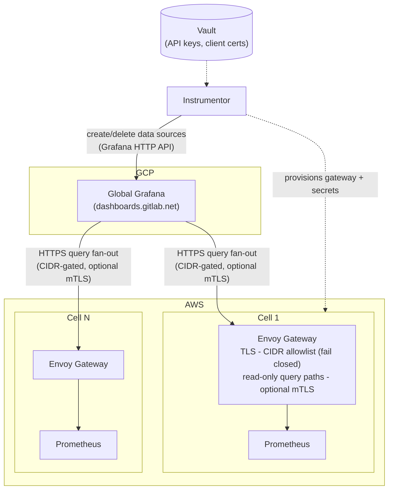



## 概要

Observability 2.0 は、[Cells のオブザーバビリティ](observability.md)で確立された基盤の上に構築されます。
それらの要件を繰り返すのではなく、このドキュメントでは、すべての Cells にわたる統一されたグローバルなオブザーバビリティ体験を実現するために必要な、**集約レイヤー**の変更に焦点を当てます。

## 目標

主な目標は **OBS4: 統一されたグローバル（セル横断）ビュー**（Must Have）です。これは、テレメトリデータストレージを複製せず、各 Cell にクエリをファンアウトする単一のビューです。目標 OBS1 から OBS3 は[Cells のオブザーバビリティ](observability.md)で扱われており、変更されません。

## インフラストラクチャのコンテキスト

Cells のデプロイメントでは、GitLab Dedicated 環境で使用されているものと同じツールである **Instrumentor** を使用します。Instrumentor は AWS と GCP の両方をサポートし、[以前の ADR](observability.md#design-and-implementation-details)では Cells の GCP サポートを検討しましたが、**現在、Cells に関連するターゲットは AWS のみです**。

Cell 環境のデプロイ方法の詳細については、[Deployments](deployments.md)デザインドキュメントを参照してください。

## 設計：統一されたグローバルビュー（OBS4）

### アプローチ：Grafana のフェデレーテッドプル

各 Cell は独自のオブザーバビリティスタックを保持します。各 Cell のオブザーバビリティデータソースを**グローバル Grafana インスタンス**に登録し、データストレージを一元化せずに単一の統一ビューを提供します。

ゲートウェイ、認証、自動化レイヤーの詳細については、[Cells ADR 028: オブザーバビリティフェデレーション](../decisions/028_observability_federation.md)を参照してください。

### 一元化された Remote Write ではなくフェデレーテッドプルを選ぶ理由 {#why-federated-pull-instead-of-centralized-remote-write}

すべての Cell が完全なテレメトリストリームをグローバル Mimir クラスターへ継続的に remote write する一元化アーキテクチャは、当初検討されていました（[設計](https://gitlab.com/gitlab-com/gl-infra/tenant-scale/tenant-services/team/-/work_items/403)を参照）。

各 Cell は GitLab.com 規模のデプロイメントに匹敵するテレメトリ量を生成すると予想されます。すべての Cell から完全なメトリクスセットを共有 Mimir クラスターへ複製すると、メトリクスのカーディナリティはおおよそ `.com x Ntenants` 倍になり、中央オブザーバビリティプラットフォームのストレージ、取り込み、クエリの負荷が大幅に増加します。Cells の数が増えると、このアプローチは、どのメトリクスがそのコストを正当化するかを明確に理解しないまま、運用の複雑さとインフラコストを線形に増大させます。

現在、Cell が発行するメトリクス数についての知見はほとんどなく、現在のベースラインは主に GitLab Dedicated から導かれています。テレメトリを中央ストレージに送る前に、いくつかの問いに答える必要があります。すべてのメトリクスを送る必要があるのか、それともフィルタリングすべきか。どのメトリクスを中央で保存する価値があり、どれをホストにローカルのままとすべきか。これらに答えることは、適切にスコープを定めた一元化設計の前提条件です。

したがって、Observability 2.0 は当面、フェデレーテッドプルモデルを採用します。各 Cell はテレメトリデータの権威ある所有者であり続け、グローバル Grafana インスタンスは必要に応じて個々の Cell にクエリし、統一されたセル横断ビューを提供します。これにより、すべての Cell にわたる一元化されたクエリダッシュボードを提供しつつ、データの範囲を理解し、何を中央に保存するかについて情報に基づく判断を下す時間を得られます。

このアプローチは次を実現します。

- メトリクスストレージの複製を回避する。
- 取り込みと保持のコストを各 Cell に分散する。
- 中央オブザーバビリティプラットフォームへの運用上の圧力を軽減する。
- Cells がそれぞれ独立してオブザーバビリティインフラをスケールできるようにする。

プルモデルでは、remote write の取り込み時に発生するネットワークエグレスコストが、フェデレーションではクエリ時に移ります。クエリ時のエグレスが、すべてのメトリクスを継続的に remote write する場合より低いか高いかは現在不明であり、このトレードオフは初期設計で受け入れます。この前提を検証するため、テナントごとの集約ネットワークエグレスを追跡し、モデル間を移行する場合に両アプローチのコストを直接比較できるようにします。

この設計は将来の最適化の余地も残します。テレメトリ要件への理解が進むにつれて、高価値メトリクスの厳選されたサブセットを、長期分析、フリート全体のレポーティング、または中央ストレージの恩恵を受ける他のユースケースのために、各 Cell から一元化された Mimir クラスターへ選択的に remote write できます。初期アーキテクチャはこの進化を妨げません。実証された必要性が生じる前にすべてのテレメトリを一元化しないだけです。

アラートは異なるモデルに従います。各 Cell の Prometheus は、アラート系列をグローバル Mimir クラスターへ remote write します。生メトリクスと異なり、アラートデータは比較的低ボリュームでありながら、大きな運用価値を提供します。アラートを一元化すると、基礎となるメトリクスを中央に保存することなく、相関するインシデントのフリート全体での可視性、複数の Cell にまたがる広範なサービス劣化の識別、テナント間の協調した運用対応が可能になります。

### 主要な設計判断

- **中央データストアを持たない**： データは各 Cell のオブザーバビリティスタックに残ります。ストレージの複製を回避し、Cell ごとのデータ主権を維持します。
- **一貫した Cell の計測**： 各 Cell は、Grafana がデータソースとして利用できる互換性のあるオブザーバビリティエンドポイントを公開する必要があります。
- **クエリ時の集約**： テナント間でデータの集約が必要な場合、グローバル Grafana インスタンスが、登録されたすべての Cell データソースにクエリして結果をクエリ時に集約します。

### 解決済みの問い

以下の設計上の問いは、[Cells ADR 028: オブザーバビリティフェデレーション](../decisions/028_observability_federation.md)と上記のフェデレーションの根拠で回答されています。

- [x] グローバルクエリ中に Cell に到達できない場合はどう扱うか。

  プルベースアーキテクチャの主なトレードオフは、障害中にテナントのメトリクスへのアクセスが一時的に失われることです。メトリクスは各テナントにローカルのままなので、テナントが利用できない間はクエリできません。

  Prometheus は時系列データを永続ボリューム要求（PVC）に保持します。復旧中に PVC が保持される限り、テナントがオンラインに復帰したときに履歴メトリクスが復元され、復旧後もメトリクスの連続性が維持されます。

  ログは中央に保持され、テナントの可用性とは独立してアクセス可能であり続けるため、この制限の影響を受けません。

- [x] グローバル Grafana インスタンスと各 Cell のオブザーバビリティスタック間の認証/認可はどのように扱うか。
- [x] グローバルなアラートレイヤーが必要か、それともアラートは Cell ローカルのままとするか。
- [x] 新しい Cells をグローバル Grafana のデータソースとして自動登録する方法。
