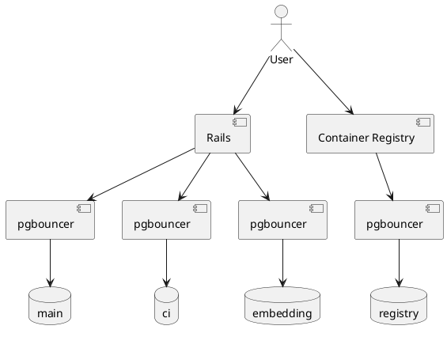



## 現在の GitLab.com アーキテクチャ

GitLab.com は、Terraform、Chef、および複雑なタスクのための Ansible によって GCP の仮想マシン上で管理される 4 つの PostgreSQL クラスターを使用しています。
Cells では、大幅に多くの PostgreSQL クラスターを作成したいと考えており、50 Cell が必要な場合は 50 以上の PostgreSQL クラスターが必要になります。

現在、単一の本番データベースをホストする 4 つの異なるデータベースクラスターがあります。

| データベース | 説明 | サイズ | スケーリングの余裕 |
| ----------- | ---------------------------------------------------------------------------------- | ------------- | ---------------- |
| `Main` | すべてのデータのデフォルトの場所 | 20TB 以上 | ほぼない |
| `CI` | すべての CI/CD 関連データ | 20TB 以上 | ほぼない |
| `Registry` | Container Registry データ | 2TB 未満 | 余裕あり |
| `Embedding` | AI トレーニングデータを保存するための [pgvector](https://github.com/pgvector/pgvector) の実行 | 2TB 未満 | 余裕あり |

データは `organization_id` によってシャーディングされ、`organization_id` は 1 つの Cell に存在できます。

Cells のロールアウト中、データのほとんどは現在のデータベースクラスターに残るため、これらの大規模なモノリシックシステムの要件にも対応することが重要です。

## 将来のアーキテクチャ

今後の Cells プロジェクトでは要件が異なります。
現在の見積もりでは、各 Cell は現在のモノリスと比較して比較的少数のユーザーをホストするため、多数の小さなデータベースクラスターをホストし、短期間でそれらを作成するという新たな課題が生じます。

正確な要件は時間とともに発展しますが、以下が要求されています:

- API を介したデータベースクラスターの作成と削除（Cell のプロビジョニングの一部となる）。
- リファレンスアーキテクチャのサイズまでのデータベースクラスター: [50,000 ユーザー API: 1000 RPS、Web: 100 RPS、Git（プル）: 100 RPS、Git（プッシュ）: 20 RPS](https://docs.gitlab.com/ee/administration/reference_architectures/50k_users.html)。
- 最大 2,000 の Cell とデータベースクラスター。

現在の自動化には、各クラスターに専用の Chef ロールを作成するなど、多くの手動ステップが含まれています。
新しいクラスターを作成するための変更プロセスは、複数のマージリクエストとピアレビュー、そして Change Request による実行を必要とする最大のオーバーヘッドです。
これは新たに与えられた要件とは相容れません。

ただし、Cells は 1 つの Cell から始まる反復的な方式で開始され、1 つのデータベースクラスターが必要になります。
したがって、現在のプラットフォームは少なくとも Cells 1.0 には使用でき、すべてのデータが新しい Cell ローカルデータベースクラスターに保存されるまで維持できます。

また、複数の小規模 Cell への完全なシャーディングの前に、現在のデータを新しいデータベースプラットフォームに移行することも可能です。
これが望ましい場合は、現在のモノリスの要件もターゲットプラットフォームで満たす必要があります。

## 要件

要件は、GitLab.com のモノリシックデータストアに現在必要なものと、個々の Cell に見込まれるものに分けられます。

要件は以下のカテゴリーに分類できます。
それらは *高い*、*中程度*、*低い* のいずれかになります。

- *高い*: GitLab.com を運用するために必要。
- *中程度*: 現在運用に必要だが、置き換えが可能。
- *低い*: あれば望ましい。

### 共通要件

| 要件 | 説明 | 優先度 | Cloud SQL | Crunchy K8s Operator | Amazon RDS |
| -------------------------------------------------- | ---------------------------------------------------------------------------------------------------------------------------------------------------------------------------------------------------------------------------------------------------------------------------------------- | -------- | --------- | ------------ | ------------------- |
| GitLab のサポート | 最小限の変更、または変更なしで GitLab アプリケーションをサポートする能力 | 高い | ✅ | ✅ | ✅ |
| PostgreSQL メジャーリリース | 開発チームとインフラチームが統合に取り組めるよう、6 ヶ月以内に安定版リリースをサポートする | 高い | ❌ | ✅ | ✅ |
| PostgreSQL メジャーリリース | 開発チームとインフラチームが統合に取り組めるよう、3 ヶ月以内に安定版リリースをサポートする | 中程度 | ❌ | ✅ | ✅/partial |
| PostgreSQL パッチリリース | 7 日以内のマイナーリリース（バグ修正）のサポート | 高い | ❌ | ✅ | ✅ |
| PostgreSQL セキュリティ修正 | [セキュリティ SLA](../../../../threat-management/vulnerability-management/#remediation-slas) に従ったセキュリティ修正、クリティカルは 24 時間以内 | 高い | ❌ | ✅/partial | ✅ |
| PostgreSQL ベータリリース | 開発チームとインフラチームが早期にテストできるよう、現在の PostgreSQL ベータリリースをサポートする | 低い | ❌ | ✅ | ✅/only preview env |
| ほぼゼロダウンタイムアップグレード | APDEX 劣化が分や時間ではなく秒単位でのみアップグレードを可能にする | 高い | ❌ | ✅/partial, requires engineering efforts | ✅/partial |
| HA ソリューション | 現在の Patroni ソリューションと同等以上の高可用性とフェイルオーバー自動化。人間の介入なしに秒単位のスイッチオーバー/フェイルオーバーで、スプリットブレーンシナリオを許可しない | 高い | ✅ | ✅ | ✅ |
| ロギング統合 | Postgres 上で構造化ロギングが利用可能 | 高い | ✅ | ✅/Configurable & Sidecar option | ✅ |
| メトリクス | Prometheus / Grafana 監視セットアップへの統合 | 高い | ✅ | ✅ | ✅ |
| PostgreSQL 拡張機能 - 運用（高） | 現在必要な拡張機能:   - pg_stat_statements   - pg_wait_sampling   - amcheck   - [pgvector](https://github.com/pgvector/pgvector)   - pg_trgm   - btree_gin   - btree_gist   - plpgsql   - pg_repack | 高い | ✅ | ✅/not wait_sampling, repack;but option to rebuild image | ✅ |
| PostgreSQL 拡張機能 - デバッグ（中程度） | デバッグに使用する拡張機能: - pg_stat_kcache   - pgstattuple   - pageinspect   - pg_buffercache   | 中程度 | ❌ | ✅/not kcache;but option to rebuild image | ✅/not kcache |
| PostgreSQL 拡張機能 - マイグレーション / シャーディング（低） | 現在は使用していないが将来重要になる可能性がある拡張機能:   - postgres_fdw   - file_fdw | 低い | ❌ | ✅ | ✅/not file_fdw |
| デバッグツール | 現在、strace などのツールを使用して PostgreSQL プロセスにフックしてパフォーマンスの根本原因を見つけています。SaaS では、代わりにサービスプロバイダーがそのような分析を行う意志と能力があることを確認する必要があります。 | 中程度 | ❌ | ✅/On-demand package install or container image rebuild | ❌ |
| サードパーティツールによるバックアップ | カスタムバックアップ/アーカイブリポジトリと保持ポリシーを持つ wal-g、pgBackRest などのサードパーティツールによる自動および手動ベースバックアップ | 高い | ❌ | ✅ | ❌ |
| ディスクベースのバックアップ/リストア | ディスク/ボリュームスナップショットのような自動および手動の高速バックアップ、設定可能な保持ポリシー、アトミックスナップショットまたは一貫したデータを保証する [pg_start_backup / pg_stop_backup](https://www.postgresql.org/docs/14/functions-admin.html#FUNCTIONS-ADMIN-BACKUP-TABLE) との統合 | 高い | ✅ | ✅/Clone-only, no multi-AZ support yet; on roadmap. | ✅ |
| 増分バックアップ | 増分バックアップの実行をカスタマイズし、より頻繁なバックアップを実行できるようにして RTO を削減する | 中程度 | ✅ | ✅ | ✅ |
| バックアップエクスポート | GCS バケットなどの汎用ストレージへのバックアップエクスポート能力 | 高い | ❌ | ✅ | ❌/only S3 .parquet |
| ローカルストリーミングレプリケーション | 読み取り専用ワークロードのオフロードと水平スケーリングのために、同一リージョンへのストリーミング物理レプリケーションが必要 | 高い | ✅ | ✅ | ✅ |
| マルチリージョンストリーミングレプリケーション | DR と将来のマイグレーションのために、マルチリージョンなどのリモートロケーションへの SR が必要 | 高い | ✅ | ✅ | ✅ |
| 外部ストリーミングレプリケーション | 本番環境外、別のアカウント、または別のクラウドプロバイダーの外部 PostgreSQL データベースへの SR は、DR、テスト、将来のマイグレーションに必要になる場合がある | 中程度 | ❌ | ✅ | ❌ |
| WAL アーカイブレプリケーション | WAL アーカイブレプリケーションはホットスタンバイフィードバックとストリーミングレプリケーションの影響を排除し、分析（例: 長い/遅いクエリやレポートの実行）、クエリテスト、パフォーマンスデバッグに有用 | 高い | ✅ | ✅ | ✅ |
| WAL 遅延アーカイブレプリケーション | WAL 遅延アーカイブレプリケーションにより、レプリカが継続的に以前の時点（例: 8 時間前）で回復し続けることができ、人的エラーなどの問題に対して非常に迅速なディザスタリカバリ方法を提供する | 中程度 | ❌ | ✅ | ❌ |
| 論理レプリケーション | 論理レプリケーションはゼロダウンタイムアップグレード、将来のマイグレーション、またはあらゆる種類のインフラストラクチャ変更（PostgreSQL の物理レプリケーションをサポートしない可能性がある）に必要 | 高い | ✅ / ? | ✅ | ✅ |
| 読み取り負荷分散 | 読み取り負荷を分散するためのスタンバイは、パフォーマンスのボトルネックを軽減するために短期間でデプロイ可能である必要があり、適切な自動化も許容される | 高い | ✅ | ✅/use pgBackRest instead of volume snapshot | ✅ |
| リージョンデプロイ | DR 要件のために個々のスタンバイのリージョンを定義できる必要がある | 低い | ✅ | ✅ | ✅ |
| Database Lab 統合 | [Database Lab](https://postgres.ai/docs/platform) はバックエンド開発者が使用しており、統合される必要がある | 低い | ✅ / ? | ✅ | ✅ / ? |

### 現在のプラットフォーム要件

#### パフォーマンス

パフォーマンスは重要な要素です。最初のタスクはパフォーマンスの概要を定義し、それが満たされているかどうかをテストするための信頼性の高い方法を確立することです。

{- TODO: パフォーマンス要件とテスト手順を定義する -}

以下の負荷ピークを観察しており、参考として使用できます:

- プライマリでの `~100k` 読み書き TPS
  - [Main プライマリでの `~80k` TPS](https://dashboards.gitlab.net/d/000000144/postgresql-overview?orgId=1&from=1707696000000&to=1708387199000&var-prometheus=PA258B30F88C30650&var-environment=gprd&var-type=patroni)
  - [CI プライマリでの `~32k` TPS](https://dashboards.gitlab.net/d/000000144/postgresql-overview?orgId=1&from=1707696000000&to=1708387199000&var-prometheus=PA258B30F88C30650&var-environment=gprd&var-type=patroni-ci)
- スタンバイ間で分散された `~1M` 読み取り専用 TPS
  - [Main スタンバイでの `~714k` TPS](https://dashboards.gitlab.net/d/000000144/postgresql-overview?orgId=1&from=1707696000000&to=1708387199000&var-prometheus=PA258B30F88C30650&var-environment=gprd&var-type=patroni)
  - [CI スタンバイでの `~150k` TPS](https://dashboards.gitlab.net/d/000000144/postgresql-overview?orgId=1&from=1707696000000&to=1708387199000&var-prometheus=PA258B30F88C30650&var-environment=gprd&var-type=patroni-ci)

### Cells 要件

| 要件 | 説明 | 優先度 |
| -------------------- | -------------------------------------------------------------------------------------------------------- | -------- |
| API | API を通じてトラフィックを受け取る準備が整った PostgreSQL クラスターをプロビジョニングする | 高い |
| 100 以上の管理 | 100 以上のクラスターを効率的に管理できる必要がある | 高い |
| 均一なデータベース | すべてのデータベースは同じように動作する必要があり、デプロイメントごとに特別扱いは不要 | 中程度 |

TODO: パフォーマンス要件を定義し、異なるステークホルダーと確認する。@rnienaber と議論し、最大のリファレンスアーキテクチャから始めます。

- 最大約 50,000 ユーザー、最大のリファレンスアーキテクチャ: [最大 50,000 ユーザー API: 1000 RPS、Web: 100 RPS、Git（プル）: 100 RPS、Git（プッシュ）: 20 RPS](https://docs.gitlab.com/ee/administration/reference_architectures/50k_users.html)
- これは将来増加する可能性があるか、または現在のすべてのユーザーをホストするために数百の Cell が必要になる可能性があります。

#### 分解

[GitLab.com](https://gitlab.com/) のアプリケーションデータは現在、`Main` と `CI` の 2 つの別々のデータベースクラスターに分解されています。
[分解「セキュアおよびソフトウェアサプライチェーンセキュリティ関連テーブルを別の Postgres DB に分解する」](https://gitlab.com/gitlab-org/gitlab/-/issues/427973)によって、現在のプラットフォームにより多くのヘッドルームとスケーラビリティを得るために `Main` データベースをさらに分解できるかどうかを評価しています。

Cells では、組織をより少ない飽和 Cell に移動することで水平スケーリングするという設計上の選択があります。
Cells は分解が合理的な規模になるまで垂直スケールすべきではありません。
そのため、Cells 内での分解は必要なく、現在の Dedicated / GET / Cells ツールではサポートされて **いません**。
将来的に GET と Dedicated で分解のサポートを追加することは、中程度の複雑さのタスクとして可能です。

これに沿って、Cell ごとに単一のデータベースクラスターのみがプロビジョニングされ、必要なすべてのデータベースをホストできます。

## 概要 - 可能なソリューション

### PostgreSQL 以外の提供

[AlloyDB](https://cloud.google.com/alloydb) のように特定レベルの PostgreSQL 互換性を主張する非 PostgreSQL について簡単に検討しました。
コストとリスクが期待されるメリットとの比較において意味のある割合にないという結論に達しました。
さらなる調査を正当化する PostgreSQL 自体の固有の欠点は現在ありません。

詳細は以下を参照してください:

- [Alternatives To Postgres DB (Google Spanner vs AlloyDB)](https://gitlab.com/gitlab-com/gl-infra/production-engineering/-/issues/24662)
- [Switching to a proprietary database, instead of PostgreSQL](https://gitlab.com/gitlab-com/gl-infra/production-engineering/-/issues/24673)

### Cloud SQL

[Cloud SQL](https://cloud.google.com/sql) は Google の標準的な PostgreSQL 提供です。
これはカスタムフォークであり、アップストリームリリースと 100% 互換性があると主張されており、[Cloud SQL ドキュメント](https://cloud.google.com/sql/docs/postgres/)では単に `PostgreSQL` と呼ばれています。
GitLab は現在、Cloud SQL を[サポートされた PostgreSQL 実装](https://docs.gitlab.com/ee/administration/reference_architectures/index.html#recommended-cloud-providers-and-services)として認識しています。

| メリット | 説明 | 優先度/重要度 |
| --------------- | ------------------------------------------------------------------------------------------------------------------------------ | --------------------- |
| DBaaS | 最小限の運用オーバーヘッド。理論的には最も効率的。必要な DB を定義するだけでサービスとして提供されます。 | 高い |
| アウトソーシング | フック、インターフェース、監視、アラート、および予測を超えたインフラストラクチャを維持する必要がありません。 | 高い |
| 運用拡張機能 | GitLab.com を実行するために必要な主要な拡張機能が[利用可能](https://cloud.google.com/sql/docs/postgres/extensions)です。 | 高い |
| API | 提供されているすべての機能の API がすでに提供されています。 | 高い |

| デメリット / リスク | 説明 | 優先度/重要度 |
| -------------------------------- | -------------------------------------------------------------------------------------------------------------------------------------------------------------------------------------------------------------------------------------------------------------------------------------------------------------------------------------------------------------------------------------------------------------------------------------------------------------------------------------------------------------------------------------------------------------------------------------------------------------------------- | --------------------- |
| 製品ロックイン | Cloud SQL は一方通行のドアの決定です。現在、PostgreSQL のストリーミングレプリケーションインターフェースを提供する任意の宛先にデータをレプリケートできます。GCP のアクティビティはベースバックアップのエクスポートなし、WAL アーカイブなし、ストリーミングレプリケーションなしなど複数の措置によってユーザーの移行を妨げます。移行には大幅なダウンタイムが必要であり、GitLab.com の現在の可用性目標では受け入れられません。 | 高い / ブロッカー |
| リリース遅延 | PostgreSQL のリリースを合理的な期間内に入手し、計画の情報源として信頼できるロードマップを持つことが重要です。Google は保証を提供せず、3 ヶ月以内に GA を提供するという見積もりのみです。この見積もりは `PG16` では正確ではなく、`2023-09-14` にリリースされ、`2024-02-16` 現在[利用可能ではありません](https://cloud.google.com/sql/docs/postgres/db-versions)。これは孤立したケースではなく、[`PG15` は `2023-05-24` に利用可能になり](https://cloud.google.com/sql/docs/postgres/db-versions#support-timeline)、[リリース](https://www.postgresql.org/docs/release/15.0/)から 7 ヶ月後のことです。 | 高い / ブロッカー |
| バグ修正遅延 | データ整合性や未解決の脆弱性に関するクリティカルなバグの修正は、理想的には数時間以内、少なくとも数日以内に利用可能である必要があります。Google は保証を提供せず、30 日間の見積もりのみです。この見積もりは正確ではありません。[`15.3` は `2023-05-11` にリリースされ](https://www.postgresql.org/docs/release/15.3/)、`2024-02-16` 現在[利用可能ではなく](https://cloud.google.com/sql/docs/postgres/db-versions)、リリースから `281` 日が経過しています。その間、`15.4`、`15.5`、`15.6` のバージョンもリリースされており、Cloud SQL は 4 パッチレベル遅れています。 | 高い / ブロッカー |
| ゼロダウンタイムアップグレードなし | アップグレードは APDEX 劣化が分や時間ではなく秒単位のみで可能である必要があります。メンテナンス時間について一貫性のないデータがあり、[10 秒](https://cloud.google.com/sql/docs/mysql/maintenance#nearzero)から 30 分以上まであり、データセットでこの主張を検証する必要があります。 | 高い / ブロッカー |
| ベースバックアップ | テスト、データ分析、データベースチーム用の Database Labs へのエクスポート、またはディザスタリカバリ準備のためにベースバックアップを定期的にエクスポートしています。Google は現在、GCS バケットなどの汎用ストレージへのバックアップのエクスポートを許可していません。 | 高い / ブロッカー |
| 外部ストリーミングレプリケーション | CloudSQL は[マルチリージョン物理レプリケーション](https://cloud.google.com/sql/docs/postgres/replication/cross-region-replicas)をサポートしていますが、外部データベースへの物理レプリケーションはサポートしていません。 | 中程度 |
| WAL アーカイブ遅延レプリケーション | CloudSQL は遅延レプリケーションを設定するための `recovery_min_apply_delay` をサポートしていません。ただし、`hot_standby_feedback` が無効になっており、大規模なクエリにより遅延が生じる場合、CloudSQL は自動的にレプリカをストリーミングからアーカイブレプリケーションに移動します。 | 中程度 |
| 可観測性: DB | データベースマシンへのフルアクセスを持たないことで可観測性（例: `strace`/`perf`）が失われます。低レベルのデバッグには GCP が必要ですが、現在これが適時に行われるという証拠はありません。 | 中程度 |
| 可観測性: クエリ | 現在持っている可観測性のほとんどは得られますが、Cloud SQL ではデータベースプロセスへのアクセスがないため、ロック競合などのデータベース内部を掘り下げる能力がありません。50k ユーザーなどの小さなインスタンスでは中程度かもしれませんが、より大きなインスタンスでは高くなる可能性があります。 | 中程度 |
| データベースエンジニアへのエスカレーション | Cloud SQL の専門家に適時に確実に連絡できる特定のサポートパスは見つかりませんでした。S1 インシデントでは Cloud SQL の専門家が数分以内に連携できる必要があります。 | 高い |

上記の情報のほとんどは公式の [Cloud SQL ドキュメント](https://cloud.google.com/sql/docs/postgres/)にあります。GCP チームから口頭で見積もりをもらいました（ミーティングノート [Discuss Cloud SQL and AlloyDB with GitLab (internal)](https://docs.google.com/document/d/1axwqnCJLzy0RfcPF5HAeowmg3fjf5iC1Wp9V-Vdp_EU)を参照）。

#### 検証すべき事項

Cells イテレーションに基づいてスコープを分割 https://handbook.gitlab.com/handbook/engineering/architecture/design-documents/cells/#cells-iterations

##### Cells 1.0（初期スコープ）

（フォーカス: Cells 1.0 リリースの基盤的な検証と統合タスク）

[Cells 1.0](../iterations/cells-1.0.md) のターゲットは、SaaS GitLab.com 提供を使用する社内顧客向けのソリューションを提供し、Cells の基盤的な作業を行うことです。

- CloudSQL のデータベース可観測性と自動テレメトリー収集ツールを GitLab の可観測性スイートに評価・統合する。
  - [クエリインサイト](https://cloud.google.com/sql/docs/postgres/using-query-insights)は現在の可観測性ツールの十分な代替になるか？
  - [Cloud SQL メトリクス](https://cloud.google.com/sql/docs/postgres/admin-api/metrics)と [Cloud SQL システムインサイト](https://cloud.google.com/sql/docs/postgres/use-system-insights)を監視ツールにエクスポートする方法を検証する
  - [CloudSQL クエリインサイト](https://cloud.google.com/sql/docs/postgres/using-query-insights)を監視ツールに統合する方法は？
  - PostgreSQL ログを Elastic にエクスポートする方法は？
- CloudSQL のバックアップとリカバリー戦略（ポイントインタイムリカバリー（PITR）を含む）を検証し、ゾーンの停止またはハードウェア障害時のダウンタイムを最小化するために [CloudSQL の高可用性（HA）設定](https://cloud.google.com/sql/docs/postgres/high-availability)を確認する。
- [SSL/TLS 証明書の設定と検証](https://cloud.google.com/sql/docs/postgres/configure-ssl-instance)により、PostgreSQL 接続が暗号化されることを確認する。
- 自動ストレージ増加の動作 – 複数の連続したストレージ増加をトリガーし、増加間の「クールオフ」期間、運用上の遅延、パフォーマンス低下を観察する。
- インスタンススケーリングのダウンタイム – HA あり/なしでスケールアップ/ダウン時のダウンタイムを測定する。
- マイナーバージョンアップグレードの影響 – HA あり/なしでのマイナーバージョンアップグレード中のダウンタイムを検証する。

##### Cells 1.5（将来の検討事項と機能強化）

（フォーカス: 後のイテレーションの機能と検証）

[Cells 1.5](../iterations/cells-1.5.md) のターゲットは、Cells 1.0 アーキテクチャを基に構築された SaaS GitLab.com 提供を使用する既存および新規エンタープライズ顧客向けの移行ソリューションを提供することです。

- 書き込みと読み取り専用ワークロードの両方に対して接続プーリングソリューションを検証する:
  - VM 上の PgBouncer
  - [CloudSQL データベース接続管理](https://cloud.google.com/sql/docs/postgres/manage-connections) / [Managed Connection Pooling (MCP)](https://www.youtube.com/watch?v=rGI3hIBl2s0)。セルフマネージドの PgBouncer と比較して機能が制限されています。
- [CloudSQL Proxy](https://cloud.google.com/sql/docs/postgres/sql-proxy) を評価する
- データベース移行オプションを比較する:
  - ネイティブ論理レプリケーション - [論理レプリケーション機能](https://cloud.google.com/sql/docs/postgres/replication/configure-external-replica)（[pglogical](https://github.com/2ndQuadrant/pglogical)）
  - [CloudSQL データベース移行サービス](https://cloud.google.com/database-migration)
  - また、CloudSQL からデータを移行するオプションも評価する。
- 50k リファレンスアーキテクチャでの PostgreSQL メジャーバージョンアップグレードの時間と影響を評価する。
  - CloudSQL には AWS RDS Blue/Green デプロイメントの直接的な相当物がないため、ソリューションを社内で設計する必要があります。
- 読み取りレプリカまたはバックアップからの新しいクラスターの作成にどのくらいかかるか？ `10GB`、`100GB`、`1TB`、`2TB`？
- 遅延レプリカを含むディザスタリカバリオプションを評価する。
- ストレージ増加のパフォーマンス影響 – 手動ストレージ増加前後のクエリパフォーマンスを測定する。
- 高負荷ストレステスト – 大量のデータセットをロードし、持続的な書き込み集約的な操作を CloudSQL がどのように処理するかを測定する。

##### Dedicated デプロイメントとの差分を評価する

- より細かい粒度（10 秒未満）の拡張モニタリングを、カスタムクエリ（例: `pg_stat_activity`、`pg_stat_statements`）を含む Postgres Exporter と、より頻繁なスクレイピングを行う Prometheus を使用して実装するオプションを評価する。
- スタンバイレプリカへの読み取り操作のオフロードを評価する。
- 「Enable auto minor version upgrade」を評価する。
- 「Dedicated Log Volume」によるパフォーマンス改善を評価する。
- ロギングレベルを上げて、スロークエリ、一時使用、autovacuum、ロック待機、接続/切断、DDL 文をキャプチャする。
- `pg_stat_statements` 設定を構成する。
- `auto_explain` をロードして設定する。
- 「論理バックアップ」ソリューションを実装する。
- [Cloud Monitoring](https://cloud.google.com/monitoring) と [Alerting](https://cloud.google.com/monitoring/alerts) を確認する。

### k8s Operator

現在、実行可能と思われる複数の利用可能な Operator がありますが、要件が満たされることを確認するための詳細な評価とベンチマークが重要です。
ゼロダウンタイムアップグレードが欠けている可能性がある機能の一つです。
現在も独自の自動化を維持しており、Operator がこの機能を提供するまで適応させることができます。

| メリット | 説明 | 優先度/重要度 |
| --------------------------- | ---------------------------------------------------------------------------------------------------------------------------------------------------------------------------------------------------------------- | --------------------- |
| API | 提供されているすべての機能の API がすでに提供されています。 | 高い |
| 運用ツールの削減 | k8s のみをサポートすることで、Chef を通じた VM 管理の必要がなくなります。維持するコードが少なくなり、複雑さが軽減されます。 | 高い |
| 既製の自動化 | 既製の Operator を利用することで、維持する自動化コードの量が削減されます。API を一から開発する必要がありません。 | 高い |
| データの制御 | 可観測性と制御は放棄されません。他のソリューションへの移行をいつどこで行うかを決定できます。データの保存場所、冗長性レベル、エアギャップバックアップなどを決定できます。 | 中程度 |
| 将来を見据えた設計 | 将来的により良いまたはより望ましいソリューションが利用可能になった場合、移行に何ら制限はありません。 | 高い |
| 製品ロックインなし | 将来離れることができない製品にロックインされません。 | 中程度 |
| デバッグ能力 | SaaS 提供とは対照的に、問題を適時にデバッグする意志と能力があるベンダーに依存しません。 | 高い |
| Cells との良好な統合 | 他のセルフホストソリューションと比較して、データベースはワークロードの残りと同じ k8s クラスターで実行されます。これにより外部コンポーネントの統合の必要性と複数の障害ベクターが排除されます。 | 中程度 |
| ほぼゼロダウンタイムアップグレード | GitLab の（[db-migration/pg-upgrade-logical](https://gitlab.com/gitlab-com/gl-infra/db-migration#zero-downtime-postgresql-upgrades) 自動化を k8s 上での PostgreSQL MVU のほぼゼロダウンタイムを実現するために適応させることができます | 高い / ブロッカー |

| デメリット / リスク | 説明 | 優先度 |
| ---------------- | ---------------------------------------------------------------------------------------------------------------------------- | -------- |
| ノウハウ | k8s はインフラストラクチャ全体で広く使用されていますが、データベース信頼性には使用されていません。チームでの知識を積み上げる必要があります。 | 中程度 |
| 欠けている機能 | 欠けている機能（サポートされていない拡張機能など）は私たちが実装する必要があります。 | 中程度 |

#### 検証すべき事項

- 候補の比較（4〜5 週間）
  - [CYBERTEC PostgreSQL Operator](https://github.com/cybertec-postgresql/CYBERTEC-pg-operator)（[zalando](https://github.com/zalando/postgres-operator) と商用サポート）
  - [CloudNativePG](https://github.com/cloudnative-pg/cloudnative-pg)

### Amazon RDS PostgreSQL

[Amazon Relational Database Services PostgreSQL](https://aws.amazon.com/rds/postgresql/) は AWS のマネージドデータベースサービスで、PostgreSQL コミュニティバージョンと完全な互換性を提供します。実際、Amazon は PostgreSQL コミュニティバイナリを[RDS インスタンスの基盤となるインフラストラクチャ](https://aws.amazon.com/blogs/database/amazon-rds-multi-az-with-two-readable-standbys-under-the-hood/)にパッケージしてデプロイするだけです。
GitLab は現在、Amazon RDS PostgreSQL を[サポートされた PostgreSQL 実装](https://docs.gitlab.com/ee/administration/reference_architectures/#recommended-cloud-providers-and-services)として認識しています。

| メリット | 説明 | 優先度/重要度 |
| ------------------------------------ | ------------------------------------------------------------------------------------------------------------------------------------------------------------------------------------------------------------------------------------------------------------------------------------------------------------------------- | --------------------- |
| DBaaS | 最小限の運用オーバーヘッド（理論上）。必要な DB を定義するだけでサービスとして提供されます。 | 高い |
| アウトソーシング | フック、インターフェース、監視、アラート、および予測を超えたインフラストラクチャを維持する必要がありません。 | 高い |
| 運用拡張機能 | GitLab.com を実行するために必要な主要な拡張機能が[利用可能](https://docs.aws.amazon.com/AmazonRDS/latest/PostgreSQLReleaseNotes/postgresql-extensions.html)です。 | 高い |
| API | 提供されているすべての機能の API がすでに提供されています。 | 高い |
| GitLab Dedicated 互換性 | Amazon RDS PostgreSQL は GitLab Dedicated アーキテクチャですでに使用されており、GitLab Dedicated ツールに統合されています。 | ? |
| ベンダーロックインのリスクが低い | 現在、RDS インフラストラクチャに完全にロックインされているわけではありません。PostgreSQL ネイティブ論理レプリケーション、[S3 へのエクスポート](https://docs.aws.amazon.com/AmazonRDS/latest/UserGuide/postgresql-s3-export.html)、または RDS データベースを「オンプレミス」に移行をサポートする [Amazon DMS](https://docs.aws.amazon.com/dms/latest/userguide/CHAP_Introduction.html) を通じた移行が可能です。 | 中程度 |
| PostgreSQL 開発への取り組み | Amazon は現在、[PostgreSQL ソースコードに対して 9 人のコミッターと主要な貢献者を雇用](https://www.postgresql.org/community/contributors/)しています。対照的に、Microsoft は 8 人のコミッター/主要な貢献者、Google はわずか 1 人です。 | 低い |
| 7 日以内のバグ修正/パッチ | マイナーリリース（バグ修正）が 7 日以内という[実証された履歴](https://docs.aws.amazon.com/AmazonRDS/latest/PostgreSQLReleaseNotes/postgresql-release-calendar.html)。一部のパッチは同日にリリースされています。 | 高い |
| 6 ヶ月以内のリリース | PostgreSQL メジャーバージョンが常に 6 ヶ月未満で RDS にリリースされ、時には 3 ヶ月未満でリリースされたという実績。 | 高い |
| ほぼゼロダウンタイムアップグレード | MVU のデフォルトの RDS オプションは論理レプリケーションなしの `pg_upgrade` に基づいており、数十分のダウンタイムが必要です。ただし、ダウンタイムは[データベース更新用 RDS Blue/Green デプロイメント](https://docs.aws.amazon.com/AmazonRDS/latest/UserGuide/blue-green-deployments.html)で（通常 60 秒未満まで）削減できます。 | 高い / ブロッカー |
| RDS エキスパートエンジニアへのエスカレーション | 内部 RDS エンジニアに適時に連絡できる特定のサポートパスはありません。ただし、RDS サポートには Amazon サポートエスカレーションの一部である SME（専門家）プログラムがあり、S1 インシデントで数分以内に協力できる必要があります。 | 高い |
| カスタムバックアッププランのサポート | Amazon RDS はカスタムバックアッププランをサポートしており、「デイリー」バックアップだけではありません。 | |

| デメリット / リスク | 説明 | 優先度/重要度 |
| ---------------------------------------- | -------------------------------------------------------------------------------------------------------------------------------------------------------------------------------------------------------------------------------------------------------------------------------------------------------------------------------------------------------------------------------------------------------------------------------------------------------------------------------------------------------------------------------------------------------------------------------- | --------------------- |
| サードパーティツールによるバックアップのエクスポート | テスト、データ分析、データベースチーム用の Database Labs へのエクスポート、またはディザスタリカバリ準備のためにベースバックアップを定期的にエクスポートしていますが、RDS ではサードパーティのバックアップツールはサポートされていません。外部使用のためのデータエクスポートの唯一のオプションは、すべての消費者がサポートしていない可能性がある [Snapshot Export into Apache Parquet 形式](https://docs.aws.amazon.com/AmazonRDS/latest/UserGuide/USER_ExportSnapshot.html)、または処理が遅い [pg_dump を S3 にエクスポートする](https://docs.aws.amazon.com/AmazonRDS/latest/UserGuide/postgresql-s3-export.html)です。 | 高い / ブロッカー |
| 外部ストリーミングレプリケーション | RDS は[クロスリージョン物理レプリケーション](https://docs.aws.amazon.com/AmazonRDS/latest/UserGuide/Concepts.RDS_Fea_Regions_DB-eng.Feature.CrossRegionReadReplicas.html#Concepts.RDS_Fea_Regions_DB-eng.Feature.CrossRegionReadReplicas.pg)をサポートしていますが、外部データベースへの物理レプリケーションはサポートしていません。 | 中程度 |
| WAL アーカイブ遅延レプリケーション | RDS PostgreSQL は遅延レプリケーションを設定するための `recovery_min_apply_delay` をサポートしていません。 | 中程度 |
| デバッグ能力 | データベースマシンへのフルアクセスを持たないことで可観測性（例: `strace`/`perf`）が失われますが、絶対に必要な場合は RDS の内部エンジニアが低レベルのデバッグを実行するためにエスカレートされる可能性があります。現在、これが適時に行われるという証拠があります。 | 中程度 |
| WAL ファイルへの直接アクセスなし | RDS インスタンス上で WAL ファイルをエクスポートしたり `pg_waldump` を実行したりすることはできません。これは頻繁に変更されるオブジェクトとそれぞれのコンテンツをデバッグするために必要な場合がありました。 | 低い |

#### 検証すべき事項

- [RDS パフォーマンスインサイトメトリクスをエクスポートする](https://docs.aws.amazon.com/AmazonRDS/latest/UserGuide/USER_PerfInsights.API.html)方法を検証する
- PostgreSQL ログを Elastic にエクスポートする方法は？
- 書き込みと読み取り専用ワークロードの両方に対して接続プーリングソリューションを検証する
  - VM 上の pgbouncer
  - [RDS Proxy](https://docs.aws.amazon.com/AmazonRDS/latest/UserGuide/rds-proxy.html)
- 移行オプションを比較する
  - ネイティブ論理レプリケーション
  - Amazon データベース移行サービス
- 50k リファレンスアーキテクチャでのメジャーバージョンアップグレードの時間と影響を評価する
  - Blue/Green デプロイメントも評価する
- 読み取りレプリカまたはバックアップからの新しいクラスターの作成にどのくらいかかるか？ `10GB`、`100GB`、`1TB`
- Blue/Green メジャーバージョンアップグレード方法でデータベースサービスのダウンタイムはどのくらいか？
  - Blue/Green デプロイメント中の影響を軽減するために pgbouncer または RDS Proxy がリクエストを保持できるかどうかもテストする必要があります。

##### 現在の Dedicated-RDS デプロイメントとの差分を評価する

- 小さな粒度（10 秒未満）での [Enhanced Monitoring の有効化](https://docs.aws.amazon.com/AmazonRDS/latest/UserGuide/USER_Monitoring.OS.html)のコスト
- スタンバイレプリカへの読み取り操作のオフロードを評価する
- 「Enable auto minor version upgrade」を評価する
- 「Dedicated Log Volume」によるパフォーマンス向上を評価する
- ロギングレベルを上げる: スロークエリ、一時使用、autovacuum、ロック待機、接続/切断、DDL 文
- `pg_stat_statements` 設定を構成する
- `auto_explain` をロードして設定する
- 「論理バックアップ」ソリューションを実装する
- アラームを確認する: RDS イベントサブスクリプション、AWS Cloud Watch

### 現在の自動化のリファクタリング

GitLab.com のすべての PostgreSQL クラスターをホストするための現在のプラットフォームは主に Terraform と Chef に基づいており、GCP の仮想マシンを管理しています。
一部の複雑な操作は Ansible によってオーケストレーションされています。

このアーキテクチャの現在の主な問題は歴史的な成長と技術的負債です。
単一または少数固定のデータベースクラスターをホストするために設計されています。
理論的には任意の数のクラスターをホストすることは可能ですが、手動のステップとオーバーヘッドが必要です。

これらの非効率性は、多数のデータベースクラスター（例: >100）をホストするという推定要件とは相容れません。

例:

- 各データベースクラスターに対して複数の Chef ロールを作成する必要があります
- 各データベースクラスターに対して手動でネットワークサブネットを定義して設定ファイルに記述する必要があります
- ポリシーとして、本番環境の各データベースクラスターに相当するものがステージング環境にある必要があります

これらの欠点とボトルネックは、Chef による自動化の改善や別のツールセットへの置き換えによって解消できます。

| メリット | 説明 | 優先度/重要度 |
| ------------------- | -------------------------------------------------------------------------------------------------------------------------------------------------------------------------------------------------------------------------------------------------------------------- | --------------------- |
| イテレーション、低リスク | 非効率ではあっても完全に機能するプラットフォームがあるため、一度に 1 ステップずつ反復的に機能強化をデプロイできます。「ビッグバン」マイグレーションがなく、特定の機能がないリスクや新しいプラットフォームの欠点をプロセスの後半で発見するリスクがありません。 | 高い |

| デメリット / リスク | 説明 | 優先度/重要度 |
| ------------------------- | ----------------------------------------------------------------------------------------------------------------------------------------------------------------------------------------------------------------------------------------------------------------------------------------------------------------------------- | --------------------- |
| Chef ノウハウ | GitLab（および外部）での Chef のノウハウと使用はすでに減少しています。現在のチームには、必要な変更を適時に実装するために必要なノウハウと容量がありません。Chef とドメインの知識を持つ他の SRE を DBRE チームに移動することが必要であり、GitLab の Chef へのコミットメントも必要です。 | 高い / ブロッカー |
| 効率性 | 理想的な結果でも、おそらく DBaaS ソリューションほど効率的にはなりません。 | 中程度 |
| 開発/メンテナンス | 社内で完全な自動化コードを開発・維持する必要があります。 | 高い / ブロッカー |
| 統合 | 各 Cell は単一の k8s クラスターで実行されるため、このソリューションは Cell ローカルにはなりません。これにより複雑さが増し、潜在的な障害ベクターが発生します。 | 中程度 |

## Cells 1.0

Cells 1.0 は Cells の最初のイテレーションであり、2024 年中に GA となる予定です。
この最初のイテレーションでは限られた数のテストユーザーとプロジェクトのみをホストするため、完全な要件はありません。
これはデータベースプラットフォームを学習し、イテレーションする機会です。

開発中に Cell の数は `1` から最大 `10` まで増加する可能性があります。
2 番目の Cell が作成されるまでに数ヶ月かかると見込まれており、2 番目のクラスターが必要になります。

Cloud SQL は現在、与えられた高優先度の要件を満たしていませんが、それらを完全に含むロードマップもありません。
それにもかかわらず、Cells 1.0 のタイムラインをブロックしないように、一時的に Cloud SQL を使用します。
そのため、関連するリスクとボトルネックを認識し、同意します。

- 最終プラットフォームへの移行にはダウンタイムが発生します！
- サービスの品質は GitLab.com と同等にはなりません。
  - 深いレベルのサポートに対する明確な SLO がありません。
  - 合理的なダウンタイムでのメジャーバージョンアップグレードができません。
- この解決策を 50k ユーザーのターゲットに向けて確実に成長させることはできず、すでに 3k ユーザーで接続プーリングに問題が生じています。

要件を満たすソリューションの発見を優先し、Cells 1.0 の後に利用可能にします。
最も有望な候補は、PostgreSQL as a Service のような体験を提供する既存の k8s PostgreSQL Operator です。

## Cells 1.x

Cells 1.0 で強調されているように、長期的な要件に十分なプラットフォームを構築するリソースを解放するために、一時的なソリューションとして Cloud SQL から始めます。

最初のフェーズでは、利用可能な k8s Operator を評価し、完全な評価のための最も適合する候補を絞り込みます。

## 現在のデータベースプラットフォーム

現在のデータベースプラットフォームは将来の成長において制限がありますが、現在飽和の限界には達していません。
データベースがいつボトルネックになるかは明確ではありませんが、分解前の過去の経験に基づくと、200% の規模のデータベースは運用上の課題をもたらします。

データベースが 2 倍のサイズになるまでの時間についての予測は現在ありませんが、次の 24 ヶ月以内（2026 年まで）にはそれが起きないと見込むのが妥当です。

これは、重要なデータを Cell に移行するか、ここでもデータベースプラットフォームを改善/変更するための十分な時間を与えます。
