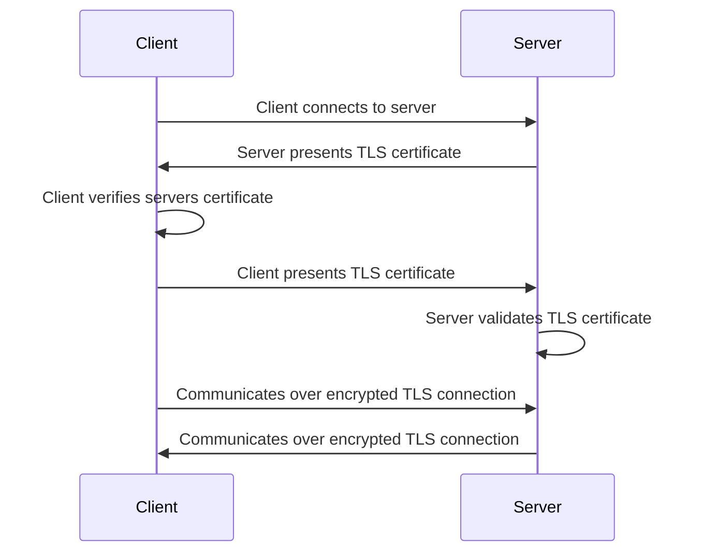
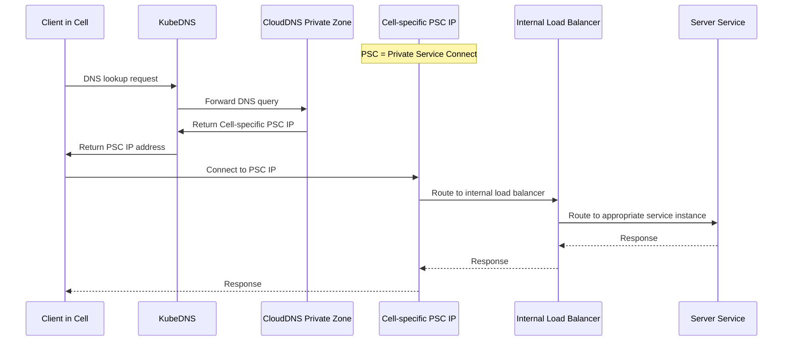

<div class="my-3 border-l-4 border-blue-500 bg-blue-50 px-4 py-3 rounded-r text-sm text-blue-800">
このページには今後予定されている製品・機能・機能性に関する情報が含まれています。ここに示す情報は参考目的のみです。購入・計画の決定にこの情報を使用しないでください。製品・機能・機能性の開発、リリース、タイミングは変更または延期される可能性があり、GitLab Inc. の独自の判断に委ねられています。
</div>

<div class="overflow-x-auto my-4">
<table class="w-full text-sm border-collapse">
<thead>
<tr class="bg-gray-100 text-left">
<th class="px-3 py-2 border border-gray-300">Status</th>
<th class="px-3 py-2 border border-gray-300">Authors</th>
<th class="px-3 py-2 border border-gray-300">Coach</th>
<th class="px-3 py-2 border border-gray-300">DRIs</th>
<th class="px-3 py-2 border border-gray-300">Owning Stage</th>
<th class="px-3 py-2 border border-gray-300">Created</th>
</tr>
</thead>
<tbody>
<tr>
<td class="px-3 py-2 border border-gray-300"><span class="inline-block rounded px-2 py-0.5 text-xs font-medium bg-gray-100 text-gray-700">proposed</span></td>
<td class="px-3 py-2 border border-gray-300"><a href="https://gitlab.com/daveyleach" class="text-blue-600 hover:underline">@daveyleach</a>, <a href="https://gitlab.com/tkhandelwal3" class="text-blue-600 hover:underline">@tkhandelwal3</a></td>
<td class="px-3 py-2 border border-gray-300"><a href="https://gitlab.com/sxuereb" class="text-blue-600 hover:underline">@sxuereb</a></td>
<td class="px-3 py-2 border border-gray-300"><a href="https://gitlab.com/daveyleach" class="text-blue-600 hover:underline">@daveyleach</a>, <a href="https://gitlab.com/tkhandelwal3" class="text-blue-600 hover:underline">@tkhandelwal3</a></td>
<td class="px-3 py-2 border border-gray-300"><span class="inline-block rounded px-2 py-0.5 text-xs font-medium bg-gray-100 text-gray-700">~devops::tenant scale</span></td>
<td class="px-3 py-2 border border-gray-300">2024-07-01</td>
</tr>
</tbody>
</table>
</div>


## 事前学習資料

- [内部 TLS](https://gitlab-com.gitlab.io/gl-infra/gitlab-dedicated/team/architecture/blueprints/internal_tls.html)

## 概要

私たちは、Cell サービス間のすべての通信がセキュアであり、両者のアイデンティティが検証されることを要求します。

## 目標

- Cell サービス間のすべての通信が、両者で暗号化され、一意に識別され、認証・認可されることを確保する。
- 内部 TLS に使用されている既存の PKI インターフェースを活用する。
- サーバーサービスとクライアントサービスの両方に対して明確な実装パスを提供する。
- 不必要な複雑さを導入せずに、セキュアなサービス間認証を可能にする。
- 適切な場合に mTLS 証明書に基づいた認可をサポートする。

### スコープ

このドキュメントは、Cell とそのサービス間の認証と認可のための相互 TLS（mTLS）の実装に具体的に焦点を当てています。

### スコープ外

- サービスメッシュ（例: Istio）の実装による mTLS でのトラフィック暗号化は、以下の理由でスコープ外です:
  - Cell 内で[内部 TLS](https://gitlab-com.gitlab.io/gl-infra/gitlab-dedicated/team/architecture/blueprints/internal_tls.html) を使用して TLS をすでに活用しているため、外部サービスをサポートするためにこの既存のブループリントを拡張することが、私たちのアーキテクチャとより一貫性があります。
  - サービスメッシュは、アプリケーション開発者が外部サービスとの mTLS を透過的に実装する方法を提供しますが、このアプローチは、追加のアプリケーションレベルの制御（JWT など）なしに唯一の認可メカニズムとして使用すると重大なセキュリティリスクをもたらします。脆弱性が存在する場合、攻撃者はクライアントをプロキシとして利用して mTLS サーバーに不正なリクエストを送信する可能性があります。根本的な問題は、サービスメッシュがサービスアイデンティティに基づいて通信を認可するのみで、それらのサービス内の個別のリクエストの正当性を検証しないため、リクエストレベルの検証メカニズムがない場合には完全な認可ソリューションとして不十分です。
- TLS は CDN/ロードバランサーとそのバックエンド間の通信や内部サービス間の通信をセキュア化するために使用されますが、このスコープは明示的に除外します:
  - 外部クライアントから GitLab サービスへの通信。
  - Cell 内のサービスと Cell 外の管理されていない Cell サービスとの通信。

### 実装原則

- **開発者エクスペリエンス:** mTLS の実装は、最小限のコード変更で開発者に透過的であるべきです。
- **セキュリティ:** 認可されたサービスのみが互いに通信できるべきです。
- **高可用性:** 証明書のローテーションはサービスの中断なしに自動的に行われる必要があります。
- **スケーラビリティ:** ソリューションはすべての Cell サービスに対して機能する必要があります。

## 要件

| 要件 | 説明 | 優先度 |
| ---------------------------------------| ------------------------------------------------------------------------------------------------| -------- |
| セキュリティ | 認可されたサービスのみが互いに通信できる | 高い |
| 高可用性 | 証明書はサービスの中断なしに自動的にローテーションできる | 高い |
| Cells サポート | すべての Cell サービスに使用できる | 高い |
| 認可サポート | アプリケーション開発者が認可に mTLS を使用できる | 高い |
| 秒単位での証明書プロビジョニング | 新しい証明書を秒単位で作成できる | 高い |
| 複数プロトコルサポート | HTTP/1.1、HTTP/2、gRPC をサポート | 高い |
| 内部トラフィック | クライアントとサーバーサービス間のすべてのトラフィックはクラウドプロバイダーのネットワーク内に留まる必要がある | 高い |
| 段階的な採用 | まず証明書なしのトラフィックも受け入れられるようにする | 中程度 |
| 監査可能 | すべてのサービスが mTLS によるセキュアな認証を使用していることを検証できる | 中程度 |
| クラウド管理 | クラウドサービスと統合できる | 中程度 |

## 非目標

- mTLS はユーザーレベルの認可を管理するためには考慮すべきではありません。

## 設計と実装の詳細

### mTLS アーキテクチャ



### mTLS 実装フロー

[内部 TLS ブループリント](https://gitlab-com.gitlab.io/gl-infra/gitlab-dedicated/team/architecture/blueprints/internal_tls.html#end-entity-certificates)から、GKE クラスターの GCP Secrets Manager からエンドエンティティのクライアント証明書を取得します。

#### サーバー/プロデューサーの設定

外部サービスのホストには以下の変更が必要です:

- サービスが公開アクセスできないことを確保するために、[内部ロードバランサー](https://cloud.google.com/load-balancing/docs/l7-internal)の後ろにサービスをデプロイする。
- ロードバランサーで [mTLS クライアント認証を設定する](https://cloud.google.com/load-balancing/docs/mtls#validation-steps)。
  - [認証されたアクセスのみを強制するために、Trust Config に Private Root CA 証明書をアップロードする](https://cloud.google.com/load-balancing/docs/mtls#architecture)。
- ロードバランサーをバックエンドとして [Private Service Connect] を設定する。
- Cell の GCP プロジェクトがサーバーの [Private Service Connect] エンドポイントに接続するための権限を設定する。

#### クライアント/コンシューマーの設定

外部 API を消費するサービスには以下の変更が必要です:

- クライアントサービスがデプロイされている VPC を使用して [Private Service Connect] エンドポイントに接続する。
- クライアントアプリケーションに証明書/鍵ペアをマウントする。
- [Private Service Connect] エンドポイントを通じて mTLS 接続を確立するようにクライアントコードを更新する。

以下の図は、Cell 内の Pod と外部サービス間の完全なリクエストフローを、サポートインフラストラクチャも含めて示しています:


このアーキテクチャの詳細な実装例と PoC のドキュメントについては、https://gitlab.com/gitlab-org/gitlab/-/issues/468640 を参照してください。

### mTLS による認証と認可

#### 認証

私たちの Cell サービスアーキテクチャにおける mTLS 認証は、透過的なプロキシではなく、明示的な証明書ローディングと接続セットアップによって機能します:

- **証明書ローディング**: 各サービスはファイルシステムからクライアント証明書と秘密鍵を明示的にロードする必要があります。これは信頼できるコードパスで行われます（[mTLS POC クライアントコード](https://gitlab.com/gitlab-com/gl-infra/cells/mtls_poc/-/blob/e1b90bb4a241c63389bb366f0dacd7c9e1dac10c/client/main.go#L30)を参照）。
- **接続の確立**: サービスは TLS クレデンシャルを送信リクエストに明示的に追加する必要があります（[リクエスト作成コード](https://gitlab.com/gitlab-com/gl-infra/cells/mtls_poc/-/blob/e1b90bb4a241c63389bb366f0dacd7c9e1dac10c/client/main.go#L124)を参照）。
- **証明書の検証**: GCP ロードバランサーはクライアントの証明書を信頼された CA に対して検証し、有効な証明書を持つサービスのみが接続できるようにします。

Go クライアントで TLS クレデンシャルをロードして使用する例:

```go
tlsCredentials, err := loadTLSCredentials()
if err != nil {
    log.Fatalf("Failed to load TLS credentials: %v", err)
}

// Create a connection with the TLS credentials
conn, err := grpc.Dial(serverAddr, grpc.WithTransportCredentials(tlsCredentials))

...
// loadTLSCredentials loads TLS credentials from file paths provided in environment variables
func loadTLSCredentials() (credentials.TransportCredentials, error) {
    // Get paths to TLS files from environment variables
    serverCACertPath := os.Getenv("SERVER_CA_CERT")
    if serverCACertPath == "" {
        return nil, fmt.Errorf("SERVER_CA_CERT environment variable is not set")
    }

    clientCertPath := os.Getenv("MTLS_CERT_CHAIN")
    if clientCertPath == "" {
        return nil, fmt.Errorf("MTLS_CERT_CHAIN environment variable is not set")
    }

    clientKeyPath := os.Getenv("MTLS_KEY")
    if clientKeyPath == "" {
        return nil, fmt.Errorf("MTLS_KEY environment variable is not set")
    }

    // Load server CA certificate
    serverCACertBytes, err := ioutil.ReadFile(serverCACertPath)
    if err != nil {
        return nil, fmt.Errorf("failed to read server CA certificate file: %v", err)
    }

    certPool := x509.NewCertPool()
    if !certPool.AppendCertsFromPEM(serverCACertBytes) {
        return nil, fmt.Errorf("failed to add server CA's certificate to pool")
    }

    // Load client certificate and key
    clientCert, err := tls.LoadX509KeyPair(clientCertPath, clientKeyPath)
    if err != nil {
        return nil, fmt.Errorf("failed to load client certificate and key: %v", err)
    }

    // Create the credentials and return it
    config := &tls.Config{
        Certificates: []tls.Certificate{clientCert},
        RootCAs:      certPool,
    }

    return credentials.NewTLS(config), nil
}
```

ソース: [mTLS POC クライアントコード](https://gitlab.com/gitlab-com/gl-infra/cells/mtls_poc/-/blob/e1b90bb4a241c63389bb366f0dacd7c9e1dac10c/client/main.go#L30)

#### 認可

私たちの mTLS 実装での認可は、認証が成功した後に発生し、クライアントのアイデンティティ情報に依存します:

- **証明書ベースのアイデンティティ**: クライアント接続の認証後、サーバーは認可の決定のためにクライアントの証明書からアイデンティティ情報を抽出します。
- **GCP ロードバランサーヘッダー**: バックエンドサービスに GCP ロードバランサーによって渡される[カスタム mTLS ヘッダー](https://cloud.google.com/load-balancing/docs/https/custom-headers#mtls-variables)を活用します。これには事前に抽出された証明書情報が含まれています。
- **ヘッダー処理**: サーバーはこれらのヘッダーを受信リクエストから抽出して、証明書を再解析せずにクライアントのアイデンティティと権限を決定します。
- **アクセス制御の適用**: 抽出されたアイデンティティ（通常はコモンネーム）に基づいて、サーバーはクライアントが要求されたリソースにアクセスする認可があるかどうかを決定します。

gRPC サーバーでの認可のための証明書情報の抽出と使用の例:

```go
md, ok := metadata.FromIncomingContext(ctx)
if !ok {
    return nil, status.Error(codes.Internal, "failed to get metadata")
}

// Get the value of X-Client-Cert-Subject-Dn
// Header keys in gRPC metadata are lowercase
clientCertDNs := md.Get("x-client-cert-subject-dn")

var cellName string
if len(clientCertDNs) > 0 {
    // Call the function to extract common name
    commonName, err := extractCommonNameFromSubjectDN(clientCertDNs[0])
```

Subject DN からコモンネームを抽出する関数:

```go
func extractCommonNameFromSubjectDN(base64SubjectDN string) (string, error) {
    // Decode base64
    derBytes, err := base64.StdEncoding.DecodeString(base64SubjectDN)
    if err != nil {
        return "", fmt.Errorf("failed to decode base64: %w", err)
    }

    // Parse the DER-encoded subject DN
    var rdnSequence pkix.RDNSequence
    _, err = asn1.Unmarshal(derBytes, &rdnSequence)
    if err != nil {
        return "", fmt.Errorf("failed to parse ASN.1 DER encoding: %w", err)
    }

    // Convert to a Name
    var subject pkix.Name
    subject.FillFromRDNSequence(&rdnSequence)

    // Return the common name
    return subject.CommonName, nil
}
```

ソース: [mTLS サーバーコード](https://gitlab.com/gitlab-com/gl-infra/cells/mtls_poc/-/blob/e1b90bb4a241c63389bb366f0dacd7c9e1dac10c/server/main.go#L31)

#### 代替認証方法に対する mTLS のメリット

私たちは Cell サービスアーキテクチャでの認証と認可の主要なメカニズムとして mTLS を選択するいくつかの主要な理由があります:

1. **インフラストラクチャ管理のアイデンティティ**: mTLS により、アプリケーション管理のトークンではなく、インフラストラクチャが提供するアイデンティティを活用できます。これによりアイデンティティ管理の責任をアプリケーションコードから、この目的に特化したインフラストラクチャコンポーネントに移します。

1. **簡素化されたシークレット管理**: トークンを環境変数や設定ファイルに保存する必要があることが多いトークンベースのアプローチ（JWT トークンなど）とは異なり、mTLS 証明書は既存の PKI インフラストラクチャによって自動的にプロビジョニング、ローテーション、および管理できます。これにより複数のメリットがあります:
   - アプリケーションコードや環境変数にハードコードされたシークレットがない
   - ログや設定ダンプを通じたトークン漏洩のリスクが低減
   - カスタムトークン管理ではなく標準的な証明書ライフサイクル管理

1. **マルチサービス互換性**: mTLS アプローチは、サービス固有の実装の詳細を必要とせずに複数のサービスに効果的にスケールします。各サービスは認証と認可に同じパターンに従い、Cell アーキテクチャ全体に一貫したセキュリティモデルを提供します。

1. **自動証明書ローテーション**: 証明書はサービスの中断なしに自動的にローテーションでき、トークンベースのアプローチではより複雑になることが多いです。既存の証明書管理インフラストラクチャがローテーションをシームレスに処理し、運用オーバーヘッドを削減します。

1. **デュアルパーパスセキュリティ**: mTLS は単一のメカニズムで暗号化と認証の両方を提供し、これらの懸念を分離するアプローチと比較してセキュリティアーキテクチャを簡素化します。

#### セキュリティの考慮事項

- 攻撃者が Pod でリモートコード実行（RCE）を行う場合、ファイルシステムに保存された証明書と鍵にアクセスできます。RCE は一般的に Pod 内のすべてのセキュリティ境界を侵害するため、これは固有の制限です。
- 設計は、攻撃者がネットワークリクエストを操作する限定的なアクセス権を持つがフルシステムアクセスを持たないシナリオでの不正なサービス間通信を防ぐことに焦点を当てています。
- 証明書のローテーションと適切なシークレット管理は、潜在的な証明書の侵害に関連するリスクを軽減するのに役立ちます。

### プライベートルート CA のリージョン回復力

#### Certificate Authority Service のリージョン制限

Google Cloud Certificate Authority Service はリージョナルサービスです。つまり [CA Service のリソースは特定の地理的リージョンに保存され、作成後は移動やエクスポートができません](https://cloud.google.com/certificate-authority-service/docs/locations)。Google Cloud のディザスタリカバリガイダンスに記載されているように、[リージョナルリソースはリージョン障害に耐えられず](https://cloud.google.com/architecture/disaster-recovery)、リージョン停止に対して脆弱です。

このリージョン制限は私たちの Cell アーキテクチャに特定のリスクをもたらします:

- **新しい Cell プロビジョニングの中断**: 単一のプライベートルート CA を持つ場合、リージョン停止中に別のリージョンに Cell を作成しようとすると、プライベートルート CA が利用できないため Cell プロビジョニングが失敗します。
- **既存の Cell の運用**: 重要なことに、既存の Cell はリージョン CA 停止中も通常通り動作し続けます。これらは引き続き有効で機能する発行済み証明書に依存しているためです。

#### マルチリージョンプライベートルート CA 戦略

リージョン回復力を達成し、新しい Cell プロビジョニングのための継続的な証明書操作を確保するために、各 Cell がデプロイリージョンにあるプライベートルート CA を使用するマルチリージョンプライベートルート CA 戦略を実装します。

##### 現在の実装

現在、以下のリージョンにプライベートルート CA をプロビジョニングしています:

- **us-east1** - 米国東部リージョンにデプロイされた Cell 用
- **us-central1** - 米国中部リージョンにデプロイされた Cell 用

##### 計画された拡張

戦略には、Cell がデプロイされるすべての主要リージョンをカバーするためのプライベートルート CA のデプロイメントの拡張が含まれます:

- **アメリカ**: us-east1、us-central1、us-west1、northamerica-northeast1
- **ヨーロッパ**: europe-west1、europe-west3、europe-north1
- **アジア太平洋**: asia-northeast1、asia-southeast1、australia-southeast1

##### 実装アーキテクチャと考慮事項

各 Cell は同じリージョンにあるプライベートルート CA からの証明書でプロビジョニングされます:

- **リージョンアライメント**: `us-east1` にデプロイされた Cell は `us-east1` のプライベートルート CA を使用します。
- **証明書信頼設定**: すべての Cell とサーバー（Topology Service）は、リージョン間の Cell の相互運用性を維持するために、どのリージョナルルート CA から発行された証明書も信頼するように設定される必要があります。
- **監視とアラート**: 包括的な監視により、リージョン CA 障害を迅速に検出し、リージョン間のプロビジョニング機能を可視化します。
- **証明書ライフサイクルの調整**: 証明書のローテーションとライフサイクル管理がすべてのリージョン CA で一貫して機能することを確認します。
- **リージョンキャパシティプランニング**: Cell プロビジョニングの需要に対して十分なリソースを確保するために、リージョン間の証明書発行容量と使用状況を監視します。

##### マルチリージョンアプローチのメリット

- **新しい Cell プロビジョニングの回復力**: 1 つのリージョンで停止が発生しても、新しい Cell はそれぞれのリージョナルプライベートルート CA を使用して他のリージョンで継続してプロビジョニングできます。
- **レイテンシーの低減**: 各 Cell は証明書操作の最適なパフォーマンスのために地理的に近いルート CA を使用します。
- **リージョンの独立性**: 各リージョンは独立して動作するため、リージョン停止はそのリージョンの新しい Cell プロビジョニングにのみ影響します。
- **リージョン分離**: リージョン停止はそのリージョンに限定され、他のリージョンでの Cell の運用やプロビジョニングには影響しません。
- **既存の運用の継続性**: 既存の Cell はリージョン CA 停止中も通常通り動作し続けます。進行中の操作に新しい証明書の発行が必要ないためです。

このマルチリージョン戦略により、Cell プロビジョニング機能がリージョン停止に対して回復力を維持しながら、Cell アーキテクチャのセキュリティ姿勢と運用効率を維持します。既存の Cell はリージョン CA 停止中も動作し続けますが、このアプローチにより影響を受けていないリージョンでインフラストラクチャを拡張し続けることができます。

### 証明書ライフサイクル管理

#### 証明書の TTL

証明書の有効期間（TTL）値は、業界のベストプラクティスと私たちの内部セキュリティ要件に従って設定されています。以下の TTL 値が PKI インフラストラクチャに対して設定されています（[詳細はこちらで議論されています](https://gitlab.com/gitlab-com/gl-infra/tenant-scale/cells-infrastructure/team/-/issues/335)）:

| 証明書タイプ | TTL |
| --------------- | --- |
| ルート CA | 10 年 |
| 中間/下位 CA | 5 年 |
| エンドエンティティ証明書 | 13 ヶ月 |

これらの TTL 値は、セキュリティ要件（侵害された証明書の露出時間の制限）と運用オーバーヘッド（ローテーションの頻度）のバランスを取っています。

#### 証明書のローテーション

中断なく継続的な運用を確保するために、証明書は有効期限前に予防的にローテーションされます:

- **中間 CA 証明書**: 有効期限の 90 日前にローテーションされ、[内部 TLS ブループリント](https://gitlab-com.gitlab.io/gl-infra/gitlab-dedicated/team/architecture/blueprints/internal_tls.html)に合わせています。
- **エンドエンティティ証明書**: 有効期限の 60 日前にローテーションされます。

中間証明書とエンドエンティティ証明書のローテーションは [Instrumentor](https://gitlab.com/gitlab-com/gl-infra/gitlab-dedicated/instrumentor) を通じて自動化されており、以下に実装されたこれらの証明書のプロビジョニングとローテーションを処理します:

- [エンドエンティティ証明書のローテーション](https://gitlab.com/gitlab-com/gl-infra/gitlab-dedicated/instrumentor/-/blob/7003562f05ead918fa236f5d7810030f248c14ea/aws/onboard/modules/gitlab-inter-pod-tls-certs/main.tf#L17)
- [中間証明書のローテーション](https://gitlab.com/gitlab-com/gl-infra/gitlab-dedicated/instrumentor/-/blob/7003562f05ead918fa236f5d7810030f248c14ea/aws/onboard/modules/intermediate-internal-cert/cert.tf#L18)

##### ルート CA のローテーション

ルート CA のローテーションはより慎重なオーケストレーションが必要です。ローテーションは 5 年ごと（または必要に応じて）、[Certificate Authority Service のドキュメント](https://cloud.google.com/certificate-authority-service/docs/managing-ca-rotation)に記載された Google Cloud の CA ローテーションのベストプラクティスに従って実行されます。

ルート CA のローテーションプロセスは以下のように要約されます:

1. 有効期限が切れる既存のルート CA を含む CA プールを特定する。
2. STAGED 状態で同じ CA プールに新しい CA を作成する。
3. 新しい CA の状態を ENABLED に変更し、古い CA と新しい CA の両方から証明書の発行を可能にする。
4. 新しい CA によって発行された証明書で認証されたリクエストを受け入れるように、サーバー（Topology Service）の Trust Store 設定を更新する。
5. 新しいルート CA を使用して新しい中間 CA 証明書をプロビジョニングするように [Instrumentor](https://gitlab.com/gitlab-com/gl-infra/gitlab-dedicated/instrumentor) を更新する。
6. 古い CA の状態を DISABLED に変更し、新しい証明書の発行を防ぎながら信頼を維持する。
7. すべてのクライアントが古い CA から発行された証明書の使用を停止するまで待つ（最大証明書ライフタイムを待つか、クライアント証明書の使用状況を監視することによる）。
8. 新しい CA を使用してすべての中間証明書が発行されたら古い CA を削除する。

この慎重にオーケストレーションされたプロセスにより、PKI インフラストラクチャのセキュリティ整合性を維持しながら、ルート CA のローテーション中のゼロダウンタイムを確保します。

### mTLS サーバー通信のための DNS 解決

mTLS が正しく機能するために、クライアントはサーバー証明書のサブジェクト代替名（SAN）フィールドに存在する DNS 名を使用してサーバーに到達する必要があります。[Private Service Connect] を使用する私たちの Cell アーキテクチャでは、各 Cell が同じサービスに対して異なる IP アドレスを持つ可能性があるため、これはユニークな課題を提示します。

#### 実装の詳細

適切な証明書検証を維持しながらすべての Cell 間で一貫した DNS 解決を確保するために、以下のアプローチを実装します:



1. **Cell ごとのプライベート CloudDNS ゾーン**:
   - 各 Cell プロジェクトには独自の CloudDNS プライベートゾーンがあります。
   - このゾーンにはすべての Cell に対して同じ DNS 名（例: `topology-service.gitlab.net`）が含まれます。
   - 各ゾーンは、PSC エンドポイントが作成されるときに Cell の VPC から動的に予約された Cell 固有の Private Service Connect IP に解決されます。

2. **DNS 解決フロー**:
   - クライアントサービスはリクエストで標準 DNS 名を使用します。
   - KubeDNS がリクエストを CloudDNS プライベートゾーンに転送します。
   - CloudDNS は名前を Cell の特定の [Private Service Connect] エンドポイント IP に解決します。
   - リクエストは [Private Service Connect] エンドポイントを通じて正しいサービスに到達します。

3. **証明書の検証**:
   - サーバー証明書の SAN には標準 DNS 名が含まれます。
   - クライアントはこの名前に対して証明書を検証し、適切な mTLS 認証を確保します。

#### メリット

- **一貫した命名**: すべての Cell はサービスにアクセスするために同じ DNS 名を使用し、設定を簡素化します。
- **証明書の互換性**: DNS 名は証明書の SAN と一致し、適切な mTLS 検証を可能にします。
- **分離**: 各 Cell は特定の [Private Service Connect] エンドポイントへの独自の DNS 解決を維持します。
- **実績あるソリューション**: このアプローチはすでに Vault サービスの本番環境に実装・テストされています。
- **Infrastructure as Code**: すべての DNS 設定は Terraform で管理されています。

#### 実装の参考

この実装は既存のインフラストラクチャパターンを活用します:

1. **サービスの公開**: 内部ロードバランサーが serviceAttachment を通じて [Private Service Connect] で公開されます。
2. **アクセス制御**: プロジェクトはサービスに接続するために動的に設定されます。
3. **DNS 設定**: プライベート CloudDNS ゾーンが各コンシューマープロジェクトに作成されます。

このアプローチは、追加の権限なしで、またはクラスターの DNS プロバイダーとして CloudDNS に切り替えることなく、クラスターの DNS プロバイダーとして KubeDNS とシームレスに機能します。このソリューションはすでに Vault サービスの本番環境に実装・運用されており、以下の参考設定があります:

- [Private Service Connect serviceAttachment によるサービスの公開](https://ops.gitlab.net/gitlab-com/gl-infra/config-mgmt/-/blob/addc5fbd9627fa2fc4a097be36e6563bfe310f44/environments/ops/private-service-connect.tf#L9)
- [サービスアクセスのためのプロジェクト認可](https://ops.gitlab.net/gitlab-com/gl-infra/config-mgmt/-/blob/addc5fbd9627fa2fc4a097be36e6563bfe310f44/environments/ops/private-service-connect.tf#L22)
- [コンシューマープロジェクトの DNS ゾーン設定](https://ops.gitlab.net/gitlab-com/gl-infra/config-mgmt/-/blob/addc5fbd9627fa2fc4a097be36e6563bfe310f44/environments/gitlab-analysis/private_service_connect.tf#L54)

  [Private Service Connect]: https://cloud.google.com/vpc/docs/private-service-connect/

## サポートされているクライアントとサーバー

| クライアント | サーバー |
| ------ | ------ |
|GitLab|Topology Service|
