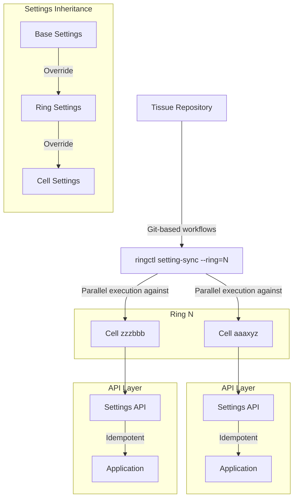

<div class="my-3 border-l-4 border-blue-500 bg-blue-50 px-4 py-3 rounded-r text-sm text-blue-800">
このページには今後予定されている製品・機能・機能性に関する情報が含まれています。ここに示す情報は参考目的のみです。購入・計画の決定にこの情報を使用しないでください。製品・機能・機能性の開発、リリース、タイミングは変更または延期される可能性があり、GitLab Inc. の独自の判断に委ねられています。
</div>

<div class="overflow-x-auto my-4">
<table class="w-full text-sm border-collapse">
<thead>
<tr class="bg-gray-100 text-left">
<th class="px-3 py-2 border border-gray-300">Status</th>
<th class="px-3 py-2 border border-gray-300">Authors</th>
<th class="px-3 py-2 border border-gray-300">Coach</th>
<th class="px-3 py-2 border border-gray-300">DRIs</th>
<th class="px-3 py-2 border border-gray-300">Owning Stage</th>
<th class="px-3 py-2 border border-gray-300">Created</th>
</tr>
</thead>
<tbody>
<tr>
<td class="px-3 py-2 border border-gray-300"><span class="inline-block rounded px-2 py-0.5 text-xs font-medium bg-gray-100 text-gray-700">proposed</span></td>
<td class="px-3 py-2 border border-gray-300"></td>
<td class="px-3 py-2 border border-gray-300"><a href="https://gitlab.com/tkuah" class="text-blue-600 hover:underline">@tkuah</a></td>
<td class="px-3 py-2 border border-gray-300"></td>
<td class="px-3 py-2 border border-gray-300"></td>
<td class="px-3 py-2 border border-gray-300"></td>
</tr>
</tbody>
</table>
</div>


## ゴール

私たちは、複数の Cell にまたがるアプリケーション設定を同期するための自動化されたソリューションを求めています。このソリューションは、既存のリングベースのデプロイモデルと統合しながら、グローバルな一貫性とローカルなカスタマイズの両方をサポートしなければなりません。

現在、GitLab.com がリングに組織された Cell による分散デプロイモデルへ移行する中で、運用上の課題が生じています。Ring 0（レガシーモノリス）は設定管理に Helm チャートを使用していますが、Ring 1 以降の Cell では SRE による手動更新が必要となり、Cell とリングの数が拡大するにつれて運用負荷、設定ドリフトのリスク、スケーラビリティへの懸念が生じています。

## 主要な用語

- **Desired State（望ましい状態）**: バージョン管理されたリポジトリに定義された設定（命令型の Configuration as Code）
- **Actual State（実際の状態）**: 稼働中の Cell インスタンス上の現在のランタイム設定
- **Configuration Drift（設定ドリフト）**: Actual State が Desired State から乖離した場合

## 要件

| 要件 | 説明 |
|------|------|
| Configuration as Code | すべての設定をバージョン管理リポジトリに格納する |
| Live states | 現在稼働中の Cell からの状態を読み取る |
| リングベースの統合 | 既存のリングデプロイモデルを基盤とする |
| 階層的設定 | ベース → リング → Cell のオーバーライドによる継承をサポートする |
| フィードバック機構 | 操作の成功/失敗について明確なフィードバックを提供する |
| スケーラビリティ設計 | 増加する Cell とリングの数を効率的に処理する |
| セキュアな認証 | ソリューションと Cell 間の認証は最小権限を持ち、ローテーション可能であること |
| 最小限のシークレット管理 | シークレットの送信や保存の必要性を削減する |

## 提案するソリューション

これを実現するために、効率的な並行実行と Cell との API ベースの通信を活用するソリューションが有効です。いくつかの実装アプローチが考えられますが（後述）、既存の `ringctl` ツールを拡張することが一つの有望な方針です。

## 実装のアイデア

上記の要件に対応するため、想定される設定同期システムには以下が含まれます。

### API の考慮事項

バックエンドチームは、設定管理のためのセキュアな API エンドポイントを開発する重要なパートナーとなります。この API の主な要件は次のとおりです。

- **内部ツールのみのアクセス**: API は同期ツール（ringctl または類似のもの）のみがアクセス可能で、顧客はアクセスできない
- **スコープ付き認証**: 認証は Cell の設定操作に特定のスコープでなければならない
- **ローテーション可能な認証情報**: 認証機構は認証情報のローテーションをサポートしなければならない
- **将来の設計柔軟性**: 具体的な HTTP メソッド（GET/PUT/PATCH）や詳細なエンドポイント設計は実装フェーズで決定できる

#### 認証戦略

**JWT シークレット管理**: JWT 署名シークレットは Vault に保存され、リングデプロイ操作時に Tissue プロジェクトの CI 環境で利用可能になります。このアプローチは、デプロイツールとターゲット Cell 間のセキュリティ境界を維持しながら、既存のシークレット管理インフラを活用します。

**環境ベースのシークレット**: JWT 署名シークレットは、リングや Cell ごとではなく、環境（非本番/本番）ごとに区別されます。このアプローチは、不必要なキー管理の複雑さを避けながら、環境レベルの認証情報ローテーションを可能にし、セキュリティの分離と運用のシンプルさのバランスを取ります。

**統一認証アプローチ**: JWT ベースの認証戦略は、フィーチャーフラグ制御やレート制限管理を含む他のクロス Cell 操作の基盤として機能します。これにより、運用ツール全体で異なる認証機構が増殖するのを避けながら、内部ツールに一貫した認証パターンを生み出します。

このアプローチは、セキュリティと運用要件を優先しながら、バックエンドチームとの協力による実装の詳細の改善を可能にします。

### 設定の構造

継承をサポートする階層構造は次のように整理できます。

```bash
settings/
  all_cells.yml         # すべての Cell のベース設定
  rings/
    ring1.yml           # リング固有のオーバーライド
    ring2.yml
  cells/
    cell_a.yml          # Cell 固有のオーバーライド
    cell_b.yml
```

### 想定される実装アプローチ

検討するアプローチの一つとして、`ringctl` ツールに設定同期機能を追加する方法があります。

```bash
ringctl setting-sync --ring=<ring_name> [options]
```

この実装は次のことが可能です。

1. リング内の複数の Cell に対する並行操作をサポートする
2. Cell から Actual State を読み取り、バージョン管理の Desired State と比較する get-then-update パターンを実装する
3. 操作の詳細なフィードバックを提供する
4. 適切なエラーハンドリングとレジリエンス機構を含む

### 考えられるアーキテクチャ



## 想定されるメリット

- **手動設定の削減**: 運用負荷を軽減し、人為的ミスの可能性を低減する
- **一貫性の確保**: Cell 間の設定ドリフト防止に貢献する
- **既存ワークフローへの統合**: リングベースのデプロイモデルの経験を活かす
- **柔軟性の向上**: 必要に応じてグローバルな一貫性と Cell 固有のカスタマイズの両方を実現する
- **スケーラビリティのサポート**: 並行実行によって増加する Cell とリングの数を処理できる可能性がある
- **アトミック性の提供**: リング内のすべての Cell が一緒に更新されることを保証する
- **設定の整合性の維持**: 稼働中の Cell からの Actual State をバージョン管理の Desired State と比較して、ドリフトを検出し修正する
- **セキュリティの強化**: 個人トークンの代わりにサービスアカウント認証を使用する
- **可視性の提供**: 各操作の成功/失敗情報を明確に提供する

## 考慮事項と課題

- **API 開発の協力**: 適切な内部 API エンドポイントを開発するためにバックエンドチームとの連携が必要
- **複雑さの管理**: ツールやデプロイプロセスへの新しい要素には、十分なドキュメントが必要
- **クロスチームの調整**: SRE、バックエンド、プラットフォームチーム間のコラボレーションが有益
- **新しい障害パターン**: 設定のデプロイが、対応戦略が必要な新しい種類の障害に遭遇する可能性がある
- **サービスアカウントのセキュリティ**: サービスアカウントの認証情報の丁寧な取り扱いが必要
- **パフォーマンスへの考慮**: 並行した設定更新がパフォーマンスに影響を与える可能性がある
- **検証の必要性**: 設定が正しく適用されたことの確認が重要
- **一貫性の管理**: 更新中の一時的な不整合に特定の対応アプローチが必要になる場合がある

## 検討に値する代替アプローチ

この課題に対処できるいくつかの選択肢があります。

### Terraform ベースの設定管理

**アプローチ**: Cell 全体の設定管理に Terraform を活用する。

**考慮事項**:

- 確立されたインフラストラクチャ as コードツールである利点がある
- 強力な状態管理機能を提供する
- 設定への宣言的なアプローチを提供する
- 分散環境でのステートファイルのロックにいくつかの課題がある
- アプリケーションレベルの設定には複雑さをもたらす可能性がある
- 動的なアプリケーション設定に必要なものとは異なる強みを持つ
- 実際の設定からの状態ドリフトが発生する可能性がある

### GitOps アプローチ（ArgoCD/Flux）

**アプローチ**: Git リポジトリから設定を自動的に適用するために GitOps ツールを実装する。

**考慮事項**:

- Desired State として Git を持つ命令型アプローチを提供する
- 組み込みの調整メカニズムを含む
- Git 履歴による優れた監査証跡を作成する
- 既存の Instrumentor や ringctl パッチングとの相互作用を考慮する必要がある
- デプロイアーキテクチャに新しい要素を追加する
- 一部の適応でカスタマイズ要件をサポートできる可能性がある

### カスタム同期サービス

**アプローチ**: 設定同期専用のカスタマイズされたサービスを開発する。

**考慮事項**:

- 要件に合わせて設計できる
- 正確なユースケースに最適化できる可能性がある
- 開発リソースが必要
- 維持・運用する新しいサービスを作成する
- 適切な場所で既存の機能を活用できる

### API ベースの設定管理

**アプローチ**: 設定同期のための API ベースの実行を使用するために既存のツールを基盤とする。

**考慮事項**:

- 既存のツールと知識を基盤とする
- べき等操作をサポートできる
- API ベースの実行により SSH 依存関係を回避する
- 新しい機能で既存のツールを強化する
- 新しい API エンドポイントについての協力が必要

## 探索すべき技術的領域

### API 設計の協力

バックエンドチームと設定 API について議論する際、いくつかの領域を探索する価値があります。

1. **API 構造の選択肢**:
   - 設定管理のための専用エンドポイントの作成
   - 設定操作をサポートするための既存 API の拡張
   - 適切な URL 構造と命名規則の検討

2. **認証アプローチ**:
   - サービスアカウント認証の選択肢
   - 適切な権限スコープ
   - 内部 API のセキュリティ考慮事項

3. **リクエスト/レスポンスの形式**:
   - スキーマ検証アプローチ
   - エラーハンドリングとレポーティング
   - 部分更新のサポート

### サービスアカウントのセキュリティ

サービスアカウントのセキュアな認証情報管理には以下の検討が必要です。

1. 適切な権限を持つ専用サービスアカウントの作成
2. セキュアなシークレットストレージとローテーションの実装
3. サービスアカウント使用の監査とモニタリングの確立

### レジリエンス戦略

同期プロセスはさまざまなシナリオを処理する必要があります。

1. 同期中のネットワーク中断
2. 一部の Cell が正常に更新されるが他は更新されないという部分的な成功シナリオ
3. 失敗したデプロイのロールバックオプション
4. 詳細なエラーレポートとロギング

### クロス Cell 検証

設定が適切に同期されていることを確認するための検証メカニズムには以下が含まれます。

1. 同期試行後の各 Cell のステータスレポート
2. Cell 全体にわたる定期的な一貫性チェック
3. 検出された不整合の調整プロセス

### スケーリングアプローチ

リングと Cell の数が増えるにつれて、以下を考慮する必要があります。

1. 並行操作中のリソース使用量
2. ネットワーク問題に対するタイムアウトとリトライ機構
3. 非常に大規模なデプロイメントのバッチング戦略
4. 同期イベントのモニタリングとアラート

### 設定の継承

階層的な設定構造は、以下に関する疑問を提起します。

1. ベース、リング、Cell の設定間の競合がどのように解決されるか
2. どのレベルでどの設定がオーバーライドできるか
3. 設定の削除をどのように処理するか（null 値 vs 明示的な削除）
4. オペレーター向けの継承パターンのドキュメント

## 実装の方向性

問題空間の探索に基づき、前進するための主要な考慮事項は次のとおりです。

1. **バックエンド API の協力**:
   - バックエンドチームとセキュアな API エンドポイントについて協力する
   - サービスアカウントに適切な認証を実装する
   - 設定の取得と更新をサポートする

2. **設定の構造**:
   - 階層的な組織で Git リポジトリに設定を保存する
   - ベース → リング → Cell からの継承を実装する
   - 環境固有の値のための変数置換をサポートする

3. **同期戦略**:
   - 設定同期機能で既存のツールを基盤とする
   - 複数の Cell に対して効率的な並行実行を使用する
   - 不要な変更を最小化するための get-then-update パターンを実装する
   - 操作の詳細なレポートを提供する

4. **実装の選択肢**:
   - 以下を含むいくつかのアプローチが効果的に機能する可能性があります:
     - 同期ツールからの直接 API 呼び出し
     - SSH ではなく API を介して動作する設定管理ツール
     - 既存のツールを基盤とする同期ロジック

各アプローチにはそれぞれのメリットがあります。最終的な実装の決定は、利用可能な専門知識、既存システムとの統合、および運用要件を考慮して行うべきです。
