<div class="my-3 border-l-4 border-blue-500 bg-blue-50 px-4 py-3 rounded-r text-sm text-blue-800">
このページには今後予定されている製品・機能・機能性に関する情報が含まれています。ここに示す情報は参考目的のみです。購入・計画の決定にこの情報を使用しないでください。製品・機能・機能性の開発、リリース、タイミングは変更または延期される可能性があり、GitLab Inc. の独自の判断に委ねられています。
</div>

<div class="overflow-x-auto my-4">
<table class="w-full text-sm border-collapse">
<thead>
<tr class="bg-gray-100 text-left">
<th class="px-3 py-2 border border-gray-300">Status</th>
<th class="px-3 py-2 border border-gray-300">Authors</th>
<th class="px-3 py-2 border border-gray-300">Coach</th>
<th class="px-3 py-2 border border-gray-300">DRIs</th>
<th class="px-3 py-2 border border-gray-300">Owning Stage</th>
<th class="px-3 py-2 border border-gray-300">Created</th>
</tr>
</thead>
<tbody>
<tr>
<td class="px-3 py-2 border border-gray-300"><span class="inline-block rounded px-2 py-0.5 text-xs font-medium bg-gray-100 text-gray-700">rejected</span></td>
<td class="px-3 py-2 border border-gray-300"></td>
<td class="px-3 py-2 border border-gray-300"></td>
<td class="px-3 py-2 border border-gray-300"></td>
<td class="px-3 py-2 border border-gray-300"></td>
<td class="px-3 py-2 border border-gray-300"></td>
</tr>
</tbody>
</table>
</div>


_このプロポーザルは [ルーティングサービスのプロポーザル](../http_routing_service.md) によって取って代わられました_


<div class="my-4 border-l-4 border-amber-500 bg-amber-50 px-4 py-3 rounded-r">

このドキュメントは作成中であり、Cells 設計の非常に初期の状態を表しています。重要な側面がまだドキュメント化されていませんが、将来的に追加する予定です。これは Cells の可能なアーキテクチャの一つであり、どのアプローチを実装するかを決定する前に代替案と比較検討する予定です。このアプローチを実装しないことにした場合でも、このドキュメントはそのアプローチを選択しなかった理由を記録するために保持されます。

</div>


`gitlab_users`、`gitlab_routes`、`gitlab_admin` に関連するテーブルを分解して、すべての Cell 間で共有できるようにし、どの Cell でもユーザーの認証とリクエストを正しい Cell にルーティングできるようにします。Cell は自身が所有していないリソースのリクエストを受け取る場合がありますが、正しい Cell にリダイレクトする方法を知っています。

ルーターはステートレスであり、`routes` データベースから読み取りません。つまり、データベースとのすべてのやり取りは Rails モノリスから行われます。このアーキテクチャは、低トラフィックのデータベースをリージョン間でレプリケートすることを許可することでリージョンもサポートします。

ユーザーは Cells の概念に直接さらされるのではなく、選択した Organization に応じて異なるデータを見ます。
[Organizations](../goals.md#organizations) は、アプリケーション内の分離を強制し、Organization は単一の Cell にのみ存在できるため、どのリクエストがどの Cell にルーティングされるかを決定できるようにする新しいエンティティとして導入されます。

## 違い

このプロポーザルと[ルート学習](proposal-stateless-router-with-routes-learning.md)を使用したものとの主な違いは、このプロポーザルが常にいずれかの Cell にリクエストを送ることです。リクエストが処理できない場合、リクエストは関連するヘッダーとともにバウンスされます。これにはリクエストのバッファリングが必要です。リクエストのデコードを Rails が URI またはリクエストのボディのいずれかで行えることも可能にします。つまり、各リクエストが複数回送信され、結果として複数回処理される可能性があります。

[ルート学習プロポーザル](proposal-stateless-router-with-routes-learning.md)では、ルーティング可能な情報が常に URI にエンコードされる必要があり、ルーターはプリフライトリクエストを送信します。

## 図による概要

これは、ユーザーリクエストが DNS を介して最も近いルーターにルーティングされ、ルーターがリクエストを送る Cell を選択する方法を示しています。

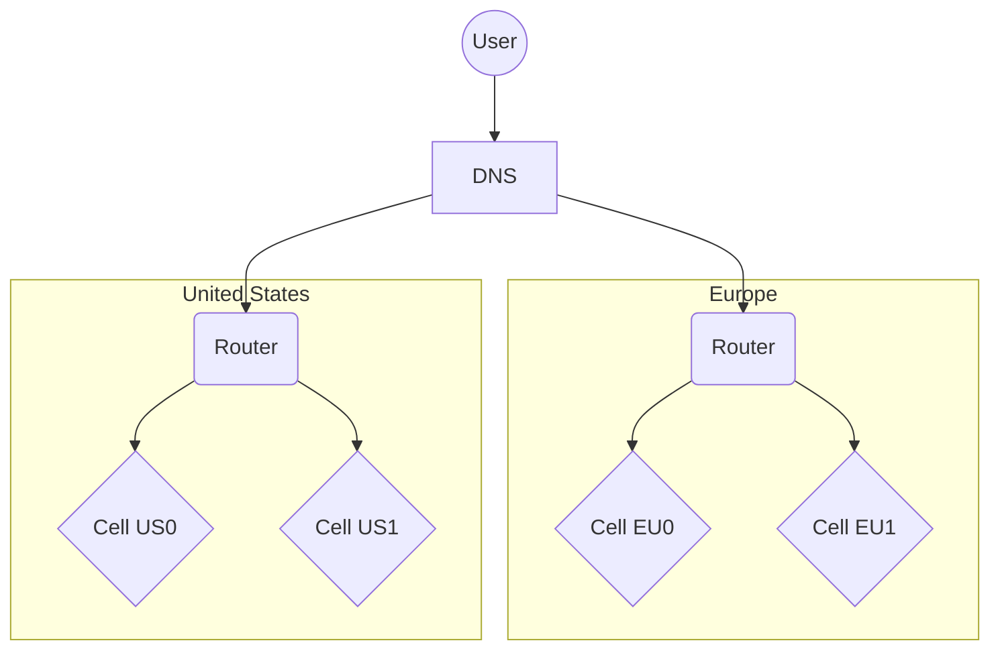

<details><summary>詳細表示</summary>

これは、ルーターが実際にどの Cell にもリクエストを送ることができることを示しています。ユーザーは地理的に最も近いルーターを使用します。

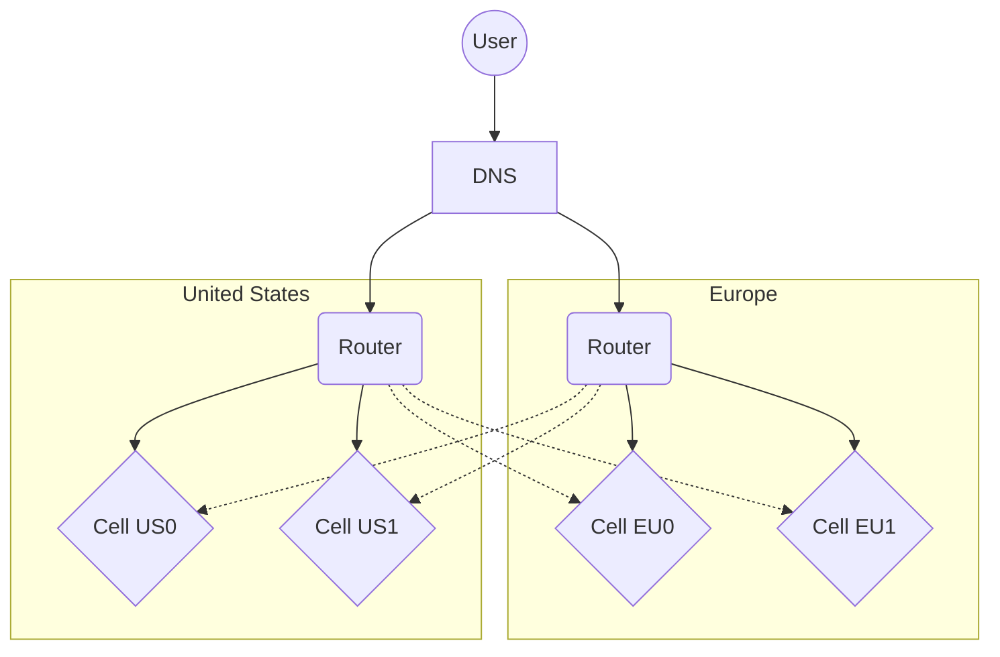

</details>

<details><summary>さらに詳細表示</summary>

これはデータベースを示しています。`gitlab_users` と `gitlab_routes` は US リージョンにのみ存在しますが、他のリージョンにレプリケートされます。レプリケーションには矢印がありません（図が読みにくくなるため）。

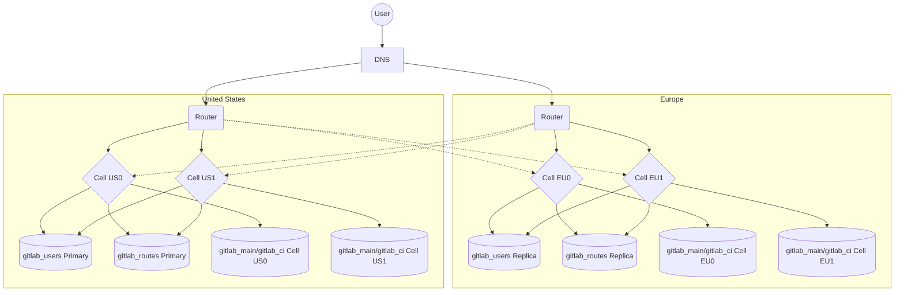

</details>

## 変更点の概要

1. ユーザーデータ（プロファイル設定、認証資格情報、パーソナルアクセストークンを含む）に関連するテーブルは `gitlab_users` スキーマに分解されます
1. `routes` テーブルは `gitlab_routes` スキーマに分解されます
1. `application_settings`（およびおそらくいくつかの他のインスタンスレベルのテーブル）は `gitlab_admin` スキーマに分解されます
1. `routes` テーブルに新しいカラム `routes.cell_id` が追加されます
1. リクエストをルーティングする Cell を選択するために新しいルーターサービスが存在します
1. GitLab に Organization という新しいコンセプトが導入され、ユーザーは「デフォルト Organization」を選択できるようになります。これはユーザーレベルの設定です。デフォルト Organization は、`/dashboard` のような曖昧なルートから `/organizations/my-organization/-/dashboard` のような Organization スコープのルートにユーザーをリダイレクトするために使用されます。レガシーユーザーには特別なデフォルト Organization があり、`Cell US0` のグローバルリソースを引き続き使用できます。既存のすべてのネームスペースはこのパブリック Organization に最初は移動されます。
1. Cell が自身が所有していない `routes.cell_id` のリクエストを受け取った場合、ルーターが正しい Cell にリクエストを送れるように `X-Gitlab-Cell-Redirect` ヘッダーとともに `302` を返します。正しい Cell は、このリクエストをどのようにキャッシュするかに関する情報を含む `X-Gitlab-Cell-Cache` ヘッダーも設定できます。例えば、リクエストが `/gitlab-org/gitlab` であれば、ヘッダーは `/gitlab-org/* => Cell US0` をエンコードします（例として、`/gitlab-org/` で始まるリクエストは常に `Cell US0` にルーティングできます）
1. どの Cell にリクエストを送るべきか（キャッシュから）分からない場合、ランダムにリージョン内の Cell を選択します
1. `gitlab_users` と `gitlab_routes` への書き込みは US リージョンのプライマリ PostgreSQL サーバーに送られますが、読み取りは同じリージョンのレプリカから行えます。これらの書き込みにはレイテンシが追加されますが、GitLab の他の部分と比較してまれであると予想されます。

## 最初のイテレーションにおけるデフォルト Organization の詳細説明

すべてのユーザーは、ユーザー設定で制御できる新しいカラム `users.default_organization` を取得します。私たちは `GitLab.com Public` Organization のコンセプトを導入します。これはすべての既存ユーザーのデフォルト Organization として設定されます。この Organization により、ユーザーは `Cell US0` のすべてのネームスペースのデータを表示できます（例えば、元の GitLab.com インスタンス）。この動作は、`/dashboard` のようなグローバルページを表示するときにそれが Organization にスコープされていることを知らされない既存ユーザーには見えない場合があります。

`GitLab.com Public` 以外のデフォルト Organization を持つ新しいユーザーは、異なるユーザー体験を持ち、読み込む各ページが常に単一の Organization にスコープされていることを完全に認識します。これらのユーザーは `/dashboard` のようなグローバルページを読み込むことができず、`/organizations/<DEFAULT_ORGANIZATION>/-/dashboard` にリダイレクトされます。これはレガシー API にも当てはまる場合があり、そのようなユーザーは Organization にスコープされた API のみを使用できる場合があります。

## 管理者エリア設定の詳細説明

私たちは、管理者エリアの設定を維持および同期することが煩雑で痛みを伴うと考えています。これを避けるために、すべての管理者エリア設定を `gitlab_admin` スキーマに分解して共有します。これは（他の共有スキーマと同様に）書き込みトラフィックが非常に少ないため安全であるはずです。

異なる Cell が異なる設定を必要とする場合（例えば Elasticsearch の URL）、関連する `application_settings` の行にテンプレート化された形式を使用して Cell ごとに動的に設定できるようにします。それが難しい場合は、`per_cell_application_settings` という新しいテーブルを導入し、Cell ごとに異なる設定を可能にする Cell ごとの 1 行を持つようにします。これはまだ `gitlab_admin` スキーマの一部として共有され、すべての Cell の設定同期を一元的に管理してシンプルにできます。

## メリット

1. ルーターはステートレスであり、多くのリージョンに存在できます。Anycast DNS を使用して最も近いリージョンに解決します。
1. Cell が誤った Cell のネームスペースのリクエストを受け取っても、ユーザーは正しいレスポンスを受け取り、次のリクエストが正しい Cell に送られるようにルーターでキャッシュされます
1. コードの大部分はまだ `gitlab` Rails コードベースに存在します。ルーターは実際に GitLab の URL がどのように構成されているかを理解する必要はありません。
1. `gitlab_users`、`gitlab_routes`、`gitlab_admin` の読み取りと書き込みの責任がまだ Rails にあるため、ドメインモデルを分離して新しいインターフェースを構築する必要があるサービスを抽出する場合と比較して、Rails アプリケーションへの変更が最小限で済みます。
1. 別のルーティングサービスと比較して、これにより Rails アプリケーションが URL を正しい Cell にマッピングする方法について、より複雑なルールをエンコードでき、一部の既存の API エンドポイントで機能する可能性があります。
1. すべての新しいインフラストラクチャ（ルーターのみ）はオプションであり、シングル Cell のセルフマネージドインストールではルーターを実行する必要さえなく、他の新しいサービスもありません。

## デメリット

1. `gitlab_users`、`gitlab_routes`、`gitlab_admin` データベースはリージョン間でレプリケートする必要があり、書き込みはリージョンをまたぐ必要があります。この実現可能性を判断するために、関連するテーブルの書き込み TPS を分析する必要があります。
1. 多くの異なる Cell からデータベースへの共有アクセスは、それらが Postgres スキーマレベルで結合されることを意味し、データベーススキーマの変更はすべての Cell のデプロイと同期して慎重に行う必要があります。これにより、API を制御する共有サービスを持つアーキテクチャと比較して、Cell を密接に近いバージョンで維持することが制限されます。
1. ほとんどのデータは適切なリージョンに保存されますが、別のリージョンからプロキシされるリクエストがある可能性があり、特定のコンプライアンスの種類には問題になる可能性があります。
1. `gitlab_users` と `gitlab_routes` データベースのデータはすべてのリージョンでレプリケートされる必要があり、特定のコンプライアンスの種類には問題になる可能性があります。
1. URL が多種多様な場合（例えば、ロングテール）、ルーターキャッシュが非常に大きくなる必要があるかもしれません。そのような場合、ユーザークッキーに 2 番目のキャッシュレイヤーを実装して、頻繁にアクセスされるページが常に最初から正しい Cell に向かうようにする必要があるかもしれません。
1. 複数の Cell から `gitlab_users` と `gitlab_routes` への共有データベースアクセスは、複数の Cell から呼び出されるサービスを抽出することと比較して、非通常のアーキテクチャ決定です。
1. GraphQL の URL からキャッシュ可能な要素を見つけることができない可能性が非常に高く、既存の GraphQL エンドポイントは `routes` テーブルにない ID に大きく依存しているため、Cell はどの Cell がデータを持っているかを必ずしも知ることができません。そのため、GraphQL 呼び出しを `/api/organizations/<organization>/graphql` のようなパスに Organization のコンテキストを含めるように更新する必要があるでしょう。
1. このアーキテクチャは、実装されたエンドポイントが特定の Cell で容易にアクセス可能なデータのみにアクセスできるが、多くの Cell からの情報を集約する可能性は低いことを意味します。
1. すべての不明なルートは最新のデプロイ（`Cell US0` と仮定）に送られます。これは、新しく追加されたエンドポイントが最新の Cell によってのみデコード可能であるため必要です。この Cell は後で特定のリクエストを提供できる正しい Cell にリダイレクトできます。リクエスト処理が重い場合があるため、一部の Cell はそのために大量のトラフィックを受け取る可能性があります。

## データベース設定の例

`gitlab_users`、`gitlab_routes`、`gitlab_admin` データベースを共有しながら、専用の `gitlab_main` と `gitlab_ci` データベースを持つことは、`config/database.yml` の使用方法によってすでに処理されているはずです。`gitlab_users` と `gitlab_routes` の単一の US プライマリを持ちながら専用の EU レプリカを処理することも、すでにできるはずです。以下は、上記で説明した Cell アーキテクチャのデータベース設定の一部のスニペットです。

<details><summary>Cell US0</summary>

```yaml
# config/database.yml
production:
  main:
    host: postgres-main.cell-us0.primary.consul
    load_balancing:
      discovery: postgres-main.cell-us0.replicas.consul
  ci:
    host: postgres-ci.cell-us0.primary.consul
    load_balancing:
      discovery: postgres-ci.cell-us0.replicas.consul
  users:
    host: postgres-users-primary.consul
    load_balancing:
      discovery: postgres-users-replicas.us.consul
  routes:
    host: postgres-routes-primary.consul
    load_balancing:
      discovery: postgres-routes-replicas.us.consul
  admin:
    host: postgres-admin-primary.consul
    load_balancing:
      discovery: postgres-admin-replicas.us.consul
```

</details>

<details><summary>Cell EU0</summary>

```yaml
# config/database.yml
production:
  main:
    host: postgres-main.cell-eu0.primary.consul
    load_balancing:
      discovery: postgres-main.cell-eu0.replicas.consul
  ci:
    host: postgres-ci.cell-eu0.primary.consul
    load_balancing:
      discovery: postgres-ci.cell-eu0.replicas.consul
  users:
    host: postgres-users-primary.consul
    load_balancing:
      discovery: postgres-users-replicas.eu.consul
  routes:
    host: postgres-routes-primary.consul
    load_balancing:
      discovery: postgres-routes-replicas.eu.consul
  admin:
    host: postgres-admin-primary.consul
    load_balancing:
      discovery: postgres-admin-replicas.eu.consul
```

</details>

## リクエストフロー

1. `gitlab-org` はトップレベルネームスペースで、`GitLab.com Public` Organization の `Cell US0` に存在します
1. `my-company` はトップレベルネームスペースで、`my-organization` Organization の `Cell EU0` に存在します

### `my-organization` に属する有料ユーザーの体験

このようなユーザーはデフォルト Organization が `/my-organization` に設定されており、この Organization の外のグローバルルートを読み込むことができません。他のプロジェクト/ネームスペースを読み込む場合がありますが、最初のイテレーションではページ上部の MR/Todo/Issue カウントが正しく表示されません。ユーザーはこの制限を認識しています。

#### ログイン中に `/my-company/my-project` にアクセス

1. ユーザーはヨーロッパにいるため DNS はヨーロッパのルーターに解決されます
1. ルーターキャッシュなしで `/my-company/my-project` をリクエストするため、ルーターはランダムに `Cell EU1` を選択します
1. `Cell EU1` は `/my-company` を持っていませんが、それが `Cell EU0` に存在することを知っているためルーターを `Cell EU0` にリダイレクトします
1. `Cell EU0` は正しいレスポンスを返し、ルーターのキャッシュヘッダー `/my-company/* => Cell EU0` も設定します
1. ルーターは `/my-company/*` に一致するリクエストパスを `Cell EU0` に送るべきことをキャッシュして覚えます

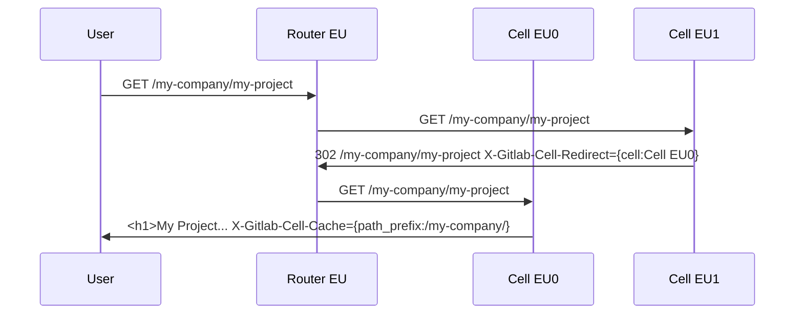

#### ログインせずに `/my-company/my-project` にアクセス

1. ユーザーはヨーロッパにいるため DNS はヨーロッパのルーターに解決されます
1. ルーターはまだ `/my-company/*` をキャッシュしていないため、ランダムに `Cell EU1` を選択します
1. `Cell EU1` はログインフローを通してリダイレクトします
1. それでもルーターキャッシュなしで `/my-company/my-project` をリクエストするため、ルーターはランダムに Cell `Cell EU1` を選択します
1. `Cell EU1` は `/my-company` を持っていませんが、それが `Cell EU0` に存在することを知っているためルーターを `Cell EU0` にリダイレクトします
1. `Cell EU0` は正しいレスポンスを返し、ルーターのキャッシュヘッダー `/my-company/* => Cell EU0` も設定します
1. ルーターは `/my-company/*` に一致するリクエストパスを `Cell EU0` に送るべきことをキャッシュして覚えます

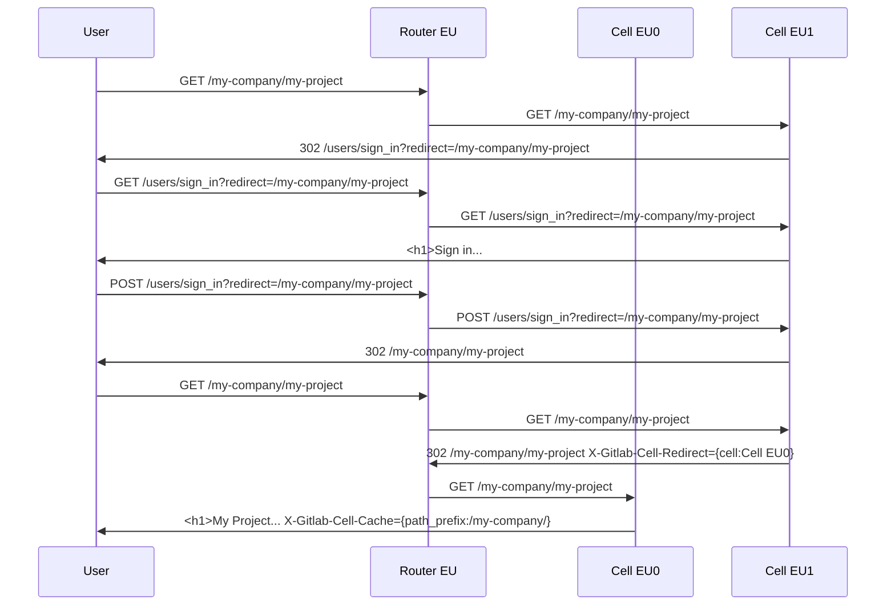

#### 前のステップの後に `/my-company/my-other-project` にアクセス

1. ユーザーはヨーロッパにいるため DNS はヨーロッパのルーターに解決されます
1. ルーターキャッシュに `/my-company/* => Cell EU0` があるため、ルーターは `Cell EU0` を選択します
1. `Cell EU0` は正しいレスポンスとともにキャッシュヘッダーも返します

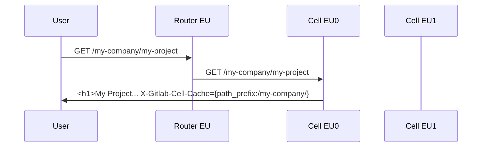

#### 前のステップの後に `/gitlab-org/gitlab` にアクセス

1. ユーザーはヨーロッパにいるため DNS はヨーロッパのルーターに解決されます
1. ルーターはこの URL のキャッシュされた値を持っていないためランダムに `Cell EU0` を選択します
1. `Cell EU0` はルーターを `Cell US0` にリダイレクトします
1. `Cell US0` は正しいレスポンスとともにキャッシュヘッダーも返します

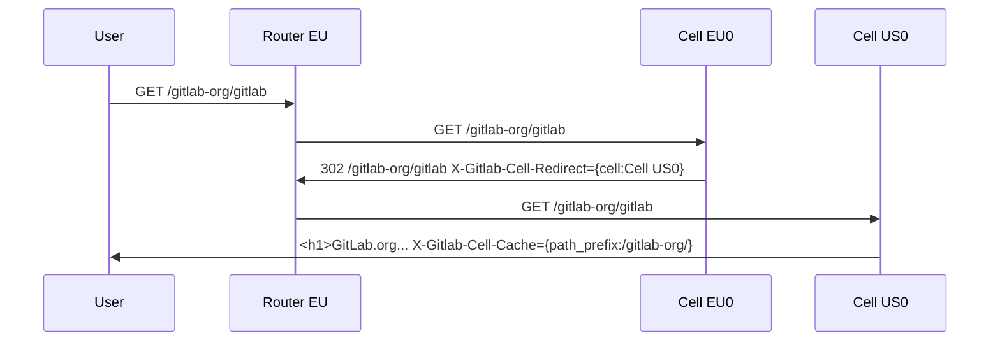

この場合、ユーザーは「デフォルト Organization」にいないため、TODO カウンターには通常の TODO が含まれません。UI のどこかでこれをハイライト表示することを選択するかもしれません。将来のイテレーションでは、デフォルト Organization からそれを取得できるかもしれません。

#### `/` にアクセス

1. ユーザーはヨーロッパにいるため DNS はヨーロッパのルーターに解決されます
1. ルーターは `/` ルートのキャッシュを持っていません（具体的には、Rails はこのルートをキャッシュするようにルーターに指示しません）
1. ルーターはランダムに `Cell EU0` を選択します
1. Rails アプリケーションはユーザーのデフォルト Organization が `/my-organization` であることを知っているため、ユーザーを `/organizations/my-organization/-/dashboard` にリダイレクトします
1. ルーターは `/organizations/my-organization/*` のキャッシュされた値を持っているため、リクエストを `POD EU0` に送ります
1. `Cell EU0` は、今日持っているものと同じダッシュボードビューだが UI で Organization に明確にスコープされた新しいページ `/organizations/my-organization/-/dashboard` を提供します
1. ユーザーには（オプションで）このページのデータはデフォルト Organization からのみであり、正しくない場合はデフォルト Organization を変更できるというメッセージが表示されます

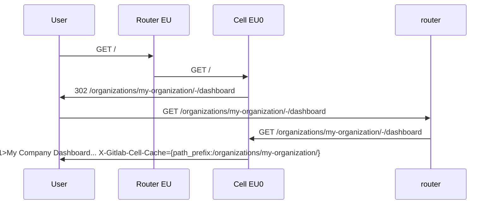

#### `/dashboard` にアクセス

上記と同様に、Rails アプリケーションはすでに `/` をダッシュボードページにリダイレクトするため、`/organizations/my-organization/-/dashboard` に到達します。

### ログイン中にプライベートな `/not-my-company/not-my-project` にアクセス

（ユーザーはプロジェクトまたはグループがプライベートのためアクセスできません）

1. ユーザーはヨーロッパにいるため DNS はヨーロッパのルーターに解決されます
1. ルーターは `/not-my-company` が `Cell US1` に存在することを知っているためこちらにリクエストを送ります
1. ユーザーはアクセス権がないため `Cell US1` は 404 を返します

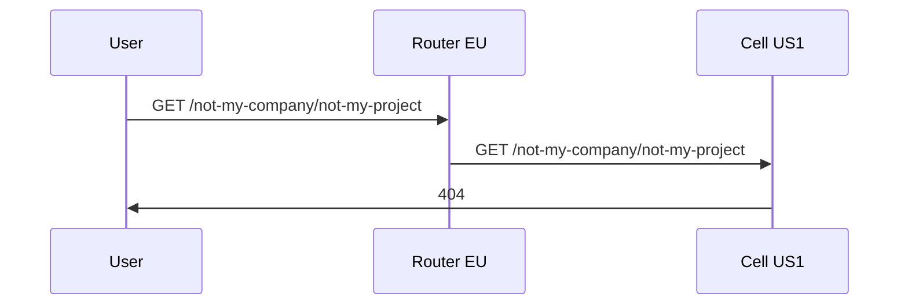

#### 新しいトップレベルネームスペースを作成

ユーザーはネームスペースをどの Organization に属させるかを尋ねられます。
`my-organization` を選択すると、`my-organization` の他のすべてのネームスペースと同じ Cell に配置されます。何も選択しなければデフォルトの `GitLab.com Public` になり、既存の Organization から分離されているためデータを単一のページに表示できないことがユーザーに明確になります。

### `/gitlab-org` に属する GitLab チームメンバーの体験

このようなユーザーはレガシーユーザーとみなされ、デフォルト Organization は `GitLab.com Public` に設定されています。これは実際には存在しない「メタ」Organization ですが、Rails アプリケーションはこの Organization を、`Cell US0` に存在するネームスペース全体のデータを表示するために `/dashboard` のようなレガシーグローバル機能を使用できることを意味するとして解釈します。Rails バックエンドはまた、`/dashboard` のような曖昧なルートをレンダリングするデフォルト Cell が `Cell US0` であることを知っています。最後に、ユーザーは `/my-organization` のような別の Cell の Organization に行くことができますが、その場合ユーザーは一部のデータが欠落している可能性があることを示すメッセージを見ます（例えば MR/Issues/Todos カウント）。

#### ログインせずに `/gitlab-org/gitlab` にアクセス

1. ユーザーは US にいるため DNS は US ルーターに解決されます
1. ルーターは `/gitlab-org` が `Cell US0` に存在することを知っているためこの Cell にリクエストを送ります
1. `Cell US0` がレスポンスを提供します

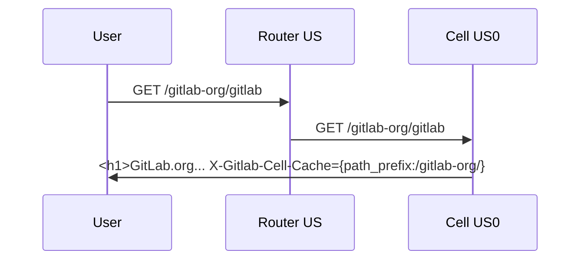

#### `/` にアクセス

1. ユーザーは US にいるため DNS は US のルーターに解決されます
1. ルーターは `/` ルートのキャッシュを持っていません（具体的には Rails はこのルートをキャッシュするようにルーターに指示しません）
1. ルーターはランダムに `Cell US1` を選択します
1. Rails アプリケーションはユーザーのデフォルト Organization が `GitLab.com Public` であることを知っているため、ユーザーを `/dashboards` にリダイレクトします（`/dashboard` グローバルビューはレガシーユーザーのみが表示できます）
1. ルーターは `/dashboard` ルートのキャッシュを持っていません（具体的には Rails はこのルートをキャッシュするようにルーターに指示しません）
1. ルーターはランダムに `Cell US1` を選択します
1. Rails アプリケーションはユーザーのデフォルト Organization が `GitLab.com Public` であることを知っているため、ユーザーが `/dashboards` を読み込むことを許可し（`/dashboard` グローバルビューはレガシーユーザーのみが表示できます）、ルーターをレガシー Cell である `Cell US0` にリダイレクトします
1. `Cell US0` は今日と同じグローバルビューダッシュボードページ `/dashboard` を提供します

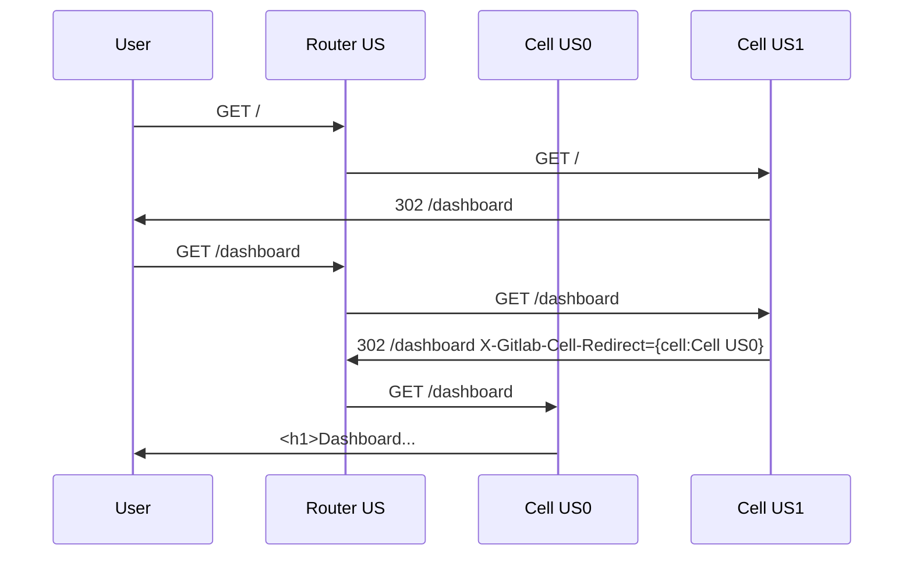

#### ログイン中にプライベートプロジェクト `/my-company/my-other-project` にアクセス

404 が返されます。

### 認証されていないユーザーの体験

フローは認証されたユーザーと同様ですが、デフォルト Organization を選択できないため、`/dashboard` のようなグローバルルートはログインページにリダイレクトします。

### 新しい顧客がサインアップ

すでに Organization に属しているか、新しく作成するかを尋ねられます。どちらも選択しない場合、デフォルトの `GitLab.com Public` Organization に配置されます。

### Organization を 1 つの Cell から別の Cell に移動

TODO

### URL にネームスペースを含まない GraphQL/API リクエスト

TODO

### 最近の Issue/MR を記憶する検索バーのオートコンプリート機能

TODO

### グローバル検索

TODO

## 管理者

### `/admin` ページを読み込む

1. ルーターはランダムに Cell `Cell US0` を選択します
1. Cell US0 はユーザーを `/admin/cells/cellus0` にリダイレクトします
1. Cell US0 は管理者エリアページをレンダリングし、`/admin/cellss/cellus0/* => Cell US0` をキャッシュするキャッシュヘッダーも返します。管理者エリアページには、選択できる他の Cell を示すドロップダウンリストが含まれており、クエリパラメーターが変更されます。

Postgres の管理者エリア設定はすべての Cell で共有されて乖離を避けますが、これらのページから動的なデータが生成されており、オペレーターが特定の Cell を表示したい場合があるため、URL と UI にどの Cell が管理者エリアページを提供しているかを明確にします。

## 解決すべき技術的な問題

### すべての Cell 間でのユーザーセッションのレプリケーション

今日のユーザーセッションは Redis に存在しますが、各 Cell は独自の Redis インスタンスを持ちます。セッション用に専用の Redis インスタンスをすでに使用しているため、`gitlab_users` PostgreSQL データベースと同様にすべての Cell でこれを共有することを検討できます。ただし、重要な考慮事項はレイテンシであり、主に同じリージョンからセッションを取得したいと考えます。

代替案として、すべてのセッションデータをエンコードする JWT ペイロードにユーザーセッションを移動することが考えられますが、これにはデメリットがあります。例えば、セッションがユーザーによって制御される JWT に存在する場合、パスワードが変更されたときや他の理由でユーザーセッションを期限切れにすることが難しくなります。

### Cell 間の移行方法

Cell 間のデータ移行では、すべてのデータストアを考慮する必要があります。

1. PostgreSQL
1. Redis 共有状態
1. Gitaly
1. Elasticsearch

### タイミング攻撃でプライベートグループの存在を漏洩することは可能か？

EU にルーターがあり、EU ルーターがデフォルトで EU に配置された Cell にリダイレクトすることを知っていて、それらのレイテンシ（10 ms とします）を知っているとします。さて、リクエストがバウンスされ、異なるレイテンシを持つ US にリダイレクトされた場合（往復が約 60 ms とします）、404 が US Cell によって返されたことを推定でき、404 が実際には 403 であることを知ることができます。

実際に別のリージョンに Cell を実装するまで、これを延期するかもしれません。このようなタイミング攻撃は今日の権限チェックの方法でもすでに理論的に可能ですが、タイミングの差はおそらく検出できないほど小さいです。

このリスクを軽減する一つの技術は、ルーターが Cell から 404 が返されたリクエストにランダムな遅延を追加することです。

## ランナーはすべての Cell で共有すべきか？

2 つの選択肢があり、どちらが簡単かを決定する必要があります。

1. ランナーの登録とキューイングテーブルを分解してすべての Cell で共有します。これはスケーラビリティに影響する可能性があり、高トラフィックのテーブルになる可能性があるグループ/プロジェクトランナーを含めるかどうかを検討する必要があります。
1. ランナーは Cell ごとに登録され、おそらくすべての Cell に対して個別のランナーフリートを持つか、同じランナーを多くの Cell に登録し、これがキューイングに影響する可能性があります

## 競合できないものに対してすべての Cell にわたる一意の ID をどのように保証するか？

このプロジェクトでは、少なくともネームスペースとプロジェクトが ID でルーティングする必要があるリクエストが多いため、すべての Cell にわたる一意の ID を持つと仮定します。これらのテーブルが異なるデータベースにまたがっているため、一意の ID を保証するには新しいソリューションが必要になります。一意の ID が必要な他のテーブルもある可能性が高く、GraphQL や他の API のルーティングを解決する方法や他の設計目標に応じて、すべてのテーブルのプライマリキーを一意にしたいと判断される場合があります。
