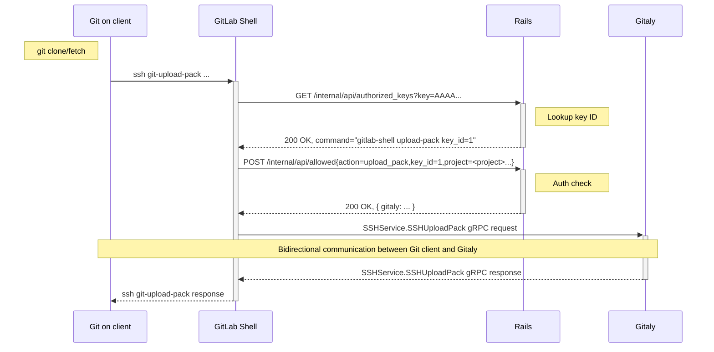
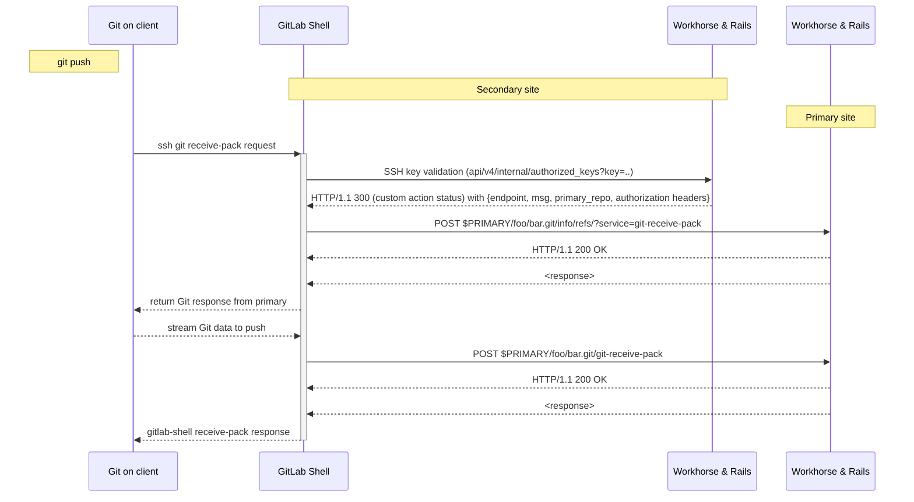
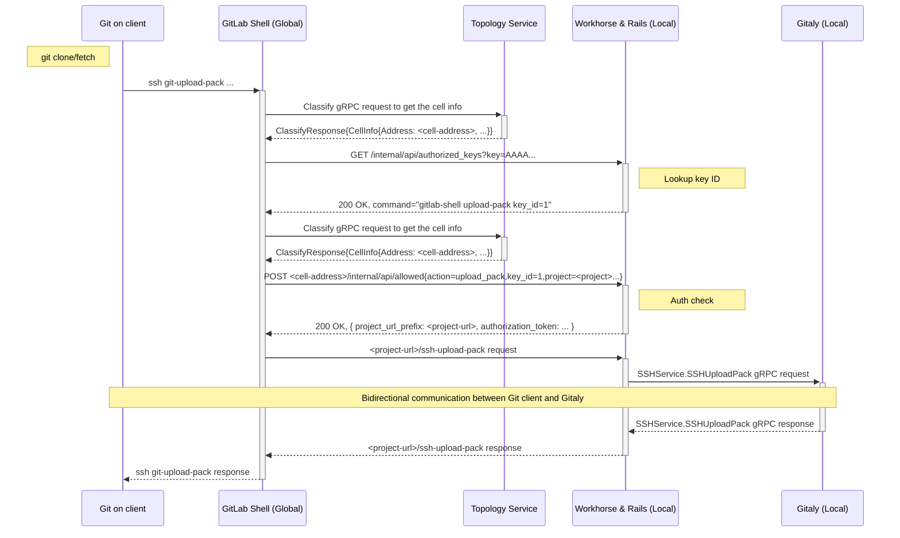
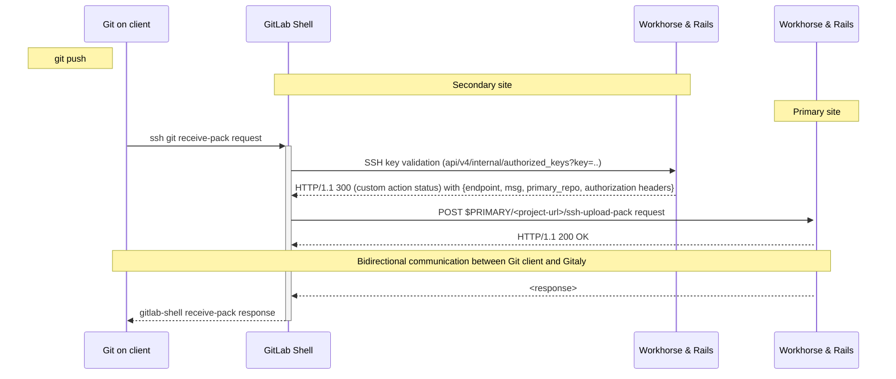



このドキュメントでは、SSH を介した Git のルーティングの設計目標とアーキテクチャを説明します。

## 概要

SSH を介して Git 操作（`git pull/clone/fetch`、`git push`、`git archive`）が実行されると、
[GitLab Shell](https://gitlab.com/gitlab-org/gitlab-shell) がリクエストを処理し、GitLab Rails に対してリクエストを認可し、
Git とユーザー間の双方向データ交換のために Gitaly に `gRPC` リクエストを実行します。

### 例: Git pull

Gitaly サーバーはデフォルトで Gitaly のネットワークトラフィックが暗号化されていないため、パブリックインターネットに[公開してはなりません](https://docs.gitlab.com/ee/administration/gitaly/configure_gitaly.html#network-architecture)。
この制限により、SSH を介した Git リクエストを他のインスタンスにリダイレクトすることが困難になります。

### Geo: セカンダリノードへの SSH を介した Git push

セカンダリノードに `git push` が実行されると、リクエストはプライマリノードに再ルーティングされる必要があります。
プライマリノードの Gitaly サーバーは公開されていないため、リクエストをリダイレクトするためにパブリックエンドポイント（SSH を介した Git、HTTP(S) を介した Git）にアクセスする必要があります。その結果、SSH を介した Git リクエストを HTTP(S) を介した Git にプロキシし、Git HTTP(S) レスポンスを SSH プロトコルと互換性のあるものに変換してユーザーに返す方法を[採用](https://gitlab.com/groups/gitlab-org/-/epics/8819)しました。
最終的な実装のフローは次のとおりです。

このソリューションは一般的なケースをカバーするのに優れています。
ただし、SSH と HTTP(S) Git プロトコルの微妙な違いがエッジケースシナリオで[問題](https://gitlab.com/gitlab-org/gitlab-shell/-/issues/751)を引き起こし、ソリューションの信頼性を低下させ、Git アップグレードに対して脆弱にします。

### Cells: SSH リクエストを正しい Cell にルーティング

[Cells アーキテクチャ](infrastructure/index.md#architecture)の開発と[ルーティングサービス](http_routing_service.md)の導入により、同様の課題が発生します。
SSH リクエストが実行されると、リクエストに関連するデータを含む Cell に[ルーティング](https://gitlab.com/gitlab-org/gitlab/-/issues/438826)される必要があります。

これは SSH リクエストのルーティングのための持続可能なソリューションを見つけるもう一つの理由です。

## ゴール

- 一般的なケースとエッジケースを確実にカバーする持続可能なソリューションを見つける。
- Geo と Cells のシナリオをカバーするのに十分汎用的で、他の類似のケースにも使用できる。

## プロポーザル

Gitaly `gRPC` に直接アクセスすることはできませんが、HTTP Workhorse エンドポイントを介して gRPC データを公開できます。`gRPC` は双方向プロトコルであるため、Workhorse はこのエンドポイントで HTTP を介した双方向ストリーミングをサポートする必要があります。

- このアプローチは Git プロトコルの変換を必要とせず、より信頼性が高くなります。
- 公開された Gitaly RPC は Workhorse および追加の認可チェックによって保護されます。

### Cells

Cells アーキテクチャでは、GitLab Shell がルーターとして機能し、リクエストを正しい Cell に再ルーティングするために [Topology Service](./topology_service.md) と通信します。

### Geo

Geo アーキテクチャでは、セカンダリの GitLab Shell がプライマリにリクエストを再ルーティングするためにセカンダリ Rails と通信します。

### 概念実証

次の MR は、説明されたアーキテクチャを使用して `git clone` がどのように機能するかを示すための最小限の変更を導入します。主な目的は、GitLab Shell が HTTP を介して Workhorse との双方向通信を確立できることを確認することです。

- [Gitaly RPC を SSH を介した Git クローン用に公開する Workhorse HTTP エンドポイントを作成する](https://gitlab.com/gitlab-org/gitlab/-/merge_requests/146227)。
- [GitLab Shell からこのエンドポイントへのリクエストを実行し、レスポンスをユーザーに送信する](https://gitlab.com/gitlab-org/gitlab-shell/-/merge_requests/969)。

### 認証

現在、Geo はプライマリノードへのアクセスに使用されるトークンを生成します。

- GitLab Rails はこのトークンを `/allowed` レスポンスで返します。
- トークンはプライマリノードへの HTTP(S) を介した Git リクエスト内で送信されます。
- プライマリノードはトークンを認識し、リクエストを認可します。

同様のアプローチを提案されたソリューションに適用できます。

- GitLab Rails は `/allowed` レスポンスでトークンを返します。
- トークンは Workhorse の `ssh-` HTTP エンドポイントへのヘッダーで送信されます。
- Workhorse はトークンを GitLab Rails に伝播し、GitLab Rails がそれを認識してリクエストを認可します。

前述の PoC は、アプローチを実装する方法の例を提供しています。

- GitLab Shell は Shell と Rails 間の共有シークレットを使用して生成された JWT トークンを Rails に送信します。
- GitLab Rails はこのトークンを Geo シークレットにも使用できる `git_rpc_auth_header` フィールドで返します。
- GitLab Shell はこのトークンを Workhorse -> GitLab Rails に伝播します。
- GitLab Rails はこのトークンを再度認識し、リクエストを認可します。

JWT の生成には共有シークレットの知識が必要であるため、ユーザーは通常このトークンを生成または傍受できません。

### 双方向ストリーミング

Git プロトコルは Git サーバーと Git クライアント間の双方向通信を意味します。`HTTP/1.1` はデフォルトでは双方向ストリーミングをサポートしていないため、次のいずれかを行う必要があります。

- `HTTP/1.1` の双方向ストリーミングを試験的に使用する。PoC は Go サーバーの [`EnableFullDuplex`](https://pkg.go.dev/net/http#ResponseController.EnableFullDuplex) オプションを使用した動作バージョンを持っています。
- 接続をアップグレードしてプロトコルを切り替える。
- Workhorse で HTTP/2 プロトコルをサポートする。

インフラストラクチャの観点から最も実現可能なオプションを選択する必要があります。
