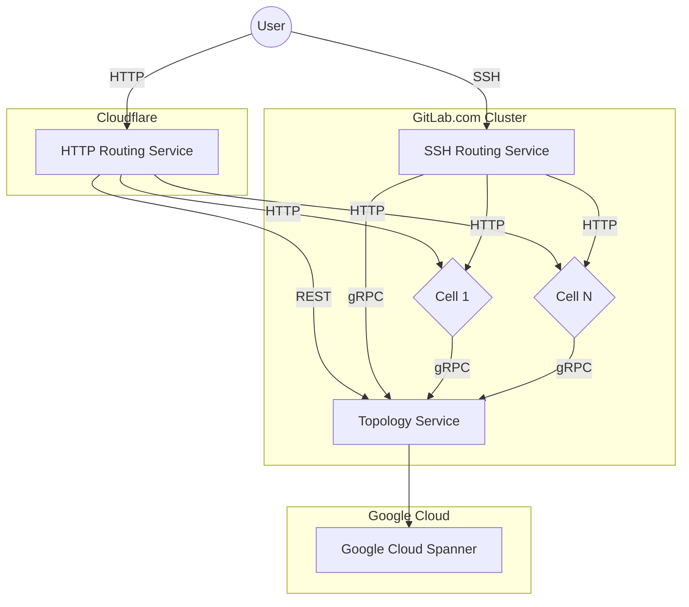
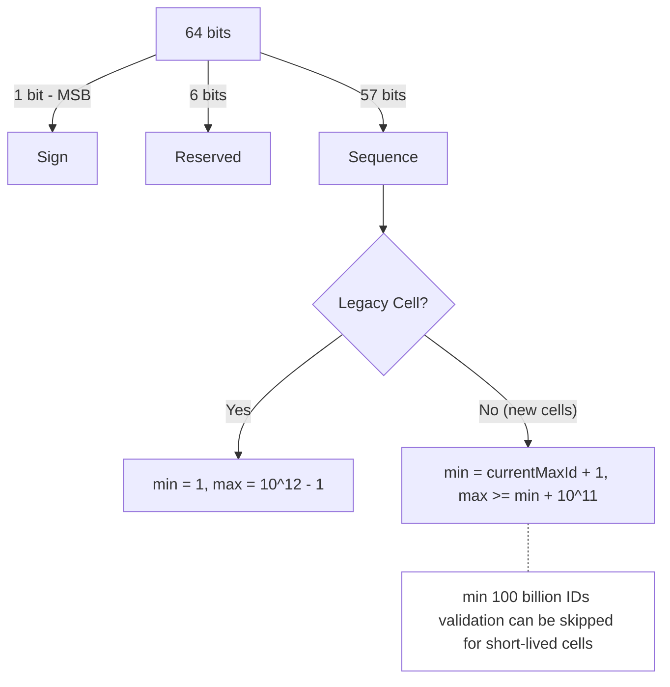
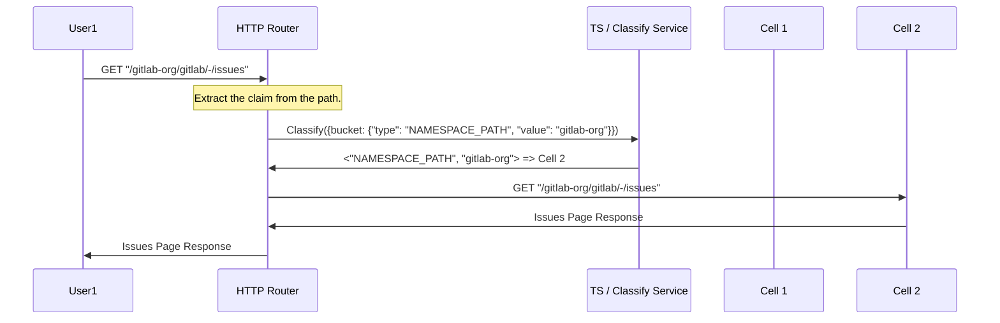
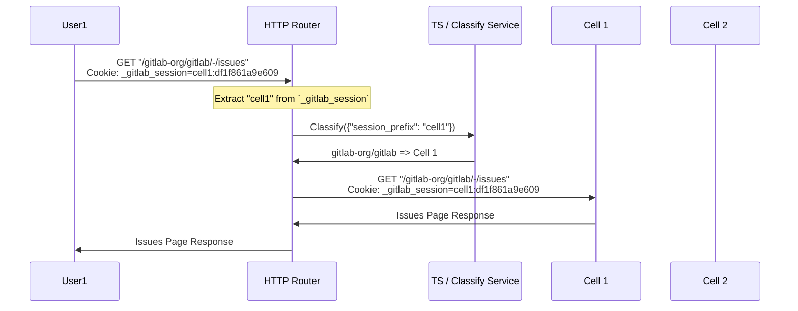
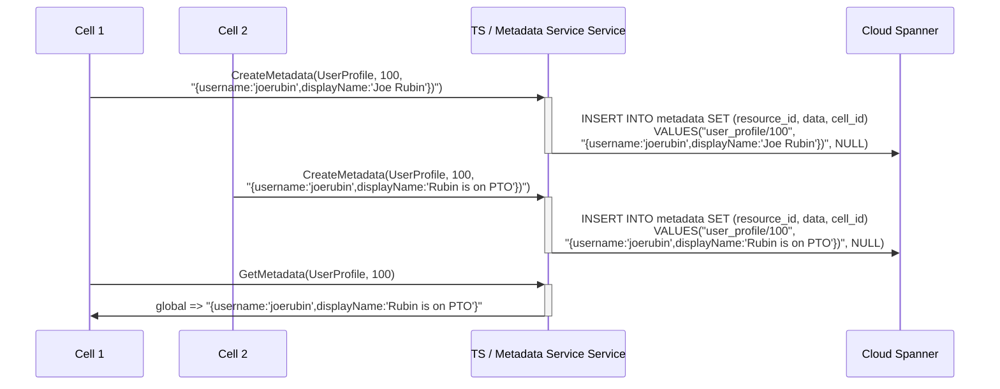
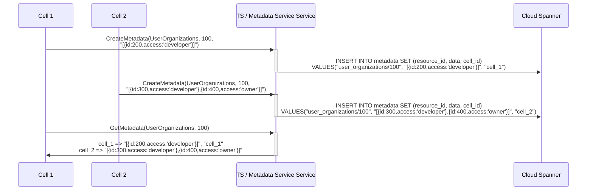
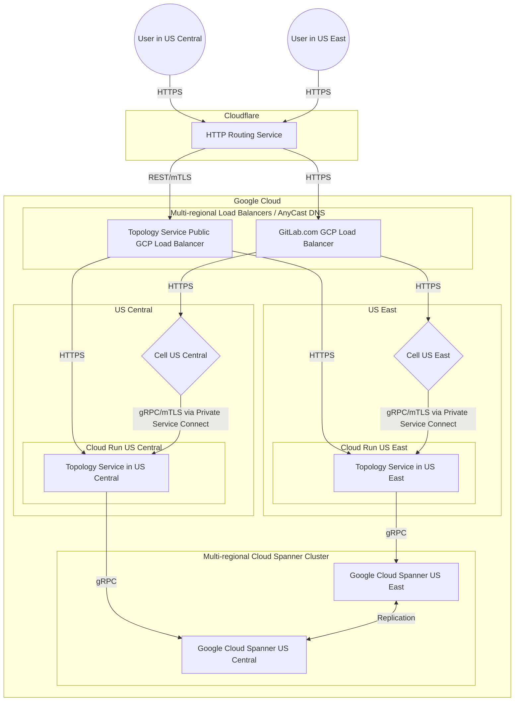

このドキュメントでは、Cells が使用する Topology Service の設計目標とアーキテクチャを説明します。

## ゴール

Topology Service の目的は、Cells が動作するために不可欠な機能を提供することです。Topology Service は限られた機能セットを実装し、クラスター内の権威あるエンティティとして機能します。単一の Topology Service が存在し、多くのリージョンにデプロイできます。

1. **技術。**

    Topology Service は [Go](https://go.dev/) で書かれ、[gRPC](https://grpc.io/) および REST API を介して API を公開します。

1. **Cells を認識。**

    Topology Service はすべての Cell のリストを持ちます。Topology Service は Cell のヘルスを監視し、この情報を Cell 自体またはルーティングサービスに提供できます。Cell が健全かどうかは様々な要因によって決定されます。

    - ウォッチドッグ: Cell が最後に接触した時間、
    - 障害率: ルーティングサービスから収集した情報
    - 設定: 孤立としてマークされた Cell

1. **クラウドファースト。**

    Topology Service はクラウドにデプロイされ、クラウドマネージドサービスを使用して動作します。これらのサービスは、必要に応じて後でオンプレミスに相当するものに拡張できます。

    Topology Service はデュアルダイアレクトを使用して書かれます。

    - Cloud Spanner を使用して GitLab.com でスケールするための GoogleSQL
    - 内部使用および後でオンプレミスの互換性を提供するための PostgreSQL

1. **小型。**

    Topology Service はアーキテクチャでの重要性から、クラスターが動作するために必要な基本的な機能のみを提供するに限られます。

## 要件

| 要件 | 説明 | 優先度 |
| ------------- | -------------------------------------------------------------------------- | -------- |
| 設定可能 | すべての Cell に関する情報を含む | 高 |
| セキュリティ | 認可された Cell のみが使用できる | 高 |
| クラウドマネージド | クラウドマネージドサービスを使用して動作できる | 高 |
| レイテンシ | 満足のいくレイテンシしきい値 20ms、99.95% エラー SLO、99.95% Apdex SLO | 高 |
| セルフマネージド | 最終的に[セルフマネージド](goals.md#self-managed)で使用できる | 低 |
| リージョン | 異なる[リージョン](goals.md#regions)へのリクエストをルーティングできる | 低 |

## 非ゴール

これらのゴールは、複雑さを大きく増大させるため Topology Service の範囲外です。

- Topology Service は Cell のユーザー向け情報のインデックスを提供しません。
  例: クラスター全体でデータを表示する CI カタログは、すべての Cell からの情報をマージするために別の手段を使用する必要があります。
- Topology Service は GitLab のビジネスロジックに関する知識を持ちません。
  理論的には、GitLab と同じ認証/アクセストークンを持つ他のウェブアプリケーションでも動作できます。ただし、これは実装の一部として変更される可能性があります。

## アーキテクチャ

Topology Service は次の設計ガイドラインを実装します。

- Topology Service はいくつかの gRPC サービスのみを実装します。
- 一部のサービスは後方互換性のために追加で REST API として公開されます。
- Topology Service は複雑な情報処理を実行しません。
- Topology Service は Cell からの情報を集約しません。



### 設定

Topology Service はすべてのサービスパラメーターを設定するために `config.toml` を使用します。

#### Cell のリスト

```toml
[[cells]]
id = 1
address = "cell-us-1.gitlab.com"
session_prefix = "cell1:"
```

### シーケンスサービス

初期プロビジョニング時に、各 Cell は SequenceService に連絡して ID シーケンス用の ID 範囲を取得します。
Topology Service は指定された範囲が他の Cell のシーケンスと重複しないことを確認します。

#### 範囲の計算ロジック



- **Sign**: 正の数の場合は常に 0。
- **Reserved**: 現在は常に `0` で、2 つの目的のために予約されています。
  1. 必要に応じて Cell の数を増やすため。
  1. 既存の ID に干渉することなく将来的に ULID ID 割り当てのバリアントに切り替えられるようにするため。ULID ベースの ID アロケーターは最上位ビットに `タイムスタンプ` 値を持つため、1 ビットを予約するだけで十分ですが、シーケンスビットを最小限にするためにより多くのビットを予約しています。
- **Sequence**:
  - レガシー Cell は最初の 1 兆の ID を取得し、各新しいインスタンスはそれぞれ 1,000 億の ID を取得します。この数字にどのようにして至ったかについては、[シーケンス飽和](#シーケンス飽和) セクションを参照してください。
  - レガシー Cell を除くと、本番環境で 1,441,141 の Cell をサポートします（57 ビットを使用）。

Topology Service の `config.toml` の例:

```toml
env = "production"

[[cells]]
id = 1
address = "legacy.gitlab.com"
[[cells.sequence_ranges]]
minval = 1
maxval = 999999999999 # 1 trillion

[[cells]]
id = 2
address = "cell-2-example.gitlab.com"
session_prefix = "cell-2"
[[cells.sequence_ranges]]
minval = 1000000000000
maxval = 1099999999999 # 100 billion

[[cells]]
id = 3
address = "cells-3-test.gitlab.com"
session_prefix = "cell-3"
[[cells.sequence_ranges]]
minval = 1100000000000
maxval = 1199999999999 # 100 billion
```

```toml
env = "staging"

[[cells]]
id = 2
address = "cell-2.gitlab-cells.dev"
session_prefix = "cell-2"
minval = 1000000000000
maxval = 1099999999999 # 100 billion

[[cells]]
id = 3
address = "cell-3.gitlab-cells.dev"
session_prefix = "cell-3"
[[cells.sequence_ranges]]
minval = 1100000000000
maxval = 1101000000000
skip_range_validation = true # For short lived cells, min 100 billion IDs validation can be skipped
```

##### Cell ブートストラップシーケンス変更プロセス

1. **データベース準備ステージ**

   Cell のプロビジョニング中、データベースの準備は次のステップで構成されており、これらは自動的に実行されます。

   - Instrumentor `configure` スクリプトの一部として、データベースを作成する Ansible タスクを実行します
   - Helm Chart インストール中に `/scripts/db-migrate` スクリプトを実行します
   - このスクリプト内で `/srv/gitlab/bin/rake gitlab:db:configure` コマンドを実行します

1. **`gitlab:db:configure` Rake タスク**

   これはシーケンス範囲を変更するメインのエントリポイントです。このタスクは:

   - データベースの状態に応じて `db:migrate` または `db:schema:load` を実行します
   - 各 PostgreSQL データベースに対して `configure_pg_databases` を呼び出します
   - **ブートストラップ時のみ** `alter_cell_sequences_range` 関数を実行します

1. **ブートストラップ検出ロジック**

   シーケンス変更が発生するかどうかを決定するキー条件は `configure_pg_database` メソッドにあります。

   ```ruby
   # Only alter sequences during bootstrap (when database is empty)
   return false if database_loaded # Skip if tables already exist
   ```

   システムは `public` スキーマに既存のテーブルがあるかどうかを確認します。テーブルが存在する場合、シーケンス変更を完全にスキップします。

1. **シーケンス範囲の取得**

   条件が満たされた場合（ブートストラップシナリオ）、システムは:

   - gRPC を介して Topology Service からシーケンス範囲を取得します: `Gitlab::TopologyServiceClient::CellService.new.cell_sequence_ranges`
   - 設定された範囲を取得します（例: `minval: 500000000000, maxval: 599999999999`）

1. **シーケンス変更の実行**

   `alter_cell_sequences_range` rake タスクは:
   - ログ: `"Running gitlab:db:alter_cell_sequences_range rake task with (minval, maxval)"`
   - `Gitlab::Database::AlterCellSequencesRange` クラスを呼び出して PostgreSQL シーケンスを変更します。
   - `Gitlab::Database::AlterCellSequencesRange` クラスは:
     - すべての既存シーケンスを反復し、その範囲（`MINVALUE`、`MAXVALUE`、`START`、`RESTART`）を Cell の割り当てられた範囲に一致するように変更します。
     - 新しく作成または変更されたシーケンスに Cell のシーケンス範囲を自動的に適用する `alter_new_sequences_range()` データベース関数を作成します。
     - `CREATE TABLE`、`ALTER TABLE`、`CREATE SEQUENCE`、`ALTER SEQUENCE` DDL コマンド時に上記の関数を実行する `alter_new_sequences_range` イベントトリガーを作成します。

1. **設定要件**

   これが機能するために、Cell は次のように設定されている必要があります。

   ```yaml
   cell:
     enabled: true
     id: 6
     database:
       skip_sequence_alteration: false
     topology_service_client:
       address: "topology-grpc.staging.runway.gitlab.net:443"
   ```

1. **ワンタイムブートストラップの制限**

   **重要**: このシーケンス変更は**ブートストラップ時に一度だけ**発生します。すでに初期化されたデータベースで `gitlab:db:configure` を再度実行しようとしても、テーブルがすでに存在するためシーケンス変更はスキップされます。テーブルは消費されたシーケンスを持っている可能性があります。

1. **最終結果**

   ブートストラップ成功後、`SELECT sequencename, min_value, max_value FROM pg_sequences LIMIT 10;` を実行すると、デフォルトの PostgreSQL 範囲の代わりに Topology Service からの範囲で設定されたシーケンスが表示されます。

   この設計により、各 Cell が初期プロビジョニング中に一意の重複しないシーケンス範囲を取得することが保証されます。

##### シーケンス飽和

本書執筆時点で、レガシー Cell の最大 ID は約 110 億（`security_findings` テーブルの PK）でした。

- 1 兆の ID があれば、レガシー Cell が約 91 倍成長できます。
- Cells アーキテクチャの目標が新しいインスタンスのデータベース成長を制御することであることを考えると、1,000 億の ID も十分なスペースを提供するはずです。

###### 飽和しているシーケンスのシーケンス範囲のバンプ

これは GitLab.com の動作にとって重要な部分であるため、[merge_requests/8630](https://gitlab.com/gitlab-com/runbooks/-/merge_requests/8630) で各シーケンスの飽和モニタリングを導入しました。

飽和しているシーケンスが見つかった場合、次のプロセスに従って範囲をバンプできます。

1. TS の config.toml を更新して `cells.sequence_ranges` 配列に追加の範囲を追加します。
2. 飽和しているシーケンス名をパラメーターとして渡して、特定の Cell で `gitlab:db:increase_sequences_range` rake を実行します。

例:

1. `cell-2` の `security_findings_id_seq` と `web_hook_logs_id_seq` が [pg_id_sequences](https://gitlab.com/gitlab-com/runbooks/-/blob/d1491099e52037cd23cc5d871b5c11dacce08888/libsonnet/saturation-monitoring/pg_id_sequences.libsonnet) モニタリングでハード SLO（90%）に達したとします。
2. config.toml の `sequence_ranges` を更新して追加の範囲を追加します。

   ```toml
    env = "production"

    [[cells]]
    id = 1
    address = "legacy.gitlab.com"
    [[cells.sequence_ranges]]
    minval = 1
    maxval = 999999999999 # 1 trillion

    [[cells]]
    id = 2
    address = "cell-2-example.gitlab.com"
    session_prefix = "cell-2"
    [[cells.sequence_ranges]]
    minval = 1000000000000
    maxval = 1099999999999 # 100 billion
    [[cells.sequence_ranges]]
    minval = 1200000000000
    maxval = 1299999999999 # 100 billion

    [[cells]]
    id = 3
    address = "cells-3-test.gitlab.com"
    session_prefix = "cell-3"
    [[cells.sequence_ranges]]
    minval = 1100000000000
    maxval = 1199999999999 # 100 billion
   ```

3. cell-2 インスタンスで `gitlab:db:increase_sequence_range['security_findings_id_seq', 'web_hook_logs_id_seq']` を実行するために CR を開きます。

上記の手動プロセスは、これがほとんど発生しないため退屈なソリューションとして採用されています。
[Issue#540801](https://gitlab.com/gitlab-org/gitlab/-/issues/540801) では、必要に応じてシーケンス範囲を自動的に増分する Cell 内で実行される cron を持つことで、このプロセスを自動化します。

NOTE:

- 上記の決定は [Cells 1.5](iterations/cells-1.5.md) までサポートしますが、[Cells 2.0](iterations/cells-2.0.md) はサポートしません。
  - Cells 2.0 をサポートするため（つまり Organization をレガシー Cell から Cells に移動できるようにする）、レガシー Cell のすべての整数 ID を `bigint` に変換する必要があります。
  この取り組みはエピック [すべての整数 ID をプライマリ Cell の bigint に変換する (#15591)](https://gitlab.com/groups/gitlab-org/-/epics/15591) で追跡されています。

この決定と評価された他のソリューションの詳細は[こちら](decisions/008_database_sequences.md)に記載されています。

```proto
// sequence_request.proto

message GetCellSequenceInfoRequest {
  optional string cell_id = 1; // if missing, it is deduced from the current context
}

message SequenceRange {
  required int64 minval = 1;
  required int64 maxval = 2;
}

message GetCellSequenceInfoResponse {
  CellInfo cell_info = 1;
  repeated SequenceRange ranges = 2;
}

service SequenceService {
  rpc GetCellSequenceInfo(GetCellSequenceInfoRequest) returns (GetCellSequenceInfoResponse) {}
}
```

#### ワークフロー

```mermaid
sequenceDiagram
    box Cell 1
        participant Cell 1 sequences rake AS rake gitlab:db:alter_sequences_range
        participant Cell 1 migration AS db/migrate
        participant Cell 1 TS AS Topology Service Client
        participant Cell 1 DB AS DB
        participant Cell 1 metadata rake AS rake gitlab:export_cells_metadata
    end

    box Cell 2
        participant Cell 2 sequences rake AS rake gitlab:db:alter_sequences_range
        participant Cell 2 migration AS db/migrate
        participant Cell 2 TS AS Topology Service Client
        participant Cell 2 DB AS DB
        participant Cell 2 metadata rake AS rake gitlab:export_cells_metadata
    end

    box Topology Service
        participant Sequence Service
        participant config.toml
    end

    box
        participant File Storage
    end

    par
        Cell 1 sequences rake ->>+ Cell 1 TS: get_sequence_range
        Cell 1 TS ->>+ Sequence Service: SequenceService.GetCellSequenceInfo()
        Sequence Service -> config.toml: Uses cell 1's `sequence_range` from the config
        Sequence Service ->>- Cell 1 TS: CellSequenceInfo(minval: int64, maxval: int64)
        Cell 1 TS -->>- Cell 1 sequences rake: [minval, maxval]
        loop For each existing Sequence
            Cell 1 sequences rake ->>+ Cell 1 DB: ALTER SEQUENCE [seq_name] <br>MINVALUE {minval} MAXVALUE {maxval}
            Cell 1 DB -->>- Cell 1 sequences rake: Done
        end
        Cell 1 migration ->>+ Cell 1 TS: get_sequence_range
        Cell 1 TS ->>+ Sequence Service: SequenceService.GetCellSequenceInfo()
        Sequence Service -> config.toml: Uses cell 1's `sequence_range` from the config
        Sequence Service ->>- Cell 1 TS: CellSequenceInfo(minval: int64, maxval: int64)
        Cell 1 TS -->>- Cell 1 migration: [minval, maxval]
        Cell 1 migration ->>+ Cell 1 DB: [On new ID column creation]<br>CREATE SEQUENCE [seq_name] <br> MINVALUE {minval} MAXVALUE {maxval}
        Cell 1 DB -->>- Cell 1 migration: Done
    and
        Cell 2 sequences rake ->>+ Cell 2 TS: get_sequence_range
        Cell 2 TS ->>+ Sequence Service: SequenceService.GetCellSequenceInfo()
        Sequence Service -> config.toml: Uses cell 2's `sequence_range` from the config
        Sequence Service ->>- Cell 2 TS: CellSequenceInfo(minval: int64, maxval: int64)
        Cell 2 TS -->>- Cell 2 sequences rake: [minval, maxval]
        loop For each existing Sequence
            Cell 2 sequences rake ->>+ Cell 2 DB: ALTER SEQUENCE [seq_name] <br>MINVALUE {minval} MAXVALUE {maxval}
            Cell 2 DB -->>- Cell 2 sequences rake: Done
        end
        Cell 2 migration ->>+ Cell 2 TS: get_sequence_range
        Cell 2 TS ->>+ Sequence Service: SequenceService.GetCellSequenceInfo()
        Sequence Service -> config.toml: Uses cell 1's `sequence_range` from the config
        Sequence Service ->>- Cell 2 TS: CellSequenceInfo(minval: int64, maxval: int64)
        Cell 2 TS -->>- Cell 2 migration: [minval, maxval]
        Cell 2 migration ->>+ Cell 2 DB: [On new ID column creation]<br>CREATE SEQUENCE [seq_name] <br> MINVALUE {minval} MAXVALUE {maxval}
        Cell 2 DB -->>- Cell 2 migration: Done
    end

    loop Every x minute
        Cell 1 metadata rake -->>+ File Storage: artifacts cells metadata <br> (will include maxval used by each sequence)
    end

    loop Every x minute
        Cell 2 metadata rake -->>+ File Storage: artifacts cells metadata <br> (will include maxval used by each sequence)
    end

    critical Reuse unused sequence range from decommissioned cells
        Sequence Service ->>+ File Storage: fetchSequenceMetadata(cell_id)
        File Storage -->>- Sequence Service: SequenceMetadata
        Note right of Sequence Service: If possible will use the unused ID range for new cells
    end
```

### Claim Service

Claim Service は gRPC プロトコルのみで提供されます。Classify Service のような REST API はありません。これは API インターフェースの簡略化されたバージョンです。

```proto
message ClaimRecord {
  enum Bucket {
    UNSPECIFIED = 0;
    ORGANIZATION_PATH = 1;
    NAMESPACE_PATH = 2;
    PROJECT_ID = 3;
  };

  Bucket bucket = 1;
  string value = 2;
}

message OwnerRecord {
  enum Bucket {
    UNSPECIFIED = 0;
    GROUP = 1;
    PROJECT = 2;
    USER = 3;
  };

  Bucket bucket = 1;
  int64 id = 2;
}

message ClaimRequest {
  OwnerRecord owner = 1;
  repeated ClaimRecord claims = 2;
}

message ClaimInfo {
  string uuid = 1;
  ClaimRecord record = 2;
  CellInfo cell_info = 3;
}

message OwnerInfo {
  string uuid = 1;
  OwnerRecord record = 2;
  CellInfo cell_info = 3;
}

message CreateClaimRequest {
  ClaimRequest request = 1;
}

message CreateClaimResponse {
  OwnerInfo owner = 1;
  repeated ClaimInfo claims = 2;
}

message GetClaimRequest {
  ClaimRecord record = 1;
}

message GetClaimResponse {
  ClaimInfo claim = 1;
}

message GetOwnerRequest {
  OwnerRecord record = 1;
}

message GetOwnerResponse {
  OwnerInfo owner = 1;
}

service ClaimService {
    rpc CreateClaim(CreateClaimRequest) returns (CreateClaimResponse) {}
    rpc GetClaim(GetClaimRequest) returns (GetClaimResponse) {}
    rpc GetOwner(GetOwnerRequest) returns (GetOwnerResponse) {}
    rpc DestroyClaim(DestroyClaimRequest) returns (DestroyClaimResponse) {}
}
```

このサービスの目的は、アイデンティティが特定の時間に特定の Cell の特定のリソースにのみ属することを保証する方法を提供することです（リソースは後で別の Cell に移行できます）。

ユーザーを例に取ります。ここでのユーザーは次のものを claim する必要があるリソースです。

- ユーザーに属するトップレベルネームスペース（ユーザー名）
- ユーザーに関連付けられたメールアドレス
- ユーザーに関連付けられたキー
- その他

これにより、次を介してユーザーを所有する Cell に正しくルーティングできます。

- ユーザープロファイルページ: https://gitlab.com/ghost1
  - `ghost1` をトップレベルネームスペース（ユーザー名）として claim します
- REST API: https://gitlab.com/api/v4/users/1243277
  - `1243277` をリソース ID（ユーザー ID）として claim します
- 以下によるユーザーの認証:
  - ユーザー名（後でユーザー名を Organization にスコープする予定です）
  - プライマリメール（このためのパブリックルートはないかもしれませんが、将来的に備えて一意のリソースも claim する必要があります）
  - 各種キー

実際には、claim はクラスター内で一意である必要があり、したがって曖昧ではありません。

claim を行うために、Cell は `CreateClaimRequest` を送信できます。これには 2 つのコンポーネントで構成される `ClaimRequest` が含まれます。

1. **OwnerRecord**: Cell 上の claim を所有するリソースを表します。
   例えば、グループ `gitlab-org` の場合、bucket は `GROUP` で `id` はグループ ID になります。
1. **repeated ClaimRecord**: バケットと値から構成されており、各値はバケットごとに 1 回だけ claim できます。バケットは claim の一意のスコープを表します。例えば、グループ `gitlab-org` の場合、`gitlab-org` をトップレベルネームスペースとして claim します。一度 claim されると、他のリソースは同じものを再び claim できません。これは 1 つのリクエストでリソースの複数の claim を同時に行えるように繰り返されます。

リクエストはトランザクションでアトミックである必要があり、すべて成功するかすべて失敗します。

列挙型のリストは最終的なものではなく、時間とともに拡張できることに注意してください。

#### Rails での Claim Service の使用例

```ruby
class User < MainClusterwide::ApplicationRecord
  include CellsUniqueness

  cell_cluster_unique_attributes :username,
   sharding_key_object: -> { self },
   claim_type: Gitlab::Cells::ClaimType::Usernames,
 owner_type: Gitlab::Cells::OwnerType::User

  cell_cluster_unique_attributes :email,
   sharding_key_object: -> { self },
   claim_type: Gitlab::Cells::ClaimType::Emails,
 owner_type: Gitlab::Cells::OwnerType::User
end
```

`CellsUniqueness` concern は `cell_cluster_unique_attributes` を実装します。
concern はトランザクション内での Claims の Topology Service gRPC エンドポイント呼び出しを行うために、before および after フックを登録します。

### Classify Service

```proto
enum ClassifyAction {
  ACTION_UNSPECIFIED = 0;
  PROXY = 1;
}

message ClassifyRequest {
  oneof value {
    string first_cell = 1;
    string session_prefix = 2;
    string cell_id = 3;
    types.v1.Bucket bucket = 4;
  }
}

message ProxyInfo {
  string address = 1;
}

message ClassifyResponse {
  ClassifyAction action = 1;
  ProxyInfo proxy = 2;
}

service ClassifyService {
  rpc Classify(ClassifyRequest) returns (ClassifyResponse) {
    option (google.api.http) = {
      post: "/v1/classify"
      body: "*"
    };
  }
}
```

`Classify` の目的は、設定または指定されたリソースに基づいて Cell を見つけることです。
リクエストタイプに応じて、rpc は次のことを行います。

- `first_cell` は `config.toml` の最初の Cell を返します。
- `session_prefix` と `cell_id` はリクエストに埋め込まれた `cell_id` を抽出し、`config.toml` からの一致する Cell を返します。
- `bucket` は指定されたリソースの所有 Cell を見つけます。

他の Cell、HTTP ルーティングサービス、SSH ルーティングサービスが、プロジェクト、グループ、Organization、またはユーザーがどの Cell にあるかを見つけられるようにします。

パスから `bucket` を推定するパスベースのルーティングロジックについては、[HTTP ルーターブループリント](http_routing_service.md)を参照してください。

#### Classify Service を使用したネームスペースパス分類ワークフロー



#### Classify Service を使用したセッションクッキー分類ワークフロー



セッションクッキーは `session_prefix` の値で検証されます。

### Metadata Service（**将来的な機能**、Cells 1.5 で実装）

Metadata Service は Cell がクラスター全体で情報を配布する方法です。

- メタデータは `resource_id` によって定義されます
- メタデータはすべての Cell が所有できます（各 Cell が変更できる）、または Cell が所有できます（Cell のみがメタデータを変更できる）
- get リクエストは指定された `resource_id` のすべてのメタデータを返します
- メタデータの構造はアプリケーションが所有し、マルチバージョン互換性のために protobuf を使用して情報をエンコードすることが強く推奨されます
- Cell が所有するメタデータは、共有リソースの更新時の競合状態を処理する必要を避けるためです

メタデータの目的は、Cell が分散情報の一部を所有し、Cell が分散情報をマージできるようにすることです。

異なる所有者の使用例:

- すべての Cell が所有: ユーザープロファイルのメタデータが公開されており、ユーザーの公開表示情報の最新スナップショットを表します。
- Cell が所有: ユーザーが属する Organization のリストは Cell が所有します（分散情報）。各 Cell は他の Cell によって共有されたすべてのメタデータを取得して集約できます。

```proto
enum MetadataOwner {
    Global = 1; // metadata is shared and any Cell can overwrite it
    Cell = 2; // metadata is scoped to Cell, and only Cell owning metadata can overwrite it
}

enum MetadataType {
    UserProfile = 1; // a single global user profile
    UserOrganizations = 2; // a metadata provided by each Cell individually
    OrganizationProfile = 3; // a single global organization information profile
}

message ResourceID {
    ResourceType type = 1;
    int64 id = 2;
};

message MetadataInfo {
    bytes data = 1;
    MetadataOwner owner = 2;
    optional CellInfo owning_cell = 3;
};

message CreateMetadataRequest {
    string uuid = 1;
    ResourceID resource_id = 2;
    MetadataOwner owner = 3;
    bytes data = 4;
};

message GetMetadataRequest {
    ResourceID resource_id = 1;
};

message GetMetadataResponse {
    repeated MetadataInfo metadata = 1;
};

service MetadataService {
    rpc CreateMetadata(CreateMetadataRequest) returns (CreateaMetadataResponse) {}
    rpc GetMetadata(GetMetadataRequest) returns (GetMetadataResponse) {}
    rpc DestroyMetadata(DestroyMetadataRequest) returns (DestroyMetadataResponse) {}
}
```

#### 例: Cell によるユーザープロファイルの公開



#### 例: ユーザーが属する Organization のグローバルアクセス可能なリスト



## 理由

1. さまざまなサービス（HTTP ルーティングサービス、SSH ルーティングサービス、各 Cell）が使用できる安定した適切に説明されたクラスター全体のサービスセットを提供する。
1. Cells 1.0 PoC の一部として、予想よりも多くのワークフローをサポートするために堅牢な分類 API が必要であることがわかりました。正しい Cell にルーティングするためにさまざまなリソース（ログイン用のユーザー名、SSH ルーティング用のプロジェクトなど）を分類する必要があります。これにより、First Cell のレジリエンスへの大きな依存関係が生まれます。
1. 長期的に Cell 全体で情報を渡すための Topology Service を持つことを望んでいます。これにより長期的な方向への最初の一歩を踏み出し、追加の機能をより簡単に実行できるようになります。

## Spanner

[Spanner](https://cloud.google.com/spanner) は GitLab スタックに導入される新しいデータストアです。Spanner を採用する理由は次のとおりです。

1. PostgreSQL と比較して、はるかに少ない運用でマルチリージョン読み書きアクセスをサポートし、[リージョナル DR](../disaster_recovery/) に役立ちます
1. データは書き込み重視ではなく読み取り重視です。
1. Spanner はマルチリージョンデプロイメントを使用する場合に [99.999%](https://cloud.google.com/spanner/sla) の SLA を提供します。
1. グローバルに分散されながらも一貫性を提供します。
1. シャード/[スプリット](https://cloud.google.com/spanner/docs/schema-and-data-model#database-splits)が自動的に処理されます。

Spanner を使用することのデメリット:

1. ベンダーロックイン、データが独自のデータに格納されます。
    - 防止方法: 汎用 SQL を使用する。
1. Topology Service をセルフマネージドの顧客に提供したい場合、セルフマネージドに対応していません。
    - 防止方法: 実際の PostgreSQL もサポートする。開発者にはデフォルトでローカル開発用にこれを実行します。
1. 運用/開発に習熟する必要がある全く新しいデータストアです。

### GoogleSQL vs PostgreSQL ダイアレクト

Spanner は [GoogleSQL](https://cloud.google.com/spanner/docs/reference/standard-sql/overview) と [PostgreSQL](https://cloud.google.com/spanner/docs/reference/postgresql/overview) の 2 つのダイアレクトをサポートします。
両方のダイアレクトが[同じコア機能、パフォーマンス、スケーラビリティを提供する](https://cloud.google.com/spanner/docs/choose-googlesql-or-postgres)と言われています。
ただし、データベースを作成する際にダイアレクトを事前に決定する必要があり、[複雑な移行プロセス](https://cloud.google.com/spanner/docs/migration-overview)なしにダイアレクトを変更する方法がないため、2 つの異なるデータベースとして扱う必要があります。

次の理由から、Topology Service には `GoogleSQL` ダイアレクトを使用し、接続には [go-sql-spanner](https://github.com/googleapis/go-sql-spanner) を使用します。

1. Go の標準ライブラリ `database/sql` を使用することで、セルフマネージドのサポートに必要な実装の交換が可能になります。
1. GoogleSQL の[データ型](https://cloud.google.com/spanner/docs/reference/standard-sql/data-types)はより狭く、int32 などを選択するミスを防ぎます（int64 のみをサポートします）。
1. 新しい機能は GoogleSQL で最初にリリースされるようです。例えば、<https://cloud.google.com/spanner/docs/ml>。この機能は特に必要ではありませんが、新しい機能が GoogleSQL を最初にサポートすることを示しています。
1. Google Spanner またはネイティブ PostgreSQL を使用している場合、コードがより明確に分離され、エッジケースに陥りません。

次の理由から、ローカル開発には `PostgreSQL` ダイアレクトではなく実際の PostgreSQL を使用します。

1. [`PGAdapter`](https://cloud.google.com/spanner/docs/pgadapter) は `PostgreSQL` ダイアレクトベースの Spanner データベースでのみ機能するため、`GoogleSQL` ダイアレクトベースの Spanner データベースに対して使用できません。
1. [`PostgreSQL` ダイアレクト](https://cloud.google.com/spanner/docs/reference/postgresql/overview)は実際の `PostgreSQL` とは大きく異なります。これは厳密なサブセットではないため、ダイアレクト用に書かれたコードが実際の `PostgreSQL` で期待通りに動作しない場合があります。
1. 実際の `PostgreSQL` は `Spanner` ほどスケールしない場合がありますが、ローカル開発に適しており、セルフマネージド環境には十分である可能性があります。
1. エミュレートされた Spanner をローカルで実行するには Docker または互換のコンテナエンジンが必要であり、現在すべての開発者が GDK を使用するために厳密に必要とされているわけではありません。[エミュレートされた Spanner はメモリにデータのみを保存](https://cloud.google.com/spanner/docs/emulator)し、すべての状態（データ、スキーマ、設定を含む）は再起動時に失われます。これは便利ではなく、Cell 自体のデータとのデータ不整合を引き起こす可能性があります。開発者は `GoogleSQL` ダイアレクト Spanner の実装を開発およびデバッグするために使用できますが、特に Topology Service を直接作業していない開発者にとっては、ほとんどの開発者のデフォルトにはなりません。CI では実際の PostgreSQL データベースとエミュレートされた `GoogleSQL` Spanner の両方に対してテストを実行します。

引用:

1. Google (n.d.). _PostgreSQL interface for Spanner._ Google Cloud. Retrieved April 1, 2024, from <https://cloud.google.com/spanner/docs/postgresql-interface>
1. Google (n.d.). _Dialect parity between GoogleSQL and PostgreSQL._ Google Cloud. Retrieved April 1, 2024, from <https://cloud.google.com/spanner/docs/reference/dialect-differences>

### マルチリージョン

マルチリージョン読み書きの実行は Spanner の最大のセールスポイントの一つです。
インスタンスをプロビジョニングするときに、シングルリージョンまたはマルチリージョンを選択できます。
プロビジョニング後に[インスタンスを移動](https://cloud.google.com/spanner/docs/move-instance)できますが、これは慎重な計画と手動実行が必要な慎重なプロセスです。

次の理由から、マルチリージョン Cloud Spanner インスタンスをプロビジョニングします。

1. 将来的にマルチリージョンへの移行が不要になります。
1. Day 0 でマルチリージョンを持つことで、GitLab でのマルチリージョンデプロイのスコープを削減します。

Cloud Spanner には事前定義された[インスタンス設定](https://cloud.google.com/spanner/docs/instance-configurations)のリストがあり、[Topology Service の Cloud Spanner リージョン設定](decisions/015_spanner_multiregional.md)で詳述されているように `nam11` を使用します。

データセキュリティのために、Cloud Spanner で自動的に有効になる Google のデフォルト暗号化を保存時のデータに使用します。Google のドキュメントに記載されているように、「デフォルトで Spanner は保存時に顧客のコンテンツを暗号化します。Spanner はユーザーの追加のアクションなしに暗号化を処理します。」これにより、データセキュリティコンプライアンスを確保しながら、Topology Service に CMEK によるカスタム暗号化を実装する必要がなくなります。

この設定の[推定コスト](https://cloud.google.com/products/calculator?hl=en&dl=CjhDaVJpWldSalpUVmxOeTAxWXprekxUUTBPR1l0T1RJeU5DMW1PVEUwTnpVMVpXTXpZVEFRQVE9PRAOGiRDRENBM0ZENy0zQ0Y5LTQ1MkQtQkJBMi04NUZGNjU1RUVBM0U)は仮想コンピュートの使用量（5 ノード、1 TB のストレージ、Enterprise Plus エディション）に基づいて月額約 11,838.94 ドルです。

#### Topology Service のマルチリージョンデプロイのアーキテクチャ

Topology Service とそのストレージ（Cloud Spanner）は 2 つのリージョンにデプロイされ、リージョナル障害の場合にレジリエンスを提供し、それらのエリアのユーザーのレイテンシを削減します。HTTP ルーターサービスはパブリックロードバランサーを通じて Topology Service に接続し、内部 Cell はPrivate Service Connect を使用して通信します。このセットアップにより、イングレスおよびエグレストのコストを最小化できます。



引用:

1. Google (n.d.). Using private service connect with cloudrun services. Google Cloud. Retrieved Nov 11, 2024, from <https://cloud.google.com/vpc/docs/private-service-connect>
1. Google (n.d.). How multi-region with cloud spanner works. Google Cloud. Retrieved Nov 11, 2024,<https://cloud.google.com/blog/topics/developers-practitioners/demystifying-cloud-spanner-multi-region-configurations>
1. [Private Service Connect の ADR](decisions/004_vpc_subnet_design.md)

### パフォーマンス

スキーマが完全に設計されていないため、ベンチマークは自分たちでは実行していません。
ただし、[パフォーマンスドキュメント](https://cloud.google.com/spanner/docs/performance)を見ると、Spanner インスタンスの読み取りと書き込みのスループットは、コンピュート容量を追加するにつれて線形にスケールします。

### 代替案

1. PostgreSQL: マルチリージョンデプロイメントには多くの運用が必要です。
1. ClickHouse: `OLAP` データベースであり `OLTP` ではありません。
1. Elasticsearch: 検索および分析ドキュメントストアです。

## ディザスタリカバリ

Topology Service については、[GitLab.com のディザスタリカバリポリシー](/handbook/engineering/gitlab-com/policies/disaster-recovery)に準拠する必要があります。
このサービスはクリティカルパスにあるため、リカバリのウィンドウを小さくする必要があります。

サービスはステートレスであり、Runway を使用して複数のリージョンにデプロイされます。
状態は Cloud Spanner に保存され、[マルチリージョン](./decisions/015_spanner_multiregional/)として設定されています。これにより、リージョン障害に対して 1 分未満の RTO と RPO で自動フェイルオーバーが提供され、99.999% の可用性が確保されます。

### バックアップ戦略

#### Cloud Spanner データベース

| 項目 | 詳細 |
| ------------------- | ----------------------------------------------------------------------------------------------------------------- |
| バックアップ頻度 | 90 日間の保持期間による日次増分バックアップ |
| ストレージ | ソースデータベースと同じインスタンスに存在し、同じ地理的場所でレプリケートされます |
| 暗号化 | バックアップデータは転送中および保存時に暗号化されます |
| 保持 | 増分バックアップは 90 日、Point-in-Time Recovery（PITR）は 36 時間 |
| データ損失防止 | 自動フェイルオーバーと地理的冗長性を持つマルチリージョン設定 |
| 場所/冗長性 | 5 つのリージョン（2x ライター）にわたる[マルチリージョン冗長性](./decisions/015_spanner_multiregional/) |
| モニタリング | [進行中](https://gitlab.com/gitlab-com/gl-infra/tenant-scale/cells-infrastructure/team/-/issues/471) |
| リストア検証 | [進行中](https://gitlab.com/gitlab-com/gl-infra/tenant-scale/cells-infrastructure/team/-/issues/483) |

### Point-in-Time Recovery（PITR）

- **保持期間**: 36 時間 - [パフォーマンスとリカバリ可能性のバランスを取るために選択](https://gitlab.com/gitlab-com/gl-infra/tenant-scale/cells-infrastructure/team/-/issues/301)
- **ユースケース**: 保持期間内に発見された論理的な破損や失敗したマイグレーション
- **利点**: マイクロ秒の精度で任意の時点への正確なリカバリ
- **パフォーマンスへの影響**: [予想される負荷レベルで有意なパフォーマンス低下なし](https://gitlab.com/gitlab-com/gl-infra/tenant-scale/cells-infrastructure/team/-/issues/474#note_2720927646)

### 増分バックアップ

- **スケジュール**: 24 時間ごと
- **保持期間**: 90 日
- **ユースケース**: PITR ウィンドウが切れた後に発見された論理的な破損に対するストレージ効率の高い保護
- **利点**: フルバックアップと比較してストレージコストが低く、バックアップ時間が短い。バックアップは読み書きまたは読み取り専用レプリカのいずれかを含むすべてのゾーンに保存されます。

### 追加の保護対策

バックアップ以外にもいくつかの保護レイヤーを実装します。

1. [**データベース削除保護**](https://cloud.google.com/spanner/docs/prevent-database-deletion#enable)が有効になっており、誤ってデータベースが削除されることを防ぎます。[設定例](https://gitlab.com/gitlab-com/gl-infra/cells/topology-service-deployer/-/blob/5e027f859173ae0f769164f4bd6d33fed09863a3/terraform/prod/main.tf#L27)
2. **マルチリージョン設定**はリージョナル障害に対して自動フェイルオーバーを提供します
3. **アプリケーションレベルの保護** [spanner.databaseUser が使用されており、データベースを削除したりバックアップを変更したりするアクセス権がありません](https://cloud.google.com/spanner/docs/iam#spanner.databaseUser)

## リカバリシナリオ

| シナリオ | リカバリ方法 | RTO | RPO |
|----------|----------------|-----|-----|
| 論理的な破損（36 時間未満） | PITR | 分 | 秒 |
| リージョナル障害 | マルチリージョンフェイルオーバー | 1 分未満 | 1 分未満 |
| 論理的な破損（36 時間以上） | 増分バックアップ | 再デプロイを含む約 1.5 時間 | 24 時間 |
| マルチリージョン災害 | マルチリージョンフェイルオーバー | 1 分未満 | 1 分未満 |
| 完全なマルチリージョン障害 | バックアップリストア | 再デプロイを含む約 1.5 時間 | 24 時間 |

## ストレージの考慮事項

Cloud Spanner はマルチバージョン同時実行制御（MVCC）を使用し、保持期間内のすべてのデータバージョンを保存します。この設計は:

- ロックなし読み取り操作を可能にします
- 更新頻度に比例してストレージコストが増加します
- 期限切れバージョンのガベージコレクションが必要です
- 非常に高い更新レートでパフォーマンスに影響を与える可能性があります

## 引用

1. Google (n.d.). _Choose between backup and restore or import and export._ Google Cloud. Retrieved April 2, 2024, from <https://cloud.google.com/spanner/docs/backup/choose-backup-import>
2. Google (n.d.). _Disaster recovery overview._ Google Cloud. <https://cloud.google.com/spanner/docs/backup/disaster-recovery-overview>
3. Google (n.d.). _Point-in-time recovery overview._ Google Cloud. <https://cloud.google.com/spanner/docs/pitr>

## FAQ

1. Topology Service は Cells 1.0 のすべてのサービスを実装しますか？

    いいえ、Cells 1.0 では Topology Service は `ClaimService` と `ClassifyService` のみを実装します。
    複雑さのために `SequenceService` はクラスターの既存 Cell によって実装されます。
    理由はデプロイの複雑さを軽減するためです: 最初の Cell に機能を追加するだけです。
    新しい機能を追加しますが、「First Cell」の動作は変更しません。後で Topology Service がその機能を引き継ぎます。

1. 「First Cell」からすべての既存の claim を Topology Service にプッシュするにはどうすればよいですか？

    `rake gitlab:cells:claims:create` タスクを追加します。次に、First Cell を Topology Service を使用するように設定し、Rake タスクを実行します。そうすることで First Cell は Topology Service を介してすべての新しいレコードを claim し、同時にデータをコピーします。

1. Topology Service はどこにどのようにデプロイされますか？

    データストレージに [Spanner](https://cloud.google.com/spanner) を使用するように設定した [Runway](../../../infrastructure-platforms/tools/runway/) を使用します。

1. Topology Service はリージョンをどのように処理しますか？

    [Spanner](https://cloud.google.com/spanner) がリージョナルデータベースサポートと高性能な読み取りアクセスを提供することを期待しています。その場合、Topology Service は同じマルチ書き込みデータベースに接続した各リージョンで実行されます。負荷に応じて望ましいレプリカ数/ポッド数にスケールアップできるリージョンごとに 1 つの Topology Service デプロイメントを想定しています。

1. Topology Service 情報は実行時に暗号化されますか？

    これはまだ定義されていません。ただし、Topology Service は顧客の機密情報を暗号化でき、それを作成した Cell のみが情報を復号化できます。Cell は暗号化/ハッシュ化された情報を Topology Service に転送でき、Topology Service は情報の知識なしにメタデータのみを保存します。

1. Topology Service のデータは保存時に暗号化されますか？

    これはまだ定義されていません。データは転送中（TLS/gRPC および HTTPS）および保存時は Spanner によって暗号化されます。

## リンク

- [Cells 1.0](iterations/cells-1.0.md)
- [ルーティングサービス](http_routing_service.md)

### Topology Service の議論

- [Topology Service PoC](https://gitlab.com/gitlab-org/tenant-scale-group/pocs/global-service)
- [Topology Service Fastboot プレゼンテーション](https://docs.google.com/presentation/d/12NlfOwolRf10DSLszQi9NjxFy0UUKc2XVC2kYW0HFGk/edit#slide=id.g2cd2d29ce3d_0_147)
- [Topology Service Fastboot アジェンダ](https://docs.google.com/document/d/1fTeiS6ksvhxJggui_DnCZ9tl5xIN23IZGrqgiqzB5JU/edit#heading=h.24quiflbyl2c)
