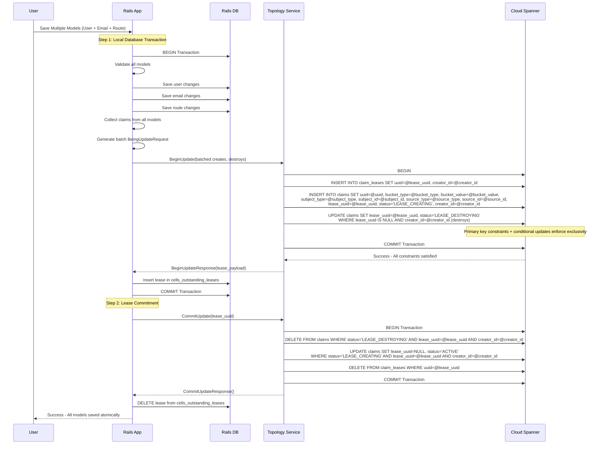
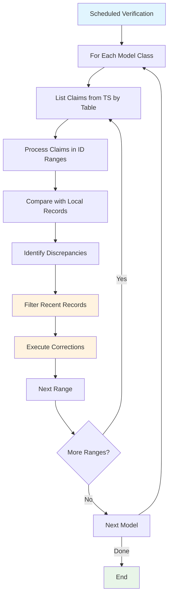
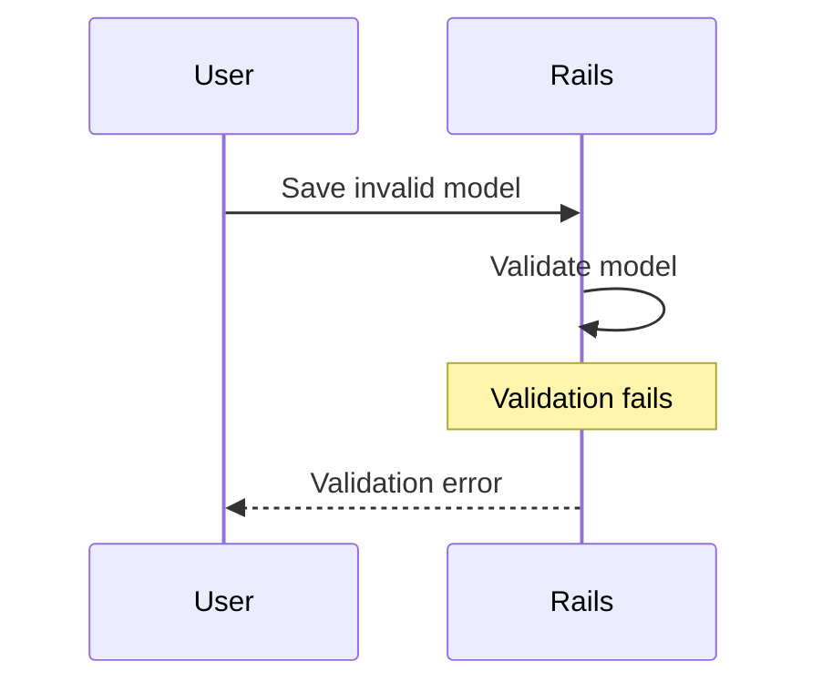
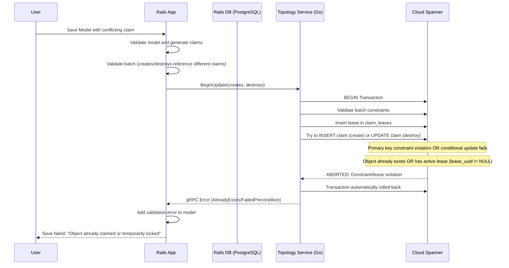
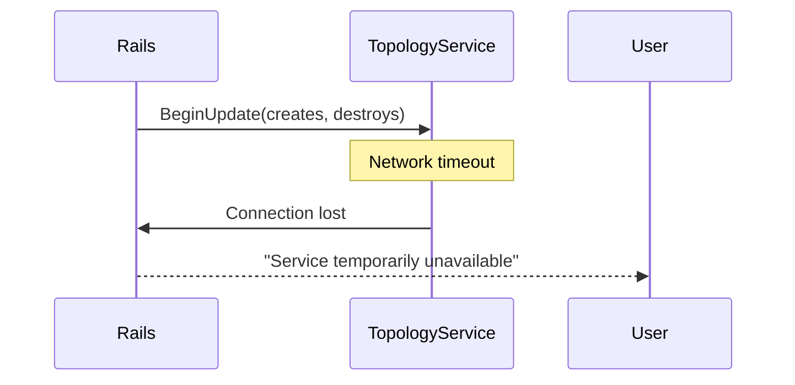
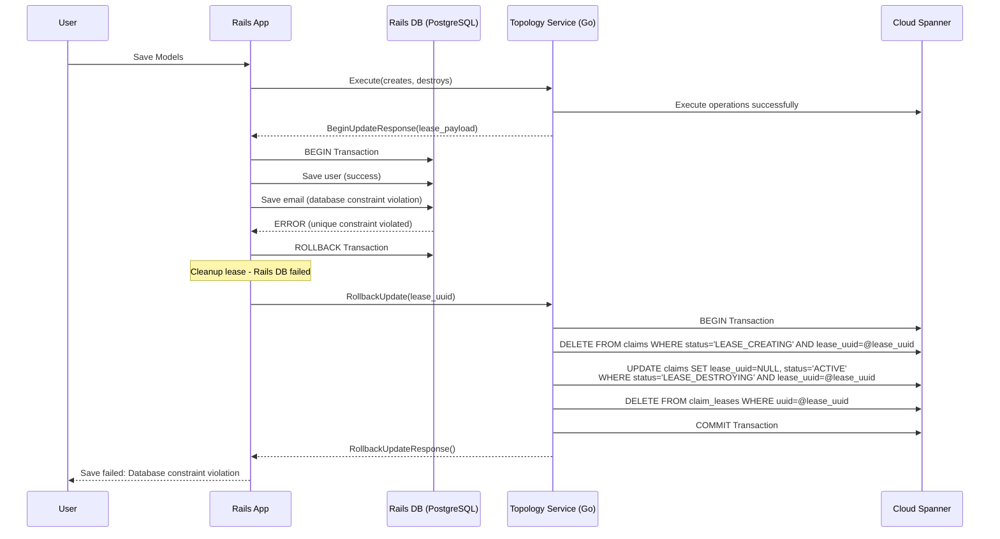
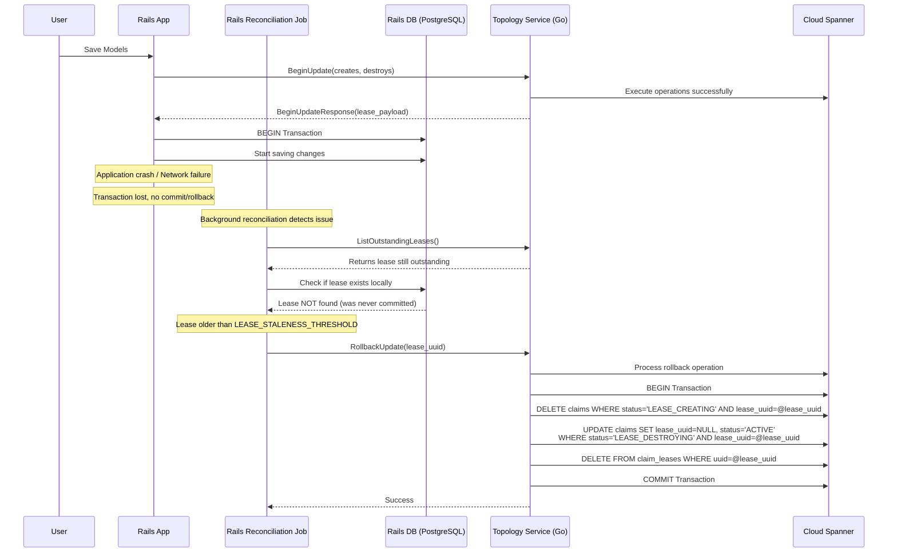
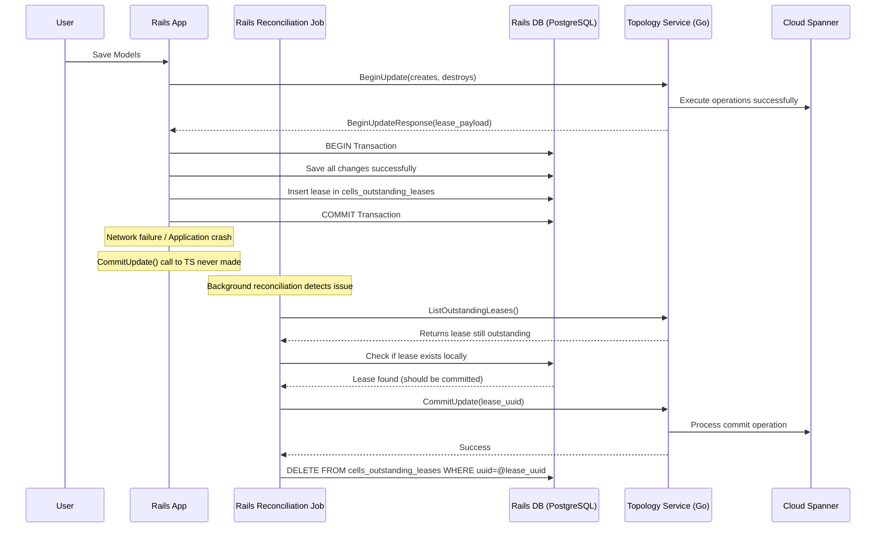
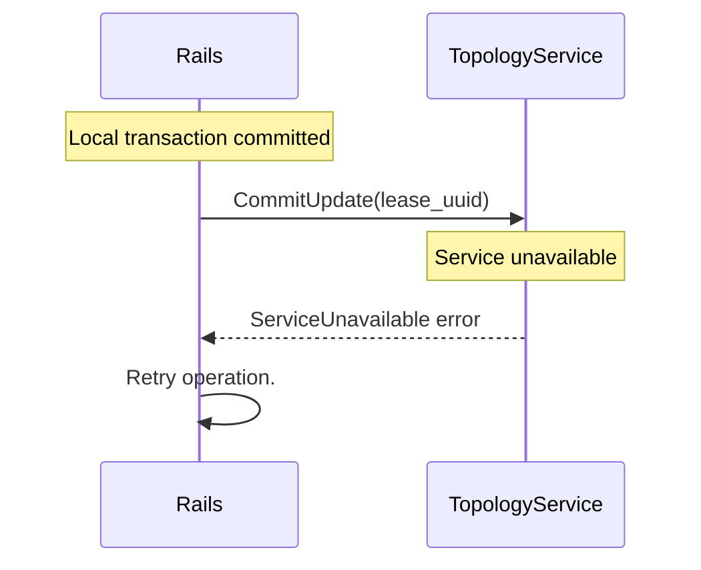
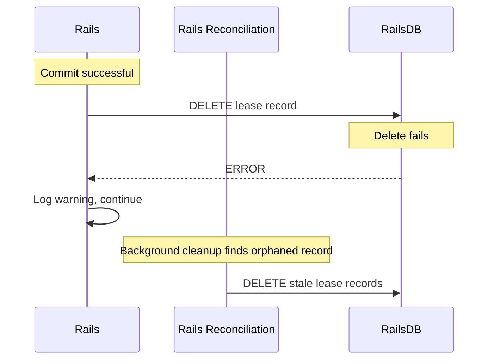




このドキュメントでは、Topology Service が Claims Service のトランザクション動作を実装するための設計目標とアーキテクチャを説明します。

このドキュメントは一部の概念を（意図的または非意図的に）単純化しているため、実際の実装を反映していません。示されている API はコンセプトを説明するための例として考えてください。最終的な状態を示すものではありません。

> 注意:
このドキュメントで使用されている protobuf とデータベース構造は、動作を示すためのものであり、使用される最終的なデータ構造を表していません。

## 基本コンセプト

### **分散リースベースの調整**

このシステムは、複数の GitLab Cell にまたがるグローバルに一意な claim（ユーザー名、メール、ルート）を管理するための**分散リースベースの調整メカニズム**を実装します。ある時点において 1 つの Cell のみが特定の claim を「所有」できることを保証し、分散環境での競合を防ぎます。

### **コア動作原則**

#### **1. リースファースト調整**

システムは「リース取得後、後でコミット」パターンに従います。

- ローカル変更を行う**前に**、中央の Topology Service からリースを取得します
- リース取得に成功した**後のみ**、ローカルデータベース操作を進めます
- ローカル成功の**後に**、変更を永続化するためにリースをコミットします
- **何かが失敗した場合**は、一貫性を維持するためにリースをロールバックします

#### **2. アトミックバッチ操作**

複数の関連モデルを一緒に処理しなければなりません。

- 複数のモデルからすべての claim の変更を収集します
- Topology Service に単一のバッチリクエストを送信します
- 1 つのトランザクションですべてのローカルデータベース変更を処理します
- すべての claim を一緒にコミットまたはロールバックします

**重要な制約**: 同じ claim は同時に 1 つの操作のみにマークできます。つまり、作成と破棄の両方に同時にマークすることはできません。

#### **3. 時間制限付きリース**

リースは調整プロセスを通じて時間制限があります。

- リースは作成タイムスタンプのみを持ち、明示的な有効期限はありません
- 調整プロセスは経過時間に基づいて陳腐化を決定します（デフォルト 10 分のしきい値）
- 一定のしきい値後にリースがロールバックされるため、無期限のロックを防ぎます
- バックグラウンド調整が一貫性を確保します

#### **4. リースの排他性**

**重要なルール**: アクティブなリースを持つオブジェクト（`lease_uuid != NULL AND status != ACTIVE`）は他の操作で claim できません。

- **作成操作**: オブジェクトがすでに存在する場合、主キー制約で失敗します
- **破棄操作**: オブジェクトにアクティブなリースがある場合、条件付き更新で失敗します
- **時間的ロック**: オブジェクトはコミット/ロールバックされるまでロックされたままです
- **自動リリース**: 陳腐化したリースは調整によってロールバックされ、オブジェクトが再び利用可能になります

#### **5. 所有権のセキュリティ**

**重要なセキュリティ制約**: claim を作成した Cell のみがそれを破棄できます。

- **Cell ID 検証**: Cell は自身のリースのみを操作できます
- **干渉の防止**: Cell は他の Cell が作成した claim を破棄できません
- **セキュリティ分離**: 悪意のある、またはバグのある Cell は他の Cell のデータを混乱させることができません

## システム参加者

### **Rails Concern: Claim 属性**

- **主な役割**: claimable な属性を変更するアプリケーションアクション（作成、更新、または破棄）を処理します
- **責任**:
  - ローカルでモデルを検証します
  - 複数のモデルからすべての claim をバッチリクエストに収集します
  - リース取得のために Topology Service と調整します
  - ローカルデータベーストランザクションを管理します
  - ローカル操作後の即時コミット/ロールバックを処理します
  - ネットワーク障害を合理的な回数リトライします

### **Sidekiq ワーカーまたは Cron ジョブ: 失われたトランザクションの回復**

- **頻度**: 毎分
- **操作**: Topology Service と Rails の両方に存在するリース（またはその逆）を調整します
- **戦略**: Rails 主導のクリーンアップと Topology Service の冪等操作
- **プロセス**:
  - カーソルベースのページネーションで Topology Service から未処理リースをリストします
  - 作成時間と陳腐化しきい値に基づいて陳腐化したリースとアクティブなリースを分離します
  - ローカルに存在するアクティブなリースをコミットし、陳腐化したリースをロールバックします
  - 孤立したローカルリースレコードをクリーンアップします

### **Sidekiq Cron ジョブ: データ検証プロセス**

- **頻度**: 1 日数回。cron ジョブの実行は、スパイクな作業負荷を避けるために Cell 間でランダム化するのが最善です。これは Topology Service によるグローバルな同時実行制限が必要になるかもしれません。
- **操作**: Rails と Topology Service の間で claim の一貫性を検証します
- **戦略**: Rails 主導の検証プロセス
- **プロセス**:
  - Topology Service に保存された情報を反復します
  - Rails DB に保存された情報と比較します
  - Rails コードベースで定義されたすべての claim を処理します
  - Topology Service に保存された情報を修正します（作成、更新、または破棄）

### **Topology Service**

**主な役割**: グローバルな claim 状態を管理する一元化された調整サービス

**責任**:

- データベース制約によってリースの排他性を強制します
- リースのライフサイクルを管理します（作成、コミット、ロールバック）
- 複数の claim のためのアトミックバッチ操作を提供します
- Cell が自身の claim のみを操作できることを確保します

## ハッピーパスワークフロー



### **詳細ステップ**

1. **プリフライト検証**: Rails はすべてのモデルをローカルで検証し、バッチ claim リクエストを生成します
2. **リース取得**: Topology Service の単一アトミックトランザクションがすべての claim のリースを取得します
3. **ローカルデータベーストランザクションのコミット**: Rails はすべての変更を保存し、リーストラッキングレコードを作成します
4. **リースコミット**: Topology Service はすべての claim を確定し、リースを削除します
5. **クリーンアップ**: Rails はローカルリーストラッキングレコードを削除します

### **詳細なプロセスフロー**

#### **フェーズ 1: プリフライト Claim 取得**

```text
User saves models → Rails DB Transaction → Rails validates → Model changes → Claims generated → Topology Service called
```

**何が起こるか:**

1. **ローカルデータベーストランザクション開始**: エンジニアが `User.save` を呼び出すと、Rails データベーストランザクションを開始します。
1. **モデル検証**: Rails はまずモデルをローカルで検証します。
1. **データベース更新**: Rails データベース内にレコードを挿入/更新します。まだコミットされていません。
1. **Claim 生成**: 変更された各一意の属性に対して、作成/破棄 claim を生成します。
1. **バッチ収集**: 複数のモデルが保存される場合、すべての claim を一緒に収集します。
1. **Topology Service 呼び出し**: ローカル DB トランザクション**前に**すべての claim とともに `BeginUpdate()` リクエストを送信します。

**この順序の理由:**

- **早期失敗**: claim に競合がある場合、ローカル変更をコミットする前に失敗します。
- **アトミック性**: すべての claim が成功するか、すべて失敗します
- **効率性**: 複数のモデルに対する単一のネットワーク呼び出し。マルチリージョン書き込みの長い書き込みレイテンシのために重要です。

**長いデータベーストランザクションの処理:**

[データベーストランザクション中にネットワークリクエストを送信することはアンチパターン](https://docs.gitlab.com/development/database/transaction_guidelines/#dangerous-example-third-party-api-calls)とみなされています。
これは私たちが取るリスクであるとデータベースフレームワークチームから[明示的な承認](https://gitlab.com/gitlab-com/gl-infra/tenant-scale/cells-infrastructure/team/-/issues/488#note_2777159474)を得ています。
次のメカニズムが整っている限り:

1. データベーストランザクション中の Topology Service リクエストへのハードタイムアウト。
1. 特に最初は増分的に増加するフィーチャーフラグの後ろの Claim。
1. データベーストランザクション中に Topology Service への同時リクエストを 300 件のみに制限するサーキットブレーカーパターン。

#### **フェーズ 2: Topology Service でのアトミックリース作成**

```text
BeginUpdate() → Single transaction → Database constraints + lease exclusivity enforced
```

**Topology Service での `BeginUpdate()` で何が起こるか:**

1. **リースレコード**: フルペイロードとともに `claim_leases` に挿入します
2. **Claim の作成**: `status='LEASE_CREATING'` と lease_uuid を持つ新しい claim を挿入します
    - (claim_type, claim_value) の主キー制約が重複を防ぎます
    - **制約**: 作成はシステムに存在しない claim を参照しなければなりません
3. **破棄のマーク**: リースされていない場合 (`lease_uuid IS NULL`) かつ `creator_id` がリクエストしている Cell と一致する場合**のみ**既存の claim を更新します
    - 条件付き更新により、同じオブジェクトへの並行操作がなく、作成者のみが破棄できることを確保します
    - **制約**: 破棄は、コミットされ、リースされておらず、リクエストする Cell によって所有されている claim を参照しなければなりません
4. **バッチ検証**: 同じ claim（`claim_type`、`claim_value`）は、和解不能な状態遷移を避けるために 1 つの操作（作成または破棄）のみを持てます
5. **リース排他性**: リースされていないオブジェクト（`lease_uuid IS NULL`）のみが新しい操作に対してオープンです
6. **アトミック成功/失敗**: いずれかの操作が失敗した場合、トランザクション全体が自動的にロールバックされます

**所有権ルール**:

- **ロックされていないオブジェクトのみ**（`lease_uuid IS NULL` の場合）が claim できます
- **Cell が所有**するのみの claim は Cell によって変更できます
- **これにより並行変更が防止**され、操作の分離が確保されます

**このアプローチの理由:**

- **グローバルレプリケーションレイテンシの最小化**: 変更の作成部分はシステム内でルーティング可能になり、クロスリージョン Cloud Spanner レプリケーションレイテンシを隠すことができます。これは障害率の予想と一致しています。99.9% の操作が成功することを期待しています。そのため、ロールバックされる可能性のあるレコードを作成することは例外です。
- **排他的アクセス**: 1 つの操作のみが一度にオブジェクトを操作できます
- **競合状態の防止**: すでに変更されているオブジェクトを claim できません
- **時間的分離**: リースは時間制限付きの排他的アクセスを提供します
- **データベースレベルの強制**: 制約はアプリケーションチェックよりも速く、より信頼性があります
- **明示的な競合チェックなし**: データベース制約が一意性を自動的に処理します

#### **フェーズ 3: ローカルデータベーストランザクションのコミット**

```text
Lease acquired → Create lease record in local database → Commit Transaction
```

**Rails での何が起こるか:**

1. **リーストラッキング**: `lease_uuid` と作成日を持つ `cells_outstanding_leases` レコードを作成します
1. **トランザクションコミット**: すべての変更を一緒にコミットします

**リース取得後の理由:**

- **安全性**: ローカル変更はグローバルな調整が成功した後にのみ発生します
- **追跡**: `lease_uuid` を `cells_outstanding_leases` に挿入することで、ローカルトランザクションが適切にコミットされたことが保証されます
- **即時クリーンアップ**: Rails DB のリースレコードにより、トランザクション完了後の迅速なクリーンアップが可能になります
- **ロールバック能力**: ローカル DB が失敗した場合、クリーンアップするための `lease_uuid` があります

#### **フェーズ 4: リースコミット**

```text
Local success → CommitUpdate() → Finalize claims → Remove lease
```

**`CommitUpdate()` 前の Rails での何が起こるか:**

1. **即時コミット**: `CommitUpdate()/RollbackUpdate()` は Rails の `after_commit`/`after_rollback` フックによってトリガーされます
1. **非トランザクションチェック**: Rails はオープンなローカル DB トランザクションがないことを確認します
1. **Rails チェック**: `CommitUpdate()` を行う前に、Rails は `cells_outstanding_leases` をチェックしてトランザクションが正常にコミットされたことを確認します

**Topology Service での `CommitUpdate()` で何が起こるか:**

1. **破棄の処理**: `DELETE claims WHERE status='LEASE_DESTROYING' AND lease_uuid=@lease_uuid`
1. **作成の確定**: `UPDATE claims SET lease_uuid=NULL, status='ACTIVE' WHERE status='LEASE_CREATING' AND lease_uuid=@lease_uuid`
1. **リースクリーンアップ**: `DELETE FROM claim_leases WHERE uuid=@lease_uuid`
1. **Rails クリーンアップ**: Rails は `cells_outstanding_leases` レコードを削除します

**この 2 フェーズアプローチの理由:**

- **耐久性**: 作成は永続化され、破棄が実行されます
- **即時クリーンアップ**: リースは成功完了後すぐに削除されます
- **冪等性**: CommitUpdate は安全にリトライできます - 操作は冪等です

## 参加者ごとの用語

### **Rails クライアント**

#### **ローカルスキーマ**

```sql
-- Rails migration for cells_outstanding_leases table (tracks local lease state)
-- This table only contains active leases - entries are deleted when consumed
CREATE TABLE cells_outstanding_leases (
    uuid uuid NOT NULL,
    created_at timestamp with time zone NOT NULL,
    updated_at timestamp with time zone NOT NULL
);

ALTER TABLE ONLY cells_outstanding_leases
    ADD CONSTRAINT cells_outstanding_leases_pkey PRIMARY KEY (uuid);

-- Indexes for performance and operational queries
CREATE INDEX idx_cells_outstanding_leases_created ON cells_outstanding_leases(created_at);
```

#### **モデル定義**

```ruby
# Rails ActiveRecord concern for handling distributed claims
module Cells::Claimable
  # Configure claimable attributes with their bucket types
  def cells_claims_attribute(attribute_name, type:)

  # Configure metadata for claims (subject and source information)
  def cells_claims_metadata(subject_type:, subject_key: nil, source_type:)
end

# Example model implementations
class Route < ApplicationRecord
  include Cells::Claimable

  cells_claims_metadata subject_type: CLAIMS_SUBJECT_TYPE::GROUP,
                        subject_key: :namespace_id,
                        source_type: CLAIMS_SOURCE_TYPE::RAILS_TABLE_ROUTES

  cells_claims_attribute :path, type: CLAIMS_BUCKET_TYPE::ROUTES
end

class User < ApplicationRecord
  include Cells::Claimable

  cells_claims_metadata subject_type: CLAIMS_SUBJECT_TYPE::USER,
                        subject_key: :id,
                        source_type: CLAIMS_SOURCE_TYPE::RAILS_TABLE_USERS

  cells_claims_attribute :username, type: CLAIMS_BUCKET_TYPE::UNSPECIFIED
end
```

#### **操作**

- **Claim 生成**: モデル変更から一意の属性を抽出し、作成/破棄 claim にします
- **バッチ収集**: 複数のモデルからの claim を単一の BeingUpdateRequest に集約します
- **バッチ検証**: バッチ内の作成と破棄が異なる claim を参照することを確認してモデリングの競合を避けます
- **リーストラッキング**: 調整とクリーンアップのために lease_uuid をローカルに保存します
- **即時クリーンアップ**: コミット/ロールバック成功後にリースレコードを削除します
- **エラーハンドリング**: gRPC エラーを Rails の検証エラーに変換します

### **バックグラウンド調整**

#### **Rails 主導のクリーンアッププロセス**

```ruby
# Rails-driven cleanup with idempotent Topology Service operations
class ClaimsLeaseReconciliationService
  LEASE_STALENESS_THRESHOLD = 10.minutes  # Consider lease stale if older than threshold

  def self.reconcile_outstanding_leases
    topology_service = Gitlab::Cells::TopologyServiceClient.new
    cursor = nil

    loop do
      # Get leases from Topology Service with cursor-based pagination
      response = topology_service.list_outstanding_leases(
        ListOutstandingLeasesRequest.new(
          cell_id: current_cell_id,
          cursor: cursor
        )
      )

      break if response.leases.empty?

      # Process active leases: commit if they exist locally
      local_active_leases = LeasesOutstanding.where(lease_uuid: response.leases.pluck(:lease_uuid)).pluck(:lease_uuid)

      local_active_leases.each do |lease_uuid|
        topology_service.commit_update(CommitUpdateRequest.new(cell_id: current_cell_id, lease_uuid: lease_uuid))
        LeasesOutstanding.find_by(lease_uuid: lease_uuid)&.destroy!
      end

      # Find stale leases that are missing locally
      now = Time.current
      local_active_leases = local_active_leases.to_set
      stale_leases = response.leases
        .reject { |lease| local_active_leases.include?(lease.lease_uuid) }
        .select { |lease| lease.created_at.to_time < (now - LEASE_STALENESS_THRESHOLD) }

      # Process stale leases: rollback all (idempotent)
      stale_leases.each do |lease|
        topology_service.rollback_update(RollbackUpdateRequest.new(cell_id: current_cell_id, lease_uuid: lease.lease_uuid))
        # Clean up any local record that might exist
        LeasesOutstanding.find_by(lease_uuid: lease.lease_uuid)&.destroy!
      end

      # Update cursor for next iteration
      cursor = response.next_cursor
      break if cursor.blank?  # No more pages
    end

    # Exception case: leases missing from TS but present locally
    # This might happen during "Scenario 5A: Failed to Delete Local Lease Record"
    stale_local_leases = LeasesOutstanding.where('created_at < ?', Time.current - LEASE_STALENESS_THRESHOLD)
    if stale_local_leases.exists?
      Rails.logger.error "Found #{stale_local_leases.count} stale local leases without TS counterparts"
      stale_local_leases.destroy_all
    end
  end
end
```

#### **調整の原則**

- **主なクリーンアップ**: Rails は未処理リースのクリーンアップに責任があります
- **カーソルベースのページネーション**: 無限ループなしにすべてのリースを反復することを保証します
- **冪等操作**: Topology Service の CommitUpdate/RollbackUpdate 操作は冪等です
- **陳腐化ベースのクリーンアップ**: しきい値より古いリースは陳腐化とみなされます（ローカルプロパティ）
- **完全な処理**: 前進を確保するために陳腐化したリースとアクティブなリースの両方が処理されます
- **例外処理**: 対応する TS リースのないローカルリースはシステムの問題を示します
- **即時クリーンアップ**: リースはすぐに削除されます

## Topology Service データ検証

### **概要**

データ検証プロセスは、Topology Service のグローバル claim 状態と各 Cell のローカルデータベースレコードの間の一貫性を確保します。これは Cell が開始するプロセスで、定期的に不一致を検出して調整します。



### **コア検証プロセス**

システムはカーソルベースのページネーションを使用して TS から ID 範囲で claim を取得し、効率的なハッシュベースの照合を使用してローカルレコードと比較します。3 種類の不一致が検出されます: TS で欠落している claim、異なる claim 値、TS に余分な claim。最近のレコード（1 時間以内）は一時的な変更を修正することを避けるためにスキップされます。

オプションとして、gRPC ストリーミングを使用して特定のカーソルからストリーミングレプリケーションを再開しながらレコードをライブで取得することができます。

### 高レベルの擬似コード

```ruby
# Configuration
BATCH_SIZE = 1000
RECENT_RECORD_THRESHOLD = 1 hour  # Skip recent records to avoid race conditions

# Main verification process - runs for each claimable model/source type
def verify_claims_for_source(source_type)
    cursor = 0

    loop do

        # Fetch next batch from TS (skips gaps automatically in case where sparse source_ids are present in TS)
        ts_records = TS.ListRecords(
            cell_id: current_cell_id,
            source_type: source_type,
            id_gt: cursor,
            limit: BATCH_SIZE,
        )

        # If TS has no records in this range, switch to backfill mode
        # This handles both:
        #   - Initial backfill (TS is empty)
        #   - Tail backfill (Rails has more records than TS)
        if ts_records.empty?
            backfill_from_rails(source_type, cursor)
            break
        end

        # Use max ID from TS response to bound Rails query
        # This catches Rails records in any gaps TS skipped over
        max_ts_id = ts_records.max_by(&:source_id).source_id

        # Fetch Rails records in the same ID range
        rails_records = Rails.GetRecordsForSource(source_type, id_gt: cursor, id_lte: max_ts_id)

        # Build lookup maps for O(1) comparison
        ts_map = ts_records.index_by(&:source_id)
        rails_map = rails_records.index_by(&:id)

        # Collect discrepancies by type for batch processing
        missing_in_ts = []      # Exists in Rails, not in TS
        different_records = []  # Exists in both, but data differs
        extra_in_ts = []        # Exists in TS, not in Rails

        # Get union of all IDs from both sources
        all_ids = ts_map.keys | rails_map.keys

        all_ids.each do |id|
            ts_record = ts_map[id]
            rails_record = rails_map[id]

            # Skip recent Rails records to avoid interfering with in-flight transactions
            next if rails_record && rails_record.created_at > (Time.current - RECENT_RECORD_THRESHOLD)

            # Skip recent TS records for the same reason
            next if ts_record && ts_record.created_at > (Time.current - RECENT_RECORD_THRESHOLD)

            if ts_record && rails_record
                unless records_match?(ts_record, rails_record)
                    # Data mismatch - Rails is authoritative
                    different_records << { ts: ts_record, rails: rails_record }
                end

            elsif rails_record && !ts_record
                # Missing in TS - shouldn't happen during normal operation
                log_exception(source_type, id)
                missing_in_ts << rails_record

            elsif ts_record && !rails_record
                # Orphan in TS - needs cleanup
                extra_in_ts << ts_record
            end
        end

        # Process discrepancies using BeginUpdate/CommitUpdate pattern
        # Each correction type is processed separately for clarity and error isolation

        if missing_in_ts.any?
            # Create missing records in TS
            # Note: May fail if record was claimed by another cell - requires manual intervention
            TS.begin_update_and_commit(creates: missing_in_ts)
        end

        if different_records.any?
            # Update requires destroy + create (no direct update API)
            # Non-atomic: if create fails after destroy, record is lost until next verification
            ts_records_to_destroy = different_records.map { |r| r[:ts] }
            rails_records_to_create = different_records.map { |r| r[:rails] }

            TS.begin_update_and_commit(destroys: ts_records_to_destroy)
            TS.begin_update_and_commit(creates: rails_records_to_create)
        end

        if extra_in_ts.any?
            # Remove orphaned records from TS
            TS.begin_update_and_commit(destroys: extra_in_ts)
        end

        # Move to next range
        cursor = max_ts_id
    end
end


# Backfill function - creates all Rails records beyond start_id in TS
# Used for initial population and catching up when Rails is ahead of TS
def backfill_from_rails(source_type, start_id)
    cursor = start_id

    loop do
        # Fetch Rails records in batches to manage memory
        batch = Rails.GetRecordsForSource(
            source_type,
            id_gt: cursor,
            order_by: :id,
            limit: 1000
        )

        break if batch.empty?

        # Skip recent records during backfill as well
        records_to_create = batch.reject { |r| r.created_at > (Time.current - RECENT_RECORD_THRESHOLD) }

        TS.begin_update_and_commit(creates: records_to_create) if records_to_create.any?

        cursor = batch.last.id
    end
end


# Helper: Compare TS record with Rails record
# Returns true if all claim-relevant fields match
def records_match?(ts_record, rails_record)
    ts_record.metadata == rails_record.metadata
end


# Helper: BeginUpdate followed by immediate CommitUpdate
# Used by verification since there are no local DB changes to coordinate
def TS.begin_update_and_commit(creates: [], destroys: [])
    response = TS.BeginUpdate(
        cell_id: current_cell_id,
        creates: creates,
        destroys: destroys
    )

    TS.CommitUpdate(
        cell_id: current_cell_id,
        lease_uuid: response.lease_uuid
    )
end
```

### **主要な動作**

- **範囲ベースの処理**: TS は ID 範囲（start_range から end_range）で claim を返し、ローカルクエリは正確な範囲と一致します
- **ハッシュベースの照合**: claim_key を使用した O(1) ルックアップ、処理済みの claim は delete() で削除
- **3 方向比較**: 欠落（ローカルのみ）、異なる（両方存在、データが異なる）、余分（TS のみ）
- **最近のレコード保護**: 一時的な競合を避けるためにしきい値内に作成されたレコードをスキップ
- **バッチ修正**: すべての修正に BeginUpdate/CommitUpdate パターンを使用し、不一致タイプごとに個別のバッチ
- **カーソルページネーション**: ギャップや重複なしにすべてのレコードを自動的に進める

### **最近のレコード保護**

検証システムは一時的な変更を修正することを防ぎます。

- **設定可能なしきい値**: `RECENT_RECORD_THRESHOLD = 1.hour`（調整可能）
- **ローカルレコード保護**: `created_at` がしきい値内の場合、レコード全体をスキップ
- **Claim 比較保護**: ローカルまたは TS の claim が最近の場合、修正をスキップ
- **余分な Claim 保護**: 最近の TS claim を削除からフィルタリング

**利点:**

- **一時的な変更の処理**: まだ伝播中のレコードの修正を防ぎます
- **競合状態の防止**: 進行中の操作への干渉を避けます
- **運用上の安全性**: 正当な新しいデータを修正するリスクを減らします

### **Topology Service**

#### **Cloud Spanner スキーマ**

```sql
-- Claims table with integrated lease tracking
CREATE TABLE claims (
  uuid STRING(36) NOT NULL,                        -- UUID for internal tracking
  bucket_type INT64 NOT NULL,                      -- Type of bucket (maps to protobuf Bucket.Type enum)
  bucket_value STRING(1024) NOT NULL,              -- The actual value being claimed
  subject_type INT64 NOT NULL,                     -- Type of subject (maps to protobuf Subject.Type enum)
  subject_id STRING(128) NOT NULL,                 -- Subject identifier
  source_type INT64 NOT NULL,                      -- Database source type (maps to protobuf Source.Type enum)
  source_id STRING(128) NOT NULL,                  -- Record ID in the source table
  creator_id STRING(128) NOT NULL,                 -- Creator (cell) ID that created this claim
  lease_uuid STRING(36),                           -- NULL for committed records, UUID for leased records
  status INT64 NOT NULL DEFAULT 0,                 -- 0: 'UNSPECIFIED', 1: 'ACTIVE', 2: 'LEASE_CREATING', 3: 'LEASE_DESTROYING'
  created_at TIMESTAMP NOT NULL DEFAULT (CURRENT_TIMESTAMP()),
  updated_at TIMESTAMP NOT NULL DEFAULT (CURRENT_TIMESTAMP()),
) PRIMARY KEY (uuid);

-- Unique index for bucket uniqueness (primary constraint for claim conflicts)
CREATE UNIQUE INDEX idx_claims_bucket_value
ON claims(bucket_type, bucket_value)
STORING (creator_id); -- used for claim uniqueness and storing creator_id for faster classification

-- Index for lease operations
CREATE NULL_FILTERED INDEX idx_claims_lease_uuid
ON claims(lease_uuid); -- used to quickly update the claims in the `commitUpdate`

-- CRITICAL CONSTRAINTS:
-- 1. Objects with lease_uuid != NULL cannot be claimed by other operations
-- 2. Only the cell that created a claim (creator_id) can destroy it
-- These constraints prevent concurrent operations and unauthorized access

-- Outstanding leases table
CREATE TABLE claim_leases (
  uuid STRING(36) NOT NULL,                        -- UUID of the lease
  creator_id STRING(128) NOT NULL,                 -- Creator (cell) ID that owns the lease
  created_at TIMESTAMP NOT NULL DEFAULT (CURRENT_TIMESTAMP()),
  updated_at TIMESTAMP NOT NULL DEFAULT (CURRENT_TIMESTAMP()),
) PRIMARY KEY (uuid); -- used to quickly fetch the correct lease_uuid during commitUpdate

-- Foreign keys are used to ensure referential integrity between claims and claim_leases tables
```

#### **Protobuf 定義**

```protobuf
syntax = "proto3";
package gitlab.cells.topology_service.claims.v1;

import "google/protobuf/any.proto";
import "google/protobuf/timestamp.proto";
import "proto/types/v1/uuid.proto";

option go_package = "gitlab.com/gitlab-org/cells/topology-service/clients/go/proto/claims/v1;claims_proto";

// Core message definitions
message Bucket {
  enum Type {
    UNSPECIFIED = 0;
    ROUTES = 1;
    ORGANIZATION_PATH = 2;
    REDIRECT_ROUTES = 3;
  }

  Type type = 1;
  string value = 2;
}

message Subject {
  enum Type {
    UNSPECIFIED = 0;
    ORGANIZATION = 1;
    GROUP = 2;
    PROJECT = 3;
    USER = 4;
  }

  Type type = 1;
  int64 id = 2;
}

message Source {
  enum Type {
    UNSPECIFIED = 0;
    RAILS_TABLE_USERS = 1;
    RAILS_TABLE_EMAILS = 2;
    RAILS_TABLE_ROUTES = 3;
    RAILS_TABLE_PROJECTS = 4;
    RAILS_TABLE_GROUPS = 5;
    RAILS_TABLE_ORGANIZATIONS = 6;
    RAILS_TABLE_REDIRECT_ROUTES = 7;
  }

  Type type = 1;
  int64 rails_primary_key_id = 2;
}

message Metadata {
  Bucket bucket = 1;
  Subject subject = 2;
  Source source = 3;
}

message Record {
  enum Status {
    UNSPECIFIED = 0;
    ACTIVE = 1;
    LEASE_CREATING = 2;
    LEASE_DESTROYING = 3;
  }
  types.v1.UUID uuid = 1;
  Metadata metadata = 2;
  int64 cell_id = 3;
  Status status = 4;
  optional types.v1.UUID lease_uuid = 5;
  google.protobuf.Timestamp created_at = 6;
}

// Service request/response messages
message GetRecordRequest {
  Bucket bucket = 1;
}

message GetRecordResponse {
  Record record = 1;
  optional CellInfo cell_info = 2;
}

message BeginUpdateRequest {
  repeated Metadata create_records = 1;
  repeated Metadata destroy_records = 2;
  int64 cell_id = 3;
}

message BeginUpdateResponse {
  int64 cell_id = 1;
  types.v1.UUID lease_uuid = 2;
}

message CommitUpdateRequest {
  int64 cell_id = 1;
  types.v1.UUID lease_uuid = 2;
}

message CommitUpdateResponse {}

message RollbackUpdateRequest {
  int64 cell_id = 1;
  types.v1.UUID lease_uuid = 2;
}

message RollbackUpdateResponse {}

message ListLeasesRequest {
  int64 cell_id = 1;
  optional google.protobuf.Any next = 2;
  optional int32 limit = 3;
}

message LeaseRecord {
  types.v1.UUID uuid = 1;
  google.protobuf.Timestamp created_at = 2;
}

message ListLeasesResponse {
  repeated LeaseRecord leases = 1;
  optional google.protobuf.Any next = 2;
}

message ListRecordsRequest {
  int64 cell_id = 1;
  Source.Type source_type = 2;
  optional google.protobuf.Any next = 3;
  optional int32 limit = 4;
}

message ListRecordsResponse {
  repeated Record records = 1;
  optional google.protobuf.Any next = 2;
}

// Service definition
service ClaimService {
  rpc GetRecord(GetRecordRequest) returns (GetRecordResponse);
  rpc BeginUpdate(BeginUpdateRequest) returns (BeginUpdateResponse);
  rpc CommitUpdate(CommitUpdateRequest) returns (CommitUpdateResponse);
  rpc RollbackUpdate(RollbackUpdateRequest) returns (RollbackUpdateResponse);
  rpc ListLeases(ListLeasesRequest) returns (ListLeasesResponse);
  rpc ListRecords(ListRecordsRequest) returns (ListRecordsResponse);
}
```

#### **gRPC API の動作**

- **BeginUpdate()**: バッチ操作のためにアトミックにリースを取得し、排他性制約を強制します
  - **検証**: 作成と破棄が同じバッチ内の異なる claim を参照することを確保します
  - **作成処理**: システムに存在しない新しい claim を挿入します
  - **破棄処理**: リクエストする Cell が所有する既存の claim を更新します
- **CommitUpdate()**: claim を確定します（破棄を削除、作成から lease_uuid をクリア）、リースを削除します
- **RollbackUpdate()**: claim を元に戻します（作成を削除、破棄から lease_uuid をクリア）、リースを削除します
- **ListOutstandingLeases()**: カーソルベースのページネーションで調整のためのリースを取得します
- **ListClaims()**: 範囲情報とともに検証のためにテーブルごとに claim を取得します

## アンハッピーパスワークフロー

### **障害ポイント 1: プリフライト検証の失敗**

**シナリオ**: リース取得前のモデル検証の失敗



**リカバリ**: リカバリは不要 - リソースは取得されておらず、ユーザーに検証エラーが表示されます

---

### **障害ポイント 2: リース取得の失敗**

#### **シナリオ 2A: Topology Service の競合 - 永続的な Claim**



**異なる競合タイプ:**

1. **永続的な競合**: オブジェクトが別の Cell によって永続的に所有されている → 「すでに使用されています」
2. **一時的な競合**: オブジェクトが別の操作によって一時的にリースされている → 「後でもう一度お試しください」
3. **バッチ検証の競合**: 作成と破棄が同じ claim を参照している → 「無効なバッチ操作」

**リカバリ**: リカバリは不要 - ユーザーに適切なエラーメッセージが表示されます

#### **シナリオ 2B: 実行中のネットワーク障害**



**リカバリ**: リカバリは不要 - リースは取得されておらず、安全にリトライできます。アプリケーションによって限られた回数のリトライが行われる場合があります。

---

### **障害ポイント 3: ローカルデータベーストランザクションの失敗**

#### **シナリオ 3A: Rails データベース制約違反**



**リカバリ**: リースの自動ロールバック、ユーザーにエラーが表示されます

#### **シナリオ 3B: ローカルトランザクション中のアプリケーションクラッシュ**



**リカバリ**: バックグラウンド調整が孤立したリースをロールバックします

---

### **障害ポイント 4: リースコミットの失敗**

#### **シナリオ 4A: ローカルトランザクション成功後のコミットの欠落**



**リカバリ**: バックグラウンド調整がリースをコミットします

#### **シナリオ 4B: コミット中の Topology Service 利用不可**



**リカバリ**: 操作は合理的な回数リトライされます。それ以外の場合、調整ジョブが後で処理します。

---

### **障害ポイント 5: クリーンアップの失敗**

#### **シナリオ 5A: ローカルリースレコードの削除失敗**



**リカバリ**: バックグラウンド調整が最終的に陳腐化したレコードを削除します

## 高度な動作

### **リース排他性と並行制御**

```text
Cell A: BeginUpdate(create email@example.com) → Lease acquired
Cell B: BeginUpdate(destroy email@example.com) → BLOCKED until Cell A commits/rollbacks
```

**動作**: アクティブなリースを持つオブジェクトは claim できません。

- **作成**: オブジェクトが存在する場合（リース状態に関係なく）主キー制約で失敗します
- **破棄**: オブジェクトに `lease_uuid != NULL` がある場合、条件付き更新で失敗します
- **時間的ロック**: リースが期限切れになるかコミット/ロールバックされるまで、オブジェクトはロックされたままです
- **自動リリース**: 陳腐化したリースは調整によってクリーンアップされ、オブジェクトが再び利用可能になります

**例のシナリオ:**

1. **メール変更の競合**: ユーザーがメールを変更する際、管理者が削除しようとする → 最初の操作が勝ち、2 番目が失敗。ユーザーは後でリトライする必要があります。
2. **ルート転送の競合**: 2 つの操作が同じルートを移動しようとする → 最初が勝ち、2 番目が失敗します
3. **並行作成**: 2 つの Cell が同じユーザー名を作成しようとする → 最初が勝ち、2 番目は永久に失敗します

### **マルチモデル調整**

```text
User + Email + Route changes → Single batch BeginUpdate() → All-or-nothing semantics
```

**例**: メールとルートを持つユーザーを作成する:

1. User モデルがユーザー名 claim を生成します
2. Email モデルがメール claim を生成します
3. Route モデルがパスと名前の claim を生成します
4. 4 つの claim すべてが単一の BeginUpdate() 呼び出しで送られます
5. すべてのモデルが単一の Rails トランザクションで保存されます
6. すべての claim が一緒にコミットされます

**理由**: ビジネス操作はしばしば複数のモデルにまたがります - アトミックな調整が必要です

## パフォーマンス特性

### **最適化**

- **バッチ処理**: 単一の RPC 呼び出しで複数の claim
- **効率的なインデックス**: リース操作に最適化された Cloud Spanner インデックス
- **接続プーリング**: gRPC 接続の再利用
- **バックグラウンド処理**: 非同期クリーンアップがユーザー操作をブロックしません
- **制約ベースの競合**: データベースがアプリケーションロジックなしに一意性を処理します

### **スケーラビリティ**

- **Cell の独立性**: 各 Cell は競合まで独立して動作します
- **集中調整**: 競合により他の Cell が変更を行うことを防ぎます - クロス Cell 通信はありません
- **時間制限付きロック**: 陳腐化検出による自動クリーンアップで無期限のブロックを防ぎます
- **水平スケーリング**: Cloud Spanner は claim ボリュームに合わせてスケールします

## この設計が機能する理由

### **1. 排他的アクセス制御**

- オブジェクトは一度に 1 つの操作のみが変更できます
- 並行変更によるデータの破損を防ぎます
- 排他的アクセスの明確な時間的境界があります

### **2. 適切な並行処理ハンドリング**

- 永続的な競合（重複）はすぐに失敗します
- 一時的な競合（リース）はリトライできます
- ユーザーは異なる競合タイプに対して適切なフィードバックを受け取ります

### **3. 分散トランザクションなしの一貫性**

- 2PC（Two-Phase Commit）の代わりにリースを使用 - 分散ロックのモデルを使用します
- 分散トランザクションより単純な障害モード
- 陳腐化ベースのクリーンアップによる障害からの時間制限付きリカバリ
- **2PC 不要**: 各 Cell は自身のローカル状態を独立して管理し、Topology Service にデータをプッシュします

### **4. 運用のシンプルさ**

- 明確な障害モードとリカバリ手順
- 標準的なメトリクスとログを通じて観測可能
- Rails 主導のクリーンアップと Topology Service の冪等操作によるセルフヒーリング
- **即時クリーンアップ**: リースはできるだけ早く削除されます - 長引くリースは例外を示します

### **5. 開発者のエルゴノミクス**

- ActiveRecord との透過的な統合
- 宣言的な設定
- 馴染みのあるトランザクションセマンティクス

### **6. 本番環境の堅牢性**

- ネットワーク分断を適切に処理します
- Cell クラッシュからの自動リカバリ
- 包括的なエラーハンドリングとリトライロジック

### **7. 包括的な検証**

- 欠落、余分、異なる claim を検出して修正します
- 大規模データセットのための効率的なカーソルベースの処理
- 最近のレコード保護が進行中の操作への干渉を防ぎます
- 最適なパフォーマンスのためのハッシュベースの照合
- データの移行は検証の不可欠な部分です

## オープン質問と考慮事項

### **パフォーマンスの考慮事項**

- **バッチサイズの制限**: パフォーマンスとトランザクションサイズを最適化するためのバッチあたりの最大 claim 数は？
- **リース期間**: インフライトトランザクションを処理することが保証される陳腐化しきい値は何か？
- **より良いローカルトランザクション検出**: システムはローカルデータベーストランザクションを追跡して Topology Service のリースに添付すべきか？これにより調整プロセスがトランザクションが終了したかどうかを確認できます
- **接続プーリング**: Rails が Topology Service に維持する並行接続の数は何か、それらを Cell 間でどのように分散させるべきか？

### **セキュリティの考慮事項**

- **認証**: Topology Service は相互 TLS の使用でセキュリティが確保されています
- **認可**: リクエストの有効性を認可するために、リクエストペイロードの cell_id 以外に追加の認可があるべきか？
- **監査証跡**: すべての claim 操作はセキュリティ監査とコンプライアンスのためにログ記録すべきか？
- **レート制限**: 操作のレート制限は何か？

### **運用上の考慮事項**

- **モニタリング**: どのメトリクスを追跡すべきか - リース経過時間、競合率、調整頻度？
- **アラート**: いつオペレーターに通知すべきか - 陳腐化リースしきい値、調整の失敗、または高い競合率？
- **ディザスタリカバリ**: Topology Service の停止をどのように処理し、リカバリ中のデータの一貫性を確保するか？

### **エッジケース**

- **リース陳腐化の競合**: ローカルトランザクション中にリースが陳腐化した場合、許可すべきか拒否すべきか？
- **部分的なバッチ失敗**: システムはバッチ操作での部分的な成功をサポートせず、全か無かのセマンティクスのみを維持します
- **並行調整**: 複数の調整プロセスが同時に実行する場合どうするか？異なる調整プロセスが異なる範囲で作業すべきか？
- **作成/破棄の競合**: システムが単一バッチで同じ claim の作成と破棄の両方を試みるリクエストをどのように処理すべきか？これにより Topology Service でのコミットとロールバック操作が大幅に複雑になります。これは検証プロセスの一部として claim を修正するために必要かもしれません

### **将来の拡張**

- **リース更新**: 長時間実行の操作が陳腐化を防ぐためにリースを更新できるようにすべきか？
- **リースキューイング**: リースが競合する場合、待機中の操作のキューがあるべきか？または、常にユーザーに失敗を提示することで十分か。リース競合は Sidekiq などのバックグラウンドジョブを実行する場合のみリトライ可能にすべきかもしれません。
- **リース優先度**: 特定の操作（管理者 vs. ユーザー）は他より優先度があるべきか？
- **管理コントロール**: エッジケースで発生する障害モードを解決するためにどのような管理 API アクセスが必要か？
- **多層アプローチ**: システムが各自のデータベースを持つ階層化された Topology Service を使用して、上流データベースに claim を送信する多層アプローチをどのように実装すべきか？

### **テスト戦略**

- **カオスエンジニアリング**: さまざまな障害シナリオ（ネットワーク分断、サービスクラッシュ、クロックスキュー）における動作をどのようにテストするか？
- **負荷テスト**: さまざまな競合シナリオでシステムが処理できる最大スループットは何か？
- **一貫性テスト**: すべての障害モードにわたる一貫性をどのように検証するか？
- **統合テスト**: Rails、Topology Service、Cloud Spanner にまたがる完全なフローをどのようにテストするか？

## 追加トピック

### Cell のダウンタイム vs. Cell の廃止

Topology Service はリースをロールバックできません。これにより Cell の情報が古くなる可能性があります。これは他の Cell がダウンタイム Cell によって以前保有されていたレコードを claim する場合に重要です。そのため Topology Service はリースに関する決定を行う権威がないため、いかなる調整プロセスも実装しません。

Cell のダウンタイムの場合、Cell に属する未処理リースを削除するための管理アクションが必要になります。

これは Cell の廃止とは異なります。この場合、廃止された Cell は Topology Service に情報を保持しないことが期待されています（すべての情報が移行されます）。ただし、廃止は意図的なデータの削除を意味する場合があります。そのような場合、名前を再び利用可能にするために Topology Service に存在する特定の Cell に属するすべてのデータを削除するための管理インターフェースが公開される可能性があります。

### 監査とロギング

リースを説明するデータ構造はフル `lease_payload` を保存します。
これにより、`lease_payload` が Cell によってペイロードの検証（コミットまたはロールバックの一部として必要な場合）に利用可能になります。

これにより、Cell が調整プロセスの一部として未処理リースのすべての変更を検証またはロールバックできます。

また、競合やエッジケースを解決する際の管理インターフェースの一部としてこれらの未処理リースを公開しやすくなります。

### `CommitUpdate()/RollbackUpdate()` 実行時の競合状態

`CommitUpdate()/RollbackUpdate()` は `after_commit/after_rollback` の一部として日和見的に実行されます。ただし、調整プロセスが同時に実行する可能性があります。これはしばしば発生する可能性があります。

`Rollback` は設計上、陳腐化期間後に実行されます。`after_commit` が実行する時間を確保するために `Commit` に同様のしきい値を導入できます。これにより、これが発生する可能性が大幅に減少します。

### グローバルレプリケーションレイテンシの隠蔽

`BeginUpdate()` はルーティングにすぐに効果をもたらします。作成されたオブジェクトはすぐにルーティング可能になります。これは 99.99% のケースを最適化し、ハッピーパスに従い、変更が Cell に固定されることを想定しています。

`BeginUpdate()` がルーティングに影響を与えることで、グローバルレプリケーションレイテンシを隠すことができます。ローカル Cell の変更は Cloud Spanner のレプリケーションラグよりも通常長くかかると予想されます。

これは `BeginUpdate()` と `CommitUpdate()` の間の期間に、`CommitUpdate()` でクリーンアップされる追加のレコードがリソースを指すことを意味します。これは claim の観点からシステムに副作用をもたらすべきではありません。異なるコミット期待を持つ他のデータのバケットが保存される場合、それに応じてモデル化できます。ただし、ルーティング目的では副作用はなく、ユーザー体験を向上させるだけです。

理由は[こちら](https://gitlab.com/gitlab-com/content-sites/handbook/-/merge_requests/14565#note_2628736240)で読むことができます。

## 代替アプローチの検討

### **UUID クロスジョインを持つ個別のリーステーブル**

UUID によって claim を参照する個別の `leased` テーブルを作成します。

```sql
CREATE TABLE leased (
  claim_id STRING(36) NOT NULL, -- References claims.claim_id
  lease_uuid STRING(36) NOT NULL,
  status STRING(10) NOT NULL, -- 'LEASE_CREATING', 'LEASE_DESTROYING'
  creator_id STRING(100) NOT NULL,
  created_at TIMESTAMP NOT NULL,
) PRIMARY KEY (claim_id);
```

**利点**:

- **よりクリーンな分離**: 永続的な所有権（claims）と一時的なロッキング（leased）
- **効率的なリースクエリ**: リーステーブルへの直接クエリ
- **複雑なリースメタデータ**: claim テーブルを乱雑にすることなく詳細なリース分析のスペース

**トレードオフ**: 関心事のより良い分離 vs. トランザクション複雑性とパフォーマンスオーバーヘッドの増加

### **個別のリーステーブルの考慮事項**

- **結果整合性**: クロスジョインテーブルに影響するか？
- **JOIN の複雑性**: ほとんどのクエリが claims と leased テーブルの結合を必要とします
- **トランザクションアトミック性**: テーブル間の参照整合性を確保するのがより複雑です
- **競合状態**: テーブル操作間で不整合な状態のリスクが高くなります
- **Cloud Spanner の制限**: 外部キー制約なし、孤立したレコードの可能性
- **構造**: テーブルは claim セマンティクスをモデル化するために claim_type と claim_value を一意インデックスで複製する必要があるか？

### **2 フェーズコミット（2PC）**

Cell 間で従来の分散トランザクションを使用します。

**利点**:

- **実証済みのパターン**: よく理解された分散トランザクションセマンティクス

**考慮事項**:

- **過剰**: 2PC は多くのライターが単一のデータセットに書き込む場合に必要です。Topology Service に保存された情報は設計上、Cell 間で重複していません。Cell は他の Cell の情報を変更する必要がないため、2PC は不要です
- **複雑**: すべての参加者間の調整が必要です
- **コーディネーターの失敗**: すべての参加者をブロックできる単一障害点
- **パフォーマンスオーバーヘッド**: 複数のネットワークラウンドトリップとブロッキングフェーズ
- **運用の複雑性**: 分散トランザクションコーディネーターの管理が必要です
- **リカバリの複雑性**: 失敗したトランザクションには手動介入が必要なことが多い

## ドキュメント

- [AIP-158](https://google.aip.dev/158) - カーソルベースのページネーション実装に関する Google のガイダンス
