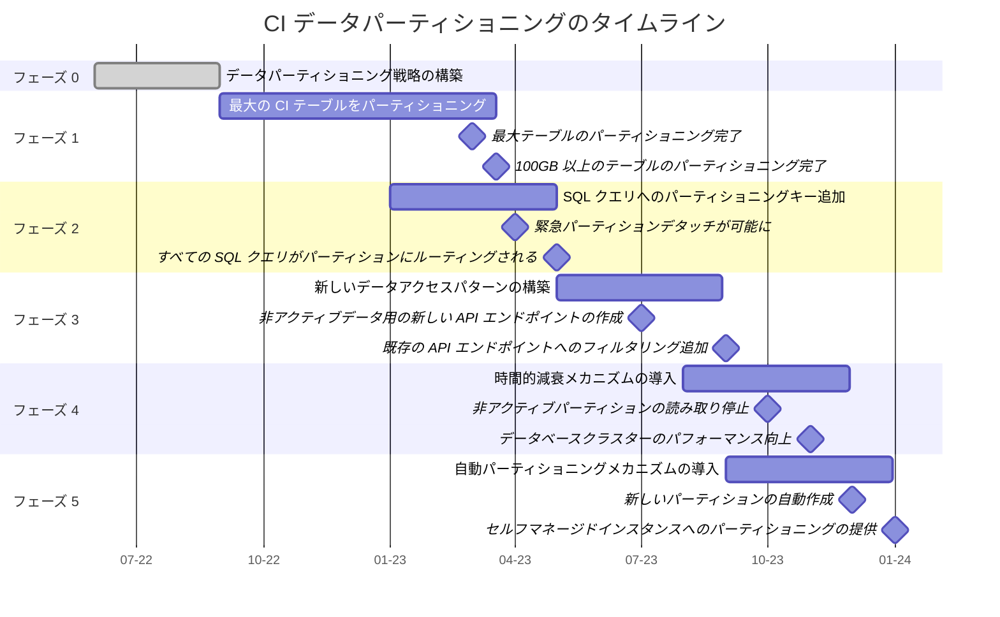

<div class="my-3 border-l-4 border-blue-500 bg-blue-50 px-4 py-3 rounded-r text-sm text-blue-800">
このページには今後予定されている製品・機能・機能性に関する情報が含まれています。ここに示す情報は参考目的のみです。購入・計画の決定にこの情報を使用しないでください。製品・機能・機能性の開発、リリース、タイミングは変更または延期される可能性があり、GitLab Inc. の独自の判断に委ねられています。
</div>

<div class="overflow-x-auto my-4">
<table class="w-full text-sm border-collapse">
<thead>
<tr class="bg-gray-100 text-left">
<th class="px-3 py-2 border border-gray-300">Status</th>
<th class="px-3 py-2 border border-gray-300">Authors</th>
<th class="px-3 py-2 border border-gray-300">Coach</th>
<th class="px-3 py-2 border border-gray-300">DRIs</th>
<th class="px-3 py-2 border border-gray-300">Owning Stage</th>
<th class="px-3 py-2 border border-gray-300">Created</th>
</tr>
</thead>
<tbody>
<tr>
<td class="px-3 py-2 border border-gray-300"><span class="inline-block rounded px-2 py-0.5 text-xs font-medium bg-gray-100 text-gray-700">ongoing</span></td>
<td class="px-3 py-2 border border-gray-300"><a href="https://gitlab.com/grzesiek" class="text-blue-600 hover:underline">@grzesiek</a></td>
<td class="px-3 py-2 border border-gray-300"><a href="https://gitlab.com/ayufan" class="text-blue-600 hover:underline">@ayufan</a>, <a href="https://gitlab.com/grzesiek" class="text-blue-600 hover:underline">@grzesiek</a></td>
<td class="px-3 py-2 border border-gray-300"><a href="https://gitlab.com/jreporter" class="text-blue-600 hover:underline">@jreporter</a>, <a href="https://gitlab.com/cheryl.li" class="text-blue-600 hover:underline">@cheryl.li</a></td>
<td class="px-3 py-2 border border-gray-300"><span class="inline-block rounded px-2 py-0.5 text-xs font-medium bg-gray-100 text-gray-700">~devops::verify</span></td>
<td class="px-3 py-2 border border-gray-300">2022-05-31</td>
</tr>
</tbody>
</table>
</div>


## コンテキスト

CI/CD メタデータを別のストアに移動したり、別の方法でメタデータの成長率を削減したりしても、パイプライン・ビルド・アーティファクトを説明する数十億行が存在するという問題は残ります。オブジェクトストレージに保存するかもしれないメタデータへの参照を保持する必要があり、この情報を大量に確実に取得（または検索）できる必要があります。

つまり、データをオブジェクトストレージに移動することで CI/CD テーブルの行数を減らせない可能性があります。オブジェクトストレージへのデータ移動はデータサイズの削減に役立ちますが、このデータを説明するエントリ数を減らすことにはなりません。この制限のため、データベースへの影響（インデックスサイズ、auto-vacuum の時間と頻度）を削減するために CI/CD データをパーティショニングすることが引き続き必要です。

エピック: [CI/CD パイプラインデータベーステーブルのパーティショニング](https://gitlab.com/groups/gitlab-org/-/epics/5417)。

## 解決しようとしている問題は何か？

私たちの意図は、このデータをプライマリデータベースから他の場所に移動することではありません。CI/CD データを格納する非常に大きなデータベーステーブルを、PostgreSQL のパーティショニング機能を使用して複数の小さなテーブルに分割したいと考えています。

CI/CD データセットをパーティショニングしたいのは、一部のデータベーステーブルが非常に大きく、CI/CD データベースの分解を実施した後でも、単一ノードでの読み取りのスケーリングが課題になる可能性があるためです。

PostgreSQL の宣言的パーティショニングを使用して最大のデータベーステーブルをいくつかの小さなものに変換することで、データベースのパフォーマンス低下のリスクを削減したいと考えています。


## CI/CD データの分解・パーティショニング・時間的減衰の関係は？

CI/CD の分解とは、CI/CD データベースクラスターを「メイン」データベースクラスターから抽出して、書き込みを受信する別のプライマリデータベースを持てるようにすることです。主なメリットは書き込みとデータストレージの容量が 2 倍になることです。新しいデータベースクラスターは CI/CD 以外のデータベーステーブルに対する読み取り/書き込みを処理する必要がなくなるため、読み取り容量も多少追加されます。

CI/CD パーティショニングとは、大きな CI/CD データベーステーブルを小さなものに分割することです。小さなテーブルからデータを読み取る方が、多テラバイトの大きなテーブルからのデータ読み取りよりもはるかにコストが低いため、すべての CI/CD データベースノードの読み取り容量が向上します。SQL クエリのデータ読み取り増加に対処するために CI/CD データベースレプリカを追加できますが、単一の読み取りをより効率的に実行するためにパーティショニングが必要です。PostgreSQL が単一の大きなデータベーステーブルを維持するよりも複数の小さなテーブルを維持するほうが効率的なため、他の側面でもパフォーマンスが向上します。

CI/CD の時間的減衰により、パイプラインデータの強い時間的減衰特性の恩恵を受けられます。さまざまな方法で実装できますが、パーティショニングを使用して時間的減衰を実装することは特に有益かもしれません。時間的減衰を実装する際は通常、データをアーカイブ済みとしてマークし、データが不要または必要なくなったときに別の場所に移行します。データセットが非常に大きい（数十テラバイト）ため、そのような大量のデータの移動は課題があります。パーティショニングを使用して時間的減衰を実装すると、データベーステーブルの 1 つのレコードを更新するだけでパーティション全体（またはパーティションセット）をアーカイブできます。これはデータベースレベルで時間的減衰パターンを実装する最もコストの低い方法のひとつです。


## CI/CD データをパーティショニングする必要があるのはなぜか？

パイプライン・ビルド・アーティファクトを格納するデータベーステーブルが大きすぎるため、CI/CD データをパーティショニングする必要があります。`ci_builds` データベーステーブルのサイズは現在約 2.5 TB で、インデックスは約 1.4 GB です。これは多すぎであり、[100 GB の最大サイズの原則](https://docs.gitlab.com/ee/architecture/blueprints/database_scaling/size-limits.html)に違反しています。また、この数値が超過された際に通知する[アラートを構築](https://gitlab.com/gitlab-com/gl-infra/tamland/-/issues/5)することも予定しています。

大きな SQL テーブルはインデックスのメンテナンス時間を増加させ、その間に新しく削除されたタプルを `autovacuum` でクリーンアップできなくなります。これが小さなテーブルの必要性を強調しています。巨大なテーブルの（再）インデックス時に蓄積するブロートの量を測定します。この分析に基づき、（再）インデックスに関連した SLO（デッドタプル/ブロート）を設定できるようになります。

過去数か月間で、いくつかの S1 および S2 データベース関連の本番環境インシデントが発生しています。例:

- S1: 2022-03-17 [`ci_builds` テーブルでの書き込み増加](https://gitlab.com/gitlab-com/gl-infra/production/-/issues/6625)
- S1: 2021-11-22 [`ci_job_artifacts` のレプリカでの過剰なバッファ読み取り](https://gitlab.com/gitlab-com/gl-infra/production/-/issues/5952)
- S2: 2022-04-12 [10 分以上実行中のトランザクションを検出](https://gitlab.com/gitlab-com/gl-infra/production/-/issues/6821)
- S2: 2022-04-06 [`ci_builds` の過剰な読み取りが原因と思われるデータベース競合](https://gitlab.com/gitlab-com/gl-infra/production/-/issues/6773)
- S2: 2022-03-18 [`ci_builds` の外部キー削除が不可能](https://gitlab.com/gitlab-com/gl-infra/production/-/issues/6642)
- S2: 2022-10-10 [`queuing_queries_duration` SLI apdex が SLO に違反](https://gitlab.com/gitlab-com/gl-infra/production/-/issues/7852#note_1130123525)

`ci_*` プレフィックスを持つデータベーステーブルが約 50 個あり、そのうちいくつかはパーティショニングによって恩恵を受けられます。

このデータを取得するためのシンプルな SQL クエリ:

```sql
WITH tables AS (SELECT table_name FROM information_schema.tables WHERE table_name LIKE 'ci_%')
  SELECT table_name,
    pg_size_pretty(pg_total_relation_size(quote_ident(table_name))) AS total_size,
    pg_size_pretty(pg_relation_size(quote_ident(table_name))) AS table_size,
    pg_size_pretty(pg_indexes_size(quote_ident(table_name))) AS index_size,
    pg_total_relation_size(quote_ident(table_name)) AS total_size_bytes
  FROM tables ORDER BY total_size_bytes DESC;
```

2022 年 3 月のデータ:

| テーブル名 | 合計サイズ | インデックスサイズ |
|-------------------------|------------|------------|
| `ci_builds`             | 3.5 TB     | 1 TB       |
| `ci_builds_metadata`    | 1.8 TB     | 150 GB     |
| `ci_job_artifacts`      | 600 GB     | 300 GB     |
| `ci_pipelines`          | 400 GB     | 300 GB     |
| `ci_stages`             | 200 GB     | 120 GB     |
| `ci_pipeline_variables` | 100 GB     | 20 GB      |
| （他に約 40 テーブル）  |            |            |

上記のテーブルから、大量のデータが格納されているテーブルが明確に存在していることがわかります。

CI/CD 関連のデータベーステーブルが約 50 個ある中で、当初は 6 つのパーティショニングのみに関心があります。最も重要なテーブルをイテレーティブにパーティショニングから開始できますが、必要に応じて残りのテーブルのパーティショニング戦略も持つべきです。この文書はこの戦略を捉え、できるだけ多くの詳細を説明し、エンジニアリングチーム間でこの知識を共有するための試みです。

## どのように CI/CD データをパーティショニングするか？

CI/CD テーブルをイテレーションでパーティショニングしたいと考えています。初期の 6 つのテーブルすべてを一度にパーティショニングするのは難しいかもしれないため、イテレーティブな戦略が必要になる場合があります。また、必要に応じて残りのデータベーステーブルをパーティショニングするための戦略も持ちたいと思っています。

大規模なデータマイグレーションを避けることも重要です。最大の CI/CD テーブルにはさまざまな列とインデックスに約 6 テラバイトのデータを格納しています。このデータ量の移行は課題があり、本番環境での不安定性を引き起こす可能性があります。この懸念から、ダウンタイムなしで既存のデータベーステーブルをパーティション 0 として付加する方法を開発しました。これは[最初の概念実証の一つ](https://gitlab.com/gitlab-org/gitlab/-/merge_requests/80186)で実証されました。これにより、排他ロックなしで既存の `ci_pipelines` テーブルをパーティション 0 として付加することで、ダウンタイムなしにパーティショニングされたスキーマ（ルーティングテーブル `p_ci_pipelines` を使用するなど）の作成が可能になります。レガシーテーブルを通常どおり使用できますが、必要に応じて次のパーティションを作成でき、クエリのルーティングには `p_ci_pipelines` テーブルが使用されます。ルーティングテーブルを使用するには、適切なパーティショニングキーを見つける必要があります。

論理的なパーティション ID を使用する計画です。`ci_pipelines` テーブルから始めて、デフォルト値 `100` または `1000` の `partition_id` 列を作成します。デフォルト値を使用することで、すべての行にこの値をバックフィルする課題を回避できます。最初のパーティションを付加する前に `CHECK` 制約を追加することで、PostgreSQL はこのテーブルをパーティショニングされたスキーマのパーティションとして付加する際に排他テーブルロックを保持しながら一貫性を確認する必要がないことを伝えます。`p_ci_pipelines` の新しいパーティションを作成するたびにこの値をインクリメントし、パーティショニング戦略は `LIST` パーティショニングになります。

イテレーティブにパーティショニングしたい他の初期 6 つのデータベーステーブルにも `partition_id` 列を作成します。新しいパイプラインが作成されると `partition_id` が割り当てられ、ビルドやアーティファクトなどの関連するすべてのリソースが同じ値を共有します。これらのデータをバックフィルする必要がなくなるため、パーティショニングを開始する時が来たときに既に `partition_id` 列があるようにすべての 6 つの問題のあるテーブルに `partition_id` 列を追加したいと考えています。

CI/CD データをイテレーティブにパーティショニングしたいと考えています。CI データベースで最も速く成長しているテーブルであり、この急激な成長を抑制したいため、`ci_builds_metadata` テーブルから始める計画です。このテーブルはアクセスパターンも最もシンプルで、ビルドがランナーに公開されるときに行が読み取られ、他のアクセスパターンも比較的シンプルです。`p_ci_builds_metadata` から始めることで、より早く有形かつ定量化可能な結果を達成でき、最大のテーブルのパーティショニングを可能にする新しいパターンになります。ビルドメタデータは `LIST` パーティショニング戦略を使用してパーティショニングします。

`p_ci_builds_metadata` に多くのパーティションが付加され、多くの `partition_ids` が使用されたら、次にパーティショニングする CI テーブルを選択します。その場合、`p_ci_builds_metadata` がすでに多くの物理パーティションを持ち、多くの論理的な `partition_ids` が使用されているため、次のテーブルには `RANGE` パーティショニングを使用することを検討するかもしれません。例えば、`p_ci_builds_metadata` のパーティショニング後に `ci_builds` を次のパーティショニング候補として選択した場合、`ci_builds.partition_id` に多くの異なる値が格納されています。その場合、`RANGE` パーティショニングの方が簡単かもしれません。

物理パーティショニングと論理パーティショニングは分離され、それぞれのデータベーステーブルの物理パーティショニングを実装する際に戦略を決定します。データベーステーブルで `RANGE` パーティショニングを使用することは `LIST` パーティショニングを使用するのと同様に機能しますが、`partition_id` 値の連続性を保証できるため、`RANGE` パーティショニングの方が良い戦略かもしれません。

### マルチプロジェクトパイプライン

親子パイプラインは常に同じパーティションに含まれます。なぜなら、子パイプラインは親パイプラインのリソースと見なされるからです。プロジェクトのパイプラインリストページで個別に表示することはできません。

一方、マルチプロジェクトパイプラインはパイプラインリストページに表示できます。また、`trigger` トークンや Job トークンを使用した API 経由で作成された場合、ダウンストリーム/アップストリームリンクとしてパイプライングラフからアクセスすることもできます。トリガートークンを使用して他のパイプラインから作成することもできますが、この場合はソースパイプラインを保存しません。

`ci_builds` をパーティショニングする際は、`ci_sources_pipelines` テーブルへの外部キーを更新する必要があります:

```plain
Foreign-key constraints:
    "fk_be5624bf37" FOREIGN KEY (source_job_id) REFERENCES ci_builds(id) ON DELETE CASCADE
    "fk_d4e29af7d7" FOREIGN KEY (source_pipeline_id) REFERENCES ci_pipelines(id) ON DELETE CASCADE
    "fk_e1bad85861" FOREIGN KEY (pipeline_id) REFERENCES ci_pipelines(id) ON DELETE CASCADE
```

`ci_sources_pipelines` レコードは 2 つの `ci_pipelines` 行（親と子）を参照しています。通常の戦略はテーブルに `partition_id` を追加することですが、ここで行うとすべてのマルチプロジェクトパイプラインを同じパーティションに強制することになります。

このテーブルには 2 つの `partition_id` 列、`partition_id` と `source_partition_id` を追加すべきです:

```plain
Foreign-key constraints:
    "fk_be5624bf37" FOREIGN KEY (source_job_id, source_partition_id) REFERENCES ci_builds(id, source_partition_id) ON DELETE CASCADE
    "fk_d4e29af7d7" FOREIGN KEY (source_pipeline_id, source_partition_id) REFERENCES ci_pipelines(id, source_partition_id) ON DELETE CASCADE
    "fk_e1bad85861" FOREIGN KEY (pipeline_id, partition_id) REFERENCES ci_pipelines(id, partition_id) ON DELETE CASCADE
```

この解決策は、両方向のドアに最も近い決定です。なぜなら:

- 異なるパーティションのパイプラインを参照する能力を保持します。
- 後でマルチプロジェクトパイプラインを同じパーティションに強制したい場合、両列が同じ値を持つことを検証する制約を追加できます。

## なぜ明示的な論理パーティション ID を使用したいのか？

論理的な `partition_id` を使用して CI/CD データをパーティショニングすることにはいくつかのメリットがあります。プライマリキーでパーティショニングすることもできますが、データがパーティションにどのように構造化・格納されているかを理解するために必要な複雑さと認知負荷がはるかに高くなります。

CI/CD データは階層的なデータです。ステージはパイプラインに属し、ビルドはステージに属し、アーティファクトはビルドに属します（まれな例外を除いて）。この階層を反映したパーティショニング戦略を設計することで、コントリビューターの複雑さと認知負荷を削減しています。パイプラインに関連付けられた明示的な `partition_id` があれば、パイプラインに関連するすべてのリソースを取得しようとするときに `partition_id` の番号をカスケードできます。`partition_id` が `102` のパイプライン `12345` については、他のルーティングテーブルの論理パーティション番号 `102` に関連するリソースを常に見つけられることがわかり、PostgreSQL はすべてのテーブルでこれらのレコードがどのパーティションに格納されているかを知ることができます。

パイプラインに関連付けられた単一かつ増分式の最新の `partition_id` 番号を使用することのもう一つの興味深いメリットは、理論上は Redis やメモリにキャッシュしてこの番号を見つけるためのデータベースへの過剰な読み取りを避けられる可能性があることですが、そうする必要がないかもしれません。

パイプラインデータの統一された `partition_id` 値は、プライマリキーベースのパーティショニングよりも後で多くの選択肢を与えてくれます。

## パーティショニングされたテーブルの ALTER

パーティショニングされたテーブルに対して `ALTER TABLE` ステートメントを実行することは、パーティショニング前のテーブルの動作と同様に引き続き可能です。PostgreSQL が親パーティショニングテーブルに対して `ALTER TABLE` ステートメントを実行すると、すべての子パーティションに対して同じロックを取得し、それらを同期させるために各パーティションを更新します。これはパーティショニングされていないテーブルへの `ALTER TABLE` の実行とは異なり、いくつかの重要な点があります:

- PostgreSQL はテーブルがパーティショニングされていない場合よりも多数のテーブルに対して `ACCESS EXCLUSIVE` ロックを取得しますが、データ量はより多くはありません。各パーティションは親テーブルと同様にロックされ、すべて単一のトランザクションで更新されます。
- ロック期間は関係するパーティションの数に基づいて増加します。GitLab データベースで実行されるすべての `ALTER TABLE` ステートメント（`VALIDATE CONSTRAINT` を除く）は、変更されるテーブルあたり小さく一定の時間を要します。PostgreSQL は各パーティションを順番に変更する必要があり、ロックのランタイムを増加させます。多くのパーティションが関係するまでは、この時間は非常に短いままです。
- `ALTER TABLE` に数千のパーティションが関係する場合、操作中に取得する必要があるすべてのロックをサポートするために `max_locks_per_transaction` の値が十分に高いことを確認する必要があります。

## 大きなパーティションをより小さなものに分割

初期の `partition_id` 番号として `100`（または計算や見積もりに応じて `1000` などの大きな値）から始めたいと考えています。既存のテーブルもすでに大きく、それらをより小さなパーティションに分割したい場合があるため、1 から始めたくはありません。`100` から始めることで、`partition_id` が `1`、`20`、`45` のパーティションを作成し、`partition_id` を `100` から小さい番号に更新することで既存のレコードを移動できます。

PostgreSQL は、すべてのパイプラインリソースについて同時にトランザクション内でこれを行う場合、これらのレコードをそれぞれのパーティションに一貫した方法で移動します。大きなパーティションをより小さいものに分割する必要がある場合（まだ必要かどうかは明確ではありません）、バックグラウンドマイグレーションを使用して `partition_id` を更新するだけで、PostgreSQL は自分でパーティション間でその行を移動するほどスマートです。

### 命名規則

パーティショニングされたテーブルは**ルーティング**テーブルと呼ばれ、クエリ分析のための自動ツール構築に役立てるために `p_` プレフィックスを使用します。

テーブルパーティションは**パーティション**と呼ばれ、例えば `ci_builds_101` のように物理的なパーティション ID をサフィックスとして使用できます。既存の CI テーブルは新しいルーティングテーブルの**ゼロパーティション**になります。特定のテーブルに選択した[パーティショニング戦略](#cicd-データをどのようにパーティショニングするか)によっては、1 つの物理パーティションあたり多くの論理パーティションを持つことが可能です。

### 最初のパーティションの付加とロックの取得

テーブルを[パーティショニング](https://gitlab.com/gitlab-org/gitlab/-/issues/378644)した際に、`PostgreSQL` はテーブルとそれが外部キーで参照する他のすべてのテーブルに対して `AccessExclusiveLock` を必要とすることを学びました。これにより、マイグレーションがアプリケーションのビジネスロジックとは異なる順序でロックを取得しようとした場合にデッドロックが発生する可能性があります。

この問題を解決するために、さらなるデッドロックエラーを回避するための**優先度ロック戦略**を導入しました。これにより、ロックの順序を定義し、ロックを取得するかリトライを使い果たすまで積極的にリトライを続けることができます。このプロセスは最大 40 分かかる場合があります。

この戦略を使用して、低トラフィック期間（[UTC 00:00 以降](https://dashboards.gitlab.net/d/web-main/web-overview?orgId=1&viewPanel=537181794&from=now-2d&to=now)）に 15 回のリトライ後に `ci_builds` テーブルのロックを正常に取得することができました。

この戦略の例については、[パーティションツール](https://docs.gitlab.com/ee/development/database/partitioning/list.html#step-6---create-parent-table-and-attach-existing-table-as-the-initial-partition)を参照してください。

### パーティショニングのステップ

データベースの[パーティションツール](https://docs.gitlab.com/ee/development/database/partitioning/list.html)のドキュメントにはテーブルをパーティショニングするためのステップのリストが含まれていますが、これらのステップだけでは私たちのイテレーティブな戦略には不十分です。データセットが増え続ける中で、すべてのテーブルがパーティショニングされるのを待たずに、パーティショニングのパフォーマンスをすぐに活用したいと考えています。例えば、`ci_builds_metadata` テーブルをパーティショニングした後、新しいパーティションにデータの書き込みと読み取りを開始したいと思います。つまり、デフォルト値の `100` から `101` に `partition_id` の値を増加させます。これにより、パイプライン階層のすべての新しいリソースが `partition_id = 101` で保持されます。次のパーティショニング対象テーブルに対してデータベースツールの指示に引き続き従えますが、追加のステップがいくつか必要です:

- ほとんどのレコードがその値を持つべきなので、デフォルト値 `100` で FK 参照に `partition_id` 列を追加します
- `partition_id` 値をカスケードするようにアプリケーションロジックを変更します
- 次のような post deploy/バックグラウンドマイグレーションで最近のレコードの `partition_id` 値を修正します:

  ```sql
  UPDATE ci_pipeline_metadata
         SET partition_id = ci_pipelines.partition_id
         FROM ci_pipelines
              WHERE ci_pipelines.id = ci_pipeline_metadata.pipeline_id
                AND ci_pipelines.partition_id in (101, 102);
  ```

- 外部キー定義を変更します
- ...

## データベースへのパーティションメタデータの格納

新しいパーティションを作成するための効率的なメカニズムを構築し、時間的減衰を実装するために、パーティショニングメタデータテーブル（`ci_partitions` と呼ぶ）を導入したいと考えています。そのテーブルには、パーティションごとに多くのパイプラインを含む、すべての論理パーティションに関するメタデータを格納します。論理パーティションごとのパイプライン ID の範囲を格納する必要があるかもしれません。これを使用して、特定のパイプライン ID の `partition_id` 番号を見つけられ、どの論理パーティションが「アクティブ」または「アーカイブ済み」かについての情報も得られ、データベースの宣言的パーティショニングを使用した時間的減衰パターンの実装に役立てられます。

これにより、パイプライン ID へのポインターを含むパーティショニングされたリソースの統一リソース識別子を使用できるようになり、リソースが格納されているパーティションを効率的に検索するために使用できます。URL、UI、または API でリソースを直接参照できる場合に重要になる可能性があります。パイプライン `123456`、ビルド `23456` に対して `1e240-5ba0` のような ID を使用できます。ダッシュ `-` を使用することで、識別子がマウスのダブルクリックでハイライト・コピーされることを防ぎます。この問題を回避したい場合は、16 進数表記に含まれない書き記された表現の任意の文字（例えばラテン文字の `g` から `z`、例えば `x`）を使用できます。その場合、URI の例は `1e240x5ba0` のようになります。パーティショニングされたリソースのプライマリ識別子を更新することを決定した場合（今日は単純な大きな整数）、パーティション間でデータを移行する際に識別子が変更されることを防ぐ、リバランシング時の識別子変更に耐性のあるシステムを設計することが重要です。

`ci_partitions` テーブルは、パーティション識別子・有効なパイプライン ID の範囲・パーティションがアーカイブされているかどうかについての情報を格納します。タイムスタンプを含む追加の列も役立つかもしれません。

## パーティショニングを使用した時間的減衰パターンの実装

`ci_partitions` を使用して、宣言的パーティショニングを使用した時間的減衰パターンを実装できます。どの論理パーティションがアーカイブされているかを PostgreSQL に伝えることで、以下のような SQL クエリを使用してこれらのパーティションからの読み取りを停止できます。

```sql
SELECT * FROM ci_builds WHERE partition_id IN (
  SELECT id FROM ci_partitions WHERE active = true
);
```

このクエリにより、読み取るパーティションの数を制限でき、CI/CD データのデータ保持ポリシーを使用して「アーカイブ済み」パイプラインデータへのアクセスを削減できます。理想的には一度に 2 つ以上のパーティションから読み取りたくないため、自動パーティショニングメカニズムを時間的減衰ポリシーと整合させる必要があります。API を通じてアーカイブされたデータへの新しいアクセスパターンを実装する必要がありますが、PostgreSQL クラスターでのアーカイブデータの格納コストはこの方法で大幅に削減されます。

ここには説明の範囲外の技術的な詳細がいくつかありますが、この戦略を使用することで、ブール値の列をトグルするだけでデータを「アーカイブ」し、PostgreSQL クラスターでの保持コストを大幅に削減できます。

## パーティショニングされたデータへのアクセス

GitLab のほとんどの場所で、パーティショニングされたデータがアーカイブされているかどうかにかかわらず、アクセスすることが可能です。マージリクエストページでは、マージリクエストが数年前に作成されたものであっても常にパイプラインの詳細を表示します。`ci_partitions` はパイプライン ID とその `partition_id` を関連付けるルックアップテーブルであり、パイプラインデータが格納されているパーティションを見つけられるため、これが可能です。

パイプライン・ビルド・アーティファクトなどの検索へのアクセスを制限する必要があります。すべてのパーティションを検索することは効率的でないため、アーカイブされたパイプラインデータを検索するより良い方法を見つける必要があります。UI と API でアーカイブされたデータにアクセスするための異なるアクセスパターンを持つ必要があります。

PostgreSQL でパーティショニングキー `partition_id` の使用を強制することにはいくつかの課題があります。これをサポートするためにアプリケーションを更新しやすくするために、[概念実証マージリクエスト](https://gitlab.com/gitlab-org/gitlab/-/merge_requests/80186)で新しいクエリアナライザーを設計しました。パーティショニングキーを使用していないクエリを見つけるのに役立ちます。

[別の概念実証マージリクエスト](https://gitlab.com/gitlab-org/gitlab/-/merge_requests/84071)と[関連する Issue](https://gitlab.com/gitlab-org/gitlab/-/issues/357090) で、統一された `partition_id` を使用することで既存の Rails アソシエーションに追加のスコープ修飾子を付加できることを実証し、SQL クエリにパーティショニングキーを提供できるようになりました。

インスタンス依存のアソシエーションを使用することで、関連するパイプラインリソースを取得するための SQL クエリにパーティショニングキーを簡単に追加できます。例えば:

```ruby
has_many :builds, -> (pipeline) { where(partition_id: pipeline.partition_id) }
```

この方法の問題点は、インスタンス依存のアソシエーションはプリロードと一緒に使えないため、プリロードが非常に難しくなることです:

```plaintext
ArgumentError: The association scope 'builds' is instance dependent (the
scope block takes an argument). Preloading instance dependent scopes is not
supported.
```

### クエリアナライザー

パーティショニングされたテーブルですべてが機能し続けるよう修正が必要なクエリを検出するために、2 つのクエリアナライザーを実装しました:

- ルーティングテーブルを経由していないクエリを検出するアナライザー。
- ルーティングテーブルを使用しているが、`WHERE` 句に `partition_id` を指定していないクエリを検出するアナライザー。

既存の壊れたクエリを検出するために、最初のアナライザーを `test` 環境で有効にすることから始めました。スケーラビリティの懸念から、`production` 環境でもトラフィックの小さなサブセット（`0.1%`）に対して有効になっています。

2 番目のアナライザーは将来のイテレーションで有効にします。

### プライマリキー

テーブルをパーティショニングするには、プライマリキーにパーティショニングキー列を含める必要があります。

まず `(id, partition_id)` を含む一意インデックスを作成します。
次に、プライマリキー制約を削除し、新しく作成したインデックスを使用して新しいプライマリキー制約を設定します。

`ActiveRecord` は[複合プライマリキーをサポートしていない](https://github.com/rails/rails/blob/6-1-stable/activerecord/lib/active_record/attribute_methods/primary_key.rb#L126)ため、`id` 列をプライマリキーとして扱うよう強制する必要があります:

```ruby
class Model < ApplicationRecord
  self.primary_key = 'id'
end
```

アプリケーション層はデータベース構造を認識しなくなり、`ActiveRecord` からの既存のクエリはすべて `id` 列を使用してデータにアクセスし続けます。同じ `id` 値だが異なる `partition_id` を持つ重複モデルを構築するアプリケーションコードが作成される可能性があるため、このアプローチにはいくらかのリスクがあります。このリスクを軽減するために、データベースシーケンスを使用して `id` を生成することを確認する必要があります。シーケンスは[別個の値を割り当てることが保証されており](https://www.postgresql.org/docs/12/sql-createsequence.html#id-1.9.3.81.7)、`partition_id` 値を含めるようにアクセスパターンを書き換え、挿入時に ID を手動で割り当てることを避ける必要があります。

### 外部キー

外部キーは、プライマリキーとなっているか一意制約を形成する列を参照する必要があります。これらの戦略を使用して定義できます:

#### 同じパーティション ID を共有するルーティングテーブル間

同じパイプライン階層の一部であるリレーションの場合、外部キー制約を定義するために `partition_id` 列を共有することができます:

```plaintext
p_ci_pipelines:
 - id
 - partition_id

p_ci_builds:
 - id
 - partition_id
 - pipeline_id
```

この場合、`p_ci_builds.partition_id` はビルドとパイプラインの両方のパーティションを示します。ルーティングテーブルに FK を追加するには:

```sql
ALTER TABLE ONLY p_ci_builds
    ADD CONSTRAINT fk_on_pipeline_and_partition
    FOREIGN KEY (pipeline_id, partition_id)
    REFERENCES p_ci_pipelines(id, partition_id) ON DELETE CASCADE;
```

#### 異なるパーティション ID を持つルーティングテーブル間

CI ドメインのすべてのリレーションに `partition_id` を再利用することは不可能であるため、この場合は別の属性として値を格納する必要があります。例えば、冗長なパイプラインをキャンセルする際に、古いパイプライン行にキャンセルした新しいパイプラインの ID を `auto_canceled_by_id` として格納します:

```plaintext
p_ci_pipelines:
 - id
 - partition_id
 - auto_canceled_by_id
 - auto_canceled_by_partition_id
```

この場合、キャンセルするパイプラインがキャンセルされるパイプラインと同じ階層に属するとは保証できないため、そのパーティションを格納するための追加属性 `auto_canceled_by_partition_id` が必要で、FK は次のようになります:

```sql
ALTER TABLE ONLY p_ci_pipelines
    ADD CONSTRAINT fk_cancel_redundant_pipelines
    FOREIGN KEY (auto_canceled_by_id, auto_canceled_by_partition_id)
    REFERENCES p_ci_pipelines(id, partition_id) ON DELETE SET NULL;
```

#### ルーティングテーブルと通常テーブル間

CI ドメインのすべてのテーブルがパーティショニングされるわけではないため、ルーティングテーブルがパーティショニングされていないテーブルを参照するケースがあります。例えば、`ci_pipelines` から `external_pull_requests` を参照する場合:

```sql
FOREIGN KEY (external_pull_request_id)
REFERENCES external_pull_requests(id)
ON DELETE SET NULL
```

この場合は、新しいパイプラインパーティションがそれを使用できるように、FK 定義をパーティションレベルからルーティングテーブルに移動するだけで済みます:

```sql
ALTER TABLE p_ci_pipelines
  ADD CONSTRAINT fk_external_request
  FOREIGN KEY (external_pull_request_id)
  REFERENCES external_pull_requests(id) ON DELETE SET NULL;
```

#### 通常テーブルとルーティングテーブル間

CI ドメインのほとんどのテーブルは、ルーティングテーブルに変換される少なくとも 1 つのテーブルを参照しています。例えば、`ci_pipeline_messages` は `ci_pipelines` を参照しています。これらの定義はルーティングテーブルを使用するように更新する必要があり、そのために `partition_id` 列が必要です:

```plaintext
p_ci_pipelines:
 - id
 - partition_id

ci_pipeline_messages:
 - id
 - pipeline_id
 - pipeline_partition_id
```

外部キーは次を使用して定義できます:

```sql
ALTER TABLE ci_pipeline_messages ADD CONSTRAINT fk_pipeline_partitioned
  FOREIGN KEY (pipeline_id, pipeline_partition_id)
  REFERENCES p_ci_pipelines(id, partition_id) ON DELETE CASCADE;
```

古い FK 定義を削除する必要があります。そうしなければ、非ゼロパーティションのパイプライン ID を持つ `ci_pipeline_messages` への新しい挿入は参照エラーで失敗します。

### インデックス

PostgreSQL はテーブルのすべてのパーティションにわたって単一インデックス（ユニークかどうかにかかわらず）を作成することを[許可していない](https://gitlab.com/gitlab-org/gitlab/-/issues/360148)ことを学びました。

この問題を解決する一つの方法は、一意性制約内にパーティショニングキーを埋め込むことです。

これはトークン自体の前にパーティション ID を 16 進数形式で付加し、連結された文字列をデータベースに格納することを意味するかもしれません。そのためには、将来持ちうるパーティションの最大数に対応するためにトークンの先頭バイトに適切な数を予約する必要があります。4 文字を予約することで、16 進数で 16 ビット数に変換できるものとなり、十分かもしれません。この方法でエンコードできる最大数は FFFF となり、10 進数で 65535 です。

これによりパーティションごとの一意制約が提供され、グローバルな一意性には十分です。

また、ゼロパーティションの直接使用（ルーティングテーブルへの最初のパーティションとして付加されたレガシーテーブル）を検出するクエリアナライザーも設計し、すべてのクエリが `p_ci_pipelines` のようなパーティショニングされたスキーマまたはパーティショニングされたルーティングテーブルを対象としていることを確認できるようにしました。

## プロジェクト ID や名前空間 ID を使用してパーティショニングしないのはなぜか？

シャーディングとポッディングは異なるレイヤーで解決すべき別の問題であるため、`project_id` や `namespace_id` を使用してパーティショニングしたくありません。これは頻繁にアクセスされないデータが蓄積されるにつれてパフォーマンスが低下するという元の問題文を解決しません。将来的にポッドを導入する可能性があり、それがグループやプロジェクトに関連するデータを分離するためのプライマリメカニズムになるかもしれません。

理論上は `project_id` か `namespace_id` を 2 番目のパーティショニングディメンションとして使用することもできますが、すでに非常に複雑な問題にさらなる複雑さが加わります。

## ビルドキューイングテーブルのパーティショニング

ビルドキューイングテーブルもパーティショニングしたいと考えています。現在 `ci_pending_builds` と `ci_running_builds` の 2 つがあります。これらのテーブルは他の CI/CD データテーブルとは異なり、格納されたすべてのデータが 24 時間後に無効になるビジネスルールが製品にあります。

そのため、それらのデータベーステーブルをパーティショニングするために別の戦略を使用する必要があります。これらのパーティションが 24 時間以上経過したら完全に削除し、ルーティングテーブルを通じて常に 2 つのパーティションから読み取ります。これらのテーブルをパーティショニングする戦略は理解されていますが、これらのパーティションの作成と削除を管理するための堅固な Ruby ベースの自動化が必要です。そのために、[既存のデータベースパーティショニングツール](https://docs.gitlab.com/ee/development/database/partitioning/index.html)を CI/CD データパーティショニングをサポートするよう適応させるためにデータベースチームと協力します。

## リスクを削減するためのイテレーション

この戦略は CI/CD パーティショニングの実装リスクを許容レベルに削減するはずです。問題が発生した場合の本番環境でのゼロパーティションのデタッチを可能にするために、最初は 2 つのパーティションのみから読み取るパーティショニングの実装に集中しています。以下で説明する各イテレーションフェーズにはリバート戦略があり、データベースの変更をリリースする前にベンチマーク環境でテストしたいと考えています。

この取り組みでリスクを削減するための主な方法は、イテレーションと物事を元に戻せるようにすることです。このドキュメントで説明している変更を安全かつ確実な方法でリリースすることが私たちの優先事項です。

実装を進めるにあたり、設計を反復させ、増分ロールアウトをサポートし、何かがうまくいかない場合に変更を元に戻すためのより良い制御を実現するさらなる方法を見つける必要があります。データベーススキーマの変更をイテレーティブにリリースすることは難しく、本番環境への増分ロールアウトをサポートすることはさらに困難です。ただし、それは可能です。追加の創造性が必要なことがあり、ここでも確かに必要になるでしょう。これがどのようになるかの例:

### パーティショニングされたスキーマの増分ロールアウト

最初のパーティショニングされたルーティングテーブル（おそらく `p_ci_pipelines`）を導入してゼロパーティション（`ci_pipelines`）を付加したら、具体的なパーティション 0 の代わりに新しいルーティングテーブルとのインタラクションを開始する必要があります。通常は、`Ci::Pipeline` Rails モデルが使用するデータベーステーブルを `self.table_name = 'p_ci_pipelines'` のようなもので上書きします。残念ながら、このアプローチは増分ロールアウトをサポートしていない可能性があります。`self.table_name` はアプリケーション起動時に読み込まれ、その後アプリケーションを再起動せずにこの変更を元に戻すことができない場合があります。

これを解決する一つの方法は、`Ci::Pipeline` から継承する `Ci::Partitioned::Pipeline` モデルを導入することです。そのモデルでは `self.table_name` を `p_ci_pipeline` に設定し、`Ci::Pipeline.partitioned` からそのメタクラスをスコープとして返します。これにより、フィーチャーフラグを使用して `ci_pipelines` から `p_ci_pipelines` への読み取りのルーティングをシンプルなリバート戦略で行えるようになります。

### パーティショニングされた読み取りの増分実験

別の例は、別のパーティションを付加することを決定したときに関連します。フェーズ 1 の目標は、パーティショニングされたスキーマ/ルーティングテーブルごとに 2 つのパーティションを持つことです。つまり、`p_ci_pipelines` については `ci_pipelines` をパーティション 0 として付加し、新しいデータのための新しい `ci_pipelines_p1` パーティションを作成します。`p_ci_pipelines` からのすべての読み取りは `p1` パーティションのデータも読む必要があり、1 つ以上のパーティションからの読み取りを目標としてイテレーティブに実験し、パーティショニングのパフォーマンスとオーバーヘッドを評価すべきです。

_古い_データを `ci_pipelines_m1`（マイナス 1）パーティションにイテレーティブに移動することで行うことができます。おそらく `partition_id = 1` を作成して、本当に古いパイプラインをそこに移動します。次に、新しい `p1` パーティションを作成する前に影響・パフォーマンスを測定して信頼を高めるために、データを `m1` パーティションにイテレーティブに移行できます。

## イテレーション

まずフェーズ 1 のイテレーションに集中したいと考えています。このイテレーションの目標と主要な目的は、最大の 6 つの CI/CD データベーステーブルを 6 つのルーティングテーブル（パーティショニングされたスキーマ）と 12 のパーティションにパーティショニングすることです。これにより Rails SQL クエリはほとんど変更されませんが、データベースのパフォーマンス低下がある場合に「ゼロパーティション」の緊急デタッチを実行できるようになります。これによりユーザーは古いデータにアクセスできなくなりますが、アプリケーション全体のダウンタイムよりは良い代替手段です。

1. **フェーズ 0**: CI/CD データのパーティショニング戦略を構築: 完了。✅
1. **フェーズ 1**: 最大の 6 つの CI/CD データベーステーブルをパーティショニング。
   1. すべての 6 つのデータベーステーブルのパーティショニングされたスキーマを作成する。
   1. `partition_id` をすべてのパーティショニングされたリソースにカスケードする方法を設計する。
   1. ルーティングテーブルを対象としているかどうかを検証する初期クエリアナライザーを実装する。
   1. ゼロパーティションをパーティショニングされたデータベーステーブルに付加する。
   1. ルーティングテーブルとパーティショニングされたテーブルを対象とするようにアプリケーションを更新する。
   1. このソリューションのパフォーマンスと効率性を測定する。

   **リバート戦略**: ルーティングテーブルの代わりに具体的なパーティションの使用に切り替える。

1. **フェーズ 2**: パーティショニングされたテーブルを対象とする SQL クエリへのパーティショニングキーを追加する。
   1. パーティショニングされたテーブルを対象とするクエリが適切なパーティショニングキーを使用しているかどうかを確認するクエリアナライザーを実装する。
   1. 既存のクエリをすべてパーティショニングキーをフィルターとして使用するよう変更する。

   **リバート戦略**: フィーチャーフラグを使用し、クエリごとに適用する。

1. **フェーズ 3**: 新しいパーティショニングされたデータアクセスパターンを構築する。
   1. 時間的減衰データ保持ポリシーに基づいて除外されるパーティションに格納されたデータへのアクセスを許可するための新しい API を構築するか、既存の API を拡張する。

   **リバート戦略**: フィーチャーフラグ。

1. **フェーズ 4**: パーティショニングの上に構築された時間的減衰メカニズムを導入する。
   1. 時間的減衰ポリシーメカニズムを構築する。
   1. GitLab.com で時間的減衰戦略を有効にする。
1. **フェーズ 5**: パーティションを自動的に作成するためのメカニズムを導入する。
   1. 自動的にパーティションを作成できるようにする。
   1. セルフマネージドインスタンスに新しいアーキテクチャを提供する。

以下の図はこの計画をガントチャートで視覚化しています。以下のチャートの日付は計画をより良く視覚化するための見積もりに過ぎず、締め切りではなく、いつでも変更される可能性があります。



## 結論

CI/CD データのパーティショニングのための堅固な戦略を構築したいと考えています。マルチテラバイトの PostgreSQL インスタンスのデータベーススキーマ管理において行われたミスは、潜在的なダウンタイムなしには簡単に元に戻せない可能性があることを認識しています。そのため、パーティショニング戦略を研究・改善するためにかなりの時間を費やしています。この文書で説明している戦略もイテレーションの対象となっています。リスクを削減し、計画を改善するより良い方法を見つけたときは常に、この文書も更新すべきです。

大規模なデータマイグレーションを避ける方法を見つけ、CI/CD データのパーティショニングのためのイテレーティブな戦略を構築しています。ここに戦略を文書化して、他のチームメンバーと知識を共有し、フィードバックを求めています。

## 担当者

DRI:

<!-- vale gitlab.Spelling = NO -->

| 役割 | 担当者 |
|---------------------|------------------------------------------------|
| 著者 | Grzegorz Bizon、プリンシパルエンジニア |
| 推薦者 | Kamil Trzciński、シニアディスティングイッシュドエンジニア |
| プロダクトリーダーシップ | Jackie Porter、プロダクトマネジメントディレクター |
| エンジニアリングリーダーシップ | Caroline Simpson、エンジニアリングマネージャー / Cheryl Li、シニアエンジニアリングマネージャー |
| リードエンジニア | Marius Bobin、シニアバックエンドエンジニア |
| シニアエンジニア | Maxime Orefice、シニアバックエンドエンジニア |
| シニアエンジニア | Tianwen Chen、シニアバックエンドエンジニア |

<!-- vale gitlab.Spelling = YES -->
