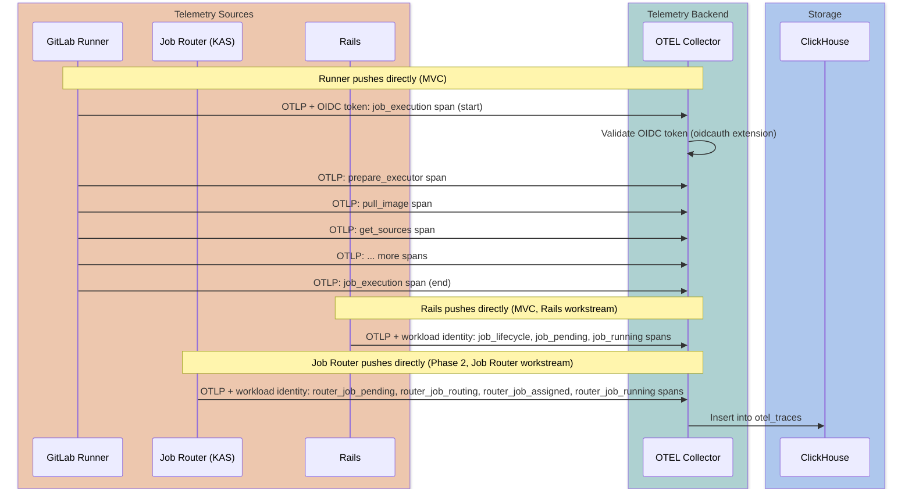
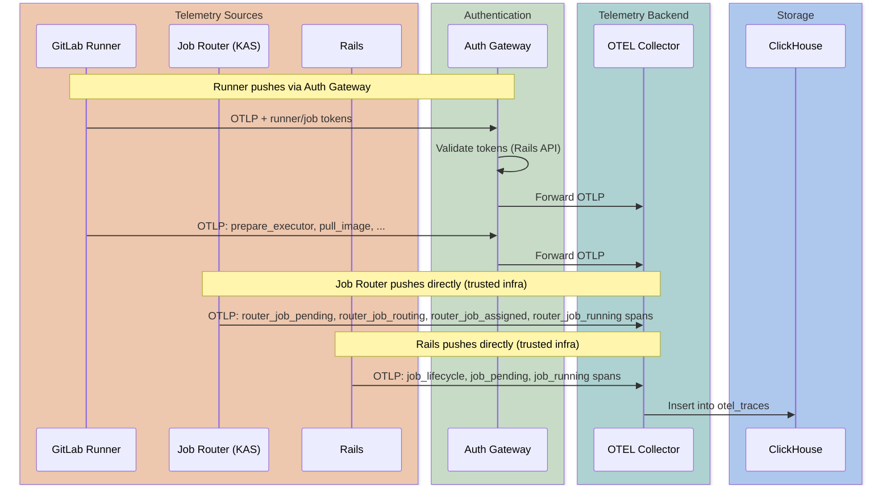



## サマリー

この設計ドキュメントは、**サービスに依存しない GitLab 向けの OTLP テレメトリバックエンド** を提案し、その **最初のプロダクト機能として CI Job テレメトリ** を提供します。
CI Job テレメトリは、DevOps エンジニアに、OpenTelemetry (OTLP) 標準を使用して、CI Functions (ステップ)、リソース使用量、エラー診断などの CI ジョブ実行パフォーマンスへの可視性を提供します。

MVC は Grafana ダッシュボードを通じて内部チーム (DevExp を Customer 0 として) に提供しますが、長期的な目標は、GitLab.com、Self-Managed、Dedicated 上のすべての GitLab 顧客が利用できる **プロダクト機能** です。ユーザーはパイプライン動作を分析し、最適化の機会を特定し、AI を活用してパイプラインを改善できるようになります。
MVC のショートカット (たとえば、OIDC 認証、Grafana のみの可視化) は、長期的なプロダクトパスと互換性があるため、具体的に選択されています。

テレメトリバックエンドは、**サービスに依存しない OTLP traces ストア** 上に構築されています:
トレースは、[OTEL Collector ClickHouse exporter](https://github.com/open-telemetry/opentelemetry-collector-contrib/tree/main/exporter/clickhouseexporter) によって自動作成される汎用 [`otel_traces`](#clickhouse-schema) テーブルに格納されます。
一方、ドメイン固有の [Materialized Views](#clickhouse-schema) は、`ServiceName` でフィルタリングされた特定の用途のテーブルにデータをルーティングします。
このアーキテクチャにより、任意の GitLab コンポーネントが標準の OTLP トレースを送信でき、同じ取り込みパイプライン、ストレージ、クエリインフラの恩恵を受けることができます。

### CI Job テレメトリ — 最初の消費者

大規模で複雑な CI/CD パイプラインを運用する際、チームには Docker イメージプル時間、Git 操作時間、キャッシュヒット/ミス率、アーティファクトアップロード/ダウンロード時間などのシステムレベルメトリクスへの可視性が必要です。
現在堅牢なソリューションは存在しません — 既存のアドホックな計装はジョブから実行され、メンテナンスが脆く、`after_script` ブロック後に発生する操作をキャプチャできません。

複数のソースが同じ CI ジョブのスパンに貢献します:

1. **Rails**: ジョブライフサイクルスパン (`job_lifecycle`、`job_pending`、`job_running`)
1. **Job Router**: スケジューリングおよびルーティングメトリクス (pending→accepted、admission control)
1. **Runner**: 実行レベルメトリクス (CI Functions、リソース操作)

各コンポーネントは、OIDC/ワークロード ID (MVC) またはトークンベースのゲートウェイ (長期) を介して認証され、標準の OTEL エクスポーターを使用してテレメトリをバックエンドに直接プッシュします。
Job Router 統合の詳細については、[Job Router テレメトリ](#workstream-job-router-telemetry) を参照してください。
CI Functions は、ジョブ内のすべての時間計測された操作の統一された抽象化であり、以下を含みます:

- 従来のジョブセクション (`prepare`、`script`、`after_script`)
- 組み込み操作 (image pull、cache restore、artifact upload)
- プラットフォームが新しい宣言型モデルを採用するにつれて、[CI Functions](https://docs.gitlab.com/ci/steps/)

このテレメトリシステムは、任意の CI Function タイプのタイミングとメタデータをキャプチャし、ジョブがどのように定義されているかに関係なく、包括的な CI/CD 可観測性の基盤を提供します。

## 主要な依存関係

このセクションでは、CI Job テレメトリに必要なコンポーネントとその現在のステータスを要約します。

### コンポーネントの利用可能性

| コンポーネント | オーナー | ステータス | タイムライン | 注 |
|-----------|-------|--------|----------|-------|
| OTEL Collector | Observability | 本番準備完了 | 利用可能 | [ClickHouse エクスポーター](https://github.com/open-telemetry/opentelemetry-collector-contrib/tree/main/exporter/clickhouseexporter) を持つ標準 OTEL Collector — `otel_traces` に書き込む。大規模ではトレース ID ベースのルーティングのために [loadbalancing exporter](https://github.com/open-telemetry/opentelemetry-collector-contrib/tree/main/exporter/loadbalancingexporter) を使用。単一のデプロイがすべてのテレメトリを処理。別個のエクスポーターパイプラインが異なる CH インスタンスに書き込む ([design decision](#design-decisions) を参照)。 |
| ClickHouse インスタンス (Observability) | Observability | 有効 | [Phase 1](#phase-1-mvc-gitlabcom-hosted-runners) | 運用ダッシュボードとクロスサービストレース相関のための内部専用 ClickHouse インスタンス ([MR](https://gitlab.com/gitlab-com/gl-infra/observability/clickhouse-cloud/-/merge_requests/102)、2026-02-12 にマージ)。エンドユーザーに公開されない。 |
| 機能ネゴシエーション + トレースコンテキスト | CI Platform | 未開始 | [Phase 1](#phase-1-mvc-gitlabcom-hosted-runners): ~1 週間 | Rails ジョブペイロードの変更: `features.tracing` ([&20945](https://gitlab.com/groups/gitlab-org/-/epics/20945)) |
| Runner 計装 | Runner Core | [進行中](https://gitlab.com/groups/gitlab-org/-/epics/20633) | [Phase 1](#phase-1-mvc-gitlabcom-hosted-runners): ~3 週間 (基本計装: ~1w、CI Functions スパン: ~2w) | テレメトリスパンを収集し、OIDC 認証で OTEL Collector にプッシュ。機能ネゴシエーション + トレースコンテキストにブロックされる。 |
| CI テレメトリ Materialized View | CI Platform | 未開始 | [Phase 3](#phase-3-insights-layer) | 自動作成された `otel_traces` テーブル上の `ci_job_telemetry_traces` MV ([schema](#clickhouse-schema))。クエリパターンが確立されるまで延期。 |
| Rails ライフサイクルスパン | CI Platform / Pipeline Execution | 未開始 | [Phase 1](#phase-1-mvc-gitlabcom-hosted-runners) | Rails ステートマシンからの `job_lifecycle`、`job_pending`、`job_running` スパン ([Rails integration](#workstream-rails-integration))。Runner からは見えない Sidekiq/`PipelineProcessWorker` 遅延を含むエンドツーエンドの可視性のために MVC に取り込まれる。 |
| Job Router テレメトリ | Runner Core | 未開始 | [Phase 2](#phase-2-complete-telemetry-pipeline) | KAS Job Router からのスケジューリングスパン (`router_job_pending` から `router_job_running`) ([Job Router telemetry](#workstream-job-router-telemetry)) |
| 認証ゲートウェイ | TBD | 未開始 | [Phase 2](#phase-2-complete-telemetry-pipeline) (Beyond GitLab.com ワークストリーム) | すべての runner の長期標準認証。MVC の OIDC ショートカットを置き換える |

### MVC タイムラインの制約

- **ターゲット**: GitLab 内部 runner が `gitlab-org` プロジェクトのみをビルドする (Customer 0 ユースケース)。
  検証後、すべての GitLab.com Hosted Runner に拡張 (同じ信頼モデルとネットワークアクセス、より高いボリューム)。
- **推定労力**: エンドツーエンドで ~4-5 週間 (クリティカルパス)、一部並列処理が可能
  - CI Platform: `features.tracing` ペイロード (~1 週間) → Runner のブロック解除
  - Runner 基本計装: `features.tracing` 消費 + 最初の `job_execution` スパン + 組み込みステージスパン (~1 週間、開始済み) → CI Platform ペイロードの変更に依存
  - Runner CI Functions スパン: (~2 週間、控えめ) → 基本計装後
- **ブロックの依存関係**:
  - ~~CI テレメトリ用 ClickHouse インスタンスの有効化~~ (完了 — [MR](https://gitlab.com/gitlab-com/gl-infra/observability/clickhouse-cloud/-/merge_requests/102) が 2026-02-12 にマージ)
  - OTEL Collector のデプロイ (標準コンポーネント、Observability が管理。すべてのテレメトリソース用の単一の既知のエンドポイント)

詳細な内訳については [Cross-Team Dependencies](#cross-team-dependencies) を参照してください。MVC 後のロードマップ (Job Router テレメトリ、顧客所有の runner、Self-Managed/Dedicated) については、[Phase 2](#phase-2-complete-telemetry-pipeline) と [Phase 3](#phase-3-insights-layer) を参照してください。

## 動機

大規模で複雑な CI/CD パイプラインを運用する際、チームには **エンドツーエンドの CI ジョブ実行パフォーマンス** への包括的な可視性が必要です — パイプラインとジョブの実行時間だけでなく、ジョブが通過する各ステージの詳細な内訳が必要です:

- **スケジューリングとルーティング**: キュー時間、ルーティング決定、runner 割り当て遅延
- **環境準備**: Docker イメージプル時間、エグゼキュータセットアップ時間
- **ソースコード操作**: クローン/フェッチ時間、操作タイプ、使用パラメータ
- **キャッシュ**: ヒット/ミス率、キャッシュキーごとのダウンロード/アップロード時間
- **アーティファクト**: アップロード/ダウンロード時間とサイズ
- **スクリプト実行**: ユーザー定義のスクリプト実行 (`script`、`before_script`、`after_script` ブロック)
- **CI Functions**: ジョブが宣言型モデルに移行する個別の機能

この可視性は、**エグゼキュータタイプやジョブが steps/CI Functions モデルを使用するかに関係なく** 価値があります。すべての CI ジョブはすでに準備、git、cache、artifact、script ステージを通過します — Runner はすでにこれらを [ビルドセクション](https://docs.gitlab.com/runner/development/#log-a-build-section) として追跡しています。
CI Functions モデルはより細かい粒度を追加しますが、基礎的なテレメトリはすべてのジョブに適用されます。

これらのメトリクスは、別個のジョブログに手動でダイブすることなく、問題を早期に特定し、影響を評価するのに役立ちます。

### 顧客の声

1. 「特定のジョブを分析するには、パイプラインに加えてジョブのより詳細な情報が必要です。次のパラメータがここで役立ちます: 期間 (ボトルネックを特定するためにログのセクションに分割される、カスタム折りたたみセクションを使用して、分析するためにジョブを別個のステップに分割することが可能)」 - [Epic #11835](https://gitlab.com/groups/gitlab-org/-/epics/11835#note_1631621923)

1. ユーザーは、ジョブログを通じてアプリケーション層で何が起こっているかしか見ることができません。
   根本原因を特定するには、ユーザーは GitLab のジョブレベルのデータを、同じ瞬間における runner とインフラレベルの情報と相関させる必要があります。

### 目標

- **プロダクト目標**: DevOps エンジニアが、GitLab.com、Self-Managed、Dedicated 上で、CI/CD パイプラインのパフォーマンスを分析し、ボトルネックを特定し、AI を活用してパイプラインを最適化できるようにする
- **MVC 目標**: DevExp チーム (Customer 0 として) に、すべての顧客に公開する前にテレメトリパイプラインを検証するための Grafana ダッシュボードを構築するためのデータを提供する
- 任意の GitLab コンポーネントがトレースを送信できる、サービスに依存しない OTLP テレメトリバックエンドを提供する
- GitLab Runner が、ジョブ中に実行された各ステージと CI Function の構造化テレメトリデータを報告できるようにする
- すべてのエグゼキュータタイプ、現在のジョブステージ、CI Functions モデルをサポートする柔軟なスキーマを設計する
- 効率的なクエリとトレンド分析のために、ClickHouse にテレメトリを格納する
- メトリクスがベースラインから逸脱したり、劣化トレンドを示したりした場合 (たとえば、キャッシュヒット率の低下、アーティファクトアップロード時間の増加) の自動アラートを有効にする
- ユーザーと AI エージェントが最適化の機会を特定できるようにする:
  - パイプラインのボトルネックとホットスポット
  - 並列化の機会
  - ジョブ待ち時間の削減
  - キャッシュヒット率の改善
  - ジョブ実行コストの削減 (CI 分、クラウドコスト)
  - 全体的なパイプライン期間の削減

### 非目標

- **ユーザーレベルのテレメトリ**: 任意のユーザースクリプトからのカスタムメトリクス (テストカバレッジ、カスタムタイミング) はスコープ外で、既存の [`metrics_reports` 機能](https://docs.gitlab.com/ci/testing/metrics_reports/) によって部分的に対処されています。
  これは、step-runner が提供する構造化 API を使用する CI Function テレメトリとは別個です。
- **MVC でのプロダクト内可視化**: MVC はデータ収集と Grafana ダッシュボードに焦点を当てます。
  GitLab でのプロダクト内 UI 可視化は [Phase 3](#phase-3-insights-layer) で計画されています

## 主要な定義

このドキュメントを通じて以下の用語が使用されています。実装の詳細 (どの ID がどの OTEL 概念にマップされるかなど) はここで一度定義され、将来の変更に対してドキュメントの残りの部分を回復力のあるものにします。

| 用語 | 定義 |
|------|-----------|
| **OTLP** | [OpenTelemetry Protocol](https://opentelemetry.io/docs/specs/otel/protocol/); すべてのコンポーネント (Runner、Rails、Job Router) が HTTP または gRPC 経由で OTEL Collector にスパンをエクスポートするために使用する有線形式。 |
| **Span** | トレース内の単一の時間計測された操作。一意の **Span ID** (ランダムに生成された 64 ビット値) によって識別されます。子スパンは `parent_span_id` を介して親を参照し、ツリーを形成します。 |
| **CI Function** | CI ジョブ内の個別の時間計測された操作 — 組み込みステージ (`pull_image`、`restore_cache`、`upload_artifacts`、`step_script`)、および将来の宣言型 [steps](https://docs.gitlab.com/ci/steps/)。各 CI Function は、ジョブの親スパンの下のスパンとして表されます。 |
| **Pipeline trace** | CI パイプライン階層の実行を表す、同じ Trace ID を共有するすべてのスパン。明示的なパイプラインルートスパンは存在しません — ジョブは共有 Trace ID によってグループ化されたトップレベルのスパンです。OTEL「trace」リソースと混同しないでください — これは単に同じ Trace ID を共有するスパンのコレクションです。 |
| **Trace ID** | パイプライン階層のすべてのスパンをグループ化する 128 ビット識別子。**root** パイプライン ID から決定論的に派生されます ([trace context initialization](#multi-source-trace-coordination) を参照)。親および子パイプライン全体のすべてのジョブがこの値を共有します。 |
| **Job span** | 単一のジョブの実行ライフサイクルを表すスパン。root パイプラインでは、ジョブスパンはルートレベルのスパン (親なし) です。子パイプラインでは、ジョブスパンはトリガー (bridge) ジョブのスパンの子です。Rails の `job_lifecycle` スパンはジョブスパンとして機能し、その下に Runner の `job_execution` スパンがネストされます。 |
| **Parent span ID** | Runner にジョブペイロード (`span_parent_id`) で渡されるスパン ID で、それが `job_execution` スパンを正しい Rails スパンの下に親付けできるようにします。`job_running` スパンの ID を含みます (ジョブ ID から決定論的に派生)。子パイプラインジョブの場合、`job_lifecycle` スパン自体はトリガー (bridge) ジョブのスパンの子です。 |
| **`features.tracing`** | `/api/v4/jobs/request` レスポンスの統一されたオブジェクトで、機能ネゴシエーション、トレースコンテキスト、エンドポイント設定を組み合わせます。その存在は、テレメトリが有効であることを示します。常に `trace_id` (パイプライン)、`span_parent_id` (このジョブの Rails `job_running` スパン ID)、`otel_endpoints` (URL とオプションの認証設定を持つエンドポイントオブジェクトの配列; MVC では単一エントリ、潜在的な 2 つ目のエントリについては [future work](#future-work-byo-otlp-endpoints) を参照) を含みます。[ジョブペイロードの変更](#job-payload-changes) を参照してください。 |
| **`ServiceName`** | テレメトリを送信するコンポーネントを識別する OTEL [service name](https://opentelemetry.io/docs/specs/semconv/resource/#service) リソース属性 (たとえば、`gitlab-ci-runner`、`gitlab-ci-job-router`、`gitlab-ci-rails`)。スパンをドメイン固有の Materialized View にフィルタリングおよびルーティングするために使用されます。 |
| **Resource attributes** | テレメトリを生成するエンティティを記述する OTLP リソースレベルのキーと値のペア (たとえば、`ci.pipeline.id`、`ci.job.id`、`ci.project.id`、`ci.pipeline.source`)。`otel_traces.ResourceAttributes` に格納されます。TracerProvider インスタンスごと (この設計ではジョブごと) に安定。 |
| **Span attributes** | 特定の操作を記述する OTLP スパンレベルのキーと値のペア (たとえば、キャッシュキー、アーティファクト名、転送バイト)。`otel_traces.SpanAttributes` に格納され、`ci_job_telemetry_traces` の型付きカラムに非正規化されます。 |
| **`traversal_path`** | 挿入時に ClickHouse の辞書ルックアップを介して計算される非正規化された名前空間階層キー (たとえば、`0/…/group_id/project_id/`)。組織/グループ/プロジェクトレベルの集約クエリを効率的にします。 |
| **OTEL Collector** | スパンを受け取り、処理し、ClickHouse にエクスポートする [OpenTelemetry Collector](https://opentelemetry.io/docs/collector/) インスタンス。単一のデプロイがすべてのテレメトリソースを処理し、ClickHouse インスタンスごとに別個のエクスポーターパイプラインがあります ([design decision](#design-decisions) を参照)。Observability チームによって管理されます。 |
| **`otel_traces`** | OTEL Collector が生のスパンを書き込むサービスに依存しない ClickHouse テーブル。標準の OTEL スキーマに従い、すべての計装されたサービス間で共有されます。 |
| **`ci_job_telemetry_traces`** | ([Phase 3](#phase-3-insights-layer)) `otel_traces` から CI 固有の列をクエリ最適化されたスキーマに投影する ClickHouse [Materialized View](https://clickhouse.com/docs/en/sql-reference/statements/create/view#materialized-view)。`otel_traces` への挿入時にトリガーされ、`ServiceName` でフィルタリングされます。これは、[クエリレイヤー](https://gitlab.com/gitlab-org/gitlab/-/issues/590589) によってクエリされる主要なテーブルです。 |
| **Job Router** | CI ジョブのスケジューリングと runner 割り当てを担当する [KAS](https://docs.gitlab.com/ee/administration/clusters/kas/) モジュール。[Phase 2](#phase-2-complete-telemetry-pipeline) でルーティングスパン (`router_job_pending` から `router_job_running`) を送信します。 |
| **Capability fingerprint** | ジョブと runner の互換性を決定するすべての要因を一意に識別する安定したハッシュ: タグ、runner タイプ (instance/group/project)、保護ステータス、プロジェクトアクセス。同じフィンガープリントを共有する runner は同じジョブセットを処理できます。[Runner Job Router architecture](/handbook/engineering/architecture/design-documents/runner_job_router/) で定義されています。MVC ではスパン属性として含まれ (Rails ワークストリーム)、「どの capability グループが遅いキャッシュ復元を持つか?」 や capability グループごとの SLO などのテレメトリクエリを可能にします。 |

## 提案

**OpenTelemetry Protocol (OTLP)** を使用してテレメトリ送信エンドポイントを実装します。
各 CI Function は [ジョブスパン](#key-definitions) の下のスパンとして表されます。
スパンはニアリアルタイムバッチで送信されます (OTEL SDK はデフォルトで 5 秒ごとにバッチ処理)。これにより以下が可能になります:

- **ニアリアルタイム可視性**: 状態変化の数秒以内にジョブの進捗を表示し、完了後だけでない
- **長時間実行ジョブのサポート**: パフォーマンスを分析するためにジョブ完了を待つ必要なし
- **マルチソーステレメトリ**: Job Router、Runner、Rails が独立してテレメトリバックエンドにスパンをプッシュ

**専用エンドポイントの理由** (vs. トレースログのパース):

1. **シンプルさ**: 専用エンドポイントは実装と維持が簡単
1. **パフォーマンス**: 大きなジョブログのパースの計算コストを回避
1. **信頼性**: 構造化データはログテキストよりパースエラーが少ない
1. **柔軟性**: Runner がログにない指標 (たとえば、内部タイミングデータ) を報告できる
1. **標準サポート**: ログストリームに埋め込むことが非現実的な業界標準プロトコル (OTLP) の使用が可能

**OTLP の理由** (vs. カスタム JSON):

1. **業界標準**: OpenTelemetry は可観測性データの広く採用されている標準
1. **スパン階層**: CI Functions が自然にジョブ親スパンの下の子スパンにマップ
1. **ライブラリサポート**: Go は Runner のための成熟した OTLP サポートを持つ。標準 OTEL Collector がサーバー側の取り込みを処理
1. **将来の統合**: GitLab Observability (SigNoz) や外部プラットフォームとの統合の可能性を有効に
1. **セマンティック規約**: CI/CD テレメトリのための豊富で標準化された属性

**バックエンド非依存設計**:

テレメトリバックエンドは、CI 固有のパイプラインではなく、**汎用 OTEL traces ストア** として設計されています。
すべてのテレメトリは [ClickStack traces スキーマ](https://clickhouse.com/docs/use-cases/observability/clickstack/ingesting-data/schemas#traces) に従う標準 `otel_traces` テーブルに格納されます。
CI 固有のビュー (たとえば、`ci_job_telemetry_spans`) は `service_name` でフィルタされた Materialized Views を介して取り込まれます。
このアプローチは:

1. **再利用を可能に**: 他の GitLab コンポーネントもスキーマ変更なしで同じバックエンドにトレースを送信できる
2. **標準に従う**: `otel_traces` スキーマは業界標準の OTEL ストレージパターンに整合
3. **取り込みをシンプルに**: 取り込みパスにカスタム変換ロジック不要 - 標準 OTEL Collector が直接 ClickHouse に書き込む
4. **関心を分離**: CI 固有の非正規化とクエリ最適化は、取り込みレイヤーではなく MV レイヤーで発生

### 高レベルアーキテクチャ

テレメトリパイプラインは、[ClickHouse エクスポーター](https://github.com/open-telemetry/opentelemetry-collector-contrib/tree/main/exporter/clickhouseexporter) を持つ標準 OTEL Collector を使用し、PostgreSQL ステージングをバイパスして OTLP データを直接 ClickHouse に書き込みます。

#### MVC (GitLab.com hosted runners)



GitLab.com では、すべてのコンポーネントが標準のメカニズムを使用して OTEL Collector に直接認証します — カスタム認証ゲートウェイは必要ありません:

- **Runner** は、Collector の [`oidcauth` 拡張](https://github.com/open-telemetry/opentelemetry-collector-contrib/tree/main/extension/oidcauthextension) によって検証される [OIDC トークン](https://opentelemetry.io/docs/collector/configuration/#authentication) を使用
- **Job Router** と **Rails** は GitLab 管理インフラストラクチャ内で動作する内部コンポーネントとして [ワークロード ID](https://cloud.google.com/kubernetes-engine/docs/concepts/workload-identity) を使用
- ワークロード ID が利用可能な場合、[Identity-Aware Proxy (IAP)](https://cloud.google.com/iap/docs/concepts-overview) によってアクセス制御がさらに簡素化されます

#### MVC 後 (self-managed / Dedicated)



セルフマネージドデプロイメントの場合、およびすべての runner の長期標準として、軽量なトークンベースの認証ゲートウェイが OTLP リクエストを転送する前に [Rails エンドポイント](#token-based-authentication-gateway) に対して runner および job トークンを検証します。

#### 共通アーキテクチャ

**ダイレクトプッシュアーキテクチャ**: 各コンポーネントは標準の OTEL エクスポーターを使用して、単一の既知の [OTEL Collector](#key-definitions) エンドポイントに直接テレメトリをプッシュします。共有 [Trace ID](#key-definitions) が、コンポーネント間のすべてのトレースを縫合します。Rails は [`features.tracing`](#job-payload-changes) ジョブペイロードでエンドポイント設定 (`otel_endpoints` — URL と認証の詳細を運ぶエンドポイントオブジェクトの配列) を Runner に送信するため、機能は静的設定なしで任意の runner に対して自動的に動作します — 有効化は runner のバージョンと名前空間プランに依存し、手動設定ではありません。

- **Runner** (MVC): CI Function スパン (prepare、pull_image、get_sources など) をプッシュ
- **Rails** (MVC、[Rails integration](#workstream-rails-integration) ワークストリーム): ジョブライフサイクルスパン (`job_lifecycle`、`job_pending`、`job_running`) をプッシュ — bridge ジョブと外部ジョブを最初からカバーし、Sidekiq/`PipelineProcessWorker` 遅延への可視性を提供
- **Job Router** (Phase 2、[Job Router telemetry](#workstream-job-router-telemetry) ワークストリーム): ジョブルーティングスパン (pending → routing → admitted → assigned → running) をプッシュ

**ダイレクトプッシュの理由** (vs. KAS のような単一プロキシ経由のルーティング):

- **標準 OTEL エクスポーター**: 各コンポーネントは標準 OTEL SDK を使用 — カスタムストリーミングプロトコル不要
- **単一障害点なし**: コンポーネントは独立してプッシュ。1 つのコンポーネントの障害が他に影響しない
- **シンプルなアーキテクチャ**: 維持する中間プロキシ不要、コンポーネント間の `FollowSpan()` チャネル不要
- **デカップルされたデプロイ**: 各コンポーネントのテレメトリは独立して有効化/無効化可能
- **レイテンシ**: OTEL SDK は短い間隔 (デフォルトで 5 秒、または最大スパン数) でバッチを作成。これは私たちのユースケースに対して事実上ニアリアルタイム

**サービスに依存しないテレメトリバックエンド**:

`otel_traces` テーブルは任意のサービスからのすべての OTLP トレースを格納し、OTEL Collector ClickHouse エクスポーターによって自動作成されます。取り込みパスは意図的にシンプルです — 標準の **OTEL Collector が ClickHouse に直接書き込み**、中間キューレイヤーなし。これにより、Observability チームの [分散トレーシングインフラストラクチャ](https://gitlab.com/groups/gitlab-com/gl-infra/-/epics/1517) が成熟するにつれて簡単に統合できます。
MVC では、DevExp が Grafana を介して `otel_traces` を直接クエリします。[Phase 3](#phase-3-insights-layer) では、Materialized View が `ServiceName` でフィルタリングし、CI 固有の属性を `ci_job_telemetry_traces` に非正規化します ([ClickHouse スキーマ](#clickhouse-schema) を参照)。

## スコープとフェーズ

### Phase 1: MVC (GitLab.com hosted runners)

MVC は、GitLab.com 用のコアテレメトリパイプラインの確立に焦点を当てます:

1. **Runner テレメトリ収集**: GitLab Runner を計装して、組み込みビルドステージ (`prepare_executor`、`pull_image`、`get_sources`、`restore_cache`、`step_script`、`after_script`、`archive_cache`、`upload_artifacts`) のタイミングとメタデータを収集
1. **Rails ジョブライフサイクルスパン**: Rails は完全なジョブステートマシン (`created` → `pending` → `running` → `finished`) をカバーする `job_lifecycle`、`job_pending`、`job_running` スパンを送信。これにより、Runner からは見えない Sidekiq/`PipelineProcessWorker` 遅延を含むエンドツーエンドの可視性が提供されます。[Rails integration workstream](#workstream-rails-integration) を参照してください。
1. **テレメトリバックエンド**: すべてのテレメトリソース用の単一の既知のエンドポイントで OTEL Collector をデプロイ。
   スケールでは、[loadbalancing exporter](https://github.com/open-telemetry/opentelemetry-collector-contrib/tree/main/exporter/loadbalancingexporter) がトレース ID でスパンをバックエンドコレクターにルーティングし、ジョブのすべてのスパンが同じインスタンスに到達することを保証。
1. **ClickHouse スキーマ**: `otel_traces` テーブルは、Observability チームの ClickHouse インスタンスで OTEL Collector によって [自動作成されます](https://github.com/open-telemetry/opentelemetry-collector-contrib/tree/main/exporter/clickhouseexporter) — MVC のための ClickHouse マイグレーションは不要。`ci_job_telemetry_traces` Materialized View は [Phase 3](#phase-3-insights-layer) に延期。
1. **内部ダッシュボード**: DevExp チーム (Customer 0) が `otel_traces` を直接クエリ (`ServiceName = 'gitlab-ci-runner'` でフィルタリング) して、GitLab.com の CI/CD パフォーマンス用の Grafana ダッシュボードを構築できるようにする

内部 runner で検証されたら、テレメトリはすべての GitLab.com Hosted Runner (顧客プロジェクト) に拡張されます。これはアーキテクチャの変更を必要としません — 同じ信頼モデル (OIDC)、ネットワークアクセス、Collector インフラストラクチャが適用されます。唯一の違いは取り込みボリュームです。

**MVC では明示的に除外** (すべて Phase 2、Phase 3、または将来の作業に延期):

- `ci_job_telemetry_traces` Materialized View ([Phase 3](#phase-3-insights-layer) — クエリパターンが確立されるまで延期)
- BYO OTLP エンドポイント (顧客設定の OTLP 宛先) — [将来の作業](#future-work-byo-otlp-endpoints)
- Job Router テレメトリ (KAS スパン)
- GitLab.com に報告するセルフマネージド runner
- Self-Managed および Dedicated インスタンスのデプロイ
- プロダクト内 UI 可視化
- 自動アラート
- リソース使用量メトリクス (CPU、メモリ、ディスク I/O)
- CI Functions DAG テレメトリ (ネストされた関数呼び出し)

### Phase 2: 完全なテレメトリパイプライン

MVC のリリース後、複数のワークストリームを **並行して** 進めて、すべてのコンポーネントとデプロイメントターゲット間でテレメトリパイプラインを完成させることができます:

1. **ワークストリーム: [Job Router テレメトリ](#workstream-job-router-telemetry)**: KAS Job Router からのテレメトリを追加 (スケジューリングスパン: `router_job_pending`、`router_job_routing`、`router_job_admitted`、`router_job_assigned`、`router_job_running`)
1. **ワークストリーム: [GitLab.com hosted runners を超えて](#workstream-beyond-gitlabcom-hosted-runners)**: テレメトリを GitLab.com 上のセルフホスト runner (tier b — トークンベースの認証ゲートウェイが必要) および Self-Managed/Dedicated (tier c — OTEL Collector の出荷が必要; Dedicated は GET/Instrumentor 経由、Self-Managed は [OAK](/handbook/engineering/architecture/design-documents/selfmanaged_segmentation/) に依存) に拡張
1. **ワークストリーム: [CI Functions DAG](#workstream-ci-functions-dag)**: 他の関数を呼び出す CI Functions のネストされたスパンをサポート

### Phase 3: Insights レイヤー

MVC の **Rails 統合** ワークストリームでゲートされており、これは意味のあるユーザー向け機能に必要な完全なジョブライフサイクルデータ (キュー時間、ジョブ期間、bridge ジョブの可視性) を提供します。このフェーズ内で複数のワークストリームを **並行して** 進めることができます:

1. **ワークストリーム: [ユーザーが消費可能なデータ](#workstream-data-consumable-by-users)**: 集約メトリクス (p50/p95 期間、キャッシュヒット率の MV)、GraphQL API、GLQL 統合、Duo AI/DAP
1. **ワークストリーム: [アラート](#workstream-alerting)**: メトリクスの逸脱に基づくベースラインアラート (集約メトリクスに依存)
1. **ワークストリーム: [プロダクト内可視化](#workstream-in-product-visualization)**: パイプラインパフォーマンスインサイトのための GitLab UI ダッシュボードを構築 (GraphQL API に依存)

## クロスチームの依存関係

このイニシアチブには、複数のチーム間の調整が必要です。MVC の作業項目は、設計が承認されると並行して進めることができます:

| チーム/ドメイン                      | 責任                                                                                                                                                          | ブロッキング     | ステータス                   |
| -------------------------------- | ----------------------------------------------------------------------------------------------------------------------------------------------------------------------- | ------------ | ------------------------ |
| **Runner Core** (Verify)         | 標準の OTEL エクスポーターを使用して [テレメトリスパンを収集してプッシュするように Runner を計装](https://gitlab.com/gitlab-com/content-sites/handbook/-/merge_requests/17980#note_3022842795) | はい (MVC)    | 設計フェーズ             |
| **TBD**                          | [認証ゲートウェイ](#token-based-authentication-gateway) (トークン検証、OTEL 転送) — すべての runner の標準認証 (Phase 2、Beyond GitLab.com ワークストリーム); MVC は OIDC を暫定的なショートカットとして使用 | いいえ (Phase 2) | 未開始              |
| **CI Platform** (Verify)         | [Rails 認証エンドポイント](#token-based-authentication-gateway) (`POST /api/v4/internal/ci/telemetry/auth`)                                                                    | MVC 後     | 未開始 (~1 週間)    |
| **Observability**                | [Observability ClickHouse インスタンス](https://gitlab.com/gitlab-com/gl-infra/observability/clickhouse-cloud/-/merge_requests/102) 上で `otel_traces` をホストする ClickHouse インスタンス (OTEL Collector によって自動作成) | はい (MVC)    | 調整が必要      |
| **CI Platform** (Verify)         | `ci_job_telemetry_traces` Materialized View ([schema](#clickhouse-schema)) | [Phase 3](#phase-3-insights-layer) | 未開始              |
| **Pipeline Execution** (Verify)  | [Rails ジョブライフサイクルテレメトリ](#workstream-rails-integration)                                                                                                           | はい (MVC)    | 未開始              |
| **Runner Core** (Verify)         | [Job Router テレメトリ統合](#workstream-job-router-telemetry)                                                                                                     | いいえ (Phase 2) | 将来                   |
| **Observability**                | OTEL Collector のデプロイと管理 ([collaboration path](#relationship-to-gitlab-observability)); GitLab Observability トレーシングインフラストラクチャとの統合の可能性 | はい (MVC)    | 調整が必要      |
| **Distribution**                 | [Self-Managed/Dedicated パッケージング](#self-managed-and-dedicated-instances)                                                                                                | いいえ (Phase 2) | 将来                   |

**注**:

- **取り込みパイプライン**: [ClickHouse エクスポーター](https://github.com/open-telemetry/opentelemetry-collector-contrib/tree/main/exporter/clickhouseexporter) を持つ標準 [OTEL Collector](https://opentelemetry.io/docs/collector/) が、自動作成された `otel_traces` テーブルに OTLP データを直接書き込みます。[Phase 3](#phase-3-insights-layer) では、Materialized View が CI 固有の属性を `ci_job_telemetry_traces` に非正規化します。詳細については [ClickHouse スキーマ](#clickhouse-schema) を参照してください。
- **ClickHouse インスタンス**: GitLab.com では、2 つの ClickHouse インスタンスが異なる目的を果たします:
  - **Observability CH** (MVC): [Observability チームのインスタンス](https://gitlab.com/gitlab-com/gl-infra/observability/clickhouse-cloud/-/merge_requests/102) は、内部/運用用途 (Grafana ダッシュボード、クロスサービストレース相関) のために `otel_traces` をホストします。このインスタンスは **エンドユーザーに公開されません**。
  - **Production CH** (MVC 後): メイン本番 ClickHouse インスタンスは、顧客向け機能 (GraphQL、GLQL、Duo) のためにフィルタ/サンプリングされた `ci_job_telemetry_traces` のサブセットを受信します。Rails は `ClickHouse::Client` を介してこのインスタンスをクエリします。異なる保持とサンプリングポリシーが適用されます。

  OTEL Collector はインスタンスごとに別個のエクスポーターパイプラインを使用します ([design decision](#design-decisions) を参照)。
- **Observability コラボレーション**: Observability チームはすべての GitLab サービス用の分散トレーシングインフラストラクチャを構築しています ([epic 1517](https://gitlab.com/groups/gitlab-com/gl-infra/-/epics/1517) を参照)。彼らは OTEL Collector のデプロイと ClickHouse ホスティングを彼らの `tenant-observability-stack` の一部として提供する可能性があります。[Relationship to GitLab Observability](#relationship-to-gitlab-observability) を参照してください。
- MVC (GitLab.com) では、runner は OTEL Collector に直接 OIDC/ワークロード ID で認証し、カスタム認証プロキシの必要を避けます。
  セルフマネージド (MVC 後) では、[トークンベースの認証ゲートウェイ](#token-based-authentication-gateway) が runner と job のトークンを検証します。

**MVC の重要な調整ポイント**:

- OTEL Collector のデプロイと ClickHouse インスタンスのホスティングのための Observability チームとの調整
- テレメトリ計装の実装のための Runner Core チームとの調整

## コスト見積もり (GitLab.com)

### 前提

| パラメータ | 値 | 注 |
|-----------|-------|-------|
| 1 日あたりのジョブ | 7,200,000 | GitLab.com の見積もり |
| ジョブあたりのスパン | 8 | 平均 (すべてのジョブにすべてのステージがあるわけではない) |
| スパンあたりのバイト (非圧縮) | ~500 | 固定列 + 可変メタデータ |
| 圧縮率 | ~3x | LZ4 圧縮 |
| スパンあたりのバイト (圧縮) | ~170 | 圧縮後 |
| 保持期間 | 30 日 (MVC 後) | MVC は 3 日間の保持 (現在の Observability CH に合わせる); MVC 後に少なくとも 30 日に拡張 |

### ストレージ計算

| メトリクス | 計算 | 結果 |
|--------|-------------|--------|
| 1 日あたりのスパン | 7.2M ジョブ × 8 スパン | 57.6M スパン/日 |
| 1 日あたりのストレージ | 57.6M × 170 バイト | ~9.8 GB/日 |
| 合計ストレージ | 9.8 GB × 30 日 | **~294 GB** |

### コスト内訳

| コンポーネント | 見積もり | 注 |
|-----------|----------|-------|
| ClickHouse ストレージ | ~$7/月 | 294 GB を $22/TB/月で |
| 取り込みコンピュート | 共有 | OTEL Collector (オートスケール) |
| クエリコンピュート | 共有 | 既存の ClickHouse インスタンス |
| データ受信 | 無料 | Runner、OTEL Collector、ClickHouse すべて GCP 上 |
| データ送信 | ~$1/月 | リージョン間 30 GB を $0.036/GB (ダッシュボードクエリ) |

コストは、CI テレメトリが [Observability チームの ClickHouse インスタンス](https://gitlab.com/gitlab-com/gl-infra/observability/clickhouse-cloud/-/merge_requests/102) を共有することを想定しているため、増分コストはストレージと送信のみです。
詳細な仮定については [価格計算機](https://clickhouse.com/pricing?plan=enterprise&provider=gcp&region=gcp-us-east1&useCase=observability&hours=24&computeMinSize=8&computeMaxSize=8&replicas=3&storage=300GB&storageCompressed=true&backupFrequency=24&backupRetention=30&estimateBackup=true&fullBackup=300GB&incrementalBackup=10GB&transfers[0][type]=inter-region&transfers[0][value]=30GB&transfers[0][region]=gcp-us-central1) (ClickHouse Cloud Enterprise、GCP) を参照してください。

## 設計と実装の詳細

このセクションには CI Job テレメトリ実装の詳細な技術仕様が含まれます。主な領域は以下を含みます:

- テレメトリ取り込みエンドポイントの仕様
- スパン形式と CI Function タイプ
- ClickHouse スキーマ (`otel_traces` と `ci_job_telemetry_traces` Materialized View)
- マルチソーストレース調整
- ジョブペイロードの変更 (`features.tracing` オブジェクト)
- エンドポイント認証スキーマ
- GitLab Runner の変更と障害処理
- step-runner テレメトリ統合
- レート制限とセキュリティ
- サンプリング戦略 (Rails 側の決定論的ヘッドサンプリング、Collector 側の確率的サンプリング、テールサンプリング)

完全なフィールド仕様、SQL スキーマ、シーケンス図、コード例については、[原文 (英語)](https://handbook.gitlab.com/handbook/engineering/architecture/design-documents/ci_job_telemetry/) を参照してください。設計の正確性については常に英語の原文が信頼できる情報源です。

## 脅威モデル

このセクションでは、テレメトリエンドポイントのセキュリティ考慮事項を分析します。

### 資産

| 資産           | 説明                                              | 機密性                           |
| --------------- | -------------------------------------------------------- | ------------------------------------- |
| テレメトリデータ  | CI Function のタイミングとメタデータ                     | 低 - 運用メトリクス、シークレットなし |
| 認証情報 | OIDC トークン (GitLab.com) または runner/job トークン (セルフマネージド) | 高 - テレメトリ送信アクセスを付与 |
| ClickHouse データ | プロジェクト全体の集約テレメトリ                     | 中 - 使用パターンを明らかにする可能性  |

### 脅威アクター

| アクター                     | 能力                          | 動機                         |
| ------------------------- | ----------------------------------- | ---------------------------------- |
| 悪意ある Runner オペレーター | Runner インフラを制御 | データ流出、リソースの悪用  |
| 侵害されたジョブ           | ジョブコンテナ内のコード実行 | 横移動、データインジェクション   |
| 外部攻撃者         | GitLab API へのネットワークアクセス        | DoS、データ操作             |

### 脅威と緩和策

主要な脅威 (T1: 不正なテレメトリ送信、T2: テレメトリデータインジェクション、T2b: 信頼できないセルフホスト runner データ、T3: 過剰なストリーミングによるサービス拒否、T4: メタデータによる情報開示、T5: タイミングベースの情報開示) と詳細な緩和策については、英語原文を参照してください。

### セキュリティ制御のサマリー

| 制御          | 実装                           |
| ---------------- | ---------------------------------------- |
| 認証   | OIDC/ワークロード ID (MVC); 認証ゲートウェイ経由の CI ジョブと runner トークン (MVC 後) |
| 認可    | runner からジョブへの割り当て検証    |
| 入力検証 | スキーマ検証、許可リスト            |
| レート制限    | ストリーム単位のレート制限、ジョブあたりの最大スパン数 |
| サイズ制限    | スパンあたり 4 KB、ジョブあたり最大 1000 スパン    |
| データ隔離   | ClickHouse でのプロジェクトスコープのクエリ     |

## GitLab Observability との関係

[GitLab Observability](https://docs.gitlab.com/operations/observability/) は、アプリケーションとインフラストラクチャを監視するための包括的な可観測性プラットフォームを構築しています。この CI ジョブテレメトリ作業は **補完的** であり、競合しません:

### どのように関連するか

| 側面              | GitLab Observability                          | CI Job テレメトリ                                   |
| ------------------- | --------------------------------------------- | -------------------------------------------------- |
| **焦点**           | パイプラインとジョブのトレース/メトリクス               | エンドツーエンドのジョブライフサイクルテレメトリ                 |
| **データソース**     | Rails (完了後のエクスポート)                | マルチソース: Runner、Job Router、Rails             |
| **計装** | `GITLAB_OBSERVABILITY_EXPORT` 変数でオプトイン | 自動 (GitLab コンポーネントに組み込み)           |
| **粒度**     | Rails からみたジョブレベルのタイミング       | サブジョブスパン (キャッシュ、アーティファクト、git、スクリプト)     |
| **データアクセス**     | SigNoz UI (埋め込み iframe)                   | 直接 ClickHouse クエリ、GitLab API             |

### 補完的価値

GitLab Observability は、パイプラインが完了するときに Rails からパイプラインとジョブのスパンをエクスポートします (ジョブ名、期間、ステータス、runner 情報)。CI Job テレメトリは以下でこれを補完します:

1. **サブジョブ粒度**: Rails が監視できない Runner 内部からのテレメトリ (image pull、cache 操作、Git fetch)
2. **ニアリアルタイムテレメトリ**: 完了時だけでなく、ジョブ実行中にデータが流れる
3. **マルチソーススパン**: Runner、Job Router、Rails からのテレメトリを組み合わせてエンドツーエンドの可視性を実現
4. **相関の可能性**: 両方とも OTLP 形式を使用し、2 つのシステム間の将来の相関を可能に

### アーキテクチャの違い

GitLab Observability は [SigNoz](https://signoz.io/) を iframe に埋め込み、SigNoz はトレースとメトリクスのストレージのために独自の ClickHouse インスタンスを管理します。この提案は、共有 `otel_traces` ClickHouse テーブルに書き込む標準 OTEL Collector を使用し、CI 固有のデータは Materialized View を介して抽出されます。Observability チームはすべての GitLab サービス向けの [分散トレーシングソリューション](https://gitlab.com/groups/gitlab-org/-/epics/1517) を積極的に作業しており、トレースデータストアとして ClickHouse を検討しています。長期的な目標は、OTEL Collector インフラストラクチャを Observability チームの `tenant-observability-stack` の一部として管理させることで、ドメインチームが Materialized View を所有することです。

### Observability チームとのコラボレーション

Observability チームは、GitLab の共有トレーシングインフラストラクチャの自然な長期所有者です。彼らの [分散トレーシングイニシアチブ](https://gitlab.com/groups/gitlab-org/-/epics/1517) は、すべての GitLab サービスのための全社的な OTEL プラットフォームを提供することを目指しています。この提案は、その作業と競合するのではなく、収束するように設計されています。

完全な詳細については、英語原文を参照してください。

## 代替ソリューション

このセクションでは、検討した代替アプローチとその拒否理由を文書化しています:

- **代替案 1: トレースログからテレメトリをパースする** - 簡素性と信頼性のために専用エンドポイントを採用して拒否
- **代替案 2: カスタム JSON 形式** - スパン階層と将来の統合機能の欠如により拒否
- **代替案 3: HTTP バッチエンドポイント** - ニアリアルタイムストリーミングの提供のため MVC では拒否
- **代替案 4: gRPC の代わりに OTLP/HTTP** - 現在の設計は両方をサポートする標準 OTEL エクスポーターを使用
- **代替案 5: オフザシェルフ OTEL バックエンド (OTEL Collector、Jaeger、Tempo) — 選択** - 実証済みのインフラストラクチャを使用
- **代替案 6: ClickStack** - 実行可能な将来の進化パスとして注目されているが、初期アプローチとしては選択されず

詳細については、英語原文を参照してください。

## 将来の考慮事項

このセクションでは、[Scope and Phases](#scope-and-phases) に概説された Phase 2 と Phase 3 のワークストリームの詳細を示します。BYO OTLP エンドポイント (顧客設定の OTLP 宛先) については、[Future work: BYO OTLP endpoints](#future-work-byo-otlp-endpoints) を参照してください。

### ワークストリーム: Rails 統合

Rails は、作成から完了までの完全なジョブライフサイクルをキャプチャするスパンを送信します。`job_lifecycle` スパンは [ジョブスパン](#key-definitions) になり、Runner と Job Router のスパンを子として再親付けします。
このワークストリームは、Runner から見えない Sidekiq/`PipelineProcessWorker` 遅延を含むエンドツーエンドの可視性を提供し、bridge ジョブと外部ジョブを最初からカバーするため、MVC の一部です。

**Rails スパン**:

- `job_lifecycle`: `created` から最終状態 (`success`、`failed`、`canceled`) までのフルジョブ期間 — 各ジョブのトップレベル [ジョブスパン](#key-definitions) になります。`job_pending` と `job_running` は直接の子で、Runner の `job_execution` スパンは (`features.tracing` の `span_parent_id` 経由で) `job_running` の下にネストされます
- `job_pending`: `running` までの `pending` 状態の期間 (runner がジョブを取り上げるまでの待機時間 — Job Router スパンはこのスパンの下にネスト)
- `job_running`: 実行完了までの `running` 状態の期間 (ジョブが Runner で活発に実行されている時間 — Runner の `job_execution` スパンはこのスパンの下にネスト)

### ワークストリーム: Job Router テレメトリ

[Job Router](/handbook/engineering/architecture/design-documents/runner_job_router/) (KAS Job Router モジュール) は、内部信頼として信頼されたインフラストラクチャで実行されるため、ワークロード ID を使用して独自のスパンを OTEL Collector に直接プッシュします。

Job Router スパンは [ジョブ状態遷移](/handbook/engineering/architecture/design-documents/runner_job_router/#phase-3-full-job-orchestration) をキャプチャします:

- `router_job_pending`: キュー内の待機時間
- `router_job_routing`: capability フィンガープリントマッチングと runner 選択
- `router_job_admitted`: admission controller 処理 (instance → group → project)
- `router_job_assigned`: 特定の runner への最終割り当て
- `router_job_running`: Runner 実行フェーズの期間 (Rails の `job_running` 下にネスト)

### ワークストリーム: GitLab.com hosted runner を超えて

MVC は GitLab.com hosted runner をターゲットとし、OTEL Collector と ClickHouse の両方が中央で運用されます。3 つのデプロイメントティアが進行を定義します:

| ティア | Runner | インフラ | 認証 | フェーズ |
|------|---------|----------------|------|-------|
| **(a1) GitLab 内部 runner** | GitLab 管理 (`gitlab-org` プロジェクト) | 中央運用される Collector + CH | OIDC / ワークロード ID | [Phase 1](#phase-1-mvc-gitlabcom-hosted-runners) (MVC) |
| **(a2) すべての GitLab.com Hosted Runner** | GitLab 管理 (すべての顧客プロジェクト) | 中央運用される Collector + CH | OIDC / ワークロード ID | [Phase 1](#phase-1-mvc-gitlabcom-hosted-runners) (MVC 検証後) |
| **(b) GitLab.com 上のセルフホスト runner** | 顧客管理 | 中央運用される Collector + CH | [トークンベースの認証ゲートウェイ](#token-based-authentication-gateway) | [Phase 2](#phase-2-complete-telemetry-pipeline) |
| **(c) Self-Managed / Dedicated** | 顧客管理 | 顧客デプロイの Collector + CH | トークンベースの認証ゲートウェイ | [Phase 2](#phase-2-complete-telemetry-pipeline) |

詳細については、英語原文の [Beyond GitLab.com hosted runners](https://handbook.gitlab.com/handbook/engineering/architecture/design-documents/ci_job_telemetry/#workstream-beyond-gitlabcom-hosted-runners) セクションを参照してください。

### ワークストリーム: ユーザーが消費可能なデータ

**目標**: GraphQL API を通じて顧客に CI テレメトリメトリクスを公開 — 集約メトリクス (p50/p95 期間、キャッシュヒット率)、GLQL 統合、Duo AI/DAP がその上に。

完全な詳細 (集約メトリクス、ユーザー向けクエリレイヤー、Duo Agent Platform 統合) については、英語原文を参照してください。

### ワークストリーム: アラート

[Data consumable by users](#workstream-data-consumable-by-users) ワークストリームの集約メトリクスに基づき、メトリクスの逸脱に対する自動アラートを可能にします。

1. **ベースラインテーブル**: アラートが比較できる計算されたベースライン (たとえば、7 日間のローリング平均) を保存
1. **アラート統合**: GitLab の既存のアラートインフラストラクチャまたは外部システム (Prometheus Alertmanager、PagerDuty) と統合して、以下の場合に通知をトリガー:
   - キャッシュヒット率が閾値を下回る
   - アーティファクトアップロード時間がベースラインを X% 超える
   - 新しいスパンタイプが表示される (設定ミスの可能性)

### ワークストリーム: CI Functions DAG

他の関数を呼び出す CI Functions のネストされたスパンをサポート。CI Functions が成熟するにつれて (宣言型 [steps](https://docs.gitlab.com/ci/steps/) を通じて)、`step_run` 関数が子関数 (たとえば、`step_action`) を呼び出すと、トレース階層により深いレベルが追加されます。スパン階層はすでに拡張可能 — このワークストリームはネスト契約を正式化し、ツールサポート (トレースビューアー、深さを尊重する集約クエリ) を追加します。

### ワークストリーム: プロダクト内可視化

MVC の Grafana のみのアプローチを置き換える、パイプラインパフォーマンスインサイトのための GitLab UI ダッシュボードを構築します。[Data consumable by users](#workstream-data-consumable-by-users) ワークストリームの GraphQL API に依存します。

### その他の将来の拡張

#### CI ジョブログ相関

テレメトリスパンに含まれるトレースコンテキスト (`trace_id`、`span_id`) により、将来 CI ジョブログとの相関が可能になります。OTLP は 3 つの可観測性信号を定義します: **traces** (構築中)、**logs**、**metrics**。これらの信号は共有トレースコンテキストを通じて相関できます。

**将来のシナリオ**: CI ジョブログ行は、収集中にトレースコンテキストで強化される可能性があります:

```json
{
  "timestamp": "2025-01-12T14:30:10.123Z",
  "severity": "INFO",
  "body": "Restoring cache from ruby-gems-a1b2c3d4...",
  "trace_id": "00000000000000000000000000003039",
  "span_id": "EEE19B7EC3C1B174"
}
```

これにより以下が可能になります:

- **ログからトレースへのナビゲーション**: ログ行をクリックして、所属するスパンを表示
- **トレースからログへのドリルダウン**: 遅い `restore_cache` スパンから、そのログ出力にジャンプ
- **クロスシグナルクエリ**: 「このプロジェクトのすべての失敗した `upload_artifacts` スパンのログを表示」

この相関は、CI ジョブログが OTLP 互換システムに取り込まれると自然な拡張です。

## リスク

### データ取り込みボリューム

スケールはこのシステムの主要なリスクです。GitLab で同様のスケールのテレメトリの過去の試みは、データ取り込みボリュームのために失敗しました。1 日 7.2M ジョブ、各ジョブあたり ~8 スパンで、システムは ~57.6M スパン挿入/日 (~670 スパン/秒の持続、ピークバーストは大幅に高い) を処理する必要があります。

**設計にすでに含まれている緩和策**:

- **控えめなサンプリング**: ~10% (MVC) から始め、パイプラインが負荷を処理することを検証した後にのみ拡大
- **段階的なロールアウト**: 内部 runner、次にすべての Hosted Runner、次にセルフマネージド — 各フェーズが拡大前にスケールを検証
- **短い保持**: 3 日間の TTL はストレージの蓄積を制限
- **OTEL Collector バッチ処理**: Collector が ClickHouse への挿入をバッチ処理し、バーストトラフィックを平滑化
- **ClickHouse 圧縮**: ~3x の圧縮率がストレージコストを管理可能に保つ
- **ヘッドベースのサンプリング (MVC)**: クライアント (Runner/LabKit) でサンプリング決定が発生し、Collector が圧倒されるのを防ぐ

**ロールアウト中に必要な監視**:

- 取り込み率対 Collector スループット容量
- ClickHouse 挿入レイテンシとマージキュー深度
- 計画された見積もりに対するストレージ成長率
- Collector メモリ使用量 (特にテールサンプリングが導入された場合)

## 設計上の決定

設計レビュー中に解決された質問の表 (CI Function 上限、認証アプローチ、サンプリング戦略、ClickHouse インスタンス選択、クロック同期、OTEL Collector のファンアウトなど) については、英語原文を参照してください。

## 未解決の質問

将来の作業として残されている未解決の質問 (LabKit `ParentBased` サンプラーラッピング、ClickHouse JSON カラムを MV の代替として、GitLab Observability との Trace ID 調整など) については、英語原文を参照してください。

## 将来の作業: BYO OTLP エンドポイント {#future-work-byo-otlp-endpoints}

上記の段階的なロードマップを超えて、潜在的な将来の拡張は **BYO (Bring Your Own) OTLP エンドポイント** です — 顧客が自分の OTLP 互換バックエンド (Datadog、Grafana Cloud、New Relic など) に CI テレメトリをルーティングできるようにします。プロジェクトまたはグループレベルで追加のエンドポイントを設定することによって。

これは `otel_endpoints` を 2 つ目のエントリ (合計最大 2 つ) をサポートするように拡張します。Rails は、GitLab の Collector と顧客のエンドポイントの両方を [`features.tracing.otel_endpoints`](#job-payload-changes) に、それぞれ独自の [認証設定](#endpoint-auth-schema) を含めて含めます。Runner は並行してすべてのエンドポイントにエクスポートします。セルフマネージドインスタンスでは、顧客デプロイの Collector は追加のエクスポーターパイプラインで設定して、さらなるファンアウトを実現できます。

この機能は **現在の段階的なロードマップ (Phase 1-3) の一部ではありません**。以下に依存します:

- コアテレメトリパイプラインの実証済みの安定性 (Phase 1)
- 顧客の需要シグナルとプライシング/パッケージング決定
- 認証スキーマの拡張性 (Phase 2 セルフマネージド顧客のための `mtls` などの将来の認証タイプに対応するように設計された [エンドポイント認証スキーマ](#endpoint-auth-schema))

## 参考資料

- Epic: [スケーラブルな CI ジョブテレメトリレポーティングを構築](https://gitlab.com/groups/gitlab-org/quality/analytics/-/epics/22)
- 関連: [Pipeline Insights epic #11835](https://gitlab.com/groups/gitlab-org/-/epics/11835)
- [GitLab Runner Job Router](/handbook/engineering/architecture/design-documents/runner_job_router/) - capability フィンガープリンティングを使用した KAS ベースのインテリジェントなジョブルーティング
- [Data Insights Platform](/handbook/engineering/architecture/design-documents/data_insights_platform/)
- [Self-Managed Segmentation (OAK)](/handbook/engineering/architecture/design-documents/selfmanaged_segmentation/) - セルフマネージドデプロイ用 Omnibus Alternative Kit
- [GitLab Observability](https://docs.gitlab.com/operations/observability/) - `GITLAB_OBSERVABILITY_EXPORT` を使用した自動 CI/CD パイプライン計装
- [OTEL Collector](https://opentelemetry.io/docs/collector/) と [ClickHouse exporter](https://github.com/open-telemetry/opentelemetry-collector-contrib/tree/main/exporter/clickhouseexporter) と [Loadbalancing exporter](https://github.com/open-telemetry/opentelemetry-collector-contrib/tree/main/exporter/loadbalancingexporter)
- [ClickStack](https://clickhouse.com/docs/use-cases/observability/clickstack/ingesting-data/schemas#traces) — ClickHouse のリファレンス OTLP traces スキーマ
- [Platform Services spike](https://gitlab.com/gitlab-org/gitlab-runner/-/work_items/39216) - step-runner のためのプラグインベースのサービス
- [Runner Technical Vision](https://gitlab.com/gitlab-com/content-sites/handbook/-/merge_requests/18194) - 長期 Runner アーキテクチャの方向性
- [Fleeting metrics](https://gitlab.com/gitlab-org/fleeting/fleeting/-/merge_requests/16) - オートスケーリングのためのリソースメトリクス収集
- [The New Auth Stack (GATE)](/handbook/engineering/architecture/design-documents/new_auth_stack/) - ゼロトラスト、ワークロード ID、アンビエント認証情報を中心とした GitLab 認証の統合 ([epic &17711](https://gitlab.com/groups/gitlab-org/-/epics/17711))
