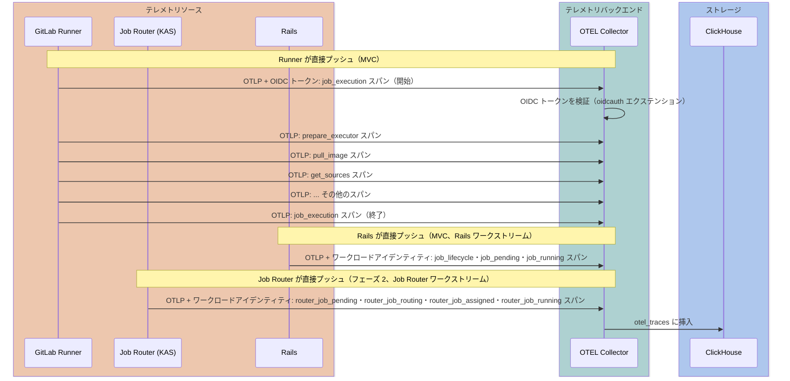
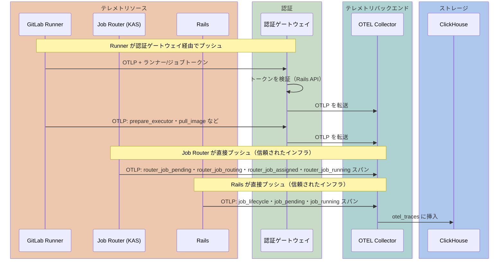

このページには今後予定されている製品・機能・機能性に関する情報が含まれています。ここに示す情報は参考目的のみです。購入・計画の決定にこの情報を使用しないでください。製品・機能・機能性の開発、リリース、タイミングは変更または延期される可能性があり、GitLab Inc. の独自の判断に委ねられています。

<table class="w-full text-sm border-collapse">
<thead>
<tr class="bg-gray-100 text-left">
<th class="px-3 py-2 border border-gray-300">Status</th>
<th class="px-3 py-2 border border-gray-300">Authors</th>
<th class="px-3 py-2 border border-gray-300">Coach</th>
<th class="px-3 py-2 border border-gray-300">DRIs</th>
<th class="px-3 py-2 border border-gray-300">Owning Stage</th>
<th class="px-3 py-2 border border-gray-300">Created</th>
</tr>
</thead>
<tbody>
<tr>
<td class="px-3 py-2 border border-gray-300">proposed</td>
<td class="px-3 py-2 border border-gray-300"><a href="https://gitlab.com/pedropombeiro" class="text-blue-600 hover:underline">@pedropombeiro</a></td>
<td class="px-3 py-2 border border-gray-300"><a href="https://gitlab.com/fabiopitino" class="text-blue-600 hover:underline">@fabiopitino</a></td>
<td class="px-3 py-2 border border-gray-300"><a href="https://gitlab.com/rutshah" class="text-blue-600 hover:underline">@rutshah</a>, <a href="https://gitlab.com/golnazs" class="text-blue-600 hover:underline">@golnazs</a></td>
<td class="px-3 py-2 border border-gray-300">~devops::verify</td>
<td class="px-3 py-2 border border-gray-300">2026-01-20</td>
</tr>
</tbody>
</table>

## 概要

このデザインドキュメントでは、**GitLab 向けのサービス非依存の OTLP テレメトリバックエンド**を提案し、**CI Job テレメトリをその最初のプロダクト機能**として位置付けます。
CI Job テレメトリは、OpenTelemetry (OTLP) 標準を使用して、CI Functions（ステップ）・リソース使用状況・エラー診断など、CI ジョブの実行パフォーマンスを DevOps エンジニアに可視化します。

MVC は内部チーム（DevExp を Customer 0 として）に Grafana ダッシュボードを通じて提供しますが、長期的な目標は GitLab.com・セルフマネージド・Dedicated 上のすべての GitLab 顧客が利用できる**プロダクト機能**です。ユーザーはパイプラインの動作を分析し、最適化の機会を特定し、AI を活用してパイプラインを改善できるようになります。
MVC のショートカット（例: OIDC 認証・Grafana のみの可視化）は、長期的なプロダクトパスと互換性があるため、意図的に選択されています。

テレメトリバックエンドは、**サービス非依存の OTLP トレースストア**上に構築されています。
トレースは汎用の [`otel_traces`](#clickhouse-スキーマ) テーブル（[OTEL Collector ClickHouse エクスポーター](https://github.com/open-telemetry/opentelemetry-collector-contrib/tree/main/exporter/clickhouseexporter)が自動作成）に格納され、ドメイン固有の[マテリアライズドビュー](#clickhouse-スキーマ)が `ServiceName` でフィルタリングして専用テーブルにデータをルーティングします。
このアーキテクチャにより、あらゆる GitLab コンポーネントが標準 OTLP トレースを出力し、同じ取り込みパイプライン・ストレージ・クエリインフラの恩恵を受けられます。

### CI Job テレメトリ — 最初の利用者

大規模な CI/CD パイプラインを運用する場合、Docker イメージのプル時間・Git 操作の所要時間・キャッシュのヒット/ミス率・アーティファクトのアップロード/ダウンロード時間などのシステムレベルのメトリクスを可視化する必要があります。
現在は堅牢なソリューションが存在しておらず、既存のアドホックなインストゥルメンテーションはジョブから実行されるため、メンテナンスが困難で、`after_script` ブロックの後に発生する操作をキャプチャできません。

同じ CI ジョブに対して複数のソースがスパンを提供します:

1. **Rails**: ジョブライフサイクルスパン（`job_lifecycle`・`job_pending`・`job_running`）
1. **Job Router**: スケジューリングとルーティングメトリクス（pending→accepted・アドミッションコントロール）
1. **Runner**: 実行レベルのメトリクス（CI Functions・リソース操作）

各コンポーネントは標準 OTEL エクスポーターを使用して、OIDC/ワークロードアイデンティティ（MVC）またはトークンベースのゲートウェイ（長期）で認証しながら、テレメトリをバックエンドに直接プッシュします。
Job Router テレメトリの統合詳細については、[Job Router テレメトリ](#ワークストリーム-job-router-テレメトリ)を参照してください。
CI Functions は、ジョブ内のすべてのタイムド操作に対する統一的な抽象化であり、以下を包含します:

- 従来のジョブセクション（`prepare`・`script`・`after_script`）
- 組み込み操作（イメージプル・キャッシュ復元・アーティファクトアップロード）
- プラットフォームが新しい宣言的モデルを採用するにつれての [CI Functions](https://docs.gitlab.com/ci/steps/)

このテレメトリシステムは、あらゆる CI Function タイプのタイミングとメタデータをキャプチャし、ジョブの定義方法にかかわらず包括的な CI/CD オブザービリティの基盤を提供します。

## 主要な依存関係

このセクションでは、CI Job テレメトリに必要なコンポーネントとその現在のステータスをまとめます。

### コンポーネントの可用性

| コンポーネント | オーナー | ステータス | タイムライン | 備考 |
|-----------|-------|--------|----------|-------|
| OTEL Collector | Observability | 本番対応済み | 利用可能 | [ClickHouse エクスポーター](https://github.com/open-telemetry/opentelemetry-collector-contrib/tree/main/exporter/clickhouseexporter)付きの標準 OTEL Collector — `otel_traces` に書き込む。スケール時のトレース ID ベースのルーティングに[ロードバランシングエクスポーター](https://github.com/open-telemetry/opentelemetry-collector-contrib/tree/main/exporter/loadbalancingexporter)を使用。単一デプロイメントがすべてのテレメトリを処理し、別々のエクスポーターパイプラインが異なる CH インスタンスに書き込む（[設計の決定](#設計の決定)を参照）。 |
| ClickHouse インスタンス（Observability） | Observability | 有効 | [フェーズ 1](#フェーズ-1-mvc-gitlabcom-ホストランナー) | 運用ダッシュボードとクロスサービストレース相関のための内部専用 ClickHouse インスタンス（[MR](https://gitlab.com/gitlab-com/gl-infra/observability/clickhouse-cloud/-/merge_requests/102)、2026-02-12 マージ）。エンドユーザーには公開されません。 |
| フィーチャーネゴシエーション + トレースコンテキスト | CI Platform | 未開始 | [フェーズ 1](#フェーズ-1-mvc-gitlabcom-ホストランナー): 約 1 週間 | Rails ジョブペイロードの変更: `features.tracing`（[&20945](https://gitlab.com/groups/gitlab-org/-/epics/20945)） |
| Runner インストゥルメンテーション | Runner Core | [進行中](https://gitlab.com/groups/gitlab-org/-/epics/20633) | [フェーズ 1](#フェーズ-1-mvc-gitlabcom-ホストランナー): 約 3 週間（基本インストゥルメンテーション: 約 1 週間、CI Functions スパン: 約 2 週間） | テレメトリスパンを収集し、OIDC 認証で OTEL Collector にプッシュ。フィーチャーネゴシエーション + トレースコンテキストに依存。 |
| CI テレメトリマテリアライズドビュー | CI Platform | 未開始 | [フェーズ 3](#フェーズ-3-insights-層) | 自動作成された `otel_traces` テーブル上の `ci_job_telemetry_traces` MV（[スキーマ](#clickhouse-スキーマ)）。クエリパターンが確立されるまで延期。 |
| Rails ライフサイクルスパン | CI Platform / Pipeline Execution | 未開始 | [フェーズ 1](#フェーズ-1-mvc-gitlabcom-ホストランナー) | Rails 状態マシンからの `job_lifecycle`・`job_pending`・`job_running` スパン（[Rails 統合](#ワークストリーム-rails-統合)）。Sidekiq/`PipelineProcessWorker` の遅延を含むエンドツーエンドの可視性のために MVC に含まれる。 |
| Job Router テレメトリ | Runner Core | 未開始 | [フェーズ 2](#フェーズ-2-完全なテレメトリパイプライン) | KAS Job Router からのスケジューリングスパン（`router_job_pending` から `router_job_running`）（[Job Router テレメトリ](#ワークストリーム-job-router-テレメトリ)） |
| 認証ゲートウェイ | TBD | 未開始 | [フェーズ 2](#フェーズ-2-完全なテレメトリパイプライン)（GitLab.com 以外のワークストリーム） | すべてのランナー向けの長期標準認証。MVC の OIDC ショートカットを置き換える |

### MVC のタイムライン制約

- **ターゲット**: `gitlab-org` プロジェクトをビルドする GitLab 内部ランナーのみ（Customer 0 ユースケース）。検証後、すべての GitLab.com ホストランナーに拡張（同じ信頼モデルとネットワークアクセス、より大きなボリューム）。
- **推定工数**: エンドツーエンドで約 4〜5 週間（クリティカルパス）、一部並列化可能
  - CI Platform: `features.tracing` ペイロード（約 1 週間）→ Runner をアンブロック
  - Runner 基本インストゥルメンテーション: `features.tracing` の消費 + 最初の `job_execution` スパン + 組み込みステージスパン（約 1 週間、開始済み）→ CI Platform ペイロードの変更に依存
  - Runner CI Functions スパン:（約 2 週間、保守的な見積もり）→ 基本インストゥルメンテーション後
- **ブロッキングの依存関係**:
  - ~~CI テレメトリのための ClickHouse インスタンス有効化~~（完了 — [MR](https://gitlab.com/gitlab-com/gl-infra/observability/clickhouse-cloud/-/merge_requests/102)、2026-02-12 マージ）
  - OTEL Collector デプロイメント（標準コンポーネント、Observability が管理。すべてのテレメトリソース向けの単一の既知エンドポイント）

詳細な内訳については[クロスチームの依存関係](#クロスチームの依存関係)を参照してください。MVC 後のロードマップ（Job Router テレメトリ・顧客所有ランナー・セルフマネージド/Dedicated）については、[フェーズ 2](#フェーズ-2-完全なテレメトリパイプライン)と[フェーズ 3](#フェーズ-3-insights-層)を参照してください。

## 動機

大規模な CI/CD パイプラインを運用する場合、**エンドツーエンドの CI ジョブ実行パフォーマンス**を総合的に可視化する必要があります。パイプラインとジョブの実行時間だけでなく、ジョブが通過するすべての段階の詳細な内訳も必要です:

- **スケジューリングとルーティング**: キュー時間・ルーティング決定・ランナー割り当てのレイテンシ
- **環境準備**: Docker イメージのプル時間・エグゼキューターのセットアップ時間
- **ソースコード操作**: クローン/フェッチ時間・操作タイプ・使用パラメーター
- **キャッシュ**: キャッシュキーごとのヒット/ミス率・ダウンロード/アップロード時間
- **アーティファクト**: アップロード/ダウンロードの所要時間とサイズ
- **スクリプト実行**: ユーザー定義スクリプトの実行（`script`・`before_script`・`after_script` ブロック）
- **CI Functions**: ジョブが宣言的モデルに移行するにつれての個別の関数

この可視性は、**エグゼキューターの種類やジョブが steps/CI Functions モデルを使用しているかどうかにかかわらず**有益です。すべての CI ジョブはすでに準備・git・キャッシュ・アーティファクト・スクリプトの段階を通過しており、Runner はすでにこれらを[ビルドセクション](https://docs.gitlab.com/runner/development/#log-a-build-section)としてトラッキングしています。CI Functions モデルにより細かい粒度が追加されますが、基盤となるテレメトリはすべてのジョブに適用されます。

これらのメトリクスは、別々のジョブログを手動で調べることなく、問題を早期に発見し影響を評価するのに役立ちます。

### 顧客の声

1. "特定のジョブを分析するには、パイプラインに加えてジョブについてより詳細な情報が必要です。次のパラメーターが役立ちます: 所要時間（ボトルネックを特定するためのログのセクションに分割して、カスタムの折りたたみ可能なセクションで、ジョブを分析するための個別のステップに分割できます）" - [エピック #11835](https://gitlab.com/groups/gitlab-org/-/epics/11835#note_1631621923)

1. ユーザーはジョブログを通じてアプリケーション層で何が起こっているかしか確認できません。根本原因を特定するには、GitLab のジョブレベルデータとランナー・インフラレベルの情報を同じ瞬間に相関させる必要があります。

### 目標

- **プロダクト目標**: DevOps エンジニアが GitLab.com・セルフマネージド・Dedicated 上で CI/CD パイプラインのパフォーマンスを分析し、ボトルネックを特定し、AI を活用してパイプラインを最適化できるようにします
- **MVC 目標**: DevExp チーム（Customer 0 として）に、テレメトリパイプラインを全顧客に公開する前に検証するための Grafana ダッシュボード構築データを提供します
- あらゆる GitLab コンポーネントがトレースを出力できるサービス非依存の OTLP テレメトリバックエンドを提供します
- GitLab Runner がジョブ中に実行された各ステージと CI Function の構造化テレメトリデータを報告できるようにします
- すべてのエグゼキュータータイプ・現在のジョブステージ・CI Functions モデルをサポートする柔軟なスキーマを設計します
- 効率的なクエリとトレンド分析のために ClickHouse にテレメトリを格納します
- メトリクスがベースラインから逸脱または低下傾向を示した場合の自動アラートを有効にします（例: キャッシュヒット率の低下、アーティファクトアップロード時間の増加）
- ユーザーと AI エージェントが最適化の機会を特定できるようにします:
  - パイプラインのボトルネックとホットスポット
  - 作業の並列化の機会
  - ジョブ待ち時間の削減
  - キャッシュヒット率の改善
  - ジョブ実行コストの削減（CI 分数・クラウドコスト）
  - パイプライン全体の所要時間の削減

### 非目標

- **ユーザーレベルのテレメトリ**: 任意のユーザースクリプトからのカスタムメトリクス（テストカバレッジ・カスタムタイミング）はスコープ外で、既存の [`metrics_reports` 機能](https://docs.gitlab.com/ci/testing/metrics_reports/)によって部分的に対処されています。これは CI Function テレメトリとは異なります。CI Function テレメトリは step-runner が提供する構造化 API を使用します。
- **MVC でのプロダクト内可視化**: MVC はデータ収集と Grafana ダッシュボードに焦点を当てています。GitLab でのプロダクト内 UI 可視化は[フェーズ 3](#フェーズ-3-insights-層)に計画されています。

## キー定義

以下の用語はこのドキュメント全体で使用されています。実装の詳細（どの ID がどの OTEL コンセプトにマップされるかなど）は、ドキュメントの残りの部分を将来の変更に対して堅牢にするためにここで一度定義します。

| 用語 | 定義 |
|------|-----------|
| **OTLP** | [OpenTelemetry プロトコル](https://opentelemetry.io/docs/specs/otel/protocol/)。すべてのコンポーネント（Runner・Rails・Job Router）が OTEL Collector にスパンをエクスポートするために使用するワイヤーフォーマット。HTTP または gRPC 経由。 |
| **スパン** | トレース内の単一のタイムド操作。一意の **スパン ID**（ランダムに生成された 64 ビット値）によって識別される。子スパンは `parent_span_id` を通じて親を参照し、ツリーを形成する。 |
| **CI Function** | CI ジョブ内の離散的なタイムド操作 — 組み込みステージ（`pull_image`・`restore_cache`・`upload_artifacts`・`step_script`）および将来の宣言的[ステップ](https://docs.gitlab.com/ci/steps/)。各 CI Function はジョブの親スパン下のスパンとして表される。 |
| **パイプライントレース** | 同じトレース ID を共有するすべてのスパン。CI パイプライン階層の実行を表す。明示的なパイプラインルートスパンはなく、ジョブは共有トレース ID でグループ化されたトップレベルスパン。OTEL の「トレース」リソースと混同しないこと。 |
| **トレース ID** | パイプライン階層のすべてのスパンをグループ化する 128 ビットの識別子。**ルート**パイプライン ID から決定論的に導出（[トレースコンテキストの初期化](#マルチソーストレースの調整)を参照）。親および子パイプラインのすべてのジョブがこの値を共有する。 |
| **ジョブスパン** | 単一ジョブの実行ライフサイクルを表すスパン。ルートパイプラインでは、ジョブスパンはルートレベルのスパン（親なし）。子パイプラインでは、ジョブスパンはトリガー（ブリッジ）ジョブのスパンの子。Rails の `job_lifecycle` スパンがジョブスパンとして機能し、Runner の `job_execution` スパンがその下にネストされる。 |
| **親スパン ID** | Runner がジョブペイロードで受け取るスパン ID（`span_parent_id`）で、正しいジョブの下に子スパンを付加できる。すべてのジョブ（`job_lifecycle` スパンから）に Rails 生成のスパン ID を含む。子パイプラインジョブでは、`job_lifecycle` スパン自体がトリガー（ブリッジ）ジョブのスパンの子。 |
| **`features.tracing`** | フィーチャーネゴシエーション・トレースコンテキスト・エンドポイント設定を組み合わせた `/api/v4/jobs/request` レスポンスの統一オブジェクト。その存在はテレメトリが有効であることを示し、常に `trace_id`（パイプライン）・`span_parent_id`（このジョブの Rails `job_lifecycle` スパン ID）・`otel_endpoints`（URL とオプションの認証設定を持つエンドポイントオブジェクトの配列。MVC では単一エントリ、潜在的な 2 番目のエントリについては[将来の作業](#将来の作業-byo-otlp-エンドポイント)を参照）を含む。[ジョブペイロードの変更](#ジョブペイロードの変更)を参照。 |
| **`ServiceName`** | テレメトリを出力するコンポーネントを識別する OTEL [サービス名](https://opentelemetry.io/docs/specs/semconv/resource/#service)リソース属性（例: `gitlab-ci-runner`・`gitlab-ci-job-router`・`gitlab-ci-rails`）。スパンをドメイン固有のマテリアライズドビューにフィルタリングおよびルーティングするために使用。 |
| **リソース属性** | テレメトリを生成するエンティティを説明する OTLP リソースレベルのキーバリューペア（例: `ci.pipeline.id`・`ci.job.id`・`ci.project.id`・`ci.pipeline.source`）。`otel_traces.ResourceAttributes` に格納される。TracerProvider インスタンスごとに安定 — この設計ではジョブごと。 |
| **スパン属性** | 特定の操作を説明する OTLP スパンレベルのキーバリューペア（例: キャッシュキー・アーティファクト名・転送バイト数）。`otel_traces.SpanAttributes` に格納され、`ci_job_telemetry_traces` の型付き列に非正規化される。 |
| **`traversal_path`** | 挿入時に ClickHouse ディクショナリールックアップによって計算される非正規化された名前空間階層キー（例: `0/…/group_id/project_id/`）。効率的な組織/グループ/プロジェクトレベルの集計クエリを有効にする。 |
| **OTEL Collector** | スパンを受信・処理・ClickHouse にエクスポートする [OpenTelemetry Collector](https://opentelemetry.io/docs/collector/) インスタンス。単一デプロイメントがすべてのテレメトリソースを処理し、ClickHouse インスタンスごとに別々のエクスポーターパイプラインがある（[設計の決定](#設計の決定)を参照）。Observability チームが管理。 |
| **`otel_traces`** | OTEL Collector が生スパンを書き込むサービス非依存の ClickHouse テーブル。標準 OTEL スキーマに従い、すべてのインストゥルメントされたサービスで共有される。 |
| **`ci_job_telemetry_traces`** | ([フェーズ 3](#フェーズ-3-insights-層)) `otel_traces` から CI 固有の列をクエリ最適化スキーマに投影する ClickHouse [マテリアライズドビュー](https://clickhouse.com/docs/en/sql-reference/statements/create/view#materialized-view)。`otel_traces` への挿入時に起動し、`ServiceName` でフィルタリング。これは[クエリ層](https://gitlab.com/gitlab-org/gitlab/-/issues/590589)によってクエリされる主要テーブル。 |
| **Job Router** | CI ジョブのスケジューリングとランナー割り当てを担当する [KAS](https://docs.gitlab.com/ee/administration/clusters/kas/) モジュール。[フェーズ 2](#フェーズ-2-完全なテレメトリパイプライン)でルーティングスパン（`router_job_pending` から `router_job_running`）を出力。 |
| **ケイパビリティフィンガープリント** | ジョブとランナーの互換性を決定するすべての要素を一意に識別する安定したハッシュ: タグ・ランナータイプ（インスタンス/グループ/プロジェクト）・保護ステータス・プロジェクトアクセス。同じフィンガープリントを共有するランナーは同じジョブセットを処理できる。[Runner Job Router アーキテクチャ](/handbook/engineering/architecture/design-documents/runner_job_router/)に定義。MVC でスパン属性として含まれ、「どのケイパビリティグループでキャッシュ復元が遅いか？」やケイパビリティグループごとの SLO などのテレメトリクエリを可能にする。 |

## 提案

**OpenTelemetry プロトコル（OTLP）**を使用してテレメトリ送信エンドポイントを実装します。
各 CI Function は[ジョブスパン](#キー定義)下のスパンとして表されます。
スパンはほぼリアルタイムのバッチで送信され（OTEL SDK はデフォルトで 5 秒ごとにバッチ処理）、以下を実現します:

- **ほぼリアルタイムの可視化**: 状態変更から数秒以内にジョブの進行状況を確認できます。完了を待つ必要がありません
- **長時間実行ジョブのサポート**: ジョブの完了を待たずにパフォーマンスを分析できます
- **マルチソーステレメトリ**: Job Router・Runner・Rails が独立してスパンをテレメトリバックエンドにプッシュします

**専用エンドポイントが必要な理由**（トレースログの解析に対して）:

1. **シンプルさ**: 専用エンドポイントは実装とメンテナンスが簡単です
1. **パフォーマンス**: 潜在的に大きなジョブログの解析計算コストを回避します
1. **信頼性**: 構造化データはログテキストよりも解析エラーが発生しにくいです
1. **柔軟性**: Runner がログに存在しないメトリクスを報告できます（例: 内部タイミングデータ）
1. **標準サポート**: ログストリームに埋め込むのが非現実的な業界標準プロトコル（OTLP）の使用を可能にします

**OTLP を選ぶ理由**（カスタム JSON に対して）:

1. **業界標準**: OpenTelemetry はオブザービリティデータの広く採用された標準です
1. **スパン階層**: CI Functions はジョブ親スパン下の子スパンに自然にマップされます
1. **ライブラリサポート**: Go は Runner 向けの成熟した OTLP サポートを持ち、標準 OTEL Collector がサーバーサイドの取り込みを処理します
1. **将来の統合**: GitLab オブザービリティ（SigNoz）や外部プラットフォームとの潜在的な統合を可能にします
1. **セマンティック規約**: CI/CD テレメトリのための豊富で標準化された属性

**バックエンド非依存設計**:

テレメトリバックエンドは CI 固有のパイプラインではなく、**汎用 OTEL トレースストア**として設計されています。
すべてのテレメトリは [ClickStack トレーススキーマ](https://clickhouse.com/docs/use-cases/observability/clickstack/ingesting-data/schemas#traces)に従う標準の `otel_traces` テーブルに格納されます。
CI 固有のビュー（例: `ci_job_telemetry_spans`）は `service_name` でフィルタリングするマテリアライズドビューを通じて投入されます。
このアプローチ:

1. **再利用を可能にする**: 他の GitLab コンポーネントはスキーマを変更せずに同じバックエンドにトレースを出力できます
1. **標準に従う**: `otel_traces` スキーマは業界標準の OTEL ストレージパターンに合わせています
1. **取り込みをシンプルにする**: 取り込みパスにカスタム変換ロジックなし — 標準 OTEL Collector が直接 ClickHouse に書き込みます
1. **関心を分離する**: CI 固有の非正規化とクエリ最適化は MV 層で行われ、取り込み層では行われません

### 高レベルアーキテクチャ

テレメトリパイプラインは、[ClickHouse エクスポーター](https://github.com/open-telemetry/opentelemetry-collector-contrib/tree/main/exporter/clickhouseexporter)付きの標準 OTEL Collector を使用して、PostgreSQL ステージングをバイパスして OTLP データを直接 ClickHouse に書き込みます。

#### MVC（GitLab.com ホストランナー）

GitLab.com では、すべてのコンポーネントが標準メカニズムを使用して OTEL Collector に直接認証します。カスタム認証ゲートウェイは不要です:

- **Runner** は Collector の [`oidcauth` エクステンション](https://github.com/open-telemetry/opentelemetry-collector-contrib/tree/main/extension/oidcauthextension)によって検証される [OIDC トークン](https://opentelemetry.io/docs/collector/configuration/#authentication)を使用します
- **Job Router** と **Rails** は GitLab マネージドインフラ内で動作する内部コンポーネントとして[ワークロードアイデンティティ](https://cloud.google.com/kubernetes-engine/docs/concepts/workload-identity)を使用します
- ワークロードアイデンティティが利用可能な場合、[Identity-Aware Proxy (IAP)](https://cloud.google.com/iap/docs/concepts-overview)でアクセス制御をさらに簡素化できます

#### MVC 後（セルフマネージド / Dedicated）

セルフマネージドデプロイメントおよびすべてのランナーの長期標準として、軽量なトークンベースの認証ゲートウェイが OTLP リクエストを転送する前にランナーとジョブトークンを [Rails エンドポイント](#トークンベースの認証ゲートウェイ)に対して検証します。

#### 共通アーキテクチャ

**直接プッシュアーキテクチャ**: 各コンポーネントは標準 OTEL エクスポーターを使用して、単一の既知の [OTEL Collector](#キー定義) エンドポイントにテレメトリを直接プッシュします。共有[トレース ID](#キー定義)がすべてのトレースをコンポーネント間でつなぎます。Rails は [`features.tracing`](#ジョブペイロードの変更) ジョブペイロード（エンドポイントオブジェクトの配列 `otel_endpoints`。URL と認証の詳細を持つ）でエンドポイント設定を Runner に送信するため、静的な設定なしにあらゆるランナーで機能します。有効化はランナーのバージョンと名前空間のプランに依存し、手動セットアップは不要です。

- **Runner**（MVC）: CI Function スパン（prepare・pull_image・get_sources など）をプッシュします
- **Rails**（MVC、[Rails 統合](#ワークストリーム-rails-統合)ワークストリーム）: ジョブライフサイクルスパン（`job_lifecycle`・`job_pending`・`job_running`）をプッシュします — Sidekiq/`PipelineProcessWorker` の遅延を含む可視性を提供し、ブリッジジョブと外部ジョブを標準でカバーします
- **Job Router**（フェーズ 2、[Job Router テレメトリ](#ワークストリーム-job-router-テレメトリ)ワークストリーム）: ジョブルーティングスパン（pending → routing → admitted → assigned → running）をプッシュします

**直接プッシュを選ぶ理由**（KAS などの単一プロキシ経由のルーティングに対して）:

- **標準 OTEL エクスポーター**: 各コンポーネントは標準 OTEL SDK を使用します — カスタムストリーミングプロトコルは不要です
- **単一障害点なし**: コンポーネントは独立してプッシュします。1 つのコンポーネントの障害が他に影響しません
- **シンプルなアーキテクチャ**: メンテナンスする中間プロキシなし、コンポーネント間の `FollowSpan()` チャネルなし
- **分離されたデプロイメント**: 各コンポーネントのテレメトリを独立して有効/無効にできます
- **レイテンシ**: OTEL SDK は短い間隔（デフォルト 5 秒、または最大スパン数）でバッチを作成し、実質的にほぼリアルタイムです

**サービス非依存のテレメトリバックエンド**:

`otel_traces` テーブルはあらゆるサービスからのすべての OTLP トレースを格納し、OTEL Collector ClickHouse エクスポーターによって自動作成されます。取り込みパスは意図的にシンプルです — 標準 **OTEL Collector が中間キューイング層なしで ClickHouse に直接書き込み**、Observability チームの[分散トレーシングインフラ](https://gitlab.com/groups/gitlab-com/gl-infra/-/epics/1517)が成熟するにつれて統合が容易です。MVC では、DevExp が Grafana を通じて `otel_traces` を直接クエリします。[フェーズ 3](#フェーズ-3-insights-層)では、マテリアライズドビューが `ServiceName` でフィルタリングして CI 固有の属性を `ci_job_telemetry_traces` に非正規化します（[ClickHouse スキーマ](#clickhouse-スキーマ)を参照）。

## スコープとフェーズ

### フェーズ 1: MVC（GitLab.com ホストランナー）

MVC は GitLab.com のコアテレメトリパイプラインの確立に焦点を当てています:

1. **Runner テレメトリ収集**: 組み込みビルドステージのタイミングとメタデータを収集するために GitLab Runner をインストゥルメントします（`prepare_executor`・`pull_image`・`get_sources`・`restore_cache`・`step_script`・`after_script`・`archive_cache`・`upload_artifacts`）
1. **Rails ジョブライフサイクルスパン**: Rails が完全なジョブ状態マシン（`created` → `pending` → `running` → `finished`）をカバーする `job_lifecycle`・`job_pending`・`job_running` スパンを出力します。Sidekiq/`PipelineProcessWorker` の遅延を含むエンドツーエンドの可視性を提供します。[Rails 統合ワークストリーム](#ワークストリーム-rails-統合)を参照してください。
1. **テレメトリバックエンド**: すべてのテレメトリソース向けの単一の既知エンドポイントで OTEL Collector をデプロイします。スケール時には、[ロードバランシングエクスポーター](https://github.com/open-telemetry/opentelemetry-collector-contrib/tree/main/exporter/loadbalancingexporter)がトレース ID でスパンをバックエンドコレクターにルーティングし、ジョブのすべてのスパンが同じインスタンスに格納されることを保証します。
1. **ClickHouse スキーマ**: `otel_traces` テーブルは Observability チームの ClickHouse インスタンスで OTEL Collector によって[自動作成](https://github.com/open-telemetry/opentelemetry-collector-contrib/tree/main/exporter/clickhouseexporter)されます — MVC のマイグレーションは不要です。`ci_job_telemetry_traces` マテリアライズドビューは[フェーズ 3](#フェーズ-3-insights-層)に延期されます。
1. **内部ダッシュボード**: DevExp チーム（Customer 0）が GitLab.com CI/CD パフォーマンスについて `otel_traces` を直接クエリ（`ServiceName = 'gitlab-ci-runner'` でフィルタリング）して Grafana ダッシュボードを構築できるようにします

内部ランナーで検証後、テレメトリは**すべての GitLab.com ホストランナー**（顧客プロジェクト）に拡張されます。アーキテクチャの変更は不要 — 同じ信頼モデル（OIDC）・ネットワークアクセス・Collector インフラが適用されます。唯一の違いは取り込みボリュームです。

**MVC が明示的に除外するもの**（すべてフェーズ 2・フェーズ 3・将来の作業に延期）:

- `ci_job_telemetry_traces` マテリアライズドビュー（[フェーズ 3](#フェーズ-3-insights-層) — クエリパターンが確立されるまで延期）
- BYO OTLP エンドポイント（顧客設定の OTLP 宛先）— [将来の作業](#将来の作業-byo-otlp-エンドポイント)
- Job Router テレメトリ（KAS スパン）
- GitLab.com にレポートするセルフマネージドランナー
- セルフマネージドおよび Dedicated インスタンスのデプロイメント
- プロダクト内 UI 可視化
- 自動アラート
- リソース使用メトリクス（CPU・メモリ・ディスク I/O）
- CI Functions DAG テレメトリ（ネストした関数呼び出し）

### フェーズ 2: 完全なテレメトリパイプライン

MVC のリリース後、複数のワークストリームを**並行して**進めてすべてのコンポーネントとデプロイメントターゲットにわたってテレメトリパイプラインを完成させることができます:

1. **ワークストリーム: [Job Router テレメトリ](#ワークストリーム-job-router-テレメトリ)**: KAS Job Router からテレメトリを追加します（スケジューリングスパン: `router_job_pending`・`router_job_routing`・`router_job_admitted`・`router_job_assigned`・`router_job_running`）
1. **ワークストリーム: [GitLab.com ホストランナー以外](#ワークストリーム-gitlabcom-ホストランナー以外)**: GitLab.com のセルフホストランナー（Tier b — トークンベースの認証ゲートウェイが必要）およびセルフマネージド/Dedicated（Tier c — OTEL Collector のシッピングが必要）にテレメトリを拡張します
1. **ワークストリーム: [CI Functions DAG](#ワークストリーム-ci-functions-dag)**: 他の関数を呼び出す CI Functions のネストしたスパンをサポートします

### フェーズ 3: Insights 層

MVC の **Rails 統合**ワークストリームにゲートされており、意味のあるユーザー向け機能に必要な完全なジョブライフサイクルデータ（キュー時間・ジョブ所要時間・ブリッジジョブの可視性）を提供します。このフェーズ内で複数のワークストリームを**並行して**進めることができます:

1. **ワークストリーム: [ユーザーが消費できるデータ](#ワークストリーム-ユーザーが消費できるデータ)**: 集計メトリクス（p50/p95 所要時間・キャッシュヒット率のための MV）・GraphQL API・GLQL 統合・Duo AI/DAP
1. **ワークストリーム: [アラート](#ワークストリーム-アラート)**: メトリクスの逸脱に対するベースラインアラート（集計メトリクスに依存）
1. **ワークストリーム: [プロダクト内可視化](#ワークストリーム-プロダクト内可視化)**: パイプラインパフォーマンス insights のための GitLab UI ダッシュボードを構築します（GraphQL API に依存）

## クロスチームの依存関係

このイニシアチブは複数のチームにわたる調整が必要です。設計が承認されると、MVC の作業項目を並行して進めることができます:

| チーム/ドメイン | 責任 | ブロッキング | ステータス |
| -------------------------------- | ----------------------------------------------------------------------------------------------------------------------------------------------------------------------- | ------------ | ------------------------ |
| **Runner Core**（Verify） | 標準 OTEL エクスポーターを使用して[テレメトリスパンを収集・プッシュするための Runner のインストゥルメント](https://gitlab.com/gitlab-com/content-sites/handbook/-/merge_requests/17980#note_3022842795) | あり（MVC） | 設計フェーズ |
| **TBD** | [認証ゲートウェイ](#トークンベースの認証ゲートウェイ)（トークン検証・OTLP 転送）— すべてのランナー向けの標準認証（フェーズ 2、GitLab.com 以外のワークストリーム）。MVC では OIDC を暫定として使用 | なし（フェーズ 2） | 未開始 |
| **CI Platform**（Verify） | [Rails 認証エンドポイント](#トークンベースの認証ゲートウェイ)（`POST /api/v4/internal/ci/telemetry/auth`） | MVC 後 | 未開始（約 1 週間） |
| **Observability** | Observability ClickHouse インスタンス上の `otel_traces`（OTEL Collector によって自動作成）のホスティング | あり（MVC） | 調整が必要 |
| **CI Platform**（Verify） | `ci_job_telemetry_traces` マテリアライズドビュー（[スキーマ](#clickhouse-スキーマ)） | [フェーズ 3](#フェーズ-3-insights-層) | 未開始 |
| **Pipeline Execution**（Verify） | [Rails ジョブライフサイクルテレメトリ](#ワークストリーム-rails-統合) | あり（MVC） | 未開始 |
| **Runner Core**（Verify） | [Job Router テレメトリ統合](#ワークストリーム-job-router-テレメトリ) | なし（フェーズ 2） | 将来 |
| **Observability** | OTEL Collector のデプロイメントと管理（[コラボレーションパス](#gitlab-オブザービリティとの関係)）。GitLab オブザービリティトレーシングインフラとの潜在的な統合 | あり（MVC） | 調整が必要 |
| **Distribution** | [セルフマネージド/Dedicated パッケージング](#セルフマネージドおよび-dedicated-インスタンス) | なし（フェーズ 2） | 将来 |

**注記**:

- **取り込みパイプライン**: [ClickHouse エクスポーター](https://github.com/open-telemetry/opentelemetry-collector-contrib/tree/main/exporter/clickhouseexporter)付きの標準 [OTEL Collector](https://opentelemetry.io/docs/collector/) が OTLP データを自動作成された `otel_traces` テーブルに直接書き込みます。[フェーズ 3](#フェーズ-3-insights-層)では、マテリアライズドビューが CI 固有の属性を `ci_job_telemetry_traces` に非正規化します。詳細は [ClickHouse スキーマ](#clickhouse-スキーマ)を参照してください。
- **ClickHouse インスタンス**: GitLab.com では 2 つの ClickHouse インスタンスが異なる目的に使用されます:
  - **Observability CH**（MVC）: [Observability チームのインスタンス](https://gitlab.com/gitlab-com/gl-infra/observability/clickhouse-cloud/-/merge_requests/102)が内部/運用用途（Grafana ダッシュボード・クロスサービストレース相関）の `otel_traces` をホストします。このインスタンスは**エンドユーザーには公開されません**。
  - **本番 CH**（MVC 後）: メイン本番 ClickHouse インスタンスが顧客向け機能（GraphQL・GLQL・Duo）のために `ci_job_telemetry_traces` のフィルタリング/サンプリングされたサブセットを受信します。Rails はこのインスタンスを `ClickHouse::Client` を通じてクエリします。インスタンスごとに異なる保持とサンプリングポリシーが適用されます。

  OTEL Collector はインスタンスごとに別々のエクスポーターパイプラインを使用します（[設計の決定: OTEL Collector ファンアウト](#設計の決定)を参照）。

**MVC の主要な調整ポイント**:

- OTEL Collector のデプロイメントと ClickHouse インスタンスホスティングのための Observability チームとの調整
- テレメトリインストゥルメンテーション実装のための Runner Core チームとの調整

## コスト見積もり（GitLab.com）

### 前提条件

| パラメーター | 値 | 備考 |
|-----------|-------|-------|
| 1 日あたりのジョブ数 | 7,200,000 | GitLab.com の見積もり |
| ジョブあたりのスパン数 | 8 | 平均（すべてのジョブがすべてのステージを持つわけではない） |
| スパンあたりのバイト数（非圧縮） | 約 500 | 固定列 + 変数メタデータ |
| 圧縮率 | 約 3x | LZ4 圧縮 |
| スパンあたりのバイト数（圧縮後） | 約 170 | 圧縮後 |
| 保持期間 | 30 日（MVC 後） | MVC では 3 日間の保持を使用（現在の Observability CH に合わせる）。MVC 後は少なくとも 30 日に延長 |

### ストレージ計算

| メトリクス | 計算 | 結果 |
|--------|-------------|--------|
| 1 日あたりのスパン数 | 7.2M ジョブ × 8 スパン | 57.6M スパン/日 |
| 1 日あたりのストレージ | 57.6M × 170 バイト | 約 9.8 GB/日 |
| 合計ストレージ | 9.8 GB × 30 日 | **約 294 GB** |

### コスト内訳

| コンポーネント | 見積もり | 備考 |
|-----------|----------|-------|
| ClickHouse ストレージ | 約 $7/月 | 294 GB at $22/TB/月 |
| 取り込みコンピュート | 共有 | OTEL Collector（オートスケール） |
| クエリコンピュート | 共有 | 既存の ClickHouse インスタンス |
| データ受信 | 無料 | Runner・OTEL Collector・ClickHouse はすべて GCP 上 |
| データ送信 | 約 $1/月 | 30 GB リージョン間 at $0.036/GB（ダッシュボードクエリ） |

CI テレメトリが [Observability チームの ClickHouse インスタンス](https://gitlab.com/gitlab-com/gl-infra/observability/clickhouse-cloud/-/merge_requests/102)を共有すると仮定すると、増分コストはストレージとデータ送信のみです。

## 設計と実装の詳細

### テレメトリ取り込みエンドポイント

各テレメトリソースは標準 OTEL エクスポーターを使用して OTEL Collector エンドポイントにスパンをプッシュします。MVC（GitLab.com）では、ランナーが OIDC を使用して Collector に直接認証します。カスタム認証ゲートウェイは不要です。MVC では、Runner テレメトリと Rails ジョブライフサイクルスパンがスコープ内です。Job Router テレメトリはフェーズ 2 のワークストリームです。

Runner は OpenTelemetry Go SDK（`go.opentelemetry.io/otel`）を使用してスパンを作成し、OTLP/HTTP または OTLP/gRPC でエクスポートします。OTEL SDK はバッチ処理を処理します（デフォルト: 5 秒間隔または最大スパン数、どちらか先に達した方）。

**エクスポートのメリット**:

- 標準 OTEL SDK がバッチ処理・リトライ・バックプレッシャーを処理します
- カスタムプロトコルやクライアント実装が不要です
- 各コンポーネントは独立しており、単一障害点がありません
- 異なるソースからのスパンは共有 `trace_id` を通じてつなぎ合わされます

詳細な認証アプローチについては原文の英語版を参照してください。

#### スパン形式

各ストリームされたスパンは [OTLP 仕様](https://opentelemetry.io/docs/specs/otlp/)に従います。各 CI Function は以下を持つスパンです:

- **スパン名**: 関数名（例: `pull_image`・`restore_cache`）
- **トレース ID**: パイプラインの[トレース ID](#キー定義)（パイプライン内のすべてのジョブで共有）
- **スパン ID**: [OpenTelemetry SDK](https://opentelemetry.io/docs/specs/otel/trace/sdk/#id-generators) によってランダムに生成される 16 バイト ID
- **親スパン ID**: 親スパンの ID（例: CI Function スパンは `job_execution` を親として参照）
- **タイムスタンプ**: OTLP タイムスタンプとして `start_time` と `end_time`
- **ステータス**: 標準 OTLP `StatusCode`（`STATUS_CODE_OK`・`STATUS_CODE_ERROR`・`STATUS_CODE_UNSET`）と `StatusMessage`
- **属性**:
  - リソース: `ci.resource.type`・`ci.resource.key`・`ci.resource.operation`・`ci.resource.hit`
  - ネットワーク: `ci.network.rx_bytes`・`ci.network.tx_bytes`
  - 操作: `ci.operation.retry_count`
  - ジョブ: `ci.job.status`（CI ジョブの結果: `success`・`failed`・`canceled`・`skipped`）
  - 拡張: 関数タイプ固有の属性

#### CI Function タイプ

| 関数 | 説明 | リソースタイプ | リソース操作 | リソースキーの例 |
| -------------------- | --------------------------- | ------------- | --------------------------- | --------------------------------------- |
| `pull_image` | Docker イメージのプル | `image` | `pull` | `registry.gitlab.com/group/project:tag` |
| `prepare_executor` | エグゼキューターの準備 | - | - | - |
| `prepare_script` | スクリプトの準備 | - | - | - |
| `get_sources` | ソースリポジトリの取得 | `repository` | `fetch`・`clone`・または `none` | `https://gitlab.com/group/project.git` |
| `restore_cache` | キャッシュのダウンロード | `cache` | `restore` | `ruby-gems-a1b2c3d4` |
| `download_artifacts` | アーティファクトのダウンロード | `artifact` | `download` | `rspec-junit-report` |
| `step_script` | メインスクリプトの実行 | - | - | - |
| `after_script` | after スクリプトの実行 | - | - | - |
| `archive_cache` | キャッシュのアップロード | `cache` | `archive` | `ruby-gems-a1b2c3d4` |
| `upload_artifacts` | アーティファクトのアップロード | `artifact` | `upload` | `rspec-junit-report` |

### ClickHouse スキーマ

テレメトリストレージはサービス非依存の `otel_traces` テーブルと、マテリアライズドビューによって投入される CI 固有の `ci_job_telemetry_traces` テーブルの**2 テーブルアーキテクチャ**を使用します。

詳細なスキーマについては原文の英語版を参照してください。

### 脅威モデル

このセクションでは、テレメトリエンドポイントのセキュリティに関する考慮事項を分析します。

**主な脅威:**

- **T1: 不正なテレメトリ送信** — OIDC/ワークロードアイデンティティ認証、デュアル認証（フェーズ 2）で軽減
- **T2: テレメトリデータインジェクション** — 厳格なスキーマ検証、スパン名の検証、型チェックで軽減
- **T3: 過剰なストリーミングによる DoS** — スパンサイズ制限（4 KB）、ジョブあたりの最大スパン数（1000）、レート制限で軽減
- **T4: メタデータによる情報漏洩** — 事前定義されたメタデータフィールド、最大フィールド数（10）で軽減
- **T5: タイミングベースの情報漏洩** — プロジェクト可視性権限の継承、プロジェクトスコープのクエリで軽減

## 代替ソリューション

詳細な代替案の分析については原文の英語版を参照してください。選択されたアプローチは**Alternative 5**（標準 OTEL Collector + ClickHouse エクスポーター）です。

## 参考資料

- エピック: [スケーラブルな CI Job テレメトリレポーティングの構築](https://gitlab.com/groups/gitlab-org/quality/analytics/-/epics/22)
- 関連: [パイプライン Insights エピック #11835](https://gitlab.com/groups/gitlab-org/-/epics/11835)
- [GitLab Runner Job Router](/handbook/engineering/architecture/design-documents/runner_job_router/) — ケイパビリティフィンガープリントを使用した KAS ベースのインテリジェントジョブルーティング
- [データ Insights プラットフォーム](/handbook/engineering/architecture/design-documents/data_insights_platform/)
- [セルフマネージドセグメンテーション（OAK）](/handbook/engineering/architecture/design-documents/selfmanaged_segmentation/) — セルフマネージドデプロイメント向けの Omnibus Alternative Kit
- [GitLab オブザービリティ](https://docs.gitlab.com/operations/observability/) — `GITLAB_OBSERVABILITY_EXPORT` を使用した CI/CD パイプラインの自動インストゥルメンテーション
- [OTEL Collector](https://opentelemetry.io/docs/collector/) と [ClickHouse エクスポーター](https://github.com/open-telemetry/opentelemetry-collector-contrib/tree/main/exporter/clickhouseexporter)
- [ClickStack](https://clickhouse.com/docs/use-cases/observability/clickstack/ingesting-data/schemas#traces) — ClickHouse のリファレンス OTLP トレーススキーマ
