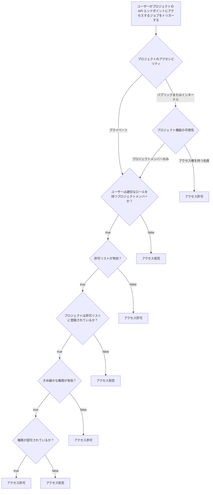

<!-- vale gitlab.FutureTense = NO -->

<div class="my-3 border-l-4 border-blue-500 bg-blue-50 px-4 py-3 rounded-r text-sm text-blue-800">
このページには今後予定されている製品・機能・機能性に関する情報が含まれています。ここに示す情報は参考目的のみです。購入・計画の決定にこの情報を使用しないでください。製品・機能・機能性の開発、リリース、タイミングは変更または延期される可能性があり、GitLab Inc. の独自の判断に委ねられています。
</div>

<div class="overflow-x-auto my-4">
<table class="w-full text-sm border-collapse">
<thead>
<tr class="bg-gray-100 text-left">
<th class="px-3 py-2 border border-gray-300">Status</th>
<th class="px-3 py-2 border border-gray-300">Authors</th>
<th class="px-3 py-2 border border-gray-300">Coach</th>
<th class="px-3 py-2 border border-gray-300">DRIs</th>
<th class="px-3 py-2 border border-gray-300">Owning Stage</th>
<th class="px-3 py-2 border border-gray-300">Created</th>
</tr>
</thead>
<tbody>
<tr>
<td class="px-3 py-2 border border-gray-300"><span class="inline-block rounded px-2 py-0.5 text-xs font-medium bg-gray-100 text-gray-700">proposed</span></td>
<td class="px-3 py-2 border border-gray-300"><a href="https://gitlab.com/alexbuijs" class="text-blue-600 hover:underline">@alexbuijs</a></td>
<td class="px-3 py-2 border border-gray-300"><a href="https://gitlab.com/grzesiek" class="text-blue-600 hover:underline">@grzesiek</a>, <a href="https://gitlab.com/fabiopitino" class="text-blue-600 hover:underline">@fabiopitino</a></td>
<td class="px-3 py-2 border border-gray-300"><a href="https://gitlab.com/jrandazzo" class="text-blue-600 hover:underline">@jrandazzo</a>, <a href="https://gitlab.com/jayswain" class="text-blue-600 hover:underline">@jayswain</a></td>
<td class="px-3 py-2 border border-gray-300"><span class="inline-block rounded px-2 py-0.5 text-xs font-medium bg-gray-100 text-gray-700">~govern::authorization</span></td>
<td class="px-3 py-2 border border-gray-300">2024-08-08</td>
</tr>
</tbody>
</table>
</div>


## 概要

GitLab CI はさまざまなジョブ・ビルド・パイプラインを実行するために広く使用されている継続的インテグレーションプラットフォームです。

各 CI ジョブには [CI Job トークン](https://docs.gitlab.com/ee/ci/jobs/ci_job_token.html)（一種のセキュリティトークン）が提供されており、タスクを実行するために他の GitLab API と連携できます。現在、このトークンはパイプラインをトリガーしたユーザーと同じレベルのアクセス権を持っており、[最小権限の原則（PoLP）](https://csrc.nist.gov/glossary/term/least_privilege)に違反しています。

この提案では、最小権限の原則に準拠しながら段階的に価値を提供するために、このトークンによって付与されるアクセス権を削減するための開発の概要を説明します。

## 動機

現在、CI ジョブが実行されると `CI_JOB_TOKEN` が提供され、ジョブはこれを使用して GitLab のリソースと連携します。このトークンは CI ジョブをトリガーしたユーザーのアイデンティティに紐付いており、そのユーザーのロールとアクセスレベルに基づく固定の権限セットを持ちます。

API リクエストに `CI_JOB_TOKEN` が含まれる場合、認可プロセスはパイプラインをトリガーしたユーザーのロールをチェックし、CI 許可リストルールを使用して API へのアクセスを制限します。ただし、`CI_JOB_TOKEN` のランタイムアクセスを計算するこの方法は、意図せず新しい API を公開してしまい、悪用のリスクを高める可能性があります。

CI Job トークン以外にもさまざまな種類のトークンをサポートしています。認可の動作はトークンの種類によって異なり、これらの違いにより新しい API エンドポイントが導入または変更されるときに実施のギャップが生じる可能性があります。

この提案では、別の種類の `CI_JOB_TOKEN` を導入します。今日使用されているさまざまなトークンの種類全体で適用できる可能性のある標準化された形式に従うことで、認可のプロセスをシンプルにします。

### 目標

この提案は、CI Job トークンを生成するための一貫した形式を確立し、アクセススコープのより細かな制御を可能にすることを目的としています。特に、各トークンに必要な最小限の権限を定義することで `CI_JOB_TOKEN` のスコープを制限することを目指しています。

- `CI_JOB_TOKEN` は一時的なものであり、必要最小限のアクセス権のみを付与するべきです。
- CI Job トークンが持てる権限はプロジェクトごとにカスタマイズ可能であるべきです。
- トークンは [`organization_id`](https://gitlab.com/gitlab-com/content-sites/handbook/-/merge_requests/8527) のようなフィールドの追加など、拡張をサポートするべきです。
- 現在の `CI_JOB_TOKEN` の動作は、破壊的変更ポリシーに従って保持されるべきです。

### 非目標

- [Security Token Service](https://datatracker.ietf.org/doc/html/rfc8693) は作成しません。
- `CI_JOB_TOKEN` のアクセス期間の短縮は焦点ではありません。
- [PAT スコープ](https://docs.gitlab.com/ee/user/profile/personal_access_tokens.html#personal-access-token-scopes)と[カスタムアビリティ](https://gitlab.com/gitlab-org/gitlab/-/tree/master/ee/config/custom_abilities)の統一は追求しません。
- [トークンの種類](https://docs.gitlab.com/ee/security/tokens/index.html)を単一のトークンに統合しません。
- `CI_JOB_TOKEN` の[権限セット](https://gitlab.com/gitlab-com/content-sites/handbook/-/merge_requests/7856)は拡張しません。
- 特定のプロジェクトがグループレベルの権限をオーバーライドできるケースは処理しません。

## 提案

このドキュメントでは、セキュリティを強化してリソースアクセスを細かく調整するための `CI_JOB_TOKEN` の処理変更を提案します。プロジェクトは CI Job トークンがアクセスできるリソースを指定できるようになります。アクセスはプロジェクト単位またはグループ単位で設定できます。

トークンの最終的な権限セットは、以下の 3 つのモデルの交差によって決まります:

- **Job トークンスコープ（許可リスト）:** トークンが付与できる最大許容アクセスを指定する境界として機能します。（Maintainer+ が設定）
- **きめ細かな権限:** トークンがアクセスできる許可されたリソースを指定します。（Maintainer+ が設定）
- **ユーザーロール:** ユーザーの全体的な権限を定義し、適切な監査可能性を確保し、保護ブランチと非保護ブランチなどの異なる環境や ref をサポートします。

トークンに付与されるアクセスの正確なレベルを決定するために、アクセスは段階的に絞り込まれます:

1. まず、許可リストに表示されるプロジェクトのみにアクセスを制限します。
1. 次に、許可リスト上の各プロジェクトに定義された権限に基づいてアクセスを制限します。
1. 最後に、ユーザーロールの権限がトークンアクセスを制限します。

### 提案された設計

きめ細かな権限は許可リストの拡張であるため、許可リストを適用するエンドポイントにのみきめ細かな権限を適用できます。許可リストは `route_settings :authentication` メタデータを使用するエンドポイントで適用されます:

```ruby
route_setting :authentication, job_token_allowed: true
```

きめ細かな権限は `route_settings :authorization` メタデータを使用します。例えば:

```ruby
route_setting :authorization, job_token_policies: :read_packages,
  allow_public_access_for_enabled_project_features: :package_registry
```

このメタデータがエンドポイントに定義されている場合、許可リストエントリで `Packages` リソースに少なくとも `Read` 権限が定義されている必要があることを示しています。

`allow_public_access_for_enabled_project_features` キーワードは、アクセスされるプロジェクトがパブリックまたはインターナルであり、指定されたプロジェクト機能の可視性が「アクセス権を持つ全員」に設定されている場合、きめ細かな権限を適用する必要がないことを示しています。

きめ細かな権限は、許可リストを適用するすべてのエンドポイントに適用されます。これは、パイプラインの静的分析の一部として実行され、変更をプッシュする際に実行される `ci:job_tokens:check_policies` rake タスクによって確保されます。同じスクリプトは、定義された権限が有効であることも確認します。

### 例

`user_a` が `project_a` と `project_b` の両方に Developer アクセスを持ち、`project_b` が許可リストときめ細かな権限の両方が有効なプライベートプロジェクトであるとします。

`user_a` は、`CI_JOB_TOKEN` で認証することで `project_a` から `project_b` のエンドポイントにアクセスするパイプラインをトリガーできます。例えば、`project_a/.gitlab-ci.yml` は次のようになるかもしれません:

```yaml
build-job:
  script:
    - 'curl -s https://gitlab.com/api/v4/projects/{project_b.id}/environments -H "JOB-TOKEN: $CI_JOB_TOKEN"'
```

この特定のエンドポイントは（`lib/api/environments.rb` 内で）次のように定義されています:

```ruby
route_setting :authentication, job_token_allowed: true
route_setting :authorization, job_token_policies: :read_environments,
 allow_public_access_for_enabled_project_features: [:repository, :builds, :environments]
get ':id/environments' do
  ...
```

これは、`user_a` が `project_a` でパイプラインをトリガーした場合、`project_b` で定義された `project_a` の許可リストエントリに `Environments` リソースが `Read` または `Read and write` 権限のいずれかに設定されていない限り、このジョブは失敗することを意味します。

### フローチャート

これはエンドポイントのアクセシビリティを決定するための意思決定を示すフローチャートです。



### 権限

現在きめ細かな権限で制御できるエンドポイントの完全なリストはこちらで確認できます: https://docs.gitlab.com/ci/jobs/fine_grained_permissions/#available-api-endpoints。このリストは次のコマンドを実行することで自動生成されます:

```shell
bundle exec rake ci:job_tokens:compile_docs
```

このリストは `ci:job_tokens:check_docs` rake タスクによって最新の状態に保たれることが確保されており、これは `ci:job_tokens:check_policies` rake タスクの一部に含まれ、パイプラインの `ci-job-token-policies-verify` ジョブで実行され、lefthook から変更をプッシュする際に実行されます。

## 代替ソリューション

- Security Token Service の構築
  - メリット: 標準準拠のソリューション
  - デメリット: 価値を実現する前に追加の事前作業とメンテナンスが必要
- [GitLab OAuth2 プロバイダー](https://docs.gitlab.com/ee/api/oauth2.html)への移行
  - メリット: 標準準拠のソリューション
  - デメリット: 価値を実現する前により多くの事前作業が必要
- 何もしない
  - メリット: 作業不要
  - デメリット: 詳細はこのドキュメントの動機セクションを参照
